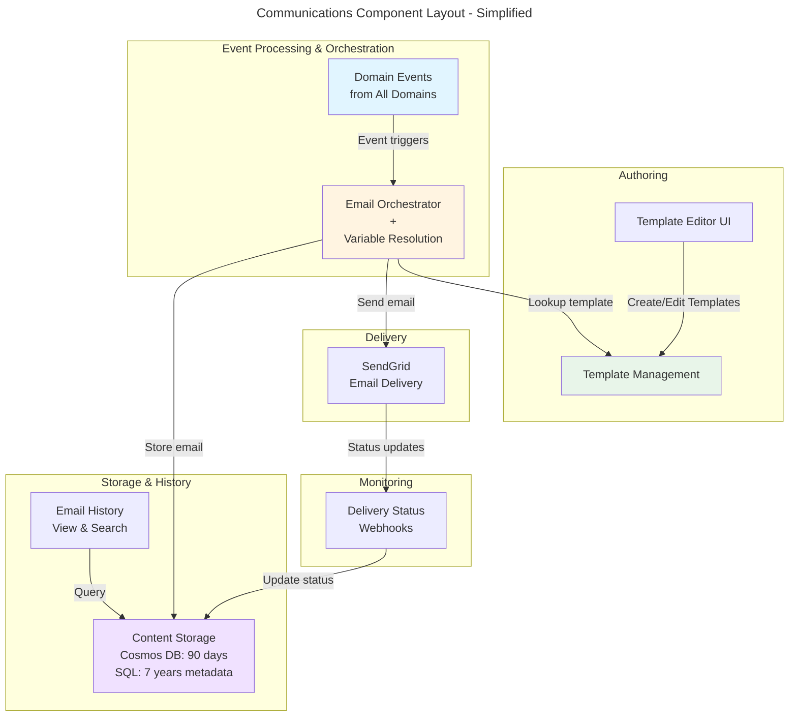
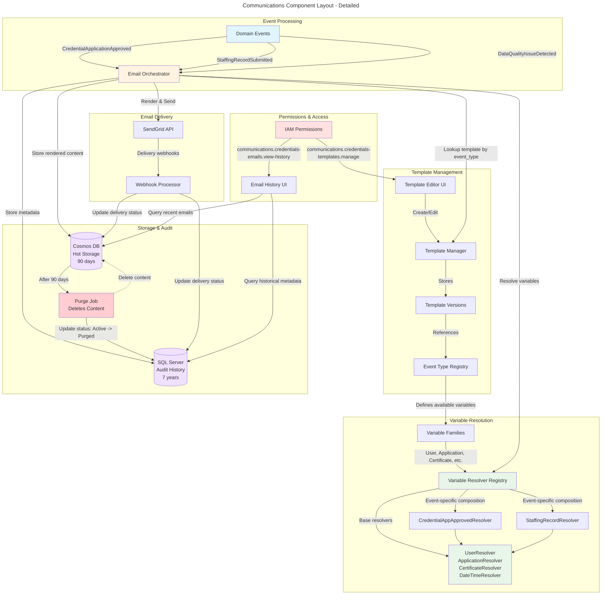
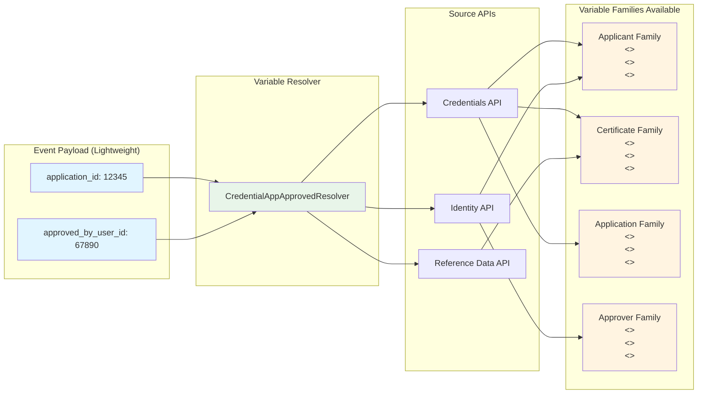
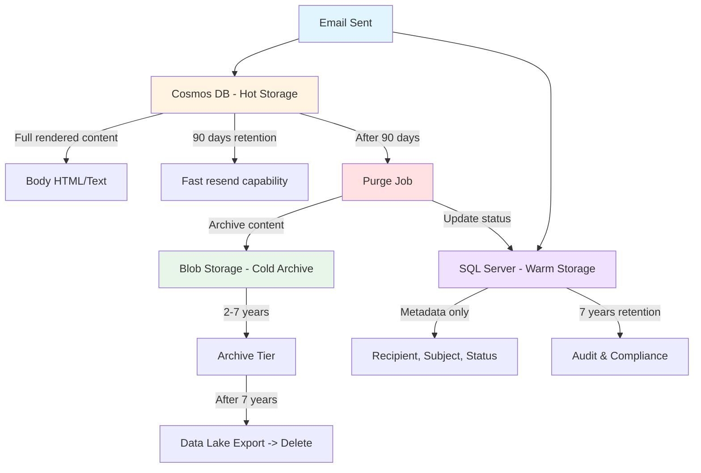

# Communications - Technical Design

## Purpose

This document provides technical design details for the Communications platform capability. It describes architecture decisions, component interactions, performance optimization strategies, and resilience patterns.

---

## System Architecture Overview

### High-Level Component Landscape

This diagram shows how the key components of the Communications capability interact, from template authoring through email delivery and audit retention.

Simplified view:


Detailed view: 


**Key Relationships:**
- **One template** -> **One event type** (1:1 relationship stored in template metadata)
- Event type determines which resolver is used
- Resolver defines which variable families are available
- Template can use ANY variables from available families
- Permissions scoped by functional area (e.g., `communications.credentials-templates.manage`)

### Component Responsibilities

**Email Orchestrator:**
- Receives domain events from Service Bus
- Looks up active template for event type
- Calls appropriate variable resolver
- Sends to SendGrid
- Stores EmailInstance in Cosmos DB and SQL

**Template Manager:**
- CRUD operations on EmailTemplate aggregate
- Enforces single active version rule
- Validates variable placeholders against event type schema
- Stores templates in SQL Server (structured data + version history)

**Variable Resolvers:**
- Event-type-specific classes that transform event payloads into display-ready values
- Each resolver knows which APIs to call and how to format the results
- Registry maps event types to resolver implementations

**Event Consolidator:**
- Groups events by recipient + event type within time window
- Uses Service Bus scheduled messages for durable buffering
- Triggers consolidated send when window closes

**Webhook Processor:**
- Receives SendGrid delivery status webhooks
- Validates HMAC signature
- Queues to Service Bus for async processing
- Updates EmailInstance delivery status

---

## Variable Resolution

### The Problem

Domain events are lightweight and carry only IDs:
```json
{
  "event_type": "CredentialApplicationApproved",
  "application_id": "12345",
  "approved_by_user_id": "67890",
  "approved_at": "2026-01-15T10:30:00Z"
}
```

Templates need user-facing text:
```
Dear <<ApplicantName>>,

Your application for <<CertificateType>> has been approved by <<ApproverName>> on <<ApprovalDate>>.
```

### The Solution: Variable Families

Each event type exposes multiple **variable families** based on the entities involved. A single ID in the event payload (e.g., `application_id`) unlocks an entire family of related variables.



**Process flow:**
1. Event arrives with minimal payload (`application_id`, `approved_by_user_id`)
2. Resolver identifies which variable families are available based on event type
3. Resolver fetches data from source APIs (with caching)
4. Resolver formats all variables in each family into display strings
5. Template can use ANY variable from available families

### Variable Family Structure

Variable families are defined per event type and exposed via API:

```typescript
interface VariableFamily {
  source_entity: string;        // "User", "Application", "Certificate"
  required_context: string[];   // ["user_id"] or ["application_id"]
  available_variables: Variable[];
}

interface Variable {
  name: string;                 // "ApplicantName"
  display_name: string;         // "Applicant Full Name"
  description: string;          // "Full name of the credential applicant"
  example_value: string;        // "Jane Doe"
  is_mandatory: boolean;        // true
  data_type: string;            // "string"
}
```

### Resolver Registry

Maps event types to resolver classes. When event arrives, orchestrator looks up resolver and calls `Resolve(eventPayload)`.

**Resolver Registration (at startup):**

```csharp
public class ResolverModule : IModule
{
    public void Load(IServiceCollection services)
    {
        var registry = new VariableResolverRegistry();
        
        // Register all resolvers
        registry.Register<CredentialApplicationApprovedResolver>();
        registry.Register<StaffingRecordSubmittedResolver>();
        registry.Register<DataQualityIssueDetectedResolver>();
        
        services.AddSingleton(registry);
    }
}
```

**Base Resolver Pattern:**

```csharp
public abstract class VariableResolverBase<TEvent> : IVariableResolver
{
    protected abstract string EventType { get; }
    protected abstract VariableFamily[] VariableFamilies { get; }
    
    public async Task<Dictionary<string, string>> Resolve(object evt)
    {
        var typedEvent = (TEvent)evt;
        
        // Fetch data from source APIs (with caching)
        var data = await FetchData(typedEvent);
        
        // Format all variables in all families
        return FormatVariables(data);
    }
    
    protected abstract Task<object> FetchData(TEvent evt);
    protected abstract Dictionary<string, string> FormatVariables(object data);
}
```

### Known Event Types and Their Variable Families

| Event Type | Variable Families | Primary Data Sources | Notes |
|------------|------------------|---------------------|-------|
| CredentialApplicationApproved | Applicant, Certificate, Application, Approver | Credentials API, Identity API | High volume |
| CredentialApplicationDenied | Applicant, Certificate, Application, Denier | Credentials API, Identity API | May include external comments |
| StaffingRecordSubmitted | Employee, District, Position, Submitter | Staffing API, Identity API, EEM | |
| DataQualityIssueDetected | Issues, AffectedRecords, District | Data Quality API, Staffing API | Consolidated (15min window) |
| PaymentDue | Payer, Certificate, Payment | Payments API, Credentials API | Time-sensitive (no consolidation) |
| UserAccountCreated | User, Account | Identity API | |
| EPPCohortEnrollment | Candidate, Cohort, Advisor | EPP API, Identity API | |
| ProfessionalLearningRegistration | Participant, Course, Session | PL API, Identity API | |

### Available Variables API

Backend exposes `/api/communications/event-types/{eventType}/variables` returning variable families with metadata.

**Example Response:**
```json
{
  "event_type": "CredentialApplicationApproved",
  "functional_area": "Credentialing",
  "variable_families": [
    {
      "source_entity": "Applicant",
      "required_context": ["application_id"],
      "available_variables": [
        {
          "name": "ApplicantName",
          "display_name": "Applicant Full Name",
          "description": "Full name of the credential applicant",
          "example_value": "Jane Doe",
          "is_mandatory": true,
          "data_type": "string"
        },
        {
          "name": "ApplicantEmail",
          "display_name": "Applicant Email",
          "description": "Email address of the applicant",
          "example_value": "jane.doe@example.com",
          "is_mandatory": false,
          "data_type": "string"
        }
      ]
    },
    {
      "source_entity": "Certificate",
      "required_context": ["application_id"],
      "available_variables": [
        {
          "name": "CertificateType",
          "display_name": "Certificate Type",
          "description": "Type of certificate being applied for",
          "example_value": "Elementary Education",
          "is_mandatory": true,
          "data_type": "string"
        }
      ]
    }
  ]
}
```

**Template editor UI uses this to:**
- Show autocomplete when typing `<<` (grouped by variable family)
- Validate that all placeholders match available variables
- Display examples for preview
- Warn if mandatory variables are missing

### Template Validation Flow

Before saving a template, the system validates all variable placeholders:

1. **Extract placeholders** from template content (regex: `<<(\w+)>>`)
2. **Lookup available variables** for the template's event type
3. **Check each placeholder** against available variables list
4. **Block save** if unknown variables found
5. **Warn** if mandatory variables missing (user can override)

**Validation happens:**
- On template save (blocking)
- On template activation (blocking)
- On manual email send (blocking)

### Variable Resolution Error Handling

| Scenario | Resolver Behavior | Email Orchestrator Response | User Impact |
|----------|------------------|----------------------------|-------------|
| Mandatory variable returns null | Throw `VariableResolutionException` | Block send, emit `EmailSendFailed` event | Template author alerted, event logged |
| Optional variable returns null | Return empty string "" | Continue with send | Email shows blank for that variable |
| API timeout (>5s) | Retry once, then throw | Block send after 2 attempts | Logged for monitoring |
| API returns 404 | Throw if mandatory, empty string if optional | Block if mandatory | Prevents sending with missing data |
| Formatting error | Log warning, use raw value | Continue with send | Technical value shown (e.g., "2026-01-15" instead of "January 15, 2026") |

### Caching Strategy

| Data Type | Cache Key Pattern | TTL | Rationale |
|-----------|------------------|-----|-----------|
| User profiles | `user:{user_id}` | 1 hour | Moderately stable, balance freshness vs load |
| Application details | `application:{app_id}` | 5 minutes | Changes during processing |
| Certificate types | `ref:cert_types` | 24 hours | Reference data, rarely changes |
| Organization hierarchy | `org:hierarchy` | 24 hours | Synced from EEM nightly |
| Resolved variables | `resolver:{event_type}:{event_payload_hash}` | 5 minutes | Same event often triggers multiple templates/alerts |

**Cache Location:** Redis cluster (shared across pods)

**Performance Targets:**
- Cache hit: <100ms p95
- Cache miss (single API call): <2 seconds p95
- Target hit rate: >80%

**Eviction:** LRU with TTL expiration

---

## Template Storage and Editing

### Storage Model

Templates stored in **SQL Server** (not Cosmos DB) because:
- Relational structure (template -> versions -> variables)
- Strong consistency required for "single active version" invariant
- Complex queries (search by functional area, filter by status)
- Version history audit trail

**Schema structure:**
- `EmailTemplate` (template_id, functional_area, **event_type**, name)
- `TemplateVersion` (version_id, template_id, version_number, subject, body_content, status)
- `TemplateVariableUsage` (template_id, variable_name, is_present_in_template)

**Event Type Mapping:**
The `event_type` field in `EmailTemplate` creates the binding between domain events and templates:

```sql
-- Template definition
INSERT INTO EmailTemplate (template_id, functional_area, event_type, name)
VALUES ('tmpl-123', 'Credentialing', 'CredentialApplicationApproved', 'Approval Notification');

-- When event arrives
SELECT * FROM EmailTemplate 
WHERE event_type = 'CredentialApplicationApproved' 
  AND status = 'Active'
LIMIT 1;
```

**Active Version Enforcement:**
- UNIQUE constraint on (template_id, status) where status = 'active'
- Activating new version triggers UPDATE to set previous active -> inactive
- Transaction ensures atomicity

### Template Editor Decision: Markdown with Custom Extensions

**Storage Format:** Markdown text in `body_content` column

**Authoring Experience:**
- Users type in Markdown syntax
- Extensions for common patterns: `:::alert{type=warning}`, `:::button{url=...}`
- Standard Markdown for headings, lists, bold, etc.
- Variable insertion via autocomplete when typing `<<`

**Rendering:**
- Backend converts Markdown -> HTML at send time
- Custom extension parser handles special blocks
- Variable substitution happens AFTER HTML conversion

**Security:**
- No user-provided HTML means no XSS attack surface
- Extensions are server-side controlled
- Variables are HTML-escaped during substitution

**Extensions Allowlist:**
- `:::alert{type=info|warning|error|success}` - Colored alert boxes
- `:::button{url=...}{text=...}` - Call-to-action buttons
- Standard Markdown (headings, lists, bold, italic, links)

**What's NOT allowed:**
- Raw HTML blocks
- Custom CSS or JavaScript
- `<iframe>`, `<object>`, `<embed>`

**Alternative Considered:** Visual WYSIWYG editor with HTML sanitization (rejected due to XSS complexity and noisy version diffs)

---

## Email Storage Architecture

### Dual-Retention Model



**Storage Strategy:**
- **Cosmos DB (Hot):** Full rendered content, 90-day retention, <100ms query time
- **SQL Server (Warm):** Metadata only, 7-year retention, ~500ms query time
- **Blob Storage (Cold):** Archived content, compliance retention, hours to retrieve
- **Email instance stores rendered output only** - NOT event payload or template structure

### Why Cosmos DB for Hot Storage?

**Requirements:**
- Dashboard "View Email" query must be <100ms p95
- Support 500 concurrent users browsing email history
- Flexible schema (email body is unstructured HTML/text)
- Burst traffic (1000 emails sent in 5 minutes, all query history immediately)

**Why not SQL Server for hot storage?**
- Large TEXT columns hurt query performance
- Harder to scale read replicas
- Row-level locking contention on updates (delivery status changes)

**Cosmos DB Advantages:**
- Document model fits unstructured content
- Automatic indexing on metadata fields
- Read-heavy workload optimization
- No schema migrations when adding fields

**Trade-offs:**
- Higher cost per GB vs SQL
- Eventual consistency (acceptable for email history)
- More complex queries (no JOINs)

### Partitioning Strategy

**Cosmos DB:** Partition key = `/functional_area`

**Why functional_area?**
- Most queries filter by functional area
- Even distribution (each area has similar volume)
- Aligns with RBAC (users typically query one area at time)

**NOT partition by recipient_email** because:
- Some users receive far more emails (hot partition)
- Cross-partition queries required for "show all emails sent today"

**SQL Server:** Monthly partitions on `sent_at` for lifecycle management and performance

---

## Event Processing and Delivery

### Email Send Flow

1. Domain publishes event to Service Bus topic
2. Communications service receives event, checks for existing EmailInstance (idempotency)
3. Look up active template for `event_type`
4. Resolve variables (call event-specific VariableResolver)
5. Substitute variables into template
6. Send to SendGrid
7. Store EmailInstance (Cosmos DB: full content, SQL: metadata only)

### Idempotency

**Problem:** Service Bus retries failed messages. Must not send duplicate emails.

**Solution:** Each event has globally unique `event_id`. Before processing, check if EmailInstance with `event_id` exists.

**Edge case:** If EmailInstance write fails after SendGrid send succeeds, Service Bus will retry and potentially send duplicate.

**Mitigation:** Accept rare duplicates for MVP (simpler), revisit if frequent

**Implementation:**
```csharp
public async Task Handle(DomainEvent evt)
{
    // Check for existing instance
    var existing = await _instanceRepo.GetByEventId(evt.EventId);
    if (existing != null)
    {
        _logger.Information("Duplicate event {EventId}, skipping", evt.EventId);
        return; // Idempotent - already processed
    }
    
    // Continue with send...
}
```

### Circuit Breaker for SendGrid

**Problem:** If SendGrid is down, retrying every event will overwhelm it when it recovers.

**Solution:** Circuit breaker with 3 states:

**Closed (Normal):** All requests attempted, track consecutive failures

**Open (SendGrid Down):** After 10 consecutive failures, fail immediately without calling SendGrid, messages stay in Service Bus queue, emit CRITICAL alert

**Half-Open (Testing Recovery):** After 5 minutes, allow 1 test request to check if SendGrid recovered

**Implementation:** In-memory state per pod, eventually all pods detect failure

---

## Event Consolidation

### The Problem

Data quality checks may detect 100 issues in 5 minutes. Sending 100 individual emails reduces recipient satisfaction and consumes unnecessary quota.

### The Solution

**Consolidation Window:** Buffer events for N minutes, then send 1 email summarizing all.

| Event Type                    | Window        | Max per Email |
| ----------------------------- | ------------- | ------------- |
| DataQualityIssueDetected      | 15 minutes    | 50            |
| StaffingRecordSubmitted       | 5 minutes     | 50            |
| PaymentDue                    | 0 (immediate) | N/A           |
| CredentialApplicationApproved | 0 (immediate) | N/A           |

### Implementation Using Service Bus Scheduled Messages

1. Event arrives -> Store in SQL ConsolidationBuffer table
2. Schedule Service Bus trigger message for `expires_at = NOW() + window`
3. When trigger arrives -> Query buffer, send consolidated email, clear buffer

**Edge Cases:**
- Pod restarts: Scheduled messages and SQL buffer are durable
- >50 events: Split into multiple emails

---

## SendGrid Webhook Processing

### Why Separate Webhook Receiver?

**Requirements:**
- Respond to SendGrid within 10 seconds
- Process thousands of webhooks during mass send
- Don't block main service with webhook traffic

**Solution:** Dedicated webhook receiver deployment

**Flow:** SendGrid -> Webhook Receiver Pod -> Service Bus Queue -> Main Service Pod -> Cosmos DB

**Webhook Receiver:** Validate HMAC signature, queue to Service Bus, respond 200 OK

**Main Service:** Dequeue, lookup EmailInstance, update delivery_status, publish event

### Webhook Payload Types

**Processed:** Email accepted by SendGrid, queued for delivery

**Delivered:** Email successfully delivered to recipient's mail server

**Bounced:** Email rejected (invalid address, mailbox full, etc.)
- Substatus examples: `invalid`, `mailbox_full`, `spam`

**Deferred:** Temporary failure, SendGrid will retry

**Dropped:** SendGrid rejected email before sending (e.g., unsubscribed, invalid template)

### Idempotency

SendGrid may send duplicate webhooks. Use `sg_event_id` as idempotency key.

```csharp
public async Task ProcessWebhook(WebhookEvent evt)
{
    // Check if already processed
    var processed = await _eventRepo.ExistsAsync(evt.SgEventId);
    if (processed)
    {
        return; // Already handled
    }
    
    // Continue processing...
    await _eventRepo.MarkProcessedAsync(evt.SgEventId);
}
```

### Orphaned Webhooks

**Problem:** Webhook arrives before EmailInstance is saved (race condition).

**Solution:**
- Log orphaned webhook
- Retry lookup after 30 seconds (scheduled Service Bus message)
- After 3 retries, alert admin
- Eventual consistency acceptable

**Why This Happens:** Cosmos DB eventual consistency + SendGrid processing speed

**Frequency:** Expected <0.1% of emails

---

## Email Content Archival

### Job Design

**Trigger:** Kubernetes CronJob, daily at 2:00 AM EST

**Process:**
1. Query Cosmos DB for emails sent >90 days ago with `content_status = Active`
2. Upload to Blob Storage (organized by year/month)
3. Update Cosmos: `content_status = Archived`, `blob_uri = {location}`
4. Retry failures up to 3 times, log and continue

**Reconciliation Detection:**
After purge job completes, run validation query:
```sql
-- Find orphaned records (Cosmos deleted but SQL not updated)
SELECT instance_id 
FROM EmailInstance (SQL)
WHERE content_status = 'Active'
  AND NOT EXISTS (
    SELECT 1 FROM CosmosDB.EmailContent 
    WHERE instance_id = EmailInstance.instance_id
  )
  AND sent_at < NOW() - 90 days;
```

**Why Blob Storage?**
- Cheapest option for long-term retention
- Lifecycle policies handle tier transitions automatically
- No query requirements

**Blob Lifecycle Policy:**
- 0-90 days: Not in Blob (still in Cosmos)
- 90 days-2yrs: Cool tier (cheaper, slower)
- 2-7 years: Archive tier (cheapest, hours to retrieve)
- 7+ years: Delete (after Data Lake export)

**Retrieval Process (if needed):**
- User requests archived email
- UI warns about retrieval time (up to 4 hours)
- Backend rehydrates blob from Archive tier
- Cached for 24 hours after retrieval

---

## Deployment Architecture

### Kubernetes Resources

**Deployments:**

**communications-service** (main application)
- Replicas: 2-10 (HPA based on CPU >70%, Memory >80%, Service Bus queue depth >1000)
- Resources: 500m-2 CPU, 1-4Gi RAM

**webhook-receiver** (SendGrid webhooks)
- Replicas: 2-5 (HPA based on CPU >70%, request rate >500/sec)
- Resources: 250m-1 CPU, 512Mi-2Gi RAM

**CronJobs:**

**email-archival-job**
- Schedule: `0 7 * * *` (2:00 AM EST)
- Concurrency: Forbid
- Resources: 1 CPU, 2Gi RAM
- Timeout: 2 hours

**Configuration:**

**ConfigMaps:** Consolidation windows, retention policies

**Secrets:** SendGrid API key, webhook signature key, Cosmos/SQL/Redis connection strings

---

## Performance Optimization

### Database Indexing

**Cosmos DB (Hot Storage):**
- Indexed: instance_id, functional_area, recipient_email, sent_at, delivery_status
- Excluded: body_html, body_text (large, never queried, hurts write performance)

**SQL Server (Warm Storage):**
- Covering indexes on common query patterns:
  - (functional_area, sent_at DESC)
  - (recipient_email, sent_at DESC)
  - (event_type, sent_at DESC)
- Monthly partitions for lifecycle management

### Caching

**Redis Cluster:**
- 3 nodes, replicated, 16 GB RAM per node
- Eviction: `allkeys-lru`

**Cache Keys and TTLs:**
- User profiles: 1 hour
- Application details: 5 minutes
- Reference data: 24 hours
- Resolver results: 5 minutes (avoid redundant API calls for same event data)

### SendGrid Rate Limiting

**Account Tier:** 10,000 requests/second (per `Interface Design document - SendGrid`, the State's negotiated DTMB messaging account — this is the confirmed limit; treat any lower figure elsewhere in this document as superseded)

**Implementation:**
- In-memory queue processes at 9,500 req/sec (5% safety margin)
- If queue exceeds 1000, pause Service Bus message consumption
- Backpressure released when queue drops below 500

**Why in-memory queue?**
- Service Bus already provides durable queue
- In-memory queue just smooths spikes
- If pod restarts, messages return to Service Bus

---

## Monitoring and Observability

### Key Metrics

**Email Operations:**
- `emails_sent_total` - Counter
- `emails_send_failures_total` - Counter by reason
- `emails_delivery_rate` - Gauge (delivered / sent)
- `emails_bounce_rate` - Gauge by bounce type

**Performance:**
- `variable_resolution_duration_seconds` - Histogram
- `cache_hit_rate` - Gauge by cache type
- `cosmos_ru_consumed` - Counter
- `sql_query_duration_seconds` - Histogram

**SendGrid Integration:**
- `sendgrid_api_duration_seconds` - Histogram
- `sendgrid_webhook_lag_seconds` - Histogram (event time to processing time)
- `sendgrid_circuit_breaker_state` - Gauge (0=closed, 1=open, 2=half-open)
- `sendgrid_rate_limit_errors_total` - Counter

### Alerting

**Critical:** 
- SendGrid circuit breaker open
- Email send failure rate >10% for 5 minutes
- Webhook processing lag >30 minutes

**High:** 
- Email send failure rate >5% for 10 minutes
- Variable resolution timeout >10% for 15 minutes
- Archival job failure rate >5%

**Medium:** 
- Service Bus dead letter queue >10 messages
- Webhook processing lag >5 minutes
- Cache hit rate <60% for 30 minutes

### Distributed Tracing

**Trace Propagation:** 
Domain Event -> Service Bus -> Email Orchestrator -> Variable Resolver -> SendGrid API -> Cosmos DB write

**Trace Context Standard:** W3C Trace Context

**Key Spans:**
- `email.send` - Overall send operation
- `template.lookup` - Template retrieval
- `variables.resolve` - Variable resolution (includes API calls)
- `sendgrid.api` - SendGrid API call
- `storage.write` - Cosmos + SQL writes

---

## Security Considerations

### API Key Management

**SendGrid API Key:**
- Stored in Kubernetes Secret (synced from Azure Key Vault)
- Rotation: Quarterly (automated)
- Never logged (even in DEBUG mode)
- Masked in exceptions and error messages

**Webhook Signature Verification:**
- HMAC SHA256 validation on all incoming webhooks
- Reject requests with invalid signature (401 Unauthorized)
- Signature key rotated with SendGrid API key

### Template Content Validation

**On Template Save:**
- Validate all variable placeholders against event type schema
- Reject unknown variables (400 Bad Request)
- Warn if mandatory variables missing (user can override)
- Check for required permissions (`communications.{area}-templates.manage`)

**On Email Send:**
- Verify template version is active
- Check mandatory variable resolution succeeded
- Block send if mandatory variables missing
- HTML-escape all variable values (prevent XSS)

### Data Access Controls

**Email History Queries:**
- Scoped by functional area permission
- Users can only view emails for areas they have access to
- Permission format: `communications.{area}-emails.view-history`

**Template Management:**
- Create/edit requires: `communications.{area}-templates.manage`
- Activate requires: `communications.{area}-templates.activate`
- Delete requires: communications.{area}-templates.delete
