# Credentialing - Workflows & Sequences

This document contains sequence diagrams for all workflows in the Credentialing domain.

**Conventions:**
- Solid arrows (`->>`) = Synchronous calls
- Dashed arrows (`-->>`) = Responses
- Dotted arrows (`--)`) = Async/fire-and-forget
- **actor** = Human or external system
- **participant** = Internal service/component

---

## Submit New Certificate Application

**What:** Educator submits an application for a new teaching, administrative, or specialist certificate  
**When:** Educator meets eligibility requirements and wants to obtain initial certification  
**Who:** Authenticated educator or admin submitting on educator's behalf

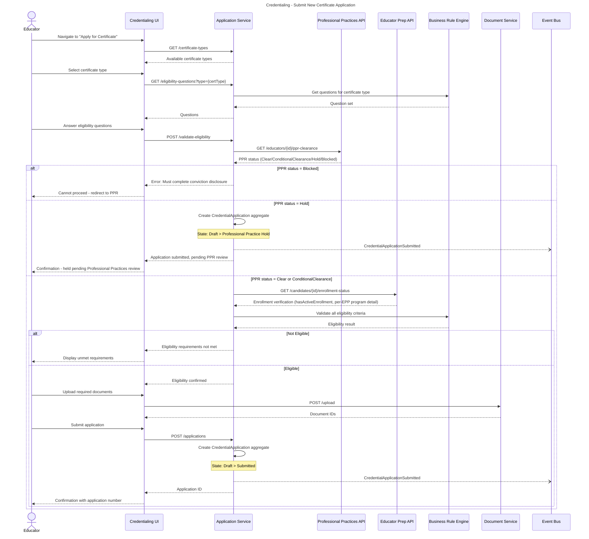
```mermaid
---
title: Credentialing - Submit New Certificate Application
---
sequenceDiagram
    actor Educator
    participant UI as Credentialing UI
    participant AppService as Application Service
    participant PPR as Professional Practices API
    participant EPP as Educator Prep API
    participant BRM as Business Rule Engine
    participant DocService as Document Service
    participant EventBus as Event Bus
    
    Educator->>UI: Navigate to "Apply for Certificate"
    UI->>AppService: GET /certificate-types
    AppService-->>UI: Available certificate types
    
    Educator->>UI: Select certificate type
    UI->>AppService: GET /eligibility-questions?type={certType}
    AppService->>BRM: Get questions for certificate type
    BRM-->>AppService: Question set
    AppService-->>UI: Questions
    
    Educator->>UI: Answer eligibility questions
    UI->>AppService: POST /validate-eligibility
    AppService->>PPR: GET /educators/{id}/ppr-clearance
    PPR-->>AppService: PPR status (Clear/ConditionalClearance/Hold/Blocked)
    
    alt PPR status = Blocked
        AppService-->>UI: Error: Must complete conviction disclosure
        UI-->>Educator: Cannot proceed - redirect to PPR
    else PPR status = Hold
        AppService->>AppService: Create CredentialApplication aggregate
        Note over AppService: State: Draft > Professional Practice Hold
        AppService--)EventBus: CredentialApplicationSubmitted
        AppService-->>UI: Application submitted, pending PPR review
        UI-->>Educator: Confirmation - held pending Professional Practices review
    else PPR status = Clear or ConditionalClearance
        AppService->>EPP: GET /candidates/{id}/enrollment-status
        EPP-->>AppService: Enrollment verification (hasActiveEnrollment, per-EPP program detail)
        AppService->>BRM: Validate all eligibility criteria
        BRM-->>AppService: Eligibility result
        
        alt Not Eligible
            AppService-->>UI: Eligibility requirements not met
            UI-->>Educator: Display unmet requirements
        else Eligible
            AppService-->>UI: Eligibility confirmed
            
            Educator->>UI: Upload required documents
            UI->>DocService: POST /upload
            DocService-->>UI: Document IDs
            
            Educator->>UI: Submit application
            UI->>AppService: POST /applications
            AppService->>AppService: Create CredentialApplication aggregate
            Note over AppService: State: Draft > Submitted
            
            AppService--)EventBus: CredentialApplicationSubmitted
            AppService-->>UI: Application ID
            UI-->>Educator: Confirmation with application number
        end
    end
```

**Key Decisions:**
- **PPR Status:** If status = `Blocked`, application is blocked entirely; if `Hold`, application is created but held pending Professional Practices review; `Clear` and `ConditionalClearance` both proceed to normal eligibility processing (`ConditionalClearance` is instead evaluated during auto-approval — see "Manual Review Triggering")
- **Eligibility:** BRM evaluates all criteria (degree, GPA, program enrollment, etc.)
- **Document Requirements:** Varies by certificate type and in-state vs out-of-state status

**State Changes:**
- CredentialApplication: `Draft` > `Submitted`, or `Draft` > `Professional Practice Hold` (if PPR status = `Hold`)

**Events Published:**
- `CredentialApplicationSubmitted` - Triggers payment link generation, external workflow routing evaluation

**Error Scenarios:**
- PPR status = `Blocked` > Block application, redirect to complete disclosure
- Eligibility not met > Display specific unmet requirements, do not create application
- Document upload fails > Allow retry, do not proceed to submission

---

## Submit Permit Application

**What:** A district/ISD/staffing-agency user submits an application for a temporary
teaching permit on behalf of an educator. This is the **standard, everyday intake path**
for all temporary permit types — per FDD 17's eight permit-family source documents,
educators never self-submit a permit application; they are only downstream recipients of
the payment link and status notifications. (Contrast with "Submit New Certificate
Application," where the educator is the primary self-service actor.)  
**When:** A school needs to place an individual who doesn't hold the applicable
certificate/endorsement into a teaching assignment.  
**Who:** User with `credentialing.permit.issue` permission at District/ISD scope (or the
appropriate Staffing Agency scope, pending resolution of
[client-questions.md #1](../../fdd-sdd-review/client-questions.md))

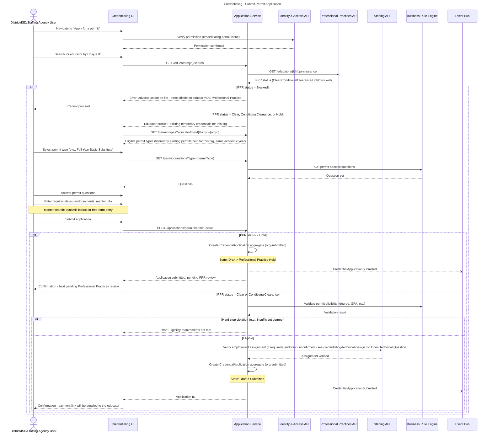
```mermaid
---
title: Credentialing - Submit Permit Application
---
sequenceDiagram
    actor Admin as District/ISD/Staffing Agency User
    participant UI as Credentialing UI
    participant AppService as Application Service
    participant IAM as Identity & Access API
    participant PPR as Professional Practices API
    participant Staffing as Staffing API
    participant BRM as Business Rule Engine
    participant EventBus as Event Bus

    Admin->>UI: Navigate to "Apply for a permit"
    UI->>IAM: Verify permission (credentialing.permit.issue)
    IAM-->>UI: Permission confirmed

    Admin->>UI: Search for educator by Unique ID
    UI->>AppService: GET /educators/{id}/search
    AppService->>PPR: GET /educators/{id}/ppr-clearance
    PPR-->>AppService: PPR status (Clear/ConditionalClearance/Hold/Blocked)

    alt PPR status = Blocked
        AppService-->>UI: Error: adverse action on file - direct district to contact MDE-Professional-Practice
        UI-->>Admin: Cannot proceed
    else PPR status = Clear, ConditionalClearance, or Hold
        AppService-->>UI: Educator profile + existing temporary credentials for this org
        UI->>AppService: GET /permit-types?educatorId={id}&orgId={orgId}
        AppService-->>UI: Eligible permit types (filtered by existing permits held for this org, same academic year)

        Admin->>UI: Select permit type (e.g., Full Year Basic Substitute)
        UI->>AppService: GET /permit-questions?type={permitType}
        AppService->>BRM: Get permit-specific questions
        BRM-->>AppService: Question set
        AppService-->>UI: Questions

        Admin->>UI: Answer permit questions
        Admin->>UI: Enter required dates, endorsements, mentor info

        Note over Admin,UI: Mentor search: dynamic lookup or free-form entry

        Admin->>UI: Submit application
        UI->>AppService: POST /applications/permits/admin-issue

        alt PPR status = Hold
            AppService->>AppService: Create CredentialApplication aggregate (org-submitted)
            Note over AppService: State: Draft > Professional Practice Hold
            AppService--)EventBus: CredentialApplicationSubmitted
            AppService-->>UI: Application submitted, pending PPR review
            UI-->>Admin: Confirmation - held pending Professional Practices review
        else PPR status = Clear or ConditionalClearance
            AppService->>BRM: Validate permit eligibility (degree, GPA, etc.)
            BRM-->>AppService: Validation result

            alt Hard stop violation (e.g., insufficient degree)
                AppService-->>UI: Error: Eligibility requirements not met
            else Eligible
                AppService->>Staffing: Verify employment assignment (if required) [endpoint unconfirmed - see credentialing-technical-design.md Open Technical Question #8]
                Staffing-->>AppService: Assignment verified

                AppService->>AppService: Create CredentialApplication aggregate (org-submitted)
                Note over AppService: State: Draft > Submitted

                AppService--)EventBus: CredentialApplicationSubmitted
                AppService-->>UI: Application ID
                UI-->>Admin: Confirmation - payment link will be emailed to the educator
            end
        end
    end
```

**Key Decisions:**
- **Permit Type:** Determines eligibility criteria and required documents; the eligible-permit list is filtered by what the submitting org already holds for this individual in the current academic year (e.g. Extended Daily only offered if a Daily Substitute permit already exists for the same org/individual/year — see `credentialing-domain.md`'s "Permit Duration and Renewal Limits")
- **PPR Status:** `Blocked` prevents application creation entirely (consistent with "Automatic Stop-Check on Application Creation"); `Hold` routes to "Professional Practice Hold" instead of immediate processing; `Clear` and `ConditionalClearance` both proceed to eligibility validation (`ConditionalClearance` is evaluated separately during auto-approval — see "Manual Review Triggering")
- **Hard Stops:** Certain violations (degree requirements, GPA) block submission immediately
- **No expedited/bypass path:** submission through this sequence always follows the standard payment/PPR/manual-review pipeline — nothing about admin submission itself skips a step. (This replaces the prior modeling, where admin submission was treated as an emergency/expedited exception; see "Issue Temporary Permit — Exceptional Cases (Admin)" below for why that framing was removed.)
- **Not yet modeled:** bulk submission (multiple educators/permits in one action) — FDD 11's bulk-renewal wireframes show this UI pattern for *renewals*; whether initial permit applications get the same bulk treatment isn't confirmed in the FDDs reviewed so far.

**State Changes:**
- CredentialApplication: `Draft` > `Submitted` (if PPR status = `Clear` or `ConditionalClearance`) or `Draft` > `Professional Practice Hold` (if PPR status = `Hold`); no application is created if PPR status = `Blocked`

**Events Published:**
- `CredentialApplicationSubmitted` - Triggers payment processing and external routing evaluation

**Error Scenarios:**
- Hard stop eligibility failure > Display error, do not create application
- PPR status = `Blocked` > Block application, redirect to complete disclosure
- PPR status = `Hold` > Application created but held pending Professional Practices review

---

## Issue Temporary Permit — Exceptional Cases (Admin)

> **Status: unconfirmed capability.** This sequence models an *expedited, bypass-payment,
> auto-approved* admin issuance path, distinct from the standard "Submit Permit
> Application" flow above. No FDD evidence found for this behavior: FDD 17's eight
> permit-family documents describe every permit type going through the standard
> payment-link/PPR/manual-review pipeline regardless of who submits, and FDD 11's bulk
> permit-renewal wireframes ("MiEdWorkforce-Bulk payments and Daily sub renewal.pdf")
> explicitly show even *bulk* admin-initiated renewals following the same pipeline — "an
> email has been sent to the educator with a link to pay," or "the application must be
> reviewed by OEE before it can be approved." Nothing bypasses. Prior to the "Submit
> Permit Application" rework above, this sequence's expedited/bypass behavior was the
> *only* admin permit-issuance path modeled — but that appears to have been an invented
> assumption, not something drawn from a source document. **Do not build this expedited
> behavior as specified below without confirming a genuine business need for it first**
> (internal call, not necessarily a client question — the team can decide whether to keep
> exploring this or drop it, since removing it doesn't lose the FDDs' actual described
> capability, which is now fully covered by "Submit Permit Application").

**What:** Authorized administrator issues a temporary permit outside the standard
application pipeline, bypassing payment and/or manual review  
**When:** Unconfirmed — no FDD source document reviewed so far describes a scenario
requiring this  
**Who:** User with `credentialing.permit.issue` permission at appropriate scope

```mermaid
---
title: Credentialing - Issue Temporary Permit - Exceptional Cases (Admin)
---
sequenceDiagram
    actor Admin
    participant UI as Credentialing Admin UI
    participant AppService as Application Service
    participant IAM as Identity & Access API
    participant PPR as Professional Practices API
    participant BRM as Business Rule Engine
    participant EventBus as Event Bus
    
    Admin->>UI: Navigate to "Issue Permit (Exceptional)"
    UI->>IAM: Verify permission (credentialing.permit.issue)
    IAM-->>UI: Permission confirmed
    
    Admin->>UI: Search for educator by Unique ID
    UI->>IAM: GET /users/search?uniqueId={id}
    IAM-->>UI: Educator profile
    
    Admin->>UI: Select permit type
    UI->>AppService: GET /permit-types
    AppService-->>UI: Permit types
    
    Admin->>UI: Complete permit application on behalf of educator
    Admin->>UI: Enter dates, endorsements, mentor, attestations
    
    Admin->>UI: Submit permit issuance
    UI->>AppService: POST /applications/permits/admin-issue/exceptional (NOT YET DEFINED in credentialing-api.yml - see status note above)
    
    AppService->>PPR: GET /educators/{id}/ppr-clearance
    PPR-->>AppService: PPR status (Clear/ConditionalClearance/Hold/Blocked)
    
    alt PPR status = Blocked
        AppService-->>UI: Cannot issue - PPR hold required
        UI-->>Admin: Display PPR block message
    else PPR status = Hold
        AppService-->>UI: Cannot expedite - must wait for Professional Practices clearance
        UI-->>Admin: Display PPR hold message; admin may create application via standard path instead
    else PPR status = Clear or ConditionalClearance
        AppService->>BRM: Validate permit requirements
        BRM-->>AppService: Validation result
        
        alt Requirements not met
            AppService-->>UI: Validation errors
            UI-->>Admin: Display specific violations
        else Requirements met
            AppService->>AppService: Create CredentialApplication (admin-submitted, exceptional)
            Note over AppService: State: Submitted > Approved (bypasses payment/workflow - unconfirmed)
            
            AppService->>AppService: Create IssuedCredential aggregate
            Note over AppService: State: Pending > Valid
            
            AppService--)EventBus: CredentialApplicationSubmitted
            AppService--)EventBus: CredentialIssued
            
            AppService-->>UI: Permit issued successfully
            UI-->>Admin: Confirmation with permit ID
        end
    end
```

**Key Decisions:**
- **Admin Authority:** Permission scope determines which educators the admin can issue permits for
- **PPR Override:** Admins cannot override `Blocked` or `Hold` PPR status via this path even in the exceptional flow; `Blocked` requires specialist routing, `Hold` may still be created via the standard permit-application path
- **Bypass behavior:** unconfirmed — see status note above. If retained, this should require a distinct, more restrictive permission or explicit justification capture (not just `credentialing.permit.issue`, which now also gates the standard, non-bypassing "Submit Permit Application" path) so that bypassing payment/review is itself an audited, deliberate act rather than an incidental side effect of which UI screen an admin happens to use.

**State Changes:**
- CredentialApplication: `Draft` > `Submitted` > `Approved` (bypasses payment/workflow - unconfirmed)
- IssuedCredential: `Pending` > `Valid`

**Events Published:**
- `CredentialApplicationSubmitted` - Audit trail
- `CredentialIssued` - Notifies downstream systems of new credential

**Error Scenarios:**
- PPR status = `Blocked` > Block issuance, require specialist review
- Eligibility validation fails > Display errors, allow admin to correct

---

## Add Endorsement to Certificate

**What:** Educator applies to add a subject area endorsement to their existing teaching certificate  
**When:** Educator has completed required coursework and subject area assessment for a new subject  
**Who:** Authenticated educator with valid teaching certificate

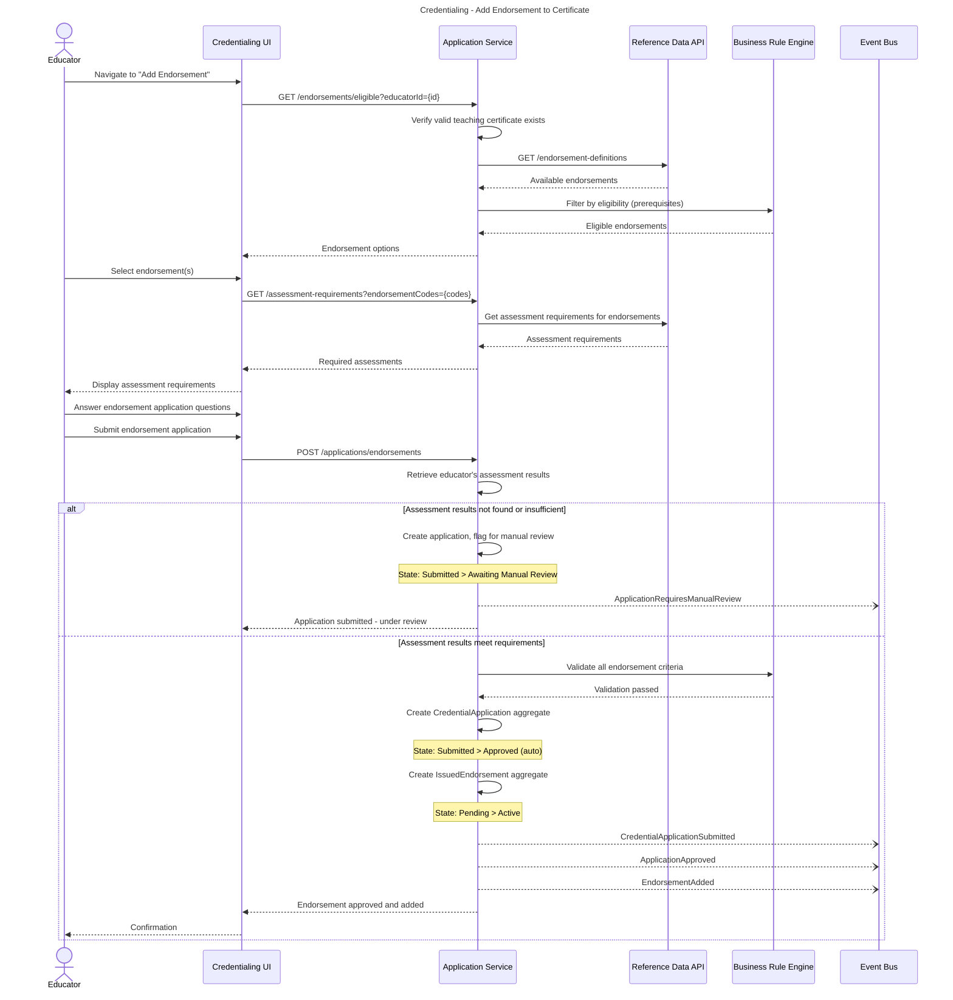
```mermaid
---
title: Credentialing - Add Endorsement to Certificate
---
sequenceDiagram
    actor Educator
    participant UI as Credentialing UI
    participant AppService as Application Service
    participant RefData as Reference Data API
    participant BRM as Business Rule Engine
    participant EventBus as Event Bus
    
    Educator->>UI: Navigate to "Add Endorsement"
    UI->>AppService: GET /endorsements/eligible?educatorId={id}
    AppService->>AppService: Verify valid teaching certificate exists
    AppService->>RefData: GET /endorsement-definitions
    RefData-->>AppService: Available endorsements
    AppService->>BRM: Filter by eligibility (prerequisites)
    BRM-->>AppService: Eligible endorsements
    AppService-->>UI: Endorsement options
    
    Educator->>UI: Select endorsement(s)
    UI->>AppService: GET /assessment-requirements?endorsementCodes={codes}
    AppService->>RefData: Get assessment requirements for endorsements
    RefData-->>AppService: Assessment requirements
    AppService-->>UI: Required assessments

    UI-->>Educator: Display assessment requirements
    
    Educator->>UI: Answer endorsement application questions
    Educator->>UI: Submit endorsement application
    UI->>AppService: POST /applications/endorsements
    
    AppService->>AppService: Retrieve educator's assessment results
    
    alt Assessment results not found or insufficient
        AppService->>AppService: Create application, flag for manual review
        Note over AppService: State: Submitted > Awaiting Manual Review
        AppService--)EventBus: ApplicationRequiresManualReview
        AppService-->>UI: Application submitted - under review
    else Assessment results meet requirements
        AppService->>BRM: Validate all endorsement criteria
        BRM-->>AppService: Validation passed
        
        AppService->>AppService: Create CredentialApplication aggregate
        Note over AppService: State: Submitted > Approved (auto)
        
        AppService->>AppService: Create IssuedEndorsement aggregate
        Note over AppService: State: Pending > Active
        
        AppService--)EventBus: CredentialApplicationSubmitted
        AppService--)EventBus: ApplicationApproved
        AppService--)EventBus: EndorsementAdded
        
        AppService-->>UI: Endorsement approved and added
        UI-->>Educator: Confirmation
    end
```

**Key Decisions:**
- **Assessment Validation:** If results don't meet requirements, flag for external manual review
- **Auto-Approval:** If all criteria met (assessment scores, prerequisites, payment), approve immediately
- **Multiple Endorsements:** User may apply for multiple endorsements in single application
- **No PPR Check:** Unlike new-certificate, permit, and renewal applications, endorsement-addition applications do not check `ProfessionalPracticeStatus`/PPR clearance at all — confirmed by FDD 29 ("29 - Educator Credentialing - Certificates"), whose Feature 29.3 (Additional Endorsements) narrative and acceptance criteria consistently omit "route based on PPR flag"/"Needs Responses" language that appears in every other application-type's feature description in the same document. This is a deliberate business-rule difference, not an oversight in this sequence — see `credentialing-domain.md`'s "Auto-Approval Criteria" business rule, which otherwise reads as if `ProfessionalPracticeStatus = Clear` is a universal condition for all `CredentialApplication` types.

**State Changes:**
- CredentialApplication: `Submitted` > `Approved` (auto) or `Awaiting Manual Review` (manual)
- IssuedEndorsement: `Pending` > `Active`

**Events Published:**
- `CredentialApplicationSubmitted` - Application created
- `ApplicationApproved` - Auto-approval occurred
- `EndorsementAdded` - New endorsement now active on certificate
- `ApplicationRequiresManualReview` - Manual review required by external workflow service

**Error Scenarios:**
- No valid teaching certificate > Block application, display error
- Assessment results insufficient > Flag for manual review, notify educator of review timeline

---

## Renew Credential

**What:** Educator renews an expiring certificate or permit  
**When:** Credential is approaching expiration or has expired (within grace period)  
**Who:** Authenticated educator with renewable credential

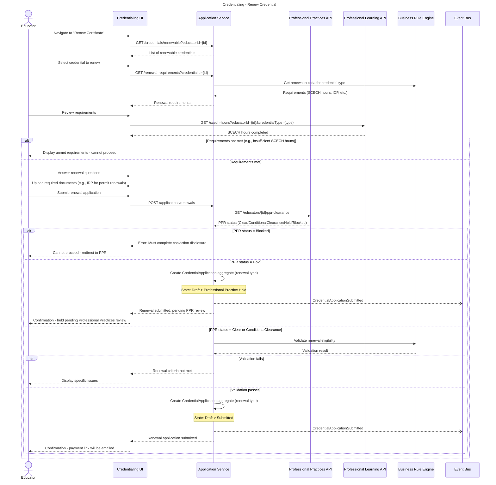
```mermaid
---
title: Credentialing - Renew Credential
---
sequenceDiagram
    actor Educator
    participant UI as Credentialing UI
    participant AppService as Application Service
    participant PPR as Professional Practices API
    participant ProfLearning as Professional Learning API
    participant BRM as Business Rule Engine
    participant EventBus as Event Bus
    
    Educator->>UI: Navigate to "Renew Certificate"
    UI->>AppService: GET /credentials/renewable?educatorId={id}
    AppService-->>UI: List of renewable credentials
    
    Educator->>UI: Select credential to renew
    UI->>AppService: GET /renewal-requirements?credentialId={id}
    AppService->>BRM: Get renewal criteria for credential type
    BRM-->>AppService: Requirements (SCECH hours, IDP, etc.)
    AppService-->>UI: Renewal requirements
    
    Educator->>UI: Review requirements
    UI->>ProfLearning: GET /scech-hours?educatorId={id}&credentialType={type}
    ProfLearning-->>UI: SCECH hours completed
    
    alt Requirements not met (e.g., insufficient SCECH hours)
        UI-->>Educator: Display unmet requirements - cannot proceed
    else Requirements met
        Educator->>UI: Answer renewal questions
        Educator->>UI: Upload required documents (e.g., IDP for permit renewals)
        Educator->>UI: Submit renewal application
        
        UI->>AppService: POST /applications/renewals
        AppService->>PPR: GET /educators/{id}/ppr-clearance
        PPR-->>AppService: PPR status (Clear/ConditionalClearance/Hold/Blocked)

        alt PPR status = Blocked
            AppService-->>UI: Error: Must complete conviction disclosure
            UI-->>Educator: Cannot proceed - redirect to PPR
        else PPR status = Hold
            AppService->>AppService: Create CredentialApplication aggregate (renewal type)
            Note over AppService: State: Draft > Professional Practice Hold
            AppService--)EventBus: CredentialApplicationSubmitted
            AppService-->>UI: Renewal submitted, pending PPR review
            UI-->>Educator: Confirmation - held pending Professional Practices review
        else PPR status = Clear or ConditionalClearance
            AppService->>BRM: Validate renewal eligibility
            BRM-->>AppService: Validation result

            alt Validation fails
                AppService-->>UI: Renewal criteria not met
                UI-->>Educator: Display specific issues
            else Validation passes
                AppService->>AppService: Create CredentialApplication aggregate (renewal type)
                Note over AppService: State: Draft > Submitted

                AppService--)EventBus: CredentialApplicationSubmitted
                AppService-->>UI: Renewal application submitted
                UI-->>Educator: Confirmation - payment link will be emailed
            end
        end
    end
```

**Key Decisions:**
- **Renewal Eligibility:** System checks if credential is renewable (not suspended/revoked, within renewal window)
- **PPR Status:** Same gating as new-certificate/permit submission — `Blocked` prevents the renewal from being created at all; `Hold` creates the renewal but holds it pending Professional Practices review; `Clear`/`ConditionalClearance` proceed to BRM eligibility validation. Added 2026-08-27 per FDD 29's "Apply/Renew" landing-page action, which treats new applications and renewals as the same flow and lists "Route or assign the application to worklist(s) based on the PPR flag" and "Determine the status of the application based on the Needs Responses flag" identically for both — this sequence previously had no PPR check at all, unlike "Submit New Certificate Application" and "Submit Permit Application."
- **SCECH Requirements:** Professional Learning domain provides hours completed; renewal blocked if insufficient. **Open item (2026-08-27):** the `GET /scech-hours?educatorId={id}&credentialType={type}` call shown above has no matching endpoint in `proflearning-api.yml` — `proflearning-domain.md`'s own Downstream dependency table instead expects Credentialing to maintain a running SCECH balance via event subscription (`AttendanceCertified`, `SCECHAwardAdjusted`, `CollegeCourseApplied`) rather than a live query. See [14-professional-learning-admin](../../fdd-sdd-review/reviews/14-professional-learning-admin.md) Discrepancy #1.
- **Document Requirements:** Some permit renewals require IDP or other proof of progress. **Open item (2026-08-27):** this document-upload treatment conflicts with `credentialing-domain.md`'s "Individual Development Plan (IDP) for Permit Renewals" rule, which describes a structured `GET /educators/{uniqueId}/idp/status` validation call — an endpoint that doesn't exist, on a domain (`proflearning`) with no IDP aggregate at all. See same review, Discrepancy #1.

**State Changes:**
- CredentialApplication: `Draft` > `Submitted`, or `Draft` > `Professional Practice Hold` (if PPR status = `Hold`)

**Events Published:**
- `CredentialApplicationSubmitted` - Triggers payment processing and external routing

**Error Scenarios:**
- Credential not renewable (suspended/revoked) > Display error, suggest new application
- PPR status = `Blocked` > Block renewal, redirect to complete disclosure
- SCECH hours insufficient > Block submission, display shortfall
- Renewal window expired > Display error, may require new application instead

---

## Application Auto-Approval

**What:** System automatically approves application when all business rules are satisfied  
**When:** Application submitted and all validation checks pass (PPR clear, payment received, documents complete, assessment results verified)  
**Who:** System process

```mermaid
---
title: Credentialing - Application Auto-Approval
---
sequenceDiagram
    participant EventBus as Event Bus
    participant AppService as Application Service
    participant PPR as Professional Practices API
    participant Payments as Payments API
    participant BRM as Business Rule Engine
    participant DocService as Document Service
    
    EventBus->>AppService: CredentialApplicationSubmitted event
    AppService->>AppService: Load CredentialApplication aggregate
    
    AppService->>PPR: GET /educators/{id}/ppr-clearance
    PPR-->>AppService: PPR status (Clear/ConditionalClearance/Hold/Blocked)
    
    alt PPR status = Hold or Blocked
        AppService->>AppService: Set status to Professional Practice Hold
        Note over AppService: State: Submitted > Professional Practice Hold
        AppService--)EventBus: ApplicationRequiresManualReview
    else PPR status = ConditionalClearance
        AppService->>AppService: Flag for manual review (cannot auto-approve); set felony acknowledgment requirement if indicated
        Note over AppService: State: Submitted > Awaiting Manual Review
        AppService--)EventBus: ApplicationRequiresManualReview
    else PPR status = Clear
        AppService->>AppService: Check locally cached PaymentStatus (NOTE: not yet resolved which endpoint/event backs this - see below)
        
        alt Payment not received
            AppService->>AppService: Update status
            Note over AppService: State: Submitted > Pending Payment
            Note over AppService: Wait for PaymentCompleted event (payments-capability.md), not the previously-referenced PaymentReceived, which does not exist
        else Payment received
            AppService->>DocService: GET /documents?applicationId={id}
            DocService-->>AppService: Document verification
            
            alt Required documents missing
                AppService->>AppService: Update status
                Note over AppService: State: Submitted > Pending Documents
            else Documents complete
                AppService->>BRM: Validate all business rules
                BRM-->>AppService: Validation result
                
                alt Assessment results or other validation fails
                    AppService->>AppService: Flag for manual review
                    Note over AppService: State: Submitted > Awaiting Manual Review
                    AppService--)EventBus: ApplicationRequiresManualReview
                else All validations pass
                    AppService->>AppService: Auto-approve application
                    Note over AppService: State: Submitted > Approved
                    
                    AppService->>AppService: Create IssuedCredential aggregate
                    Note over AppService: State: Pending > Valid
                    
                    AppService--)EventBus: ApplicationApproved
                    AppService--)EventBus: CredentialIssued
                end
            end
        end
    end
```

**Key Decisions:**
- **PPR Check:** First gate - `Hold` or `Blocked` status triggers Professional Practice Hold; `ConditionalClearance` cannot auto-approve and always routes to manual review (with felony acknowledgment requirement if applicable), even though the application isn't held; only `Clear` proceeds to payment/document/business-rule validation for possible auto-approval
- **Payment Check:** Second gate - no payment means "Pending Payment" status. **Unresolved:** the endpoint/mechanism for checking current payment status isn't confirmed — `payments-api.yml` has no internal-service "get payment status for an application" endpoint; the closest is `GET /payments/search?applicationId={id}`, but that's a scoped, permission-gated, org-context-requiring search endpoint built for admin/UI use, not obviously suited to service-to-service polling. This gate may need to rely purely on the `PaymentCompleted` event subscription (no synchronous check at all) rather than inventing a call to an endpoint not built for this purpose — see `credentialing-technical-design.md` Open Technical Question #7.
- **Document Check:** Third gate - missing docs means "Pending Documents" status
- **Business Rules:** Final gate - assessment results, eligibility, etc. If any fail, flag for manual review

**State Changes:**
- CredentialApplication: `Submitted` > `Approved` (happy path) or `Pending Payment` / `Pending Documents` / `Awaiting Manual Review` / `Professional Practice Hold`
- IssuedCredential: `Pending` > `Valid` (when approved)

**Events Published:**
- `ApplicationApproved` - Application auto-approved
- `CredentialIssued` - Credential created and now valid
- `ApplicationRequiresManualReview` - Manual review required (application becomes visible via Credentialing's own filtered application list)

**Error Scenarios:**
- Any validation failure > Set appropriate status or flag for external manual review

---

## Application Manual Review and Approval

**What:** Credential processor reviews application and takes action (approve/deny/hold)  
**When:** Application flagged for manual review due to PPR status, assessment failure, or other manual review trigger  
**Who:** Credential processor, working the flagged-application list through Credentialing's own list/detail/approve/deny endpoints

**Note:** This sequence represents a processor's reviewer UI querying Credentialing's own filtered application list and detail endpoints, then acting via the existing approve/deny/hold endpoints — not a separate workflow or worklist system. (See `credentialing-domain.md` Open Question #34 for the unresolved question of whether reviewer-to-application assignment needs its own design beyond this filtered-list pattern.)

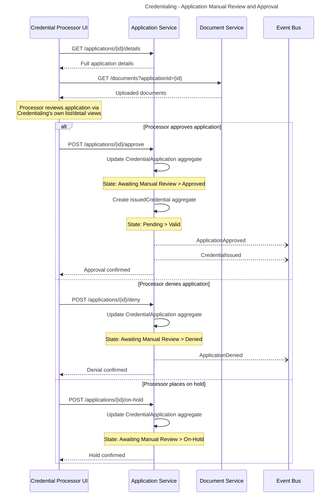
```mermaid
---
title: Credentialing - Application Manual Review and Approval
---
sequenceDiagram
    participant ProcessorUI as Credential Processor UI
    participant AppService as Application Service
    participant DocService as Document Service
    participant EventBus as Event Bus
    
    ProcessorUI->>AppService: GET /applications/{id}/details
    AppService-->>ProcessorUI: Full application details
    
    ProcessorUI->>DocService: GET /documents?applicationId={id}
    DocService-->>ProcessorUI: Uploaded documents
    
    Note over ProcessorUI: Processor reviews application via<br/>Credentialing's own list/detail views
    
    alt Processor approves application
        ProcessorUI->>AppService: POST /applications/{id}/approve
        AppService->>AppService: Update CredentialApplication aggregate
        Note over AppService: State: Awaiting Manual Review > Approved
        
        AppService->>AppService: Create IssuedCredential aggregate
        Note over AppService: State: Pending > Valid
        
        AppService--)EventBus: ApplicationApproved
        AppService--)EventBus: CredentialIssued
        
        AppService-->>ProcessorUI: Approval confirmed
        
    else Processor denies application
        ProcessorUI->>AppService: POST /applications/{id}/deny
        AppService->>AppService: Update CredentialApplication aggregate
        Note over AppService: State: Awaiting Manual Review > Denied
        
        AppService--)EventBus: ApplicationDenied
        
        AppService-->>ProcessorUI: Denial confirmed
        
    else Processor places on hold
        ProcessorUI->>AppService: POST /applications/{id}/on-hold
        AppService->>AppService: Update CredentialApplication aggregate
        Note over AppService: State: Awaiting Manual Review > On-Hold
        
        AppService-->>ProcessorUI: Hold confirmed
    end
```

**Key Decisions:**
- **Approve:** Credential issued immediately, educator notified
- **Deny:** Application rejected, educator notified with reason
- **On-Hold:** Application remains flagged in the application list for follow-up

**State Changes:**
- CredentialApplication: `Awaiting Manual Review` > `Approved` / `Denied` / `On-Hold`
- IssuedCredential: `Pending` > `Valid` (if approved)

**Events Published:**
- `ApplicationApproved` - Manual approval
- `ApplicationDenied` - Manual denial
- `CredentialIssued` - Credential created and valid

**Error Scenarios:**
- Application already processed > Display conflict error

---

## Suspend or Revoke Credential

**What:** Administrator suspends or permanently revokes an educator's credential  
**When:** Professional misconduct, legal issues, or compliance violations identified  
**Who:** User with `credentialing.credential.suspend` or `credentialing.credential.revoke` permission (System Admin)

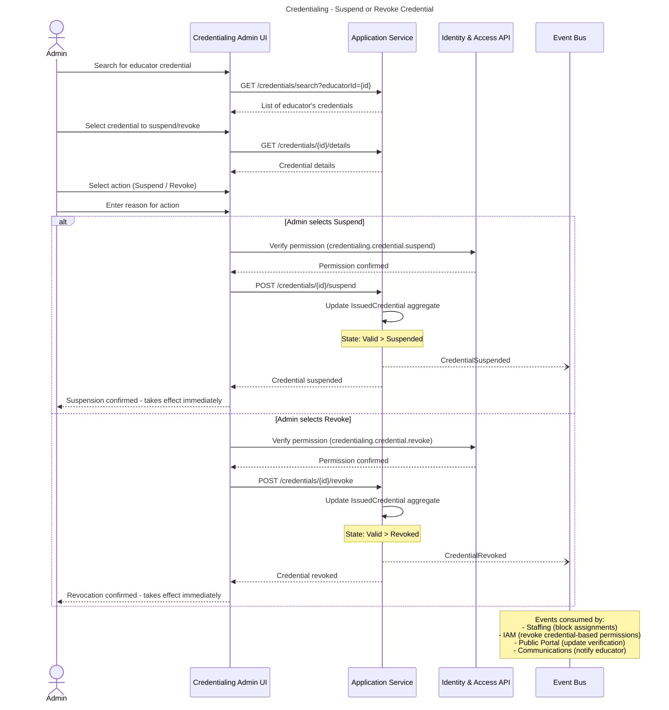
```mermaid
---
title: Credentialing - Suspend or Revoke Credential
---
sequenceDiagram
    actor Admin
    participant UI as Credentialing Admin UI
    participant AppService as Application Service
    participant IAM as Identity & Access API
    participant EventBus as Event Bus
    
    Admin->>UI: Search for educator credential
    UI->>AppService: GET /credentials/search?educatorId={id}
    AppService-->>UI: List of educator's credentials
    
    Admin->>UI: Select credential to suspend/revoke
    UI->>AppService: GET /credentials/{id}/details
    AppService-->>UI: Credential details
    
    Admin->>UI: Select action (Suspend / Revoke)
    Admin->>UI: Enter reason for action
    
    alt Admin selects Suspend
        UI->>IAM: Verify permission (credentialing.credential.suspend)
        IAM-->>UI: Permission confirmed
        
        UI->>AppService: POST /credentials/{id}/suspend
        AppService->>AppService: Update IssuedCredential aggregate
        Note over AppService: State: Valid > Suspended
        
        AppService--)EventBus: CredentialSuspended
        
        AppService-->>UI: Credential suspended
        UI-->>Admin: Suspension confirmed - takes effect immediately
        
    else Admin selects Revoke
        UI->>IAM: Verify permission (credentialing.credential.revoke)
        IAM-->>UI: Permission confirmed
        
        UI->>AppService: POST /credentials/{id}/revoke
        AppService->>AppService: Update IssuedCredential aggregate
        Note over AppService: State: Valid > Revoked
        
        AppService--)EventBus: CredentialRevoked
        
        AppService-->>UI: Credential revoked
        UI-->>Admin: Revocation confirmed - takes effect immediately
    end
    
    Note over EventBus: Events consumed by:<br/>- Staffing (block assignments)<br/>- IAM (revoke credential-based permissions)<br/>- Public Portal (update verification)<br/>- Communications (notify educator)
```

**Key Decisions:**
- **Suspend vs. Revoke:** Suspension is temporary (can be reinstated), revocation is permanent
- **Immediate Effect:** State change must propagate to all systems as quickly as possible

**State Changes:**
- IssuedCredential: `Valid` > `Suspended` or `Revoked`

**Events Published:**
- `CredentialSuspended` - Credential temporarily invalidated
- `CredentialRevoked` - Credential permanently invalidated

**Error Scenarios:**
- Admin lacks permission > Access denied
- Credential already suspended/revoked > Display current state, prevent duplicate action

---

## Nullify Endorsement

**What:** Administrator removes an endorsement from an educator's certificate  
**When:** Administrative error correction or compliance action  
**Who:** User with `credentialing.endorsement.nullify` permission (System Admin)

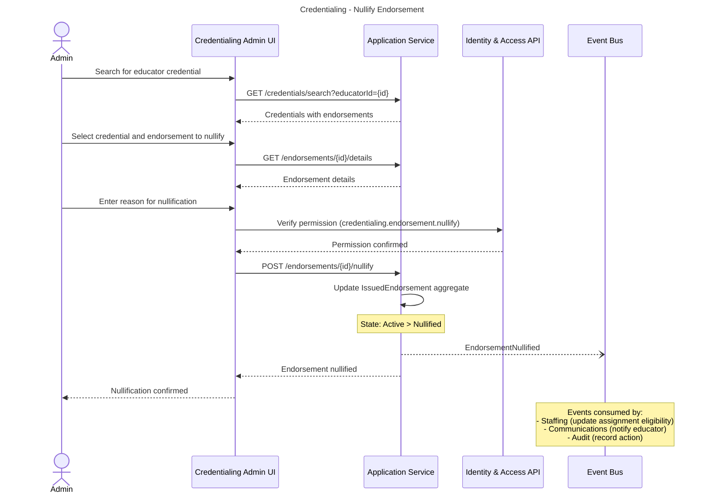
```mermaid
---
title: Credentialing - Nullify Endorsement
---
sequenceDiagram
    actor Admin
    participant UI as Credentialing Admin UI
    participant AppService as Application Service
    participant IAM as Identity & Access API
    participant EventBus as Event Bus
    
    Admin->>UI: Search for educator credential
    UI->>AppService: GET /credentials/search?educatorId={id}
    AppService-->>UI: Credentials with endorsements
    
    Admin->>UI: Select credential and endorsement to nullify
    UI->>AppService: GET /endorsements/{id}/details
    AppService-->>UI: Endorsement details
    
    Admin->>UI: Enter reason for nullification
    UI->>IAM: Verify permission (credentialing.endorsement.nullify)
    IAM-->>UI: Permission confirmed
    
    UI->>AppService: POST /endorsements/{id}/nullify
    AppService->>AppService: Update IssuedEndorsement aggregate
    Note over AppService: State: Active > Nullified
    
    AppService--)EventBus: EndorsementNullified
    
    AppService-->>UI: Endorsement nullified
    UI-->>Admin: Nullification confirmed
    
    Note over EventBus: Events consumed by:<br/>- Staffing (update assignment eligibility)<br/>- Communications (notify educator)<br/>- Audit (record action)
```

**Key Decisions:**
- **Nullification Reason:** Required for audit trail and educator notification

**State Changes:**
- IssuedEndorsement: `Active` > `Nullified`

**Events Published:**
- `EndorsementNullified` - Endorsement removed from certificate

**Error Scenarios:**
- Admin lacks permission > Access denied
- Endorsement already nullified > Display current state

---

## Bulk Renewal Initiation

**What:** Administrator initiates renewal process for multiple educators at once  
**When:** Annual renewal cycle or targeted renewal for specific credential types  
**Who:** User with `credentialing.application.manual-submit` permission

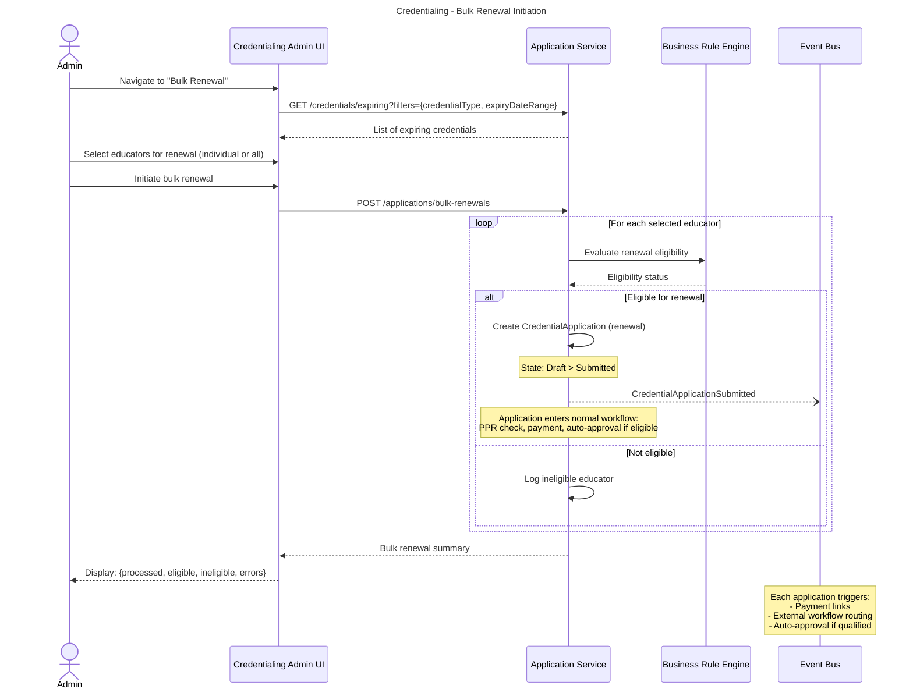
```mermaid
---
title: Credentialing - Bulk Renewal Initiation
---
sequenceDiagram
    actor Admin
    participant UI as Credentialing Admin UI
    participant AppService as Application Service
    participant BRM as Business Rule Engine
    participant EventBus as Event Bus
    
    Admin->>UI: Navigate to "Bulk Renewal"
    UI->>AppService: GET /credentials/expiring?filters={credentialType, expiryDateRange}
    AppService-->>UI: List of expiring credentials
    
    Admin->>UI: Select educators for renewal (individual or all)
    Admin->>UI: Initiate bulk renewal
    
    UI->>AppService: POST /applications/bulk-renewals
    
    loop For each selected educator
        AppService->>BRM: Evaluate renewal eligibility
        BRM-->>AppService: Eligibility status
        
        alt Eligible for renewal
            AppService->>AppService: Create CredentialApplication (renewal)
            Note over AppService: State: Draft > Submitted
            AppService--)EventBus: CredentialApplicationSubmitted
            Note over AppService: Application enters normal workflow:<br/>PPR check, payment, auto-approval if eligible
        else Not eligible
            AppService->>AppService: Log ineligible educator
        end
    end
    
    AppService-->>UI: Bulk renewal summary
    UI-->>Admin: Display: {processed, eligible, ineligible, errors}
    
    Note over EventBus: Each application triggers:<br/>- Payment links<br/>- External workflow routing<br/>- Auto-approval if qualified
```

**Key Decisions:**
- **Eligibility Filtering:** BRM evaluates PPR status, payment status, etc.
- **Workflow Routing:** Each renewal enters normal application workflow (may auto-approve or flag for external review)

**State Changes:**
- CredentialApplication: `Draft` > `Submitted` (for each eligible educator)

**Events Published:**
- `CredentialApplicationSubmitted` - One event per renewal initiated

**Error Scenarios:**
- Educator ineligible (PPR status, etc.) > Skip, log in summary
- System error during processing > Rollback batch, display error

---

## Print Certificate

**What:** Educator or administrator prints an official credential certificate  
**When:** Credential issued or renewed, educator needs physical copy  
**Who:** Authenticated educator (self) or admin with `credentialing.credential.print` permission

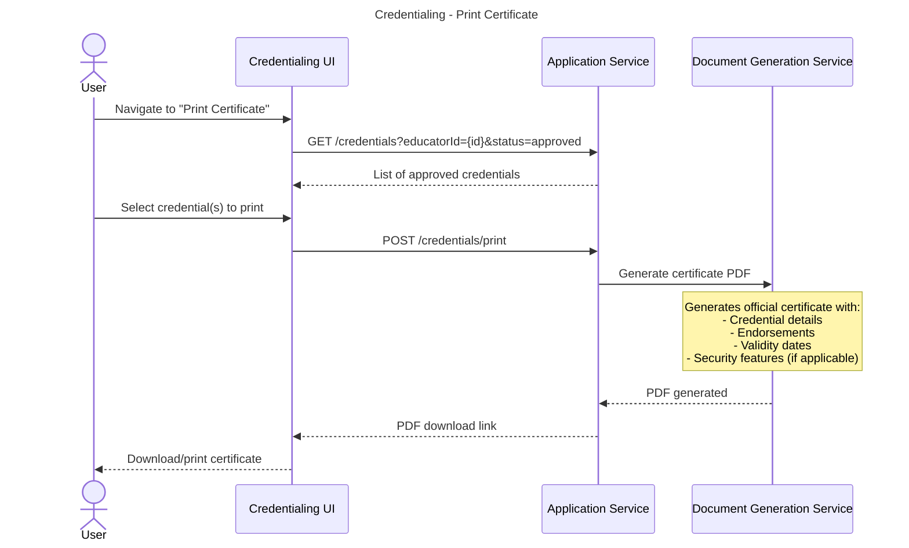
```mermaid
---
title: Credentialing - Print Certificate
---
sequenceDiagram
    actor User
    participant UI as Credentialing UI
    participant AppService as Application Service
    participant PrintService as Document Generation Service
    
    User->>UI: Navigate to "Print Certificate"
    UI->>AppService: GET /credentials?educatorId={id}&status=approved
    AppService-->>UI: List of approved credentials
    
    User->>UI: Select credential(s) to print
    UI->>AppService: POST /credentials/print
    AppService->>PrintService: Generate certificate PDF
    
    Note over PrintService: Generates official certificate with:<br/>- Credential details<br/>- Endorsements<br/>- Validity dates<br/>- Security features (if applicable)
    
    PrintService-->>AppService: PDF generated
    AppService-->>UI: PDF download link
    UI-->>User: Download/print certificate
```

**Key Decisions:**
- **Security Features:** Certificates may include watermarks, security codes, or other anti-fraud measures
- **Multiple Selection:** User can print multiple certificates in batch

**State Changes:**
- None (read-only operation)

**Events Published:**
- None (audit log may record print action)

**Error Scenarios:**
- No approved credentials > Display message
- PDF generation fails > Retry, display error

---

## Delete Pending Application

**What:** Educator deletes their own application before processing begins  
**When:** Educator submitted application but wants to withdraw before review  
**Who:** Authenticated educator (self-only)

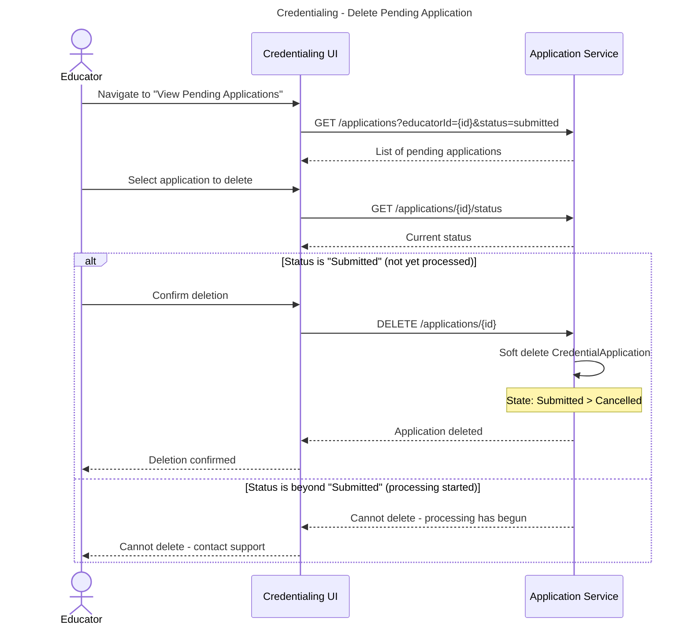
```mermaid
---
title: Credentialing - Delete Pending Application
---
sequenceDiagram
    actor Educator
    participant UI as Credentialing UI
    participant AppService as Application Service
    
    Educator->>UI: Navigate to "View Pending Applications"
    UI->>AppService: GET /applications?educatorId={id}&status=submitted
    AppService-->>UI: List of pending applications
    
    Educator->>UI: Select application to delete
    UI->>AppService: GET /applications/{id}/status
    AppService-->>UI: Current status
    
    alt Status is "Submitted" (not yet processed)
        Educator->>UI: Confirm deletion
        UI->>AppService: DELETE /applications/{id}
        AppService->>AppService: Soft delete CredentialApplication
        Note over AppService: State: Submitted > Cancelled
        
        AppService-->>UI: Application deleted
        UI-->>Educator: Deletion confirmed
        
    else Status is beyond "Submitted" (processing started)
        AppService-->>UI: Cannot delete - processing has begun
        UI-->>Educator: Cannot delete - contact support
    end
```

**Key Decisions:**
- **Deletion Window:** Only applications in "Submitted" status can be deleted by educator
- **Soft Delete:** Application marked as cancelled, not physically deleted (audit trail)

**State Changes:**
- CredentialApplication: `Submitted` > `Cancelled`

**Events Published:**
- None (or optional `ApplicationCancelled` for audit)

**Error Scenarios:**
- Application already processing > Display error, suggest contacting support
- Application not found > Display error

---

## Configure Credential Definition

**What:** Administrator creates a new credential definition or updates an existing one with versioning  
**When:** State policy changes, new credential types introduced, or corrections needed  
**Who:** User with `credentialing.credential-definition.manage` permission (System Admin)

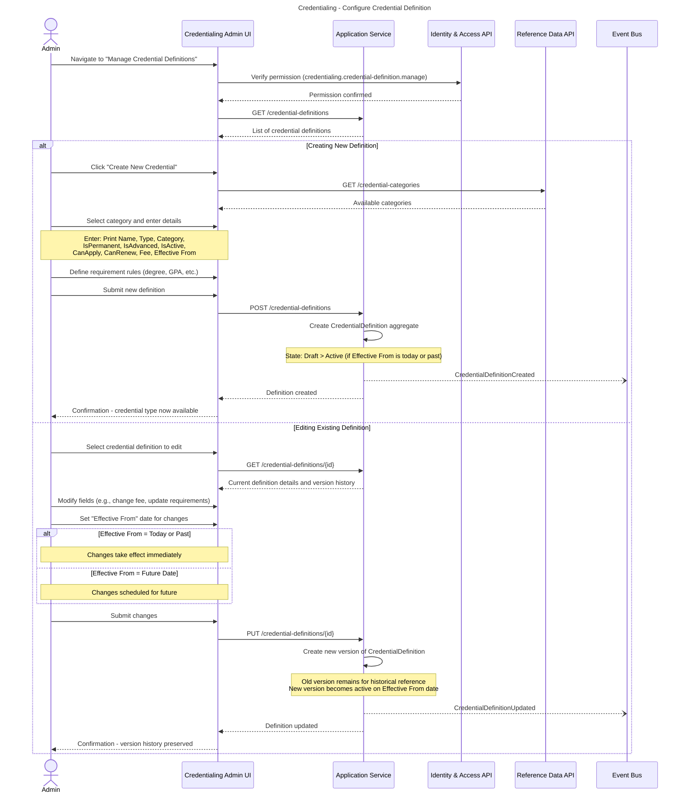
```mermaid
---
title: Credentialing - Configure Credential Definition
---
sequenceDiagram
    actor Admin
    participant UI as Credentialing Admin UI
    participant AppService as Application Service
    participant IAM as Identity & Access API
    participant RefData as Reference Data API
    participant EventBus as Event Bus
    
    Admin->>UI: Navigate to "Manage Credential Definitions"
    UI->>IAM: Verify permission (credentialing.credential-definition.manage)
    IAM-->>UI: Permission confirmed
    
    UI->>AppService: GET /credential-definitions
    AppService-->>UI: List of credential definitions
    
    alt Creating New Definition
        Admin->>UI: Click "Create New Credential"
        UI->>RefData: GET /credential-categories
        RefData-->>UI: Available categories
        
        Admin->>UI: Select category and enter details
        Note over Admin,UI: Enter: Print Name, Type, Category,<br/>IsPermanent, IsAdvanced, IsActive,<br/>CanApply, CanRenew, Fee, Effective From
        
        Admin->>UI: Define requirement rules (degree, GPA, etc.)
        Admin->>UI: Submit new definition
        
        UI->>AppService: POST /credential-definitions
        AppService->>AppService: Create CredentialDefinition aggregate
        Note over AppService: State: Draft > Active (if Effective From is today or past)
        
        AppService--)EventBus: CredentialDefinitionCreated
        AppService-->>UI: Definition created
        UI-->>Admin: Confirmation - credential type now available
        
    else Editing Existing Definition
        Admin->>UI: Select credential definition to edit
        UI->>AppService: GET /credential-definitions/{id}
        AppService-->>UI: Current definition details and version history
        
        Admin->>UI: Modify fields (e.g., change fee, update requirements)
        Admin->>UI: Set "Effective From" date for changes
        
        alt Effective From = Today or Past
            Note over Admin,UI: Changes take effect immediately
        else Effective From = Future Date
            Note over Admin,UI: Changes scheduled for future
        end
        
        Admin->>UI: Submit changes
        UI->>AppService: PUT /credential-definitions/{id}
        
        AppService->>AppService: Create new version of CredentialDefinition
        Note over AppService: Old version remains for historical reference<br/>New version becomes active on Effective From date
        
        AppService--)EventBus: CredentialDefinitionUpdated
        AppService-->>UI: Definition updated
        UI-->>Admin: Confirmation - version history preserved
    end
```

**Key Decisions:**
- **Versioning:** All changes create new versions rather than overwriting existing definitions
- **Effective Dating:** Determines when changes become active; future dates allow scheduled updates
- **Historical Preservation:** Old versions remain accessible for audit and in-progress applications

**State Changes:**
- CredentialDefinition: `Draft` > `Active` (new definitions)
- CredentialDefinition: Creates new version while preserving old (edits)

**Events Published:**
- `CredentialDefinitionCreated` - New credential type available
- `CredentialDefinitionUpdated` - Existing definition modified

**Error Scenarios:**
- Admin lacks permission > Access denied
- Overlapping effective date ranges > Validation error
- Invalid configuration (e.g., IsPermanent=true but CanRenew=true) > Display validation errors

---

## Configure Endorsement Definition

**What:** Administrator creates a new endorsement definition or updates an existing one with versioning  
**When:** New subject areas added, assessment requirements change, or corrections needed  
**Who:** User with `credentialing.endorsement-definition.manage` permission (System Admin)

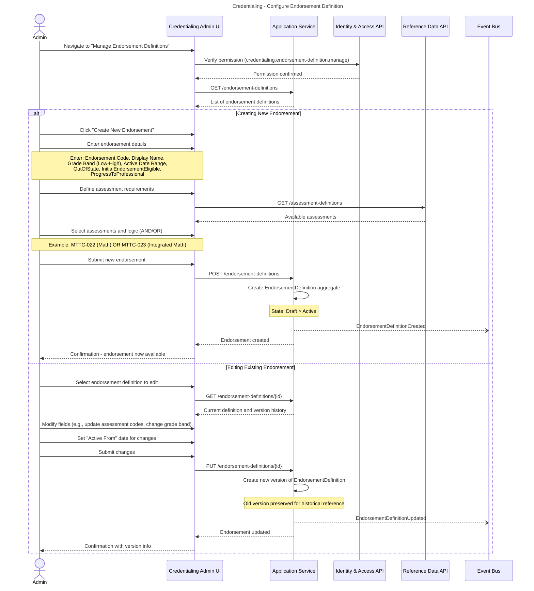
```mermaid
---
title: Credentialing - Configure Endorsement Definition
---
sequenceDiagram
    actor Admin
    participant UI as Credentialing Admin UI
    participant AppService as Application Service
    participant IAM as Identity & Access API
    participant RefData as Reference Data API
    participant EventBus as Event Bus
    
    Admin->>UI: Navigate to "Manage Endorsement Definitions"
    UI->>IAM: Verify permission (credentialing.endorsement-definition.manage)
    IAM-->>UI: Permission confirmed
    
    UI->>AppService: GET /endorsement-definitions
    AppService-->>UI: List of endorsement definitions
    
    alt Creating New Endorsement
        Admin->>UI: Click "Create New Endorsement"
        
        Admin->>UI: Enter endorsement details
        Note over Admin,UI: Enter: Endorsement Code, Display Name,<br/>Grade Band (Low-High), Active Date Range,<br/>OutOfState, InitialEndorsementEligible,<br/>ProgressToProfessional
        
        Admin->>UI: Define assessment requirements
        UI->>RefData: GET /assessment-definitions
        RefData-->>UI: Available assessments
        
        Admin->>UI: Select assessments and logic (AND/OR)
        Note over Admin,UI: Example: MTTC-022 (Math) OR MTTC-023 (Integrated Math)
        
        Admin->>UI: Submit new endorsement
        UI->>AppService: POST /endorsement-definitions
        
        AppService->>AppService: Create EndorsementDefinition aggregate
        Note over AppService: State: Draft > Active
        
        AppService--)EventBus: EndorsementDefinitionCreated
        AppService-->>UI: Endorsement created
        UI-->>Admin: Confirmation - endorsement now available
        
    else Editing Existing Endorsement
        Admin->>UI: Select endorsement definition to edit
        UI->>AppService: GET /endorsement-definitions/{id}
        AppService-->>UI: Current definition and version history
        
        Admin->>UI: Modify fields (e.g., update assessment codes, change grade band)
        Admin->>UI: Set "Active From" date for changes
        
        Admin->>UI: Submit changes
        UI->>AppService: PUT /endorsement-definitions/{id}
        
        AppService->>AppService: Create new version of EndorsementDefinition
        Note over AppService: Old version preserved for historical reference
        
        AppService--)EventBus: EndorsementDefinitionUpdated
        AppService-->>UI: Endorsement updated
        UI-->>Admin: Confirmation with version info
    end
```

**Key Decisions:**
- **Assessment Logic:** AND requires all assessments to pass; OR requires any one to pass
- **Grade Band:** Must be contiguous range; system validates Low <= High
- **Versioning:** Changes create new versions while preserving historical definitions

**State Changes:**
- EndorsementDefinition: `Draft` > `Active` (new endorsements)
- EndorsementDefinition: Creates new version (edits)

**Events Published:**
- `EndorsementDefinitionCreated` - New endorsement type available
- `EndorsementDefinitionUpdated` - Existing definition modified

**Error Scenarios:**
- Endorsement code already exists > Validation error
- Invalid grade band range (High < Low) > Display error
- Assessment logic misconfigured (e.g., AND with zero codes) > Validation error

---

## Configure Assessment Definition

**What:** Administrator creates or updates an assessment type definition with versioning  
**When:** State adopts new assessment provider, changes passing criteria, or retires old assessments  
**Who:** User with `credentialing.assessment-definition.manage` permission (System Admin)

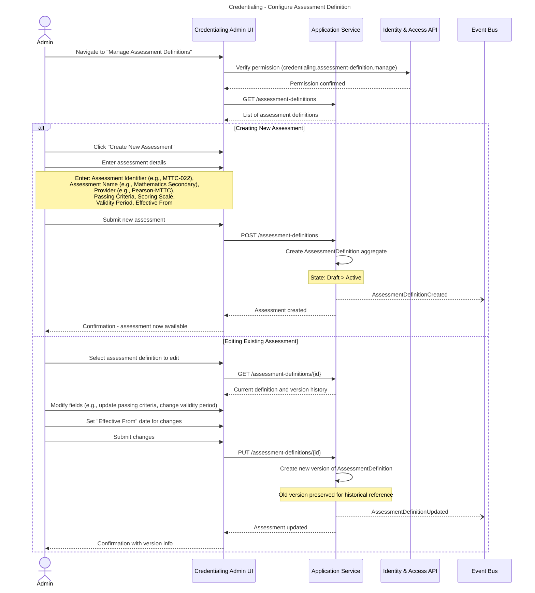
```mermaid
---
title: Credentialing - Configure Assessment Definition
---
sequenceDiagram
    actor Admin
    participant UI as Credentialing Admin UI
    participant AppService as Application Service
    participant IAM as Identity & Access API
    participant EventBus as Event Bus
    
    Admin->>UI: Navigate to "Manage Assessment Definitions"
    UI->>IAM: Verify permission (credentialing.assessment-definition.manage)
    IAM-->>UI: Permission confirmed
    
    UI->>AppService: GET /assessment-definitions
    AppService-->>UI: List of assessment definitions
    
    alt Creating New Assessment
        Admin->>UI: Click "Create New Assessment"
        
        Admin->>UI: Enter assessment details
        Note over Admin,UI: Enter: Assessment Identifier (e.g., MTTC-022),<br/>Assessment Name (e.g., Mathematics Secondary),<br/>Provider (e.g., Pearson-MTTC),<br/>Passing Criteria, Scoring Scale,<br/>Validity Period, Effective From
        
        Admin->>UI: Submit new assessment
        UI->>AppService: POST /assessment-definitions
        
        AppService->>AppService: Create AssessmentDefinition aggregate
        Note over AppService: State: Draft > Active
        
        AppService--)EventBus: AssessmentDefinitionCreated
        AppService-->>UI: Assessment created
        UI-->>Admin: Confirmation - assessment now available
        
    else Editing Existing Assessment
        Admin->>UI: Select assessment definition to edit
        UI->>AppService: GET /assessment-definitions/{id}
        AppService-->>UI: Current definition and version history
        
        Admin->>UI: Modify fields (e.g., update passing criteria, change validity period)
        Admin->>UI: Set "Effective From" date for changes
        
        Admin->>UI: Submit changes
        UI->>AppService: PUT /assessment-definitions/{id}
        
        AppService->>AppService: Create new version of AssessmentDefinition
        Note over AppService: Old version preserved for historical reference
        
        AppService--)EventBus: AssessmentDefinitionUpdated
        AppService-->>UI: Assessment updated
        UI-->>Admin: Confirmation with version info
    end
```

**Key Decisions:**
- **Versioning:** Changes create new versions to preserve historical passing criteria
- **Validity Period:** Configurable per assessment (e.g., 5 years for MTTC, 10 years for Praxis)

**State Changes:**
- AssessmentDefinition: `Draft` > `Active` (new) or creates new version (edits)

**Events Published:**
- `AssessmentDefinitionCreated` - New assessment type available
- `AssessmentDefinitionUpdated` - Existing definition modified

**Error Scenarios:**
- Assessment identifier already exists > Validation error
- Passing criteria outside scoring scale bounds > Display error

---

## Import Assessment Results

**What:** Administrator uploads assessment result file from provider and system imports scores  
**When:** Assessment provider sends updated score report; admin downloads and uploads to system  
**Who:** User with `credentialing.assessment-result.import` permission

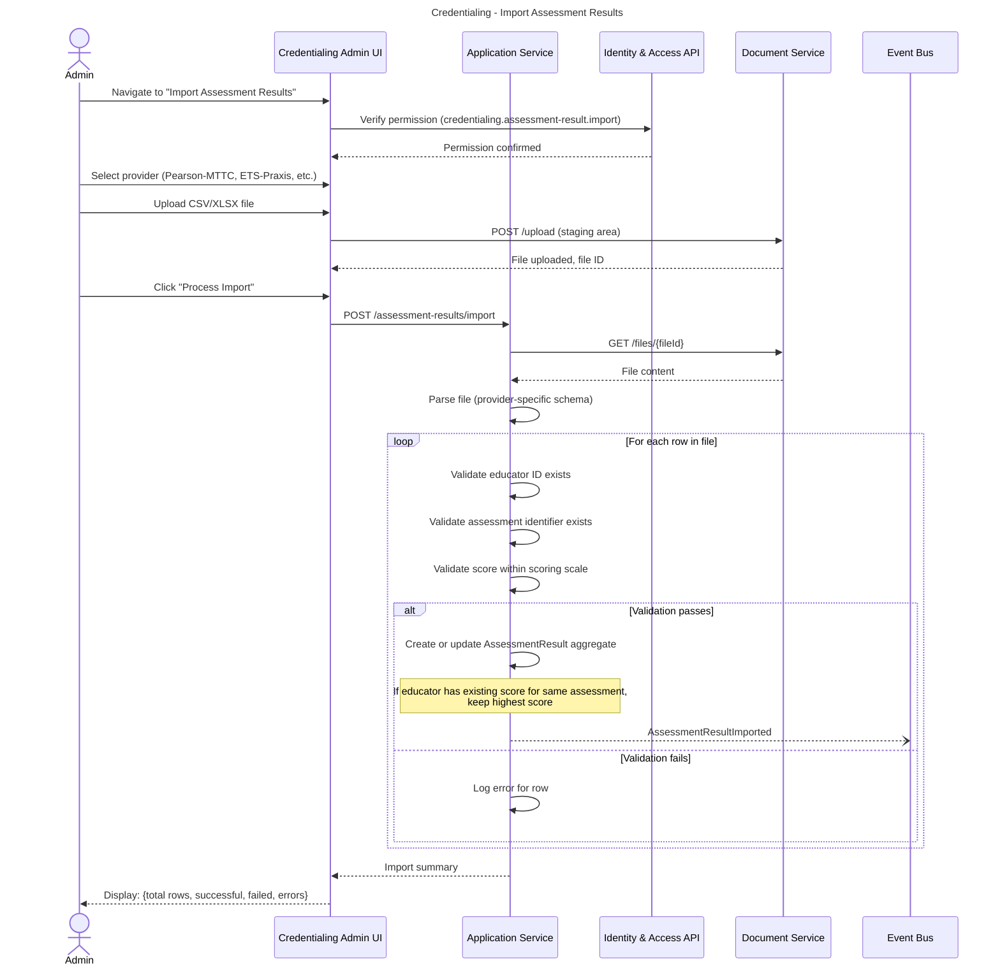
```mermaid
---
title: Credentialing - Import Assessment Results
---
sequenceDiagram
    actor Admin
    participant UI as Credentialing Admin UI
    participant AppService as Application Service
    participant IAM as Identity & Access API
    participant DocService as Document Service
    participant EventBus as Event Bus
    
    Admin->>UI: Navigate to "Import Assessment Results"
    UI->>IAM: Verify permission (credentialing.assessment-result.import)
    IAM-->>UI: Permission confirmed
    
    Admin->>UI: Select provider (Pearson-MTTC, ETS-Praxis, etc.)
    Admin->>UI: Upload CSV/XLSX file
    UI->>DocService: POST /upload (staging area)
    DocService-->>UI: File uploaded, file ID
    
    Admin->>UI: Click "Process Import"
    UI->>AppService: POST /assessment-results/import
    
    AppService->>DocService: GET /files/{fileId}
    DocService-->>AppService: File content
    
    AppService->>AppService: Parse file (provider-specific schema)
    
    loop For each row in file
        AppService->>AppService: Validate educator ID exists
        AppService->>AppService: Validate assessment identifier exists
        AppService->>AppService: Validate score within scoring scale
        
        alt Validation passes
            AppService->>AppService: Create or update AssessmentResult aggregate
            Note over AppService: If educator has existing score for same assessment,<br/>keep highest score
            AppService--)EventBus: AssessmentResultImported
        else Validation fails
            AppService->>AppService: Log error for row
        end
    end
    
    AppService-->>UI: Import summary
    UI-->>Admin: Display: {total rows, successful, failed, errors}
```

**Key Decisions:**
- **Provider-Specific Parsing:** Different CSV schemas for Pearson vs ETS
- **Highest Score Logic:** If educator retakes, system keeps highest score automatically
- **Verification Status:** Imported results are marked `Verified` (from official provider)

**State Changes:**
- AssessmentResult: `None` > `Verified` (new imports)
- AssessmentResult: Updates `ScoreValue` if new score is higher (retakes)

**Events Published:**
- `AssessmentResultImported` - One per successful row

**Error Scenarios:**
- Invalid educator ID > Skip row, log error
- Unknown assessment identifier > Skip row, log error
- Malformed file > Abort import, display parsing error

---

## Validate Assessment Results

**What:** System validates educator's assessment scores against endorsement requirements  
**When:** During endorsement application processing or auto-approval workflow  
**Who:** System (automated)

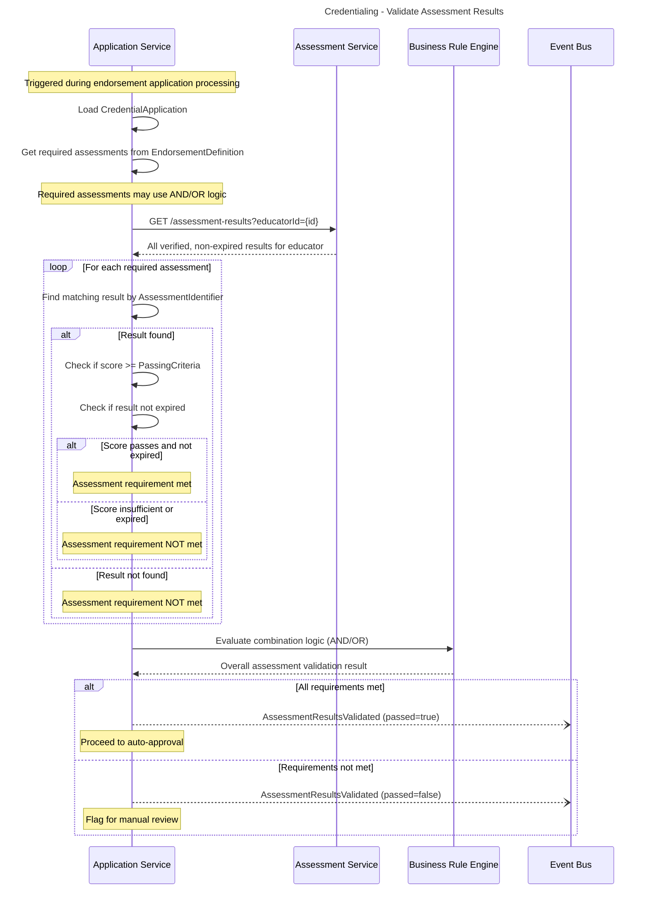
```mermaid
---
title: Credentialing - Validate Assessment Results
---
sequenceDiagram
    participant AppService as Application Service
    participant AssessmentService as Assessment Service
    participant BRM as Business Rule Engine
    participant EventBus as Event Bus
    
    Note over AppService: Triggered during endorsement application processing
    
    AppService->>AppService: Load CredentialApplication
    AppService->>AppService: Get required assessments from EndorsementDefinition
    
    Note over AppService: Required assessments may use AND/OR logic
    
    AppService->>AssessmentService: GET /assessment-results?educatorId={id}
    AssessmentService-->>AppService: All verified, non-expired results for educator
    
    loop For each required assessment
        AppService->>AppService: Find matching result by AssessmentIdentifier
        
        alt Result found
            AppService->>AppService: Check if score >= PassingCriteria
            AppService->>AppService: Check if result not expired
            
            alt Score passes and not expired
                Note over AppService: Assessment requirement met
            else Score insufficient or expired
                Note over AppService: Assessment requirement NOT met
            end
        else Result not found
            Note over AppService: Assessment requirement NOT met
        end
    end
    
    AppService->>BRM: Evaluate combination logic (AND/OR)
    BRM-->>AppService: Overall assessment validation result
    
    alt All requirements met
        AppService--)EventBus: AssessmentResultsValidated (passed=true)
        Note over AppService: Proceed to auto-approval
    else Requirements not met
        AppService--)EventBus: AssessmentResultsValidated (passed=false)
        Note over AppService: Flag for manual review
    end
```

**Key Decisions:**
- **AND Logic:** ALL specified assessments must pass
- **OR Logic:** ANY ONE specified assessment must pass
- **Expiration Check:** Expired results (ValidityPeriod exceeded) are treated as missing

**State Changes:**
- None (validation only)

**Events Published:**
- `AssessmentResultsValidated` - Records validation outcome

**Error Scenarios:**
- No results on file > Validation fails, flag for manual review
- Mixed results (some pass, some fail with AND logic) > Validation fails

---

## View Definition History

**What:** Administrator reviews the complete version history and change audit trail for credential, endorsement, or assessment definitions  
**When:** Investigating policy changes, compliance audits, or troubleshooting application issues  
**Who:** User with `credentialing.credential-definition.view`, `credentialing.endorsement-definition.view`, or `credentialing.assessment-definition.view` permission

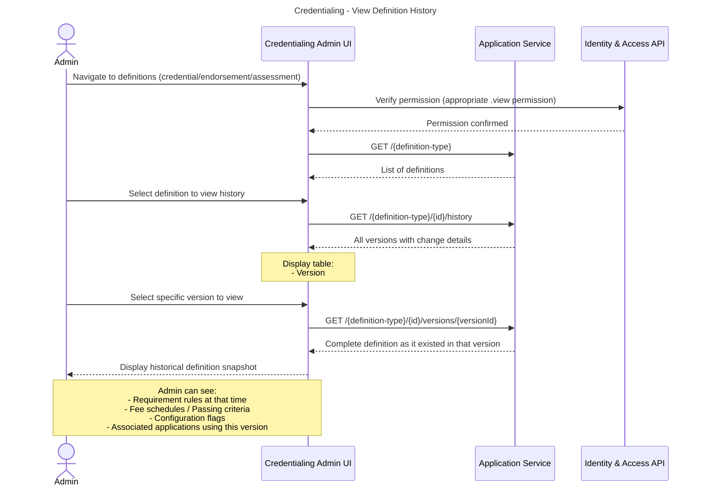
```mermaid
---
title: Credentialing - View Definition History
---
sequenceDiagram
    actor Admin
    participant UI as Credentialing Admin UI
    participant AppService as Application Service
    participant IAM as Identity & Access API
    
    Admin->>UI: Navigate to definitions (credential/endorsement/assessment)
    UI->>IAM: Verify permission (appropriate .view permission)
    IAM-->>UI: Permission confirmed
    
    UI->>AppService: GET /{definition-type}
    AppService-->>UI: List of definitions
    
    Admin->>UI: Select definition to view history
    UI->>AppService: GET /{definition-type}/{id}/history
    AppService-->>UI: All versions with change details
    
    Note over UI: Display table:<br/>- Version #<br/>- Effective From / To dates<br/>- Changed By<br/>- Changed At<br/>- What Changed (diff view)
    
    Admin->>UI: Select specific version to view
    UI->>AppService: GET /{definition-type}/{id}/versions/{versionId}
    AppService-->>UI: Complete definition as it existed in that version
    
    UI-->>Admin: Display historical definition snapshot
    
    Note over Admin,UI: Admin can see:<br/>- Requirement rules at that time<br/>- Fee schedules / Passing criteria<br/>- Configuration flags<br/>- Associated applications using this version
```

**Key Decisions:**
- **Read-Only:** History view is read-only; cannot edit historical versions
- **Version Comparison:** UI may offer diff view showing what changed between versions
- **Application Association:** Can see which applications were evaluated against which version

**State Changes:**
- None (read-only operation)

**Events Published:**
- None (or optional audit log entry for view access)

**Error Scenarios:**
- Definition not found > Display error
- Version not found > Display error
