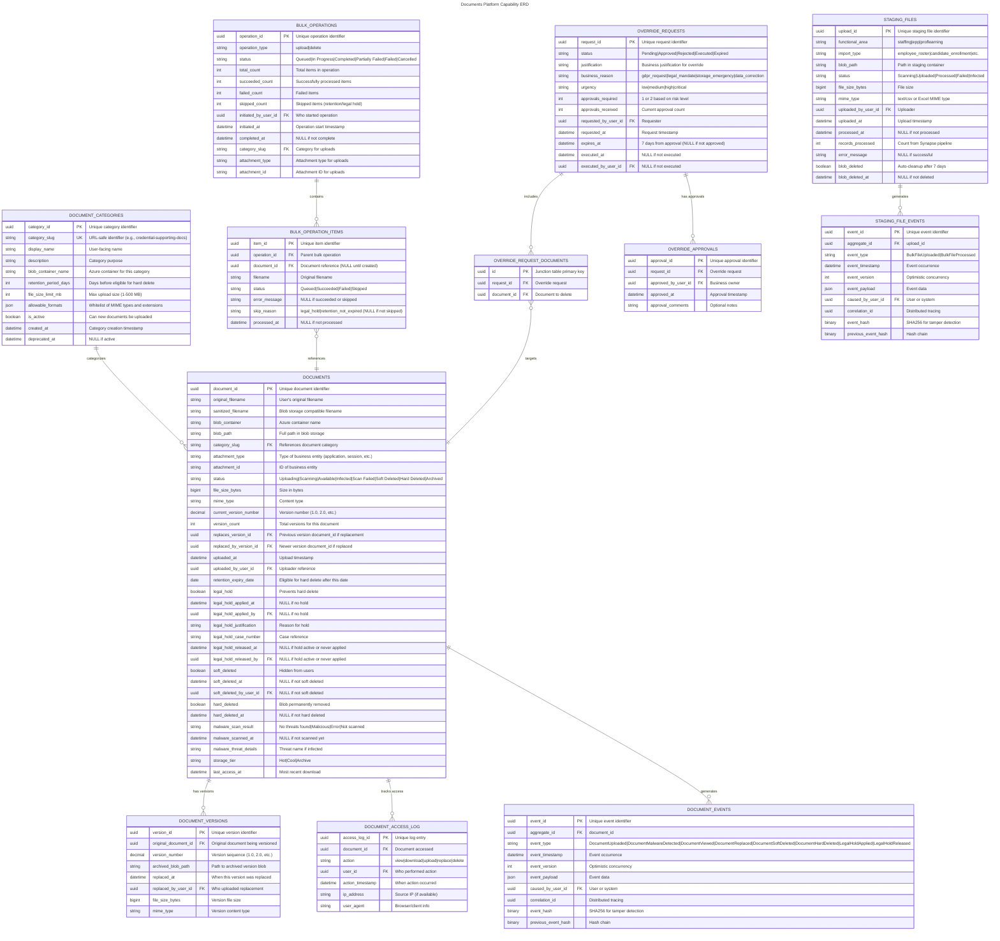

# Documents

- **Type:** Platform Capability
- **Identifier:** documents
- **Display Name:** Documents
- **Primary Sources:** BRDs 32.16, 9.1, 21.8, 21.9, 26.2, 29.4, 29.13, 29.16, 25.17-18, 22.18, 5.38

---

## Purpose

The Documents platform capability provides centralized file storage and lifecycle management infrastructure across MiEdWorkforce, enabling functional areas to support secure document uploads, version control, malware scanning, retention policies, and bulk file operations. It manages the complete document lifecycle from upload through storage, retrieval, archival, and deletion while maintaining compliance with security, audit, and retention requirements.

---

## Classification Rationale

**Platform Capability** - Documents is foundational infrastructure used by all core domains (Credentials, Staffing, Professional Learning, EPP, etc.). It doesn't contain business logic about *what* documents are required or *why* they're uploaded, but provides the *how* and *where* for secure storage. All domains depend on it for file management, security controls, and compliance. While document categorization introduces some domain-like characteristics, the primary value is technical enablement rather than direct business value delivery.

---

## Scope

**This domain owns:**
- Document upload orchestration with malware scanning integration
- Document storage in Azure Blob Storage with metadata management
- Document version control and replacement tracking
- Document retrieval with permission-based access control
- SAS token generation for browser-based uploads and downloads
- Soft delete and hard delete lifecycle management
- Configurable retention policies per document category
- Legal hold management preventing deletion
- Bulk upload and bulk deletion operations
- Document metadata preservation (original filename, upload timestamp, file size, MIME type)
- Storage container naming conventions and organization
- Document audit trail (upload, view, replace, delete actions)
- Blob storage lifecycle policies and tier management (via Azure infrastructure)
- Administrator override workflows for retention policy exceptions
- File size limit enforcement per document category

**This domain does NOT own:**
- Authorization of upload/download requests -> calling domain's responsibility
- Business rules determining which documents are required for specific workflows -> Domain-specific services (e.g., `credentialing`, `proflearning`)
- Evaluation of document content quality or completeness -> Domain-specific validation logic
- Malware scanning infrastructure and threat detection -> Azure Defender for Storage
- User interface components for document upload forms -> UI framework / Domain-specific UIs
- Authorization rules for who can upload documents to specific contexts -> `iam` domain
- Workflow state transitions that require document uploads -> Domain-specific workflow engines
- Long-term data warehouse archival -> Azure Synapse / Data Lake
- Scheduled ETL and data pipeline processing -> Azure Synapse / Data Factory
- Storage tier transition logic -> Azure Blob Storage Lifecycle Management (infrastructure-managed)

---

## Ubiquitous Language

| Term                    | Definition                                                                                                                                                                                                                                  |
| ----------------------- | ------------------------------------------------------------------------------------------------------------------------------------------------------------------------------------------------------------------------------------------- |
| **Document**            | A file uploaded by a user, stored in Azure Blob Storage, with associated metadata tracking its lifecycle and permissions                                                                                                                    |
| **Document Category**   | A classification grouping for documents that determines storage location, retention policy, security requirements, and file size limits (e.g., "Credential Supporting Document", "Professional Practice Documentation", "Bulk Import File") |
| **Document Attachment** | The business entity to which a document is attached (e.g., credential application ID, staffing roster ID, professional learning session ID); replaces overloaded term "context"                                                             |
| **Blob Container**      | An Azure Blob Storage container organizing documents by category, with naming convention: `documents-{category-slug}`                                                                                                                       |
| **Blob Path**           | The hierarchical path within a container organizing documents, typically: `{year}/{month}/{attachment-type}/{attachment-id}/{document-id}_{sanitized-filename}`                                                                             |
| **Document Metadata**   | Structured data about a document stored in system database, including: original filename, MIME type, file size, upload timestamp, uploader ID, category, attachment, retention expiry date, soft delete status                              |
| **Soft Delete**         | Marking a document as deleted without removing the blob, preventing user access while preserving data for recovery or audit                                                                                                                 |
| **Hard Delete**         | Permanently removing document blob from storage after retention period expires or legal hold is released                                                                                                                                    |
| **Retention Policy**    | Configurable rule specifying how long documents in a category must be preserved before eligible for hard delete (e.g., 7 years, 90 days, indefinite)                                                                                        |
| **Legal Hold**          | Flag preventing hard delete of a document regardless of retention policy, typically applied for litigation or investigation                                                                                                                 |
| **Document Version**    | A distinct file replacing a previous document, tracked with version number and timestamp, with previous version either soft-deleted or archived based on policy                                                                             |
| **Malware Scan Result** | Status indicating outcome of virus/ransomware/spyware scan: `Pending`, `Clean`, `Infected`, `Scan Failed`                                                                                                                                   |
| **Bulk Upload**         | Batch operation allowing upload of multiple documents simultaneously, typically for administrative or data import purposes                                                                                                                  |
| **Bulk Delete**         | Batch operation marking multiple documents for soft delete, subject to retention policy and legal hold validation                                                                                                                           |
| **Staging Area**        | Temporary storage location for bulk import files awaiting processing by downstream systems (e.g., Synapse pipelines)                                                                                                                        |
| **Allowable Formats**   | Whitelist of permitted file extensions and MIME types per document category (e.g., PDF, JPEG, PNG for supporting documents; CSV, XLSX for bulk imports)                                                                                     |
| **Document Access Log** | Audit trail recording all interactions with a document: upload, view, download, replace, delete actions with timestamp and user ID                                                                                                          |
| **Override Request**    | Administrator request to delete a document before retention expiry or despite legal hold, requiring business owner approval                                                                                                                 |
| **File Size Limit**     | Maximum allowed file size for uploads in a document category, configurable to prevent storage abuse and ensure scan performance (typically 50 MB, never exceeding 500 MB)                                                                   |
| **Sanitized Filename**  | Original filename with special characters removed/replaced to ensure blob storage compatibility (removes: / \ : * ? " < > pipes and whitespace) |

---

## Domain Model

### Core Aggregates

#### Document

**Root Entity:** Document

**Purpose:** Manages the complete lifecycle of a single file from upload through deletion, enforcing security, retention, and audit requirements.

**Entities & Value Objects:**
- **Document** (root) - Core metadata, blob reference, lifecycle status, retention rules
- **DocumentVersion** - Historical record of document replacement with version number and archived blob reference
- **DocumentAccessLog** - Audit entry for each document interaction (view, download, replace, delete)
- **MalwareScanResult** - Outcome of security scan with threat details if infected
- **BlobReference** - Azure Blob Storage coordinates (container, path, SAS token generation metadata)
- **RetentionPolicy** - Category-specific retention rules with expiry date calculation
- **LegalHold** - Flag with justification and hold placed/released timestamps

**Key Invariants:**
- Document must belong to exactly one category
- Document must have valid blob reference in Azure Storage
- Malware-infected documents cannot transition to `Available` status
- Soft-deleted documents cannot be accessed by users (admin override allowed)
- Hard delete blocked if legal hold is active
- Hard delete blocked if retention period has not expired
- Document replacement creates new version record; old version soft-deleted or archived per category policy
- Original filename preserved in metadata even if blob path uses UUID-based naming
- MIME type must match allowable formats for category
- File size must not exceed category-specific file size limit

**Key States:** `Uploading`, `Scanning`, `Available`, `Infected`, `Scan Failed`, `Soft Deleted`, `Hard Deleted`, `Archived`

---

#### DocumentCategory

**Root Entity:** DocumentCategory

**Purpose:** Defines storage, security, retention, and file size rules for groups of documents with similar business purposes and compliance requirements.

**Entities & Value Objects:**
- **DocumentCategory** (root) - Category name, description, storage container reference
- **RetentionConfiguration** - Retention period (years/days), archive tier transition rules (read-only, managed by infrastructure)
- **AllowableFormats** - Whitelist of permitted file extensions and MIME types
- **FileSizeLimit** - Maximum file size allowed for uploads in this category (in MB)
- **StoragePolicy** - Blob container naming, path structure, access tier defaults (read-only, managed by infrastructure)
- **SecurityConfiguration** - Encryption requirements, access control defaults, malware scan settings

**Key Invariants:**
- Category slug must be unique and follow naming convention: lowercase, hyphen-separated (e.g., `credential-supporting-docs`)
- Retention period must be >= 0 (0 = immediate deletion after soft delete)
- Allowable formats list cannot be empty
- File size limit must be between 1 MB and 500 MB (never exceed 500 MB due to scan performance and Defender limitations)
- Blob container name derived from category slug: `documents-{category-slug}`
- Categories cannot be deleted if documents exist in that category
- Retention period changes apply only to new documents (existing documents retain original expiry date)

**Key States:** `Active`, `Deprecated` (no new uploads allowed, existing documents remain)

---

#### BulkOperation

**Root Entity:** BulkOperation

**Purpose:** Tracks batch upload or delete operations, providing progress monitoring, error handling, and rollback capabilities.

**Entities & Value Objects:**
- **BulkOperation** (root) - Operation type, status, initiated by user, completion progress
- **BulkOperationItem** - Individual document in batch with success/failure status, error message, and document reference
- **BulkOperationSummary** - Aggregate statistics: total count, succeeded, failed, skipped

**Key Invariants:**
- Bulk operations must have at least one item
- Operation cannot transition to `Completed` until all items processed
- Failed items must include error reason
- Bulk delete must validate retention policies and legal holds for all items before starting
- If any item in bulk delete violates retention policy, entire operation marked `Partially Failed`
- Bulk upload malware scan failures mark individual items as `Failed` but don't block other items
- Each BulkOperationItem references its created Document ID once upload succeeds

**Key States:** `Queued`, `In Progress`, `Completed`, `Partially Failed`, `Failed`, `Cancelled`

---

#### OverrideRequest

**Root Entity:** OverrideRequest

**Purpose:** Manages administrator requests to bypass retention policies or legal holds, enforcing approval workflows and audit trails.

**Entities & Value Objects:**
- **OverrideRequest** (root) - Requested action, justification, document references
- **OverrideApproval** - Business owner approval with timestamp and comments
- **OverrideAudit** - Complete trail of request, approval, and execution

**Key Invariants:**
- Override request must include business justification
- Request requires at least one business owner approval
- High-value overrides (legal holds, retention >5 years) require dual approval
- Approved overrides expire after 7 days if not executed
- Executed overrides cannot be reversed (deletion is permanent)
- All override actions logged to compliance audit system

**Key States:** `Pending`, `Approved`, `Rejected`, `Executed`, `Expired`

---

### Entity Relationship Diagram



---

## Domain Events

Events published by this domain that other domains may subscribe to:

| Event                     | Aggregate        | Trigger                                                  | Payload Highlights                                                                                     | Consumers                        |
| ------------------------- | ---------------- | -------------------------------------------------------- | ------------------------------------------------------------------------------------------------------ | -------------------------------- |
| `DocumentUploaded`        | Document         | Upload completed and malware scan clean                  | `{ document_id, category, attachment_type, attachment_id, uploaded_by_user_id, file_size, mime_type }` | audit, domain-specific workflows |
| `DocumentMalwareDetected` | Document         | Malware scan identifies threat                           | `{ document_id, threat_type, threat_name, scan_service, uploaded_by_user_id }`                         | security, monitoring             |
| `DocumentViewed`          | Document         | User downloads/views document                            | `{ document_id, viewed_by_user_id, viewed_at }`                                                        | audit, analytics                 |
| `DocumentReplaced`        | Document         | User uploads new version                                 | `{ document_id, new_version_id, replaced_by_user_id, old_version_archived }`                           | audit, domain-specific workflows |
| `DocumentSoftDeleted`     | Document         | Document marked as deleted                               | `{ document_id, deleted_by_user_id, retention_expiry_date }`                                           | audit                            |
| `DocumentHardDeleted`     | Document         | Blob permanently removed                                 | `{ document_id, deleted_at, deletion_reason }`                                                         | audit, compliance                |
| `DocumentCategoryCreated` | DocumentCategory | New category configured                                  | `{ category_id, category_slug, retention_years }`                                                      | audit                            |
| `RetentionPolicyUpdated`  | DocumentCategory | Category retention rules changed                         | `{ category_id, old_retention_years, new_retention_years }`                                            | audit, compliance                |
| `LegalHoldApplied`        | Document         | Legal hold flag set                                      | `{ document_id, applied_by_user_id, justification }`                                                   | audit, legal                     |
| `LegalHoldReleased`       | Document         | Legal hold removed                                       | `{ document_id, released_by_user_id, release_reason }`                                                 | audit, legal                     |
| `BulkOperationCompleted`  | BulkOperation    | Batch operation finished                                 | `{ operation_id, type, total_count, succeeded_count, failed_count }`                                   | audit, monitoring                |
| `OverrideRequestApproved` | OverrideRequest  | Business owner approves override                         | `{ request_id, document_ids[], approved_by_user_id }`                                                  | audit, compliance                |
| `DocumentArchivedToBlob`  | Document         | Document moved to archive tier by Azure lifecycle policy | `{ document_id, archived_at, archive_tier }`                                                           | audit                            |

**Event Naming Convention:** PastTense + Noun + Action (e.g., `DocumentUploaded`, `LegalHoldApplied`)

**Published To:** Azure Service Bus topic: `miedworkforce-domain-events`

---

## Dependencies

### Upstream (We Consume From)

| Source                         | What We Need                                                   | How We Get It             | Notes                                                                                       |
| ------------------------------ | -------------------------------------------------------------- | ------------------------- | ------------------------------------------------------------------------------------------- |
| **iam**                        | User identity, permissions, organizational scope               | REST API                  | Required for upload authorization, access log user details, override request approvals      |
| **Azure Blob Storage**         | Blob CRUD operations, SAS token generation, lifecycle policies | Azure SDK                 | Primary storage backend; uses managed identity for authentication                           |
| **Azure Defender for Storage** | Malware scanning results, threat detection                     | Azure Event Grid webhooks | Real-time scan results; NO fallback scanner - system blocks uploads if Defender unavailable |
| **credentialing**              | Application attachment data for document categorization        | REST API                  | Used when uploading supporting documents to credential applications                         |
| **staffing**                   | Roster attachment data for bulk import validation              | REST API                  | Used when processing employee/position bulk upload files                                    |
| **proflearning**               | Session/attendee attachment for SCECH documentation            | REST API                  | Used when uploading program agendas or attendee lists                                       |
| **epp**                        | Candidate tracking attachment for EPP uploads                  | REST API                  | Used when processing bulk candidate enrollment files                                        |

### Downstream (Others Consume From Us)

| Consumer          | What They Need                                    | How They Get It                | Notes                                                                    |
| ----------------- | ------------------------------------------------- | ------------------------------ | ------------------------------------------------------------------------ |
| **credentialing** | Access to supporting documents for applications   | REST API + Event subscriptions | Listens for `DocumentUploaded` to trigger workflow transitions           |
| **proflearning**  | Access to program agendas and attendee lists      | REST API                       | Queries documents by session attachment                                  |
| **staffing**      | Access to bulk roster import files for processing | REST API + Blob staging area   | Synapse pipelines read from staging containers                           |
| **epp**           | Access to bulk candidate tracking files           | REST API + Blob staging area   | Synapse pipelines process enrollment data                                |
| **audit**         | Complete document lifecycle audit trail           | Event subscriptions            | Compliance requirement for all document actions                          |
| **reporting**     | Document usage metrics, storage analytics         | REST API                       | Generates reports on upload volumes, storage costs, retention compliance |
| **Azure Synapse** | Bulk import files for data pipeline processing    | Direct blob access             | Synapse reads from designated staging containers                         |

---

## Business Rules

### Malware Scan Blocking

**Rule:** Documents detected as malware-infected during upload scanning must be blocked from storage and user access. The upload transaction fails and the user is notified. If malware scanning is unavailable, ALL uploads are blocked.

**Rationale:** Prevents introduction of ransomware, viruses, or spyware into the system, protecting data integrity and system security. No fallback scanner ensures consistent security posture.

**Enforced By:** Document aggregate + Azure Defender for Storage

**Example:** 
- User uploads `transcript.pdf` for credential application
- Azure Defender detects embedded macro with suspicious behavior
- System returns `MalwareScanResult.Infected` with threat type "Macro.Trojan"
- Upload fails; document not saved to blob storage
- User notified: "File could not be uploaded due to security concerns. Please verify file integrity and try again."
- Security team alerted via `DocumentMalwareDetected` event

**Scan Unavailable Scenario:**
- User attempts upload while Azure Defender experiencing service degradation
- System detects webhook timeout (>60 seconds) or Azure health check failure
- Upload blocked immediately with status "System temporarily unavailable"
- User notified: "Document upload is temporarily unavailable. Please try again in a few minutes."
- Operations team alerted immediately for Defender service restoration

---

### File Size Limit Enforcement

**Rule:** Documents cannot exceed the category-specific file size limit. Maximum configurable limit is 500 MB across all categories. Uploads exceeding the limit are rejected before SAS token generation.

**Rationale:** Ensures malware scan performance (Defender scans are optimized for smaller files), prevents storage abuse, and aligns with practical document needs (e.g., transcripts, certificates rarely exceed 50 MB).

**Enforced By:** Document aggregate + DocumentCategory configuration

**Example:**
- DocumentCategory "Credential Supporting Documents" configured with 50 MB file size limit
- User attempts to upload 75 MB scanned transcript PDF
- System validates file size during upload request before blob upload
- Upload rejected with 400 Bad Request
- User notified: "File size (75 MB) exceeds maximum allowed (50 MB) for this document type. Please compress or split the file."

**Configuration:**
- Default file size limit: 50 MB for most categories
- Bulk import staging files: 500 MB limit (large CSV/XLSX files)
- Supporting documents (transcripts, certificates): 50 MB limit
- Administrators can configure per-category limits between 1 MB - 500 MB
- System enforces 500 MB absolute maximum regardless of configuration

---

### Retention Period Enforcement

**Rule:** Documents cannot be hard-deleted until their retention period has expired, calculated from upload date plus category-specific retention years/days. Legal holds override retention expiry.

**Rationale:** Ensures compliance with Michigan state records retention schedules and protects against premature deletion of legally required documentation.

**Enforced By:** Document aggregate + Retention Policy Configuration + Hard Delete Service

**Example:**
- Document uploaded January 1, 2026 to "Credential Supporting Documents" category
- Category retention policy: 7 years
- Retention expiry date calculated: January 1, 2033
- Administrator soft-deletes document March 15, 2026
- Hard delete job runs nightly, evaluates document on March 16, 2026
- Document not deleted (2026 < 2033)
- Hard delete job runs January 2, 2033
- Document eligible for hard delete; blob permanently removed
- If legal hold active on January 2, 2033, hard delete blocked until hold released

**Configuration:**
- Retention periods configurable per category in infrastructure-as-code
- Default retention: 7 years (aligns with state compliance)
- Minimum retention: 0 days (immediate delete after soft delete, for non-critical staging files)
- Special categories: "indefinite" retention (never auto-delete, requires override)

---

### Document Replacement Versioning

**Rule:** When a user replaces a document, the previous version is soft-deleted (or archived per category policy) and a new version record is created. The new document becomes the active version with an incremented version number. Maximum 10 versions per document.

**Rationale:** Maintains audit trail of document changes while ensuring users always access the most current file. Protects against accidental data loss from replacements.

**Enforced By:** Document aggregate + DocumentVersion entity

**Example:**
- User uploads `official_transcript.pdf` (version 1.0) on January 1, 2026
- User realizes wrong file uploaded, replaces with correct transcript on January 5, 2026
- System behavior:
  - Original `official_transcript.pdf` (v1.0) moved to `document-versions` archive container
  - Original metadata updated: `current_version = false`, `soft_deleted_at = 2026-01-05`, `replaced_by_version_id = v2.0`
  - New `official_transcript.pdf` (v2.0) stored in primary container
  - New metadata created: `version_number = 2.0`, `current_version = true`, `replaces_version_id = v1.0`
- User can only view v2.0 (current version)
- Administrator can view version history and access archived v1.0 for audit

**Constraints:**
- Maximum 10 versions per document (prevents abuse)
- Replacement only allowed if user has `documents.document.replace` permission
- Replacement blocked if document is soft-deleted (must restore first)
- Previous version inherits retention policy of current category (not frozen at old policy)

---

### Soft Delete vs. Hard Delete Separation

**Rule:** Soft delete is a user-facing action that marks a document as inaccessible. Hard delete is a system-automated process that permanently removes blobs after retention/legal hold clearance. Users never directly trigger hard delete.

**Rationale:** Protects against accidental permanent data loss, ensures compliance with retention schedules, and provides recovery window for deleted documents.

**Enforced By:** Document aggregate + Hard Delete Background Job

**Example:**
- User deletes uploaded document via UI on January 1, 2026
- System performs soft delete:
  - `soft_deleted = true`, `soft_deleted_at = 2026-01-01`, `soft_deleted_by_user_id = 12345`
  - Document hidden from user searches and filtered document list views
  - Blob remains in storage (still incurring costs but preserved for compliance)
- Retention policy: 90 days
- Hard delete eligibility date: April 1, 2026
- Nightly hard delete job runs April 2, 2026:
  - Queries soft-deleted documents where `soft_deleted_at + retention_days < NOW()`
  - Validates no legal holds active
  - Permanently deletes blob from Azure Storage
  - Updates metadata: `hard_deleted = true`, `hard_deleted_at = 2026-04-02`
  - Publishes `DocumentHardDeleted` event

**Recovery:**
- Administrator can restore soft-deleted documents via admin UI (un-sets `soft_deleted` flag)
- Recovery only available before hard delete executes
- Hard-deleted documents cannot be recovered (permanent)

---

### Bulk Operation Retention Validation

**Rule:** Bulk delete operations must validate retention policies and legal holds for ALL documents in the batch before starting. If any document violates retention rules, the operation is blocked or marked partially failed.

**Rationale:** Prevents accidental bulk deletion of documents still under retention or legal hold, which could violate compliance requirements.

**Enforced By:** BulkOperation aggregate + Retention Validation Service

**Example:**
- Administrator selects 100 documents for bulk soft delete
- System pre-validation:
  - Checks each document's retention expiry date
  - Checks for active legal holds
  - Result: 98 documents eligible, 2 documents have active legal holds
- Administrator options:
  - **Strict mode:** Entire operation blocked; error message lists 2 ineligible documents
  - **Permissive mode:** Operation proceeds for 98 eligible documents; 2 skipped with warnings
- Operation executes in permissive mode:
  - 98 documents soft-deleted successfully
  - 2 documents unchanged
  - Operation status: `Partially Failed`
  - Summary: "98 documents deleted, 2 skipped due to legal holds"

**Configuration:**
- Default mode: Permissive (proceed with eligible documents, skip ineligible)
- Configurable per user role (admins can toggle strict mode)
- Override workflow available: Administrator can request override to delete legal-hold documents (requires approval)

---

### Original Filename Preservation

**Rule:** The original filename uploaded by the user is stored in document metadata, even if the blob is renamed using UUIDs or standardized naming conventions in storage.

**Rationale:** Enables users to identify documents by their original names in UI, supports audit trails showing what users uploaded, and allows downloads to use recognizable filenames.

**Enforced By:** Document aggregate + Blob Storage Service

**Example:**
- User uploads file: `John_Doe_Official_Transcript_2025.pdf`
- System generates UUID: `a7f3c9d2-4e5b-4a8c-9d1f-2e3a4b5c6d7e`
- Blob storage path: `documents-credential-supporting-docs/2026/01/application/app-12345/a7f3c9d2-4e5b-4a8c-9d1f-2e3a4b5c6d7e.pdf`
- Document metadata stored:
  ```json
  {
    "document_id": "a7f3c9d2-4e5b-4a8c-9d1f-2e3a4b5c6d7e",
    "original_filename": "John_Doe_Official_Transcript_2025.pdf",
    "sanitized_filename": "John_Doe_Official_Transcript_2025.pdf",
    "blob_path": "documents-credential-supporting-docs/2026/01/application/app-12345/a7f3c9d2-4e5b-4a8c-9d1f-2e3a4b5c6d7e.pdf",
    "mime_type": "application/pdf",
    "file_size_bytes": 2457600
  }
  ```
- User views document in UI: "John_Doe_Official_Transcript_2025.pdf"
- User downloads document: Browser saves as "John_Doe_Official_Transcript_2025.pdf"

**Filename Sanitization Rules:**
- Remove special characters: `/ \ : * ? " < > |`
- Replace spaces with underscores
- Preserve file extension
- Truncate to 255 characters if necessary
- Example: `My File (v2).pdf` becomes `My_File_v2.pdf`

---

## Technical Considerations

**Performance:**
- Document upload latency target: <5 seconds for files <10MB (excluding malware scan)
- Malware scan latency: <10 seconds for typical files, <60 seconds maximum before timeout
- SAS token generation: <100ms
- Document metadata query (by attachment): <500ms, indexed on `attachment_type` and `attachment_id`
- Bulk upload processing: throttled to stay under 2,000 files/minute Defender scan limit

**Architecture:**
- Blob storage organized by category to support differential access policies and retention rules
- Document metadata stored in SQL database (Azure SQL) with blob path references
- Scan-in-place pattern with Azure Defender scans blobs in target containers; malware-infected blobs deleted before user access
- Managed Identity eliminates need for storage account keys in application configuration
- SAS tokens for user downloads provide time-limited access without exposing storage credentials

**Security:**
- All blobs encrypted at rest (Azure Storage Service Encryption with Microsoft-managed keys)
- SAS tokens with minimal permissions (read-only) and short expiry (15 minutes)
- RBAC controls determine which users can upload/view documents in specific contexts
- Access logs capture all document interactions with user ID and timestamp
- Malware scanning required for all uploaded content (no exceptions, no fallbacks)
- Administrator override actions require justification and approval workflow

**Compliance:**
- Retention policies align with Michigan state records retention schedule (default 7 years)
- Legal hold functionality supports litigation and investigation requirements
- Audit trail preserved for all document lifecycle events (upload, view, replace, delete)
- Hard delete metadata retained indefinitely for compliance reporting (blob removed, metadata preserved)
- Document metadata includes uploader ID, upload timestamp, replacement history for forensic analysis

**Data Retention:**
- **Hot tier (blob):** Active documents (0-1 year), frequently accessed
- **Cool tier (blob):** Documents 1-3 years old, infrequently accessed
- **Archive tier (blob):** Documents 3+ years old, rarely accessed
- **Metadata (SQL):** Indefinite retention for all documents (including hard-deleted)
- **Access logs (SQL):** 7 years retention (aligned with compliance requirements)

**Scalability:**
- Blob storage horizontally scales to petabytes (Azure's managed service)
- Partition documents by year/month to optimize query performance
- Bulk operations queued and processed asynchronously (prevent UI blocking)
- Malware scanning capacity monitored; alert if queue depth exceeds threshold or approaching 2,000 files/min rate limit

---

## Open Questions

| #   | Question                                                                                                                                              |
| --- | ----------------------------------------------------------------------------------------------------------------------------------------------------- |
| 1   | What are the official retention schedules for each document category? Business owner input needed per functional area.                                |
| 2   | Can users delete documents after they've been submitted as part of a workflow (e.g., a credential application that has already been submitted)?       |
| 4   | Should users receive email notifications when their uploaded documents are flagged as malware?                                                        |
| 5   | Can legal holds be applied retroactively to documents that are already past their retention expiry but not yet hard-deleted?                          |
| 7   | Should the system support document tagging or custom metadata fields per category?                                                                    |
| 8   | How should the system handle documents attached to a record that is later deleted or withdrawn — should associated documents be cascade soft-deleted? |
| 11  | Should users be informed when a document has moved to archive storage tier, given that retrieval may take longer?                                     |

