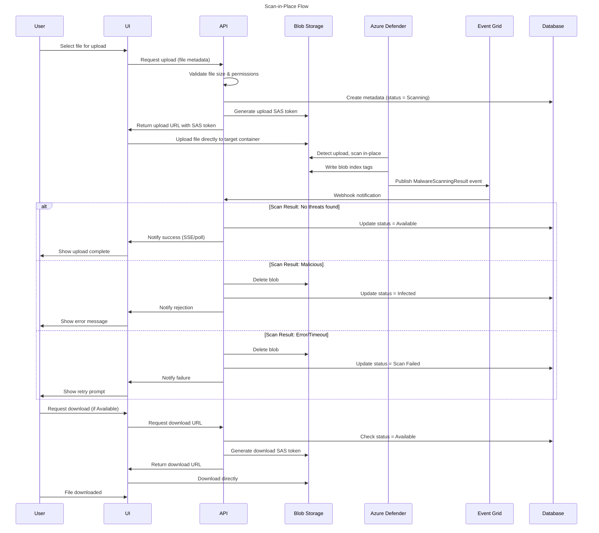
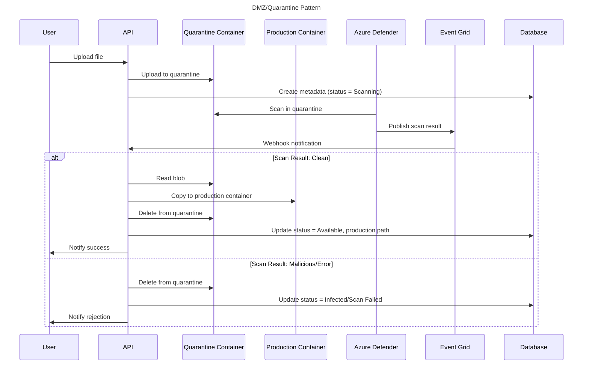

# Documents - Technical Design

## Purpose

This document provides technical design details for the Documents capability. It describes implementation-specific patterns, Azure service configurations, performance characteristics, and technical constraints needed for development and operations.

---

## Malware Scanning

### Overview

**Scanner:** Azure Defender for Storage (Microsoft Defender Antivirus)

**Scanning Approach:** Scan in-place (files scanned in target container, no quarantine required)

**Scanning Policy:**
- ALL uploads scanned before allowing user access - NO EXCEPTIONS
- No "trusted source" exemptions regardless of user role or file source
- If Defender unavailable, ALL uploads blocked until service restored

### Azure Defender Capabilities

| Aspect              | Details                                                                          |
| ------------------- | -------------------------------------------------------------------------------- |
| **Trigger**         | Automatic when blob uploaded to any container in protected storage account       |
| **Scan Engine**     | Microsoft Defender Antivirus (MDAV) with continuously updated threat definitions |
| **Scan Location**   | In-place (scans blob where uploaded, no copying required)                        |
| **Typical Latency** | 2-10 seconds for files <50 MB                                                    |
| **Maximum Timeout** | 60 seconds (exceeding this triggers upload failure)                              |
| **Result Delivery** | Azure Event Grid webhooks to application endpoints                               |
| **Result Storage**  | Blob index tags: `Malware Scanning scan result`, `Malware Scanning scan time`    |

### Known Limitations

| Limitation                                               | Mitigation                                                        |
| -------------------------------------------------------- | ----------------------------------------------------------------- |
| **2 GB file size limit**                                 | Enforce 50-500 MB category limits (never >500 MB)                 |
| **2,000 files/min scan rate per storage account**        | Throttle bulk uploads, queue with progress indicators             |
| **10,000 GB/month default scan cap per storage account** | Monitor at 75% threshold, alert admins, block uploads if exceeded |
| **60 second scan timeout**                               | Mark as Scan Failed, delete blob, notify user to contact support  |
| **Service unavailable**                                  | Block ALL uploads, notify users, alert operations immediately     |

### Scan-in-Place Flow (Recommended)



**Advantages:**
- Simpler architecture (no blob copying between containers)
- Lower latency (upload -> scan -> available, no intermediate copy)
- Lower cost (avoid blob copy operations ~$0.004 per 10,000)
- Single source of truth (blob location matches final destination)

**Trade-offs:**
- Infected files briefly exist in production storage (~2-10 seconds before deletion)
- Application must prevent access during scanning (enforced via database status check)

**Implementation Notes:**
- API generates write-only SAS token for browser-based upload (typically 15-minute expiry)
- Browser uploads file directly to blob storage (no file proxied through API server)
- Database status prevents download SAS token generation while `status = "Scanning"`
- UI polls status endpoint or uses Server-Sent Events for real-time scan result updates
- Background job marks documents as `Scan Failed` if no webhook received within 60 seconds

---

### Alternative: DMZ/Quarantine Pattern



**When to Use:**
- Regulatory requirement that infected files must never exist in production storage
- Multi-tenant scenarios requiring strict isolation between untrusted uploads and production data
- High-security environments with defense-in-depth approach

**Additional Costs:**
- Blob copy operation: ~$0.004 per 10,000 copy operations
- Double storage during scan: Blob exists in both quarantine and production briefly (minimal cost <10 sec)
- Additional latency: ~1-2 seconds for copy operation

**Implementation Options:**
- Use separate storage account for quarantine (strongest isolation)
- Use separate container in same account (simpler management)
- Quarantine container has short retention (24 hours) with auto-cleanup of orphaned files

---

### Scan Result Handling

**Event Grid Webhook Payload:**
```json
{
  "id": "aaaa0000-bb11-2222-33cc-444444dddddd",
  "subject": "storageAccounts/<account>/containers/documents-credential-supporting-docs/blobs/2026/01/application/app-123/doc-abc.pdf",
  "data": {
    "correlationId": "aaaa0000-bb11-2222-33cc-444444dddddd",
    "blobUri": "https://<storage>.blob.core.windows.net/documents-credential-supporting-docs/2026/01/application/app-123/doc-abc.pdf",
    "eTag": "0x8DCE73009331803",
    "scanFinishedTimeUtc": "2026-01-15T10:27:48.6998418Z",
    "scanResultType": "No threats found",
    "scanResultDetails": {
      "malwareNamesFound": ["DOS/EICAR_Test_File"],
      "sha256": "AA11BB22CC33DD44EE55FF66AA77BB88CC99DD00"
    }
  },
  "eventType": "Microsoft.Security.MalwareScanningResult",
  "dataVersion": "1.0",
  "metadataVersion": "1",
  "eventTime": "2026-01-15T10:27:48.7003571Z",
  "topic": "/subscriptions/{sub}/resourceGroups/{rg}/providers/Microsoft.EventGrid/topics/{topic}"
}
```

**Possible `scanResultType` Values:**

| Result               | Meaning                                                  | Action                                                |
| -------------------- | -------------------------------------------------------- | ----------------------------------------------------- |
| `"No threats found"` | File is clean                                            | Mark `Available`, allow downloads                     |
| `"Malicious"`        | Malware/virus detected                                   | Delete blob, mark `Infected`, alert security          |
| `"Error"`            | Scan service error or timeout                            | Delete blob, mark `Scan Failed`, notify user to retry |
| `"Not scanned"`      | Exceeded scan cap, unsupported format, or file too large | Delete blob, mark `Scan Failed`, notify user          |

**Webhook Endpoint Requirements:**
- Event Grid requires responding to validation handshake on first subscription
- Handle duplicate webhook deliveries (Event Grid retries on failure)
- Return 200 OK even if internal processing fails (log for async retry)
- Validate webhook signature to prevent spoofing

**Webhook Timeout Handling:**

Background job monitors documents stuck in `Scanning` status. If webhook not received within 60 seconds, document marked as `Scan Failed`, blob deleted, and user notified.

**No Fallback Scanner:**
- System relies entirely on Azure Defender
- Ensures consistent security posture
- Avoids complexity of multi-scanner orchestration
- Operational monitoring alerts on Defender health issues

### Blob Index Tags

Defender automatically writes scan results to blob index tags (application does not write these):
- `Malware Scanning scan result` = `"No threats found"` | `"Malicious"` | `"Error"` | `"Not scanned"`
- `Malware Scanning scan time` = ISO 8601 timestamp

**Use Cases:**
- Query all unscanned blobs for compliance reporting
- Filter out infected files in administrative views
- Audit scans performed within specific date range

**Note:** Application relies on Event Grid webhooks for real-time processing, not blob index tags.

---

## Storage Tier Management

### Overview

**Approach:** Azure Blob Storage Lifecycle Management (infrastructure-managed, automated)

**Key Principle:** Documents domain uploads files; Azure handles tier transitions automatically via lifecycle policies

### Tier Strategy

| Tier        | Age       | Use Case                                | Storage Cost                   | Access Cost                        | Minimum Duration |
| ----------- | --------- | --------------------------------------- | ------------------------------ | ---------------------------------- | ---------------- |
| **Hot**     | 0-1 year  | Active documents, frequent access       | Highest                        | Lowest                             | None             |
| **Cool**    | 1-3 years | Compliance retention, infrequent access | Lower                          | Higher                             | 30 days          |
| **Archive** | 3+ years  | Long-term retention, rare access        | Lowest (~10x cheaper than Hot) | Requires rehydration (fee applies) | 180 days         |

**Rehydration Times:**
- **Priority:** <1 hour (higher cost)
- **Standard:** Up to 15 hours (lower cost)

### Lifecycle Policy Configuration

**Example Policy (Credential Supporting Documents):**
```json
{
  "rules": [{
    "name": "credential-docs-aging",
    "enabled": true,
    "type": "Lifecycle",
    "definition": {
      "filters": {
        "blobTypes": ["blockBlob"],
        "prefixMatch": ["documents-credential-supporting-docs/"]
      },
      "actions": {
        "baseBlob": {
          "tierToCool": { "daysAfterModificationGreaterThan": 365 },
          "tierToArchive": { "daysAfterModificationGreaterThan": 1095 }
        }
      }
    }
  }]
}
```

**Configuration Management:**
- Defined in infrastructure-as-code (ARM templates, Terraform)
- Managed by infrastructure team, NOT application code or admin UI
- Per-container policies use blob prefix matching
- Policies evaluated daily by Azure platform

**Category-Specific Overrides:**
- Default policies apply uniformly to all categories
- Special cases handled via separate containers with custom policies
- Example: "Active Employment Records" with longer Hot tier retention

**Application Responsibility:**
- Documents domain specifies container names and blob paths during upload
- Exposes tier information in metadata for UI display (e.g., "Archived - retrieval may take up to 1 hour")
- Does NOT manage or trigger tier transitions

---

## Integration Patterns

### Azure Blob Storage Access

**Container Naming:** `documents-{category-slug}`
- Examples: `documents-credential-supporting-docs`, `documents-bulk-import-staging`

**Blob Path Structure:** `{year}/{month}/{attachment-type}/{attachment-id}/{document-id}_{sanitized-filename}`
- **Date Format:** `YYYY/MM` in UTC (timezone-independent)
- **Example:** `documents-credential-supporting-docs/2026/01/application/app-12345/a7f3c9d2_official_transcript.pdf`

**Access Patterns:**

| Operation    | Pattern                                                                                                                                                                                                            |
| ------------ | ------------------------------------------------------------------------------------------------------------------------------------------------------------------------------------------------------------------ |
| **Upload**   | Browser requests upload -> API validates & creates metadata with status=`Scanning` -> API generates write-only SAS token -> browser uploads directly to target container -> API receives webhook -> updates status |
| **Download** | Browser requests download -> API checks status=`Available` in SQL -> API generates read-only SAS token (15 min expiry) -> browser downloads directly from blob storage                                             |
| **Delete**   | Mark soft delete in SQL -> nightly job hard-deletes blobs after retention period                                                                                                                                   |

**Authentication:**
- Application uses Managed Identity (no storage account keys)
- SAS tokens generated programmatically for user downloads
- Read-only permissions, 15-minute expiry

**Error Handling:**
- Upload retries: Exponential backoff, max 3 attempts
- Quota exceeded: Alert admins, block new uploads
- Monitor metrics: Capacity, transaction count, egress bandwidth

---

### Hard Delete Background Job

**Schedule:** Nightly at 2:00 AM EST (Azure Function Timer Trigger)

**Process:**
1. Query soft-deleted documents where retention period expired and no legal hold active
2. Process in batches of 100 documents
3. Delete blob from Azure Storage
4. Update metadata: `hard_deleted = true`, `hard_deleted_at = NOW()`
5. Publish `DocumentHardDeleted` event
6. Generate summary report: total evaluated, deleted, skipped, errors

**Error Handling:**
- Retry failed deletions next night (max 3 consecutive failures)
- Never delete metadata even if blob deletion fails (preserves audit trail)
- Alert admins if >5% deletion failure rate

**Performance Targets:**
- Batch size: 100 documents per iteration
- Total runtime: <10 minutes for 10,000 deletions
- If exceeds 10 minutes, pause and resume next night

**Monitoring:**
- Storage cost savings from deletions
- Retention backlog size (alert if growing unexpectedly)
- Metrics: documents evaluated, deleted, skipped (legal hold), failed

---

### Bulk Upload Staging for Synapse

**Container Naming:** `documents-bulk-import-staging-{functional-area}`
- Examples: `documents-bulk-import-staging-staffing`, `documents-bulk-import-staging-epp`

**File Naming:** `{upload-id}_{timestamp}_{original-filename}`

**Lifecycle:**
1. User uploads bulk file (CSV/XLSX) via UI
2. Backend validates file size (max 500 MB)
3. Backend uploads to staging container (scanned by Defender in-place)
4. After clean scan, publish `BulkFileUploaded` event
5. Synapse pipeline consumes event, reads file from staging
6. Pipeline processes data, publishes `BulkFileProcessed` event
7. Backend updates bulk operation status
8. Auto-cleanup: Delete blobs older than 7 days

**Access Control:**
- Synapse uses separate Managed Identity with read-only access
- Synapse does NOT write to staging containers
- Results written to data warehouse
- Event-driven decoupling (no direct API calls between domains)

**Error Handling:**
- Pipeline failure: File remains in staging for manual retry
- Admins can view, download, or manually delete staging files
- Alert if files accumulate (indicates pipeline issues)

---

## Technical Considerations

### Performance

| Metric                             | Target                                                 |
| ---------------------------------- | ------------------------------------------------------ |
| **Upload latency**                 | <5 seconds for <10 MB files (excluding scan)           |
| **Malware scan**                   | <10 seconds typical, <60 seconds maximum               |
| **SAS token generation**           | <100ms                                                 |
| **Metadata query (by attachment)** | <500ms (indexed on `attachment_type`, `attachment_id`) |
| **Bulk upload throughput**         | Throttled to <2,000 files/min (Defender limit)         |

### Architecture Patterns

- **Blob storage organization:** By category for differential policies
- **Metadata storage:** Azure SQL with blob path references
- **Scan-in-place pattern:** Files scanned in target container (no copying)
- **Managed Identity:** Eliminates storage keys in code
- **SAS tokens:** Time-limited (15 min), read-only access for downloads

### Security

- **Encryption at rest:** Azure Storage Service Encryption (Microsoft-managed keys)
- **Access control:** RBAC determines upload/view permissions per context
- **Audit logging:** All interactions logged (upload, view, replace, delete) with user ID and timestamp
- **Malware scanning:** Mandatory for all uploads, no exceptions or fallbacks
- **Override workflows:** Require justification and approval for retention policy exceptions
- **Webhook validation:** Event Grid signatures verified to prevent spoofing

### Scalability

- **Blob storage:** Horizontally scales to petabytes (Azure-managed)
- **Partitioning:** Documents partitioned by year/month for query performance
- **Bulk operations:** Queued and processed asynchronously
- **Scan capacity:** Monitored with alerts approaching rate limits

---

## Appendix: Filename Sanitization

**Purpose:** Ensure uploaded filenames are compatible with Azure Blob Storage

**Algorithm:**
1. Remove special characters: `/ \ : * ? " < > |`
2. Replace spaces with underscores: ` ` -> `_`
3. Remove leading/trailing periods: `.file.pdf` -> `file.pdf`
4. Preserve file extension (last `.extension`)
5. Truncate to 255 characters (preserve extension)
6. Convert to UTF-8 encoding

**Examples:**

| Original                      | Sanitized                   |
| ----------------------------- | --------------------------- |
| `My File (v2).pdf`            | `My_File_v2.pdf`            |
| `John's Transcript: 2025.pdf` | `Johns_Transcript_2025.pdf` |
| `Report #3 - Final*.docx`     | `Report_3_-_Final.docx`     |
| `.hidden_file.txt`            | `hidden_file.txt`           |

**Edge Cases:**

| Scenario                           | Handling                |
| ---------------------------------- | ----------------------- |
| Only special chars: `***.pdf`      | Default: `document.pdf` |
| No extension: `README`             | Preserved as-is         |
| Multiple extensions: `file.tar.gz` | All preserved           |
| Unicode: `文档.pdf`                | Preserved (UTF-8)       |

---

## Appendix: Azure Defender Configuration

### Required Resources

Created automatically when Defender enabled:
- **Event Grid System Topic** - Listens for blob upload events (storage account resource group)
- **StorageDataScanner** - Performs scans (managed service with system-assigned identity)
- **DefenderForStorageSecurityOperator** - Manages policies (subscription level)

### Subscription-Level Enablement (Recommended)

```json
{
  "type": "Microsoft.Security/pricings",
  "apiVersion": "2024-01-01",
  "name": "StorageAccounts",
  "properties": {
    "pricingTier": "Standard",
    "subPlan": "DefenderForStorageV2",
    "extensions": [{
      "name": "OnUploadMalwareScanning",
      "isEnabled": "True",
      "additionalExtensionProperties": {
        "CapGBPerMonthPerStorageAccount": "10000"
      }
    }]
  }
}
```

### Event Grid Custom Topic

**Purpose:** Receive webhook notifications for scan results

**Setup:**
1. Create Event Grid Custom Topic in same region as storage account
2. Navigate to: Storage Account -> Microsoft Defender for Cloud -> Settings
3. Enable: "Send scan results to Event Grid topic"
4. Select: Your custom topic
5. Set: "Override Defender for Storage subscription-level settings" = On
6. Subscribe your application webhook endpoint to the Event Grid topic

### Cost Management

| Aspect            | Details                                                       |
| ----------------- | ------------------------------------------------------------- |
| **Pricing Model** | Per-GB scanned (data volume, not per file)                    |
| **Default Cap**   | 10,000 GB/month per storage account                           |
| **75% Alert**     | "Malware scanning will stop soon"                             |
| **Cap Exceeded**  | Scanning stops until next month (remaining blobs not scanned) |

### Monitoring

- **Azure Monitor Metrics:** Scan success rate, duration, malware detections
- **Event Grid Events:** All scan results available via webhook
- **Security Alerts:** Defender for Cloud generates alerts for malicious files
- **Log Analytics (optional):** Centralized scan results in `StorageMalwareScanningResults` table

### References

- [Introduction to Malware Scanning](https://learn.microsoft.com/en-us/azure/defender-for-cloud/introduction-malware-scanning)
- [Set Up Automated Remediation](https://learn.microsoft.com/en-us/azure/defender-for-cloud/defender-for-storage-configure-malware-scan)
- [Advanced Configurations](https://learn.microsoft.com/en-us/azure/defender-for-cloud/advanced-configurations-for-malware-scanning)
- [Webhook Event Delivery](https://learn.microsoft.com/en-us/azure/event-grid/webhook-event-delivery)