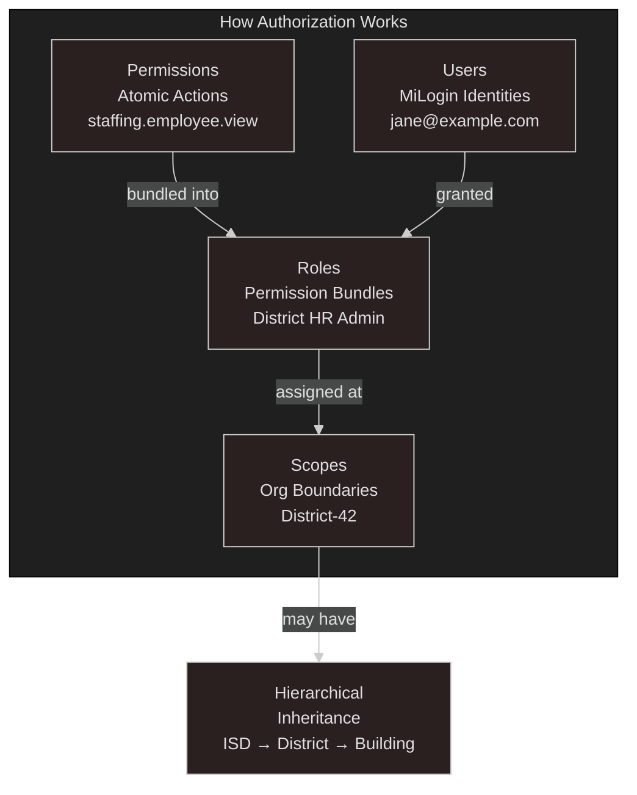
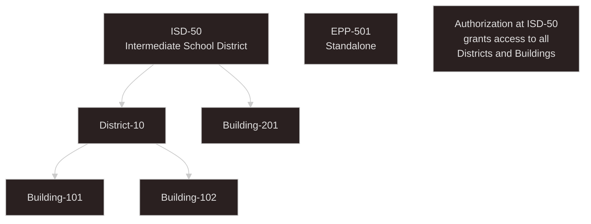
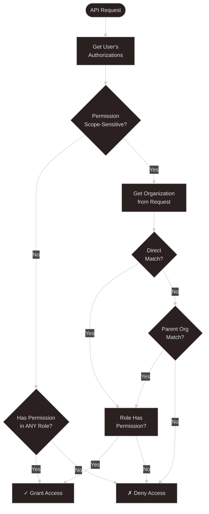
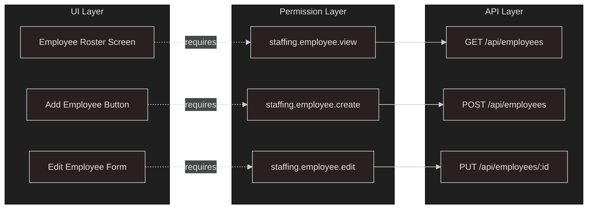
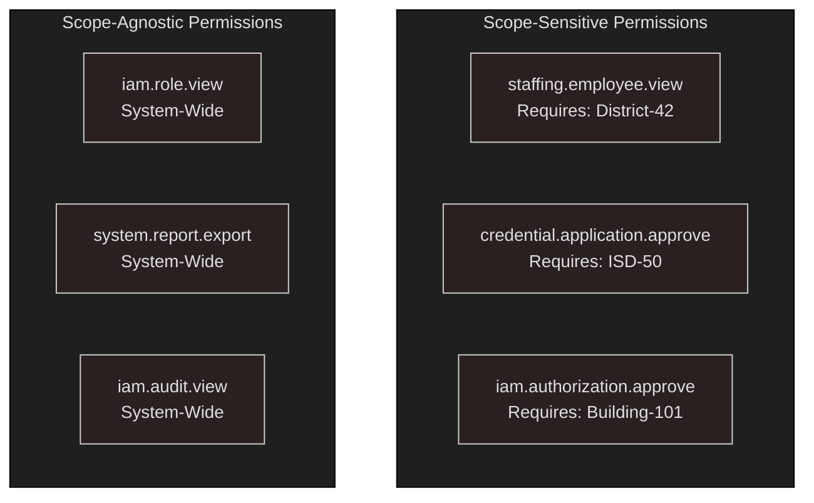
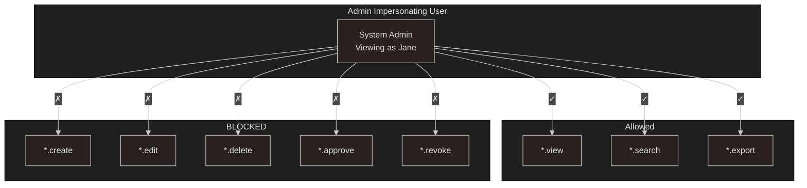
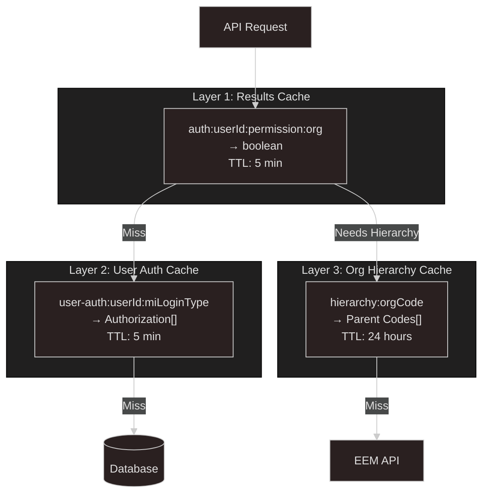
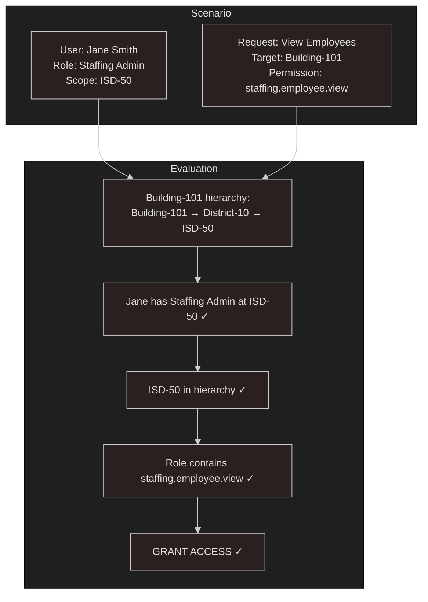

# IAM Authorization Model - Visual Summary

## 1. Authorization Model Components

---

## 2. Organization Hierarchy & Transitive Permissions

---

## 3. Authorization Evaluation Flow

---

## 4. Permission Design: Endpoint-Focused

**Key Principle:** Permissions map to technical endpoints, not business processes. Backend checks permissions, not roles.

---

## 5. Scope Types

---

## 6. Impersonation: Read-Only Mode

**Rule:** ALL mutations blocked during impersonation, regardless of target user's permissions.

---

## 7. Three-Layer Cache Architecture

**Performance Target:** < 5ms for cache hits, < 50ms for cache misses

---

## 8. Transitive Permission Example

---

## Quick Reference

### Authorization Decision Factors
1. **User's Roles** - What roles are assigned?
2. **Role Permissions** - What can those roles do?
3. **Scope Assignment** - Where was role granted?
4. **Organization Hierarchy** - Is target org in scope?
5. **Request Context** - What org is being accessed?

### Key Rules
- **Transitive:** ISD authorization → all Districts + Buildings
- **Endpoint-Focused:** Check permissions, not roles
- **Impersonation:** Read-only, mutations always blocked
- **Cache-First:** Sub-5ms performance for common checks
- **Three Segments:** `domain.resource.action` max