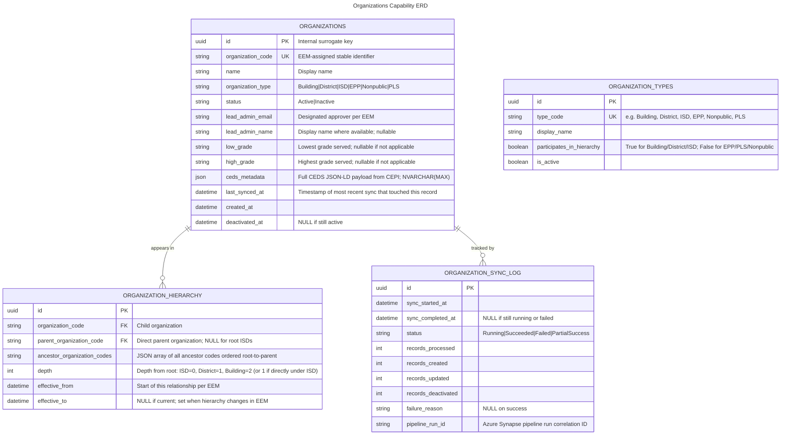

# Organizations

- **Type:** Platform Capability
- **Identifier:** organizations
- **Display Name:** Organizations
- **Primary Sources:** EEM / CEPI CEDS JSON-LD API

---

## Purpose

The Organizations Capability is the authoritative source of truth for educational organization data within MiEdWorkforce. It maintains a locally replicated, CEDS-aligned replica of organization records sourced from CEPI's CEDS JSON-LD API (which itself reflects EEM as the upstream source of record), and exposes that data through a focused read-only API consumed by all domains that need organizational context.

This capability exists so that no domain needs to integrate directly with EEM or CEPI for organization lookups. It absorbs the sync complexity, materializes the hierarchy, and provides consistent, low-latency query access system-wide.

---

## Classification Rationale

This is a Platform Capability rather than a Core Domain because it owns no business processes and enforces no domain-specific invariants. Its sole responsibility is reliable replication, storage, and query of organization data whose business meaning is defined externally (by EEM/CEPI). All domains consume it; none own it.

---

## Scope

**This capability owns:**
- Local replica of organization records sourced from CEPI CEDS JSON-LD API
- Materialized organization hierarchy (parent-child relationships, transitive ancestry chains)
- Organization type catalog (the set of valid organization types present in EEM)
- Org-level grade band data (the grades an organization is authorized to serve)
- Lead Administrator designation per organization (as designated in EEM)
- The EEM/CEPI sync pipeline and all transformation logic

**This capability does NOT own:**
- Organization data at its source > owned by `external-eem` (via CEPI)
- Authorization decisions that use organization data > owned by `iam`
- Position-level grade bands (which grades a *position* covers) > owned by `staffing`
- EPP-specific organization configuration (designation dates, program approvals) > owned by `epp`
- Professional Learning sponsor configuration > owned by `professional-learning`
- Any write operations — MiEdWorkforce cannot modify EEM data

---

## Ubiquitous Language

| Term                       | Definition                                                                                                                                                                                                                                                 |
| -------------------------- | ---------------------------------------------------------------------------------------------------------------------------------------------------------------------------------------------------------------------------------------------------------- |
| **Organization**           | An educational entity as defined in EEM — a Building, District, ISD, EPP, Nonpublic School, or Professional Learning Sponsor — each identified by a unique organization code.                                                                              |
| **Organization Code**      | The stable, unique identifier for an organization as assigned by EEM. Used as the primary key in all cross-domain references.                                                                                                                              |
| **Organization Type**      | The classification of an organization (e.g., Building, District, ISD, EPP, Nonpublic, PLS). Determines what scopes and roles are applicable in IAM, and what features are available in other domains.                                                      |
| **Organization Hierarchy** | The parent-child relationships between organizations, primarily ISD > District > Building. A Building may in some cases be directly under an ISD with no intermediate District.                                                                            |
| **Ancestor Chain**         | The ordered list of parent organizations from an organization up to the root (e.g., Building → District → ISD). Used in IAM for transitive permission evaluation.                                                                                          |
| **Lead Administrator**     | The individual designated in EEM as the primary administrative contact for an organization. Authorization requests for that organization's scope are routed to this person. There is exactly one Lead Administrator per organization at any point in time. |
| **Grade Band (Org-Level)** | The range of grades an organization is authorized to serve (e.g., K-8, 9-12). Describes the organization's charter, not the scope of any particular position or assignment.                                                                                |
| **Local Replica**          | The copy of EEM/CEPI data stored within MiEdWorkforce's own database. Read-only from MiEdWorkforce's perspective; authoritative for all internal consumers.                                                                                                |
| **Sync Cycle**             | One execution of the Synapse pipeline that pulls current data from the CEPI API and updates the local replica. Runs nightly.                                                                                                                               |
| **Staleness Window**       | The maximum time between a change in EEM and that change being reflected in the local replica. Currently bounded by the nightly sync cadence plus consumer cache TTL.                                                                                      |

---

## Domain Model

### Core Aggregates

#### Organization

**Root Entity:** Organization

**Purpose:** Represents a single educational entity and all attributes needed by consuming domains — identity, type, hierarchy position, grade band, and Lead Administrator designation. Protects the invariant that no MiEdWorkforce domain ever needs to call EEM directly for organizational context.

**Entities & Value Objects:**
- **Organization** (Entity) — Master record with code, name, type, status, and Lead Admin designation
- **OrganizationHierarchy** (Entity) — Materialized parent-child relationships; rebuilt on each sync cycle
- **GradeBand** (Value Object) — Low grade and high grade pair representing an organization's authorized serving range
- **LeadAdministrator** (Value Object) — Email address (and name where available) of the designated approver for this organization

**Key Invariants:**
- Every organization has exactly one organization code, which is immutable
- Every organization has exactly one Lead Administrator at any point in time; this is sourced from EEM and cannot be overridden in MiEdWorkforce
- An organization's type is immutable once created; type changes in EEM result in deactivation of the old record and creation of a new one
- Hierarchy relationships are sourced exclusively from EEM; MiEdWorkforce does not allow manual hierarchy edits
- A Building may have either a District or an ISD as its direct parent; both are valid

**Key States:** `Active`, `Inactive`

**Referenced In:**
- Sequence: CEPI Nightly Sync
- Sequence: Organization Search (typeahead)
- Sequence: Hierarchy Resolution (IAM permission evaluation)
- Sequence: Lead Admin Lookup (IAM authorization routing)

---

### Entity Relationship Diagram

---

## Domain Events

The Organizations Capability does not publish domain events in the traditional sense — it does not generate business state transitions. However, it does publish infrastructure events to support consumer cache invalidation:

| Event                       | Trigger                              | Payload Highlights                                                            | Consumers                                 |
| --------------------------- | ------------------------------------ | ----------------------------------------------------------------------------- | ----------------------------------------- |
| `OrganizationSyncCompleted` | Sync pipeline completes successfully | `{ syncId, recordsCreated, recordsUpdated, recordsDeactivated, completedAt }` | iam (cache invalidation)                  |
| `OrganizationDeactivated`   | Org marked Inactive during sync      | `{ organizationCode, organizationType, deactivatedAt }`                       | iam, staffing, epp, professional-learning |
| `LeadAdministratorChanged`  | Lead Admin email changed during sync | `{ organizationCode, previousEmail, newEmail, effectiveAt }`                  | iam (approval routing cache)              |

**Published To:** Azure Service Bus topic: `organizations-events`

**Note:** Consumers should not depend on per-record change events for data freshness. The `OrganizationSyncCompleted` event is the signal to consider cached org data potentially stale. Per-record events (`OrganizationDeactivated`, `LeadAdministratorChanged`) are published only for high-impact changes that warrant immediate consumer action.

---

## Dependencies

### Upstream (We Consume From)

| Source                    | What We Need                                                                                   | How We Get It                         | Notes                                                                                                                                                                            |
| ------------------------- | ---------------------------------------------------------------------------------------------- | ------------------------------------- | -------------------------------------------------------------------------------------------------------------------------------------------------------------------------------- |
| **CEPI CEDS JSON-LD API** | Organization records, hierarchy relationships, Lead Admin designations, grade bands, org types | Synapse Pipeline batch pull (nightly) | CEPI is building this API based on MiEdWorkforce requirements. Field contract to be finalized — see Open Questions. EEM is the upstream source; CEPI is the integration surface. |

### Downstream (Others Consume From Us)

| Consumer                  | What They Need                                                                                                                                     | How They Get It                       | Notes                                                                          |
| ------------------------- | -------------------------------------------------------------------------------------------------------------------------------------------------- | ------------------------------------- | ------------------------------------------------------------------------------ |
| **iam**                   | Org search, org by code, ancestor chain for transitive permission evaluation, Lead Admin email for approval routing, org type for scope validation | Synchronous HTTP to Organizations API | Highest query volume consumer; drives the 60-min cache TTL recommendation      |
| **staffing**              | Org by code (name, type, grade band) for employee roster and position context                                                                      | Synchronous HTTP to Organizations API | Grade band used for position validation                                        |
| **epp**                   | Org by code for EPP provider display and validation                                                                                                | Synchronous HTTP to Organizations API | EPP-specific configuration stored in EPP domain; base identity comes from here |
| **professional-learning** | Org by code for sponsor display                                                                                                                    | Synchronous HTTP to Organizations API |                                                                                |
| **credentialing**         | Org by code for application context                                                                                                                | Synchronous HTTP to Organizations API | Lower volume; primarily for display                                            |

---

## Business Rules

### Lead Administrator Is Sourced From EEM Only

**Rule:** The Lead Administrator for an organization is exactly as designated in EEM. MiEdWorkforce does not allow this to be overridden or supplemented through the Organizations API or any admin interface.

**Rationale:** The Lead Administrator role has legal and operational significance — requests for access are routed to this person, and they have approval authority over their organization's scope. The integrity of that routing must trace back to EEM.

**Enforced By:** The sync pipeline sets `lead_admin_email` from CEPI data only. There is no write endpoint for this field.

**Example:** If District 42 designates a new Lead Administrator in EEM, the next nightly sync will update the record, publish a `LeadAdministratorChanged` event, and IAM's approval routing cache will be invalidated.

---

### Hierarchy Is Materialized, Not Computed at Query Time

**Rule:** Ancestor chains are pre-computed during each sync cycle and stored in `organization_hierarchy`. Consumers query the materialized data; they do not traverse relationships recursively at runtime.

**Rationale:** IAM evaluates transitive permissions on every protected API call, requiring sub-10ms hierarchy resolution. Runtime recursive traversal of a relational hierarchy cannot meet this target under load. Materialization moves the cost to the sync pipeline, which has no latency constraints.

**Enforced By:** Synapse sync pipeline rebuilds `organization_hierarchy` on each run. The `ancestor_organization_codes` JSON array on each hierarchy record contains the full chain, allowing a single-row lookup per organization.

---

### Organization Type Is Immutable

**Rule:** An organization's type cannot change. If EEM indicates a type change (rare, but possible), the sync pipeline deactivates the existing record and creates a new one with a new internal ID. The organization code remains the same.

**Rationale:** Organization type determines what roles, scopes, and features are available in consuming domains. An in-place type change would invalidate cached data and active authorizations in ways that are difficult to reason about. Treat-as-new is cleaner.

**Enforced By:** Sync pipeline detects type mismatches on existing records and routes them to the deactivate-and-recreate path rather than the update path.

---

### Inactive Organizations Are Retained

**Rule:** Organizations deactivated in EEM are marked `Inactive` in the local replica but are never deleted. Historical records (authorizations, assignments, enrollments) in consuming domains may reference them.

**Rationale:** Referential integrity across the system depends on organization codes remaining resolvable. A building that closed three years ago may still appear in audit findings or historical credential records.

**Enforced By:** The sync pipeline's deactivation path sets `status = Inactive` and `deactivated_at`. No hard delete path exists.

---

## Integration Patterns

### CEPI CEDS JSON-LD API

**Purpose:** Primary data feed for all organization data. CEPI is building this API in coordination with MiEdWorkforce requirements.

**Pattern:** Scheduled batch pull via Azure Synapse Pipeline

**Frequency:** Nightly (1 AM EST)

**Authentication:** To be determined pending CEPI API contract finalization. Expected: OAuth2 client credentials with Azure Key Vault secret storage.

**Current State:** API under development by CEPI. Field contract being finalized — see Open Questions. Until the API is available, a manual seed process will populate initial org data.

**Error Handling:**
- If the CEPI API is unavailable during a sync run: Synapse retries up to 3 times with exponential backoff. If all retries fail, the sync is marked `Failed` in `organization_sync_log`, an alert fires to the platform operations team, and the existing local replica remains in service unchanged. No partial writes occur — the pipeline is transactional at the batch level.
- If individual records fail validation during sync: Records are skipped and logged as warnings in the sync log. The overall sync is marked `PartialSuccess`. A daily digest of skipped records is sent to the platform operations team for review.
- Consumers continue operating on the previous sync's data during any failure window. Given the nightly cadence, the worst-case staleness is approximately 24 hours plus consumer cache TTL.

**Constraint:** MiEdWorkforce is a read-only consumer of CEPI data. No writes or corrections flow back through this integration.

---

## Technical Considerations

**Performance:**
- The primary performance constraint is IAM's permission check path, which calls the Organizations API on every protected request that requires scope-sensitive evaluation. The hierarchy lookup must consistently return in under 10ms.
- This is achieved through a combination of: single-row hierarchy lookup via the materialized `ancestor_organization_codes` array, consumer-side Redis caching with a 60-minute configurable TTL, and a small database footprint (Michigan has approximately 4,000 active educational organizations) that fits comfortably in the buffer pool.
- All consumers are expected to implement their own local cache using the pattern described in the Caching Strategy section below.

**Caching Strategy (Canonical — all consumers reference this):**

Consumer domains should cache Organizations API responses using the following patterns and TTLs. These are defaults; the TTL for the `organizations` namespace is system-configurable to allow tuning without deployment.

| Cache Key Pattern                   | Contents                                                         | Default TTL | Invalidation                                                   |
| ----------------------------------- | ---------------------------------------------------------------- | ----------- | -------------------------------------------------------------- |
| `org:{organizationCode}`            | Organization detail (name, type, status, grade band, lead admin) | 60 minutes  | `OrganizationSyncCompleted` or `OrganizationDeactivated` event |
| `org-hierarchy:{organizationCode}`  | Ancestor chain array                                             | 60 minutes  | `OrganizationSyncCompleted` event                              |
| `org-lead-admin:{organizationCode}` | Lead admin email and name                                        | 60 minutes  | `LeadAdministratorChanged` event                               |
| `org-types`                         | List of all active organization types                            | 24 hours    | On deployment (type list changes only via code)                |
| `org-search:{queryHash}`            | Search results for a specific query string + filters             | 15 minutes  | Not event-driven; TTL expiry only                              |

**Staleness Tolerance:**
- Org detail, hierarchy, Lead Admin: up to 60 minutes of consumer cache staleness is acceptable on top of the nightly sync cadence. The practical worst case is ~25 hours (sync runs at 1 AM; a change made at 1:01 AM won't be picked up until the next night, then takes up to 60 minutes to propagate through consumer caches).
- This is acceptable because org structure changes (new buildings, district reorganizations, Lead Admin changes) are infrequent and typically planned well in advance.
- IAM's approval routing for new authorization requests uses the Lead Admin from cache. If the cache is stale and routes to an outgoing Lead Admin, that admin's approval link will still function (they retain their authorization until the next sync invalidates it), causing no breakage.

**Availability and Degraded Operation:**
- If the Organizations API is unavailable, consumers should serve from their local cache rather than failing. Auth decisions, org lookups, and hierarchy resolution should all degrade gracefully to cached data.
- If a consumer's cache is empty and the Organizations API is unavailable, the safe default is to deny scope-sensitive operations and surface a user-facing message indicating that organizational data is temporarily unavailable. Never fail open on access control.

**Security:**
- The Organizations API is an internal-only service. It is not exposed through APIM and has no public endpoints.
- All service-to-service calls are protected by Istio mTLS. No additional application-layer auth is required for internal consumers.
- Lead Admin email addresses are considered internal operational data. They are not returned through any public or external-facing API.

**Compliance:**
- Organization data is not subject to FERPA or other individual privacy regulations — it describes institutional entities, not persons. The Lead Admin email is a work contact, not personal data in the FERPA sense.
- Sync logs are retained for 1 year for operational audit purposes.

---

## Workflows

1. **CEPI Nightly Sync** — Pulls current organization data from CEPI, updates local replica, materializes hierarchy, publishes change events > See: [Sequences Doc](./organizations-sequences.md#cepi-nightly-sync)
2. **Organization Search** — Typeahead query against local replica for use in authorization request forms and org selectors across domains > See: [Sequences Doc](./organizations-sequences.md#organization-search)
3. **Hierarchy Resolution** — Retrieves ancestor chain for an organization to support transitive permission evaluation in IAM > See: [Sequences Doc](./organizations-sequences.md#hierarchy-resolution)
4. **Lead Admin Lookup** — Retrieves Lead Administrator contact for a specific organization to route authorization approval requests > See: [Sequences Doc](./organizations-sequences.md#lead-admin-lookup)
5. **Degraded Operation (Sync Failure)** — Behavior when the CEPI sync fails and consumers must operate on stale data > See: [Sequences Doc](./organizations-sequences.md#degraded-operation)

---

## Open Questions

| #   | Question                                                                                                                                                                                                                                                                                                             |
| --- | -------------------------------------------------------------------------------------------------------------------------------------------------------------------------------------------------------------------------------------------------------------------------------------------------------------------- |
| 1   | What fields will CEPI's CEDS JSON-LD API provide? At minimum the following are needed: organization code, name, type, status, lead administrator email, parent organization code, and grade band (low/high). Confirmation needed on whether CEPI provides all of these or whether any require supplemental sourcing. |
| 2   | Will CEPI provide a delta feed (only changed records since last sync) or a full snapshot on each sync cycle?                                                                                                                                                                                                         |
| 3   | What is CEPI's expected API availability SLA and rate limit?                                                                                                                                                                                                                                                         |
| 4   | Does EEM distinguish between a building with no grade band configured vs. one that genuinely serves all grades? Null and "K-12" are meaningfully different for staffing placement validation.                                                                                                                        |
| 5   | Can a single person be designated as Lead Administrator for multiple organizations simultaneously in EEM?                                                                                                                                                                                                            |