# Payments

- **Type:** Platform Capability
- **Identifier:** payments
- **Display Name:** Payments
- **Primary Sources:** BRDs 7.1, 7.2, 7.3; Interface Design Doc (CEPAS)

---

## Purpose

The Payments platform capability provides centralized payment processing infrastructure across MiEdWorkforce, enabling credential application fee collection, refund processing, and payment reconciliation through integration with the State of Michigan's CEPAS (Centralized Electronic Payment Authorization System). It manages the complete payment lifecycle from fee calculation through payment confirmation, reconciliation, and refund processing while ensuring PCI compliance by never handling sensitive payment card data.

---

## Classification Rationale

**Platform Capability** - Payments is foundational infrastructure used by all fee-requiring domains (primarily Credentials, but extensible to Staffing, Professional Learning, etc.). It doesn't contain business logic about *what* fees are charged or *why*, but provides the *how* for secure payment processing. All domains requiring payment collection depend on it for revenue capture and application workflow advancement. While fee configuration introduces some domain-like characteristics, the primary value is technical enablement and compliance rather than direct business value delivery.

---

## Scope

**This capability owns:**
- Payment initiation flow (redirect orchestration to CEPAS)
- Payment data encryption (AES GCM) for secure transmission to CEPAS
- Payment confirmation receipt and hash validation
- Transaction record lifecycle management (Pending -> Paid -> Refunded)
- Refund request processing via CEPAS API
- Daily reconciliation file (posting file) retrieval and processing
- Payment audit trail and discrepancy tracking
- Bulk/batch payment processing for multiple applications
- Payment status tracking across credential application lifecycle
- Missing payment detection and automatic status updates

**This capability does NOT own:**
- Credential application workflow state transitions -> `credentialing` domain
- Fee schedule configuration and pricing management -> `credentialing` domain (or respective functional area)
- CEPAS credential management (encryption keys, security keys, API credentials, SFTP credentials) -> Azure Key Vault / infrastructure configuration
- Payment card processing and PCI-sensitive data -> CEPAS external service
- User authentication and authorization -> `iam` domain
- SFTP infrastructure and file transfer -> `documents` capability
- SendGrid integration for payment confirmation emails -> `communications` domain

---

## Ubiquitous Language

| Term                           | Definition                                                                                                                                           |
| ------------------------------ | ---------------------------------------------------------------------------------------------------------------------------------------------------- |
| **Payment Transaction**        | A financial transaction record tracking fee collection for a credential application, including amount, status, confirmation numbers, and audit trail |
| **CEPAS**                      | Centralized Electronic Payment Authorization System - State of Michigan Treasury's payment gateway for credit card and e-check transactions          |
| **Payment Redirect**           | User navigation from MiEdWorkforce to CEPAS payment site via encrypted HTTPS redirect with payment parameters                                        |
| **Payment Confirmation**       | CEPAS return data after payment attempt, including success/failure status, confirmation number, and transaction metadata                             |
| **Confirmation Number**        | Unique identifier assigned by CEPAS to a completed payment transaction (e.g., used for refunds and reconciliation)                                   |
| **Hash Validation**            | Security verification using SHA-1 hash of confirmation number, amount, and secret key to ensure payment data integrity                               |
| **Posting File**               | Daily batch file from CEPAS containing previous day's confirmed transactions for reconciliation purposes                                             |
| **Reconciliation**             | Process of matching CEPAS posting file records to internal MiEdWorkforce payment transactions to identify discrepancies                              |
| **Reference Data**             | Custom 254-character field sent to CEPAS and returned in posting file for matching transactions (e.g., application ID)                               |
| **Refund**                     | Return of payment to original payer, processed via CEPAS CancelPayment API, resulting in new confirmation number                                     |
| **Partial Refund**             | Return of less than the full original payment amount (e.g., processing fee retained)                                                                 |
| **Bulk Payment**               | Single payment transaction covering fees for multiple credential applications (e.g., district paying for 10 substitute credentials)                  |
| **Payment Command Code**       | Indicator in posting file denoting transaction type: Payment (1), Refund (5), Void (6), Chargeback (9), Chargeback Reversal (10), Partial Refund (14), ACH Credit (15), or Processor Void (16). Only Payment and Refund are actively reconciled today (see "Daily Posting File Reconciliation"); all other codes land in `Discrepancy` for manual review, pending explicit handling. |
| **Missing Payment**            | Transaction confirmed in CEPAS posting file but not recorded in MiEdWorkforce during real-time redirect flow                                         |
| **Payment Amount**             | Fee total for credential application, pre-calculated and non-editable, sent to CEPAS for processing                                                  |
| **Authorization Code**         | CEPAS-provided code indicating payment gateway approval (distinct from confirmation number)                                                          |
| **Card Type**                  | Payment method indicator: VISA, MC, AMEX, DISC, STAR, Pulse, NYCE (not sent for eCheck)                                                              |
| **Return Code**                | CEPAS status code indicating payment result (success, decline, error, etc.)                                                                          |
| **Settlement Submission Date** | Date CEPAS submits payment batch for settlement with financial institutions                                                                          |
| **Encrypted Payload**          | AES GCM-encrypted string containing payment parameters, formatted as `aen=<key_id>                                                                   | <12B_nonce><encrypted_data>` |
| **Security Key**               | Shared secret used for hash validation and CEPAS API authentication                                                                                  |
| **Application ID**             | CEPAS-assigned identifier for MiEdWorkforce's PayPoint account                                                                                       |
| **Payment Channel**            | CEPAS parameter indicating payment source (1 = Web, used by MiEdWorkforce)                                                                           |

---

## Domain Model

### Core Aggregates

#### PaymentTransaction

**Root Entity:** PaymentTransaction

**Purpose:** Manages the complete lifecycle of a fee payment for a credential application, from initiation through confirmation, reconciliation, and potential refund. Serves as the system of record for all payment-related state.

**Entities & Value Objects:**
- **PaymentTransaction** (root) - Core payment metadata, status, and lifecycle tracking
- **PaymentInitiation** - Encrypted redirect payload, sent timestamp, user context
- **PaymentConfirmation** - CEPAS return data including confirmation number, authorization code, card type, return message/code
- **PaymentReconciliation** - Posting file match status, reconciliation timestamp, discrepancy flags
- **PaymentRefund** - Refund request metadata, refund confirmation number, refund amount, processed date
- **BulkPaymentItem** - Association to parent bulk payment transaction (for multi-application payments)

**Key Invariants:**
- Payment amount must be greater than zero
- Payment amount is immutable after transaction creation (derived from credential type at initiation)
- Only transactions in `Paid` status can be refunded
- Refund amount must be less than or equal to original payment amount
- Hash validation must succeed before marking payment as confirmed
- Transaction status progression: `Pending` -> `Paid` OR `Failed` -> optionally `Refunded` / `PartiallyRefunded`
- Reference data field limited to 254 characters
- Confirmation number required for refund processing
- Bulk payment total must equal sum of individual application fees
- Missing payment detection only updates status if current status is `Pending`

**Key States:** 
- `Pending` - Awaiting payment (user has not completed CEPAS flow or payment in progress)
- `Paid` - Successfully confirmed via CEPAS return redirect OR posting file
- `Failed` - Payment attempt failed (declined card, user cancellation, CEPAS error)
- `Refunded` - Full refund processed
- `PartiallyRefunded` - Partial refund processed
- `Reconciled` - Matched against CEPAS posting file (sub-state of Paid)
- `Discrepancy` - Posting file mismatch requiring manual review

**Referenced In:**
- Sequence: Individual Payment Flow (Redirect and Confirmation)
- Sequence: Bulk Payment Processing
- Sequence: Refund Request Processing
- Sequence: Daily Posting File Reconciliation
- Sequence: Missing Payment Recovery

---

#### ReconciliationBatch

**Root Entity:** ReconciliationBatch

**Purpose:** Tracks daily processing of CEPAS posting files, enabling audit trail of reconciliation operations and identification of systematic issues.

**Entities & Value Objects:**
- **ReconciliationBatch** (root) - Batch metadata, file receipt timestamp, processing status
- **ReconciliationRecord** - Individual posting file entry with match status
- **ReconciliationDiscrepancy** - Unmatched or conflicting records requiring manual review
- **ReconciliationSummary** - Aggregate counts (total records, matched, missing, discrepancies)

**Key Invariants:**
- One batch per calendar day per CEPAS application
- Batch processing is idempotent (reprocessing same file yields same results)
- All posting file records must be categorized: Matched, Missing, or Discrepancy
- Discrepancies remain flagged until manually resolved
- Batch status progression: `Received` -> `Processing` -> `Completed` OR `Failed`

**Key States:** `Received`, `Processing`, `Completed`, `Failed`, `PartiallyCompleted`

**Referenced In:**
- Sequence: Daily Posting File Reconciliation
- Sequence: Discrepancy Investigation

---

#### RefundRequest

**Root Entity:** RefundRequest

**Purpose:** Manages the workflow of refund processing, including administrator authorization, CEPAS API interaction, and audit trail.

**Entities & Value Objects:**
- **RefundRequest** (root) - Refund initiation metadata, requester, approval status
- **RefundApproval** - Approval/rejection decision, approver, timestamp, reason
- **RefundConfirmation** - CEPAS API response data (refund confirmation number, processed date)
- **RefundAudit** - Immutable audit log of refund lifecycle events

**Key Invariants:**
- Refund requests must reference existing Paid transaction
- Refund amount validation occurs before CEPAS API call
- Approved refunds cannot be cancelled (irreversible)
- Refund request status progression: `Requested` -> `Approved` / `Rejected` -> `Processing` -> `Completed` / `Failed`

**Key States:** `Requested`, `Approved`, `Rejected`, `Processing`, `Completed`, `Failed`

**Referenced In:**
- Sequence: Refund Request Processing
- Sequence: Bulk Refund Processing

---

### Entity Relationship Diagram

```mermaid
---
title: Payments ERD
---
erDiagram
    BULK_PAYMENT_TRANSACTIONS ||--o{ PAYMENT_TRANSACTIONS : "contains"
    PAYMENT_TRANSACTIONS ||--o{ REFUND_REQUESTS : "has"
    PAYMENT_TRANSACTIONS ||--o{ PAYMENT_TRANSACTION_EVENTS : "generates"
    RECONCILIATION_BATCHES ||--o{ RECONCILIATION_DISCREPANCIES : "has"
    RECONCILIATION_BATCHES ||--o{ RECONCILIATION_RECORDS : "processes"
    PAYMENT_TRANSACTIONS }o--o| RECONCILIATION_RECORDS : "matched_by"

    BULK_PAYMENT_TRANSACTIONS {
        bigint bulk_payment_transaction_id PK "Identity primary key"
        int item_count "Number of child transactions; must be > 0"
        decimal total_amount "Sum of all child transaction amounts"
        string confirmation_number "CEPAS confirmation number; NULL until Paid"
        string status "Pending|Paid|Failed"
        string session_id "Correlates CEPAS return redirect"
        string created_by "User who initiated bulk payment"
        datetime created_at
        datetime paid_at "NULL until payment confirmed"
        rowversion row_version "Optimistic concurrency"
    }

    PAYMENT_TRANSACTIONS {
        bigint payment_transaction_id PK "Identity primary key"
        uuid application_id FK "Credential application being paid"
        bigint bulk_payment_transaction_id FK "NULL if individual payment"
        string status "Pending|Paid|Failed|Refunded|PartiallyRefunded|Reconciled|Discrepancy"
        decimal amount "Calculated at initiation; IMMUTABLE after creation"
        string session_id "Correlates CEPAS confirmation redirect"
        string confirmation_number "CEPAS transaction ID; NULL until Paid"
        string authorization_code "Payment gateway approval code; NULL until Paid"
        string card_type "VISA|MC|AMEX|DISC|STAR|Pulse|NYCE; NULL for eCheck"
        int return_code "CEPAS EpayReturnCode; 0=success; NULL until confirmed"
        string return_message "CEPAS EpayResultMessage"
        date settlement_submission_date "CEPAS settlement date; NULL until Paid"
        string payment_source "Redirect|PostingFile - how confirmation was received"
        string created_by "User who initiated payment"
        datetime created_at
        datetime paid_at "NULL until Paid"
        datetime failed_at "NULL unless Failed"
        rowversion row_version "Optimistic concurrency; prevents lost updates"
    }

    REFUND_REQUESTS {
        bigint refund_request_id PK "Identity primary key"
        bigint payment_transaction_id FK "Must reference a Paid transaction"
        bigint bulk_refund_group_id "NULL if individual refund; groups bulk refunds"
        decimal refund_amount "Must be > 0 and <= remaining refundable amount"
        string status "Requested|Approved|Rejected|Processing|Completed|Failed"
        string refund_confirmation_number "CEPAS refund confirmation; NULL until Completed"
        boolean requires_approval "True when amount exceeds $500 threshold"
        string reason "Business justification; required"
        string requested_by "User who submitted refund request"
        datetime requested_at
        string approved_by "NULL until Approved or Rejected"
        datetime approved_at "NULL until approved or rejected"
        string approver_notes "NULL if auto-approved"
        date processed_date "Date CEPAS processed refund; NULL until Completed"
        datetime completed_at "NULL until Completed or Failed"
        string failure_reason "NULL unless Failed"
        rowversion row_version
    }

    RECONCILIATION_BATCHES {
        bigint reconciliation_batch_id PK "Identity primary key"
        date file_date UK "One batch per calendar day; unique constraint"
        string status "Processing|Completed|Failed|PartiallyCompleted"
        int total_records "Total AD records in posting file"
        int matched_count "Records matched to existing Paid transactions"
        int missing_payment_count "Pending transactions auto-updated to Paid"
        int discrepancy_count "Records requiring manual resolution"
        datetime started_at
        datetime completed_at "NULL while Processing"
        string processing_notes "Error details if Failed or PartiallyCompleted"
    }

    RECONCILIATION_RECORDS {
        bigint reconciliation_record_id PK "Identity primary key"
        bigint reconciliation_batch_id FK
        bigint payment_transaction_id FK "NULL if OrphanPayment"
        string confirmation_number "From posting file AD record"
        string application_id "From posting file custom reference data field"
        decimal posted_amount "Amount from posting file"
        string command_code "1=Payment|5=Refund|6=Void|9=Chargeback|10=ChargebackReversal|14=PartialRefund|15=ACHCredit|16=ProcessorVoid"
        string match_result "Match|MissingPayment|AmountMismatch|OrphanPayment|UnexpectedStatus"
        datetime processed_at
    }

    RECONCILIATION_DISCREPANCIES {
        bigint discrepancy_id PK "Identity primary key"
        bigint reconciliation_batch_id FK
        bigint payment_transaction_id FK "NULL for OrphanPayment"
        string discrepancy_type "AmountMismatch|OrphanPayment|DuplicatePayment|MissingTransaction|UnexpectedStatus"
        string application_id "From posting file reference data; NULL if unknown"
        string confirmation_number "From posting file"
        decimal expected_amount "Amount in MiEdWorkforce; NULL for OrphanPayment"
        decimal actual_amount "Amount in posting file"
        string status "Unresolved|Resolved"
        string resolution_action "AcceptCepasAmount|RejectCepasRecord|CreateAdjustment|ContactApplicant; NULL if Unresolved"
        string resolution_notes "Required when resolving"
        string resolved_by "NULL until Resolved"
        datetime resolved_at "NULL until Resolved"
        datetime detected_at
    }

    PAYMENT_TRANSACTION_EVENTS {
        bigint event_id PK "Identity primary key"
        bigint aggregate_id FK "payment_transaction_id"
        string event_type "PaymentInitiated|PaymentCompleted|PaymentFailed|MissingPaymentDetected|PaymentDiscrepancyDetected|RefundRequested|RefundApproved|RefundCompleted|RefundFailed|BulkPaymentCompleted"
        datetime event_timestamp
        int event_version "Optimistic concurrency sequence per aggregate"
        json event_payload "Full event data"
        string caused_by_user_id "NULL for system-generated events"
        uuid correlation_id "Distributed tracing"
        binary event_hash "SHA256(event_id+event_type+event_timestamp+event_payload)"
        binary previous_event_hash "Hash chain for tamper detection"
    }
```



---

## Domain Events

Events published by this domain that other domains may subscribe to:

| Event                          | Aggregate           | Trigger                                         | Payload Highlights                                                                        | Consumers                          |
| ------------------------------ | ------------------- | ----------------------------------------------- | ----------------------------------------------------------------------------------------- | ---------------------------------- |
| `PaymentInitiated`             | PaymentTransaction  | User clicks "Pay Fee"                           | `{ transaction_id, application_id, amount, initiated_by, initiated_at }`                  | audit, analytics, credentials      |
| `PaymentCompleted`             | PaymentTransaction  | CEPAS redirect returns success + hash validated | `{ transaction_id, confirmation_number, amount, paid_date, card_type }`                   | credentials, audit, communications |
| `PaymentFailed`                | PaymentTransaction  | CEPAS redirect returns error                    | `{ transaction_id, return_code, return_message, failed_at }`                              | credentials, audit, communications |
| `PaymentReconciled`            | PaymentTransaction  | Posting file confirms payment                   | `{ transaction_id, reconciliation_batch_id, reconciled_at }`                              | audit, analytics                   |
| `MissingPaymentDetected`       | PaymentTransaction  | Posting file shows payment not in system        | `{ transaction_id, confirmation_number, posting_file_date, detected_at }`                 | audit, monitoring, credentials     |
| `PaymentDiscrepancyDetected`   | ReconciliationBatch | Posting file amount mismatch or other conflict  | `{ transaction_id, expected_amount, actual_amount, discrepancy_type }`                    | audit, monitoring, support         |
| `RefundRequested`              | RefundRequest       | Admin initiates refund                          | `{ refund_request_id, transaction_id, refund_amount, requested_by, reason }`              | audit, approvals                   |
| `RefundApproved`               | RefundRequest       | Approver authorizes refund                      | `{ refund_request_id, approved_by, approved_at }`                                         | audit, payments                    |
| `RefundCompleted`              | RefundRequest       | CEPAS confirms refund processed                 | `{ refund_request_id, refund_confirmation_number, refund_amount, processed_date }`        | credentials, audit, communications |
| `RefundFailed`                 | RefundRequest       | CEPAS API refund call fails                     | `{ refund_request_id, error_message, failed_at }`                                         | audit, monitoring, support         |
| `BulkPaymentCompleted`         | PaymentTransaction  | Bulk payment redirect success                   | `{ bulk_transaction_id, application_ids[], total_amount, item_count }`                    | credentials, audit, communications |
| `ReconciliationBatchCompleted` | ReconciliationBatch | Daily posting file processing finishes          | `{ batch_id, file_date, total_records, matched_count, missing_count, discrepancy_count }` | audit, monitoring                  |

**Event Naming Convention:** PastTense + Noun + Action (e.g., `PaymentCompleted`, `RefundRequested`)

**Published To:** Azure Service Bus topic: `miedworkforce-domain-events`

---

## Dependencies

### Upstream (We Consume From)

| Source                          | What We Need                                        | How We Get It                                                     | Notes                                                                |
| ------------------------------- | --------------------------------------------------- | ----------------------------------------------------------------- | -------------------------------------------------------------------- |
| **CEPAS**                       | Payment processing, refund API, daily posting file  | HTTPS redirect (payment), REST API (refunds), SFTP (posting file) | PCI-compliant payment gateway; MiEdWorkforce never handles card data |
| **credentials**                 | Fee amounts per credential type, application status | REST API                                                          | Used to calculate payment amount at initiation                       |
| **identity**                    | User context, admin permissions for refunds         | REST API                                                          | Required for audit trail and authorization checks                    |
| **File Transfer Service (FTS)** | SFTP mailbox for posting file retrieval             | SFTP                                                              | State infrastructure; FTS upgrade in progress impacts integration    |
| **communications**              | Payment confirmation emails, refund notifications   | Domain events -> communications                                   | Payments publishes events; communications consumes                   |

### Downstream (Others Consume From Us)

| Consumer           | What They Need                                                           | How They Get It          | Notes                                                           |
| ------------------ | ------------------------------------------------------------------------ | ------------------------ | --------------------------------------------------------------- |
| **credentials**    | Payment status updates, confirmation numbers                             | Domain events + REST API | Credential workflow progression blocked until payment confirmed |
| **audit**          | All payment actions, refund requests, reconciliation results             | Event subscriptions      | Compliance requirement for financial audit trail                |
| **reporting**      | Payment transaction history, refund metrics, reconciliation summaries    | REST API                 | Used for financial reporting and analytics                      |
| **communications** | Payment confirmation data, refund confirmation data                      | Event payloads           | Triggers email notifications to users                           |
| **dashboard-ui**   | Payment transaction details, refund status, reconciliation discrepancies | REST API                 | Real-time queries for admin interfaces                          |

---

## Business Rules

### Payment Amount Immutability

**Rule:** Payment amount is calculated once at transaction initiation based on credential type and cannot be modified afterward.

**Rationale:** Prevents user confusion, ensures audit trail integrity, and matches CEPAS confirmation amounts. If fee schedule changes, new applications pay new rate; existing pending payments honor original amount.

**Enforced By:** PaymentTransaction aggregate

**Example:**
- User initiates payment for Elementary Credential on Jan 1, 2026 (fee: $100)
- Fee schedule updated Jan 5, 2026 (new fee: $120)
- User completes payment Jan 10, 2026
- Amount charged: $100 (original calculated amount)
- New applications after Jan 5 pay $120

---

### Hash Validation Required for Payment Confirmation

**Rule:** All payment confirmations returned from CEPAS redirect must pass SHA-1 hash validation before updating transaction status to Paid.

**Rationale:** Prevents spoofed payment confirmations and ensures data integrity. CEPAS provides hash calculated as `SHA-1([ConfirmationNumber][Amount][SecurityKey])` which MiEdWorkforce must independently verify.

**Enforced By:** Payment Confirmation Service

**Example:**
- CEPAS returns: `c=12345, t=100.00, hash=a1b2c3d4...`
- MiEdWorkforce calculates: `SHA-1("12345" + "100.00" + "<SecurityKey>")`
- If hashes match -> transaction marked Paid
- If hashes don't match -> transaction marked Failed, alert raised, payment not credited

**Technical Details:**
```
Expected Hash = SHA-1(ConfirmationNumber + Amount + SecurityKey)
Example: SHA-1("12345100.00mySecretKey123") = "a1b2c3d4..."
```

---

### Posting File as Source of Truth

**Rule:** The CEPAS posting file is the authoritative source of truth for payment status. If posting file confirms a payment that MiEdWorkforce has as Pending, system automatically updates to Paid.

**Rationale:** Real-time redirect confirmations can be missed due to browser closures, network issues, or user navigation away. Posting file ensures no revenue is lost and all payments are eventually reconciled.

**Enforced By:** ReconciliationBatch processing

**Example:**
- User completes payment on CEPAS site
- User closes browser before redirect back to MiEdWorkforce
- Transaction remains `Pending` in MiEdWorkforce
- Next morning, posting file includes this payment
- Batch job detects missing payment, updates status to `Paid`
- Credential application workflow advances automatically

---

### Refund Amount Validation

**Rule:** Refund amount must be less than or equal to original payment amount. Partial refunds must leave a non-zero remainder or represent full amount.

**Rationale:** Prevents over-refunding and ensures financial integrity. CEPAS enforces this on their end, but MiEdWorkforce validates before API call to provide immediate user feedback.

**Enforced By:** RefundRequest aggregate + CEPAS API

**Example:**
- Original payment: $100
- Valid refund requests: $100 (full), $50 (partial), $25 (partial)
- Invalid refund request: $150 (exceeds original)
- System blocks invalid request before CEPAS API call

**Special Cases:**
- If original payment was $100 and $30 partial refund already processed, maximum new refund is $70
- Multiple partial refunds allowed until total refunded equals original amount

---

### Bulk Payment Individual Fee Integrity

**Rule:** When processing bulk payment, system must validate that total amount equals sum of individual application fees. Bulk payment succeeds or fails atomically.

**Rationale:** Prevents partial payment scenarios where some applications in bulk batch are paid and others are not.

**Enforced By:** BulkPaymentTransaction aggregate

**Example:**
- User selects 5 applications: App1 ($50), App2 ($75), App3 ($50), App4 ($100), App5 ($50)
- Calculated total: $325
- CEPAS confirmation returns: $325 -> all 5 applications marked Paid
- If CEPAS confirmation returns different amount -> all 5 remain Pending, discrepancy flagged

---

### Missing Payment Auto-Update Restrictions

**Rule:** Posting file reconciliation can only auto-update transactions currently in `Pending` status. Transactions in `Failed` or `Refunded` status are not auto-updated even if appearing in posting file.

**Rationale:** Prevents corruption of audit trail and state machine violations. Failed payments may have been retried with new transaction ID. Refunded payments should not revert to Paid.

**Enforced By:** ReconciliationBatch processing logic

**Example:**
- Transaction T1 marked `Failed` on Jan 10 (user declined card)
- User retries with different card, creates Transaction T2 (succeeds)
- Posting file on Jan 11 includes T2 confirmation
- T2 auto-updated to `Paid`
- T1 remains `Failed` (not updated)
- If posting file somehow includes T1, flagged as discrepancy for manual review

---

### CEPAS Server Unavailability Handling

**Rule:** If CEPAS server is unreachable when user clicks "Pay Fee", system must display error message within MiEdWorkforce (before redirect attempt) and allow user to retry later. Application submission is not blocked.

**Rationale:** Separates application submission from payment timing. Users can submit applications and pay later, improving user experience during CEPAS outages.

**Enforced By:** Payment Initiation Service + CEPAS health check

**Example:**
- User submits credential application (successful)
- Application status set to `Pending Payment`
- User clicks "Pay Fee" link
- System health check detects CEPAS unavailable (timeout or 503 response)
- Error message displayed: "Payment system temporarily unavailable. Please try again later. Your application has been submitted."
- User returns in 1 hour, clicks "Pay Fee" again, redirect succeeds

**Technical Implementation:**
- Health check: HTTP HEAD request to CEPAS payment URL with 5-second timeout
- Failure triggers circuit breaker (open for 5 minutes before retry)

---

## Integration Patterns

### CEPAS Payment Redirect (Outbound)

**Purpose:** Securely transfer user to CEPAS payment site with encrypted payment parameters

**Pattern:** HTTPS GET redirect with AES GCM-encrypted query string

**Frequency:** Real-time per payment initiation

**Authentication:** AES GCM encryption with CEPAS-provided key (key ID + secret key)

**Payload Structure:**
```
Plaintext: amount=100.00&ref=APP-12345&id=SESSION-67890&returnurl=https://miedworkforce.michigan.gov/payments/confirm
Encrypted: aen=<key_id>|<12B_nonce><encrypted_data>
Redirect URL: https://epay.michigan.gov/payment?aen=<encrypted_string>
```

**Encryption Details:**
- Algorithm: AES-256-GCM
- Nonce: 12 bytes (random, unique per request)
- Authentication Tag: 16 bytes (appended to ciphertext)
- Format: `key_id|nonce+ciphertext+tag` (all Base64-encoded)

**Error Handling:**
- Encryption failure: Log error, display user-friendly message, do not redirect
- CEPAS unavailable: Circuit breaker pattern (5-minute cooldown after 3 failures)
- Invalid key ID: Alert admin, fallback to emergency contact CEPAS support

**Constraint:** Payload limited to 2048 characters (URL length limit); reference data truncated if needed

---

### CEPAS Payment Confirmation (Inbound)

**Purpose:** Receive payment result after user completes transaction on CEPAS site

**Pattern:** HTTPS GET redirect with query string parameters

**Frequency:** Real-time per payment completion/cancellation

**Authentication:** SHA-1 hash validation

**Payload Structure:**
```
https://miedworkforce.michigan.gov/payments/confirm?c=12345&m=Success&o=CONF-789&t=100.00&d=2026-01-15&z=AUTH-456&i=SESSION-67890&ct=VISA&hash=a1b2c3d4e5f6...
```

**Parameters:**
- `c`: EpayReturnCode (0=success, >0=error code)
- `m`: EpayResultMessage (human-readable status)
- `o`: ConfirmationNumber (CEPAS transaction ID)
- `t`: TotalAmount (confirmed amount)
- `d`: SettlementSubmissionDate (YYYY-MM-DD)
- `z`: AuthorizationCode (payment gateway approval code)
- `i`: Original ID (MiEdWorkforce session ID from initiation)
- `ct`: CardType (VISA, MC, AMEX, DISC, STAR, Pulse, NYCE; omitted for eCheck)
- `hash`: SHA-1(`[ConfirmationNumber][Amount][SecurityKey]`)

**Hash Validation:**
```python
expected_hash = SHA1(confirmation_number + amount + security_key)
if received_hash != expected_hash:
    reject_payment()
    raise_security_alert()
```

**Error Handling:**
- Missing required parameters: Mark transaction Failed, log error
- Hash mismatch: Mark transaction Failed, raise security alert, notify admin
- Duplicate confirmation (idempotency): Log, return success (already processed)
- Amount mismatch: Flag discrepancy, manual review required

**Return Code Mapping:**
- `0`: Success -> Update to Paid
- `1-999`: CEPAS error codes -> Update to Failed, store error message
- Missing code: Unknown error -> Update to Failed, alert admin

---

### CEPAS Refund API (Outbound)

**Purpose:** Process refund requests via CEPAS CancelPayment API

**Pattern:** Synchronous REST API (HTTPS POST)

**Frequency:** On-demand (admin-initiated)

**Authentication:** API Key in `SecurityKey` header + `ApplicationID` header

**Endpoint:** `POST https://epay.michigan.gov/api/v1/payment/cancel`

**Request Headers:**
```
ApplicationID: <PayPoint_Account_ID>
PaymentChannel: 1
SecurityKey: <API_Authentication_Token>
Content-Type: application/json
```

**Request Body:**
```json
{
  "ConfirmationNumber": "CONF-789",
  "RefundAmount": 100.00
}
```

**Response (Success):**
```json
{
  "RefundConfirmationNumber": "REFUND-123",
  "RefundAmount": 100.00,
  "ProcessedDate": "2026-01-15T14:30:00Z",
  "Status": "Completed"
}
```

**Response (Error):**
```json
{
  "ErrorCode": "INVALID_AMOUNT",
  "ErrorMessage": "Refund amount exceeds original payment",
  "Status": "Failed"
}
```

**Error Handling:**
- 4xx errors (client error): Log, notify admin, mark refund Failed
- 5xx errors (server error): Retry with exponential backoff (max 3 attempts, 1m/2m/4m delays)
- Timeout (>30s): Retry once, then mark Failed and require manual intervention
- Network failure: Circuit breaker (open after 5 failures, 10-minute cooldown)

**Idempotency:** CEPAS API is idempotent on ConfirmationNumber; retries with same confirmation number return original refund result

**Constraint:** Refunds processed during CEPAS business hours (8 AM - 5 PM EST); after-hours requests queued for next business day

---

### CEPAS Posting File Retrieval (Inbound)

**Purpose:** Retrieve daily reconciliation file containing previous day's confirmed transactions

**Pattern:** SFTP file retrieval via File Transfer Service (FTS)

**Frequency:** Daily at 3:00 AM EST (scheduled job)

**Authentication:** SFTP key-based authentication (credentials via FTS)

**File Location:** `<FTS_SFTP_ROOT>/<CEPAS_application_name>_YYMMDD.txt`

**File Format:** Fixed-width text file
```
AH|<Site>|<Agency>|<Application>                         (41 chars)
AD|<776 char transaction record>                        (776 chars)
AD|<776 char transaction record>
...
AF|<Site>|<Agency>|<Application>|<TotalRecords>|<TotalAmount> (67 chars)
```

**AD Record Structure (776 chars):**
- Payment Method (10 chars)
- Payment ID (50 chars)
- Transaction Date (10 chars)
- Payment Command Code (2 chars): `1`=Payment, `5`=Refund, `6`=Void, `9`=Chargeback, `10`=Chargeback Reversal, `14`=Partial Refund, `15`=ACH Credit, `16`=Processor Void — only `1` and `5` are actively reconciled today; all others land in `Discrepancy` (see "Daily Posting File Reconciliation")
- Payment Amount (15 chars)
- Confirmation Number (50 chars)
- Card Type (10 chars)
- Account Number Last 4 (4 chars)
- Payer Name (100 chars)
- Payer Email (100 chars)
- Payer Address (200 chars)
- Custom Reference Data (254 chars) <- **Key matching field**

**Processing Logic:**
1. Download file via SFTP
2. Parse fixed-width records
3. Validate AH/AF header/footer match
4. For each AD record:
   - Extract Custom Reference Data (contains application ID)
   - Query PaymentTransaction by application ID + amount
   - If found and status=Pending -> Update to Paid
   - If not found -> Log as MissingPayment event
   - If found but amount mismatch -> Flag as Discrepancy
5. Emit ReconciliationBatchCompleted event with summary

**Error Handling:**
- SFTP connection failure: Retry 3 times (5m intervals), alert admin if all fail
- File not found: Expected if no transactions previous day; log info-level event
- Parse error: Skip malformed record, log error, continue processing, flag batch as PartiallyCompleted
- Header/Footer mismatch: Flag entire batch as Failed, manual review required

**Data Volume:** Typically <300KB per file; ~100-500 records per day

**Constraint:** Dependent on FTS upgrade completion; current documentation may be outdated

---

## Technical Considerations

**Performance:**
- Payment initiation response time: <1 second (encryption + redirect)
- Payment confirmation processing: <2 seconds (hash validation + DB update + event publish)
- Refund API call: <5 seconds (includes CEPAS round trip)
- Posting file processing: <10 minutes for 1000 records (batch job)
- Hash validation optimized with pre-computed security key hash prefix
- Reconciliation queries optimized with composite indexes on (application_id, status, created_date)

**Data Storage:**
- **Primary Store:** Azure SQL Database (relational model, NOT Cosmos DB)
- **Rationale:** 
  - ACID transactions required for financial data integrity (money cannot be "eventually consistent")
  - Complex JOIN queries essential for reconciliation matching (posting file <-> transactions)
  - Relational integrity via foreign key constraints prevents orphaned child transactions in bulk payments
  - Superior performance for time-series queries (date range reports, audit trail searches)
  - Native support for temporal tables enables 7-year audit compliance
- **Schema Design:**
  - Normalized relational model with foreign key constraints
  - `BulkPaymentTransactions` -> `PaymentTransactions` (1:many FK)
  - `RefundRequests` -> `PaymentTransactions` (1:1 FK)
  - `ReconciliationBatches` -> `ReconciliationDiscrepancies` (1:many FK)
  - Composite indexes: `(application_id, status)`, `(confirmation_number)`, `(created_date, status)`
- **Encryption:** 
  - Transparent Data Encryption (TDE) enabled for at-rest encryption
  - Always Encrypted for sensitive fields (confirmation numbers, amounts, card type last 4 digits)
  - TLS 1.2+ for all data in transit
- **Backup/Recovery:** 
  - Point-in-time restore enabled with 35-day retention
  - Long-term backup retention: 7 years (Michigan financial records retention policy)
  - Geo-redundant storage (GRS) for disaster recovery
- **Concurrency:** 
  - Optimistic concurrency control using row versioning (`rowversion` column)
  - Payment confirmation updates use `WHERE rowversion = @expectedVersion` to detect conflicts
  - Retry logic with exponential backoff for transient concurrency failures
- **Temporal Tables:**
  - System-versioned temporal tables enabled for `PaymentTransactions`, `RefundRequests`, `ReconciliationDiscrepancies`
  - Automatic history tracking for all state changes (enables "what was the status at timestamp X?" queries)
  - Supports compliance audits and discrepancy investigation

**Security:**
- **PCI Compliance:** MiEdWorkforce never stores card numbers, CVV, or expiration dates
- AES GCM encryption keys rotated quarterly, stored in Azure Key Vault
- CEPAS Security Key rotated annually per Treasury requirements
- SHA-1 hash validation prevents replay attacks and tampering
- HTTPS/TLS 1.2+ for all CEPAS communication
- API keys never logged or exposed in error messages
- SFTP credentials stored in Azure Key Vault, accessed via Managed Identity
- Database connection strings use Managed Identity (no passwords in config)
- Sensitive query parameters (amounts, confirmation numbers) sanitized in logs

**Architecture:**
- Payment status updates trigger domain events consumed by credentials workflow
- Idempotent event processing ensures duplicate confirmations don't corrupt state
- Circuit breaker pattern prevents cascading failures during CEPAS outages
- Posting file processing uses distributed lock (Azure Blob Lease) to prevent concurrent batch runs
- Transaction records append-only for audit trail; status changes via temporal table versioning
- Bulk payment updates wrapped in SQL transactions (all-or-nothing child transaction updates)

**Compliance:**
- Financial transaction audit trail retained for 7 years per Michigan state records retention
- Payment data encrypted at rest (Azure SQL TDE) and in transit (TLS 1.2+)
- Refund requests require dual authorization (requestor + approver) for amounts >$500
- All payment-related admin actions logged with user ID and timestamp
- Temporal tables provide immutable audit history for compliance reviews

**Data Retention:**
- Active payment transactions: Indefinite (financial records)
- Failed payment attempts: 90 days in primary tables, then moved to archive table
- Posting files: 7 years (cold storage after 1 year, moved to Azure Blob Archive tier)
- Reconciliation batch logs: 3 years in primary tables, then archived
- Temporal table history: 7 years (automatically managed by SQL Server retention policy)

**Scalability:**
- CEPAS redirect handles concurrent users (no rate limits documented)
- Refund API rate limit: 100 requests/minute (implement queuing for bulk refunds >100 items)
- Posting file processing scales linearly with record count (tested up to 10K records)
- Event publishing uses Azure Service Bus with auto-scaling
- Database scaled to Standard S3 tier (100 DTUs) to handle reconciliation batch workload
- Read replicas considered for reporting queries if primary DB shows >70% DTU utilization

**Monitoring:**
- Payment confirmation rate (target: >99% within 5 minutes)
- Hash validation failure rate (alert if >0.1%)
- Posting file reconciliation match rate (target: >95% auto-matched)
- Refund API error rate (alert if >5%)
- CEPAS health check (alert if down >5 minutes)
- Database DTU utilization (alert if >80% for >15 minutes)
- Reconciliation batch completion time (alert if >30 minutes)
- Deadlock detection and retry metrics (alert if >10 deadlocks/hour)

## Workflows

This capability implements the following business workflows:

1. **Individual Payment Flow (Redirect and Confirmation)** - User initiates payment, redirects to CEPAS, returns with confirmation
2. **Bulk Payment Processing** - User selects multiple applications, processes single payment for total fees
3. **Refund Request Processing** - Admin initiates refund, system calls CEPAS API, updates transaction status
4. **Daily Posting File Reconciliation** - Scheduled job retrieves posting file, matches transactions, updates missing payments
5. **Missing Payment Recovery** - Posting file detects payment not in system, auto-updates status, triggers credential workflow
6. **Discrepancy Investigation** - Admin reviews unmatched posting file records, manually resolves conflicts
7. **Payment Retry After Failure** - User re-initiates payment for failed transaction

---

## Open Questions

| # | Question |
|---|----------|
| 9 | What is the process for resolving posting file discrepancies — direct contact with CEPAS or a system-managed workflow? |
| 12 | Can bulk payments span applications with different fee amounts, or must all items in a bulk payment be the same credential type? |
| 13 | Who is authorized to approve refunds, and what dollar thresholds require dual approval? |
| 17 | Should failed payment transactions be retryable in place, or does each retry require creating a new transaction? |
| 21 | Should payment confirmation emails be sent immediately upon redirect confirmation, or should they wait for posting file reconciliation? |
| 25 | Should bulk payment show an itemized fee breakdown to the user before redirecting to CEPAS? |
