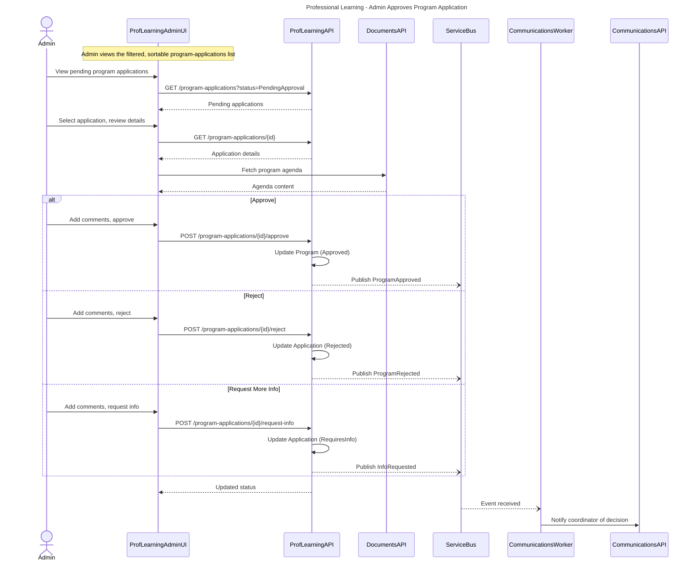
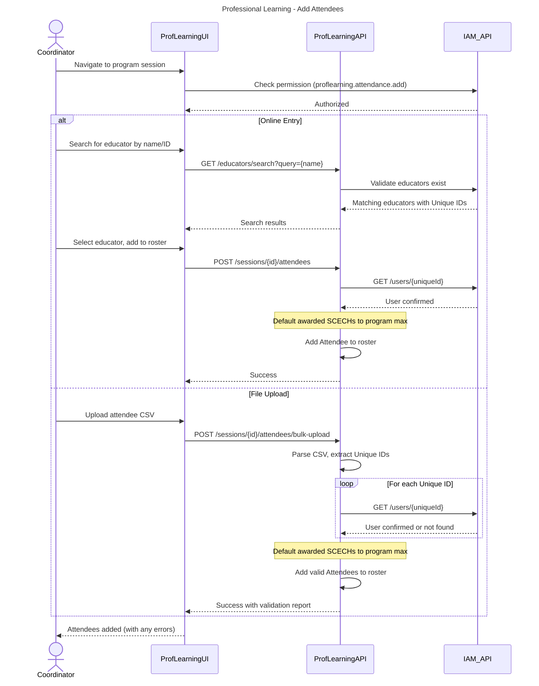
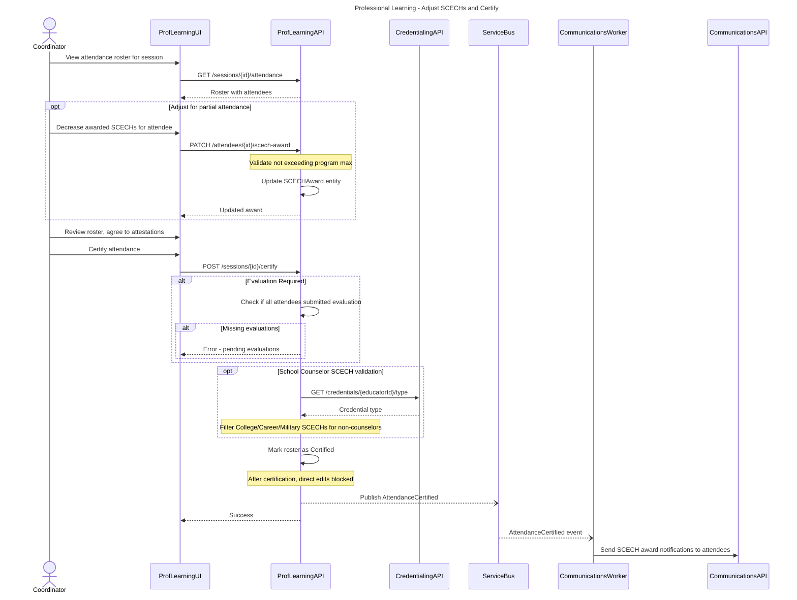
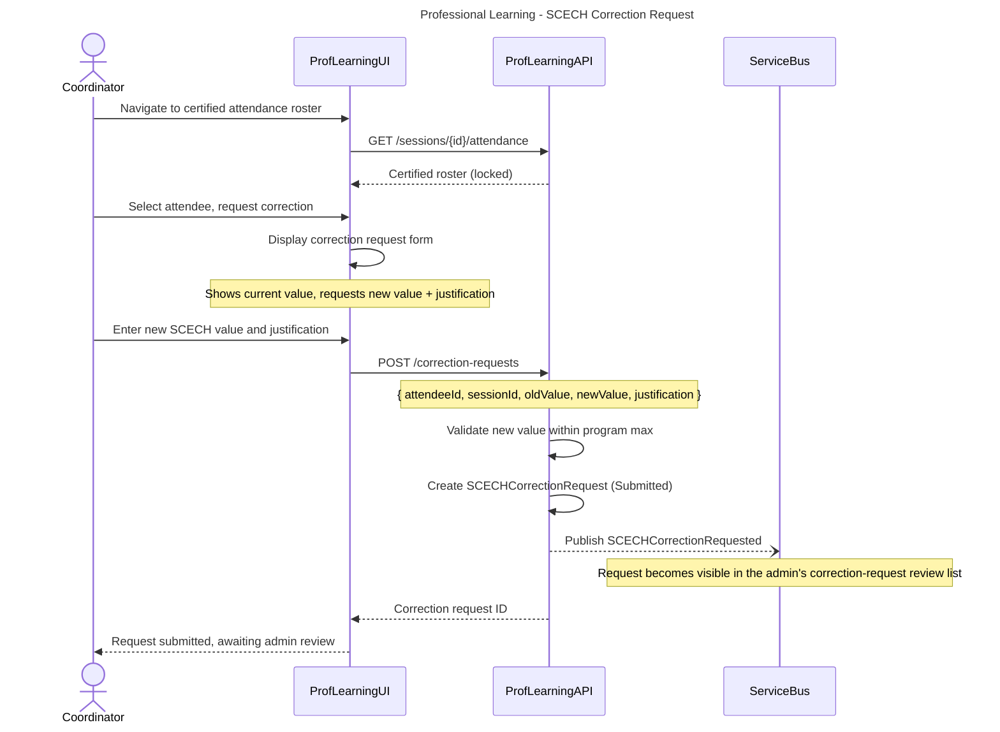
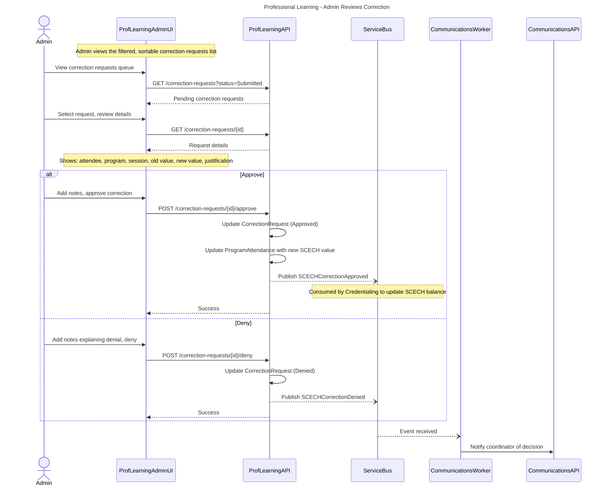
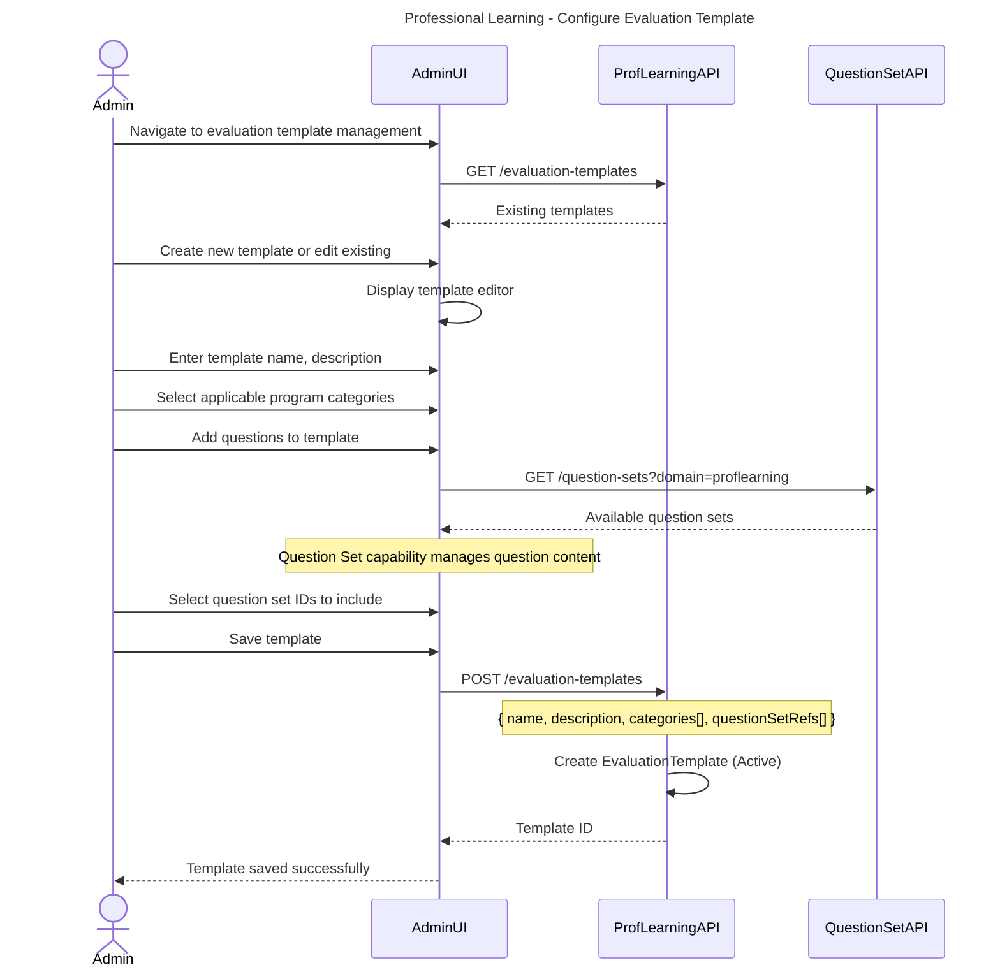
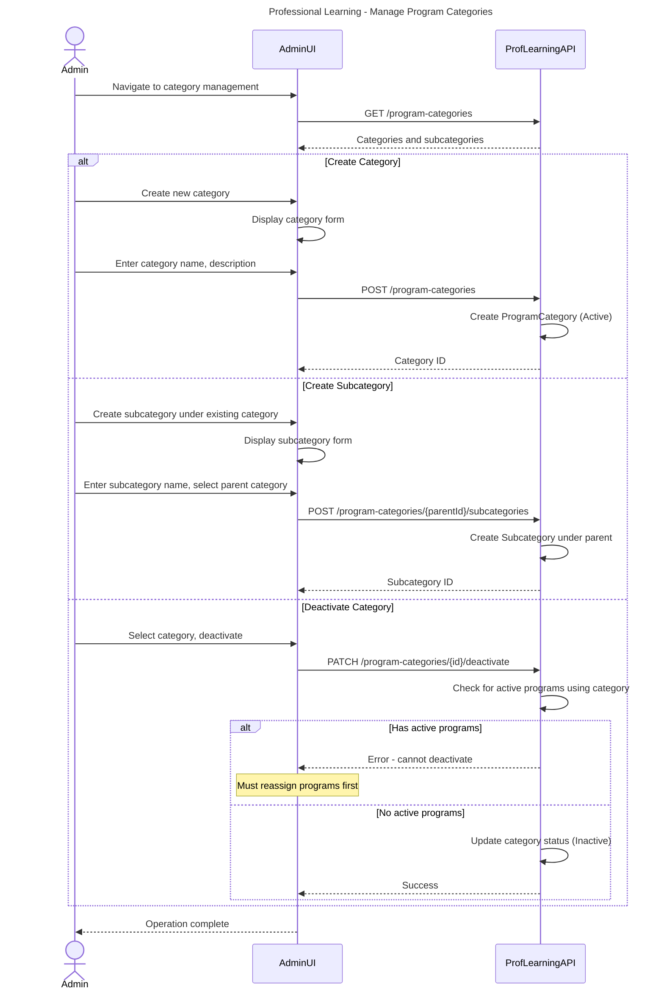
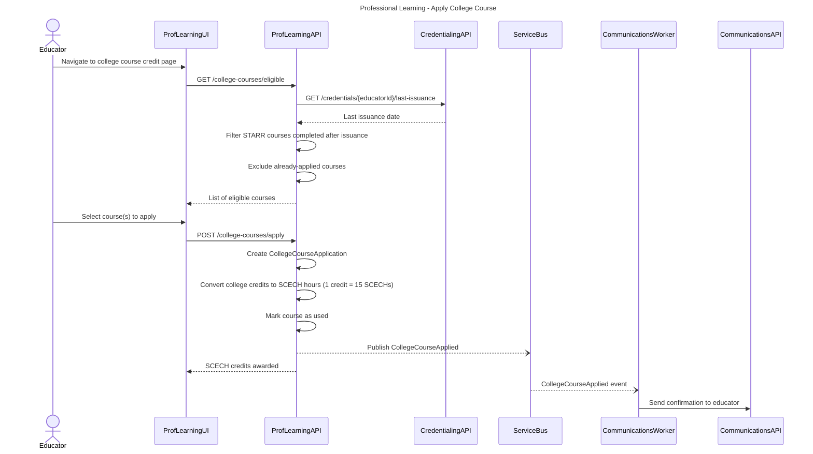
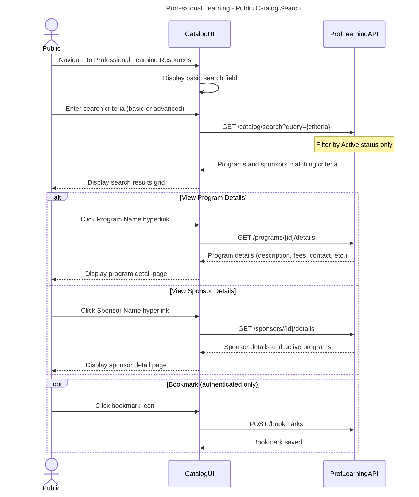

# Professional Learning - Workflows & Sequences

This document contains sequence diagrams for all workflows in the Professional Learning domain.

**Conventions:**
- Solid arrows (`->>`) = Synchronous calls
- Dashed arrows (`-->>`) = Responses
- Dotted arrows (`--)`) = Async/fire-and-forget
- **actor** = Human or external system
- **participant** = Internal service/component

---

## Program Application Submission and Approval

**What:** Sponsor submits new/modified program for approval
**When:** Sponsor wants to offer new program or modify existing
**Who:** Coordinator or Assistant Coordinator

```mermaid
---
title: Professional Learning - Program Application Submission
---
sequenceDiagram
    actor Coordinator
    participant ProfLearningUI
    participant ProfLearningAPI
    participant IAM_API
    participant DocumentsAPI
    participant ServiceBus
    
    Coordinator->>ProfLearningUI: Complete program application form
    ProfLearningUI->>IAM_API: Check permission (proflearning.program.create)
    IAM_API-->>ProfLearningUI: Authorized for sponsor
    
    Coordinator->>DocumentsAPI: Upload program agenda
    DocumentsAPI-->>Coordinator: Document reference
    
    ProfLearningUI->>ProfLearningAPI: POST /program-applications
    Note over ProfLearningAPI: Program details, agenda ref, sponsor ID
    ProfLearningAPI->>ProfLearningAPI: Create ProgramApplication (PendingApproval)
    ProfLearningAPI--)ServiceBus: Publish ProgramApplicationSubmitted
    Note over ServiceBus: Notifies communications; application is now visible in the admin's pending-review list
    ProfLearningAPI-->>ProfLearningUI: Application ID
    ProfLearningUI-->>Coordinator: Confirmation message
```



**Key Decisions:**
- Document reference stored in ProfLearning, blob in Documents domain
- Admin's pending-review list is the same `GET /program-applications` endpoint, filtered by status
- Admin UI accesses ProfLearning API endpoints directly for approve/reject/request-info

**State Changes:**
- ProgramApplication: Draft -> PendingApproval -> Approved/Rejected/RequiresInfo
- Program: null -> Approved -> Active (if approved)

**Events Published:**
- `ProgramApplicationSubmitted` - Application becomes visible in the admin's pending-review list
- `ProgramApproved` - Triggers coordinator notification
- `ProgramRejected` - Triggers coordinator notification
- `InfoRequested` - Coordinator notified to provide additional details

**Error Scenarios:**
- Coordinator lacks permission for sponsor -> HTTP 403
- Required agenda document missing -> Validation error
- Missing required comments on reject/request-info -> Validation error

---

## Add Attendees to Program

**What:** Coordinator enrolls educators in program session
**When:** Before or during program delivery
**Who:** Coordinator



**Key Decisions:**
- Global educator search (not scoped to coordinator's organization) per BRD 26.5.1
- Default awarded SCECHs to program maximum, per BR
- Unique ID validation via IAM API before adding to roster

**State Changes:**
- AttendanceRoster: Draft (or existing) with new Attendee entities

**Events Published:**
- None (attendance not certified yet)

**Error Scenarios:**
- Unique ID not found in IAM -> Display error, cannot add attendee
- Duplicate attendee -> Prevent addition with error message
- Bulk upload with invalid IDs -> Return validation report showing which IDs failed

---

## Adjust SCECH Awards and Certify Attendance

**What:** Coordinator adjusts awarded hours for partial attendance, then certifies roster
**When:** After program completion
**Who:** Coordinator



**Key Decisions:**
- Certification blocked if evaluations required but not submitted
- SCECH awards immutable after certification (changes require SCECHCorrectionRequest)
- School Counselor credential type validated before awarding specialized SCECH types

**State Changes:**
- AttendanceRoster: Draft -> Certified
- SCECHAward: Draft -> Finalized (immutable)

**Events Published:**
- `AttendanceCertified` - Triggers attendee notifications, updates Credentialing domain

**Error Scenarios:**
- Missing required evaluations -> Block certification
- Awarded SCECHs exceed program max -> Validation error

---

## Sponsor Requests SCECH Correction

**What:** Coordinator submits request to adjust SCECH awards after attendance has been certified
**When:** Error discovered post-certification (e.g., incorrect attendance, data entry mistake)
**Who:** Coordinator



**Key Decisions:**
- Correction requests required for any changes to certified attendance
- Justification is mandatory
- New SCECH value must not exceed program maximum

**State Changes:**
- SCECHCorrectionRequest: null -> Submitted

**Events Published:**
- `SCECHCorrectionRequested` - Request becomes visible in the admin's correction-request review list

**Error Scenarios:**
- New value exceeds program max -> Validation error
- Missing justification -> Validation error
- Duplicate pending request for same attendee -> Reject with error

---

## Admin Reviews Correction Request

**What:** Professional Learning Admin approves or denies SCECH correction request
**When:** Correction request appears in the admin's correction-request review list
**Who:** Professional Learning Admin



**Key Decisions:**
- Admin can approve or deny, not modify the requested value
- Admin notes are required for denials
- Approval triggers update to both ProgramAttendance and Credentialing domain

**State Changes:**
- SCECHCorrectionRequest: Submitted -> Approved/Denied
- ProgramAttendance.SCECHAward: oldValue -> newValue (if approved)

**Events Published:**
- `SCECHCorrectionApproved` - Updates Credentialing domain, notifies coordinator
- `SCECHCorrectionDenied` - Notifies coordinator

**Error Scenarios:**
- Missing admin notes on denial -> Validation error

---

## Admin Configures Evaluation Questions

**What:** Admin creates or edits evaluation templates used for program feedback
**When:** New evaluation needed or existing template requires updates
**Who:** Professional Learning Admin



**Key Decisions:**
- Evaluation templates reference Question Set IDs, not inline question content
- Question Set capability manages actual question versioning and structure
- Templates can be assigned to program categories (applies to all programs in category) or individual programs

**State Changes:**
- EvaluationTemplate: null -> Active

**Events Published:**
- None (configuration change, not a business event)

**Error Scenarios:**
- Invalid question set reference -> Validation error
- Duplicate template name -> Validation error

---

## Admin Manages Program Categories

**What:** Admin creates, edits, or deactivates program categories and subcategories
**When:** New classification needed or existing categories require updates
**Who:** Professional Learning Admin



**Key Decisions:**
- Categories cannot be deleted, only deactivated
- Deactivation blocked if active programs depend on the category
- Subcategories must belong to exactly one parent category

**State Changes:**
- ProgramCategory: null -> Active (create)
- ProgramCategory: Active -> Inactive (deactivate)

**Events Published:**
- None (configuration change, not a business event)

**Error Scenarios:**
- Duplicate category name -> Validation error
- Deactivate category with active programs -> Blocked with error
- Subcategory without parent -> Validation error

---

## Educator Applies College Course for SCECH Credit

**What:** Educator selects completed college courses to count toward SCECH requirements
**When:** Educator views available courses from STARR data
**Who:** Educator (Citizen User)



**Key Decisions:**
- Course eligibility determined by last credential issuance date from Credentialing domain
- STARR data synced via Synapse Pipeline (external dependency)
- Conversion rate: 1 semester credit = 15 SCECH hours

**State Changes:**
- CollegeCourseApplication: null -> Applied -> Credited
- STARRCourseRecord: Eligible -> Used

**Events Published:**
- `CollegeCourseApplied` - Updates Credentialing domain, triggers confirmation email

**Error Scenarios:**
- Course completed before last credential issuance -> Not displayed in eligible list
- Course already applied -> Not displayed in eligible list

---

## Public Catalog Search

**What:** Public searches for professional learning programs or sponsors
**When:** Anyone wants to discover learning opportunities
**Who:** Public (unauthenticated) or Educator (authenticated for bookmarking)



**Key Decisions:**
- No authentication required for search, authentication required for bookmarking
- Only Active programs/sponsors returned in search results

**State Changes:**
- None (read-only operation)

**Events Published:**
- None

**Error Scenarios:**
- No results found -> Display "No results found" message
- Special characters in search -> Ignored per BR
- 