# Professional Practice Review - Workflows & Sequences

This document contains sequence diagrams for all workflows in the Professional Practice Review domain.

**Conventions:**
- Solid arrows (`->>`) = Synchronous calls
- Dashed arrows (`-->>`) = Responses
- Dotted arrows (`--)`) = Async/fire-and-forget
- **actor** = Human or external system
- **participant** = Internal service/component

---

## Submit Self-Disclosure

**What:** Educator voluntarily reports a new criminal conviction or professional disciplinary action  
**When:** Educator receives conviction or disciplinary action and must report within required timeframe  
**Who:** Authenticated educator

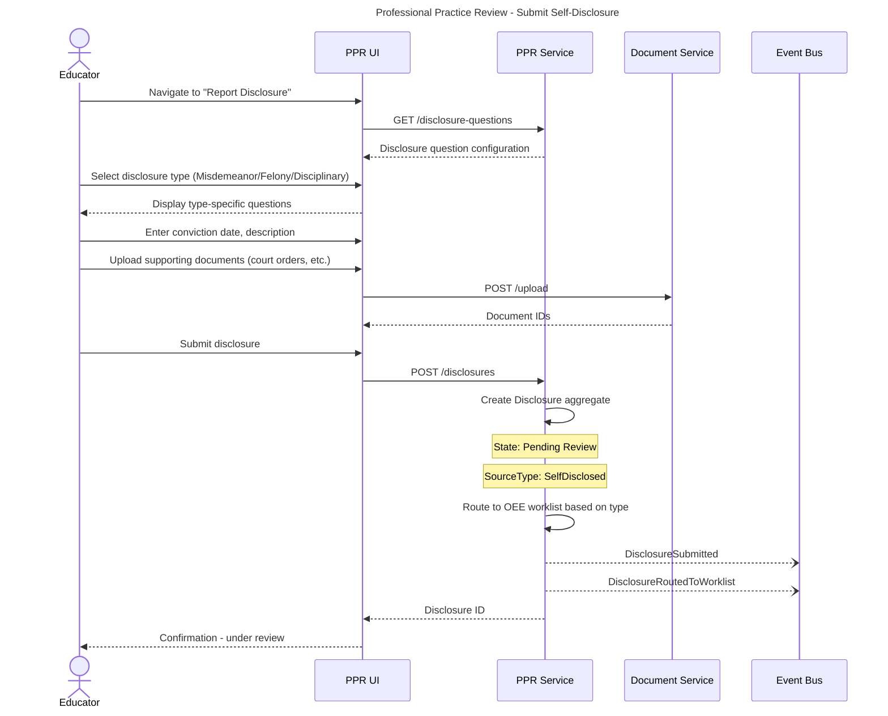
```mermaid
---
title: Professional Practice Review - Submit Self-Disclosure
---
sequenceDiagram
    actor Educator
    participant UI as PPR UI
    participant PPRService as PPR Service
    participant DocService as Document Service
    participant EventBus as Event Bus
    
    Educator->>UI: Navigate to "Report Disclosure"
    UI->>PPRService: GET /disclosure-questions
    PPRService-->>UI: Disclosure question configuration
    
    Educator->>UI: Select disclosure type (Misdemeanor/Felony/Disciplinary)
    UI-->>Educator: Display type-specific questions
    
    Educator->>UI: Enter conviction date, description
    Educator->>UI: Upload supporting documents (court orders, etc.)
    UI->>DocService: POST /upload
    DocService-->>UI: Document IDs
    
    Educator->>UI: Submit disclosure
    UI->>PPRService: POST /disclosures
    
    PPRService->>PPRService: Create Disclosure aggregate
    Note over PPRService: State: Pending Review
    Note over PPRService: SourceType: SelfDisclosed
    
    PPRService->>PPRService: Route to OEE worklist based on type
    
    PPRService--)EventBus: DisclosureSubmitted
    PPRService--)EventBus: DisclosureRoutedToWorklist
    
    PPRService-->>UI: Disclosure ID
    UI-->>Educator: Confirmation - under review
```

**Key Decisions:**
- **Document Requirements:** At least one supporting document required for self-disclosures
- **Automatic Routing:** System routes to OEE worklist based on disclosure type
- **Conviction Date:** Cannot be future-dated

**State Changes:**
- Disclosure: `None` > `Pending Review`

**Events Published:**
- `DisclosureSubmitted` - Triggers communications to educator and PPR staff
- `DisclosureRoutedToWorklist` - Recorded for audit; routing/queue placement itself is handled synchronously by the PPRWorklist aggregate, not a downstream capability

**Error Scenarios:**
- No documents attached > Block submission, require at least one document
- Conviction date in future > Validation error
- Description exceeds 5000 characters > Validation error

---

## Submit Professional Practice Review Response

**What:** Educator completes annual PPR compliance check, potentially reporting new disclosures  
**When:** Annual PPR due date approaching or past due  
**Who:** Authenticated educator

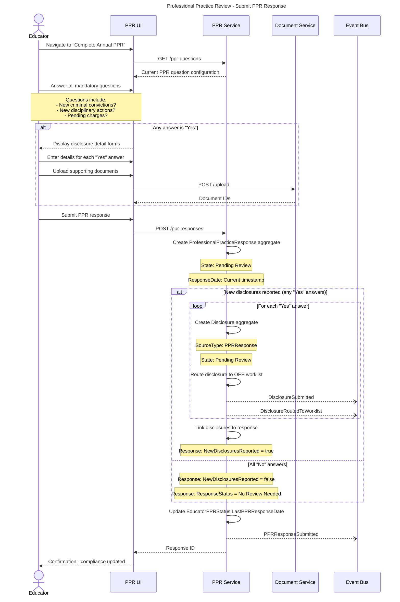
```mermaid
---
title: Professional Practice Review - Submit PPR Response
---
sequenceDiagram
    actor Educator
    participant UI as PPR UI
    participant PPRService as PPR Service
    participant DocService as Document Service
    participant EventBus as Event Bus
    
    Educator->>UI: Navigate to "Complete Annual PPR"
    UI->>PPRService: GET /ppr-questions
    PPRService-->>UI: Current PPR question configuration
    
    Educator->>UI: Answer all mandatory questions
    Note over Educator,UI: Questions include:<br/>- New criminal convictions?<br/>- New disciplinary actions?<br/>- Pending charges?
    
    alt Any answer is "Yes"
        UI-->>Educator: Display disclosure detail forms
        
        Educator->>UI: Enter details for each "Yes" answer
        Educator->>UI: Upload supporting documents
        UI->>DocService: POST /upload
        DocService-->>UI: Document IDs
    end
    
    Educator->>UI: Submit PPR response
    UI->>PPRService: POST /ppr-responses
    
    PPRService->>PPRService: Create ProfessionalPracticeResponse aggregate
    Note over PPRService: State: Pending Review
    Note over PPRService: ResponseDate: Current timestamp
    
    alt New disclosures reported (any "Yes" answers)
        loop For each "Yes" answer
            PPRService->>PPRService: Create Disclosure aggregate
            Note over PPRService: SourceType: PPRResponse
            Note over PPRService: State: Pending Review
            
            PPRService->>PPRService: Route disclosure to OEE worklist
            PPRService--)EventBus: DisclosureSubmitted
            PPRService--)EventBus: DisclosureRoutedToWorklist
        end
        
        PPRService->>PPRService: Link disclosures to response
        Note over PPRService: Response: NewDisclosuresReported = true
    else All "No" answers
        Note over PPRService: Response: NewDisclosuresReported = false
        Note over PPRService: Response: ResponseStatus = No Review Needed
    end
    
    PPRService->>PPRService: Update EducatorPPRStatus.LastPPRResponseDate
    
    PPRService--)EventBus: PPRResponseSubmitted
    
    PPRService-->>UI: Response ID
    UI-->>Educator: Confirmation - compliance updated
```

**Key Decisions:**
- **Disclosure Creation:** System automatically creates Disclosure records for each "Yes" answer
- **Compliance Tracking:** LastPPRResponseDate updated regardless of whether new disclosures reported
- **Routing:** New disclosures route to OEE worklist same as self-disclosures

**State Changes:**
- ProfessionalPracticeResponse: `None` > `Pending Review` or `No Review Needed`
- Disclosure: `None` > `Pending Review` (for each "Yes" answer)
- EducatorPPRStatus: LastPPRResponseDate updated

**Events Published:**
- `PPRResponseSubmitted` - Records compliance activity
- `DisclosureSubmitted` - One per new disclosure
- `DisclosureRoutedToWorklist` - One per new disclosure

**Error Scenarios:**
- Not all mandatory questions answered > Block submission
- "Yes" answer without supporting details > Validation error

---

## Review Disclosure and Update Status

**What:** PPR staff reviews disclosure details and updates status through workflow  
**When:** Disclosure appears in reviewer's worklist  
**Who:** User with `profpractice.disclosure.update-status` permission assigned to worklist

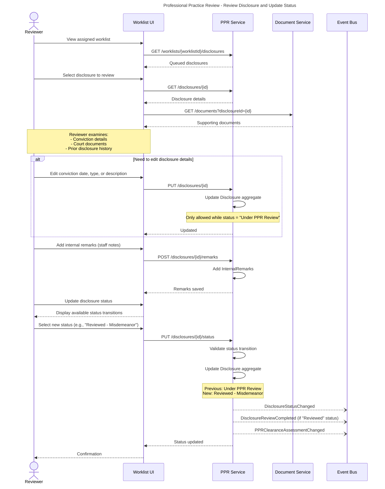
```mermaid
---
title: Professional Practice Review - Review Disclosure and Update Status
---
sequenceDiagram
    actor Reviewer
    participant WorklistUI as Worklist UI
    participant PPRService as PPR Service
    participant DocService as Document Service
    participant EventBus as Event Bus
    
    Reviewer->>WorklistUI: View assigned worklist
    WorklistUI->>PPRService: GET /worklists/{worklistId}/disclosures
    PPRService-->>WorklistUI: Queued disclosures
    
    Reviewer->>WorklistUI: Select disclosure to review
    WorklistUI->>PPRService: GET /disclosures/{id}
    PPRService-->>WorklistUI: Disclosure details
    
    WorklistUI->>DocService: GET /documents?disclosureId={id}
    DocService-->>WorklistUI: Supporting documents
    
    Note over Reviewer,WorklistUI: Reviewer examines:<br/>- Conviction details<br/>- Court documents<br/>- Prior disclosure history
    
    alt Need to edit disclosure details
        Reviewer->>WorklistUI: Edit conviction date, type, or description
        WorklistUI->>PPRService: PUT /disclosures/{id}
        PPRService->>PPRService: Update Disclosure aggregate
        Note over PPRService: Only allowed while status = "Under PPR Review"
        PPRService-->>WorklistUI: Updated
    end
    
    Reviewer->>WorklistUI: Add internal remarks (staff notes)
    WorklistUI->>PPRService: POST /disclosures/{id}/remarks
    PPRService->>PPRService: Add InternalRemarks
    PPRService-->>WorklistUI: Remarks saved
    
    Reviewer->>WorklistUI: Update disclosure status
    WorklistUI-->>Reviewer: Display available status transitions
    
    Reviewer->>WorklistUI: Select new status (e.g., "Reviewed - Misdemeanor")
    WorklistUI->>PPRService: PUT /disclosures/{id}/status
    
    PPRService->>PPRService: Validate status transition
    PPRService->>PPRService: Update Disclosure aggregate
    Note over PPRService: Previous: Under PPR Review<br/>New: Reviewed - Misdemeanor
    
    PPRService--)EventBus: DisclosureStatusChanged
    PPRService--)EventBus: DisclosureReviewCompleted (if "Reviewed" status)
    PPRService--)EventBus: PPRClearanceAssessmentChanged
    
    PPRService-->>WorklistUI: Status updated
    WorklistUI-->>Reviewer: Confirmation
```

**Key Decisions:**
- **Edit Window:** Can only edit disclosure details while status = "Under PPR Review"
- **Status Transitions:** Must follow valid workflow paths (e.g., cannot go directly from "Pending Review" to "Reviewed - Felony")
- **Assessment Recalculation:** Status changes trigger clearance assessment recalculation

**State Changes:**
- Disclosure: `Under PPR Review` > `Reviewed - [Outcome]`

**Events Published:**
- `DisclosureStatusChanged` - Status transition recorded
- `DisclosureReviewCompleted` - Finalization to "Reviewed" status
- `PPRClearanceAssessmentChanged` - Triggers re-evaluation in Credentialing/Staffing domains

**Error Scenarios:**
- Invalid status transition > Validation error
- Attempt to edit finalized disclosure > Access denied (must revert first)

---

## Manage Account Markers

**What:** PPR Admin sets or clears account-level markers on educator  
**When:** Administrative decision requires heightened oversight or processing restrictions  
**Who:** User with marker-specific permissions (PPR Admin or Credentialing Admin)

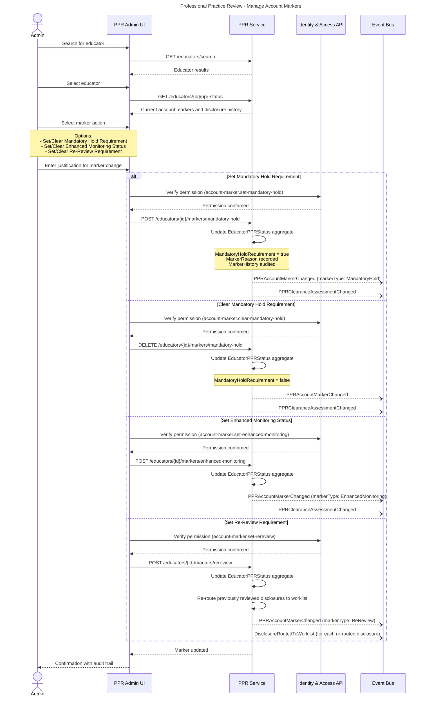
```mermaid
---
title: Professional Practice Review - Manage Account Markers
---
sequenceDiagram
    actor Admin
    participant UI as PPR Admin UI
    participant PPRService as PPR Service
    participant IAM as Identity & Access API
    participant EventBus as Event Bus
    
    Admin->>UI: Search for educator
    UI->>PPRService: GET /educators/search
    PPRService-->>UI: Educator results
    
    Admin->>UI: Select educator
    UI->>PPRService: GET /educators/{id}/ppr-status
    PPRService-->>UI: Current account markers and disclosure history
    
    Admin->>UI: Select marker action
    Note over Admin,UI: Options:<br/>- Set/Clear Mandatory Hold Requirement<br/>- Set/Clear Enhanced Monitoring Status<br/>- Set/Clear Re-Review Requirement
    
    Admin->>UI: Enter justification for marker change
    
    alt Set Mandatory Hold Requirement
        UI->>IAM: Verify permission (account-marker.set-mandatory-hold)
        IAM-->>UI: Permission confirmed
        
        UI->>PPRService: POST /educators/{id}/markers/mandatory-hold
        PPRService->>PPRService: Update EducatorPPRStatus aggregate
        Note over PPRService: MandatoryHoldRequirement = true<br/>MarkerReason recorded<br/>MarkerHistory audited
        
        PPRService--)EventBus: PPRAccountMarkerChanged (markerType: MandatoryHold)
        PPRService--)EventBus: PPRClearanceAssessmentChanged
        
    else Clear Mandatory Hold Requirement
        UI->>IAM: Verify permission (account-marker.clear-mandatory-hold)
        IAM-->>UI: Permission confirmed
        
        UI->>PPRService: DELETE /educators/{id}/markers/mandatory-hold
        PPRService->>PPRService: Update EducatorPPRStatus aggregate
        Note over PPRService: MandatoryHoldRequirement = false
        
        PPRService--)EventBus: PPRAccountMarkerChanged
        PPRService--)EventBus: PPRClearanceAssessmentChanged
        
    else Set Enhanced Monitoring Status
        UI->>IAM: Verify permission (account-marker.set-enhanced-monitoring)
        IAM-->>UI: Permission confirmed
        
        UI->>PPRService: POST /educators/{id}/markers/enhanced-monitoring
        PPRService->>PPRService: Update EducatorPPRStatus aggregate
        
        PPRService--)EventBus: PPRAccountMarkerChanged (markerType: EnhancedMonitoring)
        PPRService--)EventBus: PPRClearanceAssessmentChanged
        
    else Set Re-Review Requirement
        UI->>IAM: Verify permission (account-marker.set-rereview)
        IAM-->>UI: Permission confirmed
        
        UI->>PPRService: POST /educators/{id}/markers/rereview
        PPRService->>PPRService: Update EducatorPPRStatus aggregate
        PPRService->>PPRService: Re-route previously reviewed disclosures to worklist
        
        PPRService--)EventBus: PPRAccountMarkerChanged (markerType: ReReview)
        PPRService--)EventBus: DisclosureRoutedToWorklist (for each re-routed disclosure)
    end
    
    PPRService-->>UI: Marker updated
    UI-->>Admin: Confirmation with audit trail
```

**Key Decisions:**
- **Justification Required:** All marker changes require reason text for audit trail
- **Permission Segregation:** Different permissions for setting vs. clearing markers
- **Immediate Effect:** Marker changes immediately affect clearance assessments and worklist routing

**State Changes:**
- EducatorPPRStatus: Marker flags toggled (MandatoryHoldRequirement, EnhancedMonitoringStatus, ReReviewRequirement)
- Disclosure: May be re-routed to worklist if Re-Review Requirement activated

**Events Published:**
- `PPRAccountMarkerChanged` - Marker state change
- `PPRClearanceAssessmentChanged` - Triggers downstream re-evaluation
- `DisclosureRoutedToWorklist` - If Re-Review Requirement forces disclosures back to review

**Error Scenarios:**
- Admin lacks permission > Access denied
- Justification missing > Validation error

---

## Receive Rap Back Notification

**What:** External Rap Back system sends notification of new criminal activity via webhook  
**When:** Michigan State Police detects new arrest or prosecution for enrolled educator  
**Who:** External system (MSP Rap Back)

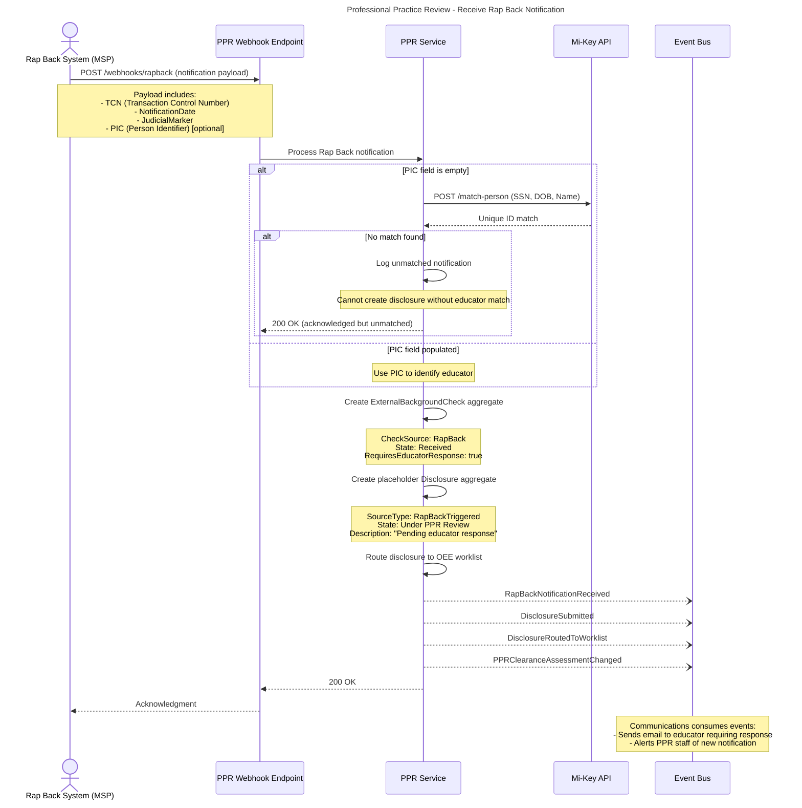
```mermaid
---
title: Professional Practice Review - Receive Rap Back Notification
---
sequenceDiagram
    actor RapBack as Rap Back System (MSP)
    participant Webhook as PPR Webhook Endpoint
    participant PPRService as PPR Service
    participant MiKey as Mi-Key API
    participant EventBus as Event Bus
    
    RapBack->>Webhook: POST /webhooks/rapback (notification payload)
    Note over RapBack,Webhook: Payload includes:<br/>- TCN (Transaction Control Number)<br/>- NotificationDate<br/>- JudicialMarker<br/>- PIC (Person Identifier) [optional]
    
    Webhook->>PPRService: Process Rap Back notification
    
    alt PIC field is empty
        PPRService->>MiKey: POST /match-person (SSN, DOB, Name)
        MiKey-->>PPRService: Unique ID match
        
        alt No match found
            PPRService->>PPRService: Log unmatched notification
            Note over PPRService: Cannot create disclosure without educator match
            PPRService-->>Webhook: 200 OK (acknowledged but unmatched)
        end
    else PIC field populated
        Note over PPRService: Use PIC to identify educator
    end
    
    PPRService->>PPRService: Create ExternalBackgroundCheck aggregate
    Note over PPRService: CheckSource: RapBack<br/>State: Received<br/>RequiresEducatorResponse: true
    
    PPRService->>PPRService: Create placeholder Disclosure aggregate
    Note over PPRService: SourceType: RapBackTriggered<br/>State: Under PPR Review<br/>Description: "Pending educator response"
    
    PPRService->>PPRService: Route disclosure to OEE worklist
    
    PPRService--)EventBus: RapBackNotificationReceived
    PPRService--)EventBus: DisclosureSubmitted
    PPRService--)EventBus: DisclosureRoutedToWorklist
    PPRService--)EventBus: PPRClearanceAssessmentChanged
    
    PPRService-->>Webhook: 200 OK
    Webhook-->>RapBack: Acknowledgment
    
    Note over EventBus: Communications consumes events:<br/>- Sends email to educator requiring response<br/>- Alerts PPR staff of new notification
```

**Key Decisions:**
- **Person Matching:** If PIC empty, use Mi-Key to match SSN+DOB+Name to Unique ID
- **Placeholder Disclosure:** System creates disclosure requiring educator to provide details
- **Automatic Routing:** Routes to OEE worklist for initial review

**State Changes:**
- ExternalBackgroundCheck: `None` > `Received`
- Disclosure: `None` > `Under PPR Review` (placeholder)

**Events Published:**
- `RapBackNotificationReceived` - External data received
- `DisclosureSubmitted` - Placeholder disclosure created
- `DisclosureRoutedToWorklist` - Routed to OEE for review
- `PPRClearanceAssessmentChanged` - Active disclosure affects clearance

**Error Scenarios:**
- Person match fails > Log unmatched notification, return 200 OK (acknowledge receipt)
- Duplicate notification (same TCN) > Update existing record, do not create duplicate

---

## Retrieve Full Rap Sheet for Review

**What:** PPR reviewer initiates on-demand retrieval of complete rap sheet from CHRISS  
**When:** Reviewer needs detailed criminal history beyond notification metadata  
**Who:** User with `profpractice.rapback.retrieve-rapsheet` permission

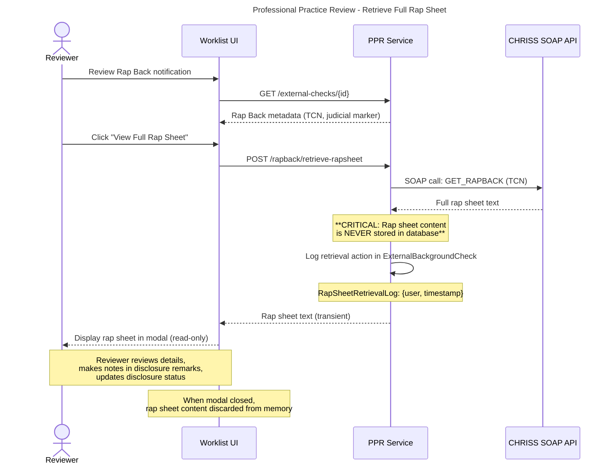
```mermaid
---
title: Professional Practice Review - Retrieve Full Rap Sheet
---
sequenceDiagram
    actor Reviewer
    participant WorklistUI as Worklist UI
    participant PPRService as PPR Service
    participant CHRISS as CHRISS SOAP API
    
    Reviewer->>WorklistUI: Review Rap Back notification
    WorklistUI->>PPRService: GET /external-checks/{id}
    PPRService-->>WorklistUI: Rap Back metadata (TCN, judicial marker)
    
    Reviewer->>WorklistUI: Click "View Full Rap Sheet"
    WorklistUI->>PPRService: POST /rapback/retrieve-rapsheet
    
    PPRService->>CHRISS: SOAP call: GET_RAPBACK (TCN)
    CHRISS-->>PPRService: Full rap sheet text
    
    Note over PPRService: **CRITICAL: Rap sheet content<br/>is NEVER stored in database**
    
    PPRService->>PPRService: Log retrieval action in ExternalBackgroundCheck
    Note over PPRService: RapSheetRetrievalLog: {user, timestamp}
    
    PPRService-->>WorklistUI: Rap sheet text (transient)
    WorklistUI-->>Reviewer: Display rap sheet in modal (read-only)
    
    Note over Reviewer,WorklistUI: Reviewer reviews details,<br/>makes notes in disclosure remarks,<br/>updates disclosure status
    
    Note over WorklistUI: When modal closed,<br/>rap sheet content discarded from memory
```

**Key Decisions:**
- **Display-Only:** Rap sheet is NEVER persisted; only displayed transiently
- **Audit Logging:** System logs fact that retrieval occurred (who, when) but not content
- **On-Demand:** Retrieval only happens when reviewer explicitly requests it

**State Changes:**
- ExternalBackgroundCheck: RapSheetRetrievalLog updated (audit only)

**Events Published:**
- None (audit log entry only)

**Error Scenarios:**
- CHRISS API unavailable > Display error, allow retry
- Invalid TCN > Display error message from CHRISS
- Network timeout > Display error, suggest contacting support

---

## Process NASDTEC Nightly Batch

**What:** Scheduled job pulls data from NASDTEC API and matches to Michigan educators  
**When:** Nightly at configured time (e.g., 2:00 AM)  
**Who:** System (scheduled job)

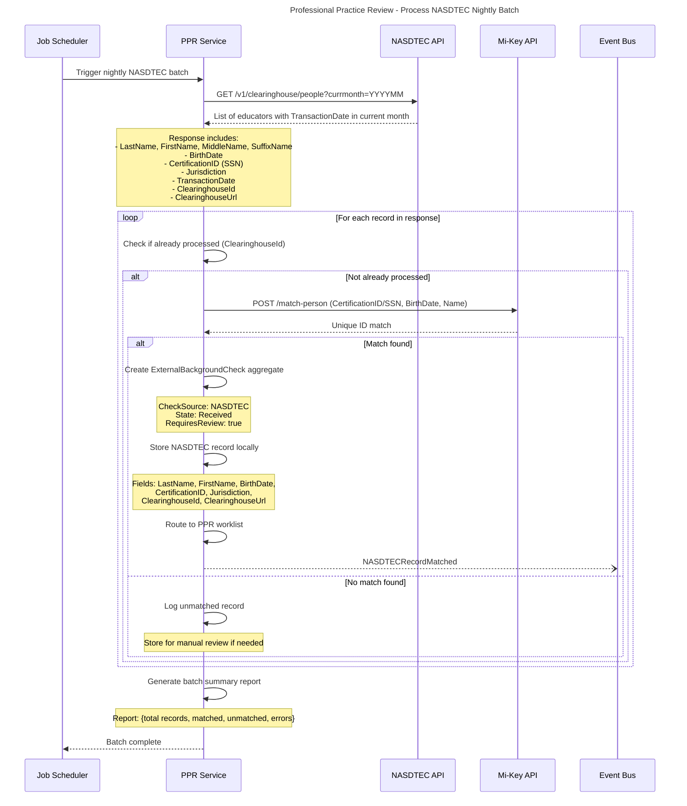
```mermaid
---
title: Professional Practice Review - Process NASDTEC Nightly Batch
---
sequenceDiagram
    participant Scheduler as Job Scheduler
    participant PPRService as PPR Service
    participant NASDTEC as NASDTEC API
    participant MiKey as Mi-Key API
    participant EventBus as Event Bus
    
    Scheduler->>PPRService: Trigger nightly NASDTEC batch
    
    PPRService->>NASDTEC: GET /v1/clearinghouse/people?currmonth=YYYYMM
    NASDTEC-->>PPRService: List of educators with TransactionDate in current month
    
    Note over PPRService: Response includes:<br/>- LastName, FirstName, MiddleName, SuffixName<br/>- BirthDate<br/>- CertificationID (SSN)<br/>- Jurisdiction<br/>- TransactionDate<br/>- ClearinghouseId<br/>- ClearinghouseUrl
    
    loop For each record in response
        PPRService->>PPRService: Check if already processed (ClearinghouseId)
        
        alt Not already processed
            PPRService->>MiKey: POST /match-person (CertificationID/SSN, BirthDate, Name)
            MiKey-->>PPRService: Unique ID match
            
            alt Match found
                PPRService->>PPRService: Create ExternalBackgroundCheck aggregate
                Note over PPRService: CheckSource: NASDTEC<br/>State: Received<br/>RequiresReview: true
                
                PPRService->>PPRService: Store NASDTEC record locally
                Note over PPRService: Fields: LastName, FirstName, BirthDate,<br/>CertificationID, Jurisdiction,<br/>ClearinghouseId, ClearinghouseUrl
                
                PPRService->>PPRService: Route to PPR worklist
                
                PPRService--)EventBus: NASDTECRecordMatched
                
            else No match found
                PPRService->>PPRService: Log unmatched record
                Note over PPRService: Store for manual review if needed
            end
        end
    end
    
    PPRService->>PPRService: Generate batch summary report
    Note over PPRService: Report: {total records, matched, unmatched, errors}
    
    PPRService-->>Scheduler: Batch complete
```

**Key Decisions:**
- **Incremental Pull:** Pull `currmonth` nightly to get recent transactions
- **Local Storage:** NASDTEC records stored locally for search/reference
- **Person Matching:** Use CertificationID (SSN) + BirthDate + Name to match via Mi-Key
- **Duplicate Prevention:** Check ClearinghouseId to avoid re-processing same record

**State Changes:**
- ExternalBackgroundCheck: `None` > `Received` (for matched records)

**Events Published:**
- `NASDTECRecordMatched` - One per successful match

**Error Scenarios:**
- NASDTEC API unavailable > Retry with exponential backoff, alert admin if persistent failure
- Mi-Key API unavailable > Skip person matching, log for manual follow-up
- Malformed API response > Log error, skip record

---

## Evaluate PPR Clearance for Credential Application

**What:** Credentialing domain requests PPR clearance assessment for application  
**When:** Educator submits credential application or application status changes  
**Who:** Credentialing domain (API consumer)

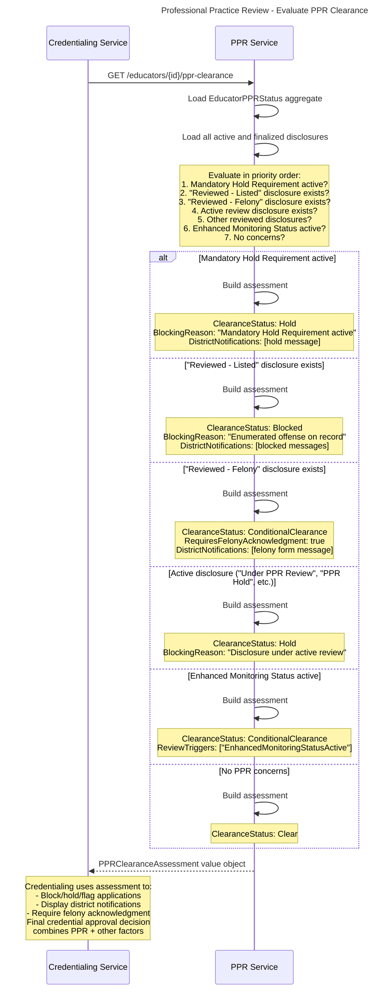
```mermaid
---
title: Professional Practice Review - Evaluate PPR Clearance
---
sequenceDiagram
    participant Credentialing as Credentialing Service
    participant PPRService as PPR Service
    
    Credentialing->>PPRService: GET /educators/{id}/ppr-clearance
    
    PPRService->>PPRService: Load EducatorPPRStatus aggregate
    PPRService->>PPRService: Load all active and finalized disclosures
    
    Note over PPRService: Evaluate in priority order:<br/>1. Mandatory Hold Requirement active?<br/>2. "Reviewed - Listed" disclosure exists?<br/>3. "Reviewed - Felony" disclosure exists?<br/>4. Active review disclosure exists?<br/>5. Other reviewed disclosures?<br/>6. Enhanced Monitoring Status active?<br/>7. No concerns?
    
    alt Mandatory Hold Requirement active
        PPRService->>PPRService: Build assessment
        Note over PPRService: ClearanceStatus: Hold<br/>BlockingReason: "Mandatory Hold Requirement active"<br/>DistrictNotifications: [hold message]
        
    else "Reviewed - Listed" disclosure exists
        PPRService->>PPRService: Build assessment
        Note over PPRService: ClearanceStatus: Blocked<br/>BlockingReason: "Enumerated offense on record"<br/>DistrictNotifications: [blocked messages]
        
    else "Reviewed - Felony" disclosure exists
        PPRService->>PPRService: Build assessment
        Note over PPRService: ClearanceStatus: ConditionalClearance<br/>RequiresFelonyAcknowledgment: true<br/>DistrictNotifications: [felony form message]
        
    else Active disclosure ("Under PPR Review", "PPR Hold", etc.)
        PPRService->>PPRService: Build assessment
        Note over PPRService: ClearanceStatus: Hold<br/>BlockingReason: "Disclosure under active review"
        
    else Enhanced Monitoring Status active
        PPRService->>PPRService: Build assessment
        Note over PPRService: ClearanceStatus: ConditionalClearance<br/>ReviewTriggers: ["EnhancedMonitoringStatusActive"]
        
    else No PPR concerns
        PPRService->>PPRService: Build assessment
        Note over PPRService: ClearanceStatus: Clear
    end
    
    PPRService-->>Credentialing: PPRClearanceAssessment value object
    
    Note over Credentialing: Credentialing uses assessment to:<br/>- Block/hold/flag applications<br/>- Display district notifications<br/>- Require felony acknowledgment<br/>Final credential approval decision<br/>combines PPR + other factors
```

**Key Decisions:**
- **Calculated On-Demand:** Assessment is never cached; computed fresh on each request
- **Priority Order:** Most restrictive condition takes precedence
- **Not Final Decision:** PPR provides assessment; Credentialing makes approval/denial decision

**State Changes:**
- None (read-only query)

**Events Published:**
- None (synchronous query)

**Error Scenarios:**
- Educator not found > Return 404
- Database unavailable > Return 503, Credentialing should retry

---

## Evaluate Roster Eligibility for Employment

**What:** Staffing domain requests PPR eligibility assessment before roster addition  
**When:** District HR attempts to add educator to employment roster  
**Who:** Staffing domain (API consumer)

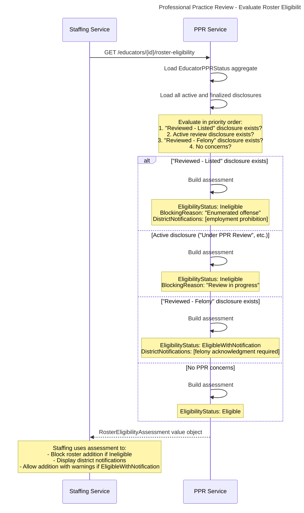
```mermaid
---
title: Professional Practice Review - Evaluate Roster Eligibility
---
sequenceDiagram
    participant Staffing as Staffing Service
    participant PPRService as PPR Service
    
    Staffing->>PPRService: GET /educators/{id}/roster-eligibility
    
    PPRService->>PPRService: Load EducatorPPRStatus aggregate
    PPRService->>PPRService: Load all active and finalized disclosures
    
    Note over PPRService: Evaluate in priority order:<br/>1. "Reviewed - Listed" disclosure exists?<br/>2. Active review disclosure exists?<br/>3. "Reviewed - Felony" disclosure exists?<br/>4. No concerns?
    
    alt "Reviewed - Listed" disclosure exists
        PPRService->>PPRService: Build assessment
        Note over PPRService: EligibilityStatus: Ineligible<br/>BlockingReason: "Enumerated offense"<br/>DistrictNotifications: [employment prohibition]
        
    else Active disclosure ("Under PPR Review", etc.)
        PPRService->>PPRService: Build assessment
        Note over PPRService: EligibilityStatus: Ineligible<br/>BlockingReason: "Review in progress"
        
    else "Reviewed - Felony" disclosure exists
        PPRService->>PPRService: Build assessment
        Note over PPRService: EligibilityStatus: EligibleWithNotification<br/>DistrictNotifications: [felony acknowledgment required]
        
    else No PPR concerns
        PPRService->>PPRService: Build assessment
        Note over PPRService: EligibilityStatus: Eligible
    end
    
    PPRService-->>Staffing: RosterEligibilityAssessment value object
    
    Note over Staffing: Staffing uses assessment to:<br/>- Block roster addition if Ineligible<br/>- Display district notifications<br/>- Allow addition with warnings if EligibleWithNotification
```

**Key Decisions:**
- **Stricter Than Credentialing:** Employment eligibility has absolute blocks (Listed offenses, active reviews)
- **Calculated On-Demand:** Never cached
- **District Notification:** EligibleWithNotification requires district acknowledgment but allows employment

**State Changes:**
- None (read-only query)

**Events Published:**
- None (synchronous query)

**Error Scenarios:**
- Educator not found > Return 404
- Database unavailable > Return 503

---

## Log Non-System Action

**What:** PPR reviewer documents external activities (phone calls, emails, manual document reviews)  
**When:** Reviewer takes action outside the system that should be audited  
**Who:** User with `profpractice.disclosure.log-non-system-action` permission

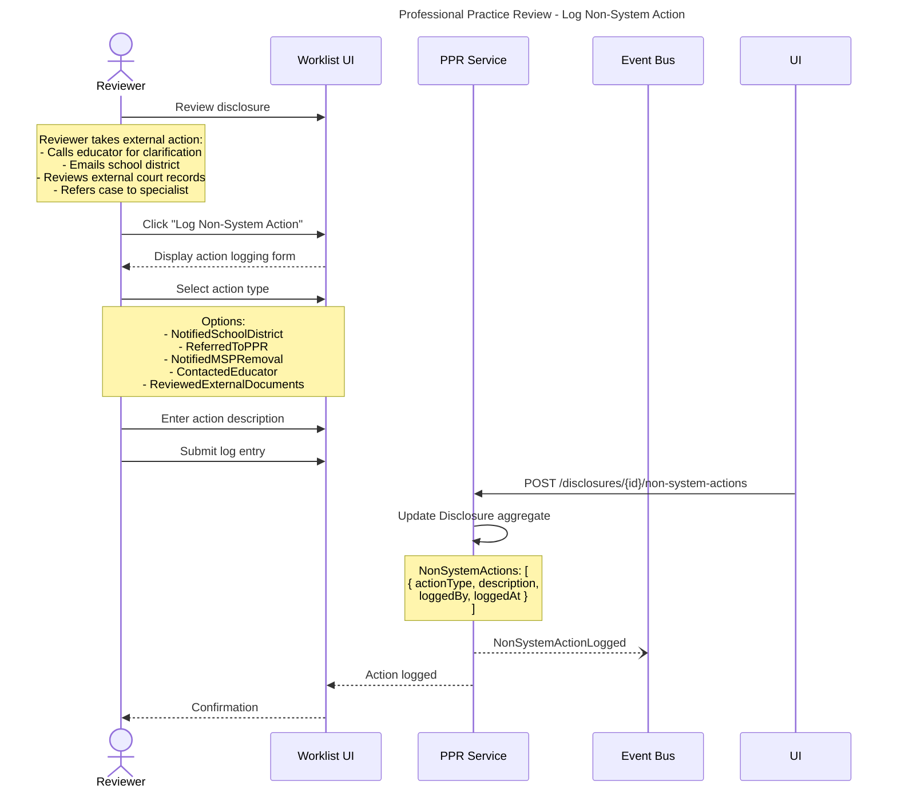
```mermaid
---
title: Professional Practice Review - Log Non-System Action
---
sequenceDiagram
    actor Reviewer
    participant WorklistUI as Worklist UI
    participant PPRService as PPR Service
    participant EventBus as Event Bus
    
    Reviewer->>WorklistUI: Review disclosure
    Note over Reviewer: Reviewer takes external action:<br/>- Calls educator for clarification<br/>- Emails school district<br/>- Reviews external court records<br/>- Refers case to specialist
    
    Reviewer->>WorklistUI: Click "Log Non-System Action"
    WorklistUI-->>Reviewer: Display action logging form
    
    Reviewer->>WorklistUI: Select action type
    Note over Reviewer,WorklistUI: Options:<br/>- NotifiedSchoolDistrict<br/>- ReferredToPPR<br/>- NotifiedMSPRemoval<br/>- ContactedEducator<br/>- ReviewedExternalDocuments
    
    Reviewer->>WorklistUI: Enter action description
    Reviewer->>WorklistUI: Submit log entry
    
    UI->>PPRService: POST /disclosures/{id}/non-system-actions
    
    PPRService->>PPRService: Update Disclosure aggregate
    Note over PPRService: NonSystemActions: [<br/>  { actionType, description,<br/>    loggedBy, loggedAt }<br/>]
    
    PPRService--)EventBus: NonSystemActionLogged
    
    PPRService-->>WorklistUI: Action logged
    WorklistUI-->>Reviewer: Confirmation
```

**Key Decisions:**
- **Audit Trail:** All non-system actions recorded for compliance and appeals
- **Free-Form Description:** Allows flexible documentation of varied activities
- **No State Change:** Logging action does not change disclosure status

**State Changes:**
- Disclosure: NonSystemActions collection updated (audit only, no state change)

**Events Published:**
- `NonSystemActionLogged` - For audit purposes

**Error Scenarios:**
- Description missing > Validation error
- Action type not recognized > Validation error

---

## Configure PPR Worklist

**What:** PPR Admin creates or modifies worklist routing rules  
**When:** New processing queue needed or routing logic changes  
**Who:** User with `profpractice.worklist.configure` permission (PPR Admin)

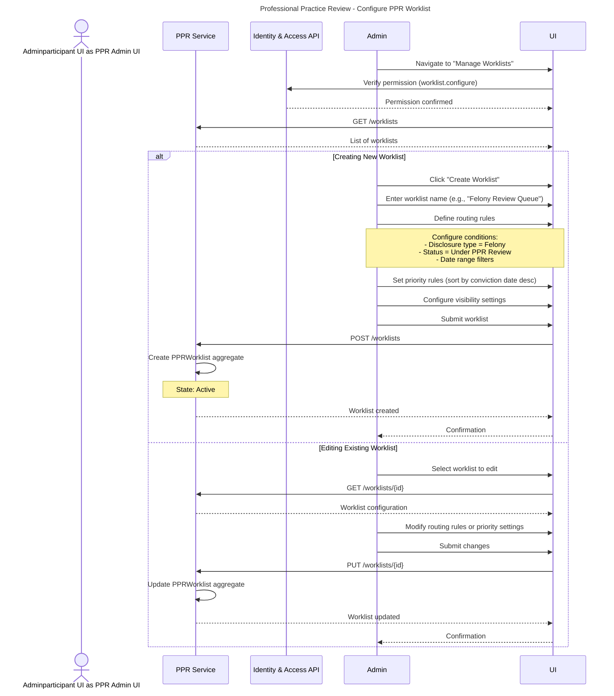
```mermaid
---
title: Professional Practice Review - Configure PPR Worklist
---
sequenceDiagram
    actor Adminparticipant UI as PPR Admin UI
    participant PPRService as PPR Service
    participant IAM as Identity & Access API
    
    Admin->>UI: Navigate to "Manage Worklists"
    UI->>IAM: Verify permission (worklist.configure)
    IAM-->>UI: Permission confirmed
    
    UI->>PPRService: GET /worklists
    PPRService-->>UI: List of worklists
    
    alt Creating New Worklist
        Admin->>UI: Click "Create Worklist"
        Admin->>UI: Enter worklist name (e.g., "Felony Review Queue")
        
        Admin->>UI: Define routing rules
        Note over Admin,UI: Configure conditions:<br/>- Disclosure type = Felony<br/>- Status = Under PPR Review<br/>- Date range filters
        
        Admin->>UI: Set priority rules (sort by conviction date desc)
        Admin->>UI: Configure visibility settings
        
        Admin->>UI: Submit worklist
        UI->>PPRService: POST /worklists
        
        PPRService->>PPRService: Create PPRWorklist aggregate
        Note over PPRService: State: Active
        
        PPRService-->>UI: Worklist created
        UI-->>Admin: Confirmation
        
    else Editing Existing Worklist
        Admin->>UI: Select worklist to edit
        UI->>PPRService: GET /worklists/{id}
        PPRService-->>UI: Worklist configuration
        
        Admin->>UI: Modify routing rules or priority settings
        Admin->>UI: Submit changes
        
        UI->>PPRService: PUT /worklists/{id}
        PPRService->>PPRService: Update PPRWorklist aggregate
        PPRService-->>UI: Worklist updated
        UI-->>Admin: Confirmation
    end
```

**Key Decisions:**
- **Routing Rules:** Define which disclosures automatically populate this worklist
- **Priority Settings:** Determine sort order within worklist
- **Visibility Settings:** Control which statuses/markers appear in this queue

**State Changes:**
- PPRWorklist: `None` > `Active` (new) or configuration updated (edits)

**Events Published:**
- None (configuration change only)

**Error Scenarios:**
- Conflicting routing rules across worklists > Validation error
- Admin lacks permission > Access denied

---

## View Disclosure History

**What:** Educator views their complete disclosure history with status details  
**When:** Educator wants to review past submissions and outcomes  
**Who:** Authenticated educator

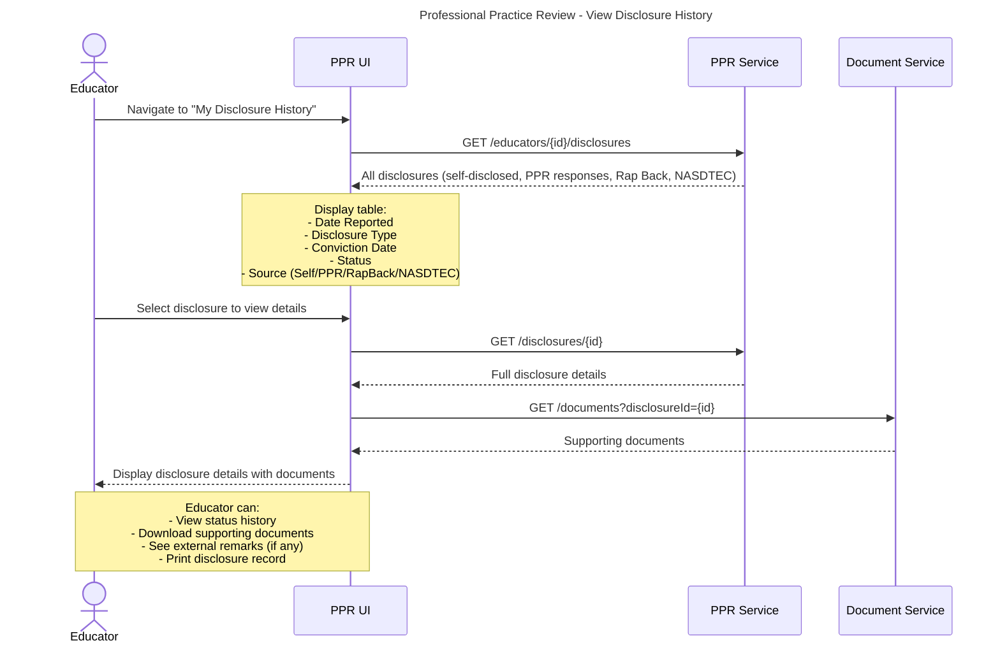
```mermaid
---
title: Professional Practice Review - View Disclosure History
---
sequenceDiagram
    actor Educator
    participant UI as PPR UI
    participant PPRService as PPR Service
    participant DocService as Document Service
    
    Educator->>UI: Navigate to "My Disclosure History"
    UI->>PPRService: GET /educators/{id}/disclosures
    PPRService-->>UI: All disclosures (self-disclosed, PPR responses, Rap Back, NASDTEC)
    
    Note over UI: Display table:<br/>- Date Reported<br/>- Disclosure Type<br/>- Conviction Date<br/>- Status<br/>- Source (Self/PPR/RapBack/NASDTEC)
    
    Educator->>UI: Select disclosure to view details
    UI->>PPRService: GET /disclosures/{id}
    PPRService-->>UI: Full disclosure details
    
    UI->>DocService: GET /documents?disclosureId={id}
    DocService-->>UI: Supporting documents
    
    UI-->>Educator: Display disclosure details with documents
    
    Note over Educator,UI: Educator can:<br/>- View status history<br/>- Download supporting documents<br/>- See external remarks (if any)<br/>- Print disclosure record
```

**Key Decisions:**
- **Self-Only:** Educators can only view their own disclosures
- **Read-Only:** Cannot edit finalized disclosures; must contact PPR for corrections
- **External Remarks Visibility:** External remarks may be visible to educator; internal remarks are not

**State Changes:**
- None (read-only operation)

**Events Published:**
- None (or optional audit log entry)

**Error Scenarios:**
- No disclosures on file > Display message indicating no history
- Disclosure not found > Display error

---

## Export Disclosure Data

**What:** Educator or admin downloads disclosure records for offline review  
**When:** User needs records for personal files, legal proceedings, or compliance audits  
**Who:** Authenticated educator (self-only) or admin with appropriate permissions

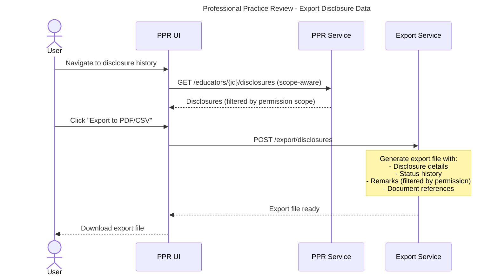
```mermaid
---
title: Professional Practice Review - Export Disclosure Data
---
sequenceDiagram
    actor User
    participant UI as PPR UI
    participant PPRService as PPR Service
    participant ExportService as Export Service
    
    User->>UI: Navigate to disclosure history
    UI->>PPRService: GET /educators/{id}/disclosures (scope-aware)
    PPRService-->>UI: Disclosures (filtered by permission scope)
    
    User->>UI: Click "Export to PDF/CSV"
    UI->>ExportService: POST /export/disclosures
    
    Note over ExportService: Generate export file with:<br/>- Disclosure details<br/>- Status history<br/>- Remarks (filtered by permission)<br/>- Document references
    
    ExportService-->>UI: Export file ready
    UI-->>User: Download export file
```

**Key Decisions:**
- **Format Options:** PDF for official records, CSV for data analysis
- **Permission Filtering:** Educators see only their own; admins see based on scope
- **Document References:** Export includes document IDs/names but not file content

**State Changes:**
- None (read-only operation)

**Events Published:**
- None (or optional audit log entry)

**Error Scenarios:**
- Export generation fails > Display error, allow retry
- No data to export > Display message

You're right on both counts! Let me add those two missing sequences:

---

## Review NASDTEC Disciplinary Record

**What:** PPR reviewer examines out-of-state disciplinary action and determines impact on Michigan credentials  
**When:** NASDTEC record appears in worklist after nightly batch matching  
**Who:** User with `profpractice.disclosure.view` permission assigned to worklist

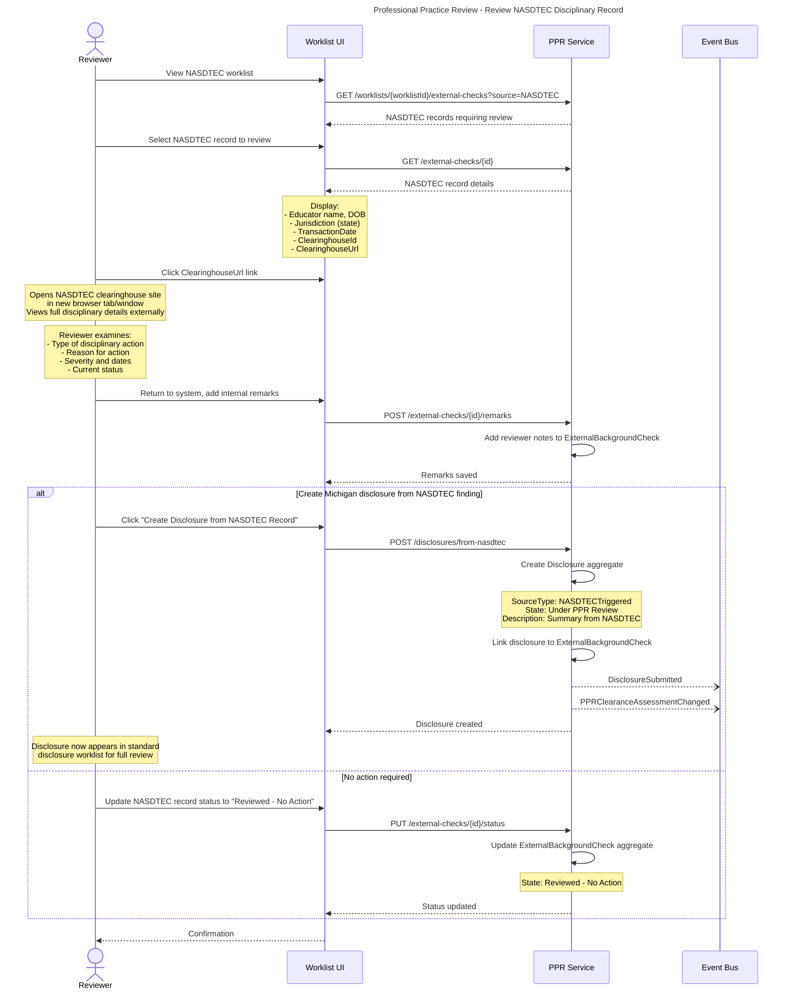
```mermaid
---
title: Professional Practice Review - Review NASDTEC Disciplinary Record
---
sequenceDiagram
    actor Reviewer
    participant WorklistUI as Worklist UI
    participant PPRService as PPR Service
    participant EventBus as Event Bus
    
    Reviewer->>WorklistUI: View NASDTEC worklist
    WorklistUI->>PPRService: GET /worklists/{worklistId}/external-checks?source=NASDTEC
    PPRService-->>WorklistUI: NASDTEC records requiring review
    
    Reviewer->>WorklistUI: Select NASDTEC record to review
    WorklistUI->>PPRService: GET /external-checks/{id}
    PPRService-->>WorklistUI: NASDTEC record details
    
    Note over WorklistUI: Display:<br/>- Educator name, DOB<br/>- Jurisdiction (state)<br/>- TransactionDate<br/>- ClearinghouseId<br/>- ClearinghouseUrl
    
    Reviewer->>WorklistUI: Click ClearinghouseUrl link
    Note over Reviewer: Opens NASDTEC clearinghouse site<br/>in new browser tab/window<br/>Views full disciplinary details externally
    
    Note over Reviewer: Reviewer examines:<br/>- Type of disciplinary action<br/>- Reason for action<br/>- Severity and dates<br/>- Current status
    
    Reviewer->>WorklistUI: Return to system, add internal remarks
    WorklistUI->>PPRService: POST /external-checks/{id}/remarks
    PPRService->>PPRService: Add reviewer notes to ExternalBackgroundCheck
    PPRService-->>WorklistUI: Remarks saved
    
    alt Create Michigan disclosure from NASDTEC finding
        Reviewer->>WorklistUI: Click "Create Disclosure from NASDTEC Record"
        WorklistUI->>PPRService: POST /disclosures/from-nasdtec
        
        PPRService->>PPRService: Create Disclosure aggregate
        Note over PPRService: SourceType: NASDTECTriggered<br/>State: Under PPR Review<br/>Description: Summary from NASDTEC
        
        PPRService->>PPRService: Link disclosure to ExternalBackgroundCheck
        
        PPRService--)EventBus: DisclosureSubmitted
        PPRService--)EventBus: PPRClearanceAssessmentChanged
        
        PPRService-->>WorklistUI: Disclosure created
        
        Note over Reviewer: Disclosure now appears in standard<br/>disclosure worklist for full review
        
    else No action required
        Reviewer->>WorklistUI: Update NASDTEC record status to "Reviewed - No Action"
        WorklistUI->>PPRService: PUT /external-checks/{id}/status
        
        PPRService->>PPRService: Update ExternalBackgroundCheck aggregate
        Note over PPRService: State: Reviewed - No Action
        
        PPRService-->>WorklistUI: Status updated
    end
    
    WorklistUI-->>Reviewer: Confirmation
```

**Key Decisions:**
- **External Review:** Full disciplinary details viewed on NASDTEC site, not in MiEdWorkforce
- **Disclosure Creation:** Reviewer decides whether NASDTEC finding warrants Michigan disclosure
- **Link Preservation:** Disclosure remains linked to original NASDTEC record for audit trail

**State Changes:**
- ExternalBackgroundCheck: `Received` > `Reviewed - No Action` or remains `Received` if disclosure created
- Disclosure: `None` > `Under PPR Review` (if created from NASDTEC finding)

**Events Published:**
- `DisclosureSubmitted` - If disclosure created from NASDTEC record
- `PPRClearanceAssessmentChanged` - If disclosure created

**Error Scenarios:**
- ClearinghouseUrl inaccessible > Display error, suggest manual follow-up
- Educator match no longer valid > Log issue, flag for admin review

---

## Generate PPR Compliance Report

**What:** Admin accesses reporting interface to view disclosure processing metrics and compliance data  
**When:** Ad-hoc reporting needs, compliance audits, or management review  
**Who:** User with `profpractice.reports.disclosure-metrics.view` or `profpractice.reports.compliance.view` permission

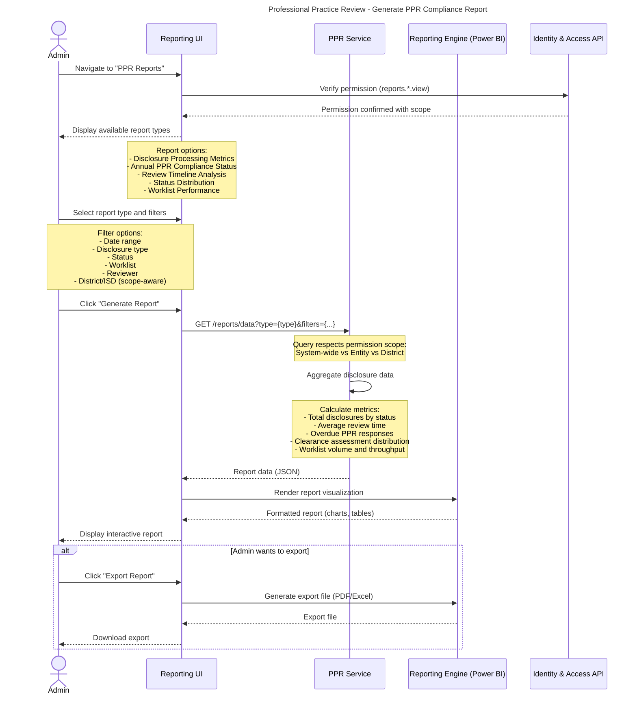
```mermaid
---
title: Professional Practice Review - Generate PPR Compliance Report
---
sequenceDiagram
    actor Admin
    participant UI as Reporting UI
    participant PPRService as PPR Service
    participant ReportingEngine as Reporting Engine (Power BI)
    participant IAM as Identity & Access API
    
    Admin->>UI: Navigate to "PPR Reports"
    UI->>IAM: Verify permission (reports.*.view)
    IAM-->>UI: Permission confirmed with scope
    
    UI-->>Admin: Display available report types
    Note over UI: Report options:<br/>- Disclosure Processing Metrics<br/>- Annual PPR Compliance Status<br/>- Review Timeline Analysis<br/>- Status Distribution<br/>- Worklist Performance
    
    Admin->>UI: Select report type and filters
    Note over Admin,UI: Filter options:<br/>- Date range<br/>- Disclosure type<br/>- Status<br/>- Worklist<br/>- Reviewer<br/>- District/ISD (scope-aware)
    
    Admin->>UI: Click "Generate Report"
    
    UI->>PPRService: GET /reports/data?type={type}&filters={...}
    Note over PPRService: Query respects permission scope:<br/>System-wide vs Entity vs District
    
    PPRService->>PPRService: Aggregate disclosure data
    Note over PPRService: Calculate metrics:<br/>- Total disclosures by status<br/>- Average review time<br/>- Overdue PPR responses<br/>- Clearance assessment distribution<br/>- Worklist volume and throughput
    
    PPRService-->>UI: Report data (JSON)
    
    UI->>ReportingEngine: Render report visualization
    ReportingEngine-->>UI: Formatted report (charts, tables)
    
    UI-->>Admin: Display interactive report
    
    alt Admin wants to export
        Admin->>UI: Click "Export Report"
        UI->>ReportingEngine: Generate export file (PDF/Excel)
        ReportingEngine-->>UI: Export file
        UI-->>Admin: Download export
    end
```

**Key Decisions:**
- **External Reporting Tool:** Reports rendered via Power BI or similar business intelligence platform
- **PPR Domain Responsibility:** PPR Service provides data endpoints; reporting platform handles visualization
- **Scope-Aware:** Reports filter data based on user's permission scope (system-wide, district, ISD)
- **Real-Time Data:** Reports query current state, not cached/snapshot data

**Report Types Supported:**
1. **Disclosure Processing Metrics**
   - Total disclosures submitted (by period)
   - Status distribution (Under Review, Reviewed - Misdemeanor, etc.)
   - Average time in each status
   - Bottleneck identification

2. **Annual PPR Compliance Status**
   - Educators with compliant PPR responses (since June 30)
   - Educators overdue for PPR
   - Reminder escalation tracking
   - Compliance rate by district/ISD

3. **Review Timeline Analysis**
   - Time from submission to final review
   - Reviewer workload distribution
   - SLA compliance (if defined)

4. **Account Marker Summary**
   - Count of educators with each marker type
   - Marker duration analysis
   - Marker reason categories

5. **External Integration Status**
   - Rap Back notifications received and processed
   - NASDTEC records matched and reviewed
   - Integration success/failure rates

**State Changes:**
- None (read-only operation)

**Events Published:**
- None (or optional audit log entry for report access)

**Error Scenarios:**
- No data matching filters > Display message
- Reporting engine unavailable > Display error, suggest retry
- Permission denied for requested scope > Access denied
