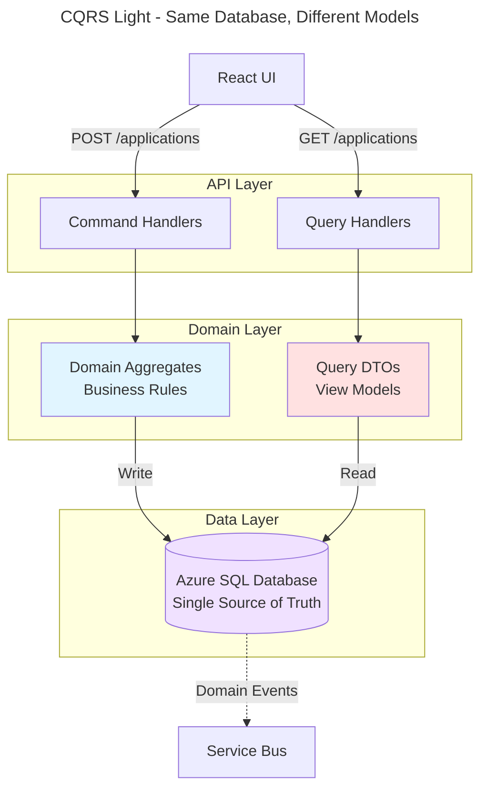

# MiEdWorkforce Technology Standards

## Key Architectural Principles

### Domain-Driven Design
- Each domain owns its data, business logic, and workflows
- Bounded contexts prevent coupling between domains
- Aggregates enforce consistency boundaries
- Domain events enable loose coupling across domains

### Event-Driven Architecture
- Domains publish events when significant state changes occur
- Other domains subscribe to relevant events
- Enables asynchronous processing and scalability
- Supports eventual consistency where appropriate

### API-First Design
- All domain capabilities exposed via REST APIs
- Internal and external API surfaces clearly separated
- API contracts versioned and documented
- Synchronous APIs for queries, asynchronous events for state changes

### Separation of Concerns
- UI layer: Presentation and user interaction
- API layer: Business logic and orchestration
- Event processors: Asynchronous workflows
- Data layer: Persistence and querying
- External integrations: Isolated in dedicated services

### Database Per Domain
- Each domain owns its database schema
- No cross-database queries or foreign keys
- Data sharing via APIs or events
- Technology choices optimized per domain (SQL vs Cosmos)

### Observability by Default
- Structured logging to Application Insights
- Distributed tracing across service boundaries
- Custom metrics for business KPIs
- Proactive alerting on critical failures

### Security in Depth
- Authentication at gateway (MiLogin OIDC)
- Authorization at API layer (IAM permission checks)
- Encryption at rest and in transit
- Secrets management via Azure Key Vault
- Network isolation within AKS

---

## Enterprise Platform

All solution domains in MiEdWorkforce will follow these technology standards unless explicitly documented otherwise.

### Compute & Hosting

| Layer                   | Technology                     | Version    | Rationale                                                          |
| ----------------------- | ------------------------------ | ---------- | ------------------------------------------------------------------ |
| Container Orchestration | Azure Kubernetes Service (AKS) | Current    | Enterprise standard, auto-scaling, zero-downtime deployments       |
| API Runtime             | .NET                           | Latest LTS | Strong typing, async/await, Azure integration, cross-platform      |
| Background Services     | .NET Hosted Services           | Latest LTS | Reliable async processing, retry patterns, native .NET integration |

### Data & Storage

| Layer              | Technology               | Use Case                                                                                             | Rationale                                                                                                                                       |
| ------------------ | ------------------------ | ---------------------------------------------------------------------------------------------------- | ----------------------------------------------------------------------------------------------------------------------------------------------- |
| Transactional Data | Azure SQL Database       | Application state, workflows, audit logs                                                             | ACID compliance, complex queries, familiar tooling                                                                                              |
| CEDS Integration   | Cosmos DB (CEDS JSON-LD) | Inbound reference data replicas, outbound domain event projections for cross-system interoperability | Integration boundary store, not operational store -- see [CEDS JSON-LD Data Integration](../patterns-and-principles/ceds-jsonld-integration.md) |
| Caching            | Azure Cache for Redis    | Session state, API response caching                                                                  | Low-latency, distributed cache, Azure-managed                                                                                                   |
| Analytics          | Azure Synapse Analytics  | Long-running transformations, data warehousing                                                       | Petabyte-scale, SQL/Spark engines, reporting                                                                                                    |

### Integration & Messaging

| Layer            | Technology           | Use Case                                 | Rationale                                              |
| ---------------- | -------------------- | ---------------------------------------- | ------------------------------------------------------ |
| Async Messaging  | Azure Service Bus    | Domain events, batch processing, retries | Durable queues, dead-letter handling, message ordering |
| Real-time Events | Azure Event Grid     | Pub/sub notifications                    | Lightweight, serverless, Azure ecosystem integration   |
| API Gateway      | Azure API Management | External API exposure, rate limiting     | Security, throttling, analytics, developer portal      |

### Authentication & Authorization

| Layer                   | Technology               | Use Case                   | Rationale                                      |
| ----------------------- | ------------------------ | -------------------------- | ---------------------------------------------- |
| User Authentication     | MiLogin (OpenID Connect) | SSO for all user types     | State standard, no user credentials in MEWF    |
| Service-to-Service Auth | Azure Managed Identity   | Microservice communication | Passwordless, Azure-native, automatic rotation |
| API Authorization       | JWT Bearer Tokens        | API security               | Industry standard, stateless, claims-based     |

### Monitoring & Observability

| Layer                  | Technology                 | Use Case                              | Rationale                                        |
| ---------------------- | -------------------------- | ------------------------------------- | ------------------------------------------------ |
| Application Monitoring | Azure Application Insights | API performance, dependencies, errors | Azure-native, distributed tracing, alerting      |
| Logging                | Azure Log Analytics        | Centralized logs, queries             | KQL queries, correlation IDs, retention policies |
| Metrics                | Azure Monitor              | Infrastructure health, SLA tracking   | Dashboards, alerts, auto-scaling triggers        |

---

## Deployment Architecture

### Container Orchestration
- **Platform:** Azure Kubernetes Service (AKS)
- **Namespace Strategy:** One namespace per domain (e.g., `iam`, `credentialing`, `payments`, `profpractice`) plus shared `platform` namespace
- **Scaling:** Horizontal pod autoscaling based on:
  - CPU utilization (target: 70%)
  - Memory utilization (target: 80%)
  - Custom metrics (e.g., Service Bus queue depth, API request rate)
- **Deployment Strategy:** Blue-green deployments for zero-downtime releases
- **Health Checks:** Kubernetes liveness and readiness probes on all services
- **Deployment:** GitOps via Flux monitoring GitHub repository (Helm + Kustomize)

### Frontend Hosting
- **Platform:** Azure Static Web Apps
- **CDN:** Global distribution via Azure CDN
- **SSL/TLS:** Automatic HTTPS certificate management

### API Gateway
- **Platform:** Azure API Management (APIM)
- **External Endpoints:** All public APIs routed through APIM
- **Security:** Rate limiting (1000 req/min per user), DDoS protection, WAF
- **Internal Endpoints:** Direct service-to-service within AKS (no APIM overhead)

### Data Services
- **Azure SQL:** Managed service with automated backups, point-in-time restore
- **Cosmos DB:** Geo-redundant storage (GRS) for disaster recovery
- **Blob Storage:** Lifecycle management for automatic tier transitions (Hot -> Cool -> Archive)

### Observability
- **Logging:** Application Insights with structured logging (Serilog)
- **Metrics:** Azure Monitor for infrastructure, custom metrics for business KPIs
- **Tracing:** Distributed tracing with OpenTelemetry, W3C Trace Context propagation
- **Alerting:** 
  - Critical: Database failures, Service Bus dead-letter queue depth >100
  - Warning: API latency p95 >100ms, cache hit rate <90%

### Orchestration
- **Batch Jobs:** Azure Synapse Pipelines for scheduled orchestrations (nightly sync, reconciliation)
- **Lightweight Jobs:** Azure Functions for simple scheduled tasks (blob cleanup)

---

## Technology Decisions

### Data Storage Decisions

**When to use Azure SQL:**
- Application-specific transactional data
- Complex relational integrity (foreign keys, JOINs, constraints)
- ACID transaction requirements
- Temporal audit trails (SQL Server temporal tables)
- Mature tooling and team expertise

**When to use Cosmos DB:**
- Document/flexible schema needs
- TTL-based auto-expiration required
- CEDS JSON-LD alignment for state interoperability
- Global distribution requirements (future consideration)

**Default choice:** When in doubt, use Azure SQL. Most MiEdWorkforce domains use SQL exclusively.

**Domain-specific examples:**
- **IAM:** Azure SQL -- Highly relational (authorization hierarchies, transitive queries)
- **Payments:** Azure SQL -- ACID transactions, complex reconciliation, temporal tables. See [Payments Domain Doc](../solution-areas/payments/payments-capability.md) for complete rationale.
- **Professional Practice Review:** Azure SQL -- Multi-table clearance assessments, 7-year audit compliance. See [PPR Domain Doc](../solution-areas/profpractice/profpractice-domain.md) for complete rationale.
- **Communications:** Cosmos DB -- Email content with TTL-based cleanup (90-day retention)
- **Organizations Capability:** Cosmos DB -- Inbound CEDS JSON-LD replica of organization records sourced from CEPI. Uses the document model to accommodate JSON-LD structure without imposing a fixed relational schema. Exposed internally as a read-only API; no domain writes to this store directly.
- **CEDS Transactional Layer:** Cosmos DB -- Outbound projection of domain events into CEDS JSON-LD format, written by the reconciliation worker. Serves as MiEdWorkforce's contribution to the broader CEDS data ecosystem and feeds downstream ETL pipelines. This is not a source of truth -- authoritative state remains in domain SQL databases.
- **Other domains with lightweight CEDS metadata needs:** Azure SQL with JSON columns -- where a domain needs to carry CEDS-aligned metadata alongside relational data without warranting a separate Cosmos DB container, JSON columns in SQL provide a pragmatic middle ground while maintaining relational integrity.


---

### Messaging Decisions

**Why Azure Service Bus vs Event Grid?**

Service Bus provides at-least-once delivery guarantees, dead-letter queues, message sessions, and durable subscriptions. It is the right choice when reliable, ordered processing of business events matters -- which is true of all domain events in MiEdWorkforce.

Event Grid is a reactive eventing layer optimized for responding to infrastructure and platform state changes. It is push-based, low-latency, and well-suited to wiring Azure services together -- for example, triggering a document processing worker when a file lands in Blob Storage, or reacting to AKS health events. It is not designed for high-throughput streaming (that is Event Hub's role) and does not provide the delivery guarantees Service Bus offers.

**MiEdWorkforce choice:** Azure Service Bus for all domain events. Event Grid is used narrowly for infrastructure-triggered reactions, primarily Blob Storage event triggers feeding the Documents capability worker. It is not used as a general pub/sub mechanism for application-level events.

---

### CQRS

MiEdWorkforce applies CQRS at the API and model level, not at the database level. Commands flow through domain aggregates that enforce business rules; queries use optimized DTOs that read directly from the same database. This keeps consistency simple and avoids the operational overhead of separate read/write stores.

**What this means in practice:**
- Command handlers validate through domain aggregates before writing
- Query handlers return view-optimized DTOs (denormalized, UI-shaped)
- A single Azure SQL database per domain handles both reads and writes
- Dual storage is used only where access patterns clearly justify it (e.g., Cosmos DB for email content with TTL expiration, SQL for email metadata queries)

**Full CQRS (separate read/write databases) is not used.** MiEdWorkforce's consistency requirements and scale profile (~5,000 concurrent users) don't warrant it. Azure SQL with proper indexing, materialized views, and Redis caching provides sufficient read performance. Revisit if per-domain read volume approaches 50,000 queries/second or write contention becomes measurable.

For implementation patterns (aggregate base classes, command/query separation in .NET), see the domain-specific documentation.

**Pattern:**


**When to Use Separate Storage:**

Use dual storage only when access patterns clearly benefit from different storage technologies:

**Email Content (Communications Domain)**
- Write: Cosmos DB (fast document writes, TTL-based expiration)
- Read (search/reporting): SQL (complex queries, joins, aggregations)
- Justification: Email resend needs fast document retrieval; email search needs SQL queries

**Analytics/Reporting (Future)**
- Write: Operational SQL databases
- Read: Azure Synapse Analytics (separate data warehouse)
- Justification: Prevent heavy reporting queries from impacting operational performance

**Typical Domain Operations**
- Single Azure SQL database handles both reads and writes
- Proper indexing, query optimization, and caching provide sufficient performance

**When to Revisit:**

Consider separate read/write databases if:
- Read volume exceeds 50,000 queries/second per domain
- Write contention causes query performance degradation despite optimization
- Need to support fundamentally different query technologies (e.g., SQL + Elasticsearch + Graph DB)
- Global distribution requires localized read replicas with eventual consistency

Until these thresholds are reached, optimize within a single database using:
- Read-optimized indexes (covering indexes, filtered indexes)
- Materialized views for complex aggregations
- Redis caching for frequently accessed data
- Database replicas for read scaling (Azure SQL read replicas)

---

### Orchestration Decisions

**Why Azure Synapse Pipelines vs Hangfire/Quartz?**
- Visual pipeline orchestration and monitoring
- Centralized orchestration across multiple services
- Better suited for ETL and data integration tasks
- API-triggered jobs keep domain logic in APIs (not in orchestration layer)

**MiEdWorkforce choice:** Synapse Pipelines for scheduled batch jobs; .NET Worker Services for event-driven processing

---

### Frontend Hosting Decisions

**Why Azure Static Web Apps?**
- Global CDN distribution
- Automatic HTTPS certificate management
- Easy integration with Azure AD/MiLogin
- Cost-effective for React SPAs

---

### Caching Decisions

**Authorization Cache (IAM Domain)**

**Purpose:** Cache authorization evaluation results, user authorizations, organization hierarchies for sub-10ms performance

**Implementation Options:**
1. **Azure Cache for Redis** - Separate managed service, shared across all pods
2. **In-Memory Distributed Cache (AKS)** - Cache within application pods, synchronized via Service Bus or Redis Backplane

**Decision Pending:** Evaluate performance requirements, cost, and operational complexity

**Key Cache Patterns:**
- `auth:{userId}:{permission}:{organizationCode}` - Authorization evaluation results (TTL: 5 min)
- `user-auth:{userId}:{miLoginType}` - User authorizations (TTL: 5 min)
- `hierarchy:{organizationCode}` - Organization parent hierarchy (TTL: 24 hours)
- `role:{roleId}` - Role definitions (TTL: 1 hour)
- `impersonate:{sessionToken}` - Impersonation sessions (TTL: 30 min)

**Invalidation Strategy:** Event-driven via Service Bus messages published by IAM Event Processor

---

## Integration Architecture

### Internal Service Communication
- **Pattern:** Synchronous HTTP/REST within AKS cluster
- **Service Discovery:** Kubernetes DNS (`{service-name}.{namespace}.svc.cluster.local`)
- **Auth:** Azure Managed Identity or mutual TLS (mTLS)
- **Retry:** Polly policies for transient failures (exponential backoff)

### Event-Driven Communication
- **Pattern:** Publish-subscribe via Azure Service Bus
- **Guarantees:** At-least-once delivery
- **Idempotency:** Consumers must handle duplicate events (use event ID deduplication)
- **Dead Letter Queue:** Failed messages moved to DLQ after max retry attempts
- **Message Format:** JSON with CloudEvents schema

### External Integrations
- **Pattern:** Azure API Management gateway for public endpoints
- **Auth:** MiLogin OIDC for users, API keys for systems
- **Rate Limiting:** 1000 req/min per user, 10000 req/min per system
- **Security:** WAF rules, DDoS protection, IP filtering

### Scheduled Orchestration
- **Pattern:** Azure Synapse Pipelines trigger API endpoints or perform ETL
- **Retry:** Synapse handles retry logic for failed pipeline runs
- **Monitoring:** Pipeline execution logs in Synapse, business logic logs in Application Insights
- **Auth:** Synapse uses Managed Identity to authenticate to APIs
---

## Service Mesh (Istio)

MiEdWorkforce uses Istio to provide zero-trust networking, infrastructure-level resilience, and automatic observability across all AKS services. mTLS between all services is a hard security requirement.

### What Istio Provides

- **Mutual TLS:** All service-to-service traffic is encrypted and authenticated automatically. Services communicate over plain HTTP; Istio handles the TLS layer via Envoy sidecar proxies. No application code changes required.
- **Circuit Breaking:** Envoy detects failing upstream services and opens the circuit to prevent cascade failures. Configured per service via `DestinationRule`.
- **Retries and Timeouts:** Configured at the infrastructure layer via `VirtualService`. Applications still need to implement idempotency — Istio retries at the network level without awareness of side effects.
- **Canary Deployments:** Traffic splitting via weighted `VirtualService` routes enables gradual rollouts with instant rollback.
- **Automatic Observability:** Request rate, error rate, and latency (p50/p95/p99) collected automatically per service. Distributed traces propagated via W3C Trace Context. Applications add business-logic spans on top.

### mTLS Policy

The default policy across all namespaces is `STRICT` — non-mTLS traffic is rejected. Certificates are issued automatically by Istiod when pods start, rotated every 24 hours, and stored in-memory only (never persisted to disk).
```yaml
apiVersion: security.istio.io/v1beta1
kind: PeerAuthentication
metadata:
  name: default
  namespace: istio-system
spec:
  mtls:
    mode: STRICT
```

Each service has a unique SPIFFE identity (`spiffe://cluster.local/ns/{namespace}/sa/{service-account}`) encoded in its certificate. `AuthorizationPolicy` resources use these identities to restrict which services can call which endpoints.

### Circuit Breaking Pattern

Circuit breakers are configured per service. The values below are representative — actual thresholds are in `infrastructure/istio/services/`. The key parameters to tune per service are consecutive error threshold, ejection time, and max ejection percentage, which should reflect the service's traffic volume and criticality.
```yaml
apiVersion: networking.istio.io/v1beta1
kind: DestinationRule
metadata:
  name: example-circuit-breaker
spec:
  host: example-api.example.svc.cluster.local
  trafficPolicy:
    outlierDetection:
      consecutiveErrors: 5
      interval: 30s
      baseEjectionTime: 30s
      maxEjectionPercent: 50
```

High-value services (Payments, PPR) use tighter thresholds and longer ejection times. High-throughput fire-and-forget services (Communications) use looser thresholds.

### Retry and Timeout Pattern

Retries are configured via `VirtualService`. The default cluster-wide timeout is 30 seconds. Services override this based on their expected latency profile.
```yaml
apiVersion: networking.istio.io/v1beta1
kind: VirtualService
metadata:
  name: example-retry-policy
spec:
  hosts:
  - example-api.example.svc.cluster.local
  http:
  - retries:
      attempts: 3
      perTryTimeout: 2s
      retryOn: 5xx,connect-failure,refused-stream
    timeout: 10s
```

Idempotency is an **application responsibility**. Istio retries blindly — duplicate requests must be safe.

### What Istio Does Not Replace

| Concern          | Istio Handles                         | Application Must Handle                              |
| ---------------- | ------------------------------------- | ---------------------------------------------------- |
| Circuit breaking | Network failures, consecutive errors  | Business logic failures, optimistic concurrency      |
| Retries          | Network-level (5xx, connection reset) | Idempotency                                          |
| Timeouts         | Enforce at network layer              | Graceful cancellation (`CancellationToken`)          |
| Fallback         | Nothing                               | Cache fallback, degraded mode                        |
| Tracing          | Network spans (service A → B)         | Business logic spans (DB queries, domain operations) |

### Configuration Management

All Istio configuration lives in `infrastructure/istio/` and is managed via GitOps (Flux). Changes go through pull request review and are applied automatically on merge.

### Performance Overhead

Istio adds approximately 2–3ms per service-to-service call (mTLS + Envoy proxy hop) and roughly 50–100m CPU and 50–100Mi memory per pod for the sidecar. This is acceptable given the security and observability benefits.

## Event Sourcing

Event sourcing is used selectively for aggregates where tamper-proof audit history is a legal or regulatory requirement — not as a general persistence strategy.

### When to Use It

Use event sourcing when:
- Legal disputes may require reconstructing historical state years later
- Regulatory compliance demands an immutable audit trail (7+ year retention)
- Time-travel queries are needed ("what was the credential status on this date?")
- The complete history of state changes has business value beyond current state

Do not use it for reference data, transient data, high-churn data without audit requirements, or simple CRUD operations.

### Scope

Event sourcing is required for the following aggregates:

| Domain                       | Aggregates                              | Rationale                                                           |
| ---------------------------- | --------------------------------------- | ------------------------------------------------------------------- |
| Credentialing                | `Credential`, `CredentialApplication`   | Legal disputes over credential decisions, 7-year retention          |
| Professional Practice Review | `Disclosure`, `EducatorPPRStatus`       | Employment eligibility disputes, clearance assessment defensibility |
| Payments                     | `PaymentTransaction`, `RefundRequest`   | Financial compliance, dispute resolution                            |
| IAM                          | `Authorization`, `ImpersonationSession` | Security incident investigation, access control auditing            |

For PPR specifically: when a clearance assessment is performed, the snapshot of inputs (active disclosures, account markers), the version of clearance logic applied, and the assessment output must all be captured as part of the event record.

### Audit Layers

Event sourcing is the deepest audit layer. It sits alongside, not instead of:

1. **Application logs** (OTel -> Azure Monitor) — API requests, performance, errors; 90-day retention
2. **API audit trail** (SQL) — who called what, when; 7-year retention
3. **Domain event log** (Service Bus -> SQL) — all business events across domains; 7-year retention
4. **Event store** (SQL, append-only) — complete state history for critical aggregates; indefinite

### Implementation

For implementation details — event store schema, aggregate base classes, projection handlers, hash chain verification, and data retention tiers — see [Event Sourcing Pattern](../patterns-and-principles/event-sourcing.md).
