# Communications

- **Type:** Platform Capability
- **Identifier:** communications
- **Primary Sources:** BRDs 6.1, 6.2, 6.3, 6.4, 10.4, 10.5, 13.4, 14.4, 15.13, 16.3, 18.6, 19.4, 21.6, 22.5, 27.3

---

## Purpose

The Communications platform capability provides centralized notification and alerting infrastructure across MiEdWorkforce, enabling functional areas to deliver personalized, event-driven communications to internal staff, educators, and external stakeholders through email, dashboard alerts, and on-screen warnings. It manages the complete email lifecycle from template creation through delivery, retention, and resend capabilities.

---

## Classification Rationale

**Platform Capability** - Communications is foundational infrastructure used by all core domains (Credentials, Staffing, Professional Learning, etc.). It doesn't contain business logic about *why* to send communications but provides the *how* and *when*. All domains depend on it for user engagement and workflow notifications. While template management introduces some domain-like characteristics, the primary value is technical enablement rather than direct business value delivery.

---

## Scope

**This domain owns:**
- Email template lifecycle management (creation, versioning, activation) scoped by functional area
- Template variable resolution from multiple data sources (database fields, event payloads)
- Email delivery orchestration via SendGrid with delivery status tracking
- Email content retention for configurable period (hot storage)
- Email audit history retention for compliance period (warm/cold storage)
- Email resend capabilities with recipient override support
- Dashboard alerts and on-screen warnings delivery
- Event subscription and automatic notification triggering
- Recipient targeting via roles, organizational hierarchy, and external contact sources (EEM, CEPI)
- Comment management on process items (internal/external visibility)
- Scheduled and recurring notification execution
- Dashboard alert lifecycle and resolution tracking

**This domain does NOT own:**
- Workflow state transitions that emit triggering events -> Domain-specific workflow engines (e.g., `credentialing`, `staffing`)
- User role definitions and organizational hierarchy -> `iam` domain
- Email deliverability infrastructure (SMTP/API, spam filtering) -> SendGrid external service
- Evaluation of which credential applications are "approved" -> `credentialing` domain
- Determination of which staffing records have data quality issues -> `dataquality` domain
- Long-term archival storage infrastructure -> Azure Storage / Data Lake

---

## Ubiquitous Language

| Term                        | Definition                                                                                                                                                                                                                           |
| --------------------------- | ------------------------------------------------------------------------------------------------------------------------------------------------------------------------------------------------------------------------------------ |
| **Template**                | A reusable email or alert content structure containing static text and variable placeholders, versioned over time and scoped to a functional area (e.g., Credentialing, Professional Learning)                                       |
| **Template Variable**       | A dynamic placeholder (e.g., `<<ApplicantName>>`) in template content that resolves to user-facing formatted data at send time. Variables are contextual to the event type that triggers the email.                                  |
| **Functional Area**         | An organizational module (Credentialing, Staffing, EPP, Professional Learning) that owns and manages its own set of templates                                                                                                        |
| **Email Instance**          | An immutable historical record of a sent email containing the fully rendered email content (after all variable resolution), recipients, delivery metadata, and audit trail. Does NOT store the original event or template structure. |
| **Email Content Retention** | Hot storage of complete rendered email content for help desk support and resend functionality (typically 90 days)                                                                                                                    |
| **Email Audit History**     | Warm/cold storage of email metadata and delivery events for compliance and auditing (typically 7 years)                                                                                                                              |
| **Delivery Status**         | SendGrid-provided status indicating email lifecycle: Processed, Delivered, Bounced, Deferred, Dropped (with substatus details)                                                                                                       |
| **Alert**                   | A user-facing notification displayed in dashboards or on-screen that requires attention or action, with lifecycle states (Active, Resolved, Expired)                                                                                 |
| **Trigger Event**           | A standardized domain event (e.g., `CredentialApplicationApproved`) that initiates notification evaluation. Events carry minimal payload (typically IDs and core intrinsic data) rather than verbose denormalized data.              |
| **Event Type**              | The classification of a domain event (e.g., `CredentialApplicationApproved`, `StaffingRecordSubmitted`) which determines the context-specific variables available for template resolution.                                           |
| **Variable Resolver**       | Component that transforms event payloads and entity IDs into user-facing, formatted values for template placeholders. Resolvers are event-type specific and handle data fetching and formatting.                                     |
| **Recipient Resolution**    | The process of identifying notification recipients by evaluating roles, organizational relationships, and external contact sources based on minimal event payload data.                                                              |
| **Resend**                  | Capability to retransmit a previously sent email, optionally to different recipient(s), available only during the content retention period.                                                                                          |
| **Recipient Override**      | Modification of the recipient email address when resending, useful for corrected addresses or forwarding to help desk                                                                                                                |
| **Consolidation**           | Batching multiple related events into a single notification to reduce communication volume (e.g., 10 data quality issues -> 1 email listing all)                                                                                     |
| **Comment**                 | A text annotation on a process item (credential application, staffing record) with visibility control (internal-only or external-visible) and optional inclusion in outbound emails                                                  |

---

## Domain Model

### Core Aggregates

#### EmailTemplate

**Root Entity:** EmailTemplate

**Purpose:** Manages the lifecycle and versioning of reusable email content structures, ensuring only one active version exists per template and enforcing functional area isolation.

**Entities & Value Objects:**
- **EmailTemplate** (root) - Template metadata, ownership, lifecycle status, event type binding
- **TemplateVersion** - Versioned snapshot of template content (subject, body, variable placeholders)
- **TemplateVariable** - Variable placeholder name and metadata (NOT resolution logic - that lives in resolvers)
- **TemplateRecipient** - Role-based recipient targeting configuration
- **EventTypeBinding** - Links template to the specific domain event that triggers it (event_type name, functional_area)

**Key Invariants:**
- A template must have at least one version at all times
- Only one version can be marked as current/active per template
- Template names must be unique within a functional area
- **Templates must be associated with a specific event type** - this creates the binding between domain events and templates
- Only one active template is allowed per event type within a functional area
- Mandatory template variables must resolve to non-null values or send is blocked
- Variable placeholders must match the available variables for the template's event type

**Key States:** `Draft`, `Pending`, `Active`, `Archived`

**Referenced In:**
- Sequence: Event-Triggered Notification
- Sequence: Manual Email Send with Template Customization
- Sequence: Template Version Update

---

#### EmailInstance

**Root Entity:** EmailInstance

**Purpose:** Preserves complete historical record of sent emails with dual retention policies: full content for operational needs (hot storage) and audit metadata for compliance (warm/cold storage).

**Entities & Value Objects:**
- **EmailInstance** (root) - Immutable snapshot of sent email with rendered content only
- **EmailContent** - The rendered email output (subject, body_html, body_text)
- **EmailRecipient** - Recipient details (email address, optional user reference, recipient type)
- **EmailDeliveryEvent** - Email status updates (Processed, Delivered, Bounced, etc.)
- **TemplateReference** - Immutable reference to the template version used (template_id, version_id, functional_area, event_type)
- **EmailResend** - Resend tracking with recipient override capability

**Key Invariants:**
- Instance content is immutable once created - stores ONLY the rendered output, not the original event or template structure
- Resent emails must reference original instance
- Instance must capture template version ID and event type used for audit purposes
- Delivery status tracked but instance content never modified
- Resend only available while email content exists in hot storage
- Email content archived/purged based on `content_retention_days` configuration
- Audit metadata retained for `audit_retention_years` (default 7 years)
- Original triggering event is NOT stored in EmailInstance - only rendered output preserved

**Key States:**
- **Delivery States:** `Queued`, `Processed`, `Delivered`, `Bounced`, `Deferred`, `Dropped`, `Failed`
- **Content Lifecycle:** `Active` (hot storage), `Archived` (content purged, metadata retained)

**Referenced In:**
- Sequence: Email Instance Creation and Delivery
- Sequence: Email Resend with Recipient Override
- Sequence: Email History Search and Details View
- Sequence: SendGrid Webhook Status Update

---

#### Alert

**Root Entity:** Alert

**Purpose:** Manages system alerts with display context (dashboard vs on-screen), resolution tracking, and automatic expiration.

**Entities & Value Objects:**
- **Alert** (root) - Alert content, display rules, lifecycle status
- **AlertVersion** - Versioned alert content
- **AlertRoleTarget** - Role-based targeting for alert display
- **AlertResolution** - User action completing the alert (timestamp, resolution type)

**Key Invariants:**
- Alerts must have effective start date; expiration date is optional
- Alerts automatically transition to expired status when past expiration date
- Dashboard alerts persist until explicitly resolved or expired
- Alert status must be one of: Draft, Pending, Active, Expired, Resolved

**Key States:** `Draft`, `Pending`, `Active`, `Resolved`, `Expired`

**Referenced In:**
- Sequence: Dashboard Alert Creation
- Sequence: User Resolves Dashboard Alert

---

#### Comment

**Root Entity:** Comment

**Purpose:** Manages text annotations on process items with visibility control and tracking of comment inclusion in outbound emails.

**Entities & Value Objects:**
- **Comment** (root) - Comment text, visibility, lifecycle
- **CommentEmailHistory** - Tracking of which emails included this comment
- **PredefinedComment** - Template comments available per functional area

**Key Invariants:**
- Comments must be associated with a process item (credential application, staffing record, etc.)
- Internal comments never visible to external users
- External comments can be selected for email inclusion but inclusion is optional
- Comment visibility (internal/external) cannot be changed after creation if already sent in email
- Deleted comments remain in audit trail but hidden from UI

**Key States:** `Created`, `Modified`, `Sent in Email`, `Deleted`

**Referenced In:**
- Sequence: Add Comment to Credential Application
- Sequence: Include Comments in Outbound Email

---

## Entity Relationship Diagram

```mermaid
---
title: Communications ERD
---
erDiagram
    EMAIL_TEMPLATES ||--o{ TEMPLATE_VERSIONS : "has"
    EMAIL_TEMPLATES ||--o{ TEMPLATE_VARIABLE_USAGE : "defines"
    EMAIL_TEMPLATES ||--o{ TEMPLATE_EVENTS : "generates"
    
    TEMPLATE_VERSIONS ||--o{ EMAIL_INSTANCES : "used_by"
    
    EMAIL_INSTANCES ||--o{ EMAIL_DELIVERY_EVENTS : "has"
    EMAIL_INSTANCES ||--o{ EMAIL_RESENDS : "spawns"
    EMAIL_INSTANCES ||--o{ EMAIL_CONTENT : "stores_in"
    EMAIL_INSTANCES ||--o{ EMAIL_INSTANCE_EVENTS : "generates"
    
    ALERTS ||--o{ ALERT_VERSIONS : "has"
    ALERTS ||--o{ ALERT_ROLE_TARGETS : "targets"
    ALERTS ||--o{ ALERT_EVENTS : "generates"
    
    COMMENTS ||--o{ COMMENT_EMAIL_HISTORY : "included_in"
    COMMENTS }o--o{ EMAIL_INSTANCES : "referenced_by"
    
    EMAIL_TEMPLATES {
        uuid template_id PK
        string name UK "Unique within functional area"
        string functional_area "Credentialing|Staffing|ProfessionalLearning|EPP|PPR|IAM"
        string event_type UK "Domain event that triggers template"
        string description
        string status "Draft|Pending|Active|Archived"
        datetime created_at
        uuid created_by FK
        datetime last_modified_at
        uuid last_modified_by FK
    }
    
    TEMPLATE_VERSIONS {
        uuid version_id PK
        uuid template_id FK
        int version_number
        string status "Draft|Active|Inactive"
        string subject "Subject with variable placeholders"
        string body_content "Markdown with variable placeholders"
        datetime created_at
        uuid created_by FK
        datetime activated_at "NULL if never activated"
        uuid activated_by FK "NULL if never activated"
    }
    
    TEMPLATE_VARIABLE_USAGE {
        uuid usage_id PK
        uuid template_id FK
        string variable_name "ApplicantName|CertificateType|etc"
        boolean is_present_in_template
        datetime last_checked_at
    }
    
    EMAIL_INSTANCES {
        uuid instance_id PK
        string functional_area
        string event_type
        uuid template_id FK "NULL if manual send"
        uuid template_version_id FK "Version used at send time"
        string recipient_email
        string recipient_user_id FK "NULL for external recipients"
        string recipient_type "User|External"
        string subject_text "Rendered subject (text only for search)"
        string delivery_status "Queued|Processed|Delivered|Bounced|Deferred|Dropped|Failed"
        string content_status "Active|Purged"
        datetime sent_at
        uuid sent_by_user_id FK "NULL if event-triggered"
        string sendgrid_message_id
        uuid event_id FK "Triggering event ID (idempotency)"
        uuid resent_from_instance_id FK "NULL if original send"
        datetime content_purged_at "NULL if not purged"
    }
    
    EMAIL_CONTENT {
        uuid content_id PK
        uuid instance_id FK
        string subject "Full rendered subject"
        string body_html "Full rendered HTML body"
        string body_text "Full rendered text body"
        datetime created_at
        datetime ttl "Cosmos DB TTL for auto-deletion"
    }
    
    EMAIL_DELIVERY_EVENTS {
        uuid delivery_event_id PK
        uuid instance_id FK
        string event_type "Processed|Delivered|Bounced|Deferred|Dropped"
        string substatus "Invalid|MailboxFull|Spam|etc"
        string reason "Detailed bounce/drop reason"
        datetime event_timestamp
        string sg_event_id UK "SendGrid event ID for idempotency"
        json raw_payload "Full webhook payload"
    }
    
    EMAIL_RESENDS {
        uuid resend_id PK
        uuid original_instance_id FK
        uuid new_instance_id FK
        string new_recipient_email
        datetime resent_at
        uuid resent_by FK
    }
    
    ALERTS {
        uuid alert_id PK
        uuid user_id FK "Target user"
        string alert_type "Dashboard|OnScreen"
        string severity "Info|Warning|Error|Critical"
        string status "Draft|Pending|Active|Resolved|Expired"
        string message
        string action_link "URL to relevant page"
        datetime created_at
        datetime expires_at "NULL for no expiration"
        datetime resolved_at "NULL if not resolved"
        string resolution_type "Completed|Dismissed|NoActionNeeded"
    }
    
    ALERT_VERSIONS {
        uuid version_id PK
        uuid alert_id FK
        int version_number
        string message
        string action_link
        datetime created_at
    }
    
    ALERT_ROLE_TARGETS {
        uuid target_id PK
        uuid alert_id FK
        string role_name
        string scope_type "System|Organization|District"
        string scope_code "Organization code if scoped"
    }
    
    COMMENTS {
        uuid comment_id PK
        string process_item_type "CredentialApplication|StaffingRecord|EPPEnrollment"
        uuid process_item_id FK
        string comment_text
        string visibility "Internal|External"
        string status "Created|Modified|SentInEmail|Deleted"
        datetime created_at
        uuid created_by FK
        datetime modified_at "NULL if never modified"
        uuid modified_by FK "NULL if never modified"
        datetime deleted_at "NULL if not deleted"
    }
    
    COMMENT_EMAIL_HISTORY {
        uuid history_id PK
        uuid comment_id FK
        uuid email_instance_id FK
        datetime included_at
    }
    
    PREDEFINED_COMMENTS {
        uuid predefined_id PK
        string functional_area
        string comment_text
        string visibility "Internal|External"
        boolean is_active
    }
    
    CONSOLIDATION_BUFFER {
        uuid buffer_id PK
        string event_type
        string recipient_user_id FK
        uuid event_id FK "Source event"
        json event_payload
        datetime buffered_at
        datetime expires_at "Window close time"
        boolean processed
    }
    
    TEMPLATE_EVENTS {
        uuid event_id PK
        uuid aggregate_id FK "template_id"
        string event_type "TemplateCreated|TemplateActivated|..."
        datetime event_timestamp
        int event_version
        json event_payload
        uuid caused_by_user_id FK
        uuid correlation_id
        binary event_hash
        binary previous_event_hash
    }
    
    EMAIL_INSTANCE_EVENTS {
        uuid event_id PK
        uuid aggregate_id FK "instance_id"
        string event_type "EmailSent|EmailDelivered|EmailBounced|..."
        datetime event_timestamp
        int event_version
        json event_payload
        uuid caused_by_user_id FK
        uuid correlation_id
        binary event_hash
        binary previous_event_hash
    }
    
    ALERT_EVENTS {
        uuid event_id PK
        uuid aggregate_id FK "alert_id"
        string event_type "AlertCreated|AlertResolved|..."
        datetime event_timestamp
        int event_version
        json event_payload
        uuid caused_by_user_id FK
        uuid correlation_id
        binary event_hash
        binary previous_event_hash
    }
```



---

## Domain Events

Events published by this domain that other domains may subscribe to:

| Event                    | Aggregate     | Trigger                                                                                                                                                 | Payload Highlights                                                      | Consumers           |
| ------------------------ | ------------- | ------------------------------------------------------------------------------------------------------------------------------------------------------- | ----------------------------------------------------------------------- | ------------------- |
| `EmailTemplateCreated`   | EmailTemplate | New template saved                                                                                                                                      | `{ template_id, functional_area, created_by }`                          | audit, reporting    |
| `EmailTemplateActivated` | EmailTemplate | Template version set to active                                                                                                                          | `{ template_id, version_id, effective_date }`                           | audit               |
| `EmailSent`              | EmailInstance | Email successfully queued to SendGrid                                                                                                                   | `{ instance_id, template_id, recipients[], sent_at }`                   | audit, analytics    |
| `EmailDelivered`         | EmailInstance | SendGrid confirms delivery                                                                                                                              | `{ instance_id, recipient_email, delivered_at }`                        | analytics           |
| `EmailBounced`           | EmailInstance | SendGrid reports bounce                                                                                                                                 | `{ instance_id, recipient_email, bounce_reason, substatus }`            | monitoring, support |
| `EmailDeferred`          | EmailInstance | SendGrid defers delivery (temporary failure, will retry)                                                                                                | `{ instance_id, recipient_email, defer_reason }`                        | monitoring          |
| `EmailDropped`           | EmailInstance | SendGrid drops email before sending                                                                                                                     | `{ instance_id, recipient_email, drop_reason }`                         | monitoring, support |
| `EmailResent`            | EmailInstance | Email resent to new/same recipient                                                                                                                      | `{ instance_id, original_instance_id, new_recipient_email, resent_by }` | audit               |
| `EmailContentArchived`   | EmailInstance | Email content purged from hot storage (per communications-capability.md's Domain Events table and its own 'Email Content Archival' Integration Pattern) | `{ instance_id, archived_at }`                                          | audit               |
| `DashboardAlertCreated`  | Alert         | Alert pushed to user dashboard                                                                                                                          | `{ alert_id, user_id, severity, action_link }`                          | dashboard-ui, audit |
| `DashboardAlertResolved` | Alert         | User completed alert action                                                                                                                             | `{ alert_id, user_id, resolved_at }`                                    | audit, analytics    |
| `CommentCreated`         | Comment       | Comment added to process item                                                                                                                           | `{ comment_id, process_item_id, visibility }`                           | audit               |

**Event Naming Convention:** PastTense + Noun + Action (e.g., `EmailSent`, `EmailTemplateActivated`)

**Published To:** Azure Service Bus topic: `miedworkforce-domain-events`

---

## Dependencies

### Upstream (We Consume From)

| Source                           | What We Need                                                                                   | How We Get It                                                     | Notes                                                                                                                                                                            |
| -------------------------------- | ---------------------------------------------------------------------------------------------- | ----------------------------------------------------------------- | -------------------------------------------------------------------------------------------------------------------------------------------------------------------------------- |
| **identity**                     | User roles, organizational hierarchy, MiLogin account validation, current user email addresses | REST API                                                          | Required for recipient resolution, permission checks, and detecting updated email addresses for resend hints. Also used by variable resolvers to fetch user data for formatting. |
| **credentials**                  | Credential application data, applicant information, certificate types                          | REST API (for variable resolution) + Domain events (for triggers) | Domain events trigger emails; REST API used by variable resolvers to fetch display data                                                                                          |
| **staffing**                     | Staffing record data, employee information, roster details                                     | REST API (for variable resolution) + Domain events (for triggers) | Domain events trigger emails; REST API used by variable resolvers to fetch display data                                                                                          |
| **payments**                     | Payment due dates, fee amounts, payment confirmation details                                   | REST API (for variable resolution) + Domain events (for triggers) | Used by variable resolvers for payment-related templates                                                                                                                         |
| **data-quality**                 | Data quality violation events, issue counts                                                    | Domain events (`DataQualityIssueDetected`)                        | Consolidated into single notifications per BRD 19.4                                                                                                                              |
| **SendGrid**                     | Email delivery API, webhook delivery status                                                    | REST API (outbound) + Webhooks (inbound)                          | Rate limits apply; monitor quota usage                                                                                                                                           |
| **EEM (Educator Entity Master)** | External contact data for mass email targeting                                                 | REST API                                                          | Cache with TTL for performance                                                                                                                                                   |
| **CEPI User Lookup Tool**        | Authorized user contacts for notifications                                                     | REST API                                                          | Fallback if user not in internal identity                                                                                                                                        |

### Downstream (Others Consume From Us)

| Consumer                   | What They Need                                                            | How They Get It     | Notes                                                      |
| -------------------------- | ------------------------------------------------------------------------- | ------------------- | ---------------------------------------------------------- |
| **reporting**              | Historical communication data, template usage metrics, delivery analytics | REST API            | Used for compliance reporting and analytics                |
| **audit**                  | All communication actions, template modifications, delivery events        | Event subscriptions | Compliance requirement for 7-year retention                |
| **dashboard-ui**           | Dashboard alert data, on-screen warning payloads, email history views     | REST API            | Real-time queries on user login and email history searches |
| **All Functional Domains** | Notification sending capability, template management                      | REST API            | Each domain triggers notifications for their workflows     |

---

## Business Rules

### Template Variable Mandatory Resolution

**Rule:** If a template variable is marked as mandatory and cannot be resolved from available data sources, the notification send must be blocked and the event must be moved to a processing queue for manual intervention. Failed-resolution handling: (1) send blocked, error logged with full context (template_id, version_id, event_id, missing variable names); (2) event moved to Dead Letter Queue with retry metadata; (3) dashboard alert created for the template owner; (4) manual recovery options — fix the template, trigger a manual retry, export events to CSV, or after 7 days in DLQ the event is archived and marked permanently failed. Prevention: template validation on save (variables must exist in the event type's available-variables list), an activation gate that test-resolves against sample event data, and UI warnings showing which variables are mandatory.

**Rationale:** Prevents sending incomplete or misleading communications (e.g., "Your application for <<CertificateType>>" where CertificateType is null) while providing administrators with tools to diagnose and resolve the issue.

**Enforced By:** Event-type-specific Variable Resolver component + Event Processing Service

**Failed Resolution Handling:**
1. **Immediate:** Send is blocked; error logged with full context (template_id, version_id, event_id, missing variable names)
2. **Event Disposition:** Event moved to Dead Letter Queue (DLQ) with retry metadata
3. **Administrator Notification:** Dashboard alert created for template owner: "Email template 'Credential Approved' failed variable resolution for 3 events. Missing: <<CertificateType>>. [View Events] [Edit Template]"
4. **Manual Recovery Options:**
   - Administrator fixes template (removes mandatory flag OR fixes variable name)
   - Administrator triggers manual retry of queued events
   - Administrator exports events to CSV for offline processing
   - After 7 days in DLQ, events are archived and marked as permanently failed

**Prevention Strategy:**
- Template validation on save: System checks that all variables exist in the event type's available variables list
- Template activation gate: Before activating, system runs test resolution against sample event data
- UI warnings: Template editor shows which variables are mandatory and provides example values

**Example:** Template contains <<ApplicantName>> (mandatory). Event CredentialApplicationApproved includes application_id: 12345. The variable resolver for this event type queries the Applications table but the applicant record is missing. Send is blocked; the event moves to DLQ; the admin is alerted; the template remains active but flagged.

**Open Questions:**
- Should the system allow a "send anyway" option that replaces unresolved mandatory variables with "[DATA UNAVAILABLE]" placeholder text? This would prevent notification delays but might confuse recipients.
- Should repeated resolution failures (>10 in 24 hours) automatically deactivate the template to prevent ongoing issues?
- What's the appropriate DLQ retention period before permanent failure (7 days vs 30 days vs indefinite)?

**Note:** Variable resolution logic is event-type specific. Different event types expose different variables based on their context.

---

### Single Active Template Version

**Rule:** Only one version of a template can be marked as "current/active" at any given time. Activating a new version automatically deactivates the previous current version.

**Rationale:** Prevents ambiguity about which template content to use when an event triggers a notification.

**Enforced By:** EmailTemplate aggregate

**Example:** Template "Credential Approved" has v1.0 (active) and v1.1 (draft). Admin activates v1.1. The system automatically sets v1.0 to inactive, v1.1 to active. Future sends use v1.1; historical sends still reference v1.0.

---

### External Comment Inclusion Requires Explicit Selection

**Rule:** External comments are eligible for inclusion in outbound emails but are NOT automatically included. The user must explicitly select which external comments to include.

**Rationale:** Prevents accidental disclosure of sensitive information or draft comments not intended for external recipients.

**Enforced By:** Comment Service + Email Send Orchestrator

**Example:**
- Credential application has 3 external comments
- Processor composes denial email
- UI presents checklist of external comments
- Processor selects 2 of 3 comments to include
- Only selected 2 comments appear in email body

---

### Email Resend Availability Window

**Rule:** Email resend functionality is only available while the email content exists in hot storage (typically 90 days). After content archival, resend is disabled.

**Rationale:** Prevents brittle and error-prone reconstruction of historical email content after variable data sources may have changed or been deleted.

**Enforced By:** EmailInstance aggregate + Resend Service

**Example:**
- Email sent on January 1, 2026
- Content retention policy: 90 days
- User can resend email through March 31, 2026
- After April 1, 2026: content purged, resend button disabled
- Audit metadata (sent date, recipient, status) still visible

---

### Event Payload Structure and Variable Resolution

**Rule:** Domain events that trigger emails must carry minimal, intrinsic payload data (primarily IDs and essential context). Variable resolution is handled by event-type-specific resolvers that fetch and format additional data as needed. All resolved values are user-facing formatted strings — dates as "January 15, 2026", names as "First Last", credential/certificate types as human-readable display names, never raw codes/ISO timestamps.

**Rationale:**
- Keeps events lightweight and focused on core information
- Prevents event payload bloat with denormalized data
- Centralizes formatting logic in resolvers rather than event publishers
- Ensures consistent user-facing formatting across all templates

**Enforced By:** Event schema definitions + Variable Resolver registry

**Example:**
- `CredentialApplicationApproved` event payload:
  ```json
  {
    "event_type": "CredentialApplicationApproved",
    "application_id": "12345",
    "approved_by_user_id": "67890",
    "approved_at": "2026-01-15T10:30:00Z"
  }
  ```
- Template uses variables: `<<ApplicantName>>`, `<<CertificateType>>`, `<<ApprovalDate>>`
- Variable resolver for `CredentialApplicationApproved` event type:
  - Fetches applicant record using `application_id`
  - Formats name as "FirstName LastName" (not "firstName", "first_name", or "fName")
  - Fetches certificate type and formats as "Elementary Education" (not "elem_ed" or "ELEMENTARY_EDUCATION")
  - Formats date as "January 15, 2026" (not "2026-01-15T10:30:00Z")

**Available Variables by Event Type:**
- Backend provides UI with list of available variables for each event type
- UI presents these to template authors when creating/editing templates
- Variables are contextual to event type - `<<ApplicantName>>` available for credential events, not staffing events
- All resolved values are user-facing formatted strings

---

### Rendered Content Storage Only

**Rule:** EmailInstance records store ONLY the fully rendered email content (subject and body with all variables replaced). The original event payload, template structure, and variable placeholders are NOT stored.

**Rationale:**
- Audit requirements focus on "what was sent" not "how it was constructed"
- Simplifies resend capability - just retransmit the stored content
- Reduces storage footprint (no need to persist event payloads)
- Prevents confusion about what version of data was used at send time

**Enforced By:** EmailInstance aggregate + Email Send Orchestrator

**Example:** Template content: "Dear <<ApplicantName>>, your application for <<CertificateType>> has been approved." Event provides application_id: 12345. Resolver produces ApplicantName = "Jane Doe", CertificateType = "Elementary Education". Stored in EmailInstance: "Dear Jane Doe, your application for Elementary Education has been approved." NOT stored: the original template text, the event payload, or the variable mappings. Implication: resending replays the exact rendered content from the original send; it cannot "re-render" with updated data — a new email must be sent for that.

**Implications:**
- Resending uses the exact rendered content from the original send
- Cannot "re-render" with updated data if source records have changed
- Template version ID stored for audit trail but template structure is not preserved in EmailInstance
- If resend needs updated content, user must send a new email (not resend)

**Rule:** When resending an email, the system should detect if the recipient user's email address has been updated in the identity system since original send, and surface this as a suggested recipient override.

**Rationale:** Improves user experience by nudging administrators to use current contact information, especially useful for bounced emails or help desk escalations.

**Enforced By:** Resend Service + Identity API integration

**Example:**
- Original email sent to user_123 at `old@example.com` on January 1
- Email bounces (invalid address)
- User updates email in identity system to `new@example.com` on January 5
- Admin initiates resend on January 10
- UI pre-fills `old@example.com` (original) but displays hint: "Replace with user's current address: new@example.com"
- Admin can accept suggestion or manually override

---

### RecipientEmailUpdateDetection

**Rule:** When resending an email, the system should detect if the recipient user's email address has been updated in the identity system since the original send, and surface this as a suggested recipient override.

**Rationale:** Improves user experience by nudging administrators to use current contact information, especially useful for bounced emails or help desk escalations.

**Example:** Original email sent to user_123 at old@example.com on January 1; the email bounces (invalid address); the user updates their email in the identity system to new@example.com on January 5; an admin initiates a resend on January 10; the UI pre-fills old@example.com (the original) but shows a hint: "Replace with user's current address: new@example.com"; the admin can accept the suggestion or manually override.

---

## Integration Patterns

---

### Recipient Email Update Detection

### SendGrid Email Delivery

**Purpose:** Offload email delivery infrastructure (SMTP, bounce handling, spam scoring) to specialized third-party service

**Pattern:** Async API call with webhook for delivery status updates

**Frequency:** Real-time per notification send

**Authentication:** API key stored in Azure Key Vault, rotated quarterly

**Error Handling:** 
- Retry with exponential backoff for 5xx errors (max 3 retries)
- Circuit breaker opens after 10 consecutive failures (5-minute cooldown)
- Failed sends logged; admin alerts triggered

**Constraint:** Rate limited to 10,000 requests/second per account tier (per `Interface Design document - SendGrid`, the State's negotiated DTMB messaging account); implement queuing for mass sends

**Webhook Integration:**
- SendGrid posts delivery events to `/api/webhooks/sendgrid`
- Events include: Processed, Delivered, Bounced, Deferred, Dropped
- Webhook signature validation required (HMAC SHA256)
- Idempotency handling for duplicate webhook deliveries

**Status Mapping:**
- **Processed:** Email accepted by SendGrid, queued for delivery
- **Delivered:** Successfully delivered to recipient mail server
- **Bounced:** Permanent delivery failure (invalid address, domain rejection)
  - Substatus examples: `invalid`, `mailbox_full`, `spam`
- **Deferred:** Temporary delivery failure, will retry (e.g., recipient server busy)
- **Dropped:** SendGrid rejected email before sending (e.g., unsubscribed, invalid template)

---

### EEM Contact Lookup

**Purpose:** Resolve external educator contact information for mass email targeting

**Pattern:** Sync REST API call with caching

**Frequency:** On-demand during recipient resolution

**Authentication:** OAuth 2.0 client credentials flow

**Error Handling:**
- Circuit breaker on timeouts (>5 seconds)
- Fallback to internal identity data if EEM unavailable
- Cache successful lookups for 24 hours

**Constraint:** EEM system has 10-second SLA for responses; implement timeout to prevent blocking notification sends

---

### Email Content Archival

**Purpose:** Automatically purge full email content from hot storage while retaining audit metadata for compliance

**Pattern:** Scheduled job with configurable retention period

**Frequency:** Daily at 2:00 AM EST

**Configuration:**
- `email_content_retention_days` (default: 90)
- `email_audit_retention_years` (default: 7)

**Process:**
1. Query EmailInstance records where `sent_date < NOW() - content_retention_days`
2. Archive email body/subject to cold storage (Azure Blob Storage)
3. Update EmailInstance status to `Archived`
4. Emit `EmailContentArchived` event
5. After `audit_retention_years`, move cold storage to Data Lake for long-term archival

**Error Handling:**
- Retry failed archival operations (max 3 attempts)
- Alert admins if archival job fails
- Never delete audit metadata without successful archival

---

## Technical Considerations

**Performance:**
- Template variable resolution must complete in <2 seconds for manual sends (BRD 6.2)
- Variable resolvers should batch API calls when resolving multiple variables from same source
- Dashboard alert queries optimized for user login (indexed on user_id + status + expiration_date)
- Email history searches indexed on: recipient_email, sent_date, functional_area, delivery_status
- Consolidation window for data quality notifications: 15 minutes to balance timeliness vs volume reduction
- Hot storage uses Cosmos DB for low-latency email content retrieval (<100ms p95)

**Architecture:**
- Variable resolvers are event-type specific and registered in a factory pattern
- Each event type (e.g., `CredentialApplicationApproved`) has a dedicated resolver class
- Resolvers handle data fetching from source domains via REST API
- All variable resolution produces user-facing formatted strings (no raw technical values)
- Event payloads are lightweight (IDs and minimal context) to keep events small
- Rendered email content stored in EmailInstance, NOT the original event or template structure

**Security:**
- HTML content in templates sanitized to prevent XSS (allowlist for tags/attributes/CSS)
- Internal comments never exposed to external users via any API endpoint
- From addresses validated against allowed domains (@michigan.gov)
- SendGrid API credentials never logged; stored in Azure Key Vault
- Webhook signature validation prevents spoofed delivery events

**Compliance:**
- Email audit metadata retained for 7 years per Michigan state records retention schedule
- FERPA compliance: template variables resolving to student PII audited
- Template version history append-only (immutable audit trail)
- Email content archival triggers before hard delete (dual-write to cold storage)

**Data Retention:**
- **Hot Storage (Cosmos DB):** Email content for `content_retention_days` (default 90 days)
- **Warm Storage (SQL):** Email audit metadata for `audit_retention_years` (default 7 years)
- **Cold Storage (Azure Blob):** Archived email content for compliance period
- **Data Lake:** Long-term archival after warm storage period expires
- Template versions never deleted (archival status only)
- Comment audit trail permanent (soft delete for UI visibility)

**Scalability:**
- SendGrid queue handles burst sends (e.g., 10,000 payment reminders)
- Webhook processing uses Azure Functions with auto-scaling
- Email history queries paginated (default 50 results per page)
