# Credentialing

- **Type:** Core Domain
- **Identifier:** credentialing
- **Primary Sources:** BRD 5.1, 5.2, 11.1, 11.2, 11.4, 11.5, 11.8, 16.1-16.4, 17.1-17.2, 29.1-29.4

---

## Purpose

The Credentialing domain manages the complete lifecycle of educator credentials (certificates and permits) including application submission, review, approval, issuance, renewal, and revocation. It enables Michigan educators to obtain and maintain the credentials necessary to teach or serve in administrative roles, while ensuring state compliance and professional standards are met.

---

## Scope

**This domain owns:**
- Credential definitions (certificate and permit types, categories, requirements)
- Endorsement definitions and management (subject area certifications)
- Application processing workflows (new applications, renewals, endorsement additions)
- Credential lifecycle states (valid, expired, suspended, revoked, nullified)
- Subject area assessment requirements and validation
- Credential issuance
- Certificate document generation (PDF rendering with credential details, educator name, issuance date, expiration date)
- Temporary permit issuance and renewal logic
- Credential and endorsement definition lifecycle management (create, edit, version, deprecate)
- Historical versioning of credential requirements and effective date management

**This domain does NOT own:**
- Payment processing > owned by `payments`
- Professional Practice Review (conviction screening) > owned by `profpractices`
- Identity management and authentication > owned by `iam`
- Document storage and retrieval > owned by `documents`
- Email/SMS notifications > owned by `communications`
- Educator employment assignments > owned by `staffing`
- Professional learning hours tracking > owned by `proflearning`
- Educator preparation program enrollment > owned by `epp`

---

## Ubiquitous Language

| Term                             | Definition                                                                                                                                                                                                                                                                                  |
| -------------------------------- | ------------------------------------------------------------------------------------------------------------------------------------------------------------------------------------------------------------------------------------------------------------------------------------------- |
| **Credential**                   | A certificate or permit authorizing an educator to practice in Michigan. Includes teaching certificates, administrative certificates, and temporary permits.                                                                                                                                |
| **Certificate**                  | A permanent or renewable credential earned through completion of approved preparation programs and assessments. Types include Teacher, CTE, School Administrator, School Counselor, School Psychologist, School Nurse, School Social Worker.                                                |
| **Permit**                       | A temporary, non-renewable or limited-renewal credential issued when a fully certified educator is unavailable. Examples: Daily Substitute Permit, Full Year Basic Substitute Permit, School Administrator Permit.                                                                          |
| **Endorsement**                  | A subject area or specialization certification added to a teaching certificate, typically requiring specific coursework and passing the MTTC test for that subject.                                                                                                                         |
| **Subject Area Assessment**      | Standardized test or approved competency demonstration required to qualify for an endorsement. Assessment types and providers vary by jurisdiction (e.g., MTTC).                                                                                                                            |
| **Assessment Provider**          | Organization administering competency assessments (e.g., Pearson-MTTC).                                                                                                                                                                                                                     |
| **Assessment Identifier**        | Unique code for a specific assessment (e.g., "MTTC-022-Mathematics", "Praxis-5161-Mathematics").                                                                                                                                                                                            |
| **Passing Criteria**             | Minimum score or rating required to meet endorsement requirements. Configurable per assessment and may be versioned.                                                                                                                                                                        |
| **Grade Band**                   | The contiguous range of grade levels an endorsement is valid for (e.g., PreK-3, 6-8, 9-12).                                                                                                                                                                                                 |
| **Professional Practice Status** | External review status from the Professional Practices domain indicating whether an applicant is cleared for credential processing. Sourced from PPR's `PPRClearanceAssessment` value object; possible values: `Clear`, `ConditionalClearance`, `Hold`, `Blocked`.                          |
| **Professional Practice Hold**   | Application state indicating the Professional Practices domain has not yet cleared the applicant for credential issuance. Applications in this state await approval from Professional Practices.                                                                                            |
| **Auto-Approval**                | System-driven approval when all business rules are satisfied (PPR clear, MTTC passed, payment received, documents complete).                                                                                                                                                                |
| **Nullification**                | Administrative action removing an endorsement from a certificate, making it invalid.                                                                                                                                                                                                        |
| **Revocation**                   | Administrative action permanently invalidating a credential due to professional misconduct or legal issues.                                                                                                                                                                                 |
| **Suspension**                   | Temporary invalidation of a credential, with possibility of reinstatement.                                                                                                                                                                                                                  |
| **IDP**                          | Individual Development Plan - required for Full Year Basic Substitute Permit renewals, documenting professional growth.                                                                                                                                                                     |
| **Print Name**                   | The official name that appears on printed credential certificates, distinct from internal system names.                                                                                                                                                                                     |
| **Effective From Date**          | The date when a credential or endorsement definition (or changes to it) becomes active. Used for versioning and historical tracking.                                                                                                                                                        |
| **Version History**              | Audit trail of all changes made to credential or endorsement definitions, including who made changes and when.                                                                                                                                                                              |
| **Is Permanent**                 | Flag indicating a credential does not expire and does not require renewal.                                                                                                                                                                                                                  |
| **Is Advanced**                  | Flag indicating a credential represents an advanced level of certification beyond standard credentials.                                                                                                                                                                                     |
| **Can Apply**                    | Flag indicating whether educators can currently submit new applications for this credential type.                                                                                                                                                                                           |
| **Can Renew**                    | Flag indicating whether this credential type supports renewal processes.                                                                                                                                                                                                                    |
| **Manual Review Required**       | Boolean flag indicating this application requires human review rather than auto-approval. The flag is set based on business rule evaluation (missing documents, assessment gaps, PPR hold, etc.). Applications with this flag set appear in the processor's filtered application list view. |
| **Manual Review Reason**         | Enumeration indicating why manual review is needed: `ProfessionalPracticeHold`, `AssessmentResultsMissing`, `DocumentsIncomplete`, `SpecialistReview`, `PolicyException`. Used as a filter/sort field on the application list endpoint.                                                     |

---

## Domain Model

### Core Aggregates

#### CredentialDefinition

**Root Entity:** CredentialDefinition

**Purpose:** Defines the types, categories, and business rules for certificates and permits that can be issued. Supports versioning and historical tracking of definition changes.

**Entities & Value Objects:**
- **CredentialDefinition** - The credential type itself (e.g., "Professional Teaching Certificate", "Daily Substitute Permit")
- **CredentialCategory** - High-level grouping (Teacher, CTE, School Administrator, School Counselor, School Psychologist, School Nurse, Teaching Permit, Annual Vocational Authorization, School Social Worker)
- **CredentialProperties** - Configuration flags:
  - **PrintName** - Official name for printed certificates
  - **IsPermanent** - Whether credential never expires
  - **IsAdvanced** - Whether this is an advanced-level credential
  - **IsActive** - Whether currently available for applications
  - **CanApply** - Whether new applications are accepted
  - **CanRenew** - Whether renewals are supported
- **RequirementRule** - Business rules defining eligibility criteria (degree requirements, GPA minimums, program enrollment, etc.)
- **FeeSchedule** - Cost associated with application or renewal
- **ValidityPeriod** - How long the credential remains valid before renewal (if not permanent)
- **EffectiveDateRange** - When this version of the definition is active
- **DefinitionVersion** - Historical versions with change audit trail

**Key Invariants:**
- A credential definition must belong to exactly one category
- Active credential definitions must have defined eligibility requirements
- Effective date ranges for different versions of the same credential cannot overlap
- Fee amounts must be non-negative
- If IsPermanent = true, then CanRenew must = false and ValidityPeriod must be null
- Changes to definitions create new versions rather than modifying existing ones

**Key States:** Draft, Active, Deprecated

**Referenced In:**
- Sequence: Submit New Certificate Application
- Sequence: Submit Permit Application
- Sequence: Issue Temporary Permit — Exceptional Cases (Admin)
- Sequence: Configure Credential Definition
- Sequence: View Credential Definition History

---

#### IssuedCredential

**Root Entity:** IssuedCredential

**Purpose:** Represents an actual credential issued to a specific educator, tracking its lifecycle and current validity.

**Entities & Value Objects:**
- **IssuedCredential** - The credential instance tied to an educator
- **CredentialStatus** - Current state (Valid, Expired, Suspended, Revoked, Nullified, Pending)
- **ValidityDateRange** - Effective from/to dates
- **IssuanceHistory** - Audit trail of status changes and administrative actions
- **AssociatedEndorsements** - List of endorsements attached to this credential

**Key Invariants:**
- An educator can hold multiple credentials simultaneously
- Only one version of a specific credential type can be "Valid" at a time per educator
- Suspended or revoked credentials cannot be renewed; new application required
- Expiration date must be after issuance date

**Key States:** Pending, Valid, Expired, Suspended, Revoked, Nullified

**Referenced In:**
- Sequence: Application Auto-Approval
- Sequence: Application Manual Review and Approval
- Sequence: Renew Credential
- Sequence: Suspend or Revoke Credential

---

#### EndorsementDefinition

**Root Entity:** EndorsementDefinition

**Purpose:** Defines subject area specializations that can be added to teaching certificates. Supports versioning and historical tracking.

**Entities & Value Objects:**
- **EndorsementDefinition** - The endorsement type (e.g., "Mathematics", "Special Education")
- **EndorsementCode** - Unique identifier for the endorsement
- **DisplayName** - User-facing name for the endorsement
- **GradeBandRange** - Minimum and maximum grade levels (B=Birth, PreK, K, 1-12)
- **RequiredAssessments** - List of required competency assessments with combination logic (AND/OR)
  - **AssessmentIdentifier** - Reference to assessment definition
  - **CombinationLogic** - Whether multiple assessments are combined with AND (all required) or OR (any one required)
  - **MinimumScore** - Passing criteria (may reference assessment definition default or override)
- **EndorsementFlags** - Configuration properties:
  - **OutOfState** - Special handling flag for out-of-state endorsements
  - **InitialEndorsementEligible** - Whether this can be an initial endorsement on a new certificate
  - **ProgressToProfessional** - Related to provisional-to-professional progression paths
- **ActiveDateRange** - When this endorsement definition is available
- **DefinitionVersion** - Historical versions with change audit trail

**Key Invariants:**
- Endorsement codes must be unique across all active definitions
- If grade band is specified, high grade must be >= low grade
- Assessment requirements must specify at least one assessment identifier if competency testing is required
- Required assessments must reference active assessment definitions
- Endorsements marked "Initial Endorsement Eligible" must meet state program requirements
- Changes to definitions create new versions rather than modifying existing ones
- Active date ranges for different versions of the same endorsement cannot overlap

**Key States:** Active, Inactive

**Referenced In:**
- Sequence: Add Endorsement to Certificate
- Sequence: Validate Assessment Results
- Sequence: Configure Endorsement Definition
- Sequence: View Endorsement Definition History

---

#### IssuedEndorsement

**Root Entity:** IssuedEndorsement

**Purpose:** Represents an endorsement added to a specific educator's certificate.

**Entities & Value Objects:**
- **IssuedEndorsement** - The endorsement instance
- **ParentCredential** - Reference to the certificate this endorsement is attached to
- **GradeBand** - Actual grade range for this educator's endorsement
- **ValidityDateRange** - When this endorsement is effective
- **QualifyingAssessments** - Verified assessment results that qualified the educator
  - List of AssessmentResult references with scores that met passing criteria

**Key Invariants:**
- An endorsement can only be added to a valid teaching certificate
- Grade band must fall within the definition's allowed range
- If subject area assessment is required, passing scores must be on file before issuance
- Endorsements cannot outlive their parent credential's validity

**Key States:** Active, Nullified

**Referenced In:**
- Sequence: Add Endorsement to Certificate
- Sequence: Nullify Endorsement

---

#### AssessmentDefinition

**Root Entity:** AssessmentDefinition

**Purpose:** Defines available competency assessments, their passing criteria, and validity rules. Supports versioning to handle changes in assessment requirements over time.

**Entities & Value Objects:**
- **AssessmentDefinition** - The assessment type itself
- **AssessmentIdentifier** - Unique code (e.g., "MTTC-022", "Praxis-5161")
- **AssessmentName** - Display name (e.g., "Mathematics (Secondary)")
- **AssessmentProvider** - Organization administering assessment (e.g., "Pearson-MTTC", "ETS-Praxis")
- **PassingCriteria** - Minimum score or rating required
- **ScoringScale** - Min/max possible scores and interpretation
- **ValidityPeriod** - How long results remain valid (null = no expiration)
- **EffectiveDateRange** - When this version of the definition is active
- **DefinitionVersion** - Historical versions with change audit trail

**Key Invariants:**
- Assessment identifiers must be unique across all active definitions
- Passing criteria must fall within scoring scale min/max bounds
- Effective date ranges for different versions cannot overlap
- Retired assessments remain visible for historical results but cannot be required for new endorsements
- Changes to definitions create new versions rather than modifying existing ones

**Key States:** Active, Retired

**Referenced In:**
- EndorsementDefinition (references required assessments)
- AssessmentResult (uses passing criteria for validation)
- Sequence: Configure Assessment Definition
- Sequence: View Assessment Definition History

---

#### AssessmentResult

**Root Entity:** AssessmentResult

**Purpose:** Tracks educator competency assessment results used to validate endorsement eligibility. Supports multiple assessment providers and types (standardized tests, portfolio reviews, alternative demonstrations).

**Entities & Value Objects:**
- **AssessmentResult** - Record of an educator's performance on a competency assessment
- **AssessmentIdentifier** - Reference to assessment definition (e.g., "MTTC-022-Mathematics")
- **EducatorId** - Reference to the educator who took the assessment
- **ScoreValue** - Numerical score or rubric rating achieved
- **AssessmentDate** - When the assessment was completed
- **VerificationStatus** - Whether result has been verified against official records
- **AssessmentProvider** - Organization that administered the assessment
- **ExpirationDate** - When result expires (some jurisdictions require recent scores)

**Key Invariants:**
- An educator can have multiple results for the same assessment (retakes allowed)
- Only the highest score for each assessment identifier is used for endorsement eligibility
- Results must be verified before use in auto-approval workflows (verification via manual document review until API integration available)
- Expired results cannot be used for new endorsement applications

**Key States:** Unverified, Verified, Disputed, Expired

**Data Source (Current State):** Manual entry from uploaded score reports (via Documents capability)

**Data Source (Future State):** Potential API integration with Pearson MTTC, ETS Praxis, other providers

**Referenced In:**
- Sequence: Add Endorsement to Certificate
- Sequence: Application Auto-Approval
- Sequence: Validate Assessment Results

---

#### CredentialApplication

**Root Entity:** CredentialApplication

**Purpose:** Manages the application process for new credentials, renewals, and endorsement additions.

**Entities & Value Objects:**
- **CredentialApplication** - The application itself
- **ApplicationType** - New, Renewal, Endorsement Addition, Permit
- **ApplicantResponses** - Answers to business rule management questions
- **ApplicationStatus** - Current state in the workflow
- **SubmittedDocuments** - References to uploaded supporting documents
- **PaymentStatus** - Whether required fees have been paid
- **ProfessionalPracticeStatus** - External status from Professional Practices domain (`Clear`, `ConditionalClearance`, `Hold`, `Blocked`)
- **ManualReviewRequired** - Boolean flag; true when business rules determine human review is needed
- **ManualReviewReasons** - List of reasons requiring review (multiple reasons possible)
- **ProcessingNotes** - Internal comments from credential processors

**Key Invariants:**
- Once an application moves beyond "Submitted" status, it cannot be deleted by the applicant
- Payment must be received before final approval (unless waived)
- Assessment scores must meet requirements for endorsement applications
- Applications with ProfessionalPracticeStatus = `Blocked` cannot proceed to approval
- Applications with ProfessionalPracticeStatus = `Hold` are held until cleared by Professional Practices domain
- Applications with ProfessionalPracticeStatus = `ConditionalClearance` cannot auto-approve and require manual review; if PPR sets `RequiresFelonyAcknowledgment`, the district's acknowledgment must be captured before the application can proceed
- ProfessionalPracticeStatus is eventually consistent - updated via event subscription (`PPRClearanceAssessmentChanged`) from Professional Practices domain

**Key States:**
- **Draft** - Being created by applicant, not yet submitted
- **Submitted** - Submitted and awaiting automated processing
- **Pending Payment** - Waiting for payment to be received
- **Pending Documents** - Waiting for required documents to be uploaded
- **Professional Practice Hold** - Waiting for clearance from Professional Practices domain
- **Requires Manual Review** - Flagged for human review; surfaced via the application list endpoint filtered by status/reason
- **Approved** - Application approved, credential issued or pending issuance
- **Denied** - Application rejected by reviewer
- **Cancelled** - Applicant withdrew application or admin cancelled
- **Blocked** - Definitively blocked by Professional Practices (terminal state requiring intervention)

**Referenced In:**
- Sequence: Submit New Certificate Application
- Sequence: Submit Permit Application
- Sequence: Add Endorsement to Certificate
- Sequence: Renew Credential
- Sequence: Application Auto-Approval
- Sequence: Application Manual Review and Approval

---

### Entity Relationship Diagram

```mermaid
---
title: Credentialing ERD
---
erDiagram
    CREDENTIAL_APPLICATIONS ||--o{ APPLICATION_ENDORSEMENTS : "requests"
    CREDENTIAL_APPLICATIONS ||--o{ APPLICATION_BUSINESS_RULE_RESPONSES : "contains"
    CREDENTIAL_APPLICATIONS ||--o{ APPLICATION_PROCESSING_NOTES : "has"
    CREDENTIAL_APPLICATIONS ||--o{ APPLICATION_EVENTS : "generates"
    
    CREDENTIAL_DEFINITIONS ||--o{ CREDENTIAL_APPLICATIONS : "defines type"
    CREDENTIAL_DEFINITIONS ||--o{ CREDENTIAL_REQUIREMENT_RULES : "has rules"
    CREDENTIAL_DEFINITIONS ||--o{ ISSUED_CREDENTIALS : "type of"
    
    ENDORSEMENT_DEFINITIONS ||--o{ APPLICATION_ENDORSEMENTS : "defines"
    ENDORSEMENT_DEFINITIONS ||--o{ ISSUED_ENDORSEMENTS : "type of"
    ENDORSEMENT_DEFINITIONS ||--o{ ENDORSEMENT_ASSESSMENT_REQUIREMENTS : "requires"
    
    ASSESSMENT_DEFINITIONS ||--o{ ENDORSEMENT_ASSESSMENT_REQUIREMENTS : "referenced by"
    ASSESSMENT_DEFINITIONS ||--o{ ASSESSMENT_RESULTS : "type of"
    
    ISSUED_CREDENTIALS ||--o{ ISSUED_ENDORSEMENTS : "has"
    ISSUED_CREDENTIALS ||--o{ CREDENTIAL_EVENTS : "generates"
    
    CREDENTIAL_APPLICATIONS {
        uuid application_id PK
        string application_number UK "Human-readable ID"
        string application_type "New|Renewal|Endorsement|Permit"
        string applicant_unique_id FK "Mi-Key Unique ID"
        uuid credential_definition_id FK
        string status "Draft|Submitted|Approved|Denied..."
        datetime submitted_at
        datetime approved_at
        string ppr_status "Clear|ConditionalClearance|Hold|Blocked"
        string payment_status "Pending|Received|Waived"
        boolean manual_review_required
        string manual_review_reasons "CSV of enum values"
    }
    
    APPLICATION_ENDORSEMENTS {
        uuid application_endorsement_id PK
        uuid application_id FK
        uuid endorsement_definition_id FK
        string grade_band_low "B|PreK|K|1-12"
        string grade_band_high "B|PreK|K|1-12"
    }
    
    APPLICATION_BUSINESS_RULE_RESPONSES {
        uuid response_id PK
        uuid application_id FK
        string question_key "HasBachelors|GPA|..."
        json response_value "Structured answer data"
    }
    
    APPLICATION_PROCESSING_NOTES {
        uuid note_id PK
        uuid application_id FK
        string note_text
        boolean is_internal
        datetime created_at
        uuid created_by FK
    }
    
    CREDENTIAL_DEFINITIONS {
        uuid definition_id PK
        string print_name "Official certificate name"
        string category "Teacher|CTE|SchoolAdmin|..."
        boolean is_permanent
        boolean is_advanced
        boolean is_active
        boolean can_apply
        boolean can_renew
        int validity_period_years "NULL if permanent"
        decimal fee_amount
        date effective_from
        date effective_to "NULL for current version"
        uuid superseded_by_version_id FK "Links to newer version"
    }
    
    CREDENTIAL_REQUIREMENT_RULES {
        uuid rule_id PK
        uuid definition_id FK
        string rule_type "DegreeRequirement|GPARequirement|..."
        json rule_configuration "Rule parameters"
        int rule_order "Evaluation sequence"
    }
    
    ENDORSEMENT_DEFINITIONS {
        uuid definition_id PK
        string endorsement_code UK
        string display_name
        string grade_band_low
        string grade_band_high
        boolean is_active
        date effective_from
        date effective_to
    }
    
    ENDORSEMENT_ASSESSMENT_REQUIREMENTS {
        uuid requirement_id PK
        uuid endorsement_definition_id FK
        string assessment_identifier FK
        string combination_logic "AND|OR"
        int minimum_score "Override if not null"
    }
    
    ASSESSMENT_DEFINITIONS {
        uuid definition_id PK
        string assessment_identifier UK "MTTC-022|Praxis-5161"
        string assessment_name
        string provider "Pearson-MTTC|ETS-Praxis"
        int passing_score
        int min_score
        int max_score
        int validity_period_years "NULL = no expiration"
        date effective_from
        date effective_to
    }
    
    ASSESSMENT_RESULTS {
        uuid result_id PK
        string educator_unique_id FK
        string assessment_identifier FK
        int score_value
        date assessment_date
        date expiration_date "Calculated from validity period"
        string verification_status "Unverified|Verified|Disputed"
    }
    
    ISSUED_CREDENTIALS {
        uuid credential_id PK
        string credential_number UK "Human-facing business identifier (e.g. PV0000000772064, CC-K46940078990) - format/generation rule TBD, see Open Questions"
        string educator_unique_id FK
        uuid credential_definition_id FK
        string status "Pending|Valid|Expired|Suspended|Revoked|Nullified"
        datetime issued_at
        date expires_at "NULL if permanent"
    }
    
    ISSUED_ENDORSEMENTS {
        uuid endorsement_id PK
        uuid credential_id FK
        uuid endorsement_definition_id FK
        string grade_band_low
        string grade_band_high
        string status "Active|Nullified"
    }
    
    APPLICATION_EVENTS {
        uuid event_id PK
        uuid aggregate_id FK "application_id"
        string event_type "ApplicationSubmitted|Approved|..."
        datetime event_timestamp
        int event_version "Optimistic concurrency"
        json event_payload
        uuid caused_by_user_id FK
        uuid correlation_id "Distributed tracing"
        binary event_hash "SHA256 for tamper detection"
        binary previous_event_hash "Hash chain"
    }
    
    CREDENTIAL_EVENTS {
        uuid event_id PK
        uuid aggregate_id FK "credential_id"
        string event_type "CredentialIssued|Suspended|..."
        datetime event_timestamp
        int event_version
        json event_payload
        uuid caused_by_user_id FK
        uuid correlation_id
        binary event_hash
        binary previous_event_hash
    }
```



---

## Domain Events

Events published by this domain that other domains may subscribe to:

| Event                              | Aggregate             | Trigger                                                     | Payload Highlights                                                                                                                             | Consumers                                          |
| ---------------------------------- | --------------------- | ----------------------------------------------------------- | ---------------------------------------------------------------------------------------------------------------------------------------------- | -------------------------------------------------- |
| `CredentialApplicationSubmitted`   | CredentialApplication | Application submitted by educator or admin                  | `{ applicationId, applicantId, credentialType, submittedAt }`                                                                                  | payments, profpractices, communications, audit     |
| `CredentialIssued`                 | IssuedCredential      | Application approved and credential created                 | `{ credentialId, educatorId, credentialType, issuedAt, expiresAt }`                                                                            | staffing, iam, publicportal, communications, audit |
| `CredentialRenewed`                | IssuedCredential      | Existing credential renewed                                 | `{ credentialId, educatorId, renewedAt, newExpiryDate }`                                                                                       | staffing, communications, audit                    |
| `CredentialSuspended`              | IssuedCredential      | Admin suspends credential                                   | `{ credentialId, educatorId, suspendedAt, reason }`                                                                                            | staffing, iam, publicportal, communications, audit |
| `CredentialRevoked`                | IssuedCredential      | Admin revokes credential                                    | `{ credentialId, educatorId, revokedAt, reason }`                                                                                              | staffing, iam, publicportal, communications, audit |
| `EndorsementAdded`                 | IssuedEndorsement     | Endorsement approved and added to certificate               | `{ endorsementId, credentialId, educatorId, endorsementCode, gradeBand }`                                                                      | staffing, communications, audit                    |
| `EndorsementNullified`             | IssuedEndorsement     | Admin removes endorsement                                   | `{ endorsementId, credentialId, educatorId, nullifiedAt, reason }`                                                                             | staffing, communications, audit                    |
| `ApplicationApproved`              | CredentialApplication | Application approved (may precede credential issuance)      | `{ applicationId, applicantId, approvedAt, approvedBy }`                                                                                       | communications, audit                              |
| `ApplicationDenied`                | CredentialApplication | Application denied by processor                             | `{ applicationId, applicantId, deniedAt, deniedBy, reason }`                                                                                   | communications, audit                              |
| `ApplicationRequiresManualReview`  | CredentialApplication | Business rules determine auto-approval not possible         | `{ applicationId, applicantId, reasons: [enum], flaggedAt, context: { missingDocuments?: [...], assessmentGaps?: [...], pprStatus?: "..." } }` | communications, audit                              |
| `AssessmentResultsValidated`       | CredentialApplication | Competency assessment results verified against requirements | `{ applicationId, educatorId, assessmentResults: [{ assessmentId, score, passed }], allRequirementsMet }`                                      | audit                                              |
| `CredentialDefinitionCreated`      | CredentialDefinition  | Admin creates new credential type                           | `{ definitionId, credentialType, category, effectiveFrom }`                                                                                    | refdata, audit                                     |
| `CredentialDefinitionUpdated`      | CredentialDefinition  | Admin modifies credential definition                        | `{ definitionId, credentialType, changes, effectiveFrom, updatedBy }`                                                                          | refdata, communications, audit                     |
| `CredentialDefinitionDeprecated`   | CredentialDefinition  | Admin deprecates credential type                            | `{ definitionId, credentialType, deprecatedAt, deprecatedBy }`                                                                                 | refdata, communications, audit                     |
| `EndorsementDefinitionCreated`     | EndorsementDefinition | Admin creates new endorsement type                          | `{ definitionId, endorsementCode, displayName, effectiveFrom }`                                                                                | refdata, audit                                     |
| `EndorsementDefinitionUpdated`     | EndorsementDefinition | Admin modifies endorsement definition                       | `{ definitionId, endorsementCode, changes, effectiveFrom, updatedBy }`                                                                         | refdata, communications, audit                     |
| `EndorsementDefinitionDeactivated` | EndorsementDefinition | Admin deactivates endorsement type                          | `{ definitionId, endorsementCode, deactivatedAt, deactivatedBy }`                                                                              | refdata, audit                                     |
| `AssessmentDefinitionCreated`      | AssessmentDefinition  | Admin creates new assessment type                           | `{ definitionId, assessmentIdentifier, assessmentName, provider, effectiveFrom }`                                                              | refdata, audit                                     |
| `AssessmentDefinitionUpdated`      | AssessmentDefinition  | Admin modifies assessment definition                        | `{ definitionId, assessmentIdentifier, changes, effectiveFrom, updatedBy }`                                                                    | refdata, communications, audit                     |
| `AssessmentDefinitionRetired`      | AssessmentDefinition  | Admin retires assessment type                               | `{ definitionId, assessmentIdentifier, retiredAt, retiredBy, replacementAssessmentId }`                                                        | refdata, audit                                     |

**Event Naming Convention:** PastTense[Noun][Action] (e.g., `CredentialIssued`, `ApplicationDenied`)

**Published To:** Azure Service Bus topic: `credentialing-events`

---

## Dependencies

### Upstream (We Consume From)

| Source                  | What We Need                                              | How We Get It                                                | Notes                                                                                                                                                                                            |
| ----------------------- | --------------------------------------------------------- | ------------------------------------------------------------ | ------------------------------------------------------------------------------------------------------------------------------------------------------------------------------------------------ |
| **profpractices**       | Professional practice clearance status                    | `GET /educators/{id}/ppr-clearance` (profpractice-api.yml) + event subscription to `PPRClearanceAssessmentChanged` | Status is eventually consistent; timing and initial check strategy TBD                                                                                                                           |
| **payments**            | Payment confirmation                                      | Event subscription (`PaymentCompleted`)                       | Required before final approval; triggers status change                                                                                                                                           |
| **epp**                 | Enrollment verification                                   | REST API call during eligibility check                       | Required for certain permits and certificate types                                                                                                                                               |
| **documents**           | Uploaded documents                                        | REST API for document retrieval                              | Applications reference document IDs; domain retrieves for review                                                                                                                                 |
| **iam**                 | User identity and permissions                             | REST API for authorization checks                            | Determines who can process applications, issue permits                                                                                                                                           |
| **proflearning**        | SCECH hours completed                                     | REST API call during renewal                                 | Required for certain renewal types                                                                                                                                                               |
| **refdata**             | Endorsement code master list, credential type definitions | REST API / cached reference data                             | Provides standardized code lists for UI dropdowns and validation                                                                                                                                 |
| **assessment-provider** | Assessment results (scores, test dates)                   | Manual file upload by users or administrators                | Assessment providers (Pearson MTTC, ETS Praxis) do NOT integrate via API currently; educators manually upload score reports as supporting documents; may transition to API integration in future |
| **staffing**            | Employment assignments                                    | REST API call for permit validation                          | Some permits require active assignment or mentor assignment                                                                                                                                      |

### Downstream (Others Consume From Us)

| Consumer           | What They Need                       | How They Get It                                                                     | Notes                                                                                                                            |
| ------------------ | ------------------------------------ | ----------------------------------------------------------------------------------- | -------------------------------------------------------------------------------------------------------------------------------- |
| **staffing**       | Current credential status            | Event subscription (`CredentialIssued`, `CredentialSuspended`, `CredentialRevoked`) | Used to validate assignment eligibility                                                                                          |
| **publicportal**   | Public credential verification       | REST API call                                                                       | Public lookup of valid credentials                                                                                               |
| **iam**            | Credential-based permissions         | Event subscription (`CredentialIssued`, `CredentialRevoked`)                        | Some system permissions tied to credential type                                                                                  |
| **communications** | Application status updates           | Event subscription (all application/credential events)                              | Triggers emails to educators                                                                                                     |
| **reporting**      | Credential metrics                   | REST API / data replication                                                         | Dashboards, compliance reports                                                                                                   |
| **audit**          | All domain events                    | Event subscription (all events)                                                     | Compliance and audit trail                                                                                                       |

---

## Business Rules

### Professional Practice Clearance

**Rule:** Applications cannot proceed to final approval if ProfessionalPracticeStatus = `Blocked`. Applications with ProfessionalPracticeStatus = `Hold` must wait for clearance from the Professional Practices domain before proceeding. Applications with ProfessionalPracticeStatus = `ConditionalClearance` cannot auto-approve and are routed to manual review; if PPR's assessment sets `RequiresFelonyAcknowledgment`, the district must complete the felony disclosure acknowledgment before the application can proceed.

**Rationale:** State compliance requires conviction disclosure review and background check clearance before credential issuance.

**Enforced By:** Application workflow evaluates ProfessionalPracticeStatus; status updated via event subscription to `PPRClearanceAssessmentChanged` events from Professional Practices domain (see `profpractice-domain.md`'s "PPR Clearance Assessment Rule" for the priority-ordered evaluation that produces this status).

**Integration Pattern:** *(UNRESOLVED - See Open Question #33)*
- Option A: Purely event-driven (eventual consistency, status updates arrive asynchronously)
- Option B: Synchronous check on submission + event subscription for status changes
- Expected latency and user experience implications depend on chosen pattern

**Example:** An educator submits a certificate application. [Rest of example remains same...]

---

### Subject Area Assessment Validation

**Rule:** Endorsement applications require passing assessment results for all required competency assessments. Assessment requirements can be combined with AND logic (all must pass) or OR logic (any one must pass). Passing criteria are defined in the AssessmentDefinition and may vary by assessment.

**Rationale:** State/jurisdiction requirements mandate subject area competency verification through approved assessments. Assessment types and passing criteria are configurable to accommodate policy changes.

**Enforced By:** EndorsementDefinition aggregate specifies required assessments; application workflow retrieves AssessmentResults and validates against PassingCriteria during processing.

**Example:** A Secondary Mathematics endorsement requires assessment "MTTC-022-Mathematics" with a passing score of 220 (per AssessmentDefinition). If the educator has a verified score of 225, the endorsement can proceed via auto-approval. If score is 219, the application is flagged for manual review and appears in the processor's filtered application list. If the assessment requirement changes to "Praxis-5161" with passing score 157, existing applications are evaluated against the definition version active at submission time.

---

### Assessment Result Validity

**Rule:** Some assessments have validity periods (e.g., scores older than 5 years are not accepted). Assessment results with expiration dates cannot be used for endorsement applications after expiration, even if the score was previously valid.

**Rationale:** Ensures educators demonstrate current competency. Validity periods vary by assessment type and jurisdiction policy.

**Enforced By:** AssessmentResult aggregate tracks expiration date; application workflow validates results are not expired at time of submission.

**Example:** An educator has a valid MTTC-022 score of 230 from 2018. In 2023, the state updates the AssessmentDefinition to require scores from the last 5 years. When the educator applies for a new endorsement in 2024, their 2018 score is expired and cannot be used. They must retake the assessment or apply for a waiver.

---

### Permit Duration and Renewal Limits

**Rule:** Each permit type has specific maximum duration and renewal limits:
- Daily Substitute Permit: 90 days per assignment
- Extended Daily: Additional 90 days (requires mentor, observation)
- Emergency Extended Daily: Additional 90 days (cannot exceed 270 total days combined)
- Full Year Basic Substitute: Max 3 renewals (4 years total)
- Full Year Shortage Substitute: Max 3 renewals (requires effective/highly effective ratings)
- School Administrator Permit: Not renewable
- School Social Worker Permit: Max 1 renewal

**Rationale:** Permits are temporary measures; extended use requires demonstration of progress toward full certification or documented need.

**Enforced By:** CredentialApplication aggregate during permit renewal logic; CredentialDefinition rules.

**Example:** An educator on a Full Year Basic Substitute Permit applying for their 4th renewal is denied because the 3-renewal limit has been reached. They must either complete a teacher prep program for full certification or cannot continue teaching.

---

### Payment Requirement

**Rule:** One permit/certificate fee per educator per school year, regardless of number of applications submitted.

**Rationale:** Reduces financial burden on educators making multiple applications in the same year.

**Enforced By:** Payments domain integration during application processing.

**Example:** An educator pays $100 for a Daily Substitute Permit in September. In November, they apply for a Full Year Basic Substitute Permit. No additional fee is required because they've already paid the annual credential fee.

---

### Credential Status Transitions

**Rule:** Suspended or revoked credentials cannot be renewed. A new application is required, and approval is subject to review of the suspension/revocation cause.

**Rationale:** Ensures educators who lost credentials due to professional misconduct undergo full re-evaluation.

**Enforced By:** IssuedCredential aggregate state transition rules.

**Example:** An educator whose teaching certificate was revoked due to professional misconduct cannot submit a renewal. They must apply as a new applicant and undergo full review, including updated PPR screening.

---

### Credential Definition Versioning

**Rule:** Changes to credential or endorsement definitions must create a new version with an "Effective From" date. Historical versions remain queryable for audit and reporting purposes. Applications in progress use the definition version active at the time of submission.

**Rationale:** Ensures applicants are evaluated against the rules in effect when they applied, not rules that change mid-process. Maintains historical accuracy for compliance audits.

**Enforced By:** CredentialDefinition and EndorsementDefinition aggregates; application processing references definition version at submission time.

**Example:** On January 1, 2025, the State changes the GPA requirement for Teaching Certificates from 2.5 to 3.0. An application submitted December 30, 2024 is evaluated against the 2.5 requirement (definition version effective until Dec 31). An application submitted January 2, 2025 is evaluated against the 3.0 requirement (new definition version effective from Jan 1).

---

### Cleanup of Future-Dated Changes

**Rule:** If an administrator sets a future "Effective From" date for a credential definition change and then modifies or cancels it before that date arrives, the pending change is replaced or removed without affecting the currently active version.

**Rationale:** Allows administrators to schedule changes in advance while retaining flexibility to adjust before they take effect.

**Enforced By:** CredentialDefinition and EndorsementDefinition aggregates; scheduled changes stored as draft versions until effective date.

**Example:** An admin schedules a fee increase for July 1, 2025. In June, they realize the amount is incorrect and update the scheduled change. The July 1 version reflects the corrected fee, and the original scheduled change is replaced in the audit history.

---

### Auto-Approval Criteria

**Rule:** Applications are automatically approved (without manual review) when ALL of the following conditions are met:
1. ProfessionalPracticeStatus = `Clear`
2. All required assessment results meet passing criteria
3. Payment received (or waived)
4. All required documents uploaded and verified
5. All eligibility rules satisfied per CredentialDefinition

**Rationale:** Reduces processing time for routine applications; reserves manual review for edge cases or policy exceptions.

**Enforced By:** Application workflow evaluates all criteria after each status change (payment received, documents uploaded, PPR cleared).

**Exception — Endorsement Additions:** Criterion 1 (`ProfessionalPracticeStatus = Clear`) does not apply to endorsement-addition applications (`ApplicationType = Endorsement`) — these are gated only by assessment results, documents, and payment. Confirmed by FDD 29 ("29 - Educator Credentialing - Certificates"), Feature 29.3, which consistently omits PPR/Needs-Responses routing language present in every other application type's feature description. See `credentialing-sequences.md`'s "Add Endorsement to Certificate" sequence, which has no PPR check step.

**Example:** Educator submits teaching certificate application with valid assessment scores, complete documents, and payment. Professional Practices clears them within 2 hours. Application automatically transitions from `Submitted` -> `Approved` -> `CredentialIssued` without human intervention.

**Exception Handling:** If any criterion fails, application transitions to `Awaiting Manual Review` with `ManualReviewReason` set to indicate which criterion failed.

---

### Manual Review Triggering

**Rule:** Applications are flagged with `ManualReviewRequired = true` when business rule evaluation 
determines any of the following conditions exist:
1. ProfessionalPracticeStatus = `Hold`, `Blocked`, or `ConditionalClearance`
2. Required assessment results missing or failing
3. Required supporting documents not uploaded or rejected during scan
4. Application responses indicate policy exception scenario
5. Credential type requires specialist review (per CredentialDefinition configuration)

When flagged, system publishes `ApplicationRequiresManualReview` event and the application becomes
visible through Credentialing's own filtered application list endpoint (e.g.
`GET /applications?status=RequiresManualReview`). There is no separate task-routing or assignment
service; a processor with the appropriate application-processing permission works the list
directly.

**Rationale:** Separates business logic (what requires review?) from the processor's own workflow
of finding and acting on flagged applications, while keeping both within Credentialing's own
list/detail/approve/deny endpoints and permissions.

**Enforced By:** Application workflow after each status transition; Auto-approval evaluator

**Example:** When processor makes a decision, they call POST /applications/{id}/approve or POST /applications/{id}/deny. Credentialing updates state to Approved or Denied and publishes corresponding events.

**State Transition:**
When processor makes decision, they call Credentialing API: `POST /applications/{id}/approve` 
or `POST /applications/{id}/deny`. Credentialing updates state to `Approved` or `Denied` and 
publishes corresponding events.

---

### Certificate Document Generation

**Rule:** When a credential is issued, the system generates a printable PDF certificate 
containing official credential details. The PDF is stored in the Documents capability and 
accessible to the credential holder for download.

**Rationale:** Provides official documentation of credential for employment verification, 
compliance audits, and educator records.

**Enforced By:** CredentialIssued event triggers certificate PDF generation service

**PDF Contents:**
- Educator name (official legal name from identity system)
- Credential type and category
- Issuance date
- Expiration date (if not permanent)
- Endorsements with grade bands (if applicable)
- Unique credential ID (for verification purposes)
- State of Michigan official seal/branding

**Revoked/Nullified/Suspended Certificates:** Per FDD 29 (Feature 29.1.6, 29.1.9), the citizen-facing certificate list/print action displays credentials in these three statuses with **issuance and expiration dates blank**, rather than omitting them from the view entirely or showing the original dates. `credentialing-domain.md`'s `IssuedCredential`/`CredentialStatus` model already carries these states; this is a new, previously-undocumented rendering rule for the PDF/list, not a new state. Not yet reflected in `credentialing-technical-design.md`'s "Certificate PDF Generation" section — see that document.

**Example:**
- Application approved -> `CredentialIssued` event published
- PDF generation service consumes event
- Retrieves credential details via Credentialing API
- Renders PDF using template from Documents capability
- Stores PDF in Documents with reference to credential ID
- Educator can download from "My Credentials" page

**Technical Implementation:** See `credentialing-technical-design.md`'s "Certificate PDF Generation" section.

---

### Public Educator Credential Search

**Rule:** Members of the public can search issued credentials with no authentication and no
permission check — this is a genuinely anonymous, unauthenticated surface, not an authorization
scope like `System-wide` or `Self-only`. Per FDD 31.1/31.2 ("Public Search - Educator Credential"):
- Search matches on educator name or `credential_number` (free-text, partial-match, leading/
  trailing whitespace stripped, embedded spaces retained, special characters ignored).
- Only credentials with a non-null `CredentialStatus` are returned (`Pending` excluded — an
  application still in process is not "issued" and has no public-facing record yet); results
  include Valid, Expired, Nullified, Revoked, and Suspended credentials, plus temporary permits
  Valid or `PPR Withdrawn` within the current academic school year.
- Results are grouped per educator (Name, all held Credential Types), with a detail view grouping
  that educator's credentials into Active (`Valid`) and Inactive (`Expired`, `Nullified`,
  `Revoked`, `Suspended`, permit `PPR Withdrawn`) sections.
- Sort order: multiple credentials descending by Issue Date; within the same Credential Type,
  ascending alphabetically by Status.
- Reuses the existing blank-issuance/expiration-date rule for `Nullified`/`Revoked`/`Suspended`
  (see "Certificate Document Generation" above) and extends it to permits with `PPR Withdrawn`
  status in the active school year. An adverse-action indicator and contact message
  (MDE-Professional-Practice@michigan.gov) accompanies any `PPR Withdrawn`/`Revoked`/`Suspended`
  result.

**Rationale:** State transparency requirement — members of the public (e.g. employers, districts)
need to verify an educator's credential status without an account. This is not the same
capability as `credentialing.credential.view` (which is scope-gated for authenticated
educators/admins) — it's a separate, unauthenticated read path over a subset of the same data.

**Enforced By:** `GET /public/educator-credentials/search` and
`GET /public/educator-credentials/{educatorUniqueId}` (see `credentialing-api.yml`,
`x-access: external-public`).

**Example:** An employer searches 'Jane Smith' and sees her held credential types; opening her detail view shows Active/Inactive credentials with blank dates and an adverse-action contact message (MDE-Professional-Practice@michigan.gov) for any Revoked/Suspended/PPR-Withdrawn entry.

**Not Modeled by This Rule:** The "Legacy Reports" feature FDD 31.3 references (pre-2014 Special
Education Approvals, L2K/SCR reports from MOECS) is explicitly out of scope — the FDD states this
functionality is not carried into MiEdWorkforce; internal SOM users retrieve that historical data
outside the system when needed.

---

### Mentor Assignment Requirement for Permits

**Rule:** Permit applications requiring mentorship (EDSP, EEDSP, SAP, SSWP) must capture 
mentor assignment information. Credentialing validates that a mentor reference is provided 
but does NOT manage the ongoing mentor-mentee relationship.

**Rationale:** State requirements mandate mentorship for temporary permit holders. Credentialing 
validates requirement is met during application; Staffing domain manages actual assignment tracking.

**Enforced By:** CredentialApplication validates mentor information during permit application submission

**Mentor Information Captured:**
- **Option 1 (Preferred):** Mentor Unique ID (validates via Staffing API that educator exists and holds valid credential)
- **Option 2 (Fallback):** Free-form mentor details (name, email, credential type/number) for external mentors not in system

**Validation Logic:**
1. Permit application includes mentor assignment question
2. If Unique ID provided:
   - Call Staffing API: `GET /educators/{uniqueId}` **(unconfirmed — see below)**
   - Verify educator exists and holds valid, relevant credential
   - If valid, store reference to mentor Unique ID
   - If invalid, return error: "Mentor not found or does not hold required credential"
3. If free-form text provided:
   - Store as unverified mentor reference
   - Flag application for manual review (reason: `UnverifiedMentorAssignment`)
4. If no mentor provided when required:
   - Block application submission (hard stop)

**Example:**
- Applicant applies for Extended Daily Substitute Permit
- System prompts: "Enter Mentor Unique ID"
- Applicant enters: "12345678"
- System calls Staffing API, verifies educator 12345678 holds valid Professional Teaching Certificate
- Application proceeds

**Edge Case - External Mentor:**
- Applicant applies for School Social Worker Permit
- Mentor is college professor (not in state system)
- Applicant selects "Mentor is external"
- Free-form fields appear: Name, Email, Credentials
- Applicant enters: "Dr. Jane Smith, jsmith@university.edu, PhD in Social Work"
- Application flagged for manual verification
- Credential processor confirms during review

**Post-Approval:**
Credentialing publishes `CredentialIssued` event with mentor reference. Staffing domain 
consumes event and creates formal mentor-mentee assignment record for tracking and reporting.

**Ongoing Relationship Management:**
- Mentor reassignments -> Staffing domain (not Credentialing)
- Mentor training/evaluations -> Professional Learning domain
- Mentor observation records -> EPP domain (for teacher candidates)

**Scope of Credentialing Responsibility:**
Credentialing validates that a mentor reference is provided and (if Unique ID) that the mentor 
holds a valid credential **at the time of application**. Credentialing does NOT monitor ongoing 
mentorship compliance (e.g., whether observations are occurring, whether mentor remains valid).

**Ongoing Compliance Monitoring:**
Post-issuance validation of mentorship requirements (mentor status changes, observation 
documentation, reassignments) is handled by the Compliance domain through cross-referencing 
Staffing assignments with Credentialing requirements.

**Example of Division:**
- **Credentialing:** "Applicant must provide mentor Unique ID before permit approval"
- **Compliance:** "Three months later, system detects mentor's certificate expired; alerts district to reassign mentor"

**Cross-Domain Endpoint Note (added during FDD 10 review, 2026-08-14):** The `GET
/educators/{uniqueId}` call above assumes the Staffing domain can answer "does this Unique
ID hold a valid, relevant credential?" `staffing-api.yml` has no such endpoint — its
closest equivalent, `GET /educators/search`, is a paginated name/Unique-ID search intended
for lookup purposes and returns only a free-text `activeCredentialSummary` string ("Brief
description of active credentials (for mentor validation)"), not a structured
valid/invalid determination against a specific credential type. Credential validity is
also not staffing-owned data in the first place — `staffing-domain.md`'s own Dependencies
table has *Staffing* calling *Credentialing* (`GET /educators/{educatorId}/credentials`)
for this exact purpose, the reverse of what this rule assumes. See
`credentialing-technical-design.md` Open Technical Question #8 — this needs a decision,
not a guess, since it determines which domain actually owns the mentor-credential check.

---

### Individual Development Plan (IDP) for Permit Renewals

**Rule:** Full Year Basic Substitute Permit renewals require an approved Individual Development 
Plan (IDP) documenting professional growth and progress toward full certification. Credentialing 
validates IDP requirements are met; Professional Learning domain manages IDP content and approval.

**Rationale:** Ensures temporary permit holders are actively working toward full credential, 
not indefinitely relying on substitute status.

**Enforced By:** CredentialApplication queries Professional Learning API during FYBSP renewal workflow

**Example:** Educator applies for 2nd FYBSP renewal; Professional Learning confirms 8 semester hours completed against a 6-hour requirement — renewal auto-approved. A second educator's renewal shows only 3 hours completed; the application is flagged InsufficientIDPProgress and a credential processor reviews.

**Requirements by Renewal:**
- **1st Renewal:** IDP must show enrollment in state-approved teacher prep program
- **2nd & 3rd Renewals:** IDP must document minimum 6 semester hours completed since previous renewal

**Validation Logic:**
1. Educator submits FYBSP renewal application
2. Credentialing calls Professional Learning API: `GET /educators/{uniqueId}/idp/status`
3. Professional Learning returns:
```json
   {
     "idpExists": true,
     "currentRenewalCycle": 2,
     "enrollmentVerified": true,
     "semesterHoursCompleted": 8,
     "requirementsMet": true
   }
```
4. If `requirementsMet = true`: Renewal proceeds
5. If `requirementsMet = false`: Application flagged for manual review with reason: `InsufficientIDPProgress`

**Example - Success:**
- Educator applies for 2nd FYBSP renewal
- Professional Learning API confirms: 8 semester hours completed (requirement: 6 minimum)
- Renewal auto-approved

**Example - Failure:**
- Educator applies for 2nd renewal
- Professional Learning API returns: 3 semester hours completed
- Application flagged: `InsufficientIDPProgress`
- Credential processor reviews, may deny or request additional documentation

**IDP Management:**
Educators create and update IDPs in Professional Learning module, NOT during credential 
application. Credentialing only validates requirements are met.

**Open Item (2026-08-27):** `proflearning-domain.md` has no `IndividualDevelopmentPlan` aggregate, 
and `proflearning-api.yml` does not define the `GET /educators/{uniqueId}/idp/status` endpoint 
this rule assumes. `credentialing-sequences.md`'s "Renew Credential" sequence, in its current 
form, instead treats IDP as a manually-uploaded document with no Professional Learning API call 
at all — the two SDD documents disagree on the verification mechanism, and neither has been built. 
See [14-professional-learning-admin](../../fdd-sdd-review/reviews/14-professional-learning-admin.md) 
Discrepancy #1 and `proflearning-domain.md` Open Question #7. Not resolved here — this rule's 
structured, API-driven model (which matches FDD 17's specific per-renewal numeric requirements 
precisely) reads as the intended design, but building it is proflearning-domain work, not a 
same-review fix.
