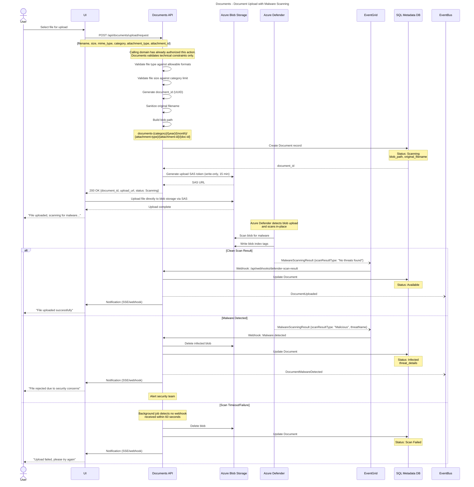
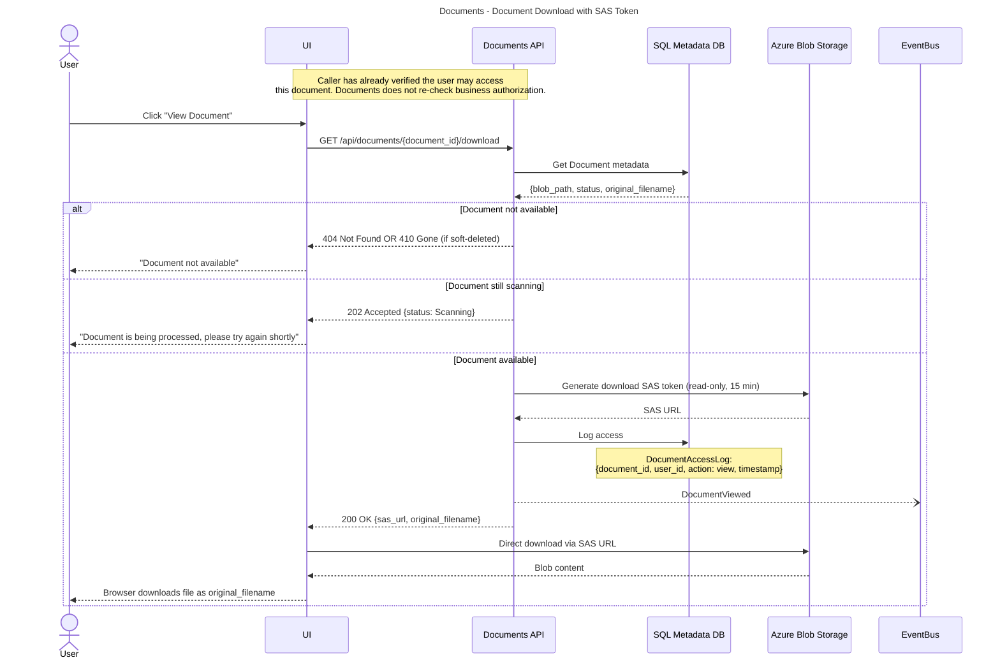
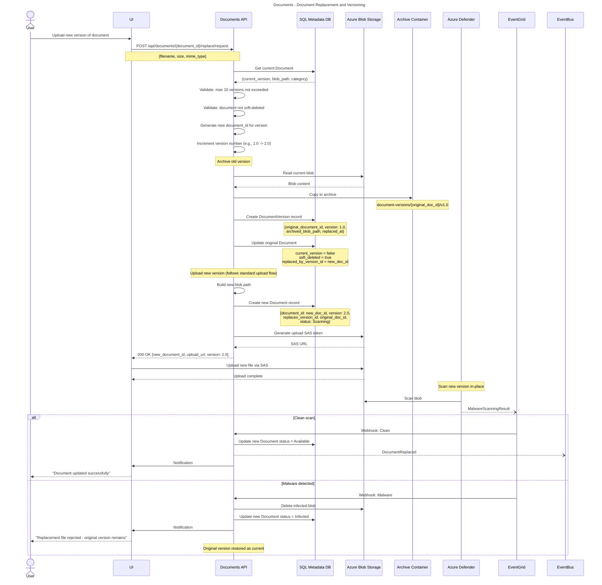
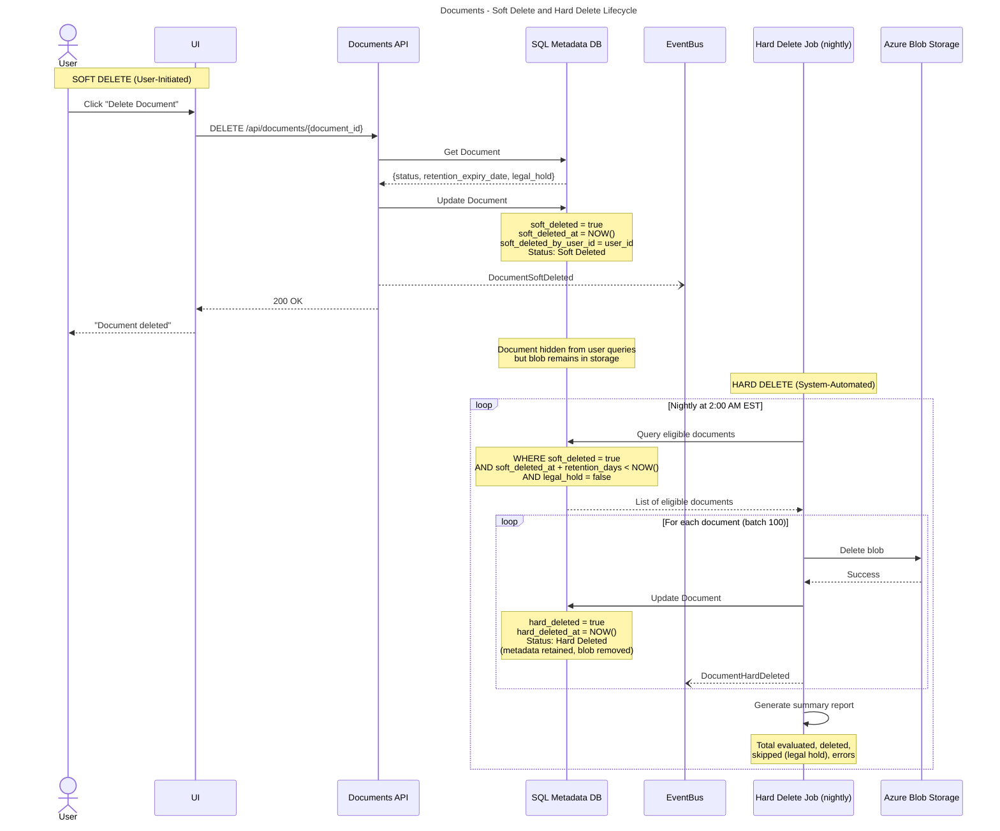
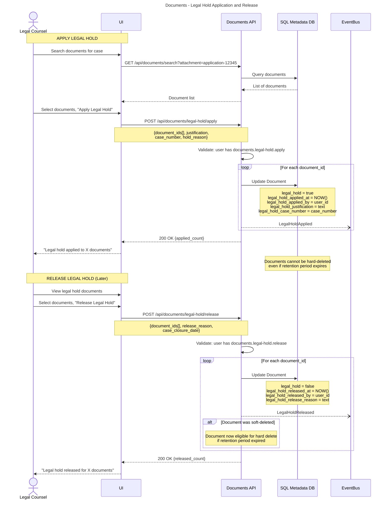
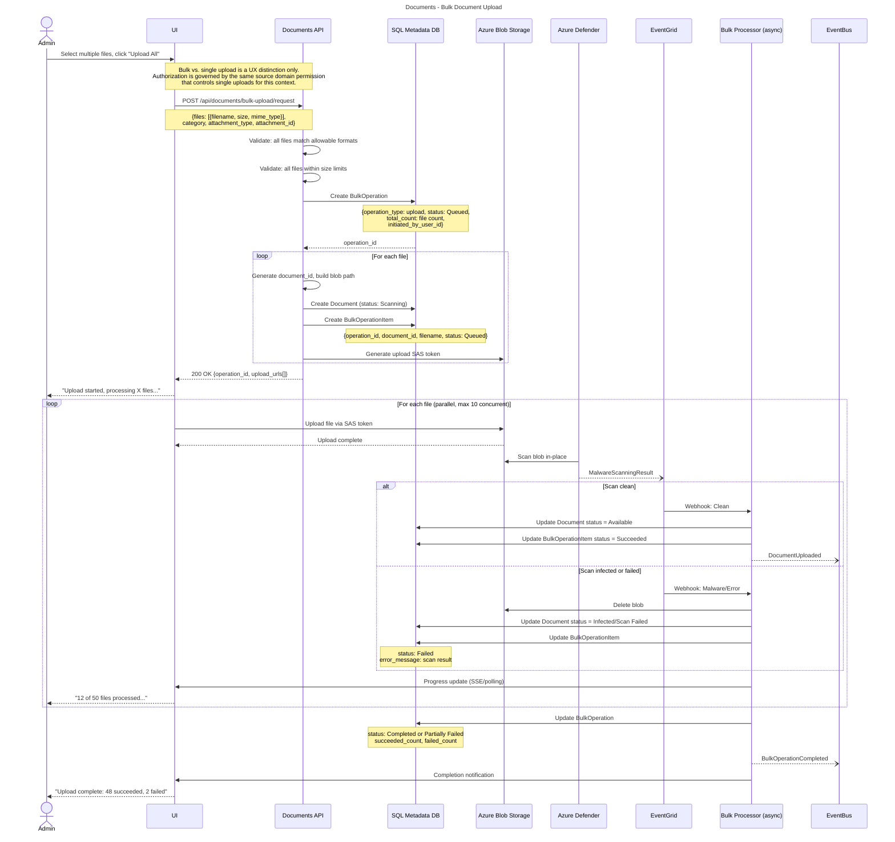
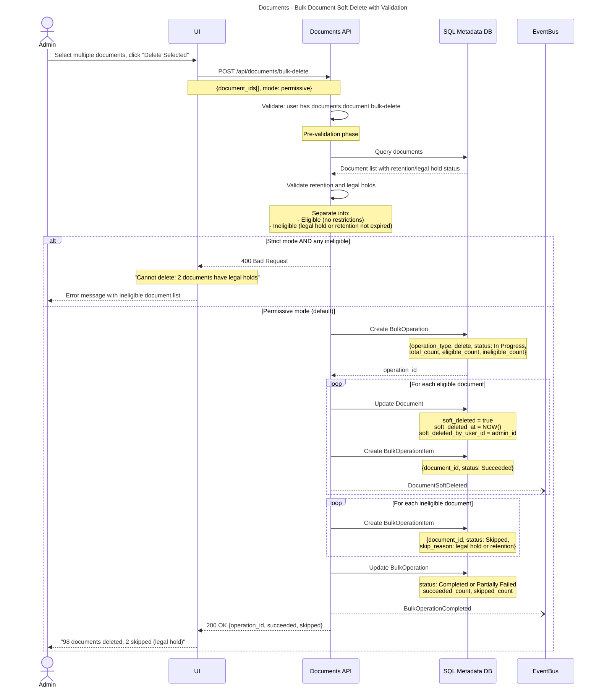
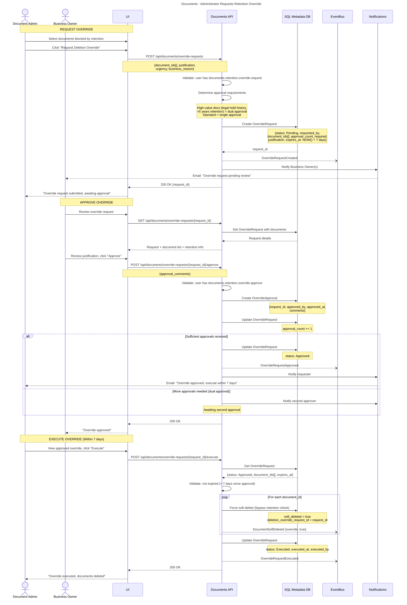
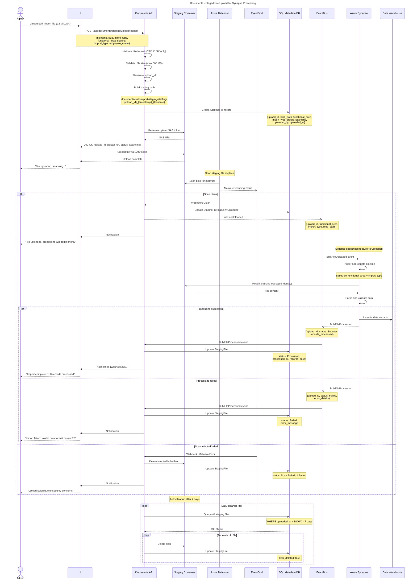

# Documents - Workflows & Sequences

This document contains sequence diagrams for business workflows in the Documents platform capability.

**Note:** For technical implementation details on malware scanning, blob storage access patterns, and Azure service integrations, see `documents-technical-arch.md`.

**Conventions:**
- Solid arrows (`->>`) = Synchronous calls
- Dashed arrows (`-->>`) = Responses
- Dotted arrows (`--)`) = Async/fire-and-forget
- **actor** = Human or external system
- **participant** = Internal service/component

---

## Integration Pattern: Domain API Calling Documents

**What:** A domain API authorizes an upload or download action, then delegates file mechanics to the Documents API  
**When:** Any time a domain feature requires a user to attach, retrieve, or manage a file  
**Who:** Any domain API acting on behalf of an authenticated user (Credentialing, Staffing, Professional Learning, EPP, Audit)
> **This is the canonical integration pattern for all upload and download flows.** The sequences that follow (single upload, bulk upload, staging upload, replacement) are Documents-internal views of what happens after this handoff. When building a domain feature that involves documents, this is the pattern to implement.

```mermaid
---
title: Documents - Integration Pattern: Domain API Calling Documents
---
sequenceDiagram
    actor User
    participant DomainUI as Domain UI (e.g. Credentialing)
    participant DomainAPI as Domain API (e.g. Credentialing API)
    participant DocsAPI as Documents API
    participant BlobStorage as Azure Blob Storage

    User->>DomainUI: Initiate upload (e.g. attach transcript to application)
    DomainUI->>DomainAPI: Request upload token
    Note over DomainUI,DomainAPI: Domain-specific request context

    DomainAPI->>DomainAPI: Validate: user has [domain permission]
    Note over DomainAPI: e.g. credentialing.application.submit<br/>This is the only authorization check for this upload.

    DomainAPI->>DocsAPI: POST /api/documents/upload/request
    Note over DomainAPI,DocsAPI: Authenticated service-to-service call (Managed Identity)<br/>{filename, size, mime_type, category, attachment_type, attachment_id}

    DocsAPI->>DocsAPI: Validate file type and size against category limits
    DocsAPI-->>DomainAPI: {document_id, upload_url}

    DomainAPI-->>DomainUI: {document_id, upload_url}
    DomainUI->>BlobStorage: Upload file via SAS token
```

**Key Decisions:**
- **Single authorization check:** The domain API is the only place business authorization is enforced. Documents trusts authenticated internal callers.
- **Service-to-service auth:** Domain APIs call Documents using Managed Identity. Documents does not accept direct unauthenticated calls from browsers.
- **Technical validation only:** Documents enforces file size, format, and category rules — not business rules about who may upload what.
- **Bulk vs. single is a UX concern only:** There is no separate permission for bulk uploads. If a user is authorized to upload a file for a given purpose, they are authorized to upload multiple files for that same purpose.

**Events Published:**
None — this diagram represents the handoff into Documents; see the per-flow sequences below for what Documents itself publishes.

**Error Scenarios:**
- Domain API authorization fails -> Domain API returns 403 to UI; Documents is never called
- File type not in category allowlist -> Documents returns 400 to domain API; domain API surfaces error to UI
- File size exceeds category limit -> Documents returns 400 to domain API; domain API surfaces error to UI
- Managed Identity auth failure -> Documents returns 401; domain API should alert on this as it indicates a misconfiguration, not a user error

---

## Document Upload with Malware Scanning

**What:** User uploads file, system scans for malware, stores if clean  
**When:** User needs to attach supporting document to credential application, PPR disclosure, or other context  
**Who:** Educator, District Staff, Administrator



**Key Decisions:**
- **Browser-based upload:** File uploaded directly from browser to blob storage via SAS token (no proxy through API)
- **Scan in-place:** Azure Defender scans blob in target container (no quarantine/copy required)
- **Async notification:** UI uses SSE or polling for scan result (don't block user during scan)
- **Timeout handling:** Background job marks as `Scan Failed` if no webhook received within 60 seconds

**State Changes:**
- Document status: `None` -> `Scanning` -> `Available` OR `Infected` OR `Scan Failed`

**Events Published:**
- `DocumentUploaded` - Scan clean, document available
- `DocumentMalwareDetected` - Malware found, security alert

**Error Scenarios:**
- Invalid file type -> 400 Bad Request, upload rejected before SAS generation
- File size exceeds limit -> 400 Bad Request
- Blob storage quota exceeded -> 503 Service Unavailable, alert admins
- Scan timeout (>60 seconds) -> Mark as `Scan Failed`, delete blob

---

## Document Download with SAS Token

**What:** User requests document, system generates time-limited access URL  
**When:** User views document from credential application, a filtered pending-items list view, or document library  
**Who:** Educator, District Staff, Administrator



**Key Decisions:**
- **Direct blob access:** UI downloads directly from blob storage using SAS token (no proxy through API)
- **Time-limited tokens:** 15-minute expiry prevents URL sharing
- **Access logging:** All views logged for compliance audit
- **Status check:** Prevent download while still scanning

**Events Published:**
- `DocumentViewed` - Track document access for analytics

**Error Scenarios:**
- Document soft-deleted -> 410 Gone
- Document still scanning -> 202 Accepted (try again)
- SAS token expired -> UI requests new token

---

## Document Replacement and Versioning

**What:** User replaces existing document, old version archived  
**When:** User uploads wrong file or needs to update supporting document  
**Who:** Educator (own documents), Administrator (any document in scope)



**Key Decisions:**
- **New document ID for new version:** Each version is a separate Document record
- **Archive old version:** Old blob moved to archive container, not deleted
- **Version numbering:** Incremental (1.0, 2.0, 3.0) for simplicity
- **Malware scan new version:** Replacement goes through full scan-in-place workflow
- **Rollback on failure:** If new version fails scan, old version remains current

**State Changes:**
- Original Document: `Available` -> `Soft Deleted` (current_version = false)
- New Document: `None` -> `Scanning` -> `Available` OR `Infected`

**Events Published:**
- `DocumentReplaced` - Includes old and new document IDs (only if new version scan clean)

**Error Scenarios:**
- Max 10 versions exceeded -> 400 Bad Request "Maximum versions reached"
- Document soft-deleted -> 400 Bad Request "Restore document before replacing"
- New file infected -> Upload fails, old version remains current

---

## Soft Delete and Hard Delete Lifecycle

**What:** User deletes document, system soft-deletes immediately, hard-deletes after retention period  
**When:** User removes incorrect upload or document no longer needed  
**Who:** Educator (own documents), Administrator (any document in scope)



**Key Decisions:**
- **Soft delete is immediate:** User action hides document instantly
- **Hard delete is automated:** No user permission to force hard delete
- **Metadata preserved:** Even after hard delete, metadata remains for audit

**State Changes:**
- Document status: `Available` -> `Soft Deleted` (user action) -> `Hard Deleted` (job)

**Events Published:**
- `DocumentSoftDeleted` - User deletes document
- `DocumentHardDeleted` - Blob permanently removed (nightly job)

**Error Scenarios:**
- User tries to delete document with legal hold -> 403 Forbidden "Document has active legal hold"
- Hard delete blob fails -> Retry next night (max 3 attempts), alert admin after 3 failures

---

## Legal Hold Application and Release

**What:** Administrator applies legal hold preventing deletion, later releases after legal matter concludes  
**When:** Litigation, investigation, or audit requires document preservation  
**Who:** Legal Counsel, Compliance Officer



**Key Decisions:**
- **Legal hold overrides retention:** Documents with hold cannot be hard-deleted regardless of age
- **Justification required:** Must include case number and reason for audit trail
- **Release doesn't delete:** Releasing hold allows retention policy to resume, but doesn't immediately delete

**Events Published:**
- `LegalHoldApplied` - Per document, includes case number
- `LegalHoldReleased` - Per document, includes release reason

**Error Scenarios:**
- Non-legal user attempts hold -> 403 Forbidden
- Release without justification -> 400 Bad Request "Release reason required"

---

## Bulk Document Upload

**What:** Administrator uploads multiple files simultaneously, system processes batch with malware scanning  
**When:** District uploads employee roster CSV, EPP uploads candidate tracking file, Sponsor uploads attendee list  
**Who:** District Admin, EPP Admin, Professional Learning Sponsor



**Key Decisions:**
- **Browser-based bulk upload:** Each file gets its own SAS token, uploaded directly from browser
- **Scan in-place:** Files scanned in target containers (no quarantine)
- **Parallel uploads:** Max 10 concurrent to avoid overwhelming scan service (2,000 files/min limit)
- **Individual item tracking:** Each file has success/failure status
- **Partial success allowed:** Some files can fail without failing entire operation

**State Changes:**
- BulkOperation status: `Queued` -> `In Progress` -> `Completed` OR `Partially Failed`
- BulkOperationItem status: `Queued` -> `Succeeded` OR `Failed`

**Events Published:**
- `DocumentUploaded` - Per successfully uploaded file
- `BulkOperationCompleted` - Summary of entire operation

**Error Scenarios:**
- Malware detected in 1 file -> That file fails, others continue
- All files fail scan -> Operation status `Failed`
- User cancels mid-upload -> Operation status `Cancelled`, uploaded files remain

---

## Bulk Document Soft Delete with Validation

**What:** Administrator marks multiple documents for soft delete, system validates retention policies  
**When:** Cleanup of obsolete documents, removing test data, or bulk document management  
**Who:** Document Administrator, District Admin (scoped to their documents)



**Key Decisions:**
- **Pre-validation required:** Check all retention/legal hold before starting
- **Permissive mode default:** Skip ineligible documents, delete eligible ones
- **Strict mode optional:** Admin can require all-or-nothing deletion

**Events Published:**
- `DocumentSoftDeleted` - Per successfully deleted document
- `BulkOperationCompleted` - Summary with skipped count

**Error Scenarios:**
- All documents have legal holds -> Operation status `Failed` (0 succeeded)
- User lacks scope permission -> 403 Forbidden
- Strict mode with ineligible docs -> 400 Bad Request, operation blocked

---

## Administrator Requests Retention Override

**What:** Admin requests exception to retention policy, business owner approves  
**When:** Need to delete documents before retention expiry (e.g., GDPR request, legal mandate, storage emergency)  
**Who:** Document Administrator (requestor), Business Owner (approver)



**Key Decisions:**
- **Dual approval for high-value:** Documents with legal hold history or >5 year retention require 2 approvals
- **7-day execution window:** Approved overrides expire if not executed within 7 days
- **Justification mandatory:** All overrides require business reason for audit trail
- **Cannot be reversed:** Once executed, deletion is permanent (standard retention applies to hard delete)

**State Changes:**
- OverrideRequest: `Pending` -> `Approved` -> `Executed`
- Documents: Bypass retention, immediate soft delete eligibility

**Events Published:**
- `OverrideRequestCreated` - Admin submits request
- `OverrideRequestApproved` - Business owner approves
- `OverrideRequestExecuted` - Admin executes deletion
- `DocumentSoftDeleted` - Per document, flagged as override deletion

**Error Scenarios:**
- Override expired (>7 days) -> 400 Bad Request "Override expired, request new approval"
- Insufficient approvals -> 403 Forbidden "Awaiting second approval"
- Request already executed -> 409 Conflict "Override already executed"
- Approver is same as requester -> 403 Forbidden "Cannot approve own request"

---

## Staged File Upload for Synapse Processing

**What:** User uploads bulk import file to staging area, Synapse pipeline processes  
**When:** District uploads employee roster CSV, EPP uploads candidate enrollment file  
**Who:** District Admin, EPP Admin



**Key Decisions:**
- **All staging files scanned:** No exceptions for "trusted internal sources"
- **Browser-based upload:** File uploaded via SAS token directly to staging container
- **Scan in-place:** Defender scans staging files where they sit
- **Event-driven decoupling:** Documents domain doesn't know about Synapse pipelines
- **Synapse reads directly:** Synapse uses Managed Identity to access staging containers
- **Auto-cleanup:** Files deleted after 7 days regardless of processing status

**State Changes:**
- StagingFile status: `Scanning` -> `Uploaded` -> `Processed` OR `Failed`

**Events Published:**
- `BulkFileUploaded` - File scanned clean, ready for processing
- `BulkFileProcessed` - Synapse publishes after processing (consumed by Documents)

**Error Scenarios:**
- Invalid file format -> 400 Bad Request before upload
- Malware detected -> File deleted, status `Infected`
- Synapse pipeline failure -> Status `Failed`, file remains for retry
- Synapse timeout (>30 min) -> Alert admins, file remains for manual investigation
