```mermaid
---
title: EPP ERD
---
erDiagram
    EDUCATOR_PREPARATION_PROVIDERS ||--o{ APPROVED_CERTIFICATE_CATEGORIES : "offers"
    EDUCATOR_PREPARATION_PROVIDERS ||--o{ APPROVED_ENDORSEMENTS : "approves"
    EDUCATOR_PREPARATION_PROVIDERS ||--o{ EPP_CONTACTS : "has"
    EDUCATOR_PREPARATION_PROVIDERS ||--o{ CANDIDATE_ENROLLMENTS : "enrolls"
    EDUCATOR_PREPARATION_PROVIDERS ||--o{ CREDENTIAL_APPLICATION_REVIEWS : "reviews"
    EDUCATOR_PREPARATION_PROVIDERS ||--o{ APPROVAL_APPLICATION_REVIEWS : "reviews"
    
    CANDIDATE_ENROLLMENTS ||--o{ ENROLLMENT_PROGRAMS : "pursues"
    CANDIDATE_ENROLLMENTS ||--o{ ENROLLMENT_STATUS_HISTORY : "tracks"
    
    CREDENTIAL_APPLICATION_REVIEWS ||--o{ RECOMMENDED_ENDORSEMENTS : "recommends"
    CREDENTIAL_APPLICATION_REVIEWS ||--o{ APPLICATION_REMARKS : "contains"
    
    BULK_UPLOAD_JOBS ||--o{ CANDIDATE_ENROLLMENTS : "creates"
    
    EDUCATOR_PREPARATION_PROVIDERS {
        string epp_code PK "Organization code from EEM"
        string epp_type "Public|Independent|EducatorAssociation|State"
        string status "Active|Closed"
        boolean reading_diagnostics
        boolean special_ed_director
        datetime created_at
        uuid created_by FK
        datetime modified_at
        uuid modified_by FK
    }
    
    EPP_CONTACTS {
        uuid contact_id PK
        string epp_code FK
        string contact_name
        string contact_email
        string contact_phone
        boolean is_primary
        datetime created_at
    }
    
    APPROVED_CERTIFICATE_CATEGORIES {
        uuid category_id PK
        string epp_code FK
        string certificate_type "Teacher|CTE|SchoolAdministrator|..."
        string pathway "Traditional|Alternative|TeacherLeader|..."
        date mde_approval_date
        date enrollment_close_date "Pro Prep visibility cutoff"
        date recommend_close_date "MiEdWorkforce cutoff"
        datetime created_at
        uuid created_by FK
        datetime modified_at
        uuid modified_by FK
    }
    
    APPROVED_ENDORSEMENTS {
        uuid endorsement_id PK
        string epp_code FK
        string endorsement_code "Reference to endorsement definition"
        string certificate_type FK
        string grade_band_low "B|PreK|K|1-12"
        string grade_band_high "B|PreK|K|1-12"
        string endorsement_type "InitialCertification|AdditionalEndorsement"
        date mde_approval_date
        date enrollment_close_date
        date recommend_close_date
        datetime created_at
        uuid created_by FK
        datetime modified_at
        uuid modified_by FK
    }
    
    CANDIDATE_ENROLLMENTS {
        uuid enrollment_id PK
        string candidate_unique_id FK "Mi-Key Unique ID"
        string epp_code FK
        string student_id "EPP-specific identifier"
        string status "PendingVerification|Enrolled|StudentTeaching|PostStudentTeaching|Placed|Inactive|Rejected|Exited"
        date enrollment_date "NULL if status=PendingVerification or Rejected"
        string program_level "Teacher|CTE|SchoolAdministrator|..."
        string program_type "Traditional|Alternative|... (NULL for non-Teacher/Admin)"
        date exit_date "NULL if not exited"
        string exit_reason "NULL if not exited"
        datetime created_at
        uuid created_by FK
        datetime modified_at
        uuid modified_by FK
    }
    
    ENROLLMENT_PROGRAMS {
        uuid program_id PK
        uuid enrollment_id FK
        string program "General Ed|Special Ed|CTE program name"
        string grade_band_low
        string grade_band_high
        datetime confirmed_at "NULL if not confirmed"
        datetime created_at
        uuid created_by FK
    }
    
    ENROLLMENT_STATUS_HISTORY {
        uuid history_id PK
        uuid enrollment_id FK
        string status "Status value at this point in time"
        datetime effective_from
        datetime effective_to "NULL for current status"
        uuid changed_by FK
    }
    
    CREDENTIAL_APPLICATION_REVIEWS {
        uuid review_id PK
        uuid application_id FK "Reference to credentialing domain"
        string epp_code FK
        string status "Submitted|Hold|Denied|Cancelled|Recommended"
        datetime submitted_at
        datetime reviewed_at "NULL if not yet reviewed"
        uuid reviewed_by FK "NULL if not yet reviewed"
        datetime created_at
        datetime modified_at
        uuid modified_by FK
    }
    
    RECOMMENDED_ENDORSEMENTS {
        uuid recommendation_id PK
        uuid review_id FK
        string endorsement_code
        string grade_band_low
        string grade_band_high
        datetime recommended_at
    }
    
    APPLICATION_REMARKS {
        uuid remark_id PK
        uuid review_id FK
        string remark_type "External|Internal"
        string remark_text
        datetime created_at
        uuid created_by FK
    }
    
    APPROVAL_APPLICATION_REVIEWS {
        uuid review_id PK
        uuid application_id FK "Reference to credentialing domain approval app"
        string epp_code FK
        string status "Submitted|Recommended|Denied"
        string remarks "NULL if recommended without remarks"
        datetime submitted_at
        datetime reviewed_at "NULL if not yet reviewed"
        uuid reviewed_by FK
        datetime created_at
        datetime modified_at
        uuid modified_by FK
    }
    
    BULK_UPLOAD_JOBS {
        uuid job_id PK
        string epp_code FK
        string file_name
        string status "Pending|Processing|Success|PartialSuccess|Failed"
        int total_records
        int processed_records
        int error_records
        string error_report_url "NULL if no errors"
        datetime uploaded_at
        uuid uploaded_by FK
        datetime completed_at "NULL if still processing"
    }
```

# Educator Preparation Provider (EPP)

- **Type:** Core Domain
- **Identifier:** epp
- **Primary Sources:** BRD 13 (Admin), BRD 25.1/25.3 (Worklist/Recommendation), BRD 25.2/25.4 (Candidate Tracking)

---

## Purpose

The EPP domain manages the relationship between Educator Preparation Providers (universities, colleges, and alternative route programs) and the candidates they prepare for educator certification. It owns:

- EPP provider registration and program approval
- Candidate enrollment verification and tracking through preparation programs
- EPP recommendation/approval of candidates for state credentialing
- Oversight of EPP program offerings (certificate types, pathways, endorsements)

This domain bridges the gap between educator preparation (happening at institutions) and state credentialing (owned by the `credentialing` domain), ensuring only qualified candidates from approved programs receive EPP recommendations that enable credential issuance.

---

## Scope

**This domain owns:**
- EPP designation for EEM organizations (linking organizations to EPP capabilities)
- EPP-specific metadata (type, contacts, flags)
- EPP program definitions (certificate types, pathways, endorsements offered by each EPP)
- EPP program approval dates and visibility rules
- Candidate enrollment records (enrollment verification, status tracking, program assignments)
- EPP credential application reviews and recommendations
- EPP approval application reviews (for alternative certification routes)

**This domain does NOT own:**
- Educator credential issuance or lifecycle management > owned by `credentialing`
- MTTC test score data (consumed from external integration) > owned by `credentialing` (interface owner)
- Actual credential applications (structure, requirements, payment) > owned by `credentialing`
- User authentication > owned by `iam`
- Email template management > owned by `communications`
- Document storage > owned by `documents`
- Payment processing > owned by `payments`
- Professional practice clearances > owned by `profpractice`
- Core organization data (name, address, federal codes) > owned by `org-reference-data`, sourced from EEM
- Organization hierarchy (EEM data) > owned by `org-reference-data`

---

## Ubiquitous Language

| Term                                     | Definition                                                                                                                                                                                                                                                                         |
| ---------------------------------------- | ---------------------------------------------------------------------------------------------------------------------------------------------------------------------------------------------------------------------------------------------------------------------------------- |
| **Education Preparation Provider (EPP)** | An institution or organization approved by the state to prepare educator candidates for certification. Types include Public, Independent, Educator Association, and State. EPPs can offer Traditional Route, Alternative Route, or other specialized pathways.                     |
| **Candidate**                            | An individual enrolled in an EPP program working toward educator certification. Also called "student" in some BRD contexts. Tracked from enrollment through program completion.                                                                                                    |
| **Program Level**                        | The credential category an EPP is approved to prepare candidates for: Teacher, CTE, School Administrator, School Counselor, School Psychologist, School Social Worker.                                                                                                             |
| **Program Type**                         | Specific preparation pathway within a Program Level. Only applicable for Teacher and School Administrator levels. Examples: Traditional Route, Alternative Route, Teacher Leader, Administrator Enhancement.                                                                       |
| **Pathway**                              | Synonymous with Program Type in some contexts. The route a candidate takes through preparation (Traditional, Alternative, Experience-Based, etc.).                                                                                                                                 |
| **Enrollment Verification**              | The EPP process of confirming a candidate's enrollment in their program. Candidates submit enrollment information; EPP must Accept or Reject.                                                                                                                                      |
| **Candidate Status**                     | Lifecycle state of enrollment: Pending Verification, Enrolled, Student Teaching (Trad), Post Student Teaching (Trad), Placed (Alt), Inactive, Rejected, Exited.                                                                                                                    |
| **EPP Recommendation**                   | EPP's formal approval of a candidate's credential application, asserting the candidate has met program requirements and is ready for state credentialing.                                                                                                                          |
| **Credential Application Worklist**      | Stakeholder term for the filtered/sorted view of credential applications requiring EPP review/action (Hold, Deny, Cancel, Recommend), surfaced via `CredentialApplicationReview`'s own list endpoint. Filterable by license type and approval type; not a separate domain concept. |
| **Approval Application**                 | Alternative certification route application requiring EPP recommendation before ISD/school district placement. Distinct workflow from standard credential applications.                                                                                                            |
| **Endorsement**                          | Subject area or specialty within a certificate type. EPPs are approved to offer specific endorsements. Candidates pursue endorsements as part of their program.                                                                                                                    |
| **MTTC**                                 | Michigan Test for Teacher Certification. Assessment results used by EPPs to validate candidate readiness for endorsement recommendation.                                                                                                                                           |
| **FICE Code**                            | Federal Interagency Committee on Education code. Unique identifier for EPP institutions.                                                                                                                                                                                           |
| **Pro Prep**                             | Public-facing catalog of EPP programs and offerings. Allows prospective educators to search approved programs.                                                                                                                                                                     |
| **Student ID**                           | EPP-specific identifier assigned to candidates by the institution.                                                                                                                                                                                                                 |
| **Alternative Pass**                     | Non-standard pathway to meet assessment requirements for teacher certification. Surfaced as a filter option on the Teacher credential application list, not tracked via a separate mechanism.                                                                                      |

---

## Domain Model

### Core Aggregates

#### EducatorPreparationProvider

**Root Entity:** EducatorPreparationProvider

**Purpose:** Represents an EEM organization that has been designated as an educator preparation provider. Links to read-only EEM organization data and manages EPP-specific program approvals and metadata.

**Entities & Value Objects:**
- **EducatorPreparationProvider** (root) - EPP designation and program approval data
- **OrganizationReference (value object)** - Immutable reference to EEM organization (FICE code, organization code)
- **EPPType (value object)** - Public, Independent, Educator Association, State
- **EPPContact (entity)** - EPP-specific contact person for coordination (separate from EEM contact data)
- **ApprovedCertificateCategory (entity)** - Certificate type/pathway approval with dates
- **ApprovedEndorsement (entity)** - Specific endorsements EPP can offer, by certificate type
- **ReadingDiagnosticsFlag (value object)** - Whether EPP offers Reading Diagnostics
- **SpecialEdDirectorFlag (value object)** - Whether EPP offers Special Ed Director/Supervisor

**Key Invariants:**
- EPP must reference a valid EEM organization that exists in org-reference-data
- An EPP must have at least one approved certificate category to be active
- Endorsements can only be approved for certificate types the EPP is authorized to offer
- MDE Approval Date must precede Enrollment Close Date and Recommend Close Date
- An EPP in Closed status cannot have active candidate enrollments
- Core organization data (name, address, federal code) is read-only, sourced from EEM

**Data Sourced from EEM (Read-Only):**
- Organization name
- Organization address
- Federal code
- Organization hierarchy relationships

**Data Managed in MiEdWorkforce:**
- EPP Type designation
- EPP-specific contacts (coordinators)
- Certificate category approvals (with MDE, enrollment close, recommend close dates)
- Approved endorsements by certificate type
- Reading Diagnostics and Special Ed Director flags
- Pro Prep catalog visibility settings
- Active/Closed status

**Referenced In:**
- Sequence: Add/Edit EPP Provider
- Sequence: EPP Program Approval Management

---

#### CandidateEnrollment

**Root Entity:** CandidateEnrollment

**Purpose:** Tracks a candidate's journey through an EPP program from initial enrollment submission through program completion or exit.

**Entities & Value Objects:**
- **CandidateEnrollment** (root) - Enrollment lifecycle record
- **EnrollmentProgram** (entity) - Specific program/endorsement the candidate is pursuing (can have multiple)
- **EnrollmentStatus** (value object) - Current state with effective dates
- **StudentID** (value object) - EPP-specific identifier
- **ExitInformation** (value object) - Exit date and reason (when status is Exited)

**Key Invariants:**
- A candidate must have at least one Program associated when status is Student Teaching (Trad) or Placed (Alt)
- Cannot add duplicate programs (same Program + Grade Band combination)
- Enrollment Start Date required for status transition from Rejected to Enrolled
- Candidate can have enrollments at multiple EPPs simultaneously
- Status transitions must follow valid state machine (defined separately per EPP type: Traditional vs Alternative)

**Key States:** Pending Verification, Enrolled, Student Teaching (Trad), Post Student Teaching (Trad), Placed (Alt), Inactive, Rejected, Exited

**Referenced In:**
- Sequence: Candidate Enrollment Verification
- Sequence: Candidate Status Update
- Sequence: Candidate Program Management

---

#### CredentialApplicationReview

**Root Entity:** CredentialApplicationReview

**Purpose:** Represents an EPP's review and recommendation process for a candidate's credential application. Links EPP domain to Credentialing domain.

**Entities & Value Objects:**
- **CredentialApplicationReview** (root) - Review record for a specific application
- **RecommendedEndorsement** (entity) - Endorsements EPP recommends for the credential
- **ApplicationRemark** (value object) - External remarks sent to applicant
- **InternalRemark** (value object) - Internal EPP notes (not visible to applicant)
- **ReviewAction** (value object) - Action taken: Hold, Deny, Cancel, Recommend
- **MTTCValidation** (value object) - Test results used in recommendation decision

**Key Invariants:**
- At least one endorsement must be recommended when action is Recommend
- Recommended endorsements must match EPP's approved endorsement list
- Cannot recommend an application that has a Conviction flag without manual review
- Application cannot be recommended without validating MTTC pass status for applicable endorsements
- Application Remarks required when action is Deny or Hold
- Once Recommended, application moves to Pending Payment (in-state) or is routed to OEE/State Credential Admin for review (out-of-state)

**Key States:** Submitted, Hold, Denied, Cancelled, Pending Payment, Recommended, Approved (final state set by Credentialing domain)

**Referenced In:**
- Sequence: EPP Credential Application Review
- Sequence: EPP Recommendation Submission

---

#### ApprovalApplicationReview

**Root Entity:** ApprovalApplicationReview

**Purpose:** Represents EPP review of alternative route approval applications (temporary permits, alternative certifications). Distinct workflow from standard credential applications.

**Entities & Value Objects:**
- **ApprovalApplicationReview** (root) - Review record for approval application
- **ApprovalCategory** (value object) - Type of approval: Teacher, Administrator, Other, Out-of-State Special Ed Admin, Out-of-State School Social Worker, Permit
- **ApprovalType** (value object) - Specific approval type within category
- **ApplicationAcknowledgements** (value object) - Applicant attestations
- **ProfessionalPracticeAnswers** (value object) - Disclosure responses from applicant
- **ReviewRemark** (value object) - Required remarks when denying, optional when recommending

**Key Invariants:**
- Denial requires Remarks to be provided
- Conviction flag requires manual EPP review before recommendation
- Recommended approvals return to the ISD/School District for further action, not directly to state approval
- Approval Type must be valid for the selected Approval Category

**Key States:** Submitted, Recommended by EPP, Denied, Approved (final state set by Credentialing domain)

**Referenced In:**
- Sequence: EPP Approval Application Review

---

#### Worklist / Pending-Items Views (not a separate aggregate)

What stakeholders call the EPP "worklist" is a filtered, sorted, searchable view over `CredentialApplicationReview` and `ApprovalApplicationReview` records that already exist in this domain — surfaced through those aggregates' own list endpoints (see "Search Credential Applications for Review" and "Search Approval Applications for Review" in `epp-sequences.md`). It is not a separate aggregate, and access is governed entirely by this domain's existing permissions (`epp.applications.view`, `epp.approvals.view`), scoped to the user's EPP — there is no distinct worklist permission or platform capability. Valid filters (certificate type, status, Alternative Pass for Teacher, etc.) are limited to fields these aggregates already carry.

See Open Question below regarding FDD evidence of a possible per-user worklist assignment capability that may exceed this pattern.

---

## Domain Events

Events published by this domain that other domains may subscribe to:

| Event                              | Aggregate                   | Trigger                                   | Payload Highlights                                                        | Consumers                                                                                                    |
| ---------------------------------- | --------------------------- | ----------------------------------------- | ------------------------------------------------------------------------- | ------------------------------------------------------------------------------------------------------------ |
| `CandidateEnrollmentVerified`      | CandidateEnrollment         | EPP accepts enrollment                    | `{ candidateId, eppCode, programLevel, programType, enrollmentDate }`     | credentialing (may validate EPP enrollment for application eligibility)                                      |
| `CandidateEnrollmentRejected`      | CandidateEnrollment         | EPP rejects enrollment                    | `{ candidateId, eppCode, rejectionDate }`                                 | communications (notification trigger)                                                                        |
| `CandidateStatusChanged`           | CandidateEnrollment         | Status update by EPP                      | `{ candidateId, eppCode, oldStatus, newStatus, effectiveDate }`           | None currently (internal tracking)                                                                           |
| `CandidateExited`                  | CandidateEnrollment         | Status changed to Exited                  | `{ candidateId, eppCode, exitDate, exitReason }`                          | credentialing (may affect application eligibility)                                                           |
| `CredentialApplicationRecommended` | CredentialApplicationReview | EPP recommends application                | `{ applicationId, eppCode, recommendedEndorsements, recommendationDate }` | credentialing (triggers payment or OEE review), communications (notification)                                |
| `CredentialApplicationDenied`      | CredentialApplicationReview | EPP denies application                    | `{ applicationId, eppCode, denialDate, remarks }`                         | credentialing (status update), communications (notification)                                                 |
| `CredentialApplicationOnHold`      | CredentialApplicationReview | EPP places on hold                        | `{ applicationId, eppCode, holdDate, remarks }`                           | communications (notification)                                                                                |
| `ApprovalApplicationRecommended`   | ApprovalApplicationReview   | EPP recommends approval app               | `{ approvalApplicationId, eppCode, recommendationDate, remarks }`         | credentialing (returns application to ISD/School District for further action), communications (notification) |
| `ApprovalApplicationDenied`        | ApprovalApplicationReview   | EPP denies approval app                   | `{ approvalApplicationId, eppCode, denialDate, remarks }`                 | credentialing (returns application to ISD/School District for further action), communications (notification) |
| `EPPProviderCreated`               | EducatorPreparationProvider | New EPP added                             | `{ eppCode, name, eppType, approvedPrograms }`                            | org-reference-data (potential sync)                                                                          |
| `EPPProviderModified`              | EducatorPreparationProvider | EPP details updated                       | `{ eppCode, modifiedFields }`                                             | org-reference-data (potential sync)                                                                          |
| `EPPProgramApprovalChanged`        | EducatorPreparationProvider | Certificate/endorsement approval modified | `{ eppCode, certificateType, endorsement, approvalDates }`                | None currently (may affect Pro Prep catalog availability)                                                    |

---

---

## Dependencies

### Upstream (We Consume From)

| Source                 | What We Need                                      | How We Get It                                                                | Notes                                                               |
| ---------------------- | ------------------------------------------------- | ---------------------------------------------------------------------------- | ------------------------------------------------------------------- |
| **iam**                | User authorization, permissions check             | API call: `/permissions/check`                                               | Verify EPP user has access to specific institutions       |
| **iam**                | User identity (educator profile link)             | API call: `/users/{id}` or `/users/by-unique-id/{uniqueId}`                  | Link candidate enrollments to MiEdWorkforce user accounts           |
| **credentialing**      | Credential application details                    | API call: `/applications/{id}`                                               | Retrieve application data for EPP review                  |
| **credentialing**      | Educator credential summary                       | API call: `/educators/{educatorId}/credentials`                              | Display credential history in candidate profile                     |
| **credentialing**      | MTTC test results                                 | Data retrieved via credentialing's MTTC interface                            | Validate test pass status when recommending endorsements            |
| **org-reference-data** | Organization master data and hierarchy (EEM data) | Local replica sync via Synapse Pipeline                                      | Validate EPP institution codes, link to EEM organization structure  |
| **communications**     | Email template rendering                          | Event subscription: EPP domain publishes events, Communications sends emails | Enrollment verification notifications, recommendation confirmations |
| **documents**          | Document upload/retrieval                         | API call: `/documents/upload/request`, `/documents/{id}/download`            | Candidate supporting documents, EPP program documentation           |

### Downstream (Others Consume From Us)

| Consumer           | What They Need                    | How They Get It                                                                                            | Notes                                                                           |
| ------------------ | --------------------------------- | ---------------------------------------------------------------------------------------------------------- | ------------------------------------------------------------------------------- |
| **credentialing**  | EPP recommendation status         | Event subscription: `CredentialApplicationRecommended`, `CredentialApplicationDenied`                      | Triggers next step in credential application workflow (payment or OEE review)   |
| **credentialing**  | Candidate enrollment verification | API call: `GET /candidates/{candidateId}/enrollment-status` (internal-service, mTLS; see `epp-api.yml`)   | Validate candidate is enrolled in approved program before accepting application; consumed by `credentialing-sequences.md`'s "Submit New Certificate Application" and "Submit Permit Application" sequences |
| **communications** | Enrollment status changes         | Event subscription: `CandidateEnrollmentVerified`, `CandidateEnrollmentRejected`, `CandidateStatusChanged` | Trigger candidate notifications                                                 |
| **communications** | Application recommendation events | Event subscription: `CredentialApplicationRecommended`, `ApprovalApplicationRecommended`                   | Notify applicants and downstream reviewers                                      |
| **profpractice**   | Conviction flag data              | Indirectly via credentialing application                                                                   | EPP reviews conviction disclosures as part of recommendation decision           |

---

## Business Rules

### EPP Must Reference Valid EEM Organization

**Rule:** An EPP can only be created for an organization that exists in the org-reference-data (synced from EEM). Core organization attributes cannot be modified in MiEdWorkforce.

**Rationale:** EEM is the authoritative source for organization master data. EPP is an overlay designation, not a standalone entity.

**Enforced By:** EducatorPreparationProvider aggregate during creation and validation.

**Example:** Admin attempts to designate "University of Michigan" as an EPP. System validates organization code exists in org-reference-data before allowing EPP-specific configuration. Admin cannot change university name or address - those must be updated in EEM and will sync automatically.

---

### EPP Recommendation Requires MTTC Pass

**Rule:** An EPP cannot recommend an endorsement on a credential application unless the candidate has passed the corresponding MTTC test.

**Rationale:** State policy requires assessment validation before EPP recommendation for endorsement issuance.

**Enforced By:** CredentialApplicationReview aggregate during Recommend action validation.

**Example:** Candidate applies for Elementary Education endorsement. EPP reviews application and sees MTTC Elementary Education test status is "Not Passed". System prevents recommendation until test is passed or alternative pathway is documented.

---

### Candidate Program Assignment Required for Placement Status

**Rule:** A candidate cannot transition to Student Teaching (Trad) or Placed (Alt) status without at least one assigned program (Program Level + Grade Band).

**Rationale:** Placement statuses indicate active teaching practice in a specific program area. System must track which program the candidate is completing.

**Enforced By:** CandidateEnrollment aggregate during status update validation.

**Example:** EPP attempts to mark candidate as "Student Teaching (Trad)" but no program is assigned. System displays error: "At least one General/Special Education or CTE Program is required for this status."

---

### Duplicate Program Prevention

**Rule:** A candidate cannot have duplicate programs within a single enrollment (same Program + Grade Band combination).

**Rationale:** Prevents data entry errors and maintains data integrity. Each program/grade band combination should appear once per enrollment.

**Enforced By:** CandidateEnrollment aggregate when adding or confirming programs.

**Example:** Candidate has "Elementary Education - K-5" program already assigned. EPP attempts to add "Elementary Education - K-5" again. System blocks with error message.

---

### EPP Program Approval Scope

**Rule:** An EPP can only recommend endorsements that are included in their approved endorsement list for the applicable certificate type.

**Rationale:** EPPs are authorized by the state to prepare candidates only for specific programs. Recommendations outside scope are invalid.

**Enforced By:** CredentialApplicationReview aggregate during endorsement selection.

**Example:** EPP is approved for Teacher - Traditional Route with Elementary Education and Special Education endorsements. EPP attempts to recommend Secondary Mathematics endorsement. System prevents recommendation as it's not in EPP's approved list.

---

### Conviction Flag Manual Review

**Rule:** Credential applications and approval applications with "Has Conviction" flag set to true require manual EPP review before recommendation. System highlights these records in red in the application list view.

**Rationale:** Professional practice concerns must be reviewed by EPP before state recommendation. Automated approval is inappropriate.

**Enforced By:** EPP application list display logic and review workflow guidance (not a hard system block, but prominent UI indicator).

**Example:** Candidate with prior conviction submits credential application. EPP's application list displays the record in red font. EPP coordinator manually reviews conviction details and professional practice responses before deciding whether to recommend or deny.

**Confirmed by FDD 25.1/25.3 (Worklist and Recommendation):** both the standard credential worklist and the Approval worklist describe "Has Conviction" purely as a red-font UI indicator on the search-results table, with no described system-level block on Hold/Deny/Cancel/Recommend actions for flagged records — consistent with the "not a hard system block" reading above. The `View Credential Application Detail for EPP Review` and `View Approval Application Detail for EPP Review` sequences' optional PPR disclosure-summary lookup match the FDD's description of EPP reviewing "Professional Practices" answers as context before deciding. No FDD evidence for a harder block; TODO removed.

---

### Approval Application Denial Returns to ISD

**Rule:** When an EPP denies an approval application, the application no longer appears in EPP's filtered application list and is reassigned to the ISD/School District for resolution. Denial requires mandatory Remarks.

**Rationale:** Approval applications originate from ISD/districts. EPP denial indicates the candidate doesn't meet program requirements; ISD must address before resubmission.

**Enforced By:** ApprovalApplicationReview aggregate during Deny action processing.

**Example:** ISD submits approval application for alternative route teacher. EPP determines candidate lacks required coursework. EPP selects "Deny", enters remarks explaining deficiency, submits. System sends email to ISD with remarks and returns the application to the ISD/School District for resolution.

---

### EPP Recommendation Triggers Payment (In-State) or OEE Review (Out-of-State)

**Rule:** After EPP recommendation, in-state applications transition to "Pending Payment" status and await fee payment. Out-of-state applications (already paid) route directly to OEE/State Credential Admin for review.

**Rationale:** In-state applicants typically don't pay until EPP recommendation confirms eligibility. Out-of-state applicants pay upfront during application submission.

**Enforced By:** CredentialApplicationReview aggregate in coordination with Credentialing domain workflow routing.

**Example:** In-state candidate receives EPP recommendation. Application status becomes "Pending Payment". Candidate receives notification to pay credential fee. Out-of-state candidate receives EPP recommendation. Application bypasses payment step and routes directly to the state reviewer for review.

---

### Enrollment Status State Machine

**Rule:** Candidate enrollment status transitions must follow valid state machine paths defined separately for Traditional and Alternative route programs. Not all transitions are valid.

**Rationale:** Program types have different preparation pathways. Status transitions must reflect realistic progression through each pathway.

**Enforced By:** CandidateEnrollment aggregate during status update validation. Full transition *ordering* (which status can move to which) is still not fully specified — see Open Question #1 — but FDD 25.2.4/25.2.5 (Candidate Tracking) confirms the valid status *sets* per route are themselves route-restricted, not just the transitions between them:
- **Traditional route:** Enrolled, Student Teaching (Trad), Post Student Teaching (Trad), Inactive, Rejected, Exited (no `Placed (Alt)`)
- **Alternative route:** Enrolled, Placed (Alt), Inactive, Rejected, Exited (no `Student Teaching (Trad)` / `Post Student Teaching (Trad)`)

**Example:** Traditional route candidate progresses: Enrolled > Student Teaching (Trad) > Post Student Teaching (Trad) > Exited (completion). Invalid transition: Post Student Teaching (Trad) cannot jump back to Enrolled without proper justification and exit/re-enrollment. An Alternative-route candidate is never offered "Student Teaching (Trad)" or "Post Student Teaching (Trad)" as status options at all (per FDD 25.2.4); a Traditional-route candidate is never offered "Placed (Alt)".

---

### Pro Prep Visibility Based on Close Dates

**Rule:** EPP programs and endorsements are visible on the public Pro Prep catalog only if current date is before both Enrollment Close Date (Pro Prep) and Recommend Close Date (MiEdWorkforce), and EPP status is Active.

**Rationale:** Prevents candidates from enrolling in or pursuing programs that are no longer accepting new students or are being phased out.

**Enforced By:** Pro Prep catalog query logic (managed by EPP Admin), filtering based on ApprovedCertificateCategory and ApprovedEndorsement date fields.

**Example:** EPP has Elementary Education program with Enrollment Close Date of June 30, 2025. On July 1, 2025, this program no longer appears in public Pro Prep search results.
