# Education Preparation Provider (EPP) - Workflows & Sequences

This document contains sequence diagrams for all workflows in the EPP domain.

**Conventions:**
- Solid arrows (`->>`) = Synchronous calls
- Dashed arrows (`-->>`) = Responses
- Dotted arrows (`--)`) = Async/fire-and-forget
- **actor** = Human or external system
- **participant** = Internal service/component

---

## Designate EEM Organization as EPP

**What:** EPP System Admin designates an existing EEM organization as an Educator Preparation Provider by adding EPP-specific configuration  
**When:** An EEM organization receives state approval to become an educator preparation provider  
**Who:** EPP System Admin

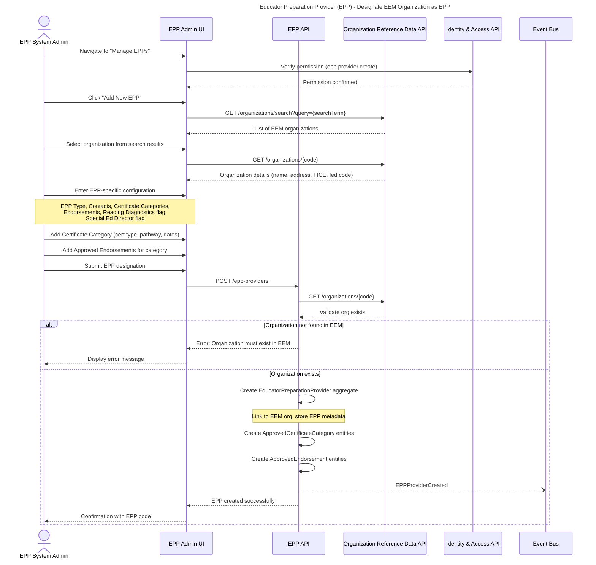
```mermaid
---
title: Educator Preparation Provider (EPP) - Designate EEM Organization as EPP
---
sequenceDiagram
    actor Admin as EPP System Admin
    participant UI as EPP Admin UI
    participant EPPService as EPP API
    participant OrgRef as Organization Reference Data API
    participant IAM as Identity & Access API
    participant EventBus as Event Bus

    Admin->>UI: Navigate to "Manage EPPs"
    UI->>IAM: Verify permission (epp.provider.create)
    IAM-->>UI: Permission confirmed

    Admin->>UI: Click "Add New EPP"
    UI->>OrgRef: GET /organizations/search?query={searchTerm}
    OrgRef-->>UI: List of EEM organizations

    Admin->>UI: Select organization from search results
    UI->>OrgRef: GET /organizations/{code}
    OrgRef-->>UI: Organization details (name, address, FICE, fed code)

    Admin->>UI: Enter EPP-specific configuration
    Note over Admin,UI: EPP Type, Contacts, Certificate Categories,<br/>Endorsements, Reading Diagnostics flag,<br/>Special Ed Director flag

    Admin->>UI: Add Certificate Category (cert type, pathway, dates)
    Admin->>UI: Add Approved Endorsements for category
    Admin->>UI: Submit EPP designation

    UI->>EPPService: POST /epp-providers
    EPPService->>OrgRef: GET /organizations/{code}
    OrgRef-->>EPPService: Validate org exists

    alt Organization not found in EEM
        EPPService-->>UI: Error: Organization must exist in EEM
        UI-->>Admin: Display error message
    else Organization exists
        EPPService->>EPPService: Create EducatorPreparationProvider aggregate
        Note over EPPService: Link to EEM org, store EPP metadata
        EPPService->>EPPService: Create ApprovedCertificateCategory entities
        EPPService->>EPPService: Create ApprovedEndorsement entities

        EPPService--)EventBus: EPPProviderCreated
        EPPService-->>UI: EPP created successfully
        UI-->>Admin: Confirmation with EPP code
    end
```

**Key Decisions:**
- **EEM Dependency:** EPP cannot be created unless organization exists in org-reference-data (synced from EEM)
- **Core Data Immutability:** Organization name, address, federal codes are read-only from EEM
- **Program Approval Scope:** At least one certificate category required for EPP to be active

**State Changes:**
- EducatorPreparationProvider: `none` > `Active`

**Events Published:**
- `EPPProviderCreated` - Notifies downstream systems of new EPP availability

**Error Scenarios:**
- Organization code not found in EEM > Display error, prevent creation
- Missing required certificate category > Validation error, require at least one

---

## Update EPP Configuration

**What:** EPP System Admin updates EPP-specific settings (type, contacts, flags, certificate categories, endorsements)  
**When:** EPP metadata needs to be updated (does NOT include core organization data like name/address)  
**Who:** EPP System Admin

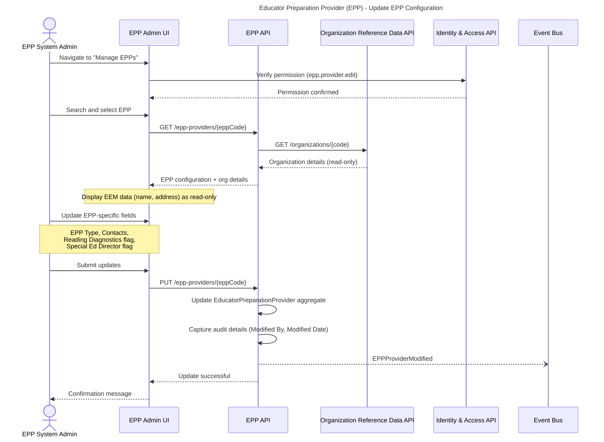
```mermaid
---
title: Educator Preparation Provider (EPP) - Update EPP Configuration
---
sequenceDiagram
    actor Admin as EPP System Admin
    participant UI as EPP Admin UI
    participant EPPService as EPP API
    participant OrgRef as Organization Reference Data API
    participant IAM as Identity & Access API
    participant EventBus as Event Bus

    Admin->>UI: Navigate to "Manage EPPs"
    UI->>IAM: Verify permission (epp.provider.edit)
    IAM-->>UI: Permission confirmed

    Admin->>UI: Search and select EPP
    UI->>EPPService: GET /epp-providers/{eppCode}
    EPPService->>OrgRef: GET /organizations/{code}
    OrgRef-->>EPPService: Organization details (read-only)
    EPPService-->>UI: EPP configuration + org details

    Note over UI: Display EEM data (name, address) as read-only

    Admin->>UI: Update EPP-specific fields
    Note over Admin,UI: EPP Type, Contacts,<br/>Reading Diagnostics flag,<br/>Special Ed Director flag

    Admin->>UI: Submit updates
    UI->>EPPService: PUT /epp-providers/{eppCode}

    EPPService->>EPPService: Update EducatorPreparationProvider aggregate
    EPPService->>EPPService: Capture audit details (Modified By, Modified Date)

    EPPService--)EventBus: EPPProviderModified
    EPPService-->>UI: Update successful
    UI-->>Admin: Confirmation message
```

**Key Decisions:**
- **Read-Only EEM Data:** Name, address, federal codes cannot be edited in MiEdWorkforce
- **EPP-Specific Updates Only:** Only metadata unique to EPP role can be modified

**State Changes:**
- EducatorPreparationProvider: `Active` remains `Active` (metadata update only)

**Events Published:**
- `EPPProviderModified` - Notifies downstream systems of configuration changes

**Error Scenarios:**
- Attempt to modify read-only org data > Validation error at UI level
- Invalid EPP type > Validation error

---

## Manage EPP Certificate Category Approvals

**What:** EPP System Admin adds, edits, or removes certificate type/pathway approvals with effective dates  
**When:** State approves new programs for EPP or modifies existing program approvals  
**Who:** EPP System Admin

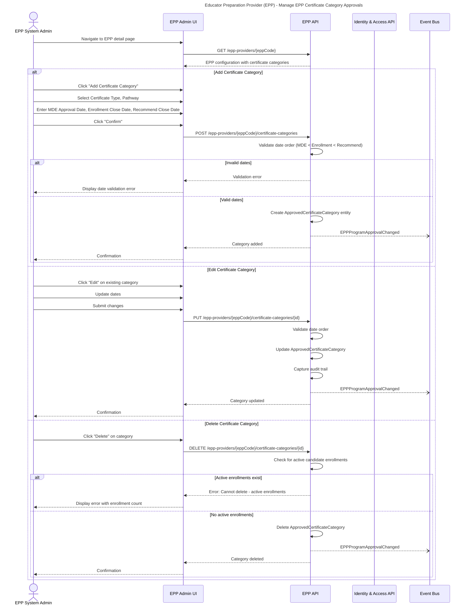
```mermaid
---
title: Educator Preparation Provider (EPP) - Manage EPP Certificate Category Approvals
---
sequenceDiagram
    actor Admin as EPP System Admin
    participant UI as EPP Admin UI
    participant EPPService as EPP API
    participant IAM as Identity & Access API
    participant EventBus as Event Bus

    Admin->>UI: Navigate to EPP detail page
    UI->>EPPService: GET /epp-providers/{eppCode}
    EPPService-->>UI: EPP configuration with certificate categories

    alt Add Certificate Category
        Admin->>UI: Click "Add Certificate Category"
        Admin->>UI: Select Certificate Type, Pathway
        Admin->>UI: Enter MDE Approval Date, Enrollment Close Date, Recommend Close Date
        Admin->>UI: Click "Confirm"

        UI->>EPPService: POST /epp-providers/{eppCode}/certificate-categories
        EPPService->>EPPService: Validate date order (MDE < Enrollment < Recommend)

        alt Invalid dates
            EPPService-->>UI: Validation error
            UI-->>Admin: Display date validation error
        else Valid dates
            EPPService->>EPPService: Create ApprovedCertificateCategory entity
            EPPService--)EventBus: EPPProgramApprovalChanged
            EPPService-->>UI: Category added
            UI-->>Admin: Confirmation
        end

    else Edit Certificate Category
        Admin->>UI: Click "Edit" on existing category
        Admin->>UI: Update dates
        Admin->>UI: Submit changes

        UI->>EPPService: PUT /epp-providers/{eppCode}/certificate-categories/{id}
        EPPService->>EPPService: Validate date order
        EPPService->>EPPService: Update ApprovedCertificateCategory
        EPPService->>EPPService: Capture audit trail

        EPPService--)EventBus: EPPProgramApprovalChanged
        EPPService-->>UI: Category updated
        UI-->>Admin: Confirmation

    else Delete Certificate Category
        Admin->>UI: Click "Delete" on category
        UI->>EPPService: DELETE /epp-providers/{eppCode}/certificate-categories/{id}

        EPPService->>EPPService: Check for active candidate enrollments
        alt Active enrollments exist
            EPPService-->>UI: Error: Cannot delete - active enrollments
            UI-->>Admin: Display error with enrollment count
        else No active enrollments
            EPPService->>EPPService: Delete ApprovedCertificateCategory
            EPPService--)EventBus: EPPProgramApprovalChanged
            EPPService-->>UI: Category deleted
            UI-->>Admin: Confirmation
        end
    end
```

**Key Decisions:**
- **Date Validation:** MDE Approval Date must precede Enrollment Close Date and Recommend Close Date
- **Deletion Protection:** Cannot delete certificate category if active candidate enrollments exist
- **Pro Prep Impact:** Date changes affect public catalog visibility

**State Changes:**
- ApprovedCertificateCategory: `none` > `Active` (on add)
- ApprovedCertificateCategory: `Active` > `deleted` (on remove, if no active enrollments)

**Events Published:**
- `EPPProgramApprovalChanged` - May trigger Pro Prep catalog updates

**Error Scenarios:**
- Invalid date order > Validation error, prevent save
- Delete with active enrollments > Block deletion, display error
- Attempt to add duplicate category/pathway > Validation error

---

## Manage EPP Approved Endorsements

**What:** EPP System Admin adds, edits, or removes specific endorsements within certificate types  
**When:** EPP receives approval for new endorsements or existing endorsements are sunset  
**Who:** EPP System Admin

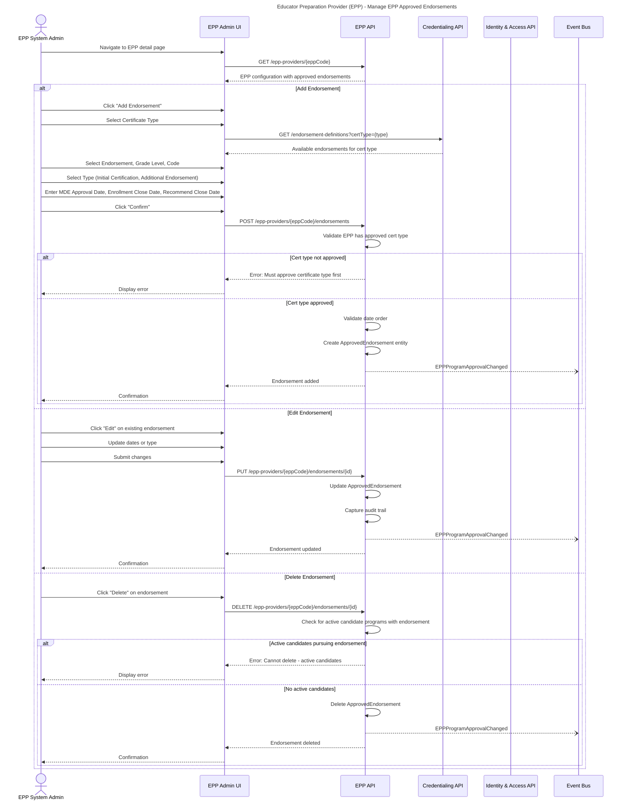
```mermaid
---
title: Educator Preparation Provider (EPP) - Manage EPP Approved Endorsements
---
sequenceDiagram
    actor Admin as EPP System Admin
    participant UI as EPP Admin UI
    participant EPPService as EPP API
    participant CredService as Credentialing API
    participant IAM as Identity & Access API
    participant EventBus as Event Bus

    Admin->>UI: Navigate to EPP detail page
    UI->>EPPService: GET /epp-providers/{eppCode}
    EPPService-->>UI: EPP configuration with approved endorsements

    alt Add Endorsement
        Admin->>UI: Click "Add Endorsement"
        Admin->>UI: Select Certificate Type

        UI->>CredService: GET /endorsement-definitions?certType={type}
        CredService-->>UI: Available endorsements for cert type

        Admin->>UI: Select Endorsement, Grade Level, Code
        Admin->>UI: Select Type (Initial Certification, Additional Endorsement)
        Admin->>UI: Enter MDE Approval Date, Enrollment Close Date, Recommend Close Date
        Admin->>UI: Click "Confirm"

        UI->>EPPService: POST /epp-providers/{eppCode}/endorsements

        EPPService->>EPPService: Validate EPP has approved cert type
        alt Cert type not approved
            EPPService-->>UI: Error: Must approve certificate type first
            UI-->>Admin: Display error
        else Cert type approved
            EPPService->>EPPService: Validate date order
            EPPService->>EPPService: Create ApprovedEndorsement entity

            EPPService--)EventBus: EPPProgramApprovalChanged
            EPPService-->>UI: Endorsement added
            UI-->>Admin: Confirmation
        end

    else Edit Endorsement
        Admin->>UI: Click "Edit" on existing endorsement
        Admin->>UI: Update dates or type
        Admin->>UI: Submit changes

        UI->>EPPService: PUT /epp-providers/{eppCode}/endorsements/{id}
        EPPService->>EPPService: Update ApprovedEndorsement
        EPPService->>EPPService: Capture audit trail

        EPPService--)EventBus: EPPProgramApprovalChanged
        EPPService-->>UI: Endorsement updated
        UI-->>Admin: Confirmation

    else Delete Endorsement
        Admin->>UI: Click "Delete" on endorsement
        UI->>EPPService: DELETE /epp-providers/{eppCode}/endorsements/{id}

        EPPService->>EPPService: Check for active candidate programs with endorsement
        alt Active candidates pursuing endorsement
            EPPService-->>UI: Error: Cannot delete - active candidates
            UI-->>Admin: Display error
        else No active candidates
            EPPService->>EPPService: Delete ApprovedEndorsement
            EPPService--)EventBus: EPPProgramApprovalChanged
            EPPService-->>UI: Endorsement deleted
            UI-->>Admin: Confirmation
        end
    end
```

**Key Decisions:**
- **Certificate Type Dependency:** Cannot add endorsement unless EPP has approved certificate type
- **Date Validation:** Similar to certificate categories (MDE < Enrollment < Recommend)
- **Deletion Protection:** Cannot delete if active candidates are pursuing the endorsement

**State Changes:**
- ApprovedEndorsement: `none` > `Active` (on add)
- ApprovedEndorsement: `Active` > `deleted` (on remove, if no active candidates)

**Events Published:**
- `EPPProgramApprovalChanged` - May trigger Pro Prep catalog updates

**Error Scenarios:**
- Certificate type not approved > Block endorsement addition
- Invalid date order > Validation error
- Delete with active candidates > Block deletion

---

## Configure Pro Prep Catalog Visibility

**What:** EPP System Admin toggles program visibility and manages Pro Prep display settings  
**When:** Managing public-facing program availability for prospective educators  
**Who:** EPP System Admin

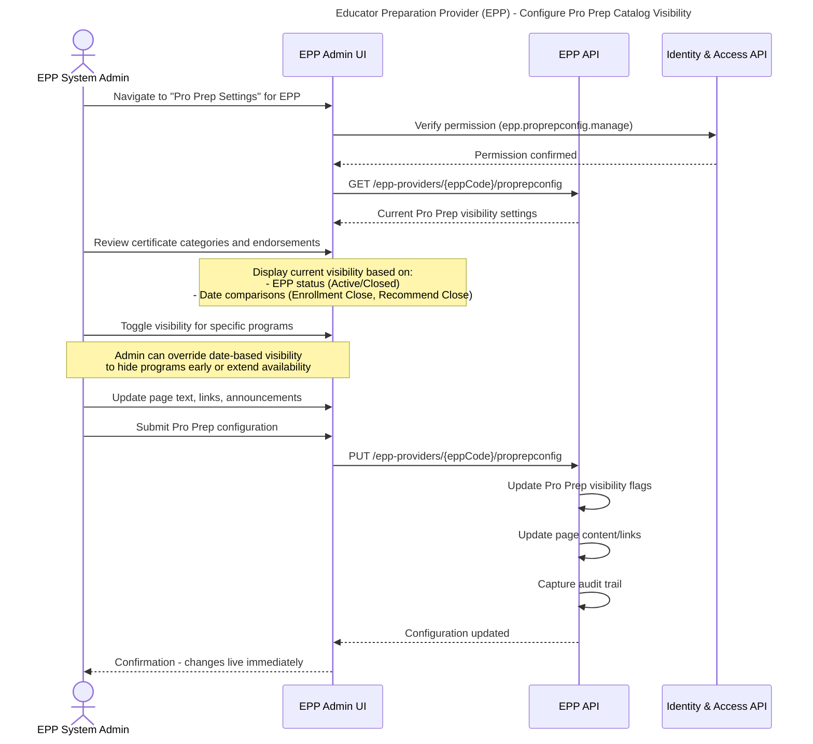
```mermaid
---
title: Educator Preparation Provider (EPP) - Configure Pro Prep Catalog Visibility
---
sequenceDiagram
    actor Admin as EPP System Admin
    participant UI as EPP Admin UI
    participant EPPService as EPP API
    participant IAM as Identity & Access API

    Admin->>UI: Navigate to "Pro Prep Settings" for EPP
    UI->>IAM: Verify permission (epp.proprepconfig.manage)
    IAM-->>UI: Permission confirmed

    UI->>EPPService: GET /epp-providers/{eppCode}/proprepconfig
    EPPService-->>UI: Current Pro Prep visibility settings

    Admin->>UI: Review certificate categories and endorsements
    Note over UI: Display current visibility based on:<br/>- EPP status (Active/Closed)<br/>- Date comparisons (Enrollment Close, Recommend Close)

    Admin->>UI: Toggle visibility for specific programs
    Note over Admin,UI: Admin can override date-based visibility<br/>to hide programs early or extend availability

    Admin->>UI: Update page text, links, announcements
    Admin->>UI: Submit Pro Prep configuration

    UI->>EPPService: PUT /epp-providers/{eppCode}/proprepconfig
    EPPService->>EPPService: Update Pro Prep visibility flags
    EPPService->>EPPService: Update page content/links
    EPPService->>EPPService: Capture audit trail

    EPPService-->>UI: Configuration updated
    UI-->>Admin: Confirmation - changes live immediately
```

**Key Decisions:**
- **Date-Based Visibility:** Default visibility based on Enrollment/Recommend Close Dates
- **Manual Override:** Admin can manually hide programs even if dates allow visibility
- **Immediate Effect:** Changes to Pro Prep settings take effect immediately

**State Changes:**
- EducatorPreparationProvider Pro Prep config updated (metadata change only)

**Events Published:**
- None (configuration change only, no domain events)

**Error Scenarios:**
- Invalid page content/links > Validation error
- Attempt to make closed EPP visible > Block override

---

## Search Pending Enrollment Verifications

**What:** EPP Coordinator filters and searches candidates awaiting enrollment verification  
**When:** EPP needs to review new enrollment submissions from candidates  
**Who:** EPP Coordinator

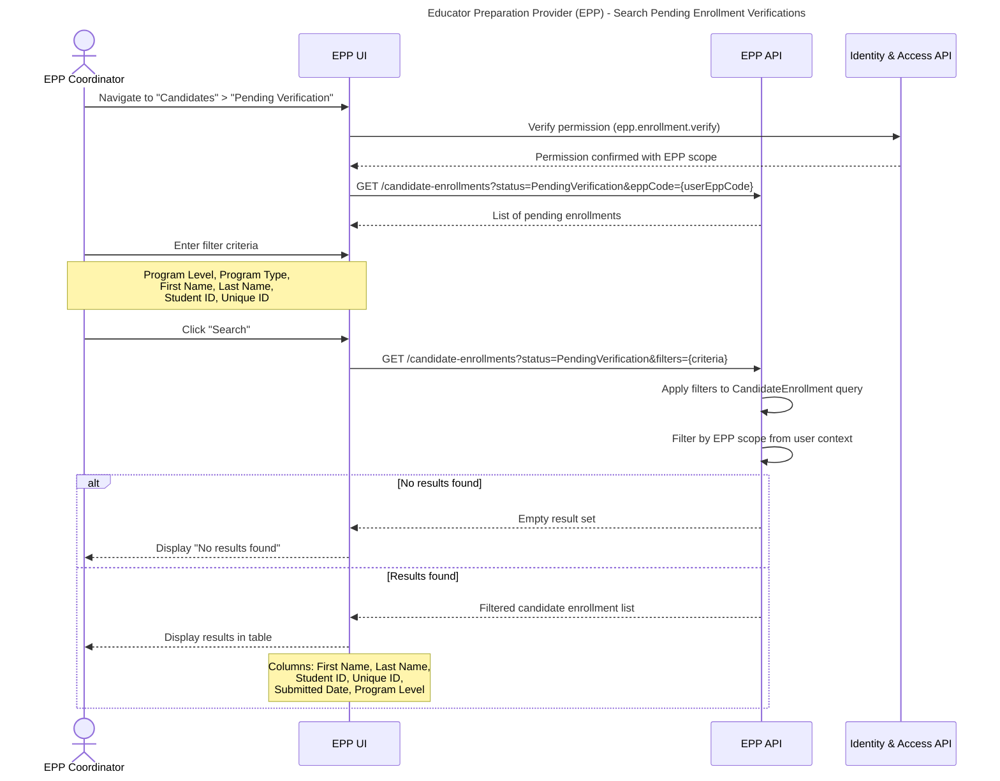
```mermaid
---
title: Educator Preparation Provider (EPP) - Search Pending Enrollment Verifications
---
sequenceDiagram
    actor Coordinator as EPP Coordinator
    participant UI as EPP UI
    participant EPPService as EPP API
    participant IAM as Identity & Access API

    Coordinator->>UI: Navigate to "Candidates" > "Pending Verification"
    UI->>IAM: Verify permission (epp.enrollment.verify)
    IAM-->>UI: Permission confirmed with EPP scope

    UI->>EPPService: GET /candidate-enrollments?status=PendingVerification&eppCode={userEppCode}
    EPPService-->>UI: List of pending enrollments

    Coordinator->>UI: Enter filter criteria
    Note over Coordinator,UI: Program Level, Program Type,<br/>First Name, Last Name,<br/>Student ID, Unique ID

    Coordinator->>UI: Click "Search"
    UI->>EPPService: GET /candidate-enrollments?status=PendingVerification&filters={criteria}

    EPPService->>EPPService: Apply filters to CandidateEnrollment query
    EPPService->>EPPService: Filter by EPP scope from user context

    alt No results found
        EPPService-->>UI: Empty result set
        UI-->>Coordinator: Display "No results found"
    else Results found
        EPPService-->>UI: Filtered candidate enrollment list
        UI-->>Coordinator: Display results in table
        Note over UI: Columns: First Name, Last Name,<br/>Student ID, Unique ID,<br/>Submitted Date, Program Level
    end
```

**Key Decisions:**
- **EPP Scope:** Results automatically filtered to coordinator's EPP only
- **Status Filter:** Hard-coded to `PendingVerification` status

**State Changes:**
- None (read-only query)

**Events Published:**
- None (query operation)

**Error Scenarios:**
- User lacks permission > Access denied
- Invalid filter values > Validation error

---

## Accept Candidate Enrollment

**What:** EPP Coordinator verifies and accepts candidate enrollment with enrollment date and program details  
**When:** Candidate's enrollment information has been validated as correct  
**Who:** EPP Coordinator

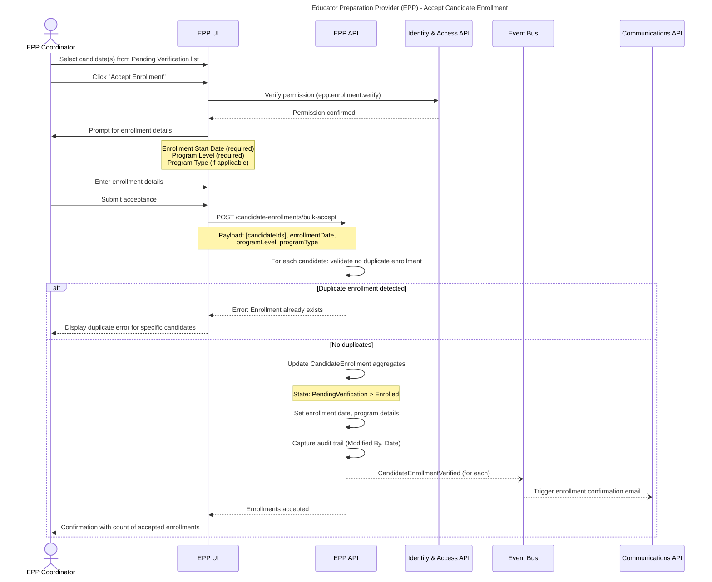
```mermaid
---
title: Educator Preparation Provider (EPP) - Accept Candidate Enrollment
---
sequenceDiagram
    actor Coordinator as EPP Coordinator
    participant UI as EPP UI
    participant EPPService as EPP API
    participant IAM as Identity & Access API
    participant EventBus as Event Bus
    participant CommService as Communications API

    Coordinator->>UI: Select candidate(s) from Pending Verification list
    Coordinator->>UI: Click "Accept Enrollment"

    UI->>IAM: Verify permission (epp.enrollment.verify)
    IAM-->>UI: Permission confirmed

    UI->>Coordinator: Prompt for enrollment details
    Note over UI: Enrollment Start Date (required)<br/>Program Level (required)<br/>Program Type (if applicable)

    Coordinator->>UI: Enter enrollment details
    Coordinator->>UI: Submit acceptance

    UI->>EPPService: POST /candidate-enrollments/bulk-accept
    Note over UI,EPPService: Payload: [candidateIds], enrollmentDate,<br/>programLevel, programType

    EPPService->>EPPService: For each candidate: validate no duplicate enrollment

    alt Duplicate enrollment detected
        EPPService-->>UI: Error: Enrollment already exists
        UI-->>Coordinator: Display duplicate error for specific candidates
    else No duplicates
        EPPService->>EPPService: Update CandidateEnrollment aggregates
        Note over EPPService: State: PendingVerification > Enrolled
        EPPService->>EPPService: Set enrollment date, program details
        EPPService->>EPPService: Capture audit trail (Modified By, Date)

        EPPService--)EventBus: CandidateEnrollmentVerified (for each)
        EventBus--)CommService: Trigger enrollment confirmation email

        EPPService-->>UI: Enrollments accepted
        UI-->>Coordinator: Confirmation with count of accepted enrollments
    end
```

**Key Decisions:**
- **Bulk Operation:** Supports single or multiple candidate acceptance
- **Duplicate Check:** Prevents duplicate enrollment records for same candidate/EPP/program
- **Program Type:** Required only for Teacher and School Administrator program levels

**State Changes:**
- CandidateEnrollment: `PendingVerification` > `Enrolled`

**Events Published:**
- `CandidateEnrollmentVerified` - Triggers candidate notification email, may affect credentialing eligibility

**Error Scenarios:**
- Duplicate enrollment > Block acceptance, display error for affected candidates
- Missing required program type > Validation error
- Invalid enrollment date > Validation error

---

## Reject Candidate Enrollment

**What:** EPP Coordinator denies enrollment verification with notification to candidate  
**When:** Candidate's enrollment information is incorrect or candidate not actually enrolled  
**Who:** EPP Coordinator

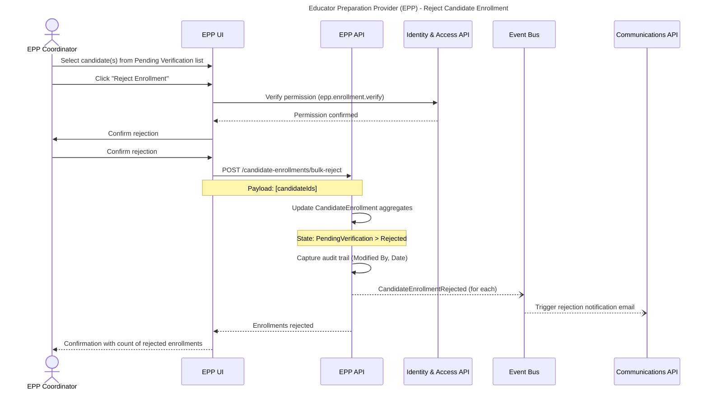
```mermaid
---
title: Educator Preparation Provider (EPP) - Reject Candidate Enrollment
---
sequenceDiagram
    actor Coordinator as EPP Coordinator
    participant UI as EPP UI
    participant EPPService as EPP API
    participant IAM as Identity & Access API
    participant EventBus as Event Bus
    participant CommService as Communications API

    Coordinator->>UI: Select candidate(s) from Pending Verification list
    Coordinator->>UI: Click "Reject Enrollment"

    UI->>IAM: Verify permission (epp.enrollment.verify)
    IAM-->>UI: Permission confirmed

    UI->>Coordinator: Confirm rejection
    Coordinator->>UI: Confirm rejection

    UI->>EPPService: POST /candidate-enrollments/bulk-reject
    Note over UI,EPPService: Payload: [candidateIds]

    EPPService->>EPPService: Update CandidateEnrollment aggregates
    Note over EPPService: State: PendingVerification > Rejected
    EPPService->>EPPService: Capture audit trail (Modified By, Date)

    EPPService--)EventBus: CandidateEnrollmentRejected (for each)
    EventBus--)CommService: Trigger rejection notification email

    EPPService-->>UI: Enrollments rejected
    UI-->>Coordinator: Confirmation with count of rejected enrollments
```

**Key Decisions:**
- **Bulk Operation:** Supports single or multiple candidate rejection
- **No Remarks Required:** Rejection does not require explanation (unlike application denial)

**State Changes:**
- CandidateEnrollment: `PendingVerification` > `Rejected`

**Events Published:**
- `CandidateEnrollmentRejected` - Triggers candidate notification email

**Error Scenarios:**
- User lacks permission > Access denied
- Enrollment not in PendingVerification status > Invalid state transition error

---

## Search Enrolled Candidates

**What:** EPP Coordinator filters and searches candidates with verified enrollment status  
**When:** EPP needs to review/manage current enrolled candidates  
**Who:** EPP Coordinator

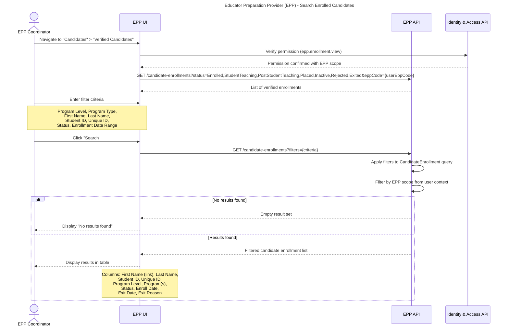
```mermaid
---
title: Educator Preparation Provider (EPP) - Search Enrolled Candidates
---
sequenceDiagram
    actor Coordinator as EPP Coordinator
    participant UI as EPP UI
    participant EPPService as EPP API
    participant IAM as Identity & Access API

    Coordinator->>UI: Navigate to "Candidates" > "Verified Candidates"
    UI->>IAM: Verify permission (epp.enrollment.view)
    IAM-->>UI: Permission confirmed with EPP scope

    UI->>EPPService: GET /candidate-enrollments?status=Enrolled,StudentTeaching,PostStudentTeaching,Placed,Inactive,Rejected,Exited&eppCode={userEppCode}
    EPPService-->>UI: List of verified enrollments

    Coordinator->>UI: Enter filter criteria
    Note over Coordinator,UI: Program Level, Program Type,<br/>First Name, Last Name,<br/>Student ID, Unique ID,<br/>Status, Enrollment Date Range

    Coordinator->>UI: Click "Search"
    UI->>EPPService: GET /candidate-enrollments?filters={criteria}

    EPPService->>EPPService: Apply filters to CandidateEnrollment query
    EPPService->>EPPService: Filter by EPP scope from user context

    alt No results found
        EPPService-->>UI: Empty result set
        UI-->>Coordinator: Display "No results found"
    else Results found
        EPPService-->>UI: Filtered candidate enrollment list
        UI-->>Coordinator: Display results in table
        Note over UI: Columns: First Name (link), Last Name,<br/>Student ID, Unique ID,<br/>Program Level, Program(s),<br/>Status, Enroll Date,<br/>Exit Date, Exit Reason
    end
```

**Key Decisions:**
- **EPP Scope:** Results automatically filtered to coordinator's EPP only
- **Multiple Statuses:** Default includes all verified statuses except PendingVerification
- **Clickable Name:** First Name is hyperlink to candidate detail view

**State Changes:**
- None (read-only query)

**Events Published:**
- None (query operation)

**Error Scenarios:**
- User lacks permission > Access denied
- Invalid filter values > Validation error

---

## View Candidate Enrollment Detail

**What:** EPP Coordinator views individual candidate's full enrollment history and programs  
**When:** Reviewing specific candidate's progress through EPP program  
**Who:** EPP Coordinator

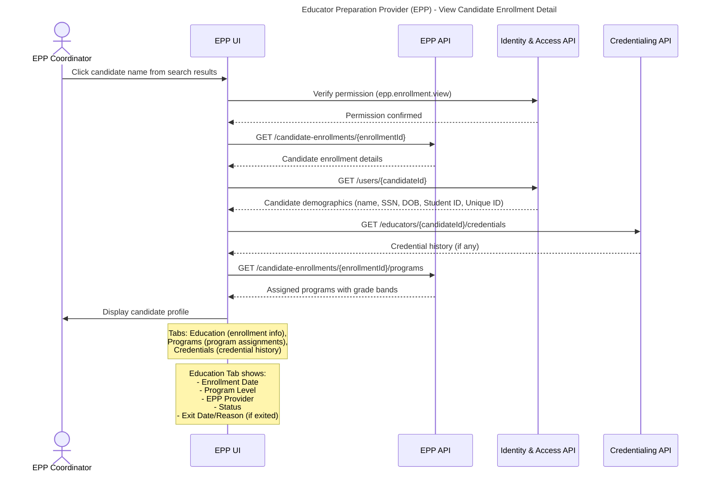
```mermaid
---
title: Educator Preparation Provider (EPP) - View Candidate Enrollment Detail
---
sequenceDiagram
    actor Coordinator as EPP Coordinator
    participant UI as EPP UI
    participant EPPService as EPP API
    participant IAM as Identity & Access API
    participant CredService as Credentialing API

    Coordinator->>UI: Click candidate name from search results
    UI->>IAM: Verify permission (epp.enrollment.view)
    IAM-->>UI: Permission confirmed

    UI->>EPPService: GET /candidate-enrollments/{enrollmentId}
    EPPService-->>UI: Candidate enrollment details

    UI->>IAM: GET /users/{candidateId}
    IAM-->>UI: Candidate demographics (name, SSN, DOB, Student ID, Unique ID)

    UI->>CredService: GET /educators/{candidateId}/credentials
    CredService-->>UI: Credential history (if any)

    UI->>EPPService: GET /candidate-enrollments/{enrollmentId}/programs
    EPPService-->>UI: Assigned programs with grade bands

    UI->>Coordinator: Display candidate profile
    Note over UI: Tabs: Education (enrollment info),<br/>Programs (program assignments),<br/>Credentials (credential history)

    Note over UI: Education Tab shows:<br/>- Enrollment Date<br/>- Program Level<br/>- EPP Provider<br/>- Status<br/>- Exit Date/Reason (if exited)
```

**Key Decisions:**
- **Multi-Domain Data:** Pulls data from EPP (enrollment), IAM (demographics), Credentialing (credentials)
- **Tabbed Interface:** Organizes information by category
- **Read-Only View:** This sequence is display-only, updates handled by separate workflows

**State Changes:**
- None (read-only query)

**Events Published:**
- None (query operation)

**Error Scenarios:**
- User lacks permission > Access denied
- Enrollment not found > 404 error
- Candidate not found in IAM > Display partial data with error message

---

## Manage Candidate Programs

**What:** EPP Coordinator adds, edits, or deletes programs assigned to enrolled candidate  
**When:** Candidate adds/changes program concentrations or endorsements  
**Who:** EPP Coordinator

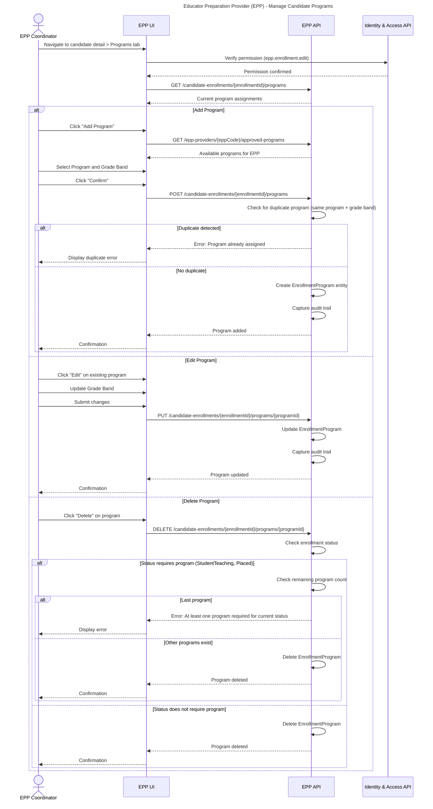
```mermaid
---
title: Educator Preparation Provider (EPP) - Manage Candidate Programs
---
sequenceDiagram
    actor Coordinator as EPP Coordinator
    participant UI as EPP UI
    participant EPPService as EPP API
    participant IAM as Identity & Access API

    Coordinator->>UI: Navigate to candidate detail > Programs tab
    UI->>IAM: Verify permission (epp.enrollment.edit)
    IAM-->>UI: Permission confirmed

    UI->>EPPService: GET /candidate-enrollments/{enrollmentId}/programs
    EPPService-->>UI: Current program assignments

    alt Add Program
        Coordinator->>UI: Click "Add Program"
        UI->>EPPService: GET /epp-providers/{eppCode}/approved-programs
        EPPService-->>UI: Available programs for EPP

        Coordinator->>UI: Select Program and Grade Band
        Coordinator->>UI: Click "Confirm"

        UI->>EPPService: POST /candidate-enrollments/{enrollmentId}/programs

        EPPService->>EPPService: Check for duplicate program (same program + grade band)
        alt Duplicate detected
            EPPService-->>UI: Error: Program already assigned
            UI-->>Coordinator: Display duplicate error
        else No duplicate
            EPPService->>EPPService: Create EnrollmentProgram entity
            EPPService->>EPPService: Capture audit trail
            EPPService-->>UI: Program added
            UI-->>Coordinator: Confirmation
        end

    else Edit Program
        Coordinator->>UI: Click "Edit" on existing program
        Coordinator->>UI: Update Grade Band
        Coordinator->>UI: Submit changes

        UI->>EPPService: PUT /candidate-enrollments/{enrollmentId}/programs/{programId}
        EPPService->>EPPService: Update EnrollmentProgram
        EPPService->>EPPService: Capture audit trail
        EPPService-->>UI: Program updated
        UI-->>Coordinator: Confirmation

    else Delete Program
        Coordinator->>UI: Click "Delete" on program
        UI->>EPPService: DELETE /candidate-enrollments/{enrollmentId}/programs/{programId}

        EPPService->>EPPService: Check enrollment status
        alt Status requires program (StudentTeaching, Placed)
            EPPService->>EPPService: Check remaining program count
            alt Last program
                EPPService-->>UI: Error: At least one program required for current status
                UI-->>Coordinator: Display error
            else Other programs exist
                EPPService->>EPPService: Delete EnrollmentProgram
                EPPService-->>UI: Program deleted
                UI-->>Coordinator: Confirmation
            end
        else Status does not require program
            EPPService->>EPPService: Delete EnrollmentProgram
            EPPService-->>UI: Program deleted
            UI-->>Coordinator: Confirmation
        end
    end
```

**Key Decisions:**
- **Duplicate Prevention:** Cannot add same program + grade band combination twice
- **Status Validation:** Cannot delete last program if status is StudentTeaching or Placed
- **EPP Scope:** Can only assign programs the EPP is approved to offer

**State Changes:**
- EnrollmentProgram: `none` > `Active` (on add)
- EnrollmentProgram: `Active` > `deleted` (on delete, if allowed)

**Events Published:**
- None (internal enrollment update only)

**Error Scenarios:**
- Duplicate program > Block addition
- Delete last program with status requiring program > Block deletion
- Invalid program for EPP > Validation error

---

## Update Candidate Enrollment Status

**What:** EPP Coordinator changes candidate status along valid state machine path  
**When:** Candidate progresses through program milestones  
**Who:** EPP Coordinator

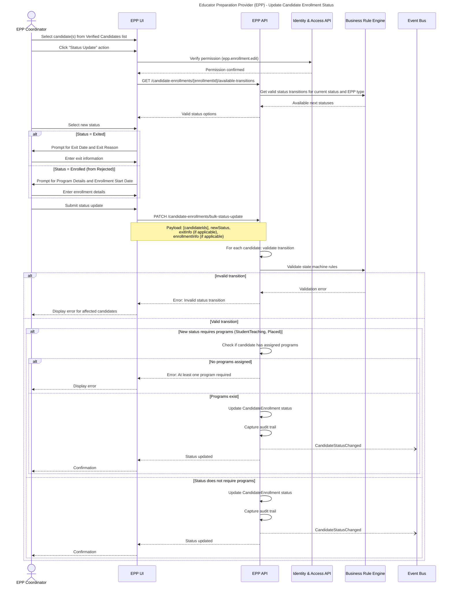
```mermaid
---
title: Educator Preparation Provider (EPP) - Update Candidate Enrollment Status
---
sequenceDiagram
    actor Coordinator as EPP Coordinator
    participant UI as EPP UI
    participant EPPService as EPP API
    participant IAM as Identity & Access API
    participant BRM as Business Rule Engine
    participant EventBus as Event Bus

    Coordinator->>UI: Select candidate(s) from Verified Candidates list
    Coordinator->>UI: Click "Status Update" action

    UI->>IAM: Verify permission (epp.enrollment.edit)
    IAM-->>UI: Permission confirmed

    UI->>EPPService: GET /candidate-enrollments/{enrollmentId}/available-transitions
    EPPService->>BRM: Get valid status transitions for current status and EPP type
    BRM-->>EPPService: Available next statuses
    EPPService-->>UI: Valid status options

    Coordinator->>UI: Select new status

    alt Status = Exited
        UI->>Coordinator: Prompt for Exit Date and Exit Reason
        Coordinator->>UI: Enter exit information
    else Status = Enrolled (from Rejected)
        UI->>Coordinator: Prompt for Program Details and Enrollment Start Date
        Coordinator->>UI: Enter enrollment details
    end

    Coordinator->>UI: Submit status update

    UI->>EPPService: PATCH /candidate-enrollments/bulk-status-update
    Note over UI,EPPService: Payload: [candidateIds], newStatus,<br/>exitInfo (if applicable),<br/>enrollmentInfo (if applicable)

    EPPService->>EPPService: For each candidate: validate transition
    EPPService->>BRM: Validate state machine rules

    alt Invalid transition
        BRM-->>EPPService: Validation error
        EPPService-->>UI: Error: Invalid status transition
        UI-->>Coordinator: Display error for affected candidates
    else Valid transition
        alt New status requires programs (StudentTeaching, Placed)
            EPPService->>EPPService: Check if candidate has assigned programs
            alt No programs assigned
                EPPService-->>UI: Error: At least one program required
                UI-->>Coordinator: Display error
            else Programs exist
                EPPService->>EPPService: Update CandidateEnrollment status
                EPPService->>EPPService: Capture audit trail
                EPPService--)EventBus: CandidateStatusChanged
                EPPService-->>UI: Status updated
                UI-->>Coordinator: Confirmation
            end
        else Status does not require programs
            EPPService->>EPPService: Update CandidateEnrollment status
            EPPService->>EPPService: Capture audit trail
            EPPService--)EventBus: CandidateStatusChanged
            EPPService-->>UI: Status updated
            UI-->>Coordinator: Confirmation
        end
    end
```

**Key Decisions:**
- **State Machine Validation:** Valid transitions differ by EPP type (Traditional vs Alternative)
- **Program Requirement:** StudentTeaching and Placed statuses require at least one assigned program
- **Bulk Operation:** Supports single or multiple candidate status updates
- **Exit Information:** Exit Date and Reason required when transitioning to Exited status

**State Changes:**
- CandidateEnrollment: `CurrentStatus` > `NewStatus` (per state machine rules)

**Events Published:**
- `CandidateStatusChanged` - Internal tracking, may inform other domains of candidate progress

**Error Scenarios:**
- Invalid state transition per state machine > Block update
- Missing programs for StudentTeaching/Placed > Block update
- Missing exit information when status = Exited > Validation error

---

## Exit Candidate from Program

**What:** EPP Coordinator marks candidate as Exited with exit date and reason  
**When:** Candidate completes EPP program or withdraws  
**Who:** EPP Coordinator

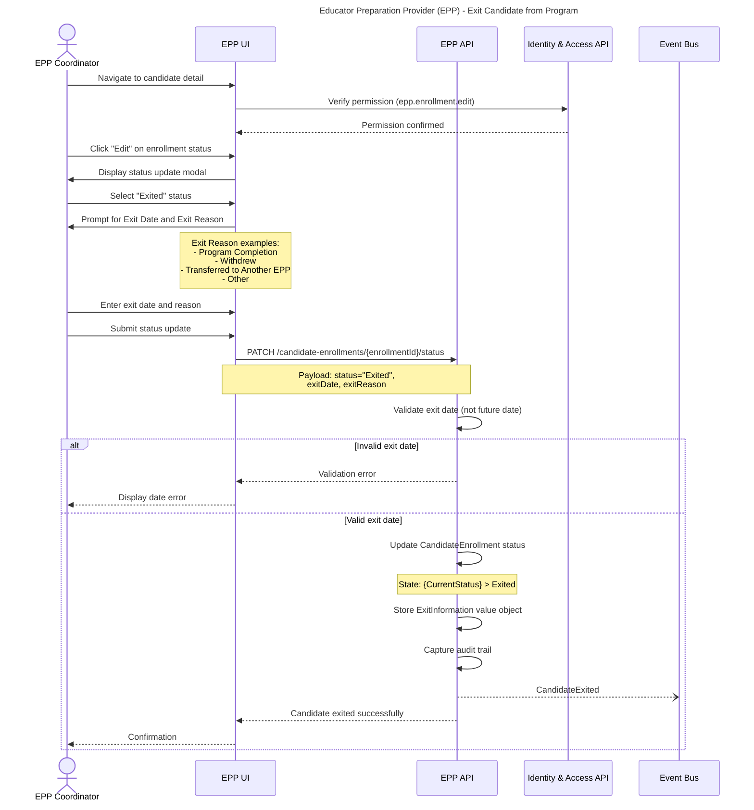
```mermaid
---
title: Educator Preparation Provider (EPP) - Exit Candidate from Program
---
sequenceDiagram
    actor Coordinator as EPP Coordinator
    participant UI as EPP UI
    participant EPPService as EPP API
    participant IAM as Identity & Access API
    participant EventBus as Event Bus

    Coordinator->>UI: Navigate to candidate detail
    UI->>IAM: Verify permission (epp.enrollment.edit)
    IAM-->>UI: Permission confirmed

    Coordinator->>UI: Click "Edit" on enrollment status
    UI->>Coordinator: Display status update modal

    Coordinator->>UI: Select "Exited" status
    UI->>Coordinator: Prompt for Exit Date and Exit Reason
    Note over UI: Exit Reason examples:<br/>- Program Completion<br/>- Withdrew<br/>- Transferred to Another EPP<br/>- Other

    Coordinator->>UI: Enter exit date and reason
    Coordinator->>UI: Submit status update

    UI->>EPPService: PATCH /candidate-enrollments/{enrollmentId}/status
    Note over UI,EPPService: Payload: status="Exited",<br/>exitDate, exitReason

    EPPService->>EPPService: Validate exit date (not future date)

    alt Invalid exit date
        EPPService-->>UI: Validation error
        UI-->>Coordinator: Display date error
    else Valid exit date
        EPPService->>EPPService: Update CandidateEnrollment status
        Note over EPPService: State: {CurrentStatus} > Exited
        EPPService->>EPPService: Store ExitInformation value object
        EPPService->>EPPService: Capture audit trail

        EPPService--)EventBus: CandidateExited
        EPPService-->>UI: Candidate exited successfully
        UI-->>Coordinator: Confirmation
    end
```

**Key Decisions:**
- **Exit Information Required:** Both date and reason mandatory for Exited status
- **Date Validation:** Exit date cannot be in the future
- **Program Completion Tracking:** Exit reason distinguishes completion from withdrawal

**State Changes:**
- CandidateEnrollment: `{CurrentStatus}` > `Exited`

**Events Published:**
- `CandidateExited` - May affect credentialing application eligibility

**Error Scenarios:**
- Future exit date > Validation error
- Missing exit reason > Validation error

---

## View Cross-EPP Enrollment History

**What:** EPP Coordinator views candidate's enrollment records at all EPPs  
**When:** Candidate has transferred or dual-enrolled, EPP needs full context  
**Who:** EPP Coordinator

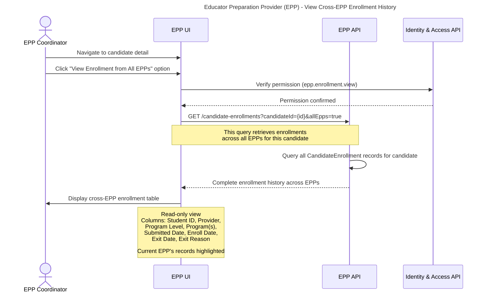
```mermaid
---
title: Educator Preparation Provider (EPP) - View Cross-EPP Enrollment History
---
sequenceDiagram
    actor Coordinator as EPP Coordinator
    participant UI as EPP UI
    participant EPPService as EPP API
    participant IAM as Identity & Access API

    Coordinator->>UI: Navigate to candidate detail
    Coordinator->>UI: Click "View Enrollment from All EPPs" option

    UI->>IAM: Verify permission (epp.enrollment.view)
    IAM-->>UI: Permission confirmed

    UI->>EPPService: GET /candidate-enrollments?candidateId={id}&allEpps=true
    Note over UI,EPPService: This query retrieves enrollments<br/>across all EPPs for this candidate

    EPPService->>EPPService: Query all CandidateEnrollment records for candidate
    EPPService-->>UI: Complete enrollment history across EPPs

    UI->>Coordinator: Display cross-EPP enrollment table
    Note over UI: Read-only view<br/>Columns: Student ID, Provider,<br/>Program Level, Program(s),<br/>Submitted Date, Enroll Date,<br/>Exit Date, Exit Reason<br/><br/>Current EPP's records highlighted
```

**Key Decisions:**
- **Read-Only:** Coordinator can view but not edit enrollments from other EPPs
- **Full History:** Shows all enrollments regardless of status or EPP
- **Highlighting:** Current EPP's records visually distinguished

**State Changes:**
- None (read-only query)

**Events Published:**
- None (query operation)

**Error Scenarios:**
- User lacks permission > Access denied
- No enrollments found > Display empty state message

---

## Bulk Upload Candidate Tracking Data

**What:** EPP Coordinator or EPP System Admin uploads file with candidate enrollment updates  
**When:** EPP has batch data from internal student information system  
**Who:** EPP Coordinator or EPP System Admin

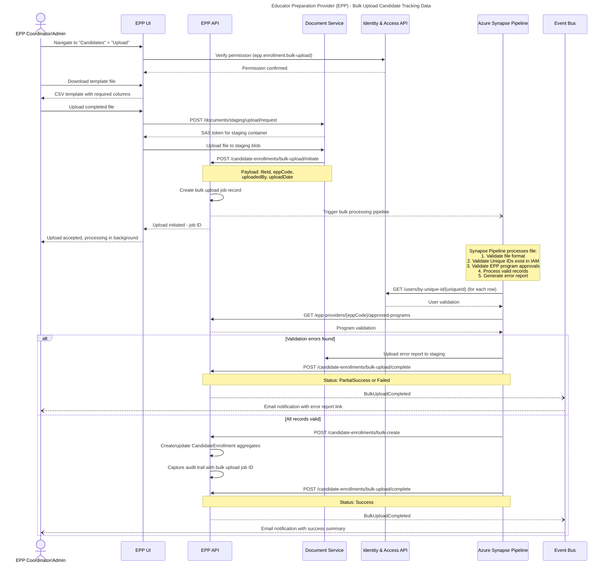
```mermaid
---
title: Educator Preparation Provider (EPP) - Bulk Upload Candidate Tracking Data
---
sequenceDiagram
    actor User as EPP Coordinator/Admin
    participant UI as EPP UI
    participant EPPService as EPP API
    participant DocService as Document Service
    participant IAM as Identity & Access API
    participant Synapse as Azure Synapse Pipeline
    participant EventBus as Event Bus

    User->>UI: Navigate to "Candidates" > "Upload"
    UI->>IAM: Verify permission (epp.enrollment.bulk-upload)
    IAM-->>UI: Permission confirmed

    User->>UI: Download template file
    UI-->>User: CSV template with required columns

    User->>UI: Upload completed file
    UI->>DocService: POST /documents/staging/upload/request
    DocService-->>UI: SAS token for staging container

    UI->>DocService: Upload file to staging blob
    DocService->>EPPService: POST /candidate-enrollments/bulk-upload/initiate
    Note over DocService,EPPService: Payload: fileId, eppCode,<br/>uploadedBy, uploadDate

    EPPService->>EPPService: Create bulk upload job record
    EPPService--)Synapse: Trigger bulk processing pipeline
    EPPService-->>UI: Upload initiated - job ID
    UI-->>User: Upload accepted, processing in background

    Note over Synapse: Synapse Pipeline processes file:<br/>1. Validate file format<br/>2. Validate Unique IDs exist in IAM<br/>3. Validate EPP program approvals<br/>4. Process valid records<br/>5. Generate error report

    Synapse->>IAM: GET /users/by-unique-id/{uniqueId} (for each row)
    IAM-->>Synapse: User validation

    Synapse->>EPPService: GET /epp-providers/{eppCode}/approved-programs
    EPPService-->>Synapse: Program validation

    alt Validation errors found
        Synapse->>DocService: Upload error report to staging
        Synapse->>EPPService: POST /candidate-enrollments/bulk-upload/complete
        Note over Synapse,EPPService: Status: PartialSuccess or Failed

        EPPService--)EventBus: BulkUploadCompleted
        EventBus--)User: Email notification with error report link
    else All records valid
        Synapse->>EPPService: POST /candidate-enrollments/bulk-create
        EPPService->>EPPService: Create/update CandidateEnrollment aggregates
        EPPService->>EPPService: Capture audit trail with bulk upload job ID

        Synapse->>EPPService: POST /candidate-enrollments/bulk-upload/complete
        Note over Synapse,EPPService: Status: Success

        EPPService--)EventBus: BulkUploadCompleted
        EventBus--)User: Email notification with success summary
    end
```

**Key Decisions:**
- **Staging Upload:** Files uploaded to staging container for Synapse processing
- **Validation Sequence:** Validate Unique IDs first, then program approvals
- **Partial Success:** System processes valid records even if some rows fail validation
- **Error Reporting:** Downloadable report identifies failing rows with reasons

**State Changes:**
- CandidateEnrollment: `none` > `PendingVerification` or `Enrolled` (per file data)
- BulkUploadJob: `Pending` > `Processing` > `Success`/`PartialSuccess`/`Failed`

**Events Published:**
- `BulkUploadCompleted` - Triggers notification email with results

**Error Scenarios:**
- Invalid file format > Reject entire file
- Unique ID not found in IAM > Skip row, include in error report
- Program not approved for EPP > Skip row, include in error report
- Duplicate enrollment > Skip row, include in error report

---

## Search Credential Applications for Review

**What:** EPP Coordinator filters credential applications by certificate type, status, candidate info  
**When:** EPP needs to locate applications requiring review  
**Who:** EPP Coordinator

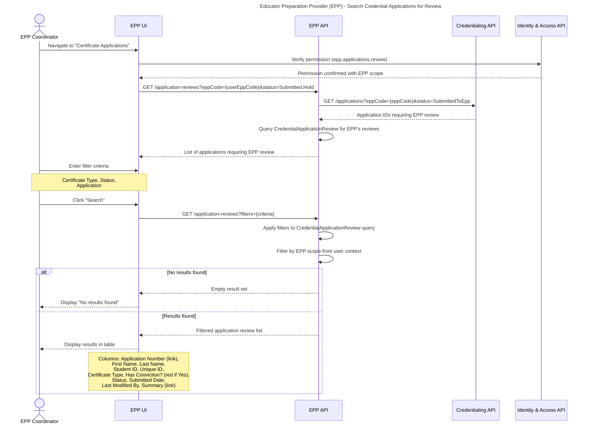
```mermaid
---
title: Educator Preparation Provider (EPP) - Search Credential Applications for Review
---
sequenceDiagram
    actor Coordinator as EPP Coordinator
    participant UI as EPP UI
    participant EPPService as EPP API
    participant CredService as Credentialing API
    participant IAM as Identity & Access API

    Coordinator->>UI: Navigate to "Certificate Applications"
    UI->>IAM: Verify permission (epp.applications.review)
    IAM-->>UI: Permission confirmed with EPP scope

    UI->>EPPService: GET /application-reviews?eppCode={userEppCode}&status=Submitted,Hold
    EPPService->>CredService: GET /applications?eppCode={eppCode}&status=SubmittedToEpp
    CredService-->>EPPService: Application IDs requiring EPP review

    EPPService->>EPPService: Query CredentialApplicationReview for EPP's reviews
    EPPService-->>UI: List of applications requiring EPP review

    Coordinator->>UI: Enter filter criteria
    Note over Coordinator,UI: Certificate Type, Status,<br/>Application #, First Name, Last Name,<br/>SSN, Unique ID, Student ID,<br/>Uses Alternative Pass? (Teacher only)

    Coordinator->>UI: Click "Search"
    UI->>EPPService: GET /application-reviews?filters={criteria}

    EPPService->>EPPService: Apply filters to CredentialApplicationReview query
    EPPService->>EPPService: Filter by EPP scope from user context

    alt No results found
        EPPService-->>UI: Empty result set
        UI-->>Coordinator: Display "No results found"
    else Results found
        EPPService-->>UI: Filtered application review list
        UI-->>Coordinator: Display results in table
        Note over UI: Columns: Application Number (link),<br/>First Name, Last Name,<br/>Student ID, Unique ID,<br/>Certificate Type, Has Conviction? (red if Yes),<br/>Status, Submitted Date,<br/>Last Modified By, Summary (link)
    end
```

**Key Decisions:**
- **EPP Scope:** Results automatically filtered to coordinator's EPP only
- **Status Filter:** Typically shows `Submitted` and `Hold` statuses
- **Conviction Highlighting:** Applications with conviction flag displayed in red
- **Certificate Type Filtering:** Alternative Pass filter only available for Teacher applications

**State Changes:**
- None (read-only query)

**Events Published:**
- None (query operation)

**Error Scenarios:**
- User lacks permission > Access denied
- Invalid filter values > Validation error

---

## View Credential Application Detail for EPP Review

**What:** EPP Coordinator views application summary, MTTC results, candidate demographics, review history  
**When:** EPP needs to assess application before taking action  
**Who:** EPP Coordinator

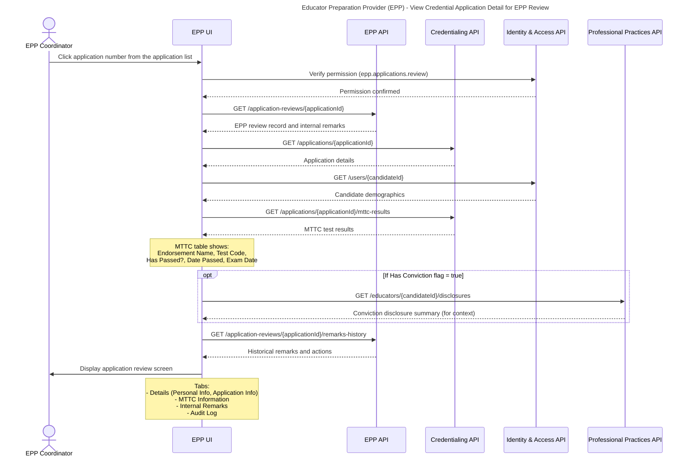
```mermaid
---
title: Educator Preparation Provider (EPP) - View Credential Application Detail for EPP Review
---
sequenceDiagram
    actor Coordinator as EPP Coordinator
    participant UI as EPP UI
    participant EPPService as EPP API
    participant CredService as Credentialing API
    participant IAM as Identity & Access API
    participant PPR as Professional Practices API

    Coordinator->>UI: Click application number from the application list
    UI->>IAM: Verify permission (epp.applications.review)
    IAM-->>UI: Permission confirmed

    UI->>EPPService: GET /application-reviews/{applicationId}
    EPPService-->>UI: EPP review record and internal remarks

    UI->>CredService: GET /applications/{applicationId}
    CredService-->>UI: Application details

    UI->>IAM: GET /users/{candidateId}
    IAM-->>UI: Candidate demographics

    UI->>CredService: GET /applications/{applicationId}/mttc-results
    CredService-->>UI: MTTC test results
    Note over UI: MTTC table shows:<br/>Endorsement Name, Test Code,<br/>Has Passed?, Date Passed, Exam Date

    opt If Has Conviction flag = true
        UI->>PPR: GET /educators/{candidateId}/disclosures
        PPR-->>UI: Conviction disclosure summary (for context)
    end

    UI->>EPPService: GET /application-reviews/{applicationId}/remarks-history
    EPPService-->>UI: Historical remarks and actions

    UI->>Coordinator: Display application review screen
    Note over UI: Tabs:<br/>- Details (Personal Info, Application Info)<br/>- MTTC Information<br/>- Internal Remarks<br/>- Audit Log
```

**Key Decisions:**
- **Multi-Domain Data:** Pulls data from Credentialing (application), IAM (demographics), EPP (remarks/review status)
- **Conviction Context:** If conviction flag present, optionally show disclosure summary for context
- **Read-Only Application:** Actual application form is read-only from Credentialing domain

**State Changes:**
- None (read-only query)

**Events Published:**
- None (query operation)

**Error Scenarios:**
- User lacks permission > Access denied
- Application not found > 404 error
- MTTC results unavailable > Display warning, allow coordinator to proceed

---

## Place Credential Application on Hold

**What:** EPP Coordinator holds application with remarks explaining reason  
**When:** Application needs additional information or clarification  
**Who:** EPP Coordinator

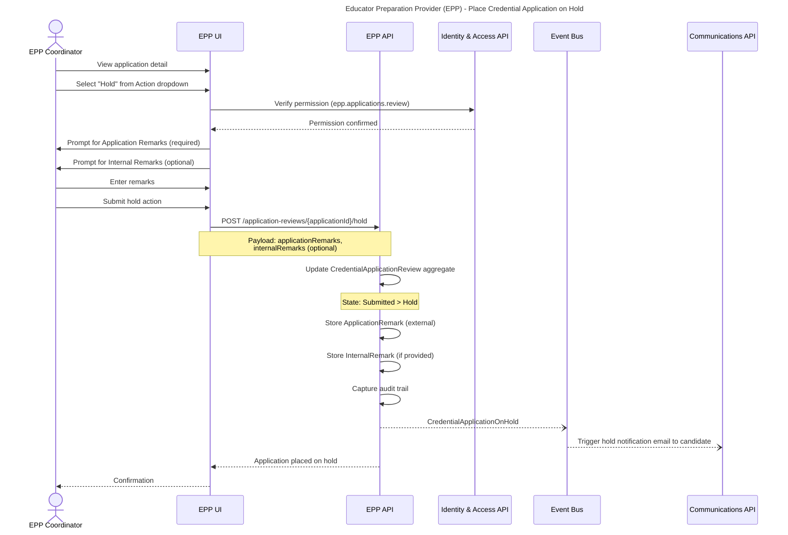
```mermaid
---
title: Educator Preparation Provider (EPP) - Place Credential Application on Hold
---
sequenceDiagram
    actor Coordinator as EPP Coordinator
    participant UI as EPP UI
    participant EPPService as EPP API
    participant IAM as Identity & Access API
    participant EventBus as Event Bus
    participant CommService as Communications API

    Coordinator->>UI: View application detail
    Coordinator->>UI: Select "Hold" from Action dropdown

    UI->>IAM: Verify permission (epp.applications.review)
    IAM-->>UI: Permission confirmed

    UI->>Coordinator: Prompt for Application Remarks (required)
    UI->>Coordinator: Prompt for Internal Remarks (optional)

    Coordinator->>UI: Enter remarks
    Coordinator->>UI: Submit hold action

    UI->>EPPService: POST /application-reviews/{applicationId}/hold
    Note over UI,EPPService: Payload: applicationRemarks,<br/>internalRemarks (optional)

    EPPService->>EPPService: Update CredentialApplicationReview aggregate
    Note over EPPService: State: Submitted > Hold
    EPPService->>EPPService: Store ApplicationRemark (external)
    EPPService->>EPPService: Store InternalRemark (if provided)
    EPPService->>EPPService: Capture audit trail

    EPPService--)EventBus: CredentialApplicationOnHold
    EventBus--)CommService: Trigger hold notification email to candidate

    EPPService-->>UI: Application placed on hold
    UI-->>Coordinator: Confirmation
```

**Key Decisions:**
- **Application Remarks Required:** External remarks sent to candidate explaining hold reason
- **Internal Remarks Optional:** Internal notes not visible to candidate
- **No Re-Routing:** Application remains in EPP's filtered application list (status stays Hold) until EPP takes next action

**State Changes:**
- CredentialApplicationReview: `Submitted` > `Hold`

**Events Published:**
- `CredentialApplicationOnHold` - Triggers candidate notification email

**Error Scenarios:**
- Missing application remarks > Validation error
- User lacks permission > Access denied

---

## Deny Credential Application

**What:** EPP Coordinator denies application with required remarks  
**When:** Candidate doesn't meet EPP program requirements  
**Who:** EPP Coordinator

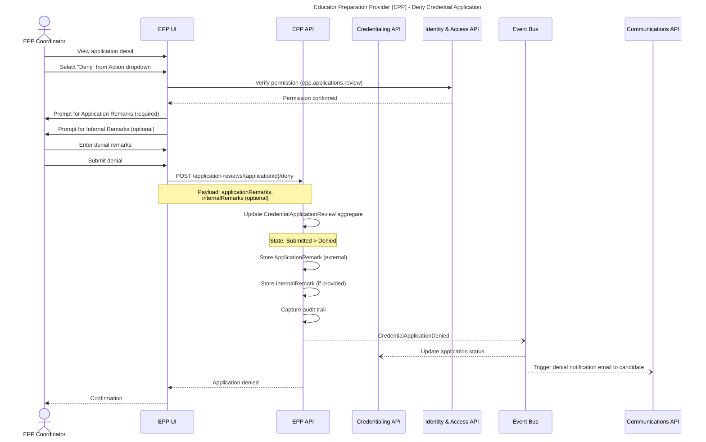
```mermaid
---
title: Educator Preparation Provider (EPP) - Deny Credential Application
---
sequenceDiagram
    actor Coordinator as EPP Coordinator
    participant UI as EPP UI
    participant EPPService as EPP API
    participant CredService as Credentialing API
    participant IAM as Identity & Access API
    participant EventBus as Event Bus
    participant CommService as Communications API

    Coordinator->>UI: View application detail
    Coordinator->>UI: Select "Deny" from Action dropdown

    UI->>IAM: Verify permission (epp.applications.review)
    IAM-->>UI: Permission confirmed

    UI->>Coordinator: Prompt for Application Remarks (required)
    UI->>Coordinator: Prompt for Internal Remarks (optional)

    Coordinator->>UI: Enter denial remarks
    Coordinator->>UI: Submit denial

    UI->>EPPService: POST /application-reviews/{applicationId}/deny
    Note over UI,EPPService: Payload: applicationRemarks,<br/>internalRemarks (optional)

    EPPService->>EPPService: Update CredentialApplicationReview aggregate
    Note over EPPService: State: Submitted > Denied
    EPPService->>EPPService: Store ApplicationRemark (external)
    EPPService->>EPPService: Store InternalRemark (if provided)
    EPPService->>EPPService: Capture audit trail

    EPPService--)EventBus: CredentialApplicationDenied
    EventBus--)CredService: Update application status
    EventBus--)CommService: Trigger denial notification email to candidate

    EPPService-->>UI: Application denied
    UI-->>Coordinator: Confirmation
```

**Key Decisions:**
- **Application Remarks Required:** External remarks sent to candidate explaining denial reason
- **Status Update:** Application status updated in Credentialing domain to reflect EPP denial
- **Candidate Notification:** Candidate receives email with denial remarks

**State Changes:**
- CredentialApplicationReview: `Submitted` > `Denied`

**Events Published:**
- `CredentialApplicationDenied` - Triggers status update in Credentialing domain and candidate notification

**Error Scenarios:**
- Missing application remarks > Validation error
- User lacks permission > Access denied

---

## Cancel Credential Application Review

**What:** EPP Coordinator cancels application (e.g., candidate withdrew)  
**When:** Application is no longer being pursued  
**Who:** EPP Coordinator

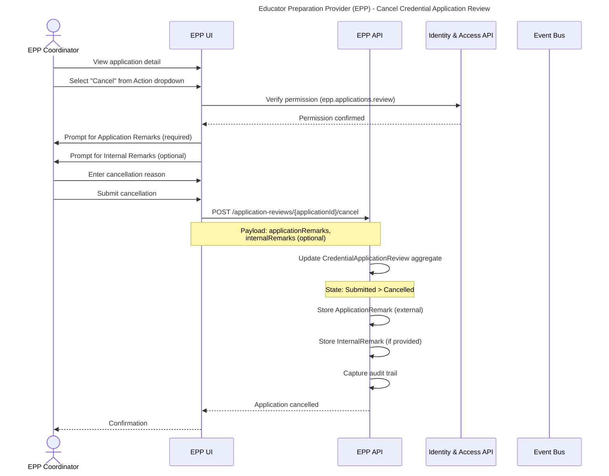
```mermaid
---
title: Educator Preparation Provider (EPP) - Cancel Credential Application Review
---
sequenceDiagram
    actor Coordinator as EPP Coordinator
    participant UI as EPP UI
    participant EPPService as EPP API
    participant IAM as Identity & Access API
    participant EventBus as Event Bus

    Coordinator->>UI: View application detail
    Coordinator->>UI: Select "Cancel" from Action dropdown

    UI->>IAM: Verify permission (epp.applications.review)
    IAM-->>UI: Permission confirmed

    UI->>Coordinator: Prompt for Application Remarks (required)
    UI->>Coordinator: Prompt for Internal Remarks (optional)

    Coordinator->>UI: Enter cancellation reason
    Coordinator->>UI: Submit cancellation

    UI->>EPPService: POST /application-reviews/{applicationId}/cancel
    Note over UI,EPPService: Payload: applicationRemarks,<br/>internalRemarks (optional)

    EPPService->>EPPService: Update CredentialApplicationReview aggregate
    Note over EPPService: State: Submitted > Cancelled
    EPPService->>EPPService: Store ApplicationRemark (external)
    EPPService->>EPPService: Store InternalRemark (if provided)
    EPPService->>EPPService: Capture audit trail

    EPPService-->>UI: Application cancelled
    UI-->>Coordinator: Confirmation
```

**Key Decisions:**
- **Application Remarks Required:** External remarks document cancellation reason
- **No Notification:** Cancel action typically does not trigger candidate email (candidate already aware)
- **Final State:** Cancelled is a terminal state

**State Changes:**
- CredentialApplicationReview: `Submitted` > `Cancelled`

**Events Published:**
- None (internal status change only)

**Error Scenarios:**
- Missing application remarks > Validation error
- User lacks permission > Access denied

---

## Recommend Candidate for Credential

**What:** EPP Coordinator recommends application with selected endorsements  
**When:** Candidate meets EPP program and assessment requirements  
**Who:** EPP Coordinator

```mermaid
---
title: Educator Preparation Provider (EPP) - Recommend Candidate for Credential
---
sequenceDiagram
    actor Coordinator as EPP Coordinator
    participant UI as EPP UI
    participant EPPService as EPP API
    participant CredService as Credentialing API
    participant IAM as Identity & Access API
    participant BRM as Business Rule Engine
    participant EventBus as Event Bus
    participant CommService as Communications API

    Coordinator->>UI: View application detail
    Coordinator->>UI: Select "Recommend" from Action dropdown

    UI->>IAM: Verify permission (epp.applications.review)
    IAM-->>UI: Permission confirmed

    UI->>CredService: GET /applications/{applicationId}/requested-endorsements
    CredService-->>UI: Endorsements requested by candidate

    UI->>CredService: GET /applications/{applicationId}/mttc-results
    CredService-->>UI: MTTC test results

    UI->>EPPService: GET /epp-providers/{eppCode}/approved-endorsements
    EPPService-->>UI: Endorsements EPP can recommend

    UI->>Coordinator: Display endorsement selection grid
    Note over UI: Grid shows:<br/>- Recommend (checkbox)<br/>- Endorsement Name<br/>- Code, Grade Band<br/>- Action by Applicant<br/>- Action (Edit/Add)

    Coordinator->>UI: Select/adjust endorsements to recommend

    opt Add additional endorsement
        Coordinator->>UI: Click "Add Endorsement"
        UI->>Coordinator: Show endorsement picker (EPP approved only)
        Coordinator->>UI: Select endorsement, grade band
    end

    Coordinator->>UI: Enter Internal Remarks (optional)
    Coordinator->>UI: Submit recommendation

    UI->>EPPService: POST /application-reviews/{applicationId}/recommend
    Note over UI,EPPService: Payload: recommendedEndorsements[],<br/>internalRemarks (optional)

    EPPService->>EPPService: Validate at least one endorsement selected
    alt No endorsements selected
        EPPService-->>UI: Validation error
        UI-->>Coordinator: Display error - must recommend at least one endorsement
    else Endorsements selected
        EPPService->>BRM: Validate endorsements against EPP approved list
        BRM-->>EPPService: Validation result

        alt Endorsement not approved for EPP
            EPPService-->>UI: Validation error
            UI-->>Coordinator: Display error - endorsement not in EPP scope
        else All endorsements valid
            EPPService->>CredService: GET /applications/{applicationId}/mttc-results
            CredService-->>EPPService: MTTC results

            EPPService->>BRM: Validate MTTC pass for each endorsement
            BRM-->>EPPService: MTTC validation result

            alt MTTC not passed for endorsement
                EPPService-->>UI: Warning - MTTC not passed
                UI-->>Coordinator: Display warning (allow override if Alternative Pass)
            else MTTC passed or Alternative Pass
                EPPService->>EPPService: Update CredentialApplicationReview aggregate
                Note over EPPService: State: Submitted > Recommended
                EPPService->>EPPService: Create RecommendedEndorsement entities
                EPPService->>EPPService: Store InternalRemark (if provided)
                EPPService->>EPPService: Capture audit trail

                EPPService--)EventBus: CredentialApplicationRecommended
                EventBus--)CredService: Route to payment (in-state) or OEE (out-of-state)
                EventBus--)CommService: Trigger recommendation confirmation email

                EPPService-->>UI: Application recommended
                UI-->>Coordinator: Confirmation
            end
        end
    end
```

**Key Decisions:**
- **Endorsement Validation:** Must recommend at least one endorsement within EPP's approved scope
- **MTTC Validation:** System validates MTTC pass status for each endorsement
- **Alternative Pass Override:** Coordinator can proceed if candidate used alternative assessment pathway
- **Routing Logic:** In-state applications route to payment; out-of-state to OEE/State Credential Admin for review

**State Changes:**
- CredentialApplicationReview: `Submitted` > `Recommended`

**Events Published:**
- `CredentialApplicationRecommended` - Triggers payment workflow (in-state) or OEE routing (out-of-state), sends candidate notification

**Error Scenarios:**
- No endorsements selected > Validation error
- Endorsement not in EPP approved list > Validation error
- MTTC not passed (without Alternative Pass) > Warning, require override
- User lacks permission > Access denied

---

## Add Internal Remarks to Application Review

**What:** EPP Coordinator adds notes visible only to EPP staff  
**When:** Documenting internal review discussions or tracking information  
**Who:** EPP Coordinator

```mermaid
---
title: Educator Preparation Provider (EPP) - Add Internal Remarks to Application Review
---
sequenceDiagram
    actor Coordinator as EPP Coordinator
    participant UI as EPP UI
    participant EPPService as EPP API
    participant IAM as Identity & Access API

    Coordinator->>UI: View application detail
    Coordinator->>UI: Navigate to "Internal Remarks" tab

    UI->>IAM: Verify permission (epp.applications.review)
    IAM-->>UI: Permission confirmed

    UI->>EPPService: GET /application-reviews/{applicationId}/internal-remarks
    EPPService-->>UI: Existing internal remarks history

    Coordinator->>UI: Enter new internal remark
    Coordinator->>UI: Submit remark

    UI->>EPPService: POST /application-reviews/{applicationId}/internal-remarks
    Note over UI,EPPService: Payload: remarkText

    EPPService->>EPPService: Create InternalRemark value object
    EPPService->>EPPService: Associate with CredentialApplicationReview
    EPPService->>EPPService: Capture author and timestamp

    EPPService-->>UI: Remark added
    UI->>EPPService: GET /application-reviews/{applicationId}/internal-remarks
    EPPService-->>UI: Updated remarks list
    UI-->>Coordinator: Display updated remarks
```

**Key Decisions:**
- **Internal Only:** Remarks never visible to candidate, only to EPP staff
- **Audit Trail:** Author and timestamp captured for accountability
- **No Status Change:** Adding remarks does not change application review status

**State Changes:**
- None (metadata addition only)

**Events Published:**
- None (internal notes only)

**Error Scenarios:**
- Empty remark text > Validation error
- User lacks permission > Access denied

---

## Search Approval Applications for Review

**What:** EPP Coordinator filters approval applications by category, type, status  
**When:** EPP needs to review alternative route approval applications  
**Who:** EPP Coordinator

```mermaid
---
title: Educator Preparation Provider (EPP) - Search Approval Applications for Review
---
sequenceDiagram
    actor Coordinator as EPP Coordinator
    participant UI as EPP UI
    participant EPPService as EPP API
    participant CredService as Credentialing API
    participant IAM as Identity & Access API

    Coordinator->>UI: Navigate to "Certificate Applications" > "Approval" tab
    UI->>IAM: Verify permission (epp.approvals.review)
    IAM-->>UI: Permission confirmed with EPP scope

    UI->>EPPService: GET /approval-application-reviews?eppCode={userEppCode}&status=Submitted
    EPPService->>CredService: GET /applications/approvals?eppCode={eppCode}
    CredService-->>EPPService: Approval application IDs requiring EPP review

    EPPService->>EPPService: Query ApprovalApplicationReview for EPP's reviews
    EPPService-->>UI: List of approval applications requiring EPP review

    Coordinator->>UI: Enter filter criteria
    Note over Coordinator,UI: Status, Application #,<br/>First Name, Last Name,<br/>SSN, Unique ID, Student ID,<br/>Approval Category, Approval Type

    Coordinator->>UI: Click "Search"
    UI->>EPPService: GET /approval-application-reviews?filters={criteria}

    EPPService->>EPPService: Apply filters to ApprovalApplicationReview query
    EPPService->>EPPService: Filter by EPP scope from user context

    alt No results found
        EPPService-->>UI: Empty result set
        UI-->>Coordinator: Display "No results found"
    else Results found
        EPPService-->>UI: Filtered approval application review list
        UI-->>Coordinator: Display results in table
        Note over UI: Columns: Application Number (link),<br/>First Name, Last Name,<br/>Student ID, Unique ID,<br/>Approval Type, School District,<br/>Has Conviction? (red if Yes),<br/>Status, Submitted on,<br/>Last Modified By, Summary (link)
    end
```

**Key Decisions:**
- **EPP Scope:** Results automatically filtered to coordinator's EPP only
- **Approval-Specific Filters:** Approval Category and Approval Type replace Certificate Type
- **ISD Context:** School District displayed to show originating ISD

**State Changes:**
- None (read-only query)

**Events Published:**
- None (query operation)

**Error Scenarios:**
- User lacks permission > Access denied
- Invalid filter values > Validation error

---

## View Approval Application Detail for EPP Review

**What:** EPP Coordinator views approval application including acknowledgements, professional practice responses  
**When:** EPP needs to assess approval application before recommendation/denial  
**Who:** EPP Coordinator

```mermaid
---
title: Educator Preparation Provider (EPP) - View Approval Application Detail for EPP Review
---
sequenceDiagram
    actor Coordinator as EPP Coordinator
    participant UI as EPP UI
    participant EPPService as EPP API
    participant CredService as Credentialing API
    participant IAM as Identity & Access API
    participant PPR as Professional Practices API
    participant OrgRef as Organization Reference Data API

    Coordinator->>UI: Click application number from the approval application list
    UI->>IAM: Verify permission (epp.approvals.review)
    IAM-->>UI: Permission confirmed

    UI->>EPPService: GET /approval-application-reviews/{applicationId}
    EPPService-->>UI: EPP review record

    UI->>CredService: GET /applications/approvals/{applicationId}
    CredService-->>UI: Approval application details

    UI->>IAM: GET /users/{candidateId}
    IAM-->>UI: Candidate demographics

    UI->>OrgRef: GET /organizations/{schoolDistrictCode}
    OrgRef-->>UI: School district information

    opt If Has Conviction flag = true
        UI->>PPR: GET /educators/{candidateId}/disclosures
        PPR-->>UI: Professional practice responses
    end

    UI->>EPPService: GET /approval-application-reviews/{applicationId}/history
    EPPService-->>UI: Application action history

    UI->>Coordinator: Display approval application review screen
    Note over UI: Sections:<br/>- Applicant Information<br/>- Application Information<br/>- Other Information (School District,<br/>  Program Category, College/University,<br/>  Effective Date)<br/>- Application Acknowledgements<br/>- Professional Practices<br/>- Approval Application History
```

**Key Decisions:**
- **ISD Context:** School district and program category central to approval application review
- **Acknowledgements:** Applicant attestations specific to approval category displayed
- **Professional Practice Integration:** If conviction flag present, show PPR responses for review

**State Changes:**
- None (read-only query)

**Events Published:**
- None (query operation)

**Error Scenarios:**
- User lacks permission > Access denied
- Application not found > 404 error
- School district not found in EEM > Display warning

---

## Recommend Approval Application

**What:** EPP Coordinator recommends approval application (returns to the ISD/School District)  
**When:** Candidate meets alternative route requirements  
**Who:** EPP Coordinator

```mermaid
---
title: Educator Preparation Provider (EPP) - Recommend Approval Application
---
sequenceDiagram
    actor Coordinator as EPP Coordinator
    participant UI as EPP UI
    participant EPPService as EPP API
    participant CredService as Credentialing API
    participant IAM as Identity & Access API
    participant EventBus as Event Bus
    participant CommService as Communications API

    Coordinator->>UI: View approval application detail
    Coordinator->>UI: Select "Recommend" from Action dropdown

    UI->>IAM: Verify permission (epp.approvals.review)
    IAM-->>UI: Permission confirmed

    UI->>Coordinator: Prompt for Remarks (optional)

    Coordinator->>UI: Enter optional remarks
    Coordinator->>UI: Submit recommendation

    UI->>EPPService: POST /approval-application-reviews/{applicationId}/recommend
    Note over UI,EPPService: Payload: remarks (optional)

    EPPService->>EPPService: Update ApprovalApplicationReview aggregate
    Note over EPPService: State: Submitted > Recommended by EPP
    EPPService->>EPPService: Store ReviewRemark (if provided)
    EPPService->>EPPService: Capture audit trail

    EPPService--)EventBus: ApprovalApplicationRecommended
    EventBus--)CredService: Return application to ISD/School District
    EventBus--)CommService: Trigger notification to ISD

    EPPService-->>UI: Approval application recommended
    UI-->>Coordinator: Confirmation - returned to ISD
```

**Key Decisions:**
- **Remarks Optional:** Unlike denial, recommendation remarks are optional
- **ISD Return:** Application routes back to the ISD/School District, not to state OEE
- **No Direct Approval:** EPP recommendation is not final approval; ISD/district retains control

**State Changes:**
- ApprovalApplicationReview: `Submitted` > `Recommended by EPP`

**Events Published:**
- `ApprovalApplicationRecommended` - Triggers return of the application to the ISD/School District and ISD notification

**Error Scenarios:**
- User lacks permission > Access denied

---

## Deny Approval Application

**What:** EPP Coordinator denies approval application with required remarks (returns to the ISD/School District)  
**When:** Candidate doesn't meet EPP requirements for alternative route  
**Who:** EPP Coordinator

```mermaid
---
title: Educator Preparation Provider (EPP) - Deny Approval Application
---
sequenceDiagram
    actor Coordinator as EPP Coordinator
    participant UI as EPP UI
    participant EPPService as EPP API
    participant CredService as Credentialing API
    participant IAM as Identity & Access API
    participant EventBus as Event Bus
    participant CommService as Communications API

    Coordinator->>UI: View approval application detail
    Coordinator->>UI: Select "Deny" from Action dropdown

    UI->>IAM: Verify permission (epp.approvals.review)
    IAM-->>UI: Permission confirmed

    UI->>Coordinator: Prompt for Remarks (required)

    Coordinator->>UI: Enter denial remarks
    Coordinator->>UI: Submit denial

    UI->>EPPService: POST /approval-application-reviews/{applicationId}/deny
    Note over UI,EPPService: Payload: remarks (required)

    EPPService->>EPPService: Validate remarks provided
    alt Missing remarks
        EPPService-->>UI: Validation error
        UI-->>Coordinator: Display error - remarks required
    else Remarks provided
        EPPService->>EPPService: Update ApprovalApplicationReview aggregate
        Note over EPPService: State: Submitted > Denied
        EPPService->>EPPService: Store ReviewRemark
        EPPService->>EPPService: Capture audit trail

        EPPService--)EventBus: ApprovalApplicationDenied
        EventBus--)CredService: Return application to ISD/School District
        EventBus--)CommService: Trigger notification to ISD with denial remarks

        EPPService-->>UI: Approval application denied
        UI-->>Coordinator: Confirmation - returned to ISD with remarks
    end
```

**Key Decisions:**
- **Remarks Required:** Denial must include explanation for ISD
- **ISD Return:** Application routes back to the ISD/School District for resolution
- **ISD Notification:** Email sent to ISD with denial remarks

**State Changes:**
- ApprovalApplicationReview: `Submitted` > `Denied`

**Events Published:**
- `ApprovalApplicationDenied` - Triggers return of the application to the ISD/School District and ISD notification with remarks

**Error Scenarios:**
- Missing required remarks > Validation error
- User lacks permission > Access denied
