# Identity & Access Management (IAM)

- **Type:** Core Domain
- **Identifier:** iam
- **Primary Sources:** BRD 1.0-1.8 User Management

---

## Purpose

The IAM domain controls who can access MiEdWorkforce and what they can do within it. It manages the complete lifecycle of user authorizations--from initial account creation through role assignment, scope management, and eventual deactivation--ensuring that users have appropriate, auditable access to education data and system functions based on their organizational role and scope.

---

## Scope

**This domain owns:**
- User account lifecycle (creation, activation, deactivation)
- Authorization request workflows (submission, approval, denial, withdrawal)
- Role and permission assignment at organizational scopes
- Active authorization context (which role/org a user is operating under)
- Authorization audit trails and compliance reporting
- Automated account deactivation based on inactivity
- Identity resolution/matching orchestration against Mi-Key — the request lifecycle,
  Near Match handling, and Identity Administrator review of Mi-Key matching —
  regardless of which actor or domain triggers it: citizen self-service (Account
  Creation/Update) or business-user-initiated (Staffing's Add Employee, demographic
  updates, Link/Split/Retire ID)

**This domain does NOT own:**
- User authentication (handled by MiLogin SSO) > owned by `external-milogin`
- The probabilistic matching algorithm and Unique ID master record itself (handled by Mi-Key) > owned by `identity-resolution` (external)
- Educational Entity Master (EEM) data > owned by `external-eem`
- Functional permissions definitions for other domains > owned by respective domains
- Employee roster membership and employment status — `staffing` triggers identity
  resolution and consumes its completion event to populate its own roster record, but
  owns none of the matching state itself (see `staffing-domain.md`)

**Boundary rule:** Mi-Key identity matching/resolution is a single external-service
integration and a single business capability, modeled once in IAM regardless of origin.
Other domains (e.g. `staffing`) trigger identity resolution via API call or event and
consume a completion event to attach the resulting Unique ID to their own records; they
do not maintain their own matching state machine, Near Match branching logic, or
Identity Administrator review workflow/permissions.

---

## Ubiquitous Language

| Term                             | Definition                                                                                                                                                                                                                                                                           |
| -------------------------------- | ------------------------------------------------------------------------------------------------------------------------------------------------------------------------------------------------------------------------------------------------------------------------------------ |
| **Permission**                   | The atomic unit representing one action or a set of extremely closely related actions (e.g., AddEmployee, ViewCredentialApplications, IssueCredential). Permissions may be scope-sensitive (requiring organization context) or scope-agnostic (system-wide).                         |
| **Role**                         | User-facing bundled permissions, grouped according to those most commonly assigned together (e.g., "Staffing Administrator", "Credential Processor")                                                                                                                                 |
| **Scope**                        | An organizational boundary upon which permissions apply (e.g., Individual, Building, District, ISD, EPP, System-wide)                                                                                                                                                                |
| **Organization**                 | An organizational unit representing an education organization as defined in EEM (e.g., Building, District, ISD, Nonpublic School, EPP, Professional Learning Sponsor), each with a unique organization Code                                                                          |
| **Organization Hierarchy**       | The ISD > District > Building structure with transitive permission inheritance                                                                                                                                                                                                       |
| **Authorization**                | The assignment of a role to a user identity at a specified scope (e.g., "Jane Smith is a Staffing Administrator for District 5")                                                                                                                                                     |
| **Active Authorization**         | The specific authorization context a user is currently operating under (users may have multiple authorizations but must select one at a time). A UI state management concern, not a backend domain flow — the backend is stateless and validates the scope supplied on each request. |
| **Identity Provider**            | The login system the user identity is associated with (MiLogin Citizen, MiLogin Business, MiLogin Worker)                                                                                                                                                                            |
| **Scope Authorization Approver** | The organization admin defined in EEM for the authorization scope requested (e.g., "District Organization Lead Administrator")                                                                                                                                                       |
| **Scope-Sensitive Permission**   | A permission that requires an organization context to be evaluated (e.g., `staffing.employee.view` requires knowing WHICH district/building)                                                                                                                                         |
| **Scope-Agnostic Permission**    | A permission that applies system-wide without organization context (e.g., `iam.role.view`)                                                                                                                                                                                           |
| **Transitive Authorization**     | When evaluating permissions for an organization, authorizations granted at parent entities (ISD > District > Building) are automatically considered valid                                                                                                                            |
| **Identity Provider Context**    | The specific MiLogin identity type (Citizen/Business/Worker) under which a user is currently authenticated; determines which authorizations are accessible                                                                                                                           |

---

## Domain Model

### Core Aggregates

#### UserAuthorization

**Root Entity:** Authorization

**Purpose:** Ensures that users can only be granted authorizations that are valid for their identity provider, that appropriate approvals are obtained, and that the authorization lifecycle is properly tracked.

**Entities & Value Objects:**
- **Authorization** (Entity) - A specific grant of a role at a scope to a user identity
- **AuthorizationRequest** (Entity) - A pending request for authorization requiring approval
- **MiLoginIdentity** (Value Object) - The authenticated identity from MiLogin (type: Citizen/Business/Worker, ID, email)
- **Scope** (Value Object) - The organizational boundary (type: Individual/Building/District/ISD/EPP/PLS/Nonpublic/System, entity code)
- **Role** (Value Object) - Reference to a defined role with bundled permissions
- **ApprovalAction** (Value Object) - Record of approver decision (approved/denied, timestamp, comments, modified roles)

**Key Invariants:**
- An authorization can only be granted after approval (except Citizen auto-approval)
- Business users must have at least one authorization to access the system
- Citizen users are always scoped to Individual
- Only one Active Authorization can be selected at a time
- Authorization requests must be routed to the correct Scope Authorization Approver per EEM
- Withdrawn or expired requests cannot be approved
- Roles assigned must be appropriate for the scope type

**Key States:**
- AuthorizationRequest: [Pending], [Expired], [Withdrawn], [Approved], [Denied]
- Authorization: [Active], [Inactive]

**Referenced In:**
- Sequence: Citizen User - Initial Sign-In & Identity Resolution
- Sequence: Business User - Initial Authorization Request
- Sequence: Scope Approver - Approves Authorization Request
- Sequence: Scope Approver - Rejects Authorization Request
- Sequence: Business User - Withdraws Pending Authorization Request
- Sequence: Authorization Request - Link Expiration
- Sequence: Business User - Request Authorization Update
- Sequence: Business User - Self-Remove Authorization
- Sequence: External Party - Request User Authorization Removal
- Sequence: Automated Inactivity-Based Account Deactivation
- Sequence: User - Toggle Active Authorization

---

#### RoleDefinition

**Root Entity:** Role

**Purpose:** Defines the available roles in the system, their associated permissions, and scope applicability, ensuring consistent permission assignment.

**Entities & Value Objects:**
- **Role** (Entity) - Named collection of permissions (system-defined, not user-created)
- **Permission** (Value Object) - Atomic action grant (domain.resource.action)
- **ApplicableScopes** (Value Object) - List of scope types at which this role can be assigned (not which permissions it contains)
- **ApplicableMiLoginTypes** (Value Object) - The MiLogin identity type(s) (Citizen, Business, Worker) this role may be assigned under. Replaces the previously-considered "User Group" concept — see the "No User Group Layer" decision note below.

**Key Invariants:**
- Role names must be unique
- Permissions within a role must be valid permission identifiers
- A role can only be assigned to scopes in its ApplicableScopes list
- A role can only be assigned to a user authenticated under one of its ApplicableMiLoginTypes (grant-time check; complements the query-time isolation in "MiLogin Context Enforcement" below)
- System Administrator roles can only be assigned at System scope

**Key States:** [Active], [Deprecated]

**Referenced In:**
- Sequence: System Admin - Define/Modify Roles
- Sequence: System Admin - Assign Permissions to Roles

---

#### IdentityResolutionRequest

**Root Entity:** IdentityRequest

**Purpose:** Tracks any submission — citizen self-service or business-user-initiated —
through Mi-Key identity matching/resolution, and the resulting requirement for Identity
Administrator review when Mi-Key returns a Near Match or the request otherwise requires
admin review. This is the single request lifecycle for identity resolution across
MiEdWorkforce; it replaces what would otherwise be duplicate matching logic in each
consuming domain. `RequestOrigin` and `RequestType` distinguish the several flows this
aggregate now covers:

| RequestOrigin | RequestType | Triggered By |
|---|---|---|
| `CitizenSelfService` | `AccountCreation` | Citizen creating their MiEdWorkforce account |
| `CitizenSelfService` | `AccountUpdate` | Citizen updating their own demographic data |
| `BusinessUserStaffing` | `NewId` | District user adding a new employee with no known Unique ID (Staffing's "Add New Employee") |
| `BusinessUserStaffing` | `DemographicUpdate` | District user (or citizen via Staffing's roster) updating an employee's demographic data |
| `BusinessUserStaffing` | `LinkId` | District user requesting two Unique IDs believed to represent the same person be merged |

Split ID and Retire ID are **not** modeled as requests here: per FDD 15.6/15.11's Addendum,
both are Admin/Mi-Key-direct actions with no business-user-facing submission — an Identity
Administrator acts directly in Mi-Key, and MiEdWorkforce only receives the resulting
callback/event (see Domain Events).

**Entities & Value Objects:**
- **IdentityRequest** (Entity) - One identity resolution submission, of any origin/type above
- **RequestOrigin** (Value Object) - `CitizenSelfService` | `BusinessUserStaffing`
- **RequestType** (Value Object) - `AccountCreation` | `AccountUpdate` | `NewId` | `DemographicUpdate` | `LinkId`
- **SubmittedDemographics** (Value Object) - The data snapshot sent to Mi-Key for this request (temporarily stored; not permanently retained if validation fails)
- **NoSSNStatus** (Value Object) - Whether the record carries the "No SSN" flag (student interns / credential applicants only, per FDD 15.9; `CitizenSelfService` origin only); mutually exclusive with a stored SSN
- **LinkDetails** (Value Object) - For `LinkId` requests: the primary and secondary Unique IDs, and the requester's justification for believing they represent the same person
- **ResolutionAction** (Value Object) - Identity Administrator's disposition (Match to existing Unique ID / Create New Unique ID / Approve Link / Deny / Cancel, with notes)

**Key Invariants:**
- A citizen cannot access MiEdWorkforce functionality while their most recent `AccountCreation`-type request is not yet resolved (Match, NoMatch-CreateNew, or admin-resolved)
- An `AccountUpdate`-type request that results in Near Match does NOT block dashboard access for the citizen — the update itself is held, but the citizen keeps using the system (contrast with `AccountCreation`, which fully blocks)
- While a `CitizenSelfService` `AccountUpdate` request is `RequiresResolution`, the associated user's Primary and Secondary demographic fields are locked; Contact fields (email, phone, address) remain editable
- `NoSSNStatus` can only be set at Account Creation (self-service or Identity-Admin-assisted) and can only be cleared (SSN added) by the citizen, an Identity Administrator, or as a side effect of the record being added to a district Employee Roster (see `staffing-domain.md`)
- A Unique ID assigned with `NoSSNStatus = true` may only be used for Student Intern or Credential Applicant purposes; adding such a record to an Employee Roster requires the SSN to be supplied first (enforced by `staffing`, not `iam`)
- A citizen may cancel their own pending `AccountUpdate` request; `AccountCreation` requests cannot be self-cancelled once `RequiresResolution` (only Identity Admin can resolve)
- **Self-resolution differs by origin:** on a `BusinessUserStaffing`-origin Near Match, the requesting district user may resolve it themselves — either selecting a presented potential match, or (for `NewId` only) escalating to Identity Administrator review by requesting a new ID with justification. A `CitizenSelfService`-origin Near Match always escalates to Identity Administrator review; the citizen is never shown candidate match data and cannot self-resolve (only self-cancel, for `AccountUpdate`)
- A `DemographicUpdate` Near Match only ever presents the single candidate sharing the submitted Unique ID; the requester may confirm (optionally replacing the Mi-Key Master Record) or cancel — there is no "request new ID" escalation on this path, and it normally never requires Identity Administrator review except via the auto-cancel timeout
- A `LinkId` request always goes directly to Identity Administrator review (no Mi-Key match phase, no self-resolution) — the Identity Administrator approves (Mi-Key retires the secondary ID and merges to primary) or denies

**Key States:**
- IdentityRequest (Mi-Key-matched types — `AccountCreation`, `AccountUpdate`, `NewId`, `DemographicUpdate`): [PendingMiKeyMatch] > [Matched] | [NoMatchCreated] | [RequiresResolution] > (requester self-resolves, where allowed, or Identity Administrator resolves) > [Resolved] | [Denied] | [Cancelled]
- IdentityRequest (`LinkId`): [RequiresResolution] > (Identity Administrator resolves) > [Resolved] | [Denied] | [Cancelled]

**Referenced In:**
- Sequence: Citizen User - Initial Sign-In & Identity Resolution (Near Match branch)
- Sequence: Citizen User - Update Account Demographics
- Sequence: Business User - Request New ID (Near Match Escalation)
- Sequence: Business User - Request Link ID
- Sequence: Identity Administrator - Resolve Identity Request
- Sequence: Identity Resolution - Split/Retire ID (Mi-Key-Direct)

**Open Question:** See Open Question #11 below — the numeric auto-cancellation timeframe
for an unresolved Near Match, which applies identically across origins.

---

#### InactivityPolicy

**Root Entity:** DeactivationPolicy

**Purpose:** Automates the removal of authorizations for accounts that have been inactive, reducing security risk and maintaining system hygiene.

**Entities & Value Objects:**
- **DeactivationPolicy** (Entity) - Rules for automatic deactivation
- **InactivityThreshold** (Value Object) - Time period (e.g., 84 months)
- **DeactivationSchedule** (Value Object) - When to run deactivation (e.g., first Friday of month)
- **MiLoginTypeFilter** (Value Object) - Which identity provider types this applies to

**Key Invariants:**
- Inactivity threshold must be a positive number of days
- Deactivation schedule must be a valid cron expression
- Deactivated users are notified per policy
- Deactivation actions are audit-logged

**Key States:** [Configured], [Active], [Suspended]

**Referenced In:**
- Sequence: Automated Inactivity-Based Account Deactivation

---

### Entity Relationship Diagram

```mermaid
---
title: IAM Domain ERD
---
erDiagram
    USERS ||--o{ AUTHORIZATIONS : "holds"
    USERS ||--o{ AUTHORIZATION_REQUESTS : "submits"
    USERS ||--o{ REMOVAL_REQUESTS : "targeted by"
    USERS ||--o{ AUTHORIZATION_EVENTS : "causes"

    AUTHORIZATIONS }o--o{ ROLES : "assigned_via"
    AUTHORIZATIONS ||--o{ AUTHORIZATION_EVENTS : "generates"

    AUTHORIZATION_REQUESTS ||--o{ APPROVAL_ACTIONS : "has"
    AUTHORIZATION_REQUESTS }o--o{ ROLES : "requests"

    ROLES ||--o{ ROLE_PERMISSIONS : "contains"
    ROLES ||--o{ ROLE_APPLICABLE_SCOPES : "valid_at"

    INACTIVITY_POLICIES ||--o{ AUTHORIZATION_EVENTS : "triggers"

    REMOVAL_REQUESTS ||--o{ AUTHORIZATION_EVENTS : "generates"

    USERS ||--o{ IDENTITY_RESOLUTION_REQUESTS : "submits (CitizenSelfService origin)"
    IDENTITY_RESOLUTION_REQUESTS ||--o{ AUTHORIZATION_EVENTS : "generates"

    USERS {
        uuid user_id PK "Internal user record"
        string milogin_id UK "MiLogin identity reference"
        string milogin_type "Citizen|Business|Worker"
        string unique_id "Mi-Key Unique ID; NULL for Business/Worker until matched"
        string display_name
        string email
        string account_status "Active|Inactive"
        datetime last_login_at "NULL if never logged in"
        datetime created_at
        datetime deactivated_at "NULL if still active"
        uuid deactivated_by FK "NULL if still active; system user for auto-deactivation"
    }

    AUTHORIZATIONS {
        uuid authorization_id PK
        uuid user_id FK "References USERS"
        string milogin_type "Citizen|Business|Worker - which identity context"
        string status "Active|Inactive"
        string scope_type "Individual|Building|District|ISD|EPP|PLS|Nonpublic|System"
        string scope_organization_code "NULL for Individual and System scopes"
        string granted_by "LeadAdmin user_id | SYSTEM-BOOTSTRAP | ADMIN-MANUAL"
        datetime granted_at
        datetime revoked_at "NULL if still active"
        uuid revoked_by FK "NULL if still active"
        string revocation_reason "NULL if still active"
        int version "Optimistic concurrency"
    }

    AUTHORIZATION_ROLES {
        uuid id PK
        uuid authorization_id FK
        uuid role_id FK
        datetime assigned_at
    }

    AUTHORIZATION_REQUESTS {
        uuid request_id PK
        uuid user_id FK "Requesting user"
        string milogin_type "Identity type at time of request"
        string status "Pending|Approved|Denied|Withdrawn|Expired"
        string scope_type "ScopeType enum"
        string scope_organization_code "NULL for Individual/System"
        string justification
        string lead_admin_email "Approval routed to this email"
        string approval_token UK "Single-use signed token; NULL after use"
        datetime approval_token_expires_at
        boolean approval_token_used
        datetime submitted_at
        datetime resolved_at "NULL while Pending"
        string withdrawal_reason "NULL if not withdrawn"
    }

    REQUEST_ROLES {
        uuid id PK
        uuid request_id FK
        uuid role_id FK
    }

    APPROVAL_ACTIONS {
        uuid approval_id PK
        uuid request_id FK
        string action_type "Approved|Denied"
        uuid approver_user_id FK "NULL for system-auto actions"
        string approver_email "Captured at action time; email may change"
        datetime action_timestamp
        string comments "Approver notes; NULL if not provided"
        json granted_role_ids "Roles actually granted (may differ from requested)"
    }

    ROLES {
        uuid role_id PK
        string role_name UK
        string description
        string applicable_milogin_types "Citizen|Business|Worker (one or more)"
        string status "Active|Deprecated"
        datetime created_at
        datetime deprecated_at "NULL if Active"
    }

    ROLE_PERMISSIONS {
        uuid id PK
        uuid role_id FK
        string permission_id "e.g. staffing.employee.view"
        string display_name
        boolean is_scope_sensitive "True = requires org context"
        string domain "owning domain (iam, credentialing, staffing...)"
    }

    ROLE_APPLICABLE_SCOPES {
        uuid id PK
        uuid role_id FK
        string scope_type "ScopeType enum - where role may be assigned"
    }

    REMOVAL_REQUESTS {
        uuid removal_request_id PK
        string reference_id UK "Human-readable reference for requestor"
        uuid target_user_id FK "NULL if user not found in system"
        string target_user_email "As provided by requestor"
        string target_user_name "As provided by requestor"
        string target_milogin_id "As provided by requestor; NULL if not known"
        string requestor_name
        string requestor_email
        string requestor_relationship "e.g. Former supervisor"
        string justification
        string requestor_ip_address "Captured at submission"
        string status "PendingReview|Approved|Denied"
        datetime submitted_at
        datetime resolved_at "NULL while PendingReview"
        uuid reviewed_by FK "System Admin who resolved; NULL while Pending"
        string admin_notes "NULL if not provided"
    }

    INACTIVITY_POLICIES {
        uuid policy_id PK
        string policy_name UK
        int inactivity_threshold_months "Default 84 (7 years)"
        string deactivation_schedule_cron "e.g. 0 3 * * 5#1 = first Friday 3AM"
        string milogin_type_filter "Citizen|Business|Worker|All"
        boolean is_active
        datetime configured_at
        uuid configured_by FK
    }

    IDENTITY_RESOLUTION_REQUESTS {
        uuid request_id PK
        string request_origin "CitizenSelfService|BusinessUserStaffing"
        string request_type "AccountCreation|AccountUpdate|NewId|DemographicUpdate|LinkId"
        uuid user_id FK "References USERS; NULL for BusinessUserStaffing origin"
        uuid employee_record_id "Staffing's EMPLOYEE_ROSTER.employee_record_id; set for BusinessUserStaffing origin only (cross-domain reference, not a DB-enforced FK)"
        string status "PendingMiKeyMatch|Matched|NoMatchCreated|RequiresResolution|Resolved|Denied|Cancelled"
        boolean no_ssn_flag "True if submitted with 'No SSN' indicator; CitizenSelfService AccountCreation only"
        string primary_unique_id "LinkId only: the Unique ID to retain"
        string secondary_unique_id "LinkId only: the Unique ID to retire and merge into primary"
        string link_justification "LinkId only: requester's reason for believing both IDs represent the same person"
        boolean self_resolved "True if the requesting business user resolved the Near Match themselves without Identity Administrator involvement"
        string resolution_outcome "NULL until resolved; Match|CreateNew|ApproveLink|Cancel"
        uuid requested_by FK "User who submitted the request"
        uuid resolved_by FK "Identity Administrator; NULL if resolved automatically or self-resolved by requester"
        datetime resolved_at "NULL while pending"
        string admin_notes "NULL if no notes; captured on Identity Admin resolution"
        string assigned_unique_id "NULL until Mi-Key returns/creates one"
        datetime submitted_at
        datetime auto_cancel_at "NULL if no auto-cancel timer configured; see Open Question #11"
    }

    AUDIT_LOG {
        uuid audit_id PK
        string event_type "AuthorizationGranted|Revoked|RequestSubmitted|..."
        uuid actor_user_id FK "NULL for system-initiated events"
        uuid target_user_id FK "NULL if not user-specific"
        uuid target_resource_id "Authorization/Request/Role ID affected"
        string target_resource_type "Authorization|AuthorizationRequest|Role|..."
        json before_state "Snapshot before change; NULL for creates"
        json after_state "Snapshot after change; NULL for deletes"
        string actor_ip_address "NULL for system events"
        datetime created_at
        string correlation_id "Distributed tracing"
    }

    AUTHORIZATION_EVENTS {
        uuid event_id PK
        uuid aggregate_id FK "authorization_id or request_id depending on event_type"
        string aggregate_type "Authorization|AuthorizationRequest|UserAccount"
        string event_type "AuthorizationRequested|AuthorizationApproved|AuthorizationRevoked|AuthorizationDenied|AuthorizationWithdrawn|AuthorizationExpired|AuthorizationUpdated|UserAccountDeactivated|NewCitizenUserAuthorized"
        datetime event_timestamp
        int event_version "Optimistic concurrency for aggregate"
        json event_payload "Event-specific data per domain events table"
        uuid caused_by_user_id FK "NULL for system-initiated"
        uuid caused_by_event_id FK "Causal chain; NULL for root events"
        uuid correlation_id "Distributed tracing"
        binary event_hash "SHA256(event_id+event_type+timestamp+payload)"
        binary previous_event_hash "Hash chain for tamper detection"
    }
```



---

## Domain Events

Events published by this domain that other domains may subscribe to:

| Event                              | Aggregate                 | Trigger                                                                                                                                                                               | Payload Highlights                                                                                                                     | Consumers                                                                                                         |
| ---------------------------------- | ------------------------- | ------------------------------------------------------------------------------------------------------------------------------------------------------------------------------------- | -------------------------------------------------------------------------------------------------------------------------------------- | ----------------------------------------------------------------------------------------------------------------- |
| `AuthorizationRequested`           | UserAuthorization         | Business user submits authorization request                                                                                                                                           | `{ userId, miLoginId, requestedRoles[], scope, justification }`                                                                        | notification, audit                                                                                               |
| `AuthorizationApproved`            | UserAuthorization         | Scope approver approves request (or system bootstrap/manual grant)                                                                                                                    | `{ authorizationId, userId, approvedRoles[], scope, approverId, approvedAt }`                                                          | notification, audit, credential, staffing                                                                         |
| `AuthorizationDenied`              | UserAuthorization         | Scope approver denies request                                                                                                                                                         | `{ requestId, userId, deniedRoles[], scope, approverId, denialReason, deniedAt }`                                                      | notification, audit                                                                                               |
| `AuthorizationWithdrawn`           | UserAuthorization         | User withdraws pending request                                                                                                                                                        | `{ requestId, userId, withdrawnAt }`                                                                                                   | notification, audit                                                                                               |
| `AuthorizationExpired`             | UserAuthorization         | Request approval link expires                                                                                                                                                         | `{ requestId, userId, expiredAt }`                                                                                                     | notification, audit                                                                                               |
| `AuthorizationUpdated`             | UserAuthorization         | User adds/removes roles or entities                                                                                                                                                   | `{ authorizationId, userId, addedRoles[], removedRoles[], addedEntities[], removedEntities[] }`                                        | notification, audit, credential, staffing                                                                         |
| `AuthorizationRevoked`             | UserAuthorization         | Authorization removed (self, admin, external request, or inactivity job)                                                                                                              | `{ authorizationId, userId, revokedBy, scope, revokedAt, reason }`                                                                     | notification, audit, credential, staffing                                                                         |
| `UserAccountDeactivated`           | UserAuthorization         | User account deactivated due to inactivity                                                                                                                                            | `{ userId, miLoginId, deactivatedAt, reason }`                                                                                         | notification, audit, credential, staffing                                                                         |
| `NewCitizenUserAuthorized`         | UserAuthorization         | Citizen completes account creation (identity resolution reaches a Unique ID)                                                                                                          | `{ userId, uniqueId, miLoginId, authorizedAt }`                                                                                        | notification, audit, credential                                                                                   |
| `IdentityResolutionRequiresReview` | IdentityResolutionRequest | Mi-Key returns Near Match that must be reviewed by an Identity Administrator (always for `CitizenSelfService`; on escalation for `BusinessUserStaffing` `NewId`; always for `LinkId`) | `{ requestId, requestOrigin, requestType, userId?, employeeRecordId?, submittedAt }`                                                   | notification, audit                                                                                               |
| `IdentityResolutionCompleted`      | IdentityResolutionRequest | Request reaches a resolved terminal state — Mi-Key Match/No-Match, requester self-resolution, or Identity Administrator resolution (Match/CreateNew/ApproveLink)                      | `{ requestId, requestOrigin, requestType, resolutionOutcome, assignedUniqueId?, userId?, employeeRecordId?, resolvedBy?, resolvedAt }` | notification, audit, staffing (attaches `assignedUniqueId` to `EmployeeRoster` for `BusinessUserStaffing` origin) |
| `IdentityRequestDenied`            | IdentityResolutionRequest | Identity Administrator denies a `NewId` or `LinkId` request                                                                                                                           | `{ requestId, requestOrigin, requestType, employeeRecordId, denialReason, resolvedBy, resolvedAt }`                                    | notification, audit, staffing                                                                                     |
| `IdentityRequestCancelled`         | IdentityResolutionRequest | Requester cancels own pending request, or system auto-cancels on timeout                                                                                                              | `{ requestId, requestOrigin, requestType, userId?, employeeRecordId?, cancelledAt, autoCancelled }`                                    | notification, audit                                                                                               |
| `PersonRecordUpdated`              | IdentityResolutionRequest | An `AccountUpdate` or `DemographicUpdate` request resolves to Match (Mi-Key confirms update to the Master Record)                                                                     | `{ userId?, employeeRecordId?, uniqueId, updatedAt, affectsActiveEmployment }`                                                         | notification, audit, staffing (if `affectsActiveEmployment` or `BusinessUserStaffing` origin)                     |
| `IdentityRecordSplit`              | IdentityResolutionRequest | Mi-Key callback after an Identity Administrator splits a Unique ID directly in Mi-Key                                                                                                 | `{ originalUniqueId, newUniqueIds[], splitAt }`                                                                                        | notification, audit, staffing                                                                                     |
| `IdentityRecordRetired`            | IdentityResolutionRequest | Mi-Key callback after an Identity Administrator retires a Unique ID directly in Mi-Key                                                                                                | `{ retiredUniqueId, replacementUniqueId?, retiredAt }`                                                                                 | notification, audit, staffing                                                                                     |

**Event Naming Convention:** [PastTense][Noun][Action] (e.g., `AuthorizationApproved`, `UserAccountDeactivated`)

**Published To:** Azure Service Bus topic: iam-domain-events

---

## Dependencies

### Platform Capabilities (We Consume From)

| Capability        | What We Need                                                                          | How We Use It                                                                                                                                                                                                                                                                                                                                                                                                                                        | Notes                                                                                                                                      |
| ----------------- | ------------------------------------------------------------------------------------- | ---------------------------------------------------------------------------------------------------------------------------------------------------------------------------------------------------------------------------------------------------------------------------------------------------------------------------------------------------------------------------------------------------------------------------------------------------- | ------------------------------------------------------------------------------------------------------------------------------------------ |
| **Organizations** | Organization hierarchy, Lead Admin contacts, organization search, organization detail | Synchronous HTTP to Organizations API (`http://organizations-api.platform.svc.cluster.local/api/v1`): `GET /organizations/search` for typeahead, `GET /organizations/{code}` for org detail, `GET /organizations/{code}/hierarchy` for transitive permission evaluation, `GET /organizations/by-lead-admin?email={email}` for Lead Admin bootstrap. See Organizations Capability documentation for full API contract and canonical caching strategy. | IAM is the highest-volume consumer of the Organizations API. All org lookups go through this API; IAM does not query EEM or CEPI directly. |

### Upstream (External Systems)

| Source                  | What We Need                                          | How We Get It                          | Notes                                                     |
| ----------------------- | ----------------------------------------------------- | -------------------------------------- | --------------------------------------------------------- |
| **external-milogin**    | Authenticated identity (MiLoginID, type, name, email) | OIDC token after SSO                   | MiLogin handles authentication; IAM handles authorization |
| **identity-resolution** | Unique ID assignment for citizens                     | Event subscription: `UniqueIdAssigned` | Citizen can't access system until Unique ID exists        |

**Note:** Organization data is ultimately sourced from EEM (Educational Entity Master) via CEPI's CEDS JSON-LD API, but consumed by IAM exclusively through the Organizations platform capability API. IAM has no direct dependency on EEM or CEPI.

### Downstream (Others Consume From Us)

| Consumer                  | What They Need                                      | How They Get It                                        | Notes                                                     |
| ------------------------- | --------------------------------------------------- | ------------------------------------------------------ | --------------------------------------------------------- |
| **credential**            | User authorization data for credential applications | Event: `AuthorizationApproved`, `AuthorizationRevoked` | Credential applications require active authorization      |
| **staffing**              | User authorization for employee roster access       | Event: `AuthorizationApproved`, `AuthorizationRevoked` | Staffing functions check scope-based permissions          |
| **staffing**              | Identity resolution outcomes for employee roster records | Event: `IdentityResolutionCompleted`, `IdentityRequestDenied`, `PersonRecordUpdated`, `IdentityRecordSplit`, `IdentityRecordRetired` | Staffing triggers resolution via API call, then attaches the resulting Unique ID to `EmployeeRoster` on completion; it owns no matching state itself (see `staffing-domain.md`) |
| **professional-learning** | User authorization for SCECH management             | Event: `AuthorizationApproved`, `AuthorizationRevoked` | Professional learning approvals require appropriate roles |
| **notification**          | Authorization lifecycle events for email/push       | All AuthorizationXXX events                            | Notifications sent to users and approvers                 |
| **audit**                 | Complete audit trail of authorization actions       | All domain events                                      | Compliance and security reporting                         |
| **reporting**             | Authorization data for reports                      | Query API or read replica                              | New user reports, denial reports, inactivity reports      |

---

## Business Rules

### Authorization Approval Routing

**Rule:** Business user authorization requests must be routed to the Lead Administrator of the requested scope's organization as defined in EEM.

**Rationale:** Ensures organizational control over who can access organization data; Lead Administrators are the designated authority per EEM.

**Enforced By:** UserAuthorization aggregate when request is submitted

**Example:** User requests "Staffing Administrator" role for "District 42". System calls `GET /organizations/district-42` on the Organizations API to retrieve the Lead Administrator contact, then routes the approval request to that individual.

---

### Citizen Auto-Approval

**Rule:** MiLogin Citizen users are automatically approved for Individual scope access upon completing account creation.

**Rationale:** Citizens are accessing their own data; no organizational approval needed.

**Enforced By:** UserAuthorization aggregate when Citizen completes identity resolution

**Example:** Teacher completes identity matching and receives Unique ID; immediately granted Individual scope access to view their own credentials and professional learning.

---

### Scope Context in Requests

**Rule:** When a user with multiple authorizations makes an API request, they must specify which scope/organization context the request applies to.

**Rationale:** Prevents ambiguity in data access and audit trails; ensures clear accountability for actions.

**Enforced By:** API request validation; UI provides scope selector

**Example:** User has authorizations for District 5 and ISD 10. When viewing employee roster, UI sends scope context (e.g., `X-Organization-Context: district-5`) with API request. Backend evaluates permissions against that specific scope.

---

### Transitive Authorization Resolution

**Rule:** When evaluating if a user has permission for a target organization, the system checks:
1. Direct authorization for that organization
2. Authorization at any parent organization (District for a Building, ISD for a District or Building)

**Rationale:** Administrative efficiency; ISD-level admins need visibility into constituent organizations without separate approvals for each.

**Enforced By:** Permission evaluation using Organization Reference Data platform capability

**Algorithm:**
```
Given: userId, targetPermission, targetOrganization

1. Retrieve all active authorizations for userId (filtered by current MiLogin context)
2. For each authorization:
   a. If authorization.scope.organization == targetOrganization -> AUTHORIZED
   b. Call GET /organizations/{targetOrganization}/hierarchy on the Organizations API.
      If authorization.scope.organization appears in the returned ancestor chain -> AUTHORIZED
3. If no authorization matches -> DENIED
```

**Data Source:** Organizations API — `GET /organizations/{code}/hierarchy` returns the materialized ancestor chain for a given organization. Results cached per the Organizations capability's canonical caching strategy (60-min TTL). See Organizations Capability documentation.

**Performance:** Authorization evaluation results are cached per (userId, permission, organization) tuple with 5-minute TTL

**Example:**
- User has "Staffing Administrator" at ISD 50
- Request to view employees at Building 123 (which is in District 10, which is in ISD 50)
- Organization Reference Data confirms Building 123 is descendant of ISD 50
- Permission check returns AUTHORIZED

**Caching:** Authorization evaluation results are cached per (userId, permission, organization) tuple with 5-minute TTL

---

### Role-Scope Assignment Compatibility

**Rule:** Roles can only be assigned at scopes for which they are marked applicable. Roles may contain both scope-sensitive and scope-agnostic permissions.

**Rationale:** Prevents nonsensical assignments (e.g., EPP-specific roles at Building scope) while allowing flexible permission bundling.

**Enforced By:** RoleDefinition.ApplicableScopes validation during authorization request approval

**Example:**
- "District HR Administrator" role has ApplicableScopes: [District, ISD]
- Role contains: `staffing.employee.view` (scope-sensitive), `iam.report.export` (scope-agnostic)
- When assigned at District 42:
  - `staffing.employee.view` requires organization context (filters to District 42 + buildings)
  - `iam.report.export` works system-wide (no organization filtering)

**Clarification:** 
- ApplicableScopes restricts WHERE a role can be assigned
- Individual permissions determine HOW they behave (scope-sensitive vs scope-agnostic)
- A role assigned at District scope can contain system-wide permissions; those permissions simply don't get filtered by the district context

---

### Approval Link Expiration

**Rule:** Authorization approval links sent to Lead Administrators expire after a system-configured timeframe (e.g., 7 days). Expired requests must be resubmitted.

**Rationale:** Security (limit exposure of approval links) and operational hygiene (stale requests don't linger indefinitely).

**Enforced By:** Authorization request link generation service; scheduled job checks for expiration

**Example:** User submits request on Jan 1. Lead Admin receives email with 7-day link. On Jan 9, if not acted upon, link is expired; request status updated to Expired; user notified.

---

### External Removal Request Validation

**Rule:** Public authorization removal requests (submitted without login) must be approved by a System Administrator before authorization is revoked.

**Rationale:** Prevents malicious or accidental removal of legitimate user access; validates the legitimacy of the removal request.

**Enforced By:** UserAuthorization aggregate and manual System Admin review workflow

**Example:** Former supervisor submits public form to revoke access for ex-employee. System Admin reviews demographic info, confirms legitimacy, approves removal.

---

### MiLogin Context Enforcement

**Rule:** Users with multiple MiLogin identities (Citizen, Business, Worker) can only access authorizations associated with their current authentication context. Authorizations are not shared across MiLogin identity types for the same person.

**Rationale:** Security boundary enforcement; Business actions should not be performable while authenticated as Citizen, even if the same person holds both accounts.

**Enforced By:** Authorization query filters by current MiLogin identity type from authentication token

**Example:**
- Maria Teacher has:
  - MiLogin Citizen identity (for personal credential viewing)
  - MiLogin Business identity (for District HR role)
- When authenticated as Citizen:
  - Can access Individual scope (view own credentials)
  - Cannot access District HR authorization
- When authenticated as Business:
  - Can access District HR authorization
  - Cannot access Citizen-only features
- UI detects if user has alternate identity types and suggests re-login if attempting unauthorized action

**Identity Linking:**
- MiLogin identities are NOT automatically linked in IAM
- Same person may have separate user records for Citizen vs Business
- Unique ID (from Mi-Key) may be shared, but authorizations are isolated by MiLogin type

**No User Group Layer (decision, 2026-08-14):** An earlier FDD draft (FDD 01, Feature 1.3)
described "User Groups" (System Administrator, Credential, Staffing, EPP, Professional
Learning, Data Quality, Citizen) with one enforced constraint: a user's groups must all
share one MiLogin type. Across every FDD reviewed that touched this concept — FDD 01's own
Role Matrix/Groups-and-Roles spreadsheets (which disagree with the main narrative's group
list), FDD 05/06's "Internal Comment Group" (resolved to a single PPR-access boundary
check, not a new layer), and FDD 12's orphaned `iam.group.*` permissions (unimplemented,
no backing aggregate) — "Group" never carried behavior that Role + Scope couldn't already
express. The confirmed direction is Role + Scope only; the MiLogin-type constraint above
is enforced via `RoleDefinition.ApplicableMiLoginTypes` (grant-time check) rather than an
intermediate Group entity. See `fdd-sdd-review/client-questions.md` #2 — pending final
client concurrence, but this is the team's settled technical direction.

---

### Citizen Near Match Resolution

**Rule:** When a Citizen User's Account Creation or Account Update submission produces a
Mi-Key "Near Match" (probabilistic score between the no-match and match thresholds), the
request is flagged for Identity Administrator review as a "Requires Resolution" item
(surfaced via `GET /identity-resolution/requests?status=RequiresResolution`) rather than
being shown to the citizen. The citizen never sees candidate match data.

**Rationale:** Per FDD 15.3 (Citizen), showing potential-match demographic data (another
person's name, DOB, SSN fragments) to an unrelated citizen would be a privacy violation;
only an Identity Administrator, who has view access to both records, resolves the
ambiguity.

**Enforced By:** `IdentityResolutionRequest` aggregate (`CitizenSelfService` origin) on
receiving a Near Match result from Mi-Key; Identity Administrator resolution workflow

**Differs by request type:**
- **Account Creation:** the citizen is fully blocked from the dashboard until resolved (FDD 15.8 §15.8.5)
- **Account Update:** the citizen keeps existing dashboard access; only the update itself is held, and Primary/Secondary demographic fields are locked (Contact fields remain editable) until resolved (FDD 15.10 §15.10.4)

**Example:** Citizen submits Account Update changing Last Name. Mi-Key returns Near Match.
`IdentityResolutionRequest.status` = `RequiresResolution`. Citizen can still log in and use
MiEdWorkforce, and can still edit their phone number, but cannot resubmit demographic
changes or see the pending request outcome beyond a "pending review" indicator, until an
Identity Administrator resolves it (Match / Create New / Cancel).

---

### Business User Near Match Self-Resolution

**Rule:** When a `BusinessUserStaffing`-origin request (`NewId` or `DemographicUpdate`)
produces a Mi-Key Near Match, the requesting district user reviews the candidate(s)
directly (unlike the citizen path, candidate data is shown) and may resolve it themselves:
select a presented potential match, or — for `NewId` only — reject all potentials and
escalate to Identity Administrator review with a justification. A
`DemographicUpdate` Near Match shows only the single candidate sharing the submitted
Unique ID; the user may confirm (optionally replacing the Mi-Key Master Record) or cancel,
with no escalation path.

**Rationale:** District users adding or updating their own employees have a legitimate
business need to see candidate demographic data for the person they are reporting on,
unlike a citizen reviewing an unrelated third party's data — so self-resolution without
Identity Administrator involvement is appropriate except when the user cannot identify a
correct match at all (FDD 15.2/15.3 Business User; FDD 15.1).

**Enforced By:** `IdentityResolutionRequest` aggregate (`BusinessUserStaffing` origin)

**Example:** District user adds a new employee; Mi-Key returns two potential matches. The
user selects the correct one — `IdentityResolutionRequest` resolves immediately to
`Resolved` (`self_resolved = true`), no Identity Administrator involved. If the user
instead rejects both potentials and requests a new ID, the request moves to
`RequiresResolution` and awaits Identity Administrator review.

---

### Link ID Resolution

**Rule:** A district user may submit a `LinkId` request identifying two Unique IDs
believed to represent the same person, with a required justification. The request always
routes directly to Identity Administrator review (no Mi-Key match phase, no
self-resolution). On approval, Mi-Key retires the secondary ID and merges it into the
primary; MiEdWorkforce then merges all associated data (employment history, credentials)
to the primary ID and notifies the requesting user, any citizen account, and any other
district reporting either ID.

**Rationale:** Per FDD 15.6, linking two IDs is a higher-risk, cross-district-impacting
action that always requires Identity Administrator judgment — unlike routine Near Match
resolution, there is no scenario where the requesting district user can safely resolve it
themselves.

**Enforced By:** `IdentityResolutionRequest` aggregate (`LinkId` request type); Identity
Administrator resolution workflow

**Example:** District user notices an employee appears to have two Unique IDs from
separate prior employers. They submit a Link ID request naming the primary and secondary
IDs with justification. An Identity Administrator reviews both records, approves the link,
and Mi-Key merges the secondary into the primary; the district's employee record is
updated to the primary ID once the merge completes.

---

### No-SSN Citizen Accounts

**Rule:** A citizen account may be created without an SSN only via Identity Administrator
assistance (not full self-service), and only for Student Intern or Credential Applicant
purposes. The record carries `NoSSNStatus = true` until an SSN is supplied.

**Rationale:** SSN is required by Mi-Key/CEDS for most reporting purposes, but is
routinely unavailable at pre-service intern placement or initial credential application
per FDD 15.9's "Citizen Account Creation (for users with No SSN)" section.

**Enforced By:** `IdentityResolutionRequest` at Account Creation; `staffing.EMPLOYEE_ROSTER`
add-to-roster validation (cross-domain — see `staffing-domain.md`)

**Example:** Pre-service teaching candidate has no SSN yet. Identity Administrator creates
the citizen account with "No SSN" checked; Mi-Key does not require SSN for matching. The
citizen can later add their SSN once issued (from their own Account Update flow, per FDD
15.10.3), or a hiring district can require it when adding the person to an Employee
Roster (staffing's validation, not IAM's).

---

### Lead Administrator Bootstrap

**Rule:** When a user designated as Lead Administrator in EEM authenticates for the first time, they are automatically granted predefined approval permissions for their organization scope.

**Rationale:** Eliminates chicken-and-egg problem of approvers needing approval; EEM is source of truth for organizational authority.

**Enforced By:** Post-authentication workflow queries EEM; auto-grants "Organization Lead Administrator" role if user matches LeadAdmin

**Example:** User authenticates via MiLogin Business/Worker; IAM calls GET /organizations/by-lead-admin?email={userEmail}; for each matching organization, IAM auto-grants 'Organization Lead Administrator' role at that scope and publishes AuthorizationApproved.

**Process:**
1. User authenticates via MiLogin (Business or Worker)
2. System calls `GET /organizations/by-lead-admin?email={userEmail}` on the Organizations API to retrieve all organizations where this user is designated Lead Administrator.
  - Cache tolerance: see Organizations Capability documentation for staleness characteristics of this endpoint (nightly sync cadence, 60-min consumer cache TTL).
  - IAM caches the unmasked Lead Admin email returned by this call, keyed by organization code, for use in subsequent approval routing (see Technical Considerations).
3. For each matching organization:
   - Auto-grant "Organization Lead Administrator" role at that organization's scope
   - Skip approval workflow (system-initiated grant)
   - Publish `AuthorizationApproved` event
4. User can immediately approve authorization requests for their organization

**Configuration:**
- "Organization Lead Administrator" role is system-defined
- Contains: `iam.authorization.approve`, `iam.authorization.deny`, `iam.authorization.view`, `iam.authorization.revoke`
- Applicable scopes: [Building, District, ISD, EPP, Nonpublic, PLS]

**Edge Cases:**
- If EEM LeadAdmin changes, existing authorization is NOT automatically revoked (requires manual removal)
- One person can be LeadAdmin for multiple entities (receives role for each)

---

## Technical Considerations

**Performance:**
- Authorization checks occur on every protected API call; must be sub-10ms
- **Caching Strategy:**
  - Cache authorization evaluation results: (userId, permission, organization) -> boolean, TTL: 5 minutes
  - Cache user authorizations: userId + miLoginType -> List<Authorization>, TTL: 5 minutes
  - Organization hierarchy queries handled by Organization Reference Data platform capability (see Platform Capabilities documentation for caching strategy)
- **Cache Invalidation:**
  - Authorization changes (grant/revoke): Invalidate user authorization cache for affected userId
  - Role definition changes: Invalidate ALL authorization caches (rare event)
  - Organization hierarchy changes: IAM subscribes to `OrganizationSyncCompleted`, `OrganizationDeactivated`, and `LeadAdministratorChanged` events from the `organizations-events` Service Bus topic to invalidate its org-data cache entries. IAM does not maintain an independent hierarchy cache; it defers to the Organizations API's cache layer for hierarchy data.
- **Critical Permissions (Immediate Evaluation):**
  - `iam.authorization.grant`, `iam.authorization.revoke`
  - These bypass cache and evaluate real-time for security reasons

**Organization Data Access:**
- All organization lookups use the Organizations platform capability API (`http://organizations-api.platform.svc.cluster.local/api/v1`)
- The Organizations API maintains a local CEDS-aligned replica synced nightly from EEM via CEPI; IAM has no direct EEM or CEPI dependency
- IAM caches Organizations API responses per the canonical caching strategy defined in the Organizations Capability documentation:
  - Org detail and hierarchy: 60-min TTL, invalidated on `OrganizationSyncCompleted` and `OrganizationDeactivated` events from the `organizations-events` Service Bus topic
  - Lead Admin email by org code: 60-min TTL, invalidated on `LeadAdministratorChanged` event
  - Org search results: 15-min TTL (TTL expiry only, no event-driven invalidation)
- **Lead Admin email for approval routing:** The Organizations API's standard `GET /organizations/{code}` endpoint returns a masked email suitable for display only. IAM obtains the unmasked Lead Admin email via `GET /organizations/by-lead-admin?email={email}` during bootstrap and caches it keyed by org code (`lead-admin-email:{orgCode}`, 60-min TTL). This cached unmasked email is used for approval request routing. If the cache is cold and bootstrap data is unavailable, IAM falls back to a direct `by-lead-admin` call.
- Provides sub-10ms query performance for hierarchy resolution (served from the Organizations API's cache layer)
- See Organizations Capability documentation for sync schedule, staleness characteristics, and degraded operation behavior

**IAM-Specific Considerations:**
- **Lead Admin Lookups:** Staleness is bounded by the Organizations API's nightly sync cadence plus IAM's 60-min consumer cache TTL. Practical worst case is ~25 hours. This is tracked in Open Question #10 — if real-time accuracy is ultimately required for bootstrap grants or approval routing, this will require a mechanism in the Organizations API to bypass its cache for IAM's service principal. Until resolved, cached data is used and the staleness window is accepted.
  
- **Hierarchy Queries for Transitive Auth:** Cached data acceptable (5-min TTL per existing strategy)
  - False positives (user granted access to org that moved out of hierarchy): Low risk, caught on next cache refresh
  - False negatives (user denied access to org that moved into hierarchy): User can retry after cache TTL

**Security:**
- Approval links must be single-use, cryptographically signed tokens
- Role and permission changes require code deployment; no runtime modification
- Organization context (header/query param) must be validated against user's actual authorizations on every request
- Backend is stateless; "active authorization" selection is UI state only
- Backend validates organization context against user's actual authorizations on every request

**Compliance:**
- All authorization changes must be audit-logged with before/after state for compliance reporting
- Audit logs must be tamper-evident (append-only, immutable storage)
- Authorization removal requests must retain submitter identity for accountability

**Data Retention:**
- Inactive authorizations retained for 7 years per state records retention policy
- Audit logs retained indefinitely (or per state compliance requirements)
