# Identity & Access Management (IAM) - Workflows & Sequences

This document contains sequence diagrams for all workflows in the IAM domain.

**Conventions:**
- Solid arrows (`->>`) = Synchronous calls
- Dashed arrows (`-->>`) = Responses
- Dotted arrows (`--)`) = Async/fire-and-forget
- **actor** = Human or external system
- **participant** = Internal service/component

---

## Citizen User - Initial Sign-In & Identity Resolution

**What:** Citizen user authenticates, completes identity matching, and receives auto-approved Individual scope access  
**When:** First-time citizen logs in via MiLogin  
**Who:** Citizen User (teacher, educator)

```mermaid
---
title: Identity & Access Management (IAM) - Citizen User - Initial Sign-In & Identity Resolution
---
sequenceDiagram
    actor Citizen
    participant MiLogin
    participant IAM
    participant IdentityRes as Identity Resolution
    participant EventBus

    Citizen->>MiLogin: Authenticate
    MiLogin-->>Citizen: Auth token (MiLogin Citizen) + redirect to MiEdWorkforce

    Citizen->>IAM: Access MiEdWorkforce with token
    IAM->>IAM: Validate token, extract MiLoginID, type=Citizen
    IAM->>IAM: Check for existing authorizations (filtered by MiLogin type)

    alt User has no Unique ID
        IAM-->>Citizen: Redirect to Account Creation Landing Page
        Citizen->>IAM: Submit demographic data (+ attestation)<br/>Optional: PIC/Unique ID hint, "No SSN" flag
        IAM->>IAM: Validate against Identity Validations rules
        alt Validation fails
            IAM-->>Citizen: Display errors; data not sent to Mi-Key, not persisted
        else Validation passes
            IAM->>IAM: Create IdentityResolutionRequest (origin=CitizenSelfService, type=AccountCreation, PendingMiKeyMatch)
            IAM->>IdentityRes: Submit demographic data (Mi-Key Assignment Service)
            IdentityRes->>IdentityRes: Perform Mi-Key probabilistic identity matching

            alt Match (score above threshold)
                IdentityRes--)EventBus: UniqueIdAssigned
                IAM->>IAM: IdentityResolutionRequest.status > Matched
                IdentityRes-->>Citizen: Unique ID confirmation
            else No Match (score below threshold) - New ID created
                IdentityRes--)EventBus: UniqueIdAssigned
                IAM->>IAM: IdentityResolutionRequest.status > NoMatchCreated
                IdentityRes-->>Citizen: New Unique ID confirmation
            else Near Match (score between thresholds)
                IAM->>IAM: IdentityResolutionRequest.status > RequiresResolution<br/>(candidate match data withheld from citizen)
                IAM--)EventBus: IdentityResolutionRequiresReview
                IAM->>Notification: Notify citizen: request "Requires Review" (not "Near Match")
                IAM-->>Citizen: Display "Requires Review" status; dashboard access blocked
                Note over IAM: See sequence: Identity Administrator - Resolve Identity Request
            end
        end
    end

    alt IdentityResolutionRequest resolved to a Unique ID (Matched, NoMatchCreated, or Identity-Admin-resolved)
        IAM->>IAM: Receive UniqueIdAssigned / IdentityResolutionCompleted
        IAM->>IAM: Auto-create Individual scope authorization

        Note over IAM: Authorization status: None > Active<br/>Scope: Individual<br/>MiLogin Type: Citizen

        IAM--)EventBus: NewCitizenUserAuthorized
        IAM-->>Citizen: Redirect to Educational Staff Dashboard
    end
```

**Key Decisions:**
- **Citizen auto-approval:** No Lead Admin approval required; citizen is accessing their own data
- **MiLogin context:** Authorization is tied to Citizen identity type
- **Near Match withholds candidate data:** Per FDD 15.8 §15.8.5, the citizen is never shown potential-match details or the term "Near Match" — only a generic "Requires Review"/"On Hold" status, to avoid exposing another individual's demographic data

**State Changes:**
- IdentityResolutionRequest status: `None` > `PendingMiKeyMatch` > `Matched` | `NoMatchCreated` | `RequiresResolution`
- Authorization status: `None` > `Active` (Individual scope, Citizen type) — only once the IdentityResolutionRequest resolves to a Unique ID

**Events Published:**
- `IdentityResolutionRequiresReview` - Fires when Mi-Key returns Near Match
- `NewCitizenUserAuthorized` - Fires when Unique ID assigned/resolved and Individual authorization created

**Error Scenarios:**
- Validation failure > User corrects and resubmits or cancels; nothing sent to Mi-Key
- Identity matching fails (Mi-Key unavailable) > User remains on Account Creation page with error
- Near Match > User cannot proceed to dashboard until Identity Administrator resolves (see below)

---

## Business User - Initial Authorization Request

**What:** Business user submits authorization request for roles at a specific scope  
**When:** Business user first attempts to access MiEdWorkforce after MiLogin authentication  
**Who:** Business User (district admin, EPP coordinator, etc.)

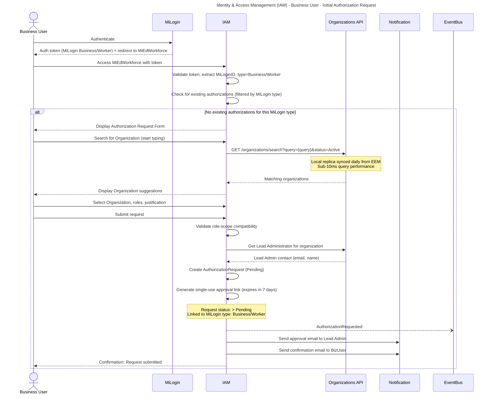
```mermaid
---
title: Identity & Access Management (IAM) - Business User - Initial Authorization Request
---
sequenceDiagram
    actor BizUser as Business User
    participant MiLogin
    participant IAM
    participant OrgsAPI as Organizations API
    participant Notification
    participant EventBus

    BizUser->>MiLogin: Authenticate
    MiLogin-->>BizUser: Auth token (MiLogin Business/Worker) + redirect to MiEdWorkforce

    BizUser->>IAM: Access MiEdWorkforce with token
    IAM->>IAM: Validate token, extract MiLoginID, type=Business/Worker
    IAM->>IAM: Check for existing authorizations (filtered by MiLogin type)

    alt No existing authorizations for this MiLogin type
        IAM-->>BizUser: Display Authorization Request Form

        BizUser->>IAM: Search for Organization (start typing)
        IAM->>OrgsAPI: GET /organizations/search?query={query}&status=Active
        Note over OrgsAPI: Local replica synced daily from EEM<br/>Sub-10ms query performance
        OrgsAPI-->>IAM: Matching organizations
        IAM-->>BizUser: Display Organization suggestions

        BizUser->>IAM: Select Organization, roles, justification
        BizUser->>IAM: Submit request

        IAM->>IAM: Validate role-scope compatibility
        IAM->>OrgsAPI: Get Lead Administrator for organization
        OrgsAPI-->>IAM: Lead Admin contact (email, name)

        IAM->>IAM: Create AuthorizationRequest (Pending)
        IAM->>IAM: Generate single-use approval link (expires in 7 days)

        Note over IAM: Request status: > Pending<br/>Linked to MiLogin type: Business/Worker

        IAM--)EventBus: AuthorizationRequested
        IAM->>Notification: Send approval email to Lead Admin
        IAM->>Notification: Send confirmation email to BizUser

        IAM-->>BizUser: Confirmation: Request submitted
    end
```

**Key Decisions:**
- **Organization search:** Predictive search with debouncing; calls Organizations API typeahead endpoint
- **Approval routing:** Lead Admin email retrieved from Organizations API and cached by IAM keyed by org code; see IAM Technical Considerations for unmasked email caching strategy
- **Link expiration:** 7-day default (configurable by System Admin via InactivityPolicy-like config)
- **MiLogin context:** Authorization request tied to Business or Worker identity type

**State Changes:**
- AuthorizationRequest status: `None` > `Pending`

**Events Published:**
- `AuthorizationRequested` - Fires when user submits request

**Error Scenarios:**
- Invalid Organization code > Form validation error
- Role not applicable to scope > Form validation error
- Organizations API unavailable > Display error, allow retry; IAM serves from org-data cache if available

---

## Lead Administrator Bootstrap (First Login)

**What:** When a user designated as Lead Administrator in EEM authenticates for the first time, they are automatically granted approval permissions  
**When:** First login after being designated as Lead Admin in EEM  
**Who:** Lead Administrator per EEM data

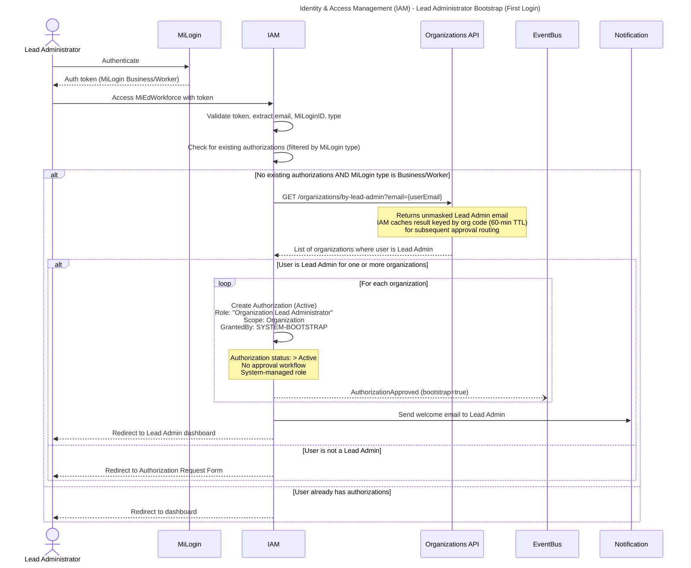
```mermaid
---
title: Identity & Access Management (IAM) - Lead Administrator Bootstrap (First Login)
---
sequenceDiagram
    actor LeadAdmin as Lead Administrator
    participant MiLogin
    participant IAM
    participant OrgsAPI as Organizations API
    participant EventBus
    participant Notification

    LeadAdmin->>MiLogin: Authenticate
    MiLogin-->>LeadAdmin: Auth token (MiLogin Business/Worker)

    LeadAdmin->>IAM: Access MiEdWorkforce with token
    IAM->>IAM: Validate token, extract email, MiLoginID, type
    IAM->>IAM: Check for existing authorizations (filtered by MiLogin type)

    alt No existing authorizations AND MiLogin type is Business/Worker
        IAM->>OrgsAPI: GET /organizations/by-lead-admin?email={userEmail}
        Note over OrgsAPI: Returns unmasked Lead Admin email<br/>IAM caches result keyed by org code (60-min TTL)<br/>for subsequent approval routing
        OrgsAPI-->>IAM: List of organizations where user is Lead Admin

        alt User is Lead Admin for one or more organizations
            loop For each organization
                IAM->>IAM: Create Authorization (Active)<br/>Role: "Organization Lead Administrator"<br/>Scope: Organization<br/>GrantedBy: SYSTEM-BOOTSTRAP

                Note over IAM: Authorization status: > Active<br/>No approval workflow<br/>System-managed role

                IAM--)EventBus: AuthorizationApproved (bootstrap=true)
            end

            IAM->>Notification: Send welcome email to Lead Admin
            IAM-->>LeadAdmin: Redirect to Lead Admin dashboard
        else User is not a Lead Admin
            IAM-->>LeadAdmin: Redirect to Authorization Request Form
        end
    else User already has authorizations
        IAM-->>LeadAdmin: Redirect to dashboard
    end
```

**Key Decisions:**
- **Auto-grant:** System automatically grants "Organization Lead Administrator" role
- **Organizations API as source of truth:** Email match against Lead Admin data synced from EEM via CEPI; IAM calls `GET /organizations/by-lead-admin` and caches the unmasked email per org code for approval routing use
- **Multiple Organizations:** One person can be Lead Admin for multiple Organizations (receives role for each)
- **No revocation on change:** If EEM LeadAdmin changes, existing authorization is NOT automatically revoked

**State Changes:**
- Authorization status: `None` > `Active` (bypasses Pending)

**Events Published:**
- `AuthorizationApproved` with `grantedBy: "SYSTEM-BOOTSTRAP"`

---

## Scope Approver - Approves Authorization Request

**What:** Lead Administrator reviews authorization request and approves it (optionally modifying roles)  
**When:** Lead Admin clicks approval link in email notification  
**Who:** Scope Authorization Approver (Lead Administrator per EEM)

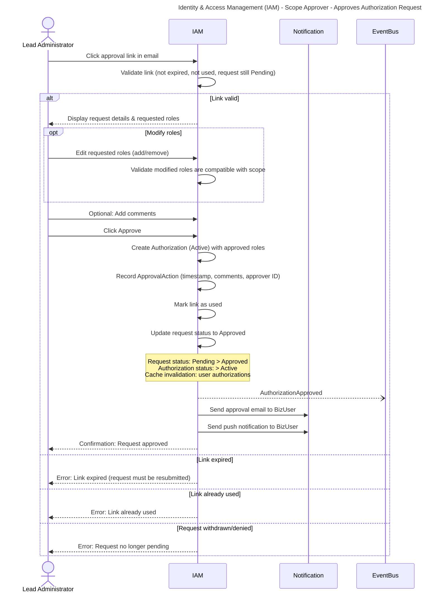
```mermaid
---
title: Identity & Access Management (IAM) - Scope Approver - Approves Authorization Request
---
sequenceDiagram
    actor LeadAdmin as Lead Administrator
    participant IAM
    participant Notification
    participant EventBus

    LeadAdmin->>IAM: Click approval link in email
    IAM->>IAM: Validate link (not expired, not used, request still Pending)

    alt Link valid
        IAM-->>LeadAdmin: Display request details & requested roles

        opt Modify roles
            LeadAdmin->>IAM: Edit requested roles (add/remove)
            IAM->>IAM: Validate modified roles are compatible with scope
        end

        LeadAdmin->>IAM: Optional: Add comments
        LeadAdmin->>IAM: Click Approve

        IAM->>IAM: Create Authorization (Active) with approved roles
        IAM->>IAM: Record ApprovalAction (timestamp, comments, approver ID)
        IAM->>IAM: Mark link as used
        IAM->>IAM: Update request status to Approved

        Note over IAM: Request status: Pending > Approved<br/>Authorization status: > Active<br/>Cache invalidation: user authorizations

        IAM--)EventBus: AuthorizationApproved
        IAM->>Notification: Send approval email to BizUser
        IAM->>Notification: Send push notification to BizUser

        IAM-->>LeadAdmin: Confirmation: Request approved
    else Link expired
        IAM-->>LeadAdmin: Error: Link expired (request must be resubmitted)
    else Link already used
        IAM-->>LeadAdmin: Error: Link already used
    else Request withdrawn/denied
        IAM-->>LeadAdmin: Error: Request no longer pending
    end
```

**Key Decisions:**
- **Role modification:** Lead Admin can adjust roles before approval (grant fewer or different roles than requested)
- **Single-use link:** Once actioned (approve/deny), link cannot be reused
- **Cache invalidation:** User authorization cache is cleared on approval

**State Changes:**
- AuthorizationRequest status: `Pending` > `Approved`
- Authorization status: `None` > `Active`

**Events Published:**
- `AuthorizationApproved` - Fires when Lead Admin approves request

**Error Scenarios:**
- Expired link > User must resubmit request
- Link already used > Display error
- Request withdrawn > Cannot approve

---

## Scope Approver - Rejects Authorization Request

**What:** Lead Administrator denies authorization request with optional comments  
**When:** Lead Admin clicks approval link and chooses to deny  
**Who:** Scope Authorization Approver (Lead Administrator per EEM)

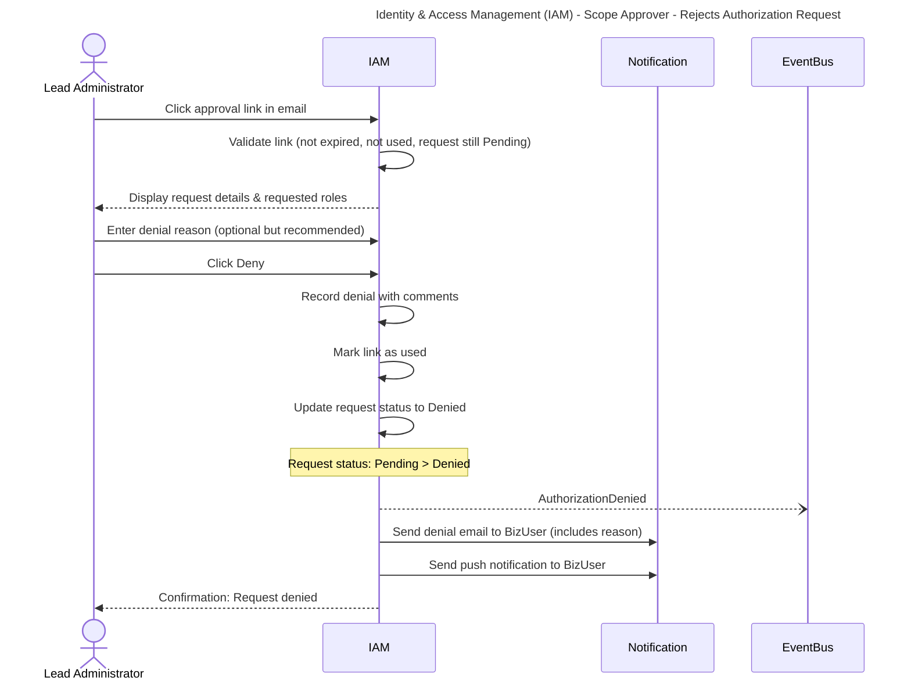
```mermaid
---
title: Identity & Access Management (IAM) - Scope Approver - Rejects Authorization Request
---
sequenceDiagram
    actor LeadAdmin as Lead Administrator
    participant IAM
    participant Notification
    participant EventBus

    LeadAdmin->>IAM: Click approval link in email
    IAM->>IAM: Validate link (not expired, not used, request still Pending)

    IAM-->>LeadAdmin: Display request details & requested roles

    LeadAdmin->>IAM: Enter denial reason (optional but recommended)
    LeadAdmin->>IAM: Click Deny

    IAM->>IAM: Record denial with comments
    IAM->>IAM: Mark link as used
    IAM->>IAM: Update request status to Denied

    Note over IAM: Request status: Pending > Denied

    IAM--)EventBus: AuthorizationDenied
    IAM->>Notification: Send denial email to BizUser (includes reason)
    IAM->>Notification: Send push notification to BizUser

    IAM-->>LeadAdmin: Confirmation: Request denied
```

**Key Decisions:**
- **Denial reason:** Optional but recommended for user clarity
- **No authorization created:** User must submit new request if denied

**State Changes:**
- AuthorizationRequest status: `Pending` > `Denied`

**Events Published:**
- `AuthorizationDenied` - Fires when Lead Admin denies request

**Error Scenarios:**
- User must resubmit entirely new request if denied

---

## Business User - Withdraws Pending Authorization Request

**What:** Business user cancels their own pending authorization request  
**When:** User changes mind before Lead Admin takes action  
**Who:** Business User

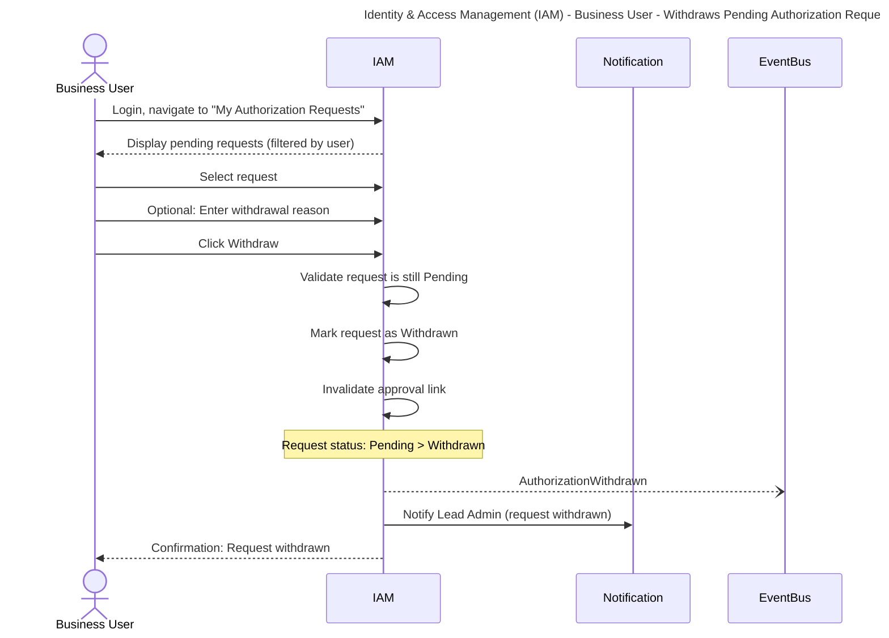
```mermaid
---
title: Identity & Access Management (IAM) - Business User - Withdraws Pending Authorization Request
---
sequenceDiagram
    actor BizUser as Business User
    participant IAM
    participant Notification
    participant EventBus

    BizUser->>IAM: Login, navigate to "My Authorization Requests"
    IAM-->>BizUser: Display pending requests (filtered by user)

    BizUser->>IAM: Select request
    BizUser->>IAM: Optional: Enter withdrawal reason
    BizUser->>IAM: Click Withdraw

    IAM->>IAM: Validate request is still Pending
    IAM->>IAM: Mark request as Withdrawn
    IAM->>IAM: Invalidate approval link

    Note over IAM: Request status: Pending > Withdrawn

    IAM--)EventBus: AuthorizationWithdrawn
    IAM->>Notification: Notify Lead Admin (request withdrawn)

    IAM-->>BizUser: Confirmation: Request withdrawn
```

**Key Decisions:**
- **Link invalidation:** Lead Admin's approval link becomes invalid when user withdraws
- **No re-activation:** Withdrawn requests cannot be re-activated; user must submit new request

**State Changes:**
- AuthorizationRequest status: `Pending` > `Withdrawn`

**Events Published:**
- `AuthorizationWithdrawn` - Fires when user withdraws request

**Error Scenarios:**
- Attempt to withdraw non-Pending request > Error message

---

## Authorization Request - Link Expiration

**What:** Automated expiration of approval links after configured timeout  
**When:** Scheduled job runs (e.g., nightly) and identifies expired requests  
**Who:** System (automated)

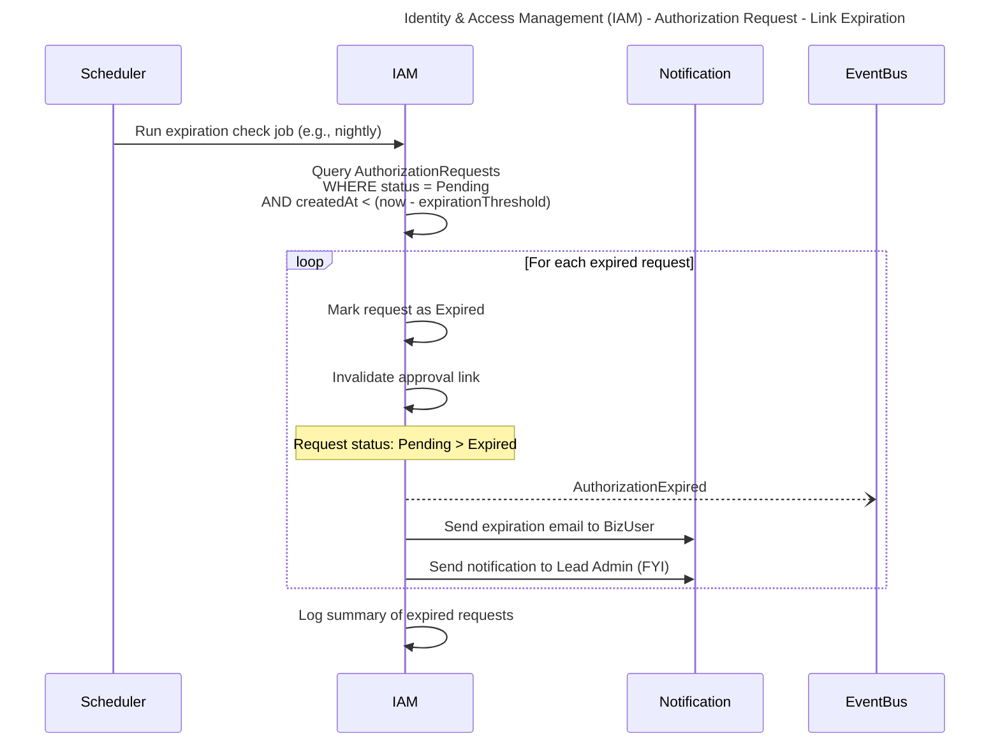
```mermaid
---
title: Identity & Access Management (IAM) - Authorization Request - Link Expiration
---
sequenceDiagram
    participant Scheduler
    participant IAM
    participant Notification
    participant EventBus

    Scheduler->>IAM: Run expiration check job (e.g., nightly)
    IAM->>IAM: Query AuthorizationRequests<br/>WHERE status = Pending<br/>AND createdAt < (now - expirationThreshold)

    loop For each expired request
        IAM->>IAM: Mark request as Expired
        IAM->>IAM: Invalidate approval link

        Note over IAM: Request status: Pending > Expired

        IAM--)EventBus: AuthorizationExpired
        IAM->>Notification: Send expiration email to BizUser
        IAM->>Notification: Send notification to Lead Admin (FYI)
    end

    IAM->>IAM: Log summary of expired requests
```

**Key Decisions:**
- **Expiration threshold:** 7 days by default (configurable via system settings)
- **Notification:** Both user and Lead Admin notified when request expires
- **No auto-extend:** User must resubmit new request if expired

**State Changes:**
- AuthorizationRequest status: `Pending` > `Expired`

**Events Published:**
- `AuthorizationExpired` - Fires when request expires

---

## Business User - Request Authorization Update

**What:** User adds new roles or Organization to existing authorization  
**When:** User needs expanded access  
**Who:** Business User with existing active authorization

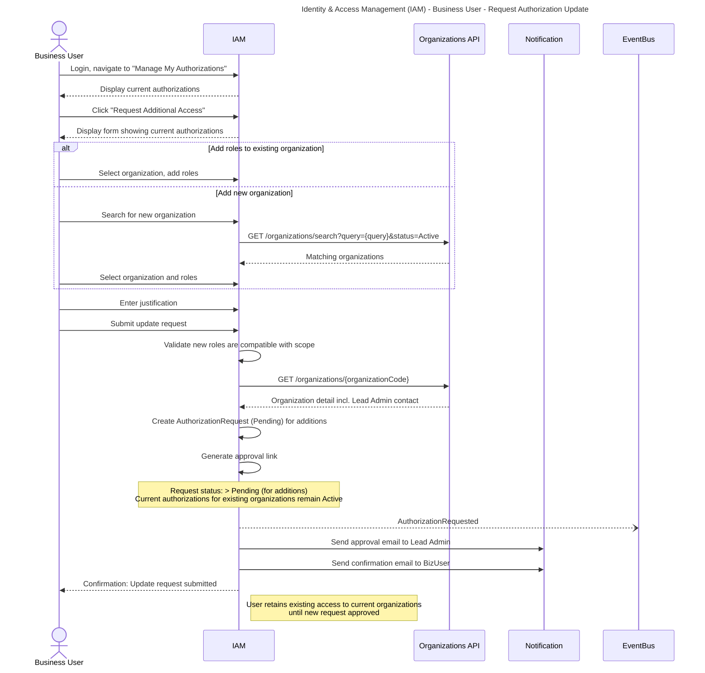
```mermaid
---
title: Identity & Access Management (IAM) - Business User - Request Authorization Update
---
sequenceDiagram
    actor BizUser as Business User
    participant IAM
    participant OrgsAPI as Organizations API
    participant Notification
    participant EventBus

    BizUser->>IAM: Login, navigate to "Manage My Authorizations"
    IAM-->>BizUser: Display current authorizations

    BizUser->>IAM: Click "Request Additional Access"
    IAM-->>BizUser: Display form showing current authorizations

    alt Add roles to existing organization
        BizUser->>IAM: Select organization, add roles
    else Add new organization
        BizUser->>IAM: Search for new organization
        IAM->>OrgsAPI: GET /organizations/search?query={query}&status=Active
        OrgsAPI-->>IAM: Matching organizations
        BizUser->>IAM: Select organization and roles
    end

    BizUser->>IAM: Enter justification
    BizUser->>IAM: Submit update request

    IAM->>IAM: Validate new roles are compatible with scope
    IAM->>OrgsAPI: GET /organizations/{organizationCode}
    OrgsAPI-->>IAM: Organization detail incl. Lead Admin contact

    IAM->>IAM: Create AuthorizationRequest (Pending) for additions
    IAM->>IAM: Generate approval link

    Note over IAM: Request status: > Pending (for additions)<br/>Current authorizations for existing organizations remain Active

    IAM--)EventBus: AuthorizationRequested
    IAM->>Notification: Send approval email to Lead Admin
    IAM->>Notification: Send confirmation email to BizUser

    IAM-->>BizUser: Confirmation: Update request submitted

    Note right of IAM: User retains existing access to current organizations<br/>until new request approved
```

**Key Decisions:**
- **Approval required:** Even for existing users, new roles/Organization require Lead Admin approval
- **Current access preserved:** User retains existing authorizations during approval process
- **Multiple simultaneous requests:** User can have multiple pending requests for different Organization

**State Changes:**
- AuthorizationRequest status: `None` > `Pending` (for additions)
- Existing Authorization status: remains `Active`

**Events Published:**
- `AuthorizationRequested` - Fires when user submits update request
- `AuthorizationApproved` or `AuthorizationDenied` - Fires when Lead Admin acts on update

---

## Business User - Self-Remove Authorization

**What:** User removes their own authorization for an Organization or role  
**When:** User no longer needs access or leaves position  
**Who:** Business User

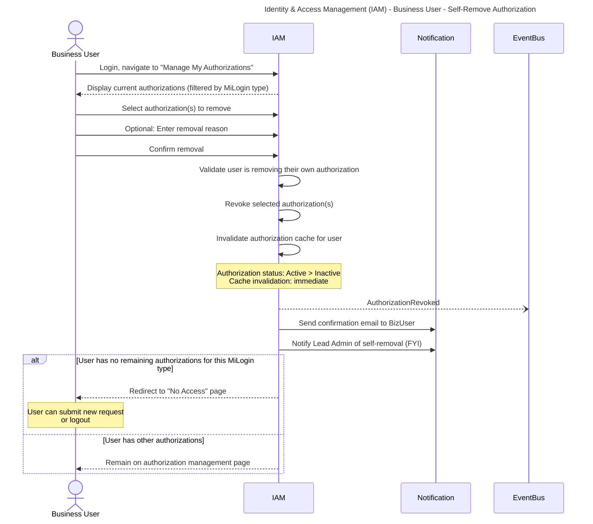
```mermaid
---
title: Identity & Access Management (IAM) - Business User - Self-Remove Authorization
---
sequenceDiagram
    actor BizUser as Business User
    participant IAM
    participant Notification
    participant EventBus

    BizUser->>IAM: Login, navigate to "Manage My Authorizations"
    IAM-->>BizUser: Display current authorizations (filtered by MiLogin type)

    BizUser->>IAM: Select authorization(s) to remove
    BizUser->>IAM: Optional: Enter removal reason
    BizUser->>IAM: Confirm removal

    IAM->>IAM: Validate user is removing their own authorization
    IAM->>IAM: Revoke selected authorization(s)
    IAM->>IAM: Invalidate authorization cache for user

    Note over IAM: Authorization status: Active > Inactive<br/>Cache invalidation: immediate

    IAM--)EventBus: AuthorizationRevoked
    IAM->>Notification: Send confirmation email to BizUser
    IAM->>Notification: Notify Lead Admin of self-removal (FYI)

    alt User has no remaining authorizations for this MiLogin type
        IAM-->>BizUser: Redirect to "No Access" page
        Note over BizUser: User can submit new request<br/>or logout
    else User has other authorizations
        IAM-->>BizUser: Remain on authorization management page
    end
```

**Key Decisions:**
- **Immediate removal:** Self-removal is instant; no approval needed
- **Lead Admin notified:** Admin is informed but doesn't need to approve
- **MiLogin context:** Only removes authorizations for current MiLogin type

**State Changes:**
- Authorization status: `Active` > `Inactive`

**Events Published:**
- `AuthorizationRevoked` with `revokedBy: userId`, `reason: "self-removal"`

**Error Scenarios:**
- User attempts to remove last authorization > Warning displayed (still allowed)

---

## External Party - Request User Authorization Removal

**What:** Unauthenticated party submits public form to request removal of a user's authorization  
**When:** Ex-supervisor, HR, or other party needs to revoke access for a user  
**Who:** External Requesting Individual (no login required)

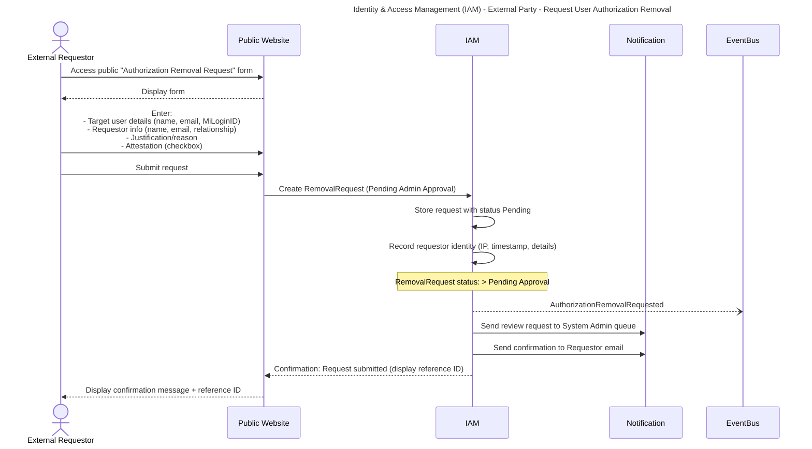
```mermaid
---
title: Identity & Access Management (IAM) - External Party - Request User Authorization Removal
---
sequenceDiagram
    actor Requestor as External Requestor
    participant PublicForm as Public Website
    participant IAM
    participant Notification
    participant EventBus

    Requestor->>PublicForm: Access public "Authorization Removal Request" form
    PublicForm-->>Requestor: Display form

    Requestor->>PublicForm: Enter:<br/>- Target user details (name, email, MiLoginID)<br/>- Requestor info (name, email, relationship)<br/>- Justification/reason<br/>- Attestation (checkbox)
    Requestor->>PublicForm: Submit request

    PublicForm->>IAM: Create RemovalRequest (Pending Admin Approval)
    IAM->>IAM: Store request with status Pending
    IAM->>IAM: Record requestor identity (IP, timestamp, details)

    Note over IAM: RemovalRequest status: > Pending Approval

    IAM--)EventBus: AuthorizationRemovalRequested
    IAM->>Notification: Send review request to System Admin queue
    IAM->>Notification: Send confirmation to Requestor email

    IAM-->>PublicForm: Confirmation: Request submitted (display reference ID)
    PublicForm-->>Requestor: Display confirmation message + reference ID
```

**Key Decisions:**
- **Admin approval required:** External removal requests require System Admin review to prevent abuse
- **No authentication:** Form accessible without login for accessibility (ex-employees may not have access)
- **Requestor identity captured:** IP, timestamp, and contact info stored for accountability

**State Changes:**
- RemovalRequest status: `None` > `Pending Approval`

**Events Published:**
- `AuthorizationRemovalRequested` - Fires when external party submits request

---

## System Admin - Reviews External Authorization Removal Request

**What:** System Admin reviews and approves/denies external authorization removal request  
**When:** After external party submits removal request  
**Who:** System Administrator

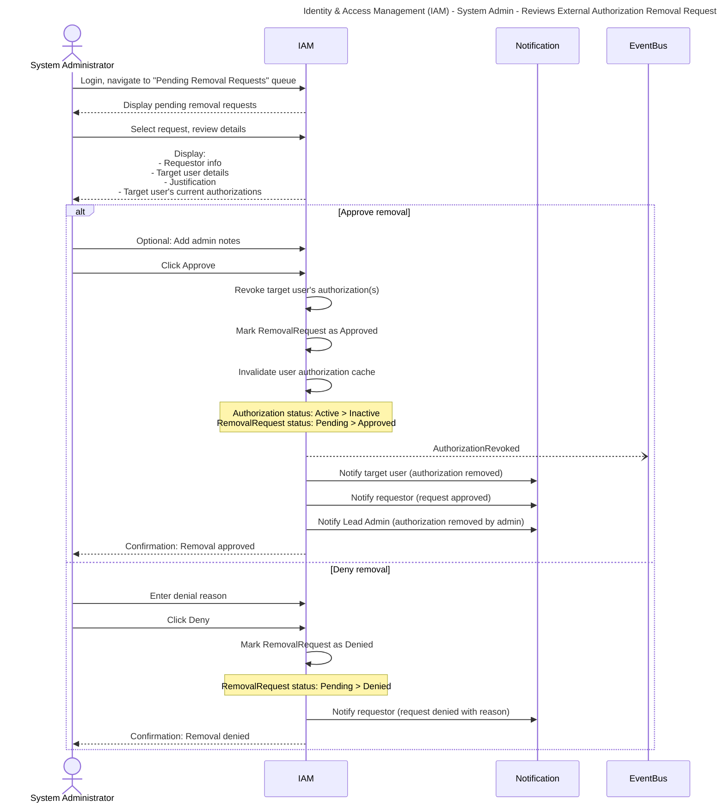
```mermaid
---
title: Identity & Access Management (IAM) - System Admin - Reviews External Authorization Removal Request
---
sequenceDiagram
    actor SysAdmin as System Administrator
    participant IAM
    participant Notification
    participant EventBus

    SysAdmin->>IAM: Login, navigate to "Pending Removal Requests" queue
    IAM-->>SysAdmin: Display pending removal requests

    SysAdmin->>IAM: Select request, review details
    IAM-->>SysAdmin: Display:<br/>- Requestor info<br/>- Target user details<br/>- Justification<br/>- Target user's current authorizations

    alt Approve removal
        SysAdmin->>IAM: Optional: Add admin notes
        SysAdmin->>IAM: Click Approve

        IAM->>IAM: Revoke target user's authorization(s)
        IAM->>IAM: Mark RemovalRequest as Approved
        IAM->>IAM: Invalidate user authorization cache

        Note over IAM: Authorization status: Active > Inactive<br/>RemovalRequest status: Pending > Approved

        IAM--)EventBus: AuthorizationRevoked
        IAM->>Notification: Notify target user (authorization removed)
        IAM->>Notification: Notify requestor (request approved)
        IAM->>Notification: Notify Lead Admin (authorization removed by admin)

        IAM-->>SysAdmin: Confirmation: Removal approved

    else Deny removal
        SysAdmin->>IAM: Enter denial reason
        SysAdmin->>IAM: Click Deny

        IAM->>IAM: Mark RemovalRequest as Denied

        Note over IAM: RemovalRequest status: Pending > Denied

        IAM->>Notification: Notify requestor (request denied with reason)

        IAM-->>SysAdmin: Confirmation: Removal denied
    end
```

**Key Decisions:**
- **Manual review:** System Admin validates legitimacy before revoking access
- **Denial option:** Admin can deny fraudulent or erroneous requests
- **Multi-party notification:** Target user, requestor, and Lead Admin all notified

**State Changes:**
- Authorization status: `Active` > `Inactive` (if approved)
- RemovalRequest status: `Pending Approval` > `Approved` or `Denied`

**Events Published:**
- `AuthorizationRevoked` - Fires when admin approves removal (includes `removedBy: "external-request"`)

**Error Scenarios:**
- Target user not found > Admin can reject request with clarification

---

## Automated Inactivity-Based Account Deactivation

**What:** Scheduled job automatically deactivates user accounts inactive beyond configured threshold  
**When:** Scheduled job runs (e.g., first Friday of month)  
**Who:** System (automated)

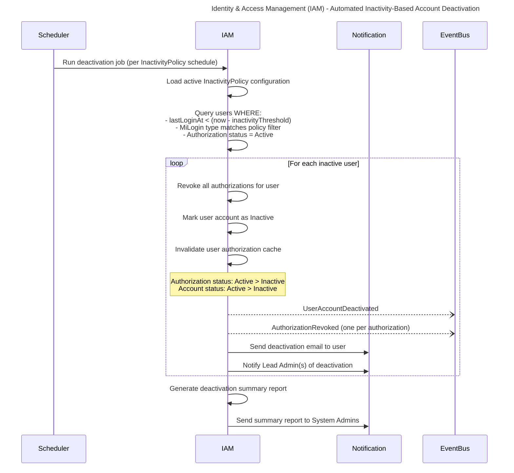
```mermaid
---
title: Identity & Access Management (IAM) - Automated Inactivity-Based Account Deactivation
---
sequenceDiagram
    participant Scheduler
    participant IAM
    participant Notification
    participant EventBus

    Scheduler->>IAM: Run deactivation job (per InactivityPolicy schedule)
    IAM->>IAM: Load active InactivityPolicy configuration
    IAM->>IAM: Query users WHERE:<br/>- lastLoginAt < (now - inactivityThreshold)<br/>- MiLogin type matches policy filter<br/>- Authorization status = Active

    loop For each inactive user
        IAM->>IAM: Revoke all authorizations for user
        IAM->>IAM: Mark user account as Inactive
        IAM->>IAM: Invalidate user authorization cache

        Note over IAM: Authorization status: Active > Inactive<br/>Account status: Active > Inactive

        IAM--)EventBus: UserAccountDeactivated
        IAM--)EventBus: AuthorizationRevoked (one per authorization)
        IAM->>Notification: Send deactivation email to user
        IAM->>Notification: Notify Lead Admin(s) of deactivation
    end

    IAM->>IAM: Generate deactivation summary report
    IAM->>Notification: Send summary report to System Admins
```

**Key Decisions:**
- **Inactivity threshold:** 84 months (7 years) default (configurable via InactivityPolicy)
- **Schedule:** First Friday of month default (configurable via cron expression)
- **Notification:** User and Lead Admins notified after deactivation
- **MiLogin type filter:** Policy can target specific MiLogin types (e.g., only Business accounts)

**State Changes:**
- Authorization status: `Active` > `Inactive` (all authorizations)
- Account status: `Active` > `Inactive`

**Events Published:**
- `UserAccountDeactivated` - Fires for each deactivated account
- `AuthorizationRevoked` - Fires for each revoked authorization

---

## System Admin - Manual Authorization Grant

**What:** System Admin directly grants authorization without approval workflow  
**When:** Emergency access needed or special circumstances (e.g., manual grant for testing)  
**Who:** System Administrator

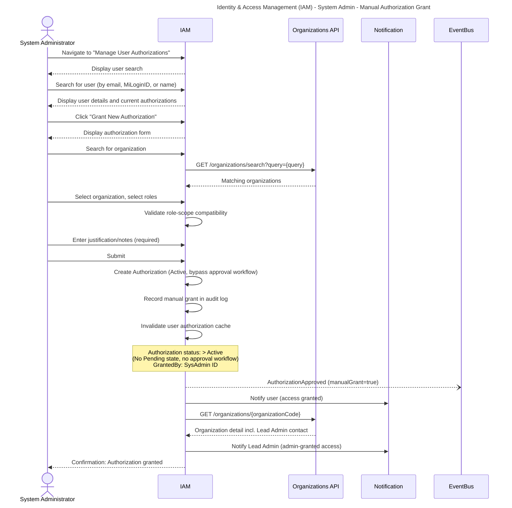
```mermaid
---
title: Identity & Access Management (IAM) - System Admin - Manual Authorization Grant
---
sequenceDiagram
    actor SysAdmin as System Administrator
    participant IAM
    participant OrgsAPI as Organizations API
    participant Notification
    participant EventBus

    SysAdmin->>IAM: Navigate to "Manage User Authorizations"
    IAM-->>SysAdmin: Display user search

    SysAdmin->>IAM: Search for user (by email, MiLoginID, or name)
    IAM-->>SysAdmin: Display user details and current authorizations

    SysAdmin->>IAM: Click "Grant New Authorization"
    IAM-->>SysAdmin: Display authorization form

    SysAdmin->>IAM: Search for organization
    IAM->>OrgsAPI: GET /organizations/search?query={query}
    OrgsAPI-->>IAM: Matching organizations

    SysAdmin->>IAM: Select organization, select roles
    IAM->>IAM: Validate role-scope compatibility

    SysAdmin->>IAM: Enter justification/notes (required)
    SysAdmin->>IAM: Submit

    IAM->>IAM: Create Authorization (Active, bypass approval workflow)
    IAM->>IAM: Record manual grant in audit log
    IAM->>IAM: Invalidate user authorization cache

    Note over IAM: Authorization status: > Active<br/>(No Pending state, no approval workflow)<br/>GrantedBy: SysAdmin ID

    IAM--)EventBus: AuthorizationApproved (manualGrant=true)
    IAM->>Notification: Notify user (access granted)

    IAM->>OrgsAPI: GET /organizations/{organizationCode}
    OrgsAPI-->>IAM: Organization detail incl. Lead Admin contact
    IAM->>Notification: Notify Lead Admin (admin-granted access)

    IAM-->>SysAdmin: Confirmation: Authorization granted
```

**Key Decisions:**
- **Bypass approval:** Admin can directly grant without Lead Admin approval
- **Audit justification:** Admin must provide reason for manual grant (required field)
- **Notification:** User and Lead Admin both notified of admin-granted access
- **Cache invalidation:** User authorization cache cleared immediately

**State Changes:**
- Authorization status: `None` > `Active` (no Pending state)

**Events Published:**
- `AuthorizationApproved` with `grantedBy: adminId`, `manualGrant: true`

**Error Scenarios:**
- Invalid role-scope combination > Validation error
- User not found > Display error

---

## Citizen User - Update Account Demographics

**What:** Citizen User updates their own demographic data, subject to active-employment field locking, and Mi-Key re-matching  
**When:** Citizen navigates to Account Details > Personal Information > Update personal information  
**Who:** Citizen User with an established Unique ID

```mermaid
---
title: Identity & Access Management (IAM) - Citizen User - Update Account Demographics
---
sequenceDiagram
    actor Citizen
    participant IAM
    participant IdentityRes as Identity Resolution
    participant StaffingAPI as Staffing (if active employment)
    participant Notification
    participant EventBus

    Citizen->>IAM: Navigate to Personal Information > Update personal information
    IAM-->>Citizen: Display demographic fields (SSN masked to last 4)

    alt Unique ID associated with active employment
        IAM-->>Citizen: Primary Demographic fields read-only<br/>("contact your district to update")
        Citizen->>IAM: Edit Secondary/Contact fields only
    else No active employment
        Citizen->>IAM: Edit Primary, Secondary, and/or Contact fields<br/>(may also uncheck "No SSN" and supply SSN, if applicable)
    end

    Citizen->>IAM: Agree to Attestation, click Submit
    IAM->>IAM: Validate against Identity Validations rules

    alt Validation fails
        IAM-->>Citizen: Display errors; not sent to Mi-Key, not persisted
    else Validation passes
        IAM->>IAM: Create IdentityResolutionRequest (origin=CitizenSelfService, type=AccountUpdate, PendingMiKeyMatch)
        IAM->>IdentityRes: Submit updated demographic data (Mi-Key Assignment Service)
        IdentityRes->>IdentityRes: Perform Mi-Key probabilistic matching against Master Record

        alt Match (exact or above threshold)
            IdentityRes-->>IAM: Match confirmed; Master Record updated with non-matching fields
            IAM->>IAM: IdentityResolutionRequest.status > Matched
            IAM--)EventBus: PersonRecordUpdated
            IAM->>Notification: Notify citizen: update successful (fields not itemized)
            opt Active employment AND Secondary fields changed
                IAM--)EventBus: PersonRecordUpdated (affectsActiveEmployment=true)
                Notification->>StaffingAPI: Notify employing district(s) of update
            end
        else Near Match
            IAM->>IAM: IdentityResolutionRequest.status > RequiresResolution<br/>Lock Primary + Secondary fields; Contact fields remain editable
            IAM--)EventBus: IdentityResolutionRequiresReview
            IAM->>Notification: Notify citizen: update pending review
            IAM-->>Citizen: Confirmation: update submitted, pending review<br/>(dashboard access NOT blocked)
            Note over IAM: See sequence: Identity Administrator - Resolve Identity Request
        end
    end
```

**Key Decisions:**
- **Active employment gates Primary fields:** If the Unique ID is tied to active employment, Primary Demographic fields (Legal Name, SSN, DOB) are locked; only the employing district can change them (see `staffing-domain.md`)
- **Near Match does not block dashboard access on Update** (unlike Account Creation) — only the pending update itself is held, and Primary/Secondary fields lock until resolved; Contact fields stay editable
- **Self-cancellable:** Per FDD 15.10.4, the citizen retains the ability to cancel a pending Near Match update request (unlike Account Creation, which can only be resolved by an Identity Administrator)

**State Changes:**
- IdentityResolutionRequest status: `None` > `PendingMiKeyMatch` > `Matched` | `RequiresResolution`

**Events Published:**
- `PersonRecordUpdated` - Fires on successful Match
- `IdentityResolutionRequiresReview` - Fires on Near Match

**Error Scenarios:**
- Validation failure > user corrects or cancels
- Mi-Key unavailable > error displayed, retry allowed

---

## Citizen User - Cancel Pending Update Request

**What:** Citizen cancels their own pending Account Update request while it is `RequiresResolution`  
**When:** Citizen views request status in their history and chooses to cancel  
**Who:** Citizen User

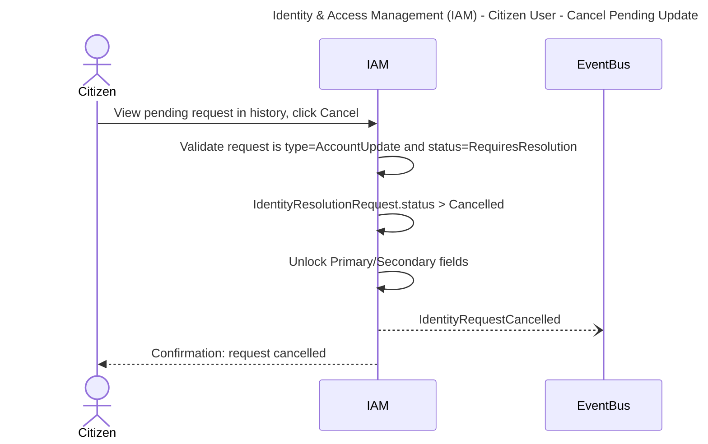
```mermaid
---
title: Identity & Access Management (IAM) - Citizen User - Cancel Pending Update Request
---
sequenceDiagram
    actor Citizen
    participant IAM
    participant EventBus

    Citizen->>IAM: View pending request in history, click Cancel
    IAM->>IAM: Validate request is type=AccountUpdate and status=RequiresResolution
    IAM->>IAM: IdentityResolutionRequest.status > Cancelled
    IAM->>IAM: Unlock Primary/Secondary fields
    IAM--)EventBus: IdentityRequestCancelled
    IAM-->>Citizen: Confirmation: request cancelled
```

**Events Published:**
IdentityRequestCancelled.

**Error Scenarios:**
- Attempt to cancel an AccountCreation-type request > Rejected; only Identity Administrator can resolve those
- Attempt to cancel a request no longer `RequiresResolution` > Error message

---

## Identity Administrator - Resolve Identity Request

**What:** Identity Administrator reviews a "Requires Resolution" item — a Near Match  
(Account Creation, Account Update, or business-user New ID escalation) or a Link ID
request — and resolves it. This is the single resolution workflow for identity requests
of any origin; there is one review queue (the domain's own filtered list of
`RequiresResolution` items), not a separate one per requesting domain.
**When:** Item appears in the list of identity resolution requests requiring review  
(`GET /identity-resolution/requests?status=RequiresResolution`)
**Who:** Identity Administrator

```mermaid
---
title: Identity & Access Management (IAM) - Identity Administrator - Resolve Identity Request
---
sequenceDiagram
    actor IdAdmin as Identity Administrator
    participant IAM
    participant IdentityRes as Identity Resolution
    participant StaffingAPI as Staffing
    participant Notification
    participant EventBus

    IdAdmin->>IAM: Open list of identity resolution requests requiring review
    IAM-->>IdAdmin: Display "Requires Resolution" items (Unresolved tab; any origin/type)
    IdAdmin->>IAM: Select item
    IAM-->>IdAdmin: Display submitted data alongside Mi-Key potential match(es), or Link ID's primary/secondary record comparison

    alt requestType = AccountCreation | AccountUpdate | NewId
        alt Match - associate with existing Unique ID
            IdAdmin->>IAM: Select "Match", choose existing Unique ID
            IAM->>IdentityRes: Resolve near match: use existing Unique ID
            IdentityRes-->>IAM: Confirmed
            IAM->>IAM: IdentityResolutionRequest.status > Resolved (resolutionOutcome=Match)
        else Create New - no true match
            IdAdmin->>IAM: Select "Create New"
            IAM->>IdentityRes: Resolve near match: create new Unique ID
            IdentityRes-->>IAM: New Unique ID returned
            IAM->>IAM: IdentityResolutionRequest.status > Resolved (resolutionOutcome=CreateNew)
        else Deny/Cancel - submission invalid
            IdAdmin->>IAM: Select "Cancel"/"Deny", enter explanatory notes
            IAM->>IAM: IdentityResolutionRequest.status > Cancelled|Denied (resolutionOutcome=Cancel)
        end

        IAM--)EventBus: IdentityResolutionCompleted (or IdentityRequestDenied)
        IAM->>Notification: Notify requester of outcome (email + on-screen)

        alt Request origin = CitizenSelfService, type = AccountCreation, outcome != Cancel
            IAM->>IAM: Auto-create Individual scope authorization (see Initial Sign-In sequence)
            IAM--)EventBus: NewCitizenUserAuthorized
        else Request origin = CitizenSelfService, type = AccountUpdate, outcome = Match/CreateNew
            IAM->>IAM: Apply the previously-held update to the Person Record
            IAM--)EventBus: PersonRecordUpdated
            opt Active employment
                Notification->>StaffingAPI: Notify employing district(s)
            end
        else Request origin = BusinessUserStaffing, type = NewId, outcome = CreateNew
            StaffingAPI->>StaffingAPI: Attach assignedUniqueId to EmployeeRoster record (on IdentityResolutionCompleted)
        end

    else requestType = LinkId
        alt Approve - Mi-Key merges secondary into primary
            IdAdmin->>IAM: Select "Approve Link"
            IAM->>IdentityRes: Retire secondary Unique ID, merge into primary
            IdentityRes-->>IAM: Merge confirmed
            IAM->>IAM: IdentityResolutionRequest.status > Resolved (resolutionOutcome=ApproveLink)
            IAM--)EventBus: IdentityResolutionCompleted
            StaffingAPI->>StaffingAPI: Merge all associated data (employment history, credentials) to primary Unique ID
            Notification->>StaffingAPI: Notify requesting district, any citizen account, and any other district reporting either ID
        else Deny
            IdAdmin->>IAM: Select "Deny", enter denial reason
            IAM->>IAM: IdentityResolutionRequest.status > Denied
            IAM--)EventBus: IdentityRequestDenied
            Notification->>StaffingAPI: Notify requesting district of denial reason
        end
    end

    IAM-->>IdAdmin: Confirmation: request resolved
```

**Key Decisions:**
- **No candidate data shown to a citizen at any point** for their own request (see Near Match Resolution rule in `iam-domain.md`); business-user requesters do see candidate data for their own submissions (see Business User Near Match Self-Resolution rule)
- **Explanatory notes required on Cancel/Deny:** the admin must provide notes the requester receives, distinguishing a deliberate denial from a silent one
- **List shape:** displays Unresolved / Resolved tabs (backed by the `status` filter on the domain's own request list endpoint), spanning every request type and origin; Resolved tab is filterable by outcome for historical review

**State Changes:**
- IdentityResolutionRequest status: `RequiresResolution` > `Resolved` | `Denied` | `Cancelled`
- Authorization status: `None` > `Active` (CitizenSelfService AccountCreation, non-Cancel outcomes only)

**Events Published:**
- `IdentityResolutionCompleted` or `IdentityRequestDenied`
- `NewCitizenUserAuthorized` (CitizenSelfService AccountCreation) or `PersonRecordUpdated` (AccountUpdate)

**Error Scenarios:**
- Mi-Key unavailable during resolution call > error displayed, retry allowed; item remains `RequiresResolution` in the list

---

## Business User - Request New ID (Near Match Escalation)

**What:** A district user adding a new employee (or, via Staffing's own flow, updating an  
employee's demographics) triggers Mi-Key identity resolution through IAM; on a Near Match
they review the candidate(s) and either self-resolve or escalate for Identity
Administrator review.
**When:** During Staffing's "Add New Employee" workflow, after Staffing submits the  
employee's demographic data to IAM for identity resolution.
**Who:** Staffing Authorized User (School District role)

```mermaid
---
title: Identity & Access Management (IAM) - Business User - Request New ID (Near Match Escalation)
---
sequenceDiagram
    actor DistrictUser
    participant StaffingAPI
    participant IAM
    participant IdentityRes as Identity Resolution
    participant CommAPI
    participant EventBus

    Note over StaffingAPI,IAM: Staffing has already created the employee record (status: Pending) and validated demographics locally

    StaffingAPI->>IAM: POST /identity-resolution/requests (origin=BusinessUserStaffing, type=NewId, employeeRecordId, demographics)
    IAM->>IAM: Create IdentityResolutionRequest (PendingMiKeyMatch)
    IAM->>IdentityRes: Submit demographic payload (Mi-Key Assignment Service)

    alt Mi-Key returns Match
        IdentityRes-->>IAM: 200 OK {uniqueId, matchScore}
        IAM->>IAM: IdentityResolutionRequest.status > Matched
        IAM--)EventBus: IdentityResolutionCompleted (resolutionOutcome=Match, assignedUniqueId)
        IAM-->>StaffingAPI: 200 OK {requestId, status: Matched, uniqueId}
    else Mi-Key returns No Match (New ID Created)
        IdentityRes-->>IAM: 201 Created {newUniqueId}
        IAM->>IAM: IdentityResolutionRequest.status > NoMatchCreated
        IAM--)EventBus: IdentityResolutionCompleted (resolutionOutcome=CreateNew, assignedUniqueId)
        IAM-->>StaffingAPI: 201 Created {requestId, status: NoMatchCreated, uniqueId}
    else Mi-Key returns Near Match
        IdentityRes-->>IAM: 202 Accepted {potentialMatches[]}
        IAM->>IAM: IdentityResolutionRequest.status > RequiresResolution
        IAM-->>StaffingAPI: 202 Accepted {requestId, potentialMatches[]}
        StaffingAPI-->>DistrictUser: Show near-match resolution screen (backed by IAM)

        alt District user selects existing potential match (self-resolve)
            DistrictUser->>IAM: POST /identity-resolution/requests/{requestId}/resolve (selectedUniqueId)
            IAM->>IdentityRes: Confirm match (submittedData, selectedUniqueId)
            IdentityRes-->>IAM: 200 OK {confirmedUniqueId}
            IAM->>IAM: IdentityResolutionRequest.status > Resolved (self_resolved=true)
            IAM--)EventBus: IdentityResolutionCompleted (resolutionOutcome=Match, assignedUniqueId)
            IAM-->>DistrictUser: 200 OK {uniqueId}

        else District user rejects all potentials, escalates
            DistrictUser->>IAM: POST /identity-resolution/requests/{requestId}/escalate (justificationText)
            IAM->>IAM: IdentityResolutionRequest remains RequiresResolution; now appears in the Identity Administrator review list
            IAM--)EventBus: IdentityResolutionRequiresReview
            IAM--)CommAPI: Publish notification event
            IAM-->>DistrictUser: 202 Accepted (pending Identity Administrator review)

            Note over IAM: See sequence: Identity Administrator - Resolve Identity Request

            IAM--)EventBus: IdentityResolutionCompleted (resolutionOutcome=CreateNew) or IdentityRequestDenied
            CommAPI--)DistrictUser: Email notification of outcome
        end
    end

    Note over StaffingAPI: On IdentityResolutionCompleted, Staffing attaches assignedUniqueId to the EmployeeRoster record (see staffing-sequences.md)
```

**Key Decisions:**
- Staffing never calls Mi-Key directly; every identity resolution request — regardless of which domain triggers it — flows through IAM's `IdentityResolutionRequest`
- District user has final decision on match selection and can self-resolve without Identity Administrator involvement, unlike a citizen; Identity Administrator involvement is required only when the user cannot find a correct match among Mi-Key's potentials
- Staffing consumes `IdentityResolutionCompleted` (or `IdentityRequestDenied`) asynchronously to update its own `EmployeeRoster` record; it does not poll or hold local matching state

**State Changes:**
- IdentityResolutionRequest: `None` > `PendingMiKeyMatch` > `Matched` | `NoMatchCreated` | `RequiresResolution` > `Resolved` | `Denied`
- EmployeeRoster.unique_id (staffing, on completion): `NULL` > assigned Unique ID

**Events Published:**
- `IdentityResolutionRequiresReview` - Notifies Identity Administrators that a new item requires review
- `IdentityResolutionCompleted` - Notifies Staffing that a Unique ID has been assigned
- `IdentityRequestDenied` - Notifies Staffing/district user that the Identity Administrator denied the new-ID request

**Error Scenarios:**
- District user selects potential match but Mi-Key confirm fails > 500 Internal Server Error, user retries
- Identity Administrator denies new ID > `IdentityRequestDenied`; district user reviews potential matches again or contacts support
- District user closes resolution screen without action > Employee record remains Pending; user must return to complete

---

## Business User - Request Link ID

**What:** A district user requests that two Unique IDs believed to represent the same  
person be merged, with a required justification. The request is always resolved by an
Identity Administrator.
**When:** District user, viewing an employee record, identifies what appears to be a  
duplicate Unique ID for the same individual.
**Who:** Staffing Authorized User (School District role); Identity Administrator

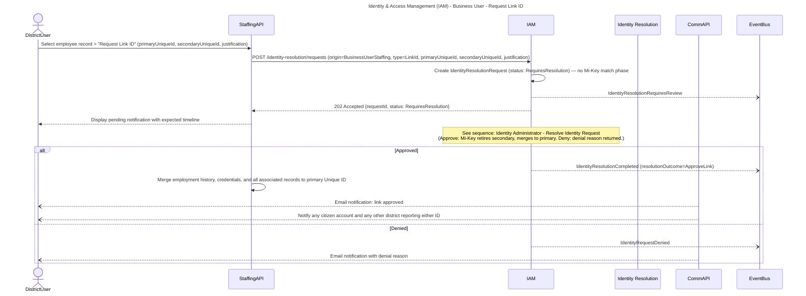
```mermaid
---
title: Identity & Access Management (IAM) - Business User - Request Link ID
---
sequenceDiagram
    actor DistrictUser
    participant StaffingAPI
    participant IAM
    participant IdentityRes as Identity Resolution
    participant CommAPI
    participant EventBus

    DistrictUser->>StaffingAPI: Select employee record > "Request Link ID" (primaryUniqueId, secondaryUniqueId, justification)
    StaffingAPI->>IAM: POST /identity-resolution/requests (origin=BusinessUserStaffing, type=LinkId, primaryUniqueId, secondaryUniqueId, justification)
    IAM->>IAM: Create IdentityResolutionRequest (status: RequiresResolution) — no Mi-Key match phase
    IAM--)EventBus: IdentityResolutionRequiresReview
    IAM-->>StaffingAPI: 202 Accepted {requestId, status: RequiresResolution}
    StaffingAPI-->>DistrictUser: Display pending notification with expected timeline

    Note over IAM: See sequence: Identity Administrator - Resolve Identity Request<br/>(Approve: Mi-Key retires secondary, merges to primary. Deny: denial reason returned.)

    alt Approved
        IAM--)EventBus: IdentityResolutionCompleted (resolutionOutcome=ApproveLink)
        StaffingAPI->>StaffingAPI: Merge employment history, credentials, and all associated records to primary Unique ID
        CommAPI--)DistrictUser: Email notification: link approved
        CommAPI--)DistrictUser: Notify any citizen account and any other district reporting either ID
    else Denied
        IAM--)EventBus: IdentityRequestDenied
        CommAPI--)DistrictUser: Email notification with denial reason
    end
```

**Key Decisions:**
- Link ID requests skip the Mi-Key match phase entirely — the requester already names the two candidate IDs — and always require Identity Administrator judgment (see Link ID Resolution rule, `iam-domain.md`)
- Only one ID pair is merged per approved request
- Staffing owns the post-merge data-migration mechanics (employment history, credentials); IAM owns only the request/approval lifecycle and the Mi-Key merge call itself

**State Changes:**
- IdentityResolutionRequest: `None` > `RequiresResolution` > `Resolved` | `Denied`

**Events Published:**
- `IdentityResolutionRequiresReview` - Notifies Identity Administrators that a new item requires review
- `IdentityResolutionCompleted` - Notifies Staffing to begin data merge
- `IdentityRequestDenied` - Notifies requesting district user

**Error Scenarios:**
- Mi-Key merge fails after admin approval > System retries or escalates to support; request remains `Resolved` pending merge completion
- Requester submits without justification > 400 Bad Request

---

## Identity Resolution - Split/Retire ID (Mi-Key-Direct)

**What:** An Identity Administrator splits or retires a Unique ID directly in Mi-Key  
(outside MiEdWorkforce); MiEdWorkforce receives the resulting callback/event and updates
affected records accordingly. Per FDD 15.6/15.11's Addendum, neither action has a
business-user-facing submission path in MiEdWorkforce.
**When:** Identity Administrator determines, via Mi-Key or a Help Desk ticket, that a  
Unique ID represents multiple individuals (Split) or should no longer be used (Retire).
**Who:** Identity Administrator (acting directly in Mi-Key)

```mermaid
---
title: Identity & Access Management (IAM) - Identity Resolution - Split/Retire ID (Mi-Key-Direct)
---
sequenceDiagram
    actor IdAdmin as Identity Administrator
    participant MiKey as Mi-Key (external)
    participant IAM
    participant StaffingAPI
    participant EventBus

    IdAdmin->>MiKey: Split or Retire Unique ID directly in Mi-Key
    MiKey--)IAM: Callback: IdentityRecordSplit or IdentityRecordRetired

    alt Split
        IAM--)EventBus: IdentityRecordSplit (originalUniqueId, newUniqueIds[])
    else Retire
        IAM--)EventBus: IdentityRecordRetired (retiredUniqueId, replacementUniqueId?)
    end

    StaffingAPI->>StaffingAPI: Update EMPLOYEE_ROSTER.unique_id references; flag retired IDs so search/submission reject them
```

**Key Decisions:**
- No `IdentityResolutionRequest` is created for Split or Retire — there is no MiEdWorkforce-side request/approval workflow to model, only the resulting event
- A Retired Unique ID must be rejected if submitted anywhere in MiEdWorkforce afterward, and search results must surface the retired status and the new Primary ID (staffing's responsibility on consuming these events)

**Events Published:**
- `IdentityRecordSplit`, `IdentityRecordRetired`

**Error Scenarios:**
- Callback not received (Mi-Key/MiEdWorkforce integration failure) > Records remain unsynchronized until reconciliation; tracked as an operational concern, not a functional gap

---

## Integration Flows

**What:** Authenticate user and obtain identity claims via OIDC, then route to dashboard, authorization request form, or identity resolution depending on existing authorizations and MiLogin type.  
**When:** User clicks 'Login' on MiEdWorkforce.  
**Who:** any user (Citizen/Business/Worker).

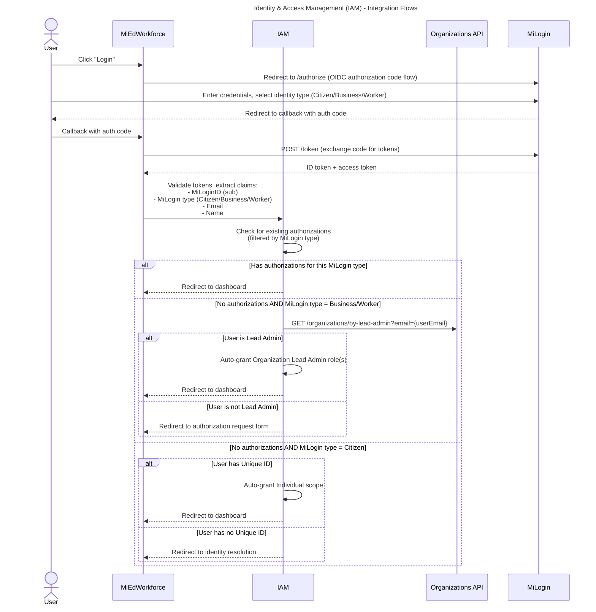
```mermaid
---
title: Identity & Access Management (IAM) - Integration Flows
---
sequenceDiagram
    actor User
    participant App as MiEdWorkforce
    participant IAM
    participant OrgsAPI as Organizations API
    participant MiLogin

    User->>App: Click "Login"
    App->>MiLogin: Redirect to /authorize (OIDC authorization code flow)
    User->>MiLogin: Enter credentials, select identity type (Citizen/Business/Worker)
    MiLogin-->>User: Redirect to callback with auth code

    User->>App: Callback with auth code
    App->>MiLogin: POST /token (exchange code for tokens)
    MiLogin-->>App: ID token + access token

    App->>IAM: Validate tokens, extract claims:<br/>- MiLoginID (sub)<br/>- MiLogin type (Citizen/Business/Worker)<br/>- Email<br/>- Name
    IAM->>IAM: Check for existing authorizations<br/>(filtered by MiLogin type)

    alt Has authorizations for this MiLogin type
        IAM-->>App: Redirect to dashboard
    else No authorizations AND MiLogin type = Business/Worker
        IAM->>OrgsAPI: GET /organizations/by-lead-admin?email={userEmail}
        alt User is Lead Admin
            IAM->>IAM: Auto-grant Organization Lead Admin role(s)
            IAM-->>App: Redirect to dashboard
        else User is not Lead Admin
            IAM-->>App: Redirect to authorization request form
        end
    else No authorizations AND MiLogin type = Citizen
        alt User has Unique ID
            IAM->>IAM: Auto-grant Individual scope
            IAM-->>App: Redirect to dashboard
        else User has no Unique ID
            IAM-->>App: Redirect to identity resolution
        end
    end
```

**Key Decisions:**
OIDC authorization code flow; 30-second timeout for token exchange. Post-authentication routing depends on: whether the user has existing authorizations for their MiLogin type; for Business/Worker with none, whether they are an EEM Lead Admin; for Citizen with none, whether they already have a Unique ID.

**Error Scenarios:**
Display user-friendly error if auth fails; allow retry.

---

## Notes

### UI Context Management (Active Authorization)

**Note:** The "active authorization" concept is a **UI state management concern**, not a backend domain flow.

**How it works:**
- Users with multiple authorizations see a scope selector in the UI (e.g., dropdown showing "District 5 - HR Administrator", "ISD 10 - Staffing Administrator")
- When the user selects a scope, the UI stores this preference (browser local storage or session state)
- All subsequent API requests include the selected scope context via:
  - Header: `X-Organization-Context: district-5` or
  - Query param: `?organization=district-5`
- Backend evaluates permissions based on the scope provided in each request
- Backend does NOT track which scope is "currently active" - it's stateless

**User preference (default scope):**
- Can be stored in user preferences table for convenience (e.g., "last used scope")
- Not a domain invariant; purely UX optimization
- On login, UI can pre-select the last-used scope
