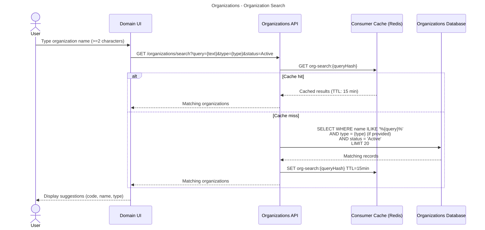
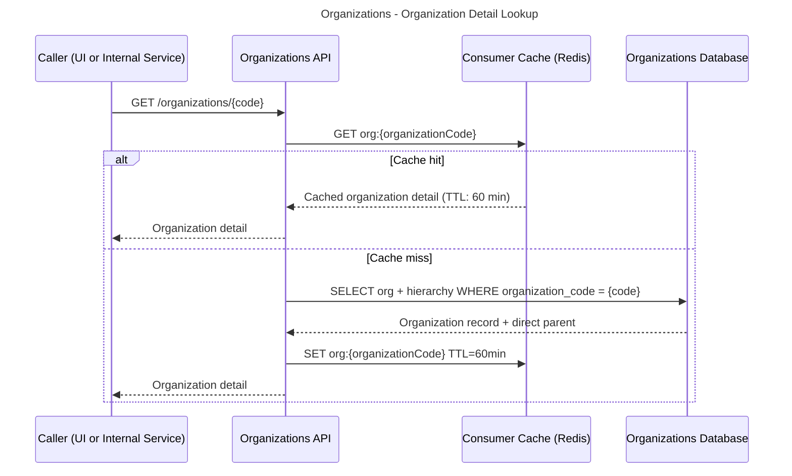
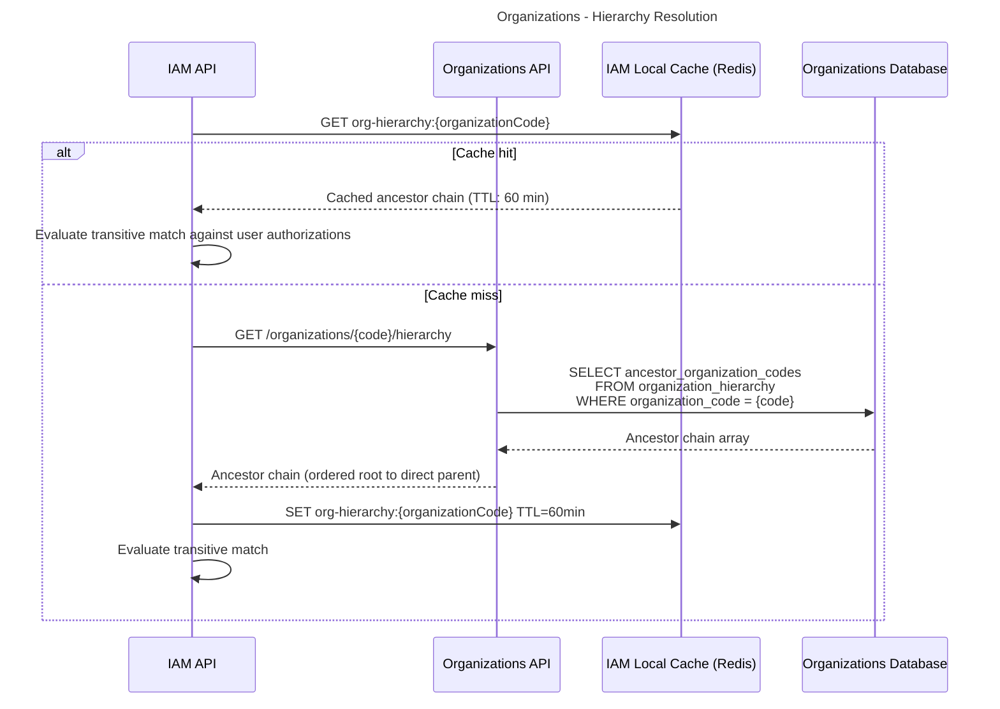
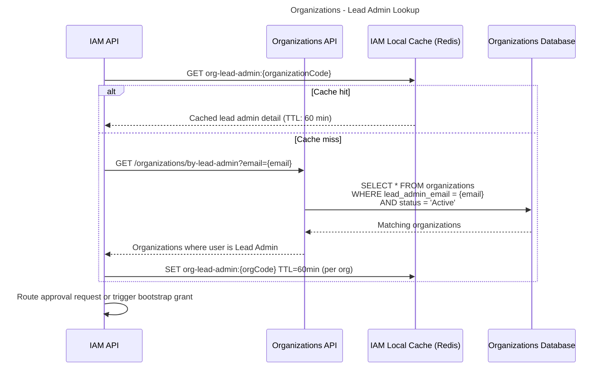

# Organizations — Workflows & Sequences

This document contains sequence diagrams for all workflows in the Organizations capability.

**Conventions:**
- Solid arrows (`->>`) = Synchronous calls
- Dashed arrows (`-->>`) = Responses
- Dotted arrows (`--)`) = Async/fire-and-forget
- **actor** = Human or external system
- **participant** = Internal service/component

---

## CEPI Nightly Sync

**What:** Pulls current organization data from the CEPI CEDS JSON-LD API, updates the local replica, rebuilds the materialized hierarchy, and publishes change events for high-impact mutations.  
**When:** Nightly at 1 AM EST via Azure Synapse scheduled trigger. May also be triggered manually by a System Admin via `POST /admin/jobs/sync` in recovery scenarios.  
**Who:** Azure Synapse Pipeline (system-initiated)

```mermaid
---
title: Organizations - CEPI Nightly Sync
---
sequenceDiagram
    participant Synapse as Azure Synapse Pipeline
    participant CEPI as CEPI CEDS JSON-LD API
    participant OrgAPI as Organizations API
    participant OrgDB as Organizations Database
    participant EventBus as Event Bus

    Synapse->>OrgDB: Open sync transaction; insert sync log record (status=Running)

    Synapse->>CEPI: Authenticate (OAuth2 client credentials)
    CEPI-->>Synapse: Access token

    Synapse->>CEPI: GET /organizations (full snapshot or delta since last sync)
    CEPI-->>Synapse: Organization records (CEDS JSON-LD)

    loop For each organization record
        Synapse->>OrgDB: Upsert organization (code, name, type, status, lead_admin_email, grade_band, ceds_metadata)

        alt Organization type changed on existing record
            Synapse->>OrgDB: Deactivate existing record (status=Inactive, deactivated_at=now)
            Synapse->>OrgDB: Insert new record with same code, new type
            Note over Synapse: Treat-as-new path; type is immutable on a record
        else Organization newly absent from CEPI feed
            Synapse->>OrgDB: Set status=Inactive, deactivated_at=now
        end
    end

    Synapse->>OrgDB: Rebuild organization_hierarchy table
    Note over Synapse,OrgDB: Recompute parent_organization_code and<br/>ancestor_organization_codes JSON array for all active orgs

    Synapse->>OrgDB: Update sync log record (status=Succeeded, counts)
    Synapse->>OrgAPI: POST /admin/jobs/sync/complete (notify API layer)

    OrgAPI->>OrgAPI: Identify high-impact changes (deactivations, lead admin changes)

    loop For each deactivated organization
        OrgAPI--)EventBus: OrganizationDeactivated
    end

    loop For each lead admin change
        OrgAPI--)EventBus: LeadAdministratorChanged
    end

    OrgAPI--)EventBus: OrganizationSyncCompleted

    Note over EventBus: IAM worker receives events and invalidates<br/>affected cache entries
```

**Key Decisions:**
- **Full snapshot vs. delta:** The pipeline supports both patterns. Until CEPI confirms whether a delta feed is available, the pipeline is implemented as a full snapshot upsert. Delta support can be added once the CEPI contract is confirmed — see Open Questions.
- **Hierarchy rebuild on every sync:** Rather than computing incremental hierarchy changes, the full `organization_hierarchy` table is rebuilt each cycle. Given the small org count (~4,000 active orgs), a full rebuild is fast and avoids complex differential logic for hierarchy changes.
- **Transactional batch:** The entire sync runs in a single transaction. If the pipeline fails partway through, no partial writes are committed and the existing replica remains intact.
- **API notification after sync:** Synapse writes directly to the database (ETL responsibility) but notifies the API layer on completion so that event publishing and any post-sync business logic remain in the API layer, consistent with the design principle that domain logic lives in APIs.

**State Changes:**
- Sync log status: `Running` > `Succeeded` or `Failed` or `PartialSuccess`
- Affected organization status: `Active` > `Inactive` (for deactivated orgs)

**Events Published:**
- `OrganizationDeactivated` — Published for each organization newly deactivated in this sync cycle. IAM subscribes to invalidate authorization caches for any user scoped to that org.
- `LeadAdministratorChanged` — Published for each organization where `lead_admin_email` changed. IAM subscribes to invalidate approval routing cache.
- `OrganizationSyncCompleted` — Published once per sync cycle on success. All consumers use this as a signal to consider cached org data potentially stale.

**Error Scenarios:**
- CEPI API unavailable after retries > Sync marked `Failed`; existing replica unchanged; alert fires to platform operations team; `OrganizationSyncCompleted` is NOT published (consumers retain current cache)
- Individual record fails validation (missing required fields, malformed data) > Record skipped; warning logged; sync continues; marked `PartialSuccess` on completion; daily digest sent to platform operations team
- Hierarchy rebuild fails > Entire sync transaction rolls back; marked `Failed`; alert fires

---

## Organization Search

**What:** Returns a list of organizations matching a partial name query, optionally filtered by type and status. Used in authorization request forms, org selectors across domains, and admin lookups.  
**When:** User types in an organization search field (typically debounced at 300ms in the UI)  
**Who:** Authenticated user via UI, or internal service



**Key Decisions:**
- **Minimum 2 characters:** Enforced at the API level to prevent full-table scans on single-character queries.
- **Active-only default:** Search returns only `Active` organizations by default. Admins with `organizations.organization.view` can pass `status=Inactive` to surface deactivated orgs for historical lookup.
- **Result limit of 20:** Typeahead use cases don't need exhaustive results. Users should refine their query rather than paginate search results.
- **Search cache keyed on query hash:** The 15-minute TTL balances freshness with performance. Search result caching is TTL-only (not event-invalidated) because the cost of a cache miss is low and the benefit of immediate cache invalidation on every sync is minimal.

**State Changes:**
None.

**Events Published:**
None.

**Error Scenarios:**
- Query shorter than 2 characters > 400 Bad Request with validation message
- Organizations API unavailable > Consumer falls back to local cache if populated; surfaces user-facing message if not

---

## Organization Detail Lookup

**What:** Retrieves full details for a single organization by code, including grade band, Lead Administrator, and hierarchy summary.  
**When:** User selects an organization from search results, or a domain service needs org context for a record being processed.  
**Who:** Authenticated user via UI, or internal service



**Key Decisions:**
- **Lead Admin included in detail response:** The full detail endpoint returns Lead Admin name and a masked version of the email (e.g., `j***@district5.edu`) for UI display. The unmasked email is returned only on the `/by-lead-admin` endpoint, which is restricted to internal service callers (IAM only).

**State Changes:**
None.

**Events Published:**
None.

**Error Scenarios:**
- Organization code not found > 404 Not Found
- Organization is Inactive > 200 returned with `status: Inactive`; callers decide how to handle (IAM will reject scope assignments to inactive orgs; other domains may display a warning)

---

## Hierarchy Resolution

**What:** Returns the full ancestor chain for an organization, used by IAM to evaluate transitive permissions (e.g., does a user authorized at ISD-50 have access to Building-123?).  
**When:** IAM permission check encounters a scope-sensitive permission and needs to determine whether the user's authorization scope is an ancestor of the target organization.  
**Who:** Internal service (IAM API only)



**Key Decisions:**
- **Single-row lookup:** The materialized `ancestor_organization_codes` JSON array on the hierarchy record means this is a single indexed lookup, not a recursive query. This is what makes sub-10ms hierarchy resolution achievable.
- **Cache owned by IAM:** IAM maintains its own cache of hierarchy data. The Organizations API does not cache on behalf of its consumers — each consumer manages its own cache per the canonical caching strategy.
- **Restricted endpoint:** `/organizations/{code}/hierarchy` is restricted to IAM's service account principal via Istio authorization policy. Other domains do not call this endpoint directly; they call `/organizations/{code}` for display purposes and let IAM handle permission evaluation.

**State Changes:**
None.

**Events Published:**
None.

**Error Scenarios:**
- Organization code not found > 404; IAM treats as no transitive match (deny)
- Organizations API unavailable > IAM falls back to cached hierarchy; if cache empty, fails closed (deny access, surface service unavailable message)

---

## Lead Admin Lookup

**What:** Returns all organizations for which a given email address is designated Lead Administrator. Used by IAM during authorization request routing and Lead Admin bootstrap.  
**When:** (1) A business user submits an authorization request — IAM looks up the Lead Admin for the target organization. (2) A new user authenticates for the first time — IAM checks whether their email matches any Lead Admin designation to trigger bootstrap grants.  
**Who:** Internal service (IAM API only)



**Key Decisions:**
- **Lookup by email, not by user ID:** Lead Admin designation in EEM is an email address, not a MiEdWorkforce user ID. IAM performs the email-to-user match after retrieving the org list.
- **Active orgs only:** The query filters to `status = Active`. A Lead Admin designation on an inactive org has no routing significance.
- **Cache invalidation on `LeadAdministratorChanged`:** When this event fires, IAM invalidates `org-lead-admin:{organizationCode}` immediately rather than waiting for TTL expiry. This ensures approval routing reflects changes without delay once the sync cycle picks them up.

**State Changes:**
None.

**Events Published:**
None.

**Error Scenarios:**
- No organizations found for the email > Empty array returned; IAM treats as non-Lead-Admin user and routes to standard authorization request flow
- Organizations API unavailable > IAM falls back to cache; if cache empty for bootstrap path, defers bootstrap grant until next successful lookup (user proceeds to standard request flow)

---

## Degraded Operation (Sync Failure)

**What:** Describes system behavior when the nightly sync fails and consumers must operate on data from the previous successful sync.  
**When:** CEPI API is unavailable, the Synapse pipeline errors, or the sync transaction rolls back.  
**Who:** System process; no user action required

```mermaid
---
title: Organizations - Degraded Operation (Sync Failure)
---
sequenceDiagram
    participant Synapse as Azure Synapse Pipeline
    participant OrgDB as Organizations Database
    participant OrgAPI as Organizations API
    participant Monitor as Azure Monitor
    participant Consumers as Domain Services (IAM, Staffing, etc.)

    Synapse->>OrgDB: Sync attempt fails (CEPI unavailable or transaction rollback)
    OrgDB->>OrgDB: No partial writes committed; replica unchanged
    Synapse->>OrgDB: Update sync log (status=Failed, failure_reason=...)

    Synapse->>Monitor: Alert fires: "CEPI Org Sync Failed"
    Note over Monitor: Platform operations team notified

    Note over OrgAPI: OrganizationSyncCompleted NOT published<br/>Consumer caches remain valid; TTL expiry continues normally

    Consumers->>OrgAPI: Requests continue normally
    OrgAPI->>OrgDB: Serve from existing replica (last successful sync data)
    OrgDB-->>OrgAPI: Data returned as normal
    OrgAPI-->>Consumers: Responses unchanged from pre-failure behavior

    Note over Consumers: Worst-case staleness increases by one sync cycle (~24 hrs)<br/>No user-facing degradation unless failure persists multiple cycles
```

**Key Decisions:**
- **No consumer-facing impact on single failure:** Because the replica is not modified on failure, consumers see no difference. The only observable effect is that new EEM changes (new orgs, Lead Admin changes, deactivations) are not reflected until the next successful sync.
- **Alert on first failure:** A single sync failure triggers an alert. Platform operations reviews and determines whether manual intervention is needed (e.g., CEPI API outage, pipeline configuration issue).
- **Manual re-trigger available:** `POST /admin/jobs/sync` allows a System Admin to trigger a manual sync once the upstream issue is resolved, without waiting for the next scheduled run.
- **Multi-day failure escalation:** If sync fails for more than 2 consecutive cycles, the alert severity escalates. At that point, any EEM changes during the outage window (new Lead Admin designations, new organizations) will not be reflected in MiEdWorkforce until recovery. This is an operational concern, not a data integrity concern — the replica simply lags EEM by the outage duration.

**State Changes:**
- Sync log status: `Running` > `Failed`

**Events Published:**
None (intentionally — `OrganizationSyncCompleted` is not published on failure).

**Error Scenarios:**
- Manual sync trigger also fails > Alert remains active; escalate to CEPI team to investigate API availability
- Failure persists > Platform operations may manually seed specific high-priority org changes via database patch as a last resort; this is documented as an emergency procedure outside normal process
