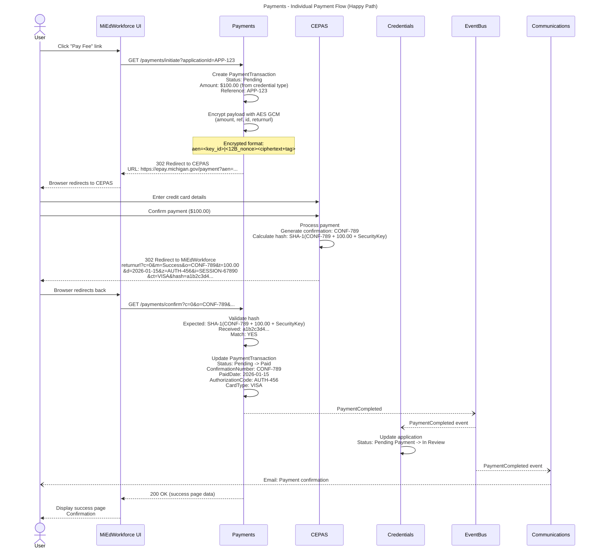
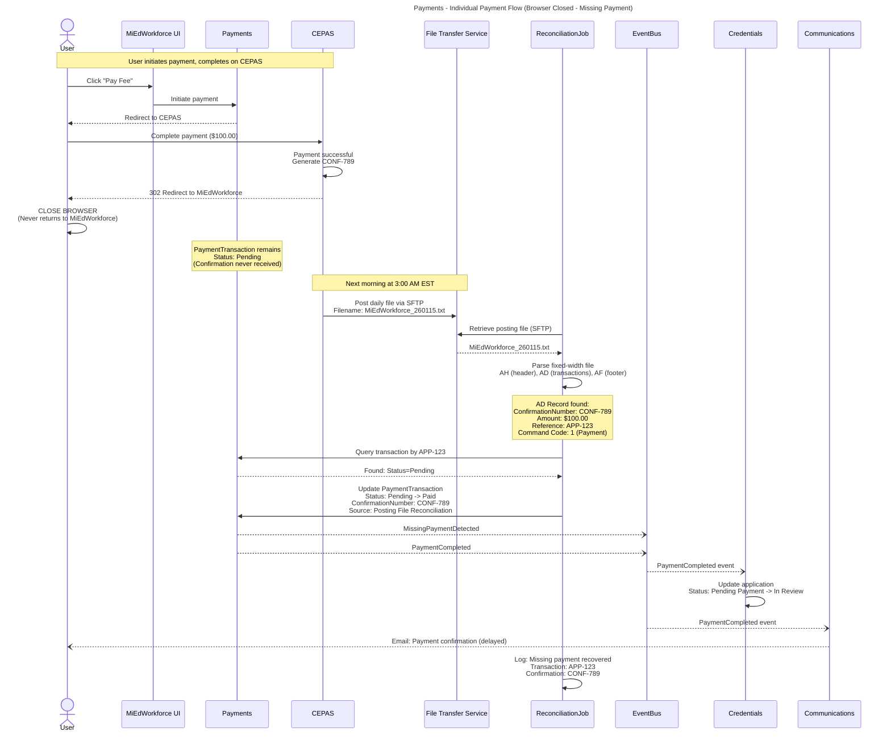
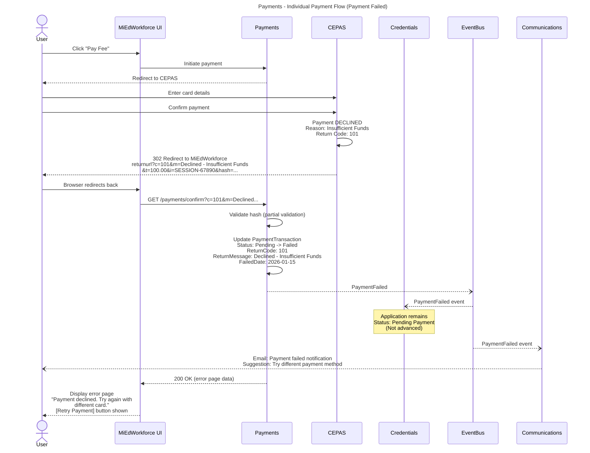
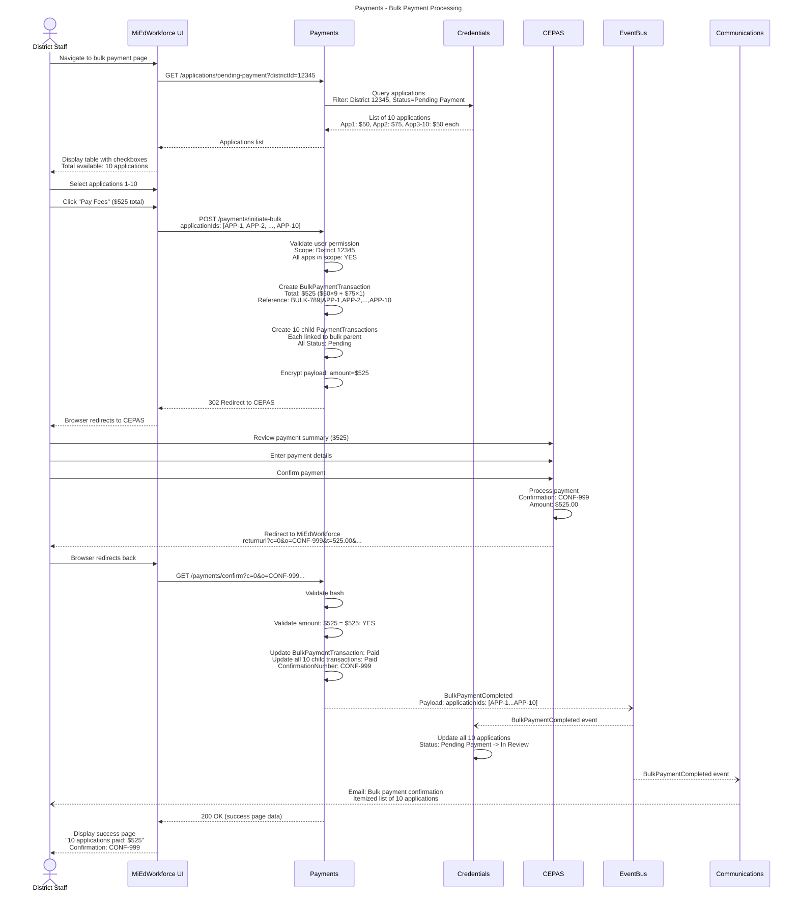
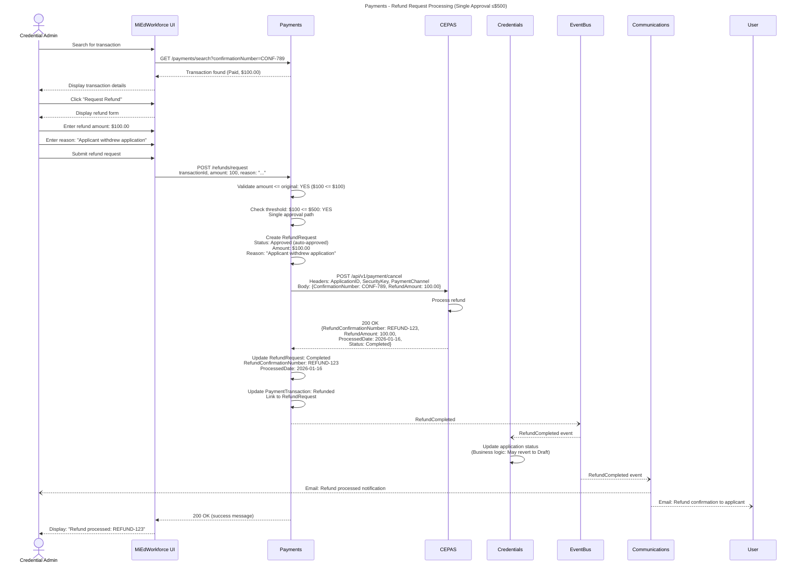
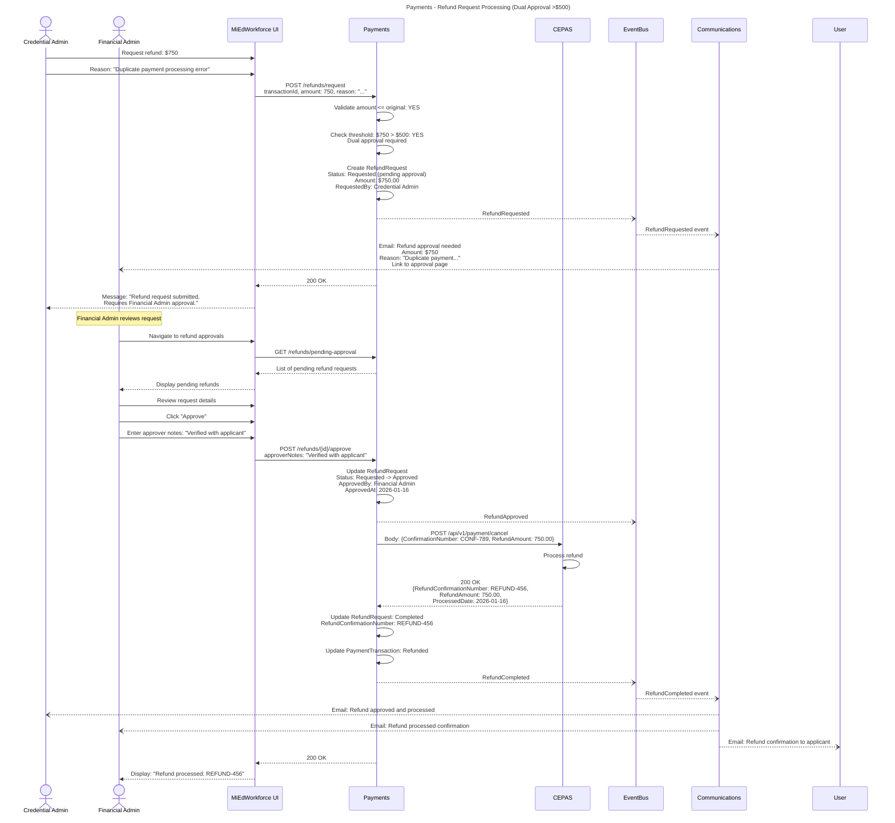
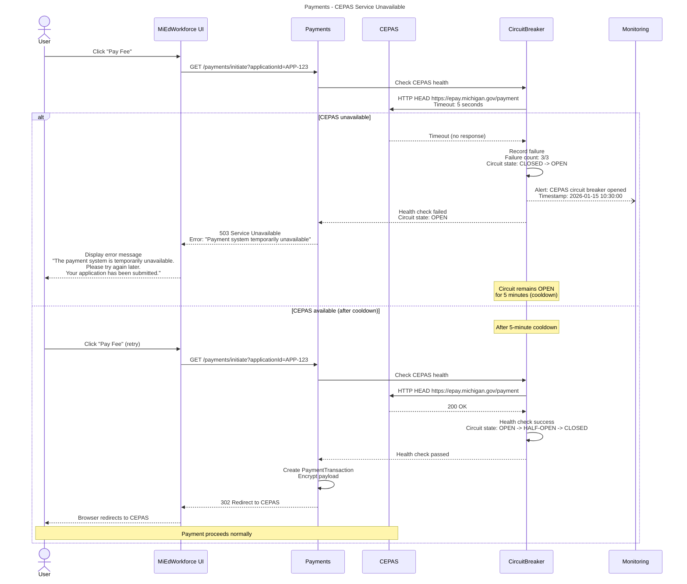
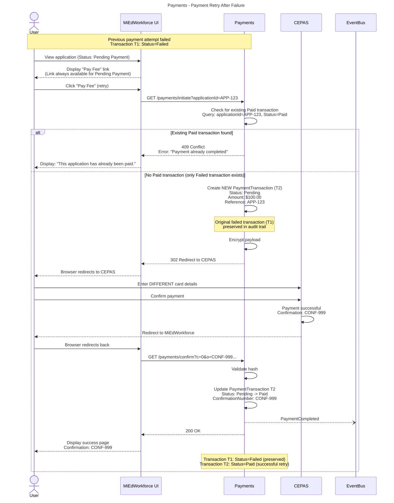
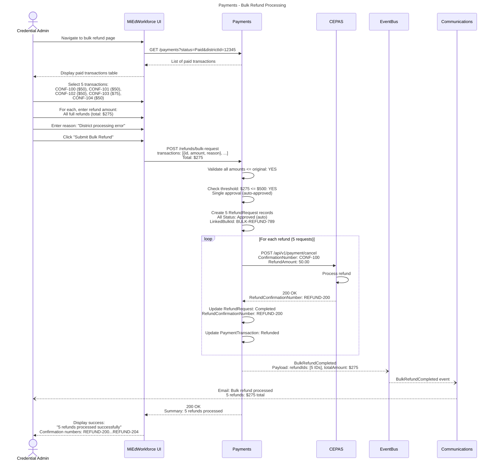
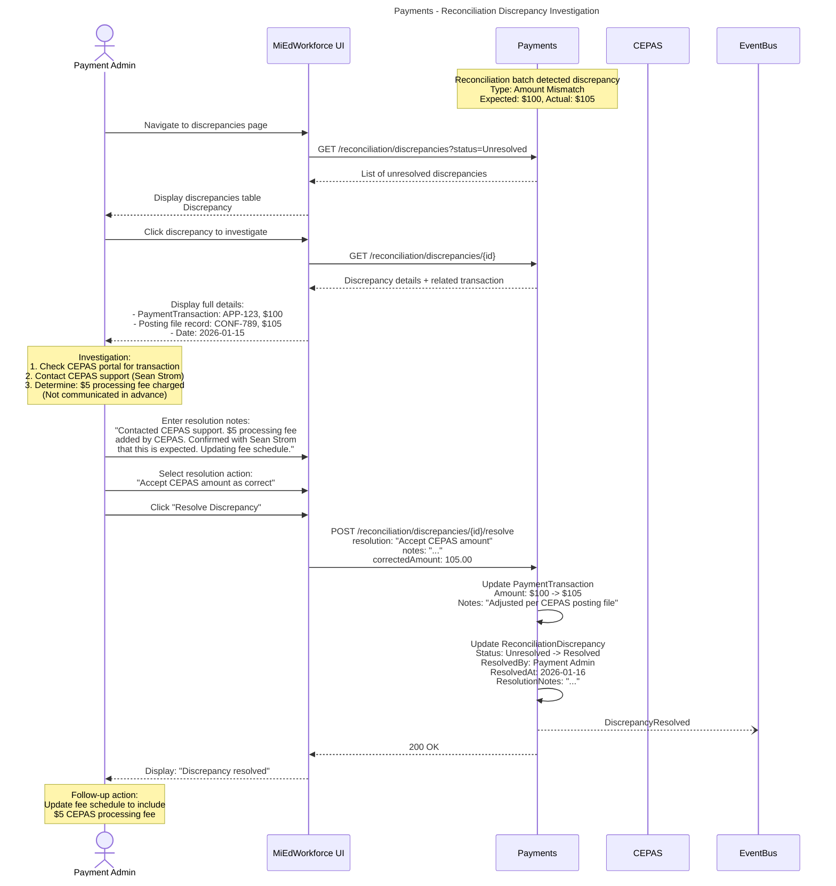

# Payments - Workflows & Sequences

This document contains sequence diagrams for all workflows in the Payments platform capability.

**Conventions:**
- Solid arrows (`->>`) = Synchronous calls
- Dashed arrows (`-->>`) = Responses
- Dotted arrows (`--)`) = Async/fire-and-forget
- **actor** = Human or external system
- **participant** = Internal service/component

---

## Individual Payment Flow (Happy Path)

**What:** User initiates payment for credential application fee, completes payment on CEPAS, and returns to MiEdWorkforce with confirmation  
**When:** User clicks "Pay Fee" link on pending credential application  
**Who:** Citizen User, Business User, or State Admin/Staff



**Key Decisions:**
- **PCI Compliance:** MiEdWorkforce never handles card data; all sensitive processing on CEPAS
- **Hash validation:** Required security check prevents spoofed confirmations
- **Event-driven:** Credential workflow advancement triggered by PaymentCompleted event

**State Changes:**
- PaymentTransaction status: `Pending` -> `Paid`
- Credential application status: `Pending Payment` -> `In Review`

**Events Published:**
- `PaymentCompleted` - Fires after hash validation success

**Error Scenarios:**
- Hash validation fails -> Transaction marked `Failed`, security alert raised
- CEPAS returns error code -> See "Individual Payment Flow (Payment Failed)"

---

## Individual Payment Flow (Browser Closed - Missing Payment)

**What:** User completes payment on CEPAS but closes browser before redirect; posting file reconciliation catches missing payment next morning  
**When:** Nightly batch job processes CEPAS posting file  
**Who:** System (automated reconciliation)



**Key Decisions:**
- **Posting file is source of truth:** Catches all payments that CEPAS confirmed, even if redirect missed
- **Auto-update only Pending:** Failed or Refunded transactions not overwritten
- **Monitoring:** MissingPaymentDetected event tracks reliability of redirect flow

**State Changes:**
- PaymentTransaction status: `Pending` -> `Paid` (via batch job)
- Credential application status: `Pending Payment` -> `In Review` (may be delayed 1 day)

**Events Published:**
- `MissingPaymentDetected` - Fires when posting file payment not found in real-time flow
- `PaymentCompleted` - Standard payment completion event (triggers credential workflow)

**Error Scenarios:**
None distinct from the reconciliation batch job's own error handling (see pay:BatchJob_PostingFileReconciliation).

---

## Individual Payment Flow (Payment Failed)

**What:** Payment fails on CEPAS (e.g., declined card, insufficient funds); user can retry  
**When:** CEPAS returns error code via redirect  
**Who:** User (after payment decline)



**Key Decisions:**
- **Preserve failed transaction:** Audit trail maintained; retry creates new transaction
- **User-friendly error:** Generic message to user; detailed error logged for admin review
- **Unlimited retries:** User can attempt payment multiple times

**State Changes:**
- PaymentTransaction status: `Pending` -> `Failed`
- Credential application status: Remains `Pending Payment`

**Events Published:**
- `PaymentFailed` - Fires when CEPAS returns non-zero return code

**Error Scenarios:**
- Common return codes: 101 (Declined), 102 (Insufficient Funds), 103 (Invalid Card), 104 (Expired Card)

---

## Bulk Payment Processing

**What:** District staff selects multiple credential applications and processes single payment for total fees  
**When:** Business user (district staff) needs to pay fees for multiple applications  
**Who:** Business User with `payments.transaction.initiate.bulk` permission



**Key Decisions:**
- **Atomic success/failure:** All applications paid or none; no partial payments
- **Amount validation:** Total must equal sum of individual fees
- **Scope enforcement:** User can only select applications within authorized district/ISD; the calling domain validates application eligibility before Payments is invoked

**State Changes:**
- BulkPaymentTransaction status: `Pending` -> `Paid`
- All 10 child PaymentTransactions: `Pending` -> `Paid`
- All 10 credential applications: `Pending Payment` -> `In Review`

**Events Published:**
- `BulkPaymentCompleted` - Includes array of all application IDs

**Error Scenarios:**
- Amount mismatch -> All transactions remain Pending, discrepancy flagged
- Any application out of scope -> Reject entire bulk payment request

---

## Refund Request Processing (Single Approval ≤$500)

**What:** Credential Admin requests refund for paid transaction; auto-approved if ≤$500, processed via CEPAS API  
**When:** Applicant withdraws application or refund needed for other reason  
**Who:** Credential Administrator



**Key Decisions:**
- **Auto-approval threshold:** Configurable; default $500
- **CEPAS API idempotency:** Safe to retry on failure (same confirmation number)
- **Atomic update:** Transaction status only changes after CEPAS confirms

**State Changes:**
- RefundRequest status: `Requested` -> `Approved` (auto) -> `Completed`
- PaymentTransaction status: `Paid` -> `Refunded`

**Events Published:**
- `RefundCompleted` - Fires after CEPAS confirms refund processed

**Error Scenarios:**
CEPAS API failure -> RefundRequest marked Failed, admin alerted for retry. Amount exceeds original -> Validation error before CEPAS API call.

---

## Refund Request Processing (Dual Approval >$500)

**What:** Credential Admin requests refund >$500; requires Financial Admin approval before processing  
**When:** High-value refund needed  
**Who:** Credential Administrator, Financial Administrator



**Key Decisions:**
- **Dual approval threshold:** Configurable; default >$500
- **Approval workflow:** Sequential (request -> approve -> process), not parallel
- **Rejection path:** Financial Admin can reject with reason using the same `payments.refund.approve` permission (not shown in diagram)

**State Changes:**
- RefundRequest status: `Requested` -> `Approved` -> `Completed`
- PaymentTransaction status: `Paid` -> `Refunded`

**Events Published:**
- `RefundRequested` - Fires when Credential Admin submits request
- `RefundApproved` - Fires when Financial Admin approves
- `RefundCompleted` - Fires after CEPAS confirms refund

**Error Scenarios:**
Not separately enumerated beyond the single-approval flow's error scenarios.

---

## Daily Posting File Reconciliation

**What:** Nightly batch job retrieves CEPAS posting file, matches transactions, updates missing payments, flags discrepancies  
**When:** Daily at 3:00 AM EST (automated)  
**Who:** System (ReconciliationJob)

```mermaid
---
title: Payments - Daily Posting File Reconciliation
---
sequenceDiagram
    participant ReconciliationJob
    participant FTS as File Transfer Service
    participant CEPAS
    participant Payments
    participant EventBus
    participant Monitoring

    Note over ReconciliationJob: Scheduled: Daily 3:00 AM EST

    ReconciliationJob->>ReconciliationJob: Start reconciliation batch
    ReconciliationJob->>Payments: Create ReconciliationBatch<br/>Status: Processing<br/>FileDate: 2026-01-15

    ReconciliationJob->>FTS: SFTP connect
    ReconciliationJob->>FTS: GET MiEdWorkforce_260115.txt
    FTS-->>ReconciliationJob: Posting file (fixed-width text)

    ReconciliationJob->>ReconciliationJob: Parse file<br/>AH (header): Validate site, agency, application<br/>AD (transactions): Extract records<br/>AF (footer): Validate total records, total amount

    Note over ReconciliationJob: Header/Footer validation: PASS<br/>Expected records: 247<br/>Expected total: $24,750.00

    loop For each AD transaction record (247 records)
        ReconciliationJob->>ReconciliationJob: Extract fields:<br/>- Confirmation Number<br/>- Payment Amount<br/>- Custom Reference (APP-123)<br/>- Command Code (1=Payment, 5=Refund, 6=Void, 9=Chargeback, 10=ChargebackReversal, 14=Partial, 15=ACHCredit, 16=ProcessorVoid)

        alt Command Code = 1 (Payment)
            ReconciliationJob->>Payments: Query by reference: APP-123

            alt Transaction found, Status=Pending
                Payments->>Payments: Update PaymentTransaction<br/>Status: Pending -> Paid<br/>ConfirmationNumber: CONF-789<br/>Source: Posting File
                Payments--)EventBus: MissingPaymentDetected
                Payments--)EventBus: PaymentCompleted
                ReconciliationJob->>ReconciliationJob: Log: Missing payment recovered
            else Transaction found, Status=Paid
                ReconciliationJob->>ReconciliationJob: Match confirmed<br/>No action needed
            else Transaction found, Amount mismatch
                ReconciliationJob->>Payments: Create ReconciliationDiscrepancy<br/>Type: Amount Mismatch<br/>Expected: $100, Actual: $105
                ReconciliationJob--)EventBus: PaymentDiscrepancyDetected
            else Transaction not found
                ReconciliationJob->>Payments: Create ReconciliationDiscrepancy<br/>Type: Orphan Payment<br/>(Payment in CEPAS but no application)
                ReconciliationJob--)EventBus: PaymentDiscrepancyDetected
            end

        else Command Code = 5 (Refund)
            ReconciliationJob->>Payments: Match refund confirmation number
            ReconciliationJob->>ReconciliationJob: Verify refund recorded
        else Command Code = 6, 9, 10, 15, or 16 (Void, Chargeback, Chargeback Reversal, ACH Credit, Processor Void)
            ReconciliationJob->>ReconciliationJob: Record as ReconciliationRecord with match_result = Discrepancy
            Note over ReconciliationJob: Not auto-resolved - no defined handling for these codes yet; flagged for manual classification
        end
    end

    ReconciliationJob->>Payments: Update ReconciliationBatch<br/>Status: Processing -> Completed<br/>Summary:<br/>- Total Records: 247<br/>- Matched: 240<br/>- Missing Payments Recovered: 5<br/>- Discrepancies: 2

    ReconciliationJob--)EventBus: ReconciliationBatchCompleted
    EventBus--)Monitoring: ReconciliationBatchCompleted event

    alt Discrepancies > 0
        Monitoring--)EventBus: Alert: Manual review needed
        EventBus--)Monitoring: Email: Payment Admin notification<br/>Subject: "2 payment discrepancies require review"
    end

    ReconciliationJob->>ReconciliationJob: End batch job
```

**Key Decisions:**
- **Source of truth:** Posting file is authoritative for payment status
- **Auto-update restrictions:** Only `Pending` transactions updated; `Failed`/`Refunded` left unchanged
- **Discrepancy handling:** Flagged for manual review, not auto-resolved

**State Changes:**
- ReconciliationBatch status: `Processing` -> `Completed`
- PaymentTransaction status: `Pending` -> `Paid` (for missing payments only)

**Events Published:**
- `MissingPaymentDetected` - Per recovered payment
- `PaymentCompleted` - Per recovered payment (triggers credential workflow)
- `PaymentDiscrepancyDetected` - Per unmatched or mismatched record
- `ReconciliationBatchCompleted` - At batch completion with summary

**Error Scenarios:**
Not separately enumerated in this sequence beyond pay:BatchJob_PostingFileReconciliation's own errorHandling.

---

## CEPAS Service Unavailable

**What:** User attempts payment when CEPAS is down; system displays error and allows retry later  
**When:** CEPAS health check fails  
**Who:** Any user attempting payment



**Key Decisions:**
- **Circuit breaker pattern:** Prevents cascading failures and reduces load on struggling CEPAS
- **Health check before redirect:** Fail fast with clear error rather than broken redirect
- **Cooldown period:** 5 minutes (configurable) before retry attempts

**Events Published:**
None (circuit breaker alert to Monitoring only, not a modeled sd:DomainEvent).

**Error Scenarios:**
CEPAS unreachable -> 503 Service Unavailable, circuit opens for 5-minute cooldown.

---

## Payment Retry After Failure

**What:** User retries payment after previous attempt failed (declined card, timeout, etc.)  
**When:** User clicks retry button on failed payment error page  
**Who:** Any user with failed payment transaction



**Key Decisions:**
- **Each retry creates new transaction:** Failed transactions preserved for audit trail
- **Prevent double payment:** Check for existing Paid transaction before creating new one
- **Unlimited retries:** User can attempt payment as many times as needed

**State Changes:**
- New PaymentTransaction (T2) created: `Pending` -> `Paid`
- Original failed transaction (T1): Remains `Failed`

**Events Published:**
PaymentCompleted - Fires on successful retry.

**Error Scenarios:**
Existing Paid transaction found for the application -> 409 Conflict, "This application has already been paid."

---

## Bulk Refund Processing

**What:** Credential Admin selects multiple paid transactions for bulk refund  
**When:** Multiple applications need refunds (e.g., district error, program cancellation)  
**Who:** Credential Administrator (with Financial Admin approval for high values)



**Key Decisions:**
- **Sequential processing:** Refunds processed one-by-one via CEPAS API (not atomic batch)
- **Partial success handling:** If one fails, others continue; failure logged separately
- **Threshold calculation:** Total refund amount determines approval requirements

**State Changes:**
- 5 RefundRequest records: `Requested` -> `Approved` -> `Completed`
- 5 PaymentTransaction records: `Paid` -> `Refunded`

**Events Published:**
- `BulkRefundCompleted` - Single event with summary of all refunds

**Error Scenarios:**
- If any CEPAS API call fails, that refund marked Failed, others continue
- Summary shows: 4 successful, 1 failed

---

## Reconciliation Discrepancy Investigation

**What:** Payment Admin investigates and manually resolves posting file discrepancy  
**When:** Reconciliation batch detects unmatched or mismatched transaction  
**Who:** Payment Administrator



**Key Decisions:**
- **Manual resolution required:** No auto-resolution of discrepancies
- **Audit trail:** All resolution actions logged with notes
- **Resolution options:** Accept CEPAS, Reject (mark transaction Failed), Create adjustment

**State Changes:**
- ReconciliationDiscrepancy status: `Unresolved` -> `Resolved`
- PaymentTransaction: May be updated based on resolution type

**Events Published:**
- `DiscrepancyResolved` - Fires when admin marks discrepancy resolved

**Error Scenarios:**
Not separately enumerated in this sequence.
