# Professional Learning

- **Type:** Core Domain
- **Identifier:** proflearning
- **Primary Sources:** BRD 14.0, 26.0, 27.0, 28.0, 31.5

---

## Purpose

The Professional Learning domain manages the State Continuing Education Clock Hours (SCECH) system for Michigan educators. It owns the lifecycle of professional learning programs from sponsor application through program delivery and credit awarding. This domain enables educators to discover learning opportunities, sponsors to offer approved programs, and administrators to maintain quality standards for professional development that counts toward credential renewal requirements.

---

## Scope

**This domain owns:**
- Professional Learning Sponsor management (contact info, coordinator assignments)
- Professional Learning Program applications, approval, and catalog management
- Program session scheduling and location management
- Attendee enrollment and attendance tracking
- SCECH credit awarding and adjustment workflows
- Program evaluation collection and processing
- Public catalog search for discovering learning opportunities
- Program categories, subcategories, and metadata management
- College course credit application (from STARR data)
- SCECH correction request workflows (post-certification adjustments)

**This domain does NOT own:**
- User authentication and account creation (owned by `iam` via MiLogin)
- Organization data (EEM is source of truth, synced to `org-reference-data`)
- Sponsor creation in EEM (external process; MiEdWorkforce manages existing sponsors only)
- Credential renewal processing (owned by `credentialing`)
- Email delivery infrastructure (owned by `communications`)
- Document storage (owned by `documents`)
- STARR data collection (external system, integrated via Synapse)
- Educator's total SCECH balance for credential purposes (computed view, not stored here)
- Question Set framework (cross-cutting capability used by multiple domains)
- Program fee collection (handled externally via sponsor's own registration systems; MiEdWorkforce displays fee information only)

---

## Ubiquitous Language

| Term                                | Definition                                                                                                                                                                                                                                                       |
| ----------------------------------- | ---------------------------------------------------------------------------------------------------------------------------------------------------------------------------------------------------------------------------------------------------------------- |
| **SCECH**                           | State Continuing Education Clock Hours - credits awarded for professional learning attendance that count toward credential renewal                                                                                                                               |
| **Sponsor**                         | An organization approved to offer professional learning programs (created in EEM, managed in MiEdWorkforce)                                                                                                                                                      |
| **Coordinator**                     | Primary contact person for a Sponsor, responsible for program management and attendee reporting                                                                                                                                                                  |
| **Assistant Coordinator**           | Secondary contact for a Sponsor with similar permissions as Coordinator                                                                                                                                                                                          |
| **Program**                         | An approved professional learning offering with defined content, format, and maximum SCECH hours. Example: "Classroom Management Strategies" is a Program.                                                                                                       |
| **Session**                         | A specific offering/instance of a Program with defined dates and location. Example: The October 15-17 offering of "Classroom Management Strategies" at County ISD is a Session. The same Program might have another Session in November at a different location. |
| **Program Application**             | A sponsor's request to add, modify, or renew a professional learning program offering. Not to be confused with educator registration for program attendance.                                                                                                     |
| **Attendee**                        | An educator enrolled in or attending a program session. Must have a valid Unique ID.                                                                                                                                                                             |
| **Attendance Certification**        | Sponsor's formal confirmation that attendees completed the program, triggering SCECH award                                                                                                                                                                       |
| **Maximum SCECH Hours**             | The highest number of SCECH credits a program is approved to award                                                                                                                                                                                               |
| **SCECH Award**                     | The actual number of credits given to an attendee for a specific program session, which may be less than the maximum for partial attendance                                                                                                                      |
| **Evaluation**                      | Required or optional post-program assessment completed by attendees                                                                                                                                                                                              |
| **Evaluation Template**             | Standardized set of questions used to collect feedback on program quality and effectiveness                                                                                                                                                                      |
| **Category**                        | High-level classification of program content (e.g., Curriculum Development, School Administration)                                                                                                                                                               |
| **Subcategory**                     | More specific classification within a Category                                                                                                                                                                                                                   |
| **Program Format**                  | Delivery method (Face-to-Face, Virtual/Online, Hybrid)                                                                                                                                                                                                           |
| **DPPD**                            | District Provided Professional Development - specific indicator for programs that count as district-provided                                                                                                                                                     |
| **Program Agenda**                  | Required supporting document uploaded with program applications                                                                                                                                                                                                  |
| **Active Status**                   | Programs and sponsors visible in public catalog and available for enrollment                                                                                                                                                                                     |
| **Catalog**                         | Public-facing searchable directory of active programs and sponsors                                                                                                                                                                                               |
| **Professional Learning Resources** | Public-facing landing page for discovering professional learning opportunities. Includes the Catalog search, sponsor information, and guidance documents                                                                                                         |
| **Correction Request**              | Sponsor-initiated request to adjust SCECH awards after attendance has been certified, requiring admin approval                                                                                                                                                   |
| **Program Fee**                     | Display-only field showing the cost of the program. Actual payment collection happens on the sponsor's external registration website, not within MiEdWorkforce                                                                                                   |

---

## Domain Model

### Core Aggregates

#### ProfessionalLearningSponsor

**Root Entity:** Sponsor

**Purpose:** Represents an organization (created in EEM) that is managed within MiEdWorkforce for offering professional learning programs, with designated coordinators and contact information.

**Entities & Value Objects:**
- **Sponsor** (Root) - Organization entity from EEM with PL-specific metadata
- **SponsorContact** - Value Object (name, phone, email)
- **SponsorStatus** - Value Object (Active, Inactive)
- **CoordinatorAssignment** - Entity linking users to Coordinator/Assistant Coordinator roles

**Key Invariants:**
- A sponsor must have at least one active Coordinator
- Sponsor must exist in EEM before being managed in MiEdWorkforce
- Only one coordinator can be designated as primary

**Key States:** Active, Inactive

**Design Note:** Sponsor creation happens in EEM (external system). MiEdWorkforce only manages existing sponsors (editing contact info, assigning coordinators). There is no "PendingApproval" state within MiEdWorkforce.

**Referenced In:**
- Sequence: Program Application Submission
- Sequence: Mass Email to Sponsors
- Sequence: Manage Sponsor Contact Information

---

#### ProfessionalLearningProgram

**Root Entity:** Program

**Purpose:** Represents an approved professional learning offering with defined content, format, maximum SCECH hours, and approval period.

**Entities & Value Objects:**
- **Program** (Root) - The approved learning offering
- **ProgramApplication** - Entity tracking application lifecycle (new, modify, renew)
- **ApplicationReviewStatus** - Value Object (Submitted, PendingApproval, Approved, Rejected, RequiresInfo)
- **ProgramAgenda** - Value Object (document reference from `documents` domain)
- **ProgramContact** - Value Object (name, phone, email)
- **ProgramCategory** - Value Object (Category, Subcategory)
- **ProgramFormat** - Value Object (Face-to-Face, Virtual/Online, Hybrid)
- **SCECHAllocation** - Value Object (MaxGeneral, MaxCollege, MaxCareer, MaxMilitary)
- **ApprovalPeriod** - Value Object (BeginDate, EndDate for approval validity)
- **ProgramSession** - Entity (specific offering with dates/location)
- **SessionLocation** - Value Object (County, LocationName, Address or Virtual indicator)
- **EndorsementAlignment** - Value Object (reference to endorsement code(s) this program is aligned to for renewal credit or professional development targeting; does NOT grant endorsement)
- **EvaluationRequirement** - Value Object (toggle: required vs. optional, template reference)

**Key Invariants:** Program must have approved sponsor. Maximum SCECH hours must be positive. Program must have at least one session within approval period. Modified programs require re-approval (sponsor-initiated edits only — Professional Learning Admin may edit an approved program directly without re-triggering approval). Program Format dictates whether location address is required. If evaluation is required, template must be specified.

**Key States:** Draft, PendingApproval, Approved, Active, Inactive, Withdrawn

**Referenced In:**
- Sequence: Program Application Submission and Approval
- Sequence: Program Session Creation
- Sequence: Public Catalog Search

---

#### ProgramAttendance

**Root Entity:** AttendanceRoster

**Purpose:** Tracks enrollment, attendance, and SCECH credit awarding for a specific program session.

**Entities & Value Objects:**
- **AttendanceRoster** (Root) - Collection of attendees for a session
- **Attendee** - Entity (EducatorUniqueId, enrollment status, attendance status)
- **AttendanceRecord** - Value Object (Full/Partial attendance)
- **SCECHAward** - Entity (awarded credits by type, justification for adjustments)
- **CertificationStatus** - Value Object (Pending, Certified, Locked)
- **EvaluationSubmission** - Entity (attendee's evaluation responses)

**Key Invariants:**
- Attendee must have valid Unique ID from IAM system
- Awarded SCECHs cannot exceed program's maximum for each type
- Roster cannot be certified until all required evaluations are submitted
- Once certified, SCECH awards are immutable (corrections require admin override via CorrectionRequest)
- Default awarded SCECHs equal program maximum unless adjusted

**Key States:** Draft, AwaitingEvaluations, ReadyForCertification, Certified

**Referenced In:**
- Sequence: Add Attendees to Program
- Sequence: Adjust SCECH Awards
- Sequence: Certify Program Attendance

---

#### SCECHCorrectionRequest

**Root Entity:** CorrectionRequest

**Purpose:** Handles sponsor-initiated requests to adjust SCECH awards after attendance has been certified, requiring admin approval.

**Entities & Value Objects:**
- **CorrectionRequest** (Root) - Request to modify certified SCECH award
- **RequestedChange** - Value Object (attendeeId, oldValue, newValue, justification)
- **RequestStatus** - Value Object (Submitted, UnderReview, Approved, Denied)
- **AdminDecision** - Entity (decision, notes, approver, timestamp)
- **AuditTrail** - Value Object (complete history of status changes)

**Key Invariants:**
- Can only be created for certified attendance rosters
- Requested SCECH value must not exceed program maximum
- Requires documented justification from sponsor
- Once approved, original award is superseded (not deleted - maintains audit trail)
- Denial requires admin notes explaining reason

**Key States:** Submitted, UnderReview, Approved, Denied

**Referenced In:**
- Sequence: Sponsor Requests SCECH Correction
- Sequence: Admin Reviews Correction Request

---

#### CollegeCourseCredit

**Root Entity:** CollegeCourseApplication

**Purpose:** Manages educator's application of college course credits toward SCECH requirements, sourced from STARR data.

**Entities & Value Objects:**
- **CollegeCourseApplication** (Root) - Educator's selection of courses for SCECH credit
- **STARRCourseRecord** - Value Object (course data from STARR sync)
- **CourseEligibility** - Value Object (eligible if after last credential issuance)
- **SCECHConversion** - Value Object (course credits converted to SCECH hours using configured rate: 1 semester credit = 15 SCECH hours)

**Key Invariants:**
- Course must be from STARR data for the educator's Unique ID
- Course must be completed after last credential issuance date
- Once applied for SCECH credit, course cannot be reused
- Conversion rate: 1 semester credit = 15 SCECH hours (configurable in business rules)

**Key States:** Eligible, Applied, Credited

**Referenced In:**
- Sequence: Educator Applies College Course for SCECH Credit

---

#### EvaluationTemplate

**Root Entity:** EvaluationTemplate

**Purpose:** Defines the standardized questions used to collect feedback on program quality and effectiveness. Leverages the cross-cutting Question Set capability for actual question content.

**Entities & Value Objects:**
- **EvaluationTemplate** - Collection of evaluation questions for a program or category
- **QuestionReference** - Reference to Question Set ID (from Question Set capability)
- **TemplateMetadata** - Value Object (name, description, applicable categories)
- **TemplateStatus** - Value Object (Active, Inactive)

**Key Invariants:**
- Templates must reference valid Question Set IDs
- Active templates must have at least one question
- Templates can be assigned to program categories or individual programs
- Deactivating a template does not affect programs already using it (historical data preserved)

**Key States:** Active, Inactive

**Design Note:** The actual question content, structure, and versioning is managed by the Question Set capability (cross-cutting concern). EvaluationTemplate simply references Question Set IDs and manages the assignment to programs.

**Referenced In:**
- Sequence: Admin Configures Evaluation Questions
- Sequence: Attendee Submits Evaluation

---

#### ProgramCategory

**Root Entity:** ProgramCategory

**Purpose:** Defines the classification taxonomy for programs (categories and subcategories).

**Entities & Value Objects:**
- **Category** (Root) - High-level classification (e.g., "Curriculum Development")
- **Subcategory** - Entity (more specific classification within parent category)
- **CategoryStatus** - Value Object (Active, Inactive)

**Key Invariants:**
- Category names must be unique
- Subcategories must belong to exactly one category
- Inactive categories cannot be assigned to new programs
- Deleting a category requires reassignment or archival of dependent programs

**Key States:** Active, Inactive

**Referenced In:**
- Sequence: Admin Manages Program Categories
- ProfessionalLearningProgram aggregate (uses categories for classification)

---

### Entity Relationship Diagram

```mermaid
---
title: Professional Learning ERD
---
erDiagram
    SPONSORS ||--o{ COORDINATOR_ASSIGNMENTS : "has"
    SPONSORS ||--o{ PROGRAMS : "offers"

    PROGRAMS ||--o{ PROGRAM_APPLICATIONS : "applied via"
    PROGRAMS ||--o{ PROGRAM_SESSIONS : "delivered via"
    PROGRAMS ||--o{ PROGRAM_ENDORSEMENT_ALIGNMENTS : "aligned to"

    PROGRAM_CATEGORIES ||--o{ PROGRAM_SUBCATEGORIES : "has"
    PROGRAM_CATEGORIES ||--o{ PROGRAMS : "classifies"
    PROGRAM_SUBCATEGORIES ||--o{ PROGRAMS : "sub-classifies"

    EVALUATION_TEMPLATES ||--o{ EVALUATION_TEMPLATE_QUESTION_SETS : "references"
    EVALUATION_TEMPLATES ||--o{ PROGRAMS : "used by"

    PROGRAM_SESSIONS ||--o{ ATTENDANCE_ROSTERS : "has"
    ATTENDANCE_ROSTERS ||--o{ ATTENDEES : "contains"
    ATTENDEES ||--o{ SCECH_AWARDS : "receives"
    ATTENDEES ||--o{ EVALUATION_SUBMISSIONS : "submits"
    ATTENDEES ||--o{ SCECH_CORRECTION_REQUESTS : "subject of"

    STARR_COURSE_RECORDS ||--o{ COLLEGE_COURSE_APPLICATIONS : "applied via"

    SPONSORS {
        uuid sponsor_id PK "Unique sponsor identifier"
        string organization_code FK "EEM organization code (read-only ref)"
        string name "Sponsor display name from EEM"
        string status "Active|Inactive"
        string contact_name "Primary contact name"
        string contact_phone "Contact phone"
        string contact_email "Contact email"
        datetime created_at
        datetime updated_at
    }

    COORDINATOR_ASSIGNMENTS {
        uuid assignment_id PK
        uuid sponsor_id FK "Reference to sponsor"
        string user_unique_id FK "Mi-Key Unique ID of coordinator"
        string role "Coordinator|AssistantCoordinator"
        boolean is_primary "Only one primary per sponsor"
        datetime assigned_at
        datetime revoked_at "NULL if still active"
    }

    PROGRAM_CATEGORIES {
        uuid category_id PK
        string name UK "Unique category name"
        string description "NULL if not provided"
        string status "Active|Inactive"
        datetime created_at
        datetime updated_at
    }

    PROGRAM_SUBCATEGORIES {
        uuid subcategory_id PK
        uuid category_id FK "Parent category"
        string name "Unique within parent category"
        string description "NULL if not provided"
        string status "Active|Inactive"
        datetime created_at
    }

    EVALUATION_TEMPLATES {
        uuid template_id PK
        string name UK "Unique template name"
        string description "NULL if not provided"
        string status "Active|Inactive"
        datetime created_at
        datetime updated_at
    }

    EVALUATION_TEMPLATE_QUESTION_SETS {
        uuid id PK
        uuid template_id FK "Reference to evaluation template"
        uuid question_set_id "Reference to Question Set capability"
        int display_order
    }

    PROGRAMS {
        uuid program_id PK
        uuid sponsor_id FK "Reference to sponsor"
        uuid category_id FK "Reference to program category"
        uuid subcategory_id FK "NULL if not sub-classified"
        uuid evaluation_template_id FK "NULL if evaluation not required"
        string title "Program display name"
        string description "NULL if not provided"
        string format "FaceToFace|VirtualOnline|Hybrid"
        string status "Draft|PendingApproval|Approved|Active|Inactive|Withdrawn"
        int max_scech_general "Max general SCECH hours"
        int max_scech_college "Max college SCECH hours (counselors only)"
        int max_scech_career "Max career SCECH hours (counselors only)"
        int max_scech_military "Max military SCECH hours (counselors only)"
        date approval_begin_date "Approval period start"
        date approval_end_date "Approval period end"
        boolean is_dppd "District Provided Professional Development"
        boolean evaluation_required "Blocks certification if true and evals missing"
        decimal program_fee "Display-only; collected externally"
        string external_registration_url "NULL if not provided"
        string contact_name "Program contact"
        string contact_phone "NULL if not provided"
        string contact_email "Program contact email"
        uuid agenda_document_id "Reference to Documents domain"
        datetime created_at
        datetime updated_at
    }

    PROGRAM_APPLICATIONS {
        uuid application_id PK
        uuid program_id FK "NULL for new program applications"
        uuid sponsor_id FK "Reference to sponsor"
        string application_type "New|Modify|Renewal"
        string status "Draft|Submitted|PendingApproval|Approved|Rejected|RequiresInfo|Withdrawn"
        json program_details_snapshot "Full program details as submitted"
        string reviewer_notes "Admin notes on decision"
        string info_request "Admin's request for more information"
        string submitted_by_user_unique_id FK "Coordinator who submitted"
        datetime submitted_at
        datetime decided_at "NULL if not yet decided"
        uuid decided_by_user_unique_id FK "NULL if not yet decided"
        datetime created_at
        datetime updated_at
    }

    PROGRAM_ENDORSEMENT_ALIGNMENTS {
        uuid id PK
        uuid program_id FK "Reference to program"
        string endorsement_code "Endorsement code from Credentialing domain (informational)"
    }

    PROGRAM_SESSIONS {
        uuid session_id PK
        uuid program_id FK "Reference to program"
        date start_date
        date end_date
        boolean is_virtual "True for Virtual/Online format"
        string county "NULL if virtual"
        string location_name "NULL if virtual"
        string location_address "NULL if virtual"
        string certification_status "Draft|AwaitingEvaluations|ReadyForCertification|Certified"
        datetime certified_at "NULL if not yet certified"
        string certified_by_user_unique_id FK "NULL if not yet certified"
        datetime created_at
        datetime updated_at
    }

    ATTENDANCE_ROSTERS {
        uuid roster_id PK
        uuid session_id FK "Reference to program session"
        int attendee_count "Denormalized for performance"
        datetime created_at
    }

    ATTENDEES {
        uuid attendee_id PK
        uuid roster_id FK "Reference to attendance roster"
        string educator_unique_id FK "Mi-Key Unique ID"
        int awarded_scech_general "Defaults to program max; adjusted for partial attendance"
        int awarded_scech_college "Counselors only; NULL if not applicable"
        int awarded_scech_career "Counselors only; NULL if not applicable"
        int awarded_scech_military "Counselors only; NULL if not applicable"
        boolean evaluation_submitted "Tracks evaluation completion"
        string adjustment_reason "NULL if no adjustment from default"
        datetime enrolled_at
        datetime updated_at
    }

    SCECH_AWARDS {
        uuid award_id PK
        uuid attendee_id FK "Reference to attendee"
        int general_hours "Finalized general SCECH"
        int college_hours "Finalized college SCECH; NULL if not applicable"
        int career_hours "Finalized career SCECH; NULL if not applicable"
        int military_hours "Finalized military SCECH; NULL if not applicable"
        string award_source "Attendance|CollegeCourse|CorrectionRequest"
        datetime awarded_at "When attendance was certified"
        boolean is_superseded "True if replaced by correction request approval"
        uuid superseded_by_award_id FK "NULL unless replaced"
    }

    EVALUATION_SUBMISSIONS {
        uuid submission_id PK
        uuid attendee_id FK "Reference to attendee"
        uuid template_id FK "Template used at time of submission"
        json responses "Question Set responses (JSON keyed by question ID)"
        datetime submitted_at
    }

    SCECH_CORRECTION_REQUESTS {
        uuid correction_request_id PK
        uuid attendee_id FK "Reference to attendee"
        uuid session_id FK "Reference to session (denormalized for querying)"
        int requested_scech_general "Requested new general hours"
        int requested_scech_college "Requested college hours; NULL if not applicable"
        int requested_scech_career "Requested career hours; NULL if not applicable"
        int requested_scech_military "Requested military hours; NULL if not applicable"
        string justification "Mandatory - sponsor's reason for correction"
        string status "Submitted|UnderReview|Approved|Denied"
        string admin_notes "Required on denial; optional on approval"
        string submitted_by_user_unique_id FK "Coordinator who submitted"
        datetime submitted_at
        string decided_by_user_unique_id FK "NULL if not yet decided"
        datetime decided_at "NULL if not yet decided"
    }

    STARR_COURSE_RECORDS {
        uuid starr_record_id PK
        string educator_unique_id FK "Mi-Key Unique ID of educator"
        string course_name
        string institution_name
        date completion_date
        decimal semester_credits
        boolean is_applied "True once used in a college course application"
        datetime synced_at "When pulled from STARR"
    }

    COLLEGE_COURSE_APPLICATIONS {
        uuid application_id PK
        string educator_unique_id FK "Mi-Key Unique ID"
        uuid starr_record_id FK "Reference to STARR course"
        decimal semester_credits "Copied from STARR record at application time"
        int scech_hours_awarded "semester_credits * conversion_rate"
        decimal conversion_rate_used "Rate at time of application (currently 15)"
        date credential_issuance_date_used "Issuance date used for eligibility check"
        datetime applied_at
    }

    BOOKMARKS {
        uuid bookmark_id PK
        string user_unique_id FK "Mi-Key Unique ID of educator"
        string item_type "Program|Sponsor"
        uuid item_id "program_id or sponsor_id"
        datetime created_at
    }
```

---

## Domain Events

Events published by this domain that other domains may subscribe to:

| Event                         | Aggregate                   | Trigger                                           | Payload Highlights                                                | Consumers                                                          |
| ----------------------------- | --------------------------- | ------------------------------------------------- | ----------------------------------------------------------------- | ------------------------------------------------------------------ |
| `ProgramApplicationSubmitted` | ProfessionalLearningProgram | Coordinator submits program application           | `{ programId, sponsorId, applicationDetails }`                    | communications                                                     |
| `ProgramApproved`             | ProfessionalLearningProgram | Program application approved                      | `{ programId, sponsorId, approvalPeriod, maxSCECHs }`             | communications                                                     |
| `ProgramRejected`             | ProfessionalLearningProgram | Program application denied                        | `{ programId, sponsorId, rejectionReason }`                       | communications                                                     |
| `ProgramModified`             | ProfessionalLearningProgram | Approved program edited                           | `{ programId, changes, requiresReapproval }`                      | communications                                                     |
| `AttendanceCertified`         | ProgramAttendance           | Sponsor certifies attendance                      | `{ sessionId, attendeeIds[], awardedSCECHs[] }`                   | credentialing, communications                                      |
| `SCECHAwardAdjusted`          | ProgramAttendance           | Admin approves correction request                 | `{ attendeeId, oldAmount, newAmount, justification }`             | credentialing, communications                                      |
| `SCECHCorrectionRequested`    | SCECHCorrectionRequest      | Sponsor submits correction request                | `{ correctionRequestId, sessionId, attendeeId, requestedChange }` | communications                                                     |
| `SCECHCorrectionApproved`     | SCECHCorrectionRequest      | Admin approves correction                         | `{ correctionRequestId, approvedBy, newSCECHValue }`              | proflearning (to update attendance), credentialing, communications |
| `SCECHCorrectionDenied`       | SCECHCorrectionRequest      | Admin denies correction                           | `{ correctionRequestId, deniedBy, reason }`                       | communications                                                     |
| `EvaluationRequired`          | ProgramAttendance           | Attendee enrolled in program requiring evaluation | `{ attendeeId, programId, sessionId, dueDate }`                   | communications                                                     |
| `CollegeCourseApplied`        | CollegeCourseCredit         | Educator applies college course for SCECH         | `{ educatorId, courseId, awardedSCECHs }`                         | credentialing                                                      |
| `CoordinatorAssigned`         | ProfessionalLearningSponsor | Coordinator/Assistant added to sponsor            | `{ sponsorId, userId, role }`                                     | iam                                                                |

---

## Dependencies

### Upstream (We Consume From)

| Source               | What We Need                                   | How We Get It                                         | Notes                                                          |
| -------------------- | ---------------------------------------------- | ----------------------------------------------------- | -------------------------------------------------------------- |
| **iam**              | User permissions for sponsor/coordinator roles | API call to `/permissions/check`                      | Check if user can manage sponsor's programs                    |
| **iam**              | Organization hierarchy for sponsor lookup      | API call to `/organizations/{code}/hierarchy`         | Validate sponsor exists in EEM                                 |
| **iam**              | Educator Unique ID validation                  | API call to `/users/{uniqueId}`                       | Validate attendee exists before adding to roster               |
| **documents**        | Document upload/download for program agendas   | API calls to Documents API                            | Store agenda metadata locally, blob in Documents domain        |
| **communications**   | Email notifications and alerts                 | Event publication to Service Bus                      | Trigger emails for approvals, reminders, certifications        |
| **credentialing**    | Last credential issuance date                  | API call to `/credentials/{educatorId}/last-issuance` | Determine college course eligibility                           |
| **EEM (external)**   | Organization master data                       | Synapse Pipeline sync to `org-reference-data`         | Sponsor organizations sourced from EEM                         |
| **STARR (external)** | College course data                            | Synapse Pipeline sync                                 | Sync educator's completed courses for SCECH credit eligibility |
| **questionsets**     | Question content for evaluations               | API call to Question Set capability                   | Retrieve questions for evaluation template rendering           |

### Downstream (Others Consume From Us)

| Consumer           | What They Need                     | How They Get It                                                                                     | Notes                                           |
| ------------------ | ---------------------------------- | --------------------------------------------------------------------------------------------------- | ----------------------------------------------- |
| **credentialing**  | SCECH credits awarded to educators | Event subscription (`AttendanceCertified`, `SCECHAwardAdjusted`, `CollegeCourseApplied`)            | Update educator's SCECH balance for renewal     |
| **communications** | Program approval notifications     | Event subscription (`ProgramApproved`, `ProgramRejected`)                                           | Email sponsor about approval/denial             |
| **communications** | Evaluation reminders               | Event subscription (`EvaluationRequired`)                                                           | Configurable reminder intervals                 |
| **communications** | Correction request notifications   | Event subscription (`SCECHCorrectionRequested`, `SCECHCorrectionApproved`, `SCECHCorrectionDenied`) | Notify sponsor and admin of correction workflow |
| **iam**            | Coordinator role assignments       | Event subscription (`CoordinatorAssigned`)                                                          | Grant sponsor-specific permissions              |

---

## Business Rules

### Rule: Attendee Must Have Valid Unique ID

**Rule:** Only educators with a Unique ID (registered in IAM via MiLogin) can be added to program attendance rosters.

**Rationale:** SCECH credits must be awarded to verified educator accounts for credentialing integration. The system cannot award credits to unverified individuals.

**Enforced By:** ProgramAttendance aggregate validates Unique ID via IAM API call during attendee addition.

**Example:** Sponsor tries to add "John Smith" by name only. System requires Unique ID. Sponsor searches by name via global search, finds matching educator with ID 12345678, selects from list.

**Error Handling:** If Unique ID not found in IAM, sponsor cannot add attendee. Sponsor must direct individual to register at MiLogin before enrollment.

---

### Rule: Default SCECH Award Equals Program Maximum

**Rule:** When an attendee is added to a program roster, the system defaults their awarded SCECH hours to the program's maximum approved hours. Sponsors can decrease (or increase, if approved) before certification.

**Rationale:** Most attendees complete full program, reducing data entry burden. Adjustments handle partial attendance.

**Enforced By:** ProgramAttendance aggregate on attendee addition

**Example:** Program approved for 10 SCECH hours. When John Doe added to roster, his awarded SCECHs default to 10. Sponsor adjusts to 5 for partial attendance before certifying.

---

### Rule: College Course SCECH Conversion Rate

**Rule:** College course semester credits are converted to SCECH hours at a rate of 1 semester credit = 15 SCECH hours. This rate is configurable via business rules management.

**Rationale:** Standardizes SCECH valuation for college coursework across all institutions and courses.

**Enforced By:** CollegeCourseCredit aggregate applies conversion formula during application processing.

**Example:** Educator completes a 3-credit graduate course in Educational Psychology. System calculates: 3 semester credits x 15 = 45 SCECH hours. Educator is awarded 45 SCECHs upon approval.

---

### Rule: College Courses Must Post-Date Last Credential Issuance

**Rule:** An educator can only apply college course credits toward SCECH if the course was completed after their most recent credential was issued.

**Rationale:** Prevents reusing coursework already counted toward a previous credential.

**Enforced By:** CollegeCourseCredit aggregate eligibility check

**Example:** Educator's certificate issued June 2023. College course completed May 2023 is ineligible. Course completed September 2023 is eligible.

---

### Rule: Modified Programs Require Re-Approval

**Rule:** If a sponsor (Coordinator/Assistant Coordinator) edits details of an already-approved program, the updated application must route through the full approval workflow. This rule scopes to sponsor-initiated edits only — the Professional Learning Admin, as the approval authority itself, may edit an approved Program's details directly without re-triggering approval (audit details are still recorded). See FDD 28 §Feature 28.4.1/28.4.3.

**Rationale:** Ensures quality control and prevents unauthorized changes to approved content by the party the workflow is meant to check; an Admin edit needs no additional approval since the Admin already holds approval authority.

**Enforced By:** ProfessionalLearningProgram aggregate state transition logic (sponsor edits only; Admin edits apply directly with audit trail)

**Example:** Sponsor changes max SCECH hours from 10 to 15. Program status changes to PendingApproval, `ProgramModified` event published, and the application reappears in the admin's pending-review list. By contrast, a Professional Learning Admin correcting a typo in an approved program's description edits it directly — no status change, no re-approval.

---

### Rule: Once Certified, SCECH Awards Are Immutable Without Correction Request

**Rule:** After a sponsor certifies program attendance, awarded SCECH hours cannot be changed directly. Changes require a formal SCECHCorrectionRequest submitted by the sponsor and approved by Professional Learning Admin.

**Rationale:** Maintains audit integrity and prevents retroactive manipulation of educator records without oversight.

**Enforced By:** ProgramAttendance aggregate certification workflow locks awards; SCECHCorrectionRequest aggregate provides controlled override path.

**Example:** Sponsor certifies roster on June 1. On June 5, realizes educator only attended 2 of 3 days. Sponsor cannot directly edit. Must submit correction request explaining the error, which routes to admin for approval. If approved, system publishes `SCECHAwardAdjusted` event to update Credentialing domain.

---

### Rule: College Course Cannot Be Reused for SCECH Credit

**Rule:** Once an educator applies a college course toward SCECH requirements, that course is marked as used and cannot be selected again.

**Rationale:** Prevents double-counting the same coursework.

**Enforced By:** CollegeCourseCredit aggregate prevents duplicate applications

**Example:** Educator applies "Introduction to Data Science" for 45 SCECH credits in 2024. Course no longer appears in available list for future applications.

---

### Rule: Evaluation Requirement Is Program-Specific

**Rule:** Programs have a configurable toggle ("Evaluation Required"). If ON, attendees must submit evaluation before SCECH credits are awarded. If OFF, credits awarded immediately upon sponsor certification.

**Rationale:** Allows flexibility for different program types while collecting quality feedback where needed.

**Enforced By:** ProgramAttendance aggregate certification workflow checks program's evaluation requirement

**Example:** Program A requires evaluation; credits awarded only after attendee submits form. Program B does not; credits awarded immediately when sponsor certifies attendance.

---

### Rule: Only Active Programs Appear in Public Catalog

**Rule:** The public catalog search only returns programs with status "Active" and sessions within their approval period.

**Rationale:** Prevents confusion from inactive or expired programs; ensures the public sees only current offerings.

**Enforced By:** Public catalog search query filters by status and date range

**Example:** Program approved for Jan-Dec 2024. On Jan 1, 2025, no longer appears in public search unless renewed.

---

### Rule: School Counselor SCECH Types Restricted by Credential

**Rule:** SCECH types "College", "Career", and "Military" can only be awarded to educators holding a School Counselor credential. The system validates credential type before allowing these SCECH allocations.

**Rationale:** These specialized SCECH types are tied to specific professional development requirements for school counselors.

**Enforced By:** ProgramAttendance aggregate validates credential type via Credentialing API before allowing award of restricted SCECH types.

**Example:** Program offers 5 General SCECHs and 3 College SCECHs. When sponsor adds attendees and certifies, system checks each attendee's credential. Non-counselors receive only the 5 General SCECHs. School Counselors receive 5 General + 3 College = 8 total SCECHs.
