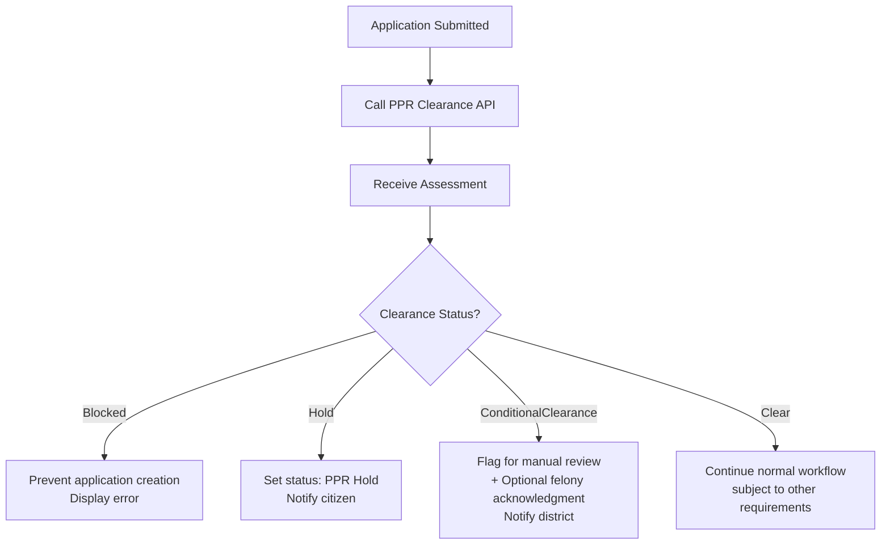

# Professional Practice Review (PPR)

- **Type:** Core Domain
- **Identifier:** profpractice
- **Primary Sources:** BRD 9.1, 9.2, 9.3, 9.4

---

## Purpose

The Professional Practice Review (PPR) domain manages the disclosure, review, and processing of criminal history and professional disciplinary events for Michigan educators. It enables educators to self-disclose incidents, integrates with external background check systems (Rap Back/CHRISS, NASDTEC), and provides administrative workflows for reviewing disclosures and determining eligibility for credential issuance and employment. This domain ensures state compliance with background check requirements and protects the safety of Michigan students.

---

## Scope

**This domain owns:**
- Self-disclosure submission and management (citizen-initiated reports of criminal history)
- Professional Practice Review (PPR) responses at regular intervals
- Disclosure record lifecycle (submission, review, status transitions, finalization)
- Integration with external criminal history systems (Rap Back/CHRISS, NASDTEC)
- PPR clearance assessment calculations (determining PPR-specific concerns for credentialing and employment decisions)
- PPR worklist management and case assignment
- Disclosure question configuration and branching logic
- Account-level review markers (Mandatory Hold Requirement, Enhanced Monitoring Status, Re-Review Requirement) at individual level
- Disclosure review workflows and status management
- Internal and external remarks/comments on disclosures
- Audit trail for all disclosure activities

**This domain does NOT own:**
- Credential application processing > owned by `credentialing`
- Employment roster management > owned by `staffing`
- Email/SMS notifications and template management > owned by `communications` (PPR domain publishes events; Communications handles template resolution, variable substitution, and delivery)
- Document upload/download, malware scanning, and storage > owned by `documents` (PPR domain references document IDs; Documents capability handles physical storage, virus scanning, and retrieval)
- Identity management and authentication > owned by `iam`
- Payment processing > owned by `payments`
- Rap Back enrollment/de-enrollment > supplementary functionality outside PPR domain

---

## Ubiquitous Language

| Term                                   | Definition                                                                                                                                                                                                                                                                                                                                   |
| -------------------------------------- | -------------------------------------------------------------------------------------------------------------------------------------------------------------------------------------------------------------------------------------------------------------------------------------------------------------------------------------------- |
| **Disclosure**                         | A report of a criminal history event (misdemeanor, felony) or professional disciplinary action submitted by an educator or discovered through background checks.                                                                                                                                                                             |
| **Self-Disclosure**                    | A voluntary report submitted by a citizen user documenting a new criminal conviction or professional disciplinary action.                                                                                                                                                                                                                    |
| **Professional Practice Review (PPR)** | A periodic compliance check where educators must affirm or update their disclosure status by answering standardized questions.                                                                                                                                                                                                               |
| **Professional Practice Response**     | The educator's submission of a PPR form, either confirming no new events or disclosing new incidents.                                                                                                                                                                                                                                        |
| **Disclosure Status**                  | The current state of a disclosure in the review workflow. Values include: Under PPR Review, PPR Hold, PPR Document Hold, Reviewed - No Action Required, Reviewed - Non-Enumerated, Reviewed - Misdemeanor, Reviewed - Felony, Reviewed - Listed, Reviewed - Arraignment.                                                                     |
| **PPR Clearance Assessment**           | Calculated outcome from PPR domain indicating whether an educator has any PPR-related concerns affecting credential applications. Provides PPR-specific clearance information to Credentialing domain. Computed on-demand from current disclosure statuses and account-level markers.                                                        |
| **Roster Eligibility Assessment**      | Calculated outcome from PPR domain indicating whether an educator has any PPR-related restrictions on employment. Provides PPR-specific eligibility information to Staffing domain. Computed on-demand from disclosure statuses and markers.                                                                                                 |
| **Rap Back / CHRISS**                  | Record of Arrest and Prosecution Background check service managed by Michigan State Police. Provides both push notifications when new criminal activity occurs (Rap Back notifications) and on-demand pull of full criminal history reports (rap sheets via CHRISS SOAP API). Rap sheets are display-only and never stored in MiEdWorkforce. |
| **NASDTEC**                            | National Association of State Directors of Teacher Education and Certification - interstate clearinghouse for educator discipline and misconduct.                                                                                                                                                                                            |
| **PPR Reviewer**                       | Staff member authorized to review disclosures, update statuses, and make processing determinations.                                                                                                                                                                                                                                          |
| **Mandatory Hold Requirement**         | Account-level marker indicating that all future credential applications must be placed in "PPR Hold" status upon submission, requiring manual review before processing can continue.                                                                                                                                                         |
| **Enhanced Monitoring Status**         | Account-level marker indicating that PPR administrators should receive alerts when applications are submitted, though normal processing continues. Used for educators requiring heightened oversight without full application blocking.                                                                                                      |
| **Re-Review Requirement**              | Account-level marker indicating that previously reviewed disclosures must be routed back to PPR worklist for additional scrutiny. Applies when educators with reviewed disclosures require escalated review due to new circumstances.                                                                                                        |
| **Annual PPR Compliance**              | Calculated determination of whether an educator has submitted a Professional Practice Review response since June 30 of the current year. Not a stored marker - computed based on most recent response date.                                                                                                                                  |
| **OEE Worklist**                       | Office of Educator Excellence worklist where new disclosures are routed for initial review.                                                                                                                                                                                                                                                  |
| **PPR Hold**                           | Temporary status indicating a credential application is paused while awaiting PPR review decisions or additional information.                                                                                                                                                                                                                |
| **PPR Document Hold**                  | Temporary status indicating a credential application is paused while awaiting supporting documentation from the educator.                                                                                                                                                                                                                    |
| **Internal Remarks**                   | Comments entered by PPR staff visible only to internal users, used for case notes and review documentation.                                                                                                                                                                                                                                  |
| **External Remarks**                   | Comments entered by PPR staff that may be visible to the educator or external parties, used for communication about processing decisions.                                                                                                                                                                                                    |
| **Conviction Date**                    | The date a criminal conviction or plea was entered, required for all criminal history disclosures.                                                                                                                                                                                                                                           |
| **Date Reported**                      | The date when a disclosure was submitted to MiEdWorkforce, automatically captured by the system.                                                                                                                                                                                                                                             |
| **Hard Delete**                        | Permanent removal of a document or record from the system, requiring DTMB intervention via ticket. Distinguished from soft delete.                                                                                                                                                                                                           |
| **Soft Delete**                        | Removal of a document or record from user-visible interfaces while retaining it in audit logs and system storage.                                                                                                                                                                                                                            |
| **Non-System Action**                  | Manual activities taken by PPR staff outside the system (phone calls, emails, external document reviews) that are documented in the disclosure audit trail.                                                                                                                                                                                  |

---

## Domain Model

### Core Aggregates

#### Disclosure

**Root Entity:** Disclosure

**Purpose:** Represents a single reported incident (criminal conviction or professional disciplinary action) submitted by an educator or identified through background checks. Manages the complete lifecycle from submission through final review determination.

**Entities & Value Objects:**
- **Disclosure** - The root entity representing the incident report
- **DisclosureType** - Category of incident: Misdemeanor, Felony, Credential Suspension, Credential Revocation, Credential Surrender, Credential Nullification, Pending Credential Action
- **DisclosureStatus** - Current review state (see lifecycle states below)
- **ConvictionDate** - Date of conviction or disciplinary action
- **DateReported** - System timestamp of submission
- **Description** - Free-text narrative of the incident (max 5000 characters)
- **Attachments** - References to supporting documents (court orders, police reports, etc.) managed by documents capability
- **InternalRemarks** - Staff-only comments and case notes
- **ExternalRemarks** - Comments potentially visible to educator
- **SourceType** - How disclosure was captured: SelfDisclosed, RapBackTriggered, NASDTECTriggered, PPRResponse, AdminEntered
- **AssociatedEducator** - Reference to the individual this disclosure pertains to
- **ReviewHistory** - Audit trail of all status changes and reviewer actions
- **NonSystemActions** - Log of external activities (phone calls, emails, manual document reviews)

**Key Invariants:**
- Conviction Date must not be in the future
- Description is required and cannot exceed 5000 characters
- At least one supporting document must be attached for self-disclosures
- Status transitions must follow valid workflow paths
- Once a disclosure reaches a "Reviewed" status, it cannot be edited without explicit reversion by PPR Admin
- Hard deletes require DTMB intervention; standard deletes are soft deletes

**Key States:**
- **Pending Review** - Initial state upon educator submission (BRD 9.1.6)
- **Under PPR Review** - Actively being reviewed by PPR staff (BRD 9.3.4)
- **PPR Hold** - Review paused pending additional information or decisions
- **PPR Document Hold** - Review paused pending documentation from educator
- **Reviewed - No Action Required** - Cleared, no impact on credentialing
- **Reviewed - Non-Enumerated** - Reviewed, minor issue not listed in statute
- **Reviewed - Misdemeanor** - Conviction documented, may have conditions
- **Reviewed - Felony** - Felony conviction, requires district felony disclosure form
- **Reviewed - Listed** - Conviction for enumerated offense, blocks credential issuance and employment
- **Reviewed - Arraignment** - Pending charges documented, monitoring required

**Referenced In:**
- Sequence: Submit Self-Disclosure
- Sequence: Submit Professional Practice Review Response
- Sequence: Review Disclosure and Update Status
- Sequence: Manage Account Markers
- Sequence: Route Disclosure to Worklist

---

#### ProfessionalPracticeResponse

**Root Entity:** ProfessionalPracticeResponse

**Purpose:** Represents a periodic compliance submission where educators affirm their disclosure status by answering standardized questions. Creates Disclosure records when new incidents are reported.

**Entities & Value Objects:**
- **ProfessionalPracticeResponse** - The root entity
- **ResponseDate** - When the PPR form was submitted
- **ResponseType** - PPR (periodic review) vs. Self-Disclosure
- **Questions** - Collection of configured PPR questions answered
- **Answers** - Educator's yes/no responses to each question
- **NewDisclosuresReported** - Boolean indicating whether new incidents were reported
- **CreatedDisclosureIds** - References to Disclosure aggregates created from "Yes" answers
- **ResponseStatus** - Current state: Pending Review, Under Review, Review Complete, No Review Needed
- **AssociatedEducator** - Reference to the individual
- **SubmittedAt** - Timestamp of submission

**Key Invariants:**
- All mandatory questions must be answered before submission
- If any answer is "Yes", at least one new Disclosure must be created
- Response cannot be deleted after submission, only soft-deleted by admin
- Responses are linked to disclosure reminder schedules
- PPR responses trigger the same workflows as self-disclosures (disclosures are routed to OEE worklist)

**Key States:** Pending Review, Under Review, Review Complete, No Review Needed

**Justification for Separate Aggregate:**
PPR responses have a distinct lifecycle from disclosures:
- They track compliance with periodic review deadlines (LastPPRDate, NextPPRDueDate)
- They capture structured answers to configured question sets
- They may result in zero new disclosures (all "No" answers)
- They have their own audit and reporting requirements (annual compliance tracking)

While they *create* Disclosure records when incidents are reported, the PPR Response aggregate itself represents the compliance activity, not the incident. This separation allows the system to track:
- Whether an educator completed their annual PPR (even if no new disclosures)
- Response history for audit purposes
- Reminder scheduling and escalation

**Referenced In:**
- Sequence: Submit Professional Practice Review Response
- Sequence: Schedule PPR Reminders

---

#### EducatorPPRStatus

**Root Entity:** EducatorPPRStatus

**Purpose:** Tracks account-level markers and provides query interface for PPR clearance assessments. Does NOT store a single "clearance status" - assessments are calculated on-demand from current disclosure statuses and markers.

**Entities & Value Objects:**
- **EducatorPPRStatus** - The root entity
- **EducatorId** - Reference to the individual
- **MandatoryHoldRequirement** - Boolean marker; when active, all credential applications must be placed in "PPR Hold" status upon submission (BRD 9.1.19)
- **EnhancedMonitoringStatus** - Boolean marker; when active, alerts PPR Review role but processing continues (BRD 9.1.20)
- **ReReviewRequirement** - Boolean marker; when active, forces previously reviewed disclosures back into worklist for additional scrutiny (BRD 9.1.8)
- **MarkerReasons** - Map of marker type to reason text (why each marker was set)
- **MarkerHistory** - Audit trail of marker changes (who set/cleared, when, why)
- **ActiveDisclosureIds** - Collection of disclosure IDs currently in active review
- **FinalizedDisclosureIds** - Collection of disclosure IDs with final "Reviewed" statuses
- **LastPPRResponseDate** - Date of most recent PPR annual response
- **NextPPRDueDate** - When next periodic review is required

**Key Capabilities:**

**Query Operations** (calculate on-demand, don't store state):
- Evaluate PPR clearance for credential applications - determines PPR-specific concerns that Credentialing must consider
- Determine if new application creation allowed - checks for blocking conditions before application workflow begins
- Check if district felony acknowledgment required - identifies when felony disclosures necessitate additional district acknowledgment
- Evaluate roster eligibility - determines PPR-specific employment restrictions for Staffing domain

**Command Operations:**
- Set/clear Mandatory Hold Requirement - requires justification and authorized role
- Set/clear Enhanced Monitoring Status - requires justification and authorized role
- Set/clear Re-Review Requirement - requires justification and authorized role

**Computed Properties:**
- Requires PPR Response - returns true if LastPPRResponseDate is before June 30 of current year (not a stored marker)

**Key Invariants:**
- Account markers can only be set/cleared by authorized PPR Review or Credentialing Admin roles
- Marker changes require justification and are fully audited
- An educator can have zero, one, or multiple account markers active simultaneously
- Account markers are independent of disclosure statuses (markers + disclosures combine to determine assessment outcome)
- Annual PPR compliance is computed from LastPPRResponseDate, not stored as a toggleable marker

**Referenced In:**
- Sequence: Determine PPR Clearance Assessment
- Sequence: Manage Account Markers
- Sequence: Process Credential Application (integration point with credentialing domain)
- Sequence: Attempt to Add Employee to Roster (integration point with staffing domain)

---

#### PPRClearanceAssessment

**Type:** Value Object (not persisted as aggregate)

**Purpose:** Represents PPR domain's assessment of an educator's disclosure status and account markers for use in credentialing workflows. This is **not** a final approval/denial decision - it provides PPR-specific clearance information that Credentialing domain combines with other factors (transcript evaluation, fee payment, etc.) to make final processing decisions.

**Returned By:** EducatorPPRStatus clearance evaluation operations. Calculated fresh on each request - never cached or stored.

**Structure:**

**PPR Clearance Status** (one of):
- **Clear** - No PPR concerns; educator may proceed through normal credentialing workflow
- **ConditionalClearance** - PPR has concerns but does not block processing; manual review or district acknowledgment required
- **Hold** - Active PPR review in progress; credentialing must wait for PPR determination
- **Blocked** - PPR has identified a disqualifying condition; credentialing cannot proceed

**Assessment Components:**
- **ClearanceStatus** - The PPR determination (see above)
- **BlockingReason** - Human-readable explanation if status is Hold or Blocked
- **DistrictNotifications** - Messages that must be displayed to district users (collection of strings)
- **RequiresFelonyAcknowledgment** - Boolean indicating whether district must complete felony disclosure acknowledgment form
- **ReviewTriggers** - Reasons why ConditionalClearance status was assigned rather than Clear (collection of strings)

**Example Assessments:**

**Scenario 1: Mandatory Hold Requirement Active**
```json
{
  "clearanceStatus": "Hold",
  "blockingReason": "Mandatory Hold Requirement active - educator marked for administrative review",
  "districtNotifications": [
    "The selected individual requires further review that may delay or deny the requested application. Please contact MDE-Professional-Practice@Michigan.gov with any questions."
  ],
  "requiresFelonyAcknowledgment": false,
  "reviewTriggers": []
}
```

**Scenario 2: Reviewed - Listed Disclosure**
```json
{
  "clearanceStatus": "Blocked",
  "blockingReason": "Enumerated offense on record - statutory disqualification",
  "districtNotifications": [
    "Credential Applications: The selected individual may not be issued a credential based upon information provided in their disclosure(s). Please review the individual's account and confirm with IChat if you have further questions.",
    "Employment Roster: The selected individual may not be employed by a school district based upon information provided in their disclosure(s). Please review the individual's account and confirm with IChat if you have further questions."
  ],
  "requiresFelonyAcknowledgment": false,
  "reviewTriggers": []
}
```

**Scenario 3: Reviewed - Felony Disclosure**
```json
{
  "clearanceStatus": "ConditionalClearance",
  "blockingReason": null,
  "districtNotifications": [
    "The selected individual has a disclosure(s) that necessitates additional actions by the district. Please complete the felony disclosure form to confirm understanding of the convictions on record and approval of employment. The application will not proceed until this form has been received. Please review the individual's account and confirm with IChat if you have further questions."
  ],
  "requiresFelonyAcknowledgment": true,
  "reviewTriggers": ["FelonyConvictionRequiresDistrictAcknowledgment"]
}
```

**Scenario 4: Active PPR Review**
```json
{
  "clearanceStatus": "Hold",
  "blockingReason": "Disclosure under active PPR review - awaiting determination",
  "districtNotifications": [
    "The selected individual requires further review that may delay or deny the requested application. Please contact MDE-Professional-Practice@Michigan.gov with any questions."
  ],
  "requiresFelonyAcknowledgment": false,
  "reviewTriggers": []
}
```

**Scenario 5: Enhanced Monitoring Status Active**
```json
{
  "clearanceStatus": "ConditionalClearance",
  "blockingReason": null,
  "districtNotifications": [],
  "requiresFelonyAcknowledgment": false,
  "reviewTriggers": ["EnhancedMonitoringStatusActive"]
}
```

**Scenario 6: No PPR Concerns**
```json
{
  "clearanceStatus": "Clear",
  "blockingReason": null,
  "districtNotifications": [],
  "requiresFelonyAcknowledgment": false,
  "reviewTriggers": []
}
```

**Integration Notes:**
- Credentialing domain calls this via API and uses the assessment to determine next steps in application workflow
- A `Clear` status does not guarantee application approval - other credentialing requirements may still block
- A `Blocked` status means PPR has identified a statutory disqualification - Credentialing should prevent application creation/processing
- `ConditionalClearance` and `Hold` statuses require Credentialing to implement additional logic (manual review routing, district form requirements, hold states)

---

#### RosterEligibilityAssessment

**Type:** Value Object (not persisted as aggregate)

**Purpose:** Represents PPR domain's assessment of whether an educator may be added to a district employment roster. Like PPRClearanceAssessment, this provides PPR-specific information that Staffing domain uses in combination with other employment criteria.

**Returned By:** EducatorPPRStatus roster eligibility evaluation. Calculated fresh on each request.

**Structure:**

**Roster Eligibility Status** (one of):
- **Eligible** - No PPR restrictions on employment
- **EligibleWithNotification** - Employment allowed but district must be informed of disclosure history
- **Ineligible** - PPR has identified a condition that prevents employment

**Assessment Components:**
- **EligibilityStatus** - The PPR determination (see above)
- **BlockingReason** - Human-readable explanation if Ineligible
- **DistrictNotifications** - Messages that must be displayed to district users (collection of strings)

**Example Assessments:**

**Scenario 1: Reviewed - Listed Disclosure**
```json
{
  "eligibilityStatus": "Ineligible",
  "blockingReason": "Enumerated offense - statutory employment prohibition",
  "districtNotifications": [
    "The selected individual may not be employed by a school district based upon information provided in their disclosure(s). Please review the individual's account and confirm with IChat if you have further questions."
  ]
}
```

**Scenario 2: Reviewed - Felony Disclosure**
```json
{
  "eligibilityStatus": "EligibleWithNotification",
  "blockingReason": null,
  "districtNotifications": [
    "The selected individual has a felony conviction on record. Please ensure all required acknowledgment forms have been completed before finalizing employment."
  ]
}
```

**Scenario 3: No PPR Concerns**
```json
{
  "eligibilityStatus": "Eligible",
  "blockingReason": null,
  "districtNotifications": []
}
```

**Integration Notes:**
- Staffing domain calls this via API before allowing roster additions
- An `Ineligible` status is a hard block - Staffing must prevent roster addition
- `EligibleWithNotification` requires Staffing to display messages but allow the addition to proceed

---

#### PPRWorklist

**Root Entity:** PPRWorklist

**Purpose:** Organizes disclosures requiring review into queues for PPR staff, with filtering, prioritization, and assignment capabilities.

**Note:** This aggregate is owned entirely by the Professional Practice Review domain — routing rules, reviewer assignment, prioritization, and filter/visibility configuration are all PPR-specific business logic, not a hand-off to a separate cross-domain "worklist" capability. See Open Question below: this goes beyond the platform's general worklist-as-list-view pattern (see `solution-level/solution-architecture.md`'s Worklist / Pending-Items Pattern) and needs client confirmation.

**Entities & Value Objects:**
- **PPRWorklist** - The worklist itself
- **WorklistName** - Identifier (e.g., "OEE Initial Review", "Felony Review", "Document Hold Follow-up")
- **RoutingRules** - Conditions that automatically route disclosures to this worklist (based on disclosure status, type, date ranges)
- **AssignedReviewers** - PPR staff authorized to work items in this queue
- **QueuedDisclosureIds** - Disclosures currently in this worklist
- **PriorityRules** - Sorting criteria (by date reported, conviction date, disclosure type)
- **FilterConfiguration** - Available filter options (status, date ranges, disclosure type)
- **VisibilitySettings** - Which statuses/markers are visible to reviewers in this worklist (BRD 9.2.2)

**Key Invariants:**
- A disclosure can only be in one worklist at a time
- Routing rules cannot conflict across worklists
- At least one reviewer must be assigned to an active worklist
- Disclosures are not locked when assigned to reviewers (BRD 9.1.6 - multiple reviewers can view/edit)

**Key States:** Active, Paused

**Referenced In:**
- Sequence: Route Disclosure to Worklist
- Sequence: Configure PPR Worklist
- Sequence: Review Disclosure from Worklist

---

#### ExternalBackgroundCheck

**Root Entity:** ExternalBackgroundCheck

**Purpose:** Manages integration data and responses from external background check systems (Rap Back/CHRISS, NASDTEC). Separate from Disclosure aggregate to isolate external system concerns.

**Entities & Value Objects:**
- **ExternalBackgroundCheck** - The root entity
- **CheckSource** - System that provided data: RapBack, CHRISS, NASDTEC
- **EducatorId** - Individual being checked
- **CheckDate** - When the check was performed or data received
- **ResponseData** - Structured metadata from external system (notification date, TCN, judicial marker, etc. for Rap Back; clearinghouse ID, jurisdiction for NASDTEC)
- **NotificationDate** - When Rap Back notification was received (for Rap Back only)
- **MatchStatus** - Whether external data matches existing disclosures or represents new information
- **RequiresEducatorResponse** - Boolean indicating educator must provide disclosure or comment
- **AssociatedDisclosureIds** - Links to Disclosure aggregates created from this check
- **RapSheetRetrievalLog** - Audit trail of on-demand rap sheet retrievals (user, timestamp) - rap sheet content is NEVER stored

**Key Invariants:**
- Rap Back responses are read-only for PPR staff (notification metadata stored, not full rap sheet)
- External check data is retained for audit purposes even after review
- New external findings trigger automatic creation of disclosure records requiring educator acknowledgment
- Integration failures are logged but do not block manual disclosure processing
- **Rap sheets retrieved via SOAP `GET_RAPBACK` call are display-only, NEVER stored in system**

**Key States:** Pending, Received, Matched, RequiresEducatorAction, Resolved

**Referenced In:**
- Sequence: Receive Rap Back Notification
- Sequence: Retrieve Full Rap Sheet for Review
- Sequence: Process NASDTEC Nightly Batch
- Sequence: Review External Background Check Data

---

### Supporting Aggregates

#### PPRQuestionConfiguration

**Root Entity:** PPRQuestionConfiguration

**Purpose:** Defines the questions, branching logic, and validation rules for PPR response forms and self-disclosure forms. Allows administrators to update form structure without code changes.

**Note:** While PPR domain *uses* these configurations to present forms to educators, the actual configuration management may be owned by a forms/configuration capability that serves multiple domains. PPR domain is a heavy consumer and may have domain-specific configuration needs, but the aggregate definition here represents the interface/contract PPR needs rather than necessarily owning the storage and lifecycle.

**Entities & Value Objects:**
- **PPRQuestionConfiguration** - The configuration itself
- **FormType** - Which form this applies to: PPR Response, Self-Disclosure
- **Questions** - Collection of configured questions
- **QuestionText** - The actual question displayed to users
- **ResponseType** - Expected answer format: YesNo, Date, FreeText, FileUpload, Dropdown
- **IsRequired** - Whether question must be answered
- **ValidationRules** - Field-level validation (date formats, character limits, file types)
- **BranchingLogic** - Conditional follow-up questions (e.g., if "Yes" to felony question, show conviction date field)
- **DisplayOrder** - Sequence in which questions appear
- **EffectiveDate** - When this configuration version becomes active
- **IsActive** - Whether this configuration is currently in use

**Key Invariants:**
- At least one question must be configured for each form type
- Required questions cannot be made optional for in-progress responses
- Branching logic must reference valid question IDs
- Changes to configurations create new versions rather than modifying existing ones
- Question order must be sequential and unique

**Key States:** Draft, Active, Inactive

**Dependency Note:** If a cross-domain forms configuration capability exists, PPR would consume from it rather than own this aggregate. Decision pending architecture review.

**Referenced In:**
- Sequence: Submit Professional Practice Review Response
- Sequence: Submit Self-Disclosure

---

### Entity Relationship Diagram

```mermaid
---
title: Professional Practice Review ERD
---
erDiagram
    DISCLOSURES ||--o{ DISCLOSURE_REMARKS : "has"
    DISCLOSURES ||--o{ DISCLOSURE_DOCUMENT_REFS : "references"
    DISCLOSURES ||--o{ NON_SYSTEM_ACTIONS : "has"
    DISCLOSURES ||--o{ DISCLOSURE_STATUS_HISTORY : "tracks"
    DISCLOSURES ||--o{ DISCLOSURE_EVENTS : "generates"
    DISCLOSURES }o--o| EXTERNAL_BACKGROUND_CHECKS : "linked to"
    DISCLOSURES }o--o| PPR_RESPONSES : "created by"
    DISCLOSURES }o--o| PPR_WORKLISTS : "queued in"

    PPR_RESPONSES ||--o{ PPR_RESPONSE_ANSWERS : "contains"
    PPR_RESPONSES ||--o{ PPR_RESPONSE_EVENTS : "generates"

    EDUCATOR_PPR_STATUS ||--o{ ACCOUNT_MARKER_HISTORY : "tracks"
    EDUCATOR_PPR_STATUS ||--o{ EDUCATOR_PPR_STATUS_EVENTS : "generates"

    PPR_WORKLISTS ||--o{ WORKLIST_ROUTING_RULES : "configured by"
    PPR_WORKLISTS ||--o{ WORKLIST_REVIEWER_ASSIGNMENTS : "has"

    EXTERNAL_BACKGROUND_CHECKS ||--o{ RAPSHEET_RETRIEVAL_LOG : "audits"
    EXTERNAL_BACKGROUND_CHECKS ||--o{ EXTERNAL_CHECK_REMARKS : "has"
    EXTERNAL_BACKGROUND_CHECKS ||--o{ EXTERNAL_CHECK_EVENTS : "generates"

    PPR_QUESTION_CONFIGURATIONS ||--o{ PPR_QUESTIONS : "contains"
    PPR_QUESTIONS ||--o{ QUESTION_BRANCHING_RULES : "has"

    NASDTEC_RECORDS ||--|| EXTERNAL_BACKGROUND_CHECKS : "linked to"

    DISCLOSURES {
        uuid disclosure_id PK "Unique disclosure ID"
        string educator_unique_id FK "Mi-Key Unique ID"
        string disclosure_type "Misdemeanor|Felony|CredentialSuspension|CredentialRevocation|CredentialSurrender|CredentialNullification|PendingCredentialAction"
        string status "PendingReview|UnderPprReview|PprHold|PprDocumentHold|ReviewedNoActionRequired|ReviewedNonEnumerated|ReviewedMisdemeanor|ReviewedFelony|ReviewedListed|ReviewedArraignment"
        string source_type "SelfDisclosed|RapBackTriggered|NASDTECTriggered|PPRResponse|AdminEntered"
        date conviction_date "Must not be future-dated"
        datetime date_reported "System-captured submission timestamp"
        string description "Max 5000 characters. Required for self-disclosures"
        uuid ppr_response_id FK "NULL if not created via PPR response"
        uuid external_check_id FK "NULL if not triggered by Rap Back or NASDTEC"
        uuid worklist_id FK "Current worklist assignment; NULL if unassigned"
        boolean is_locked "True once status reaches any Reviewed state"
        datetime locked_at "Timestamp when disclosure was finalized"
        uuid locked_by FK "Reviewer who finalized"
        boolean is_deleted "Soft delete flag"
        datetime deleted_at "NULL if not deleted"
        uuid deleted_by FK "NULL if not deleted"
        datetime created_at
        uuid created_by FK
        datetime updated_at
        uuid updated_by FK
    }

    DISCLOSURE_REMARKS {
        uuid remark_id PK
        uuid disclosure_id FK
        string remark_type "Internal|External"
        string remark_text "Max 5000 characters"
        uuid added_by FK "User who added the remark"
        datetime added_at
    }

    DISCLOSURE_DOCUMENT_REFS {
        uuid ref_id PK
        uuid disclosure_id FK
        uuid document_id "Document ID managed by Documents capability"
        boolean is_deleted "Soft delete flag"
        datetime deleted_at "NULL if not deleted"
        uuid deleted_by FK "NULL if not deleted"
        datetime created_at
        uuid created_by FK
    }

    NON_SYSTEM_ACTIONS {
        uuid action_id PK
        uuid disclosure_id FK
        string action_type "NotifiedSchoolDistrict|ReferredToPPR|NotifiedMSPRemoval|ContactedEducator|ReviewedExternalDocuments|Other"
        string description "Free-form description of external action"
        uuid logged_by FK
        datetime logged_at
    }

    DISCLOSURE_STATUS_HISTORY {
        uuid history_id PK
        uuid disclosure_id FK
        string previous_status "Nullable - NULL for initial creation"
        string new_status
        uuid changed_by FK
        datetime changed_at
        string review_notes "Nullable - required when transitioning to Reviewed states"
    }

    DISCLOSURE_EVENTS {
        uuid event_id PK
        uuid aggregate_id FK "disclosure_id"
        string event_type "DisclosureSubmitted|DisclosureStatusChanged|DisclosureRoutedToWorklist|DisclosureReviewStarted|DisclosureReviewCompleted|NonSystemActionLogged"
        datetime event_timestamp
        int event_version "Optimistic concurrency"
        json event_payload
        uuid caused_by_user_id FK
        uuid correlation_id "Distributed tracing"
        binary event_hash "SHA256 for tamper detection"
        binary previous_event_hash "Hash chain"
    }

    PPR_RESPONSES {
        uuid response_id PK
        string educator_unique_id FK "Mi-Key Unique ID"
        datetime response_date "Submission timestamp"
        string response_type "PPRResponse"
        string response_status "PendingReview|UnderReview|ReviewComplete|NoReviewNeeded"
        boolean new_disclosures_reported "True if any Yes answers provided"
        datetime created_at
    }

    PPR_RESPONSE_ANSWERS {
        uuid answer_id PK
        uuid response_id FK
        string question_key "References PPR_QUESTIONS.question_key"
        string answer "Yes|No"
        json follow_up_answers "Branching responses; NULL if answer=No"
    }

    PPR_RESPONSE_EVENTS {
        uuid event_id PK
        uuid aggregate_id FK "response_id"
        string event_type "PPRResponseSubmitted"
        datetime event_timestamp
        int event_version
        json event_payload
        uuid caused_by_user_id FK
        uuid correlation_id
        binary event_hash
        binary previous_event_hash
    }

    EDUCATOR_PPR_STATUS {
        uuid status_id PK
        string educator_unique_id UK "Mi-Key Unique ID"
        boolean mandatory_hold_requirement "Account marker: blocks all credential applications"
        string mandatory_hold_reason "NULL if not active"
        boolean enhanced_monitoring_status "Account marker: alerts PPR staff, does not block"
        string enhanced_monitoring_reason "NULL if not active"
        boolean re_review_requirement "Account marker: re-routes previously reviewed disclosures"
        string re_review_reason "NULL if not active"
        date last_ppr_response_date "NULL if no response yet"
        datetime created_at
        datetime updated_at
    }

    ACCOUNT_MARKER_HISTORY {
        uuid history_id PK
        uuid status_id FK "educator_ppr_status reference"
        string marker_type "MandatoryHoldRequirement|EnhancedMonitoringStatus|ReReviewRequirement"
        boolean marker_active "True=activated, False=cleared"
        string justification "Required; max 2000 characters"
        uuid changed_by FK
        datetime changed_at
    }

    EDUCATOR_PPR_STATUS_EVENTS {
        uuid event_id PK
        uuid aggregate_id FK "status_id"
        string event_type "PPRAccountMarkerChanged|PPRClearanceAssessmentChanged|PPRReminderRequired"
        datetime event_timestamp
        int event_version
        json event_payload
        uuid caused_by_user_id FK
        uuid correlation_id
        binary event_hash
        binary previous_event_hash
    }

    PPR_WORKLISTS {
        uuid worklist_id PK
        string worklist_name UK
        string status "Active|Paused"
        json priority_rules "Ordered sort criteria"
        json visibility_settings "Which statuses and markers are visible to reviewers"
        datetime created_at
        uuid created_by FK
        datetime updated_at
    }

    WORKLIST_ROUTING_RULES {
        uuid rule_id PK
        uuid worklist_id FK
        string field "disclosureType|disclosureStatus|sourceType|convictionDateFrom|convictionDateTo"
        string operator "equals|in|before|after"
        string value "Rule condition value"
        int rule_order "Evaluation sequence"
    }

    WORKLIST_REVIEWER_ASSIGNMENTS {
        uuid assignment_id PK
        uuid worklist_id FK
        uuid reviewer_user_id FK
        datetime assigned_at
    }

    EXTERNAL_BACKGROUND_CHECKS {
        uuid check_id PK
        string check_source "RapBack|CHRISS|NASDTEC"
        string educator_unique_id FK "Mi-Key Unique ID; NULL until person matched"
        datetime check_date "When notification received or batch ran"
        string match_status "Pending|Received|Matched|RequiresEducatorAction|Resolved"
        boolean requires_educator_response
        string tcn "Rap Back Transaction Control Number; NULL for NASDTEC"
        date notification_date "Rap Back notification date; NULL for NASDTEC"
        string judicial_marker "Rap Back criminal event indicator; NULL for NASDTEC"
        string pic "Rap Back Person Identifier; NULL if empty in source"
        uuid nasdtec_record_id FK "NULL for Rap Back checks"
        datetime created_at
        datetime updated_at
    }

    RAPSHEET_RETRIEVAL_LOG {
        uuid log_id PK
        uuid check_id FK "ExternalBackgroundCheck reference"
        uuid retrieved_by FK "PPR Reviewer user ID"
        datetime retrieved_at
    }

    EXTERNAL_CHECK_REMARKS {
        uuid remark_id PK
        uuid check_id FK
        string remark_text "Max 5000 characters"
        uuid added_by FK
        datetime added_at
    }

    EXTERNAL_CHECK_EVENTS {
        uuid event_id PK
        uuid aggregate_id FK "check_id"
        string event_type "RapBackNotificationReceived|NASDTECRecordMatched"
        datetime event_timestamp
        int event_version
        json event_payload
        uuid caused_by_user_id FK
        uuid correlation_id
        binary event_hash
        binary previous_event_hash
    }

    NASDTEC_RECORDS {
        uuid nasdtec_record_id PK
        uuid check_id FK "Linked ExternalBackgroundCheck"
        string last_name
        string first_name
        string middle_name "Nullable"
        string suffix_name "Nullable"
        date birth_date
        string certification_id "SSN - used for Mi-Key matching"
        string educator_unique_id FK "NULL until matched via Mi-Key"
        string jurisdiction "Source state/territory"
        date transaction_date
        string clearinghouse_id UK "NASDTEC unique identifier; prevents duplicate processing"
        string clearinghouse_url "Link to full disciplinary record on NASDTEC site"
        datetime synced_at "When nightly batch retrieved this record"
    }

    PPR_QUESTION_CONFIGURATIONS {
        uuid configuration_id PK
        string form_type "PPRResponse|SelfDisclosure"
        date effective_date "When this version becomes active"
        boolean is_active
        datetime created_at
        uuid created_by FK
    }

    PPR_QUESTIONS {
        uuid question_id PK
        uuid configuration_id FK
        string question_key UK "Stable identifier for branching references"
        string question_text
        string response_type "YesNo|Date|FreeText|FileUpload|Dropdown"
        boolean is_required
        int display_order "Unique sequence within configuration"
    }

    QUESTION_BRANCHING_RULES {
        uuid rule_id PK
        uuid question_id FK
        string trigger_answer "Answer value that activates this branch"
        json follow_up_question_keys "Array of question_key values to show"
    }
```



---

## Domain Events

Events published by this domain that other domains may subscribe to:

| Event                           | Aggregate                    | Trigger                                                                                  | Payload Highlights                                                                                          | Consumers                                      |
| ------------------------------- | ---------------------------- | ---------------------------------------------------------------------------------------- | ----------------------------------------------------------------------------------------------------------- | ---------------------------------------------- |
| `DisclosureSubmitted`           | Disclosure                   | Educator submits self-disclosure or PPR response with new incidents                      | `{ disclosureId, educatorId, disclosureType, convictionDate, submittedAt, sourceType }`                     | credentialing, communications, audit           |
| `DisclosureStatusChanged`       | Disclosure                   | PPR reviewer changes disclosure status                                                   | `{ disclosureId, educatorId, previousStatus, newStatus, changedAt, changedBy }`                             | credentialing, staffing, communications, audit |
| `PPRAccountMarkerChanged`       | EducatorPPRStatus            | Account marker set or cleared on educator                                                | `{ educatorId, markerType: "MandatoryHoldRequirement"                                                       | "EnhancedMonitoringStatus"                     |
| `PPRClearanceAssessmentChanged` | EducatorPPRStatus            | Disclosure status change, marker change, or any condition affecting clearance assessment | `{ educatorId, previousAssessment: {...}, newAssessment: {...}, triggeredBy: "DisclosureStatusChange"       | "MarkerChange"                                 |
| `PPRResponseSubmitted`          | ProfessionalPracticeResponse | Educator completes periodic PPR review                                                   | `{ responseId, educatorId, responseDate, newDisclosuresReported, createdDisclosureIds, responseStatus }`    | communications, audit                          |
| `RapBackNotificationReceived`   | ExternalBackgroundCheck      | Rap Back system sends new criminal activity notification                                 | `{ checkId, educatorId, notificationDate, tcn, judicialMarker, requiresEducatorResponse }`                  | credentialing, communications, audit           |
| `NASDTECRecordMatched`          | ExternalBackgroundCheck      | NASDTEC nightly batch identified educator with out-of-state disciplinary action          | `{ checkId, educatorId, jurisdiction, transactionDate, clearinghouseId, clearinghouseUrl, requiresReview }` | credentialing, communications, audit           |
| `DisclosureRoutedToWorklist`    | Disclosure                   | Disclosure assigned to PPR worklist                                                      | `{ disclosureId, worklistId, routedAt, routingReason }`                                                     | communications, audit                          |
| `DisclosureReviewStarted`       | Disclosure                   | PPR reviewer begins reviewing disclosure                                                 | `{ disclosureId, reviewerId, reviewStartedAt }`                                                             | audit                                          |
| `DisclosureReviewCompleted`     | Disclosure                   | PPR reviewer finalizes disclosure to "Reviewed" status                                   | `{ disclosureId, reviewerId, finalStatus, reviewCompletedAt }`                                              | credentialing, staffing, communications, audit |
| `PPRReminderRequired`           | EducatorPPRStatus            | System determines educator needs PPR reminder based on compliance calculation            | `{ educatorId, reminderType, dueDate, currentComplianceStatus }`                                            | communications, audit                          |
| `NonSystemActionLogged`         | Disclosure                   | Reviewer documents external action (phone call, email, etc.)                             | `{ disclosureId, actionType: "NotifiedSchoolDistrict"                                                       | "ReferredToPPR"                                |

**Event Naming Convention:** PastTense[Noun][Action] (e.g., `DisclosureSubmitted`, `AssessmentChanged`)

**Published To:** Azure Service Bus topic: `profpractice-events`

**Note on Communications:** PPR domain publishes domain events indicating *what happened* (e.g., `DisclosureStatusChanged`, `PPRReminderRequired`). The Communications capability subscribes to these events and determines *how to notify* users based on configured templates, delivery preferences, and communication rules. PPR does not own email template management or delivery logic.

---

## Dependencies

### Upstream (We Consume From)

| Source                  | What We Need                             | How We Get It                                                                        | Notes                                                                                                                                                             |
| ----------------------- | ---------------------------------------- | ------------------------------------------------------------------------------------ | ----------------------------------------------------------------------------------------------------------------------------------------------------------------- |
| **iam**                 | User identity and permissions            | REST API for authorization checks                                                    | Determines who can review disclosures, configure questions                                                                                                        |
| **documents**           | Document upload/download, virus scanning | REST API for document upload, retrieval, soft/hard delete                            | PPR stores document IDs in disclosure attachments; Documents capability handles physical storage, malware scanning, and audit                                     |
| **communications**      | Email delivery and template management   | Event publication (PPR publishes events; Communications subscribes and sends emails) | Communications owns template management, variable resolution, and delivery scheduling. PPR publishes events like `DisclosureStatusChanged`, `PPRReminderRequired` |
| **credentialing**       | Credential application status            | Event subscription (`CredentialApplicationSubmitted`)                                | Used to trigger PPR clearance evaluation when applications submitted                                                                                              |
| **staffing**            | Employment roster attempts               | Event subscription (`EmployeeRosterAdditionAttempted`) or synchronous API call       | Triggers assessments when educators are added to rosters                                                                                                          |
| **Rap Back** (external) | Criminal history notifications           | Push notifications via webhook (Integration A from spec)                             | MSP sends daily notifications; MiEdWorkforce exposes endpoint                                                                                                     |
| **CHRISS** (external)   | Full rap sheet retrieval                 | SOAP 1.2 call to `GET_RAPBACK` (Integration B from spec)                             | On-demand retrieval by PPR staff; content displayed but NEVER stored                                                                                              |
| **NASDTEC** (external)  | Interstate educator discipline records   | Nightly REST API pull (`/v1/clearinghouse/people`)                                   | Bulk list download, local storage for search/reference                                                                                                            |
| **Mi-Key**              | Person matching for Rap Back/NASDTEC     | REST API call with SSN/DOB/Name                                                      | Required whenRap Back `pic` field is empty or NASDTEC CertificationID needs matching to Unique ID                                                                 |

### Downstream (Others Consume From Us)

| Consumer                           | What They Need                      | How They Get It                                                                                                | Notes                                                                                        |
| ---------------------------------- | ----------------------------------- | -------------------------------------------------------------------------------------------------------------- | -------------------------------------------------------------------------------------------- |
| **credentialing**                  | PPR clearance assessments           | REST API call: `GET /educators/{id}/ppr-clearance` + Event subscription (`PPRClearanceAssessmentChanged`)      | Credentialing calls API on submission; subscribes to events for in-progress applications     |
| **staffing**                       | Roster eligibility assessments      | REST API call: `GET /educators/{id}/roster-eligibility` + Event subscription (`PPRClearanceAssessmentChanged`) | Staffing validates before roster addition; subscribes to events for active roster monitoring |
| **communications**                 | Disclosure events for notifications | Event subscription (all disclosure/status change events, `PPRReminderRequired`)                                | Communications subscribes to events and sends templated emails/SMS                           |
| **iam**                            | PPR-based access restrictions       | Event subscription (`PPRClearanceAssessmentChanged`)                                                           | May restrict system access for blocked individuals                                           |
| **audit**                          | All domain events                   | Event subscription (all events)                                                                                | Compliance and audit trail                                                                   |
| **reporting**                      | PPR metrics and compliance reports  | REST API / data replication                                                                                    | Dashboards, state reporting                                                                  |

---

## Business Rules

### PPR Clearance Assessment Rule

**Rule:** When a credential application is submitted (or re-evaluated during processing), the system calculates PPR clearance by evaluating **in priority order**:

1. **Mandatory Hold Requirement active** -> `Hold` (credentialing sets application status: PPR Hold)
2. **"Reviewed - Listed" disclosure exists** -> `Blocked` (credentialing prevents application creation)
3. **"Reviewed - Felony" disclosure exists** -> `ConditionalClearance` + felony acknowledgment required
4. **Active review disclosure exists** ("Under PPR Review", "PPR Hold", "PPR Document Hold") -> `Hold` (application paused)
5. **Other reviewed disclosures exist** ("Reviewed - Misdemeanor", "Reviewed - Arraignment", "Reviewed - Non-Enumerated") -> `ConditionalClearance` or `Clear` (optional district message)
6. **Enhanced Monitoring Status active** -> `ConditionalClearance` (alert sent, processing continues)
7. **No concerns** -> `Clear` (normal processing)

**Rationale:** Keeps decision logic flexible and auditable. Changing business rules doesn't require database migrations - just update the evaluation method. Most restrictive condition takes precedence. This is PPR's assessment only - Credentialing makes final approval/denial decisions combining PPR clearance with other factors.

**Enforced By:** EducatorPPRStatus clearance evaluation, called by Credentialing domain during application submission and status transitions.

**Example:** An educator with a past felony DUI conviction, status "Reviewed - Felony", applies for a teaching certificate. PPR returns ConditionalClearance with requiresFelonyAcknowledgment=true and a districtNotifications message asking the district to complete the felony disclosure acknowledgment form; Credentialing flags the application for manual review rather than auto-approving.

**Integration Pattern with Credentialing:**

When a credential application is submitted or re-evaluated, Credentialing domain:
1. Calls PPR API: `GET /educators/{id}/ppr-clearance`
2. Receives PPRClearanceAssessment value object
3. Takes action based on ClearanceStatus:
   - **Blocked** -> Prevent application creation/processing, display error
   - **Hold** -> Set application status to "PPR Hold", notify citizen
   - **ConditionalClearance** -> Flag for manual review, optionally set felony acknowledgment requirement, notify district
   - **Clear** -> Continue normal processing (still subject to other credentialing requirements)

**Event Subscription:**

Credentialing subscribes to `PPRClearanceAssessmentChanged` events. When received:
1. Retrieve all in-progress applications for the affected educator
2. Re-evaluate PPR clearance for each application
3. Update application statuses accordingly

**Decision Flow:**



---

### Roster Eligibility Assessment Rule

**Rule:** When a district attempts to add an educator to an employment roster, the system evaluates PPR eligibility **in priority order**:

1. **"Reviewed - Listed" disclosures exist** -> `Ineligible` (statutory employment prohibition)
2. **"Reviewed - Felony" disclosures exist** -> `EligibleWithNotification` (requires felony acknowledgment)
3. **Active review disclosures exist** ("Under PPR Review", "PPR Hold", "PPR Document Hold") -> `Ineligible` (blocked until review complete)
4. **Other reviewed disclosures exist** -> `Eligible` or `EligibleWithNotification` (optional message)

**Rationale:** Employment eligibility has stricter constraints than credential application eligibility. Listed offenses are absolute employment barriers per state statute.

**Enforced By:** EducatorPPRStatus roster eligibility evaluation, called by Staffing domain during roster addition.

**Example:** A district HR user tries to add a teacher with a "Reviewed - Listed" disclosure (child abuse conviction) to their roster. PPR returns Ineligible; Staffing blocks the addition and displays: 'This individual has a disqualifying conviction and cannot be employed in Michigan schools.'

**Integration Pattern:**

When a district attempts to add an educator to roster, Staffing domain:
1. Calls PPR API: `GET /educators/{id}/roster-eligibility`
2. Receives RosterEligibilityAssessment value object
3. Takes action based on EligibilityStatus:
   - **Ineligible** -> Prevent roster addition, display error with blocking reason and district messages
   - **EligibleWithNotification** -> Allow roster addition, notify district with messages
   - **Eligible** -> Allow roster addition with no restrictions

---

### Mandatory Hold Requirement Auto-Hold Rule

**Rule:** When Mandatory Hold Requirement is active for an educator (BRD 9.1.19):
- All credential applications receive `Hold` clearance status upon submission
- Citizen is notified: "application under review that may delay or deny"
- Applications cannot proceed until marker is cleared by PPR Review role
- Rap Back and NASDTEC checks may still occur in background

**Rationale:** Provides blanket hold for high-risk individuals pending investigation.

**Enforced By:** EducatorPPRStatus clearance evaluation checks Mandatory Hold Requirement first (priority 1).

**Example:** An educator is under criminal investigation. PPR Admin activates Mandatory Hold Requirement. When the educator applies for a permit, PPR returns `Hold` status and Credentialing sets application to "PPR Hold" - cannot auto-approve regardless of other eligibility factors.

---

### Reviewed - Listed Absolute Block Rule

**Rule:** When an educator has ANY disclosure in "Reviewed - Listed" status (BRD 9.1.6):
- **Cannot create new credential applications** - PPR returns `Blocked` status; Credentialing displays error
- **Cannot be added to employment roster** - PPR returns `Ineligible` status; Staffing displays error
- No exceptions, no overrides (without changing disclosure status)

**Rationale:** Listed offenses are enumerated in state statute as absolute disqualifiers. No credential or employment allowed.

**Enforced By:** EducatorPPRStatus clearance and eligibility evaluations check for Listed disclosures (priority 2).

**Example:** A district HR user tries to add a new teacher to their roster. The teacher has a disclosure with status "Reviewed - Listed" (child abuse conviction). PPR returns `Ineligible`. Staffing blocks the addition and displays error: "This individual has a disqualifying conviction and cannot be employed in Michigan schools."

---

### Reviewed - Felony Conditional Processing Rule

**Rule:** When an educator has ANY disclosure in "Reviewed - Felony" status (BRD 9.1.9b):
- Credential application can be created and submitted
- PPR returns `ConditionalClearance` with `requiresFelonyAcknowledgment = true`
- Application **cannot auto-approve** - requires manual review
- District must complete felony disclosure acknowledgment form before application proceeds
- District sees message: "Please complete the felony disclosure form to confirm understanding..."

**Rationale:** Felonies don't automatically disqualify, but require district acknowledgment and informed hiring decision.

**Enforced By:** EducatorPPRStatus clearance evaluation sets `RequiresFelonyAcknowledgment = true` in PPRClearanceAssessment (priority 3).

**Example:** An educator with a past felony DUI conviction applies for a teaching certificate. PPR returns `ConditionalClearance` with felony acknowledgment requirement. Credentialing flags application for manual review and notifies district to complete acknowledgment form before hire can proceed.

---

### Rap Back-Triggered Disclosure Requirement

**Rule:** When a Rap Back notification is received indicating new criminal activity (Integration A from spec), the system automatically:
1. Creates a placeholder disclosure record linked to the external check
2. Routes disclosure to OEE worklist for review
3. Publishes `RapBackNotificationReceived` event (Communications sends notification to educator requiring disclosure or explanation)
4. Any subsequent clearance evaluation will reflect active review status (`Hold`)

**Rationale:** Ensures educators cannot obtain credentials between time of arrest and conviction without MDE awareness.

**Enforced By:** ExternalBackgroundCheck aggregate; integration logic with Rap Back system; events published to Credentialing and Communications domains.

**Example:** An educator with a valid teaching certificate is arrested for DUI. Rap Back sends notification. System creates a disclosure requiring educator response, routes to worklist, publishes event. Communications sends email to educator. Next time Credentialing evaluates clearance, active review disclosure triggers `Hold` status.

---

### NASDTEC Nightly Batch Processing Rule

**Rule:** System performs nightly pull from NASDTEC API (`/v1/clearinghouse/people`) and:
1. Retrieves all educators with TransactionDate in current month
2. Stores records locally (LastName, FirstName, MiddleName, SuffixName, BirthDate, CertificationID, Jurisdiction, TransactionDate, ClearinghouseId, ClearinghouseUrl)
3. Matches to Michigan educators using Mi-Key (CertificationID/SSN + BirthDate + Name -> Unique ID)
4. If match found, creates ExternalBackgroundCheck record and associates with educator
5. Routes to PPR worklist for manual review

**Rationale:** Ensures Michigan is aware of out-of-state disciplinary actions against educators holding or applying for Michigan credentials.

**Enforced By:** Scheduled nightly job; ExternalBackgroundCheck aggregate; integration with NASDTEC API and Mi-Key.

**Example:** NASDTEC reports that an educator had their Ohio certificate revoked. Nightly batch matches the SSN to a Michigan educator, creates background check record with clearinghouse URL, routes to worklist. PPR reviewer clicks URL to see full details on NASDTEC site and makes processing determination.

---

### Rap Sheet Display-Only Rule

**Rule:** Full rap sheets retrieved via CHRISS `GET_RAPBACK` SOAP call (Integration B from spec) are displayed to authorized PPR reviewers but NEVER stored in the system. Only metadata (requestID, tcn, judicialMarker) is persisted in ExternalBackgroundCheck aggregate.

**Rationale:** Privacy and data retention compliance; full rap sheets contain sensitive information beyond MDE's purview.

**Enforced By:** ExternalBackgroundCheck aggregate does not have field for rap sheet content; UI displays SOAP response transiently.

**Example:** PPR reviewer sees Rap Back notification for educator. Clicks "View Rap Sheet" button. System makes SOAP call to CHRISS, displays rap sheet text in modal. Reviewer reviews details and updates disclosure status. Rap sheet content is never written to database - only the fact that retrieval occurred (audit log).

---

### Disclosure Editing Restrictions

**Rule:** Disclosures in "Under PPR Review" status can be edited by PPR staff (date, type, description, attachments). Once a disclosure reaches any "Reviewed" status, it becomes locked and cannot be edited without explicit reversion by PPR Admin.

**Rationale:** Prevents accidental corruption of finalized reviews while allowing corrections during active review process.

**Enforced By:** Disclosure aggregate state transitions and authorization rules.

**Example:** A reviewer finalizes a disclosure as "Reviewed - Misdemeanor". Later they realize they selected the wrong status. They must request a PPR Admin to revert the status to "Under PPR Review" before making corrections.

---

### Enhanced Monitoring Status Behavior

**Rule:** When Enhanced Monitoring Status is active for an educator (BRD 9.1.20):
- PPR clearance returns `ConditionalClearance` with review trigger indicating monitoring is active
- Communications domain sends alerts to PPR Review role when new credential applications are submitted (triggered by domain events)
- Application processing continues normally (no automatic hold)
- Rap Back and NASDTEC checks proceed as usual
- PPR staff receive notifications of external check results for review

**Rationale:** Allows monitoring of individuals with minor concerns without blocking their ability to work, while ensuring oversight.

**Enforced By:** EducatorPPRStatus aggregate; alerts triggered via events consumed by Communications domain; Credentialing domain proceeds with normal workflow.

**Example:** An educator had a minor incident years ago. PPR activates Enhanced Monitoring Status to monitor future applications but doesn't want to block employment. When they apply for a new endorsement, PPR returns `ConditionalClearance`, Communications sends alert to PPR staff, but Credentialing approval proceeds if all other requirements are met.

---

### Re-Review Requirement Behavior

**Rule:** When Re-Review Requirement is active for an educator (BRD 9.1.8):
- Disclosures in statuses that normally wouldn't populate worklist ("Reviewed - No Action Required", "Reviewed - Non-Enumerated", "Reviewed - Misdemeanor", "Reviewed - Arraignment") are forced back into PPR worklist
- Applies to educators with credential status: Valid, Withdrawn, Suspended, Revoked
- Allows re-review of previously cleared disclosures when additional scrutiny is warranted

**Rationale:** Provides mechanism to re-evaluate educators whose circumstances have changed or who require heightened oversight despite previously cleared disclosures.

**Enforced By:** PPRWorklist routing rules; Re-Review Requirement evaluation in worklist population logic.

**Example:** An educator with a "Reviewed - Misdemeanor" from 5 years ago applies for a new position. Credentialing Admin activates Re-Review Requirement. Next time the educator's disclosures are evaluated for worklist population, the old misdemeanor disclosure appears in worklist for re-review.

---

### Annual PPR Compliance Requirement

**Rule:** Educators must complete a Professional Practice Review response annually. The system determines compliance by checking whether the educator has submitted a PPR response since June 30 of the current year (BRD 9.1.7).

**Calculation Logic:**
- If `LastPPRResponseDate` is null (new educator) -> Compliance required after first credential application
- If `LastPPRResponseDate < June 30 of current year` -> Compliance required
- If `LastPPRResponseDate >= June 30 of current year` -> Compliance current
- Grace period: Submissions dated June 29-30 count as current even if processed after June 30

**Reminders:** System calculates compliance status and publishes `PPRReminderRequired` events at configured intervals before annual due date (typical: 30, 60, 90 days prior). Communications domain subscribes to events and sends templated reminders. If overdue, reminders continue at regular intervals until completed.

**Rationale:** Ensures ongoing compliance with disclosure requirements throughout an educator's career. Computed approach eliminates need for batch marker reset jobs.

**Enforced By:** EducatorPPRStatus computed property; PPRReminderRequired events consumed by Communications capability.

**Example:** An educator last submitted PPR on May 15, 2025. On July 1, 2025, system calculates that their last response was before June 30, so compliance is required. System publishes `PPRReminderRequired` events starting December 1, 2025 (before June 30, 2026 deadline). Communications sends email reminders. If not completed by June 30, 2026, system displays banner alert on login and continues sending reminders.

---

### Attachment Management

**Rule:** Supporting documents for disclosures can be soft-deleted by PPR staff (removed from view but retained in audit). Hard deletes require DTMB intervention via ticket. Educators cannot delete attachments after submission; they must contact PPR staff.

**Rationale:** Protects integrity of evidence while allowing administrative cleanup of duplicate or erroneous uploads.

**Enforced By:** Disclosure aggregate references document IDs; Documents capability enforces deletion rules; authorization rules prevent educator deletion.

**Example:** An educator accidentally uploads the same court order three times. PPR reviewer requests soft-delete of two copies via Documents API, removing them from the disclosure view but retaining them in system storage for audit purposes.

---

### Seven-Year Audit Retention

**Rule:** All disclosure records, review actions, status changes, audit log entries, AND soft-deleted attachments must be retained for minimum seven years in accordance with state records retention policy. Hard-deleted documents (via DTMB intervention) are purged immediately and do not count toward retention requirements.

After seven years, soft-deleted attachments may be purged via automated retention policy. Active disclosures and non-deleted attachments are retained indefinitely or per state policy.

**Rationale:** Supports compliance audits, legal proceedings, and appeals.

**Enforced By:** System-wide data retention policies coordinated between PPR domain and Documents capability; audit aggregate and storage configuration.

**Example:** An educator appeals a credential denial based on a 2018 disclosure. PPR staff retrieve the complete audit trail showing all reviewer actions, status changes, and supporting documents (including soft-deleted duplicates) from 2018 forward.

---

### Automatic Stop-Check on Application Creation

**Rule:** When an educator attempts to create a new credential application, Credentialing immediately evaluates PPR clearance (BRD 9.4.1):
- If PPR returns `Blocked` clearance status (Mandatory Hold Requirement active OR "Reviewed - Listed" disclosure exists), application creation is prevented
- System displays clear error message indicating PPR hold or disqualification
- Block applies regardless of Annual PPR Compliance status

**Rationale:** Prevents educators from initiating application workflows when known disqualifiers exist, saving time for both educator and processing staff.

**Enforced By:** Credentialing domain calls PPR API during application creation attempt; PPR returns assessment.

**Example:** Educator clicks "Apply for Certificate". Before rendering application form, Credentialing calls PPR clearance API. Educator has "Reviewed - Listed" disclosure. PPR returns `Blocked` status. Credentialing displays: "You cannot apply for a credential due to a disqualifying conviction. Contact MDE-Professional-Practice@Michigan.gov for assistance."

---

## Appendix: Pre-Existing Terminology Mapping

Some pre-existing documentation refers to certain domain concepts using operational language from current manual processes. This mapping explains how client terms correspond to domain model concepts:

| Client Term                         | Domain Model Concept                  | Notes                                                                                                                              |
| ----------------------------------- | ------------------------------------- | ---------------------------------------------------------------------------------------------------------------------------------- |
| **PPR Admin Flag**                  | Mandatory Hold Requirement            | Stateful account marker requiring all applications to be held                                                                      |
| **Set PPR Admin Flag**              | Activate Mandatory Hold Requirement   | Command operation requiring authorization and justification                                                                        |
| **Clear PPR Admin Flag**            | Deactivate Mandatory Hold Requirement | Command operation requiring authorization                                                                                          |
| **PPR Admin Flag is ON**            | Mandatory Hold Requirement is Active  | Current state of account marker                                                                                                    |
| **PPR Additional Review Flag**      | Enhanced Monitoring Status            | Stateful account marker triggering alerts without blocking                                                                         |
| **Set Additional Review Flag**      | Activate Enhanced Monitoring Status   | Command operation requiring authorization and justification                                                                        |
| **Additional Review Flag is ON**    | Enhanced Monitoring Status is Active  | Current state of account marker                                                                                                    |
| **Credential Status Flag**          | Re-Review Requirement                 | Stateful account marker forcing previously cleared disclosures back to worklist                                                    |
| **Set Credential Status Flag**      | Activate Re-Review Requirement        | Command operation requiring authorization and justification                                                                        |
| **Credential Status Flag is ON**    | Re-Review Requirement is Active       | Current state of account marker                                                                                                    |
| **Needs Responses Flag**            | Annual PPR Compliance                 | **Computed property** (not stored) - calculated based on whether educator has submitted PPR response since June 30 of current year |
| **Reset Needs Responses Flag**      | *(No equivalent - computed)*          | There is no annual batch reset job. Compliance is calculated on-demand by comparing LastPPRResponseDate to June 30 threshold       |
| **Application Processing Decision** | PPR Clearance Assessment              | Value object representing PPR's assessment for credentialing purposes                                                              |
| **Roster Addition Decision**        | Roster Eligibility Assessment         | Value object representing PPR's assessment for employment purposes                                                                 |

**Terminology Notes:**

- **"Marker" vs "Flag"**: "Marker" emphasizes domain meaning (this person needs heightened review) rather than technical implementation (a boolean field being toggled on/off). It conveys that these are meaningful business states, not just technical switches.

- **"Annual PPR Compliance" vs "Needs Responses Flag"**: Emphasizes that this is **computed business logic** (has educator responded since June 30?) rather than a toggleable state requiring annual batch jobs. Eliminates unnecessary system complexity and potential for drift between actual compliance state and marker state.

- **"Mandatory Hold Requirement" vs "PPR Admin Flag"**: Describes **what the marker does** (requires holds on all applications) rather than just labeling it administratively. Makes the business impact immediately clear.

- **"Enhanced Monitoring Status" vs "PPR Additional Review Flag"**: Conveys that this is a **heightened awareness state** requiring alert notifications, not a blocking mechanism. The term "Enhanced Monitoring" is more descriptive of the actual business behavior.

- **"Re-Review Requirement" vs "Credential Status Flag"**: Describes **why the marker exists** (to force re-review of previously cleared disclosures) rather than vaguely referencing credential status. Makes the purpose explicit.

- **"Assessment" vs "Decision"**: Emphasizes that PPR provides **input** to other domains' decision-making processes rather than making final approval/denial decisions itself. Credentialing and Staffing combine PPR assessments with other factors to make final determinations.
