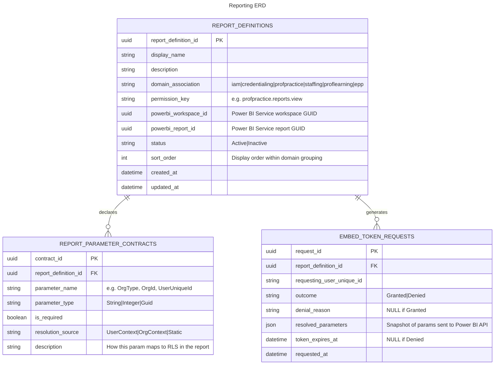

# Reporting

- **Type:** Platform Capability
- **Identifier:** reporting
- **Primary Sources:** Architecture Decision Records (TBD), System Architecture Document

---

## Purpose

The Reporting capability provides embedded Power BI report access within the MiEdWorkforce portal, enabling domain-specific analytics and data exploration for authorized users. It manages report catalog metadata, authorization-gated embed token generation, and a standardized parameter contract that scopes report data to the viewer's organizational context.

---

## Classification Rationale

This is a Platform Capability rather than a Core Domain because it provides shared infrastructure (report discovery, embed token generation, parameter contracts, authorization gating) consumed by multiple core domains. It owns no business data of its own — it surfaces data that domains own and store elsewhere, rendered through Power BI report definitions maintained outside the application.

---

## Scope

**This capability owns:**
- Report catalog metadata (report definitions, display names, domain associations, parameter contracts)
- Embed token generation via the Power BI API
- Authorization checks prior to token issuance (delegating to domain-level permissions)
- Standard embed parameter resolution (org context, user context, RLS contract)
- Report browsing and discovery UI within the portal

**This capability does NOT own:**
- Power BI report definitions (authored and maintained outside the application, in Power BI Desktop / Power BI Service)
- Domain-level report permissions (e.g., `profpractice.reports.view` — owned by each domain)
- The underlying data surfaced in reports (owned by the domain whose data it is)
- Report editing or authoring (requires a Power BI Pro/Premium license; not exposed in the portal UI)
- General-purpose in-UI charts or dashboards that do not require Power BI (those are UI concerns per domain)

---

## Ubiquitous Language

| Term                          | Definition                                                                                                                                                                                                                              |
| ----------------------------- | --------------------------------------------------------------------------------------------------------------------------------------------------------------------------------------------------------------------------------------- |
| **Report**                    | A Power BI report definition hosted in the Power BI Service. The application does not own or modify report definitions — it only embeds them.                                                                                           |
| **Report Catalog**            | The application-managed registry of reports available for embedding, including metadata, domain association, and parameter contracts. Not all Power BI reports in the workspace are necessarily in the catalog.                         |
| **Embed Token**               | A short-lived, signed token issued by the Power BI API that authorizes rendering a specific report in a browser session. Tokens are generated on demand, are non-transferable, and expire quickly.                                      |
| **Embed Parameters**          | A standardized set of key-value pairs passed at token generation time to scope or personalize the report. Parameters drive Row-Level Security (RLS) inside the report definition.                                                       |
| **Row-Level Security (RLS)**  | A Power BI feature allowing a report definition to filter data based on parameters or roles supplied at embed time. Used to scope district or ISD users to their organizational data.                                                   |
| **Parameter Contract**        | The declared set of embed parameters a report accepts, including which are required vs. optional and how they map to RLS roles or filters within the report definition. Agreed upon between the application team and the report author. |
| **Report Domain Association** | The functional domain or area a report belongs to (e.g., `profpractice`, `staffing`). Determines which domain permission gates access and where the report appears in the portal.                                                       |
| **Ad Hoc Exploration**        | Drilldowns, filtering, and data slicing within an embedded report. This is possible within embedded reports. It does NOT mean users can edit report definitions — that requires a Power BI license and is out of scope for the portal.  |
| **Administrative Report**     | A report accessible only to backend administrators; not visible or accessible through the portal UI. Managed in Power BI Service directly.                                                                                              |
| **Portal-Visible Report**     | A report registered in the catalog and surfaced in the portal UI for authorized users.                                                                                                                                                  |

---

## Domain Model

### Core Aggregates

#### ReportDefinition

**Root Entity:** ReportDefinition

**Purpose:** Represents a registered, portal-visible Power BI report. Acts as the application's record of a report that can be embedded, capturing all metadata needed to generate a valid embed token and display the report in context.

**Entities & Value Objects:**
- **ReportDefinition** - The catalog entry for a single embeddable report
- **PowerBIReportReference** - The Power BI Service identifiers needed to generate a token (`workspaceId`, `reportId`)
- **DomainAssociation** - Which functional domain this report belongs to (e.g., `profpractice`); determines permission gating and portal placement
- **PermissionKey** - The specific domain permission required to view this report (e.g., `profpractice.reports.view`)
- **ParameterContract** - Declared set of embed parameters this report accepts, with types, whether required, and how they map to RLS configuration
- **ReportStatus** - Whether the report is active and portal-visible

**Key Invariants:**
- A ReportDefinition must reference a valid Power BI `workspaceId` and `reportId`
- A ReportDefinition must declare exactly one `PermissionKey` used to gate access
- A ReportDefinition must declare its `DomainAssociation`; only one domain per report
- The `ParameterContract` must be consistent with the RLS configuration in the Power BI report definition (application-side validation cannot enforce this, so it is a governance convention)
- Only reports with `status = Active` are surfaced in the portal catalog or eligible for token generation

**Key States:** Active, Inactive

**Referenced In:**
- Sequence: Browse Report Catalog
- Sequence: Generate Embed Token and View Report

---

#### EmbedTokenRequest

**Root Entity:** EmbedTokenRequest

**Purpose:** Represents a single on-demand request to generate an embed token for a specific report and user context. Captures the authorization decision, resolved parameters, and token lifecycle for audit purposes.

**Entities & Value Objects:**
- **EmbedTokenRequest** - The request record
- **ResolvedParameters** - The final set of embed parameters supplied to the Power BI API, derived from the user's authorization context and the report's ParameterContract
- **TokenMetadata** - Expiry time and token status (not the token itself — tokens are never persisted)
- **AuthorizationOutcome** - Whether the request was granted or denied, and why if denied

**Key Invariants:**
- Tokens are never stored; only audit metadata is persisted
- A token can only be issued if the requesting user holds the report's declared `PermissionKey` at an appropriate scope
- ResolvedParameters must satisfy all required fields in the report's ParameterContract before a token is issued
- Each token is single-use in context — re-rendering requires a new token request

**Key States:** Granted, Denied

**Referenced In:**
- Sequence: Generate Embed Token and View Report

---

### Entity Relationship Diagram

---

## Dependencies

### Upstream (We Consume From)

| Source               | What We Need                                      | How We Get It                                                        | Notes                                                                                         |
| -------------------- | ------------------------------------------------- | -------------------------------------------------------------------- | --------------------------------------------------------------------------------------------- |
| **iam**              | User identity, active authorizations, org context | REST API (`/permissions/check`, `/authorizations/my-authorizations`) | Used to resolve org scoping parameters and validate permission keys before token issuance     |
| **organizations**    | Organization hierarchy and metadata               | REST API (`/organizations/{code}`)                                   | Used to resolve `OrgId` and `OrgType` embed parameters from the user's organizational context |
| **Power BI Service** | Embed tokens                                      | Power BI REST API (`/generateToken`)                                 | External Microsoft API; requires service principal with appropriate workspace access          |

### Downstream (Others Consume From Us)

| Consumer                 | What They Need               | How They Get It | Notes                                                            |
| ------------------------ | ---------------------------- | --------------- | ---------------------------------------------------------------- |
| **MiEdWorkforce Portal** | Report catalog, embed tokens | REST API        | Portal surfaces the report browser and embeds reports in iframes |

---

## Business Rules

### Not Every Dashboard Is a Power BI Report

**Rule:** Power BI embedding should be reserved for reports that involve complex data aggregation across domains, multi-dimensional filtering, scheduled refresh from data warehouse sources, or export needs. Simple UI-level statistics, counts, or single-domain summaries should be implemented as native UI components within the relevant domain's portal pages, not as embedded Power BI reports.

**Rationale:** Power BI embedding carries infrastructure overhead (workspace management, service principal credentials, token generation latency, licensing considerations). Overusing it for trivial displays degrades maintainability and performance.

**Enforced By:** Governance convention; the Reporting catalog team reviews requests before registering new reports.

**Example:** A "pending applications" count displayed on a credential processor's dashboard is a native UI component pulling from the Credentialing API. A "credential issuance trends by district over rolling 12 months with demographic breakdown" is a Power BI report.

---

### Report Definitions Are Owned Outside the Application

**Rule:** Power BI report definitions (`.pbix` files, dataset definitions, RLS role configurations) are authored and maintained in Power BI Desktop and published to the Power BI Service. The application does not modify, version, or store report definitions. The application only maintains catalog metadata pointing to a report already published in the service.

**Rationale:** Report authoring requires Power BI Pro/Premium licensing and tooling not available in the web portal. Attempting to expose report editing in the UI would require significant licensing and security scope expansion.

**Enforced By:** The Reporting API has no endpoints for modifying Power BI assets; it only reads from them.

---

### Report Access Is Gated by Domain Permissions

**Rule:** Each report in the catalog declares a single `PermissionKey` (e.g., `profpractice.reports.view`). Before generating an embed token, the Reporting API checks that the requesting user holds this permission at an appropriate organizational scope. Access is denied if the check fails.

**Rationale:** Centralizing the permission check in the Reporting capability ensures reports cannot be embedded by unauthorized users even if the client-side catalog is manipulated.

**Enforced By:** EmbedTokenRequest workflow; IAM permission check API call.

---

### Embed Tokens Are Ephemeral and Non-Transferable

**Rule:** Embed tokens are generated on demand for a specific user and report. Tokens are never stored by the application. Token expiry should be short (target: 60 minutes, configurable). Re-rendering a report always requires a fresh token request.

**Rationale:** Prevents token sharing or URL spoofing. Even if a token were intercepted, it would be short-lived and scoped to specific report parameters.

**Enforced By:** Token generation flow; Power BI API enforces token scope and expiry.

---

### Parameter Contract Must Be Satisfied Before Token Issuance

**Rule:** All parameters declared as `required` in a report's `ParameterContract` must be resolvable from the user's context before a token is issued. If a required parameter cannot be resolved (e.g., a district-scoped report is requested by a user with no district association), token generation is refused.

**Rationale:** Issuing a token without required RLS parameters would cause the report to display unscoped (all) data, violating data access controls enforced inside the report definition.

**Enforced By:** Parameter resolution step in EmbedTokenRequest workflow; validation occurs before the Power BI API call.

---

### Standard Parameter Set

**Rule:** The application defines a canonical set of embed parameter names. Report authors must use these exact parameter names when configuring RLS roles in their report definitions. Custom parameter names outside this set are not permitted without a catalog governance review.

**Rationale:** Consistency enables the application to reliably resolve and pass parameters without per-report custom logic.

**Standard Parameters:**

| Parameter Name     | Type         | Description                                                         |
| ------------------ | ------------ | ------------------------------------------------------------------- |
| `UserUniqueId`     | String       | The requesting user's Mi-Key Unique ID                              |
| `OrgType`          | String       | The organizational type context (e.g., `District`, `ISD`, `System`) |
| `OrgCode`          | String       | The specific organization code scoping the report                   |
| `OrgAncestorCodes` | String (CSV) | Comma-separated ancestor org codes for transitive scoping           |
| `UserRole`         | String       | The user's highest applicable role within the report's domain       |

Not all parameters are required for all reports; each report's ParameterContract declares which apply.

---

## Workflows

1. **Browse Report Catalog** - Authenticated user views available reports filtered by their domain access > See: [Sequences Doc](./reporting-sequences.md#browse-report-catalog)
2. **Generate Embed Token and View Report** - User selects a report; system authorizes, resolves parameters, generates token, and renders embedded report > See: [Sequences Doc](./reporting-sequences.md#generate-embed-token-and-view-report)
3. **Register Report in Catalog** - Admin registers a new Power BI report in the application catalog > See: [Sequences Doc](./reporting-sequences.md#register-report-in-catalog)
4. **Deactivate Report** - Admin removes a report from portal visibility without deleting the Power BI asset > See: [Sequences Doc](./reporting-sequences.md#deactivate-report)
