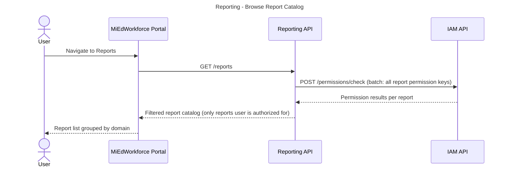
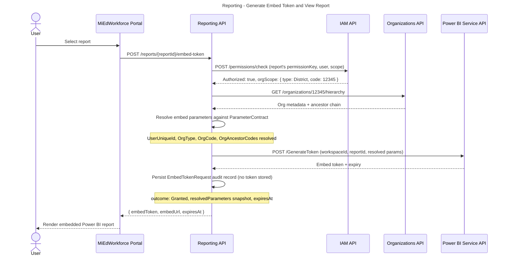
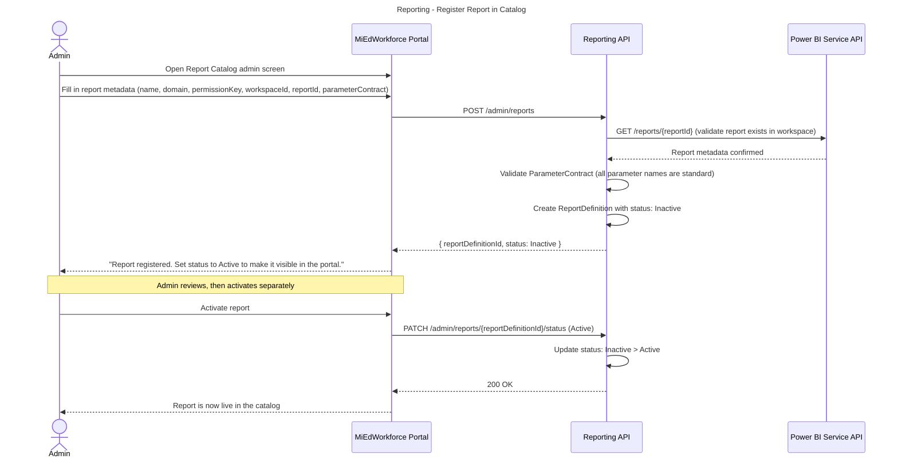
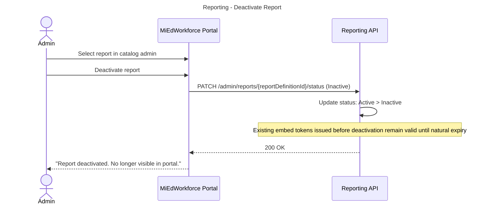
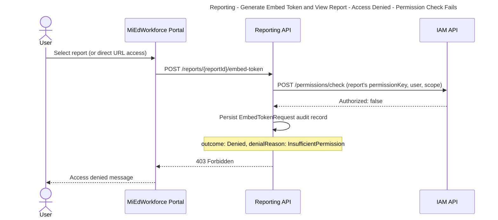

# Reporting - Workflows & Sequences

**Domain:** Reporting (Platform Capability)
**Version:** 1.0
**Last Updated:** TBD

This document contains sequence diagrams for all workflows in the Reporting platform capability.

**Conventions:**
- Solid arrows (`->>`) = Synchronous calls
- Dashed arrows (`-->>`) = Responses
- Dotted arrows (`--)`) = Async/fire-and-forget
- **actor** = Human or external system
- **participant** = Internal service/component

---

## Browse Report Catalog

**What:** A user views the list of reports available to them, filtered to only those they are authorized to access.  
**When:** User navigates to the Reports section of the MiEdWorkforce Portal.  
**Who:** Any authenticated portal user.



**Key Decisions:**
- **Catalog filtering at API layer:** The Reporting API filters the catalog server-side based on permission checks rather than returning the full catalog and relying on the client to hide unauthorized entries. This prevents information leakage about the existence of reports the user cannot access.
- **Batch permission check:** To avoid N+1 IAM calls (one per report), the Reporting API batches all permission key checks in a single IAM request.

**State Changes:**
None — read-only operation.

**Events Published:**
None.

**Error Scenarios:**
- IAM unavailable > Return 503; do not return partial catalog. Surface error to user.
- User holds no applicable report permissions > Return empty catalog; do not return 403 (empty state is a valid response, not an error).

---

## Generate Embed Token and View Report

**What:** A user selects a report and the system validates their authorization, resolves organizational context parameters, generates a Power BI embed token, and returns it to the portal for rendering.  
**When:** User selects a specific report from the catalog.  
**Who:** Any authenticated portal user who holds the report's declared permission.
### Happy Path
**Scenario:** User holds required permission at an appropriate scope; all required parameters can be resolved.



**Key Decisions:**
- **Parameter resolution before Power BI call:** All ParameterContract requirements are validated locally before calling the Power BI API. A failed resolution causes a 400/403 response without consuming a Power BI API call.
- **Org hierarchy for transitive scoping:** `OrgAncestorCodes` is resolved from the Organizations API to allow reports to support transitive org filtering (e.g., an ISD user sees data for all constituent districts).
- **Token not persisted:** Only audit metadata is stored; the token string itself is never written to the database.

**State Changes:**
- EmbedTokenRequest created with `outcome: Denied`

---

### Access Denied — Required Parameter Cannot Be Resolved

**Events Published:**
None.

**Error Scenarios:**
- Power BI API timeout or error > Return 502 to portal; log audit record with failure reason; surface user-friendly error ("Report temporarily unavailable").

---

### Access Denied — Permission Check Fails

---

## Register Report in Catalog

**What:** An administrator registers a new Power BI report in the application catalog, making it available for embedding once activated.  
**When:** A new report has been published to the Power BI Service and is ready to be surfaced in the portal.  
**Who:** System Admin with `reporting.catalog.manage` permission.



**Key Decisions:**
- **Register then activate pattern:** New reports default to `Inactive` so admins can verify catalog metadata before making the report visible to users. This decouples registration from publication.
- **Power BI validation at registration:** Confirming the report exists in the workspace at registration time (not at token generation time) surfaces configuration errors early.

**State Changes:**
- ReportDefinition created with `status: Inactive`
- ReportDefinition status: `Inactive` > `Active` on explicit activation

**Events Published:**
None.

**Error Scenarios:**
- Power BI workspace/report ID not found > Return 422 with message "Power BI report not found in specified workspace. Verify workspaceId and reportId."
- Non-standard parameter name in contract > Return 400; list disallowed parameter names.

---

## Deactivate Report

**What:** An admin removes a report from portal visibility. The Power BI report definition is unaffected.  
**When:** A report is retired, replaced, or temporarily pulled from the portal.  
**Who:** System Admin with `reporting.catalog.manage` permission.



**Key Decisions:**
- **Deactivation does not invalidate outstanding tokens:** Tokens already in flight (issued but not yet expired) remain valid since the Power BI Service is not notified. This is acceptable given the short token expiry window. Revoking active tokens would require a Power BI API call per active session — disproportionate cost for a non-emergency deactivation.

**State Changes:**
- ReportDefinition status: `Active` > `Inactive`

**Events Published:**
None.

**Error Scenarios:**
- Report already inactive > Return 409 Conflict with message.

---

## Generate Embed Token and View Report - Access Denied - Permission Check Fails

**What:** A user selects a report and the system validates their authorization, resolves organizational context parameters, generates a Power BI embed token, and returns it to the portal for rendering. Scenario: user does not hold the report's declared permission, or the report is not in the catalog.  
**When:** User selects a specific report from the catalog (or accesses it via a direct URL).  
**Who:** Any authenticated portal user.



**Events Published:**
None.

**Error Scenarios:**
Permission check fails > 403 Forbidden; audit record persisted with outcome Denied, denialReason InsufficientPermission.

---

## Generate Embed Token and View Report - Access Denied - Required Parameter Cannot Be Resolved

**What:** A user selects a report and the system validates their authorization, resolves organizational context parameters, generates a Power BI embed token, and returns it to the portal for rendering. Scenario: user holds the permission but cannot be scoped to the required organizational context (e.g. a system-level user requesting a district-scoped report without a district in context).  
**When:** User selects a specific report from the catalog.  
**Who:** Any authenticated portal user who holds the report's declared permission but lacks the required org context.

```mermaid
---
title: Reporting - Generate Embed Token and View Report - Access Denied - Required Parameter Cannot Be Resolved
---
sequenceDiagram
    actor User
    participant Portal as MiEdWorkforce Portal
    participant ReportingAPI as Reporting API
    participant IAM as IAM API

    User->>Portal: Select report
    Portal->>ReportingAPI: POST /reports/{reportId}/embed-token

    ReportingAPI->>IAM: POST /permissions/check (permissionKey, user, scope)
    IAM-->>ReportingAPI: Authorized: true, orgScope: { type: System }

    ReportingAPI->>ReportingAPI: Attempt to resolve ParameterContract
    Note over ReportingAPI: OrgCode required; cannot resolve from System-level scope

    ReportingAPI->>ReportingAPI: Persist EmbedTokenRequest audit record
    Note over ReportingAPI: outcome: Denied, denialReason: ParameterResolutionFailure

    ReportingAPI-->>Portal: 400 Bad Request (required parameter unresolvable)
    Portal-->>User: "This report requires an organizational context. Select a district or ISD to continue."
```

**Events Published:**
None.

**Error Scenarios:**
Required parameter unresolvable (e.g. OrgCode required, caller is System-scoped) > 400 Bad Request; audit record persisted with outcome Denied, denialReason ParameterResolutionFailure.
