# Staffing

- **Type:** Core Domain
- **Identifier:** staffing
- **Primary Sources:** BRD 10, 18, 21, 22, 21.7, 22.6, 24

---

## Purpose

The Staffing domain manages the employment and position lifecycle for educators and staff within Michigan educational organizations. It ensures accurate reporting of who is employed, in what positions, with what credentials, and validates appropriate placement to maintain compliance with state and federal requirements.

This domain owns the complete employment and assignment data collection cycle, from position definition through employee assignment, credential verification, and audit certification. It serves as the authoritative source for employment status, position assignments, and placement appropriateness within the state education system.

---

## Scope

**This domain owns:**
- Position roster definition and maintenance (organizational charts, position types, FTE allocations)
- Employee roster creation and lifecycle (hire, status changes, termination)
- Assignment details linking employees to positions and courses
- Education history tracking for staff qualifications
- New teacher monitoring and mentorship tracking
- Employee evaluation outcome recording and appeals
- Credential error justification and placement audit workflows
- Data quality review and collection certification processes
- Unique ID request coordination with Mi-Key service
- Collection exception requests and deadline management

**This domain does NOT own:**
- Credential issuance and lifecycle > owned by `credentialing`
- Professional learning session attendance and SCECH awards > owned by `proflearning`
- Professional practice review disclosures and clearances > owned by `profpractice`
- Unique ID creation, identity matching/resolution logic, Near Match handling, and the Identity Administrator worklist (New ID, Link ID, Split ID, Retire ID, demographic-update matching) > owned by `iam` (which in turn integrates with Mi-Key, the external matching service); Staffing only triggers resolution and consumes its completion event to populate `EmployeeRoster.unique_id`
- Organization hierarchy and lead admin assignments > owned by `organization-reference-data`
- User authorization and role assignments > owned by `iam`
- Email template definitions and sending logic > owned by `communications`

---

## Ubiquitous Language

| Term                               | Definition                                                                                                                                    |
| ---------------------------------- | --------------------------------------------------------------------------------------------------------------------------------------------- |
| **Employee Roster**                | The collection of all individuals employed by an educational organization during a school year, including active and terminated staff         |
| **Position Roster**                | The organizational chart of approved positions within an entity, including unfilled, filled, and frozen positions                             |
| **Assignment**                     | The linkage of an employee to a specific position, including course details, grade levels, and FTE allocation                                 |
| **Appropriate Placement**          | The state where an employee holds valid credentials and endorsements matching their assigned position and course responsibilities             |
| **Credential Error Justification** | Free-form text explanation provided by district when assigning an employee to a position they are not credentialed for, used in audit reviews |
| **New Teacher**                    | An educator within their first three years of classroom teaching employment, subject to mentorship and professional development requirements  |
| **Evaluation Outcome**             | The annual performance assessment result for instructional staff, appealable by both employee and district within defined windows             |
| **Education History**              | Post-secondary degree and institutional records used to calculate highest level of education completed for federal reporting                  |
| **Collection Certification**       | The formal attestation and finalization of employment and assignment data for a reporting period, after quality review and error resolution   |
| **Data Quality Review**            | System-generated validation process that checks individual records, historical patterns, and cross-system alignment before certification      |
| **Spot**                           | A single assignment allocation within a position, defined by SCED course, grade levels, FTE allocation, and start/end dates                   |
| **Unfilled Position**              | A position established in the roster but not yet assigned to an employee, available for assignment from the active employee pool              |
| **Frozen Position**                | A position temporarily inactive and not available for employee assignment until status changes to Active or Approved                          |
| **ISD Auditor**                    | A role responsible for reviewing district-level employment and placement data for constituent districts within an ISD/RESA service area       |
| **SOM Auditor**                    | State-level auditor role responsible for reviewing ISD-submitted audit findings and finalized reports                                         |
| **Staffing Data Administrator**    | System administrator role managing collection definitions, business rules, validation configurations, and data quality processing schedules   |
| **Collection Exception**           | Approved request to allow data submission and certification past the legislative deadline for a specific district and collection period       |

---

## Domain Model

### Core Aggregates

#### EmployeeRoster

**Root Entity:** EmployeeRoster

**Purpose:** Manages the annual collection of employed individuals for an educational organization, tracking employment lifecycle from hire through termination.

**Entities & Value Objects:**
- **EmployeeRecord** - Individual employment record with status, start/end dates, separation reason
- **EmploymentStatus** - Value object: Contractual, Probationary, Substitute/Temporary, Tenured, etc.
- **EmploymentSeparationReason** - Value object: Retirement, Budgetary Reduction, Misconduct, etc.
- **EducationHistory** - Collection of post-secondary degrees and institutions for highest education calculation. Sourced either from CEPI Data Warehouse/STARR-NSC interfaces (read-only to district and citizen) or manually entered by district or citizen when no historical record exists (FDD 21/22 §"Education History"; degree required, all other fields optional). District-added rows can be removed by the district only before save; citizen-added rows can never be removed by a district user.
- **EvaluationOutcome** - Annual performance assessment with scale and outcome value
- **NewTeacherMonitoring** - Mentorship assignment and SCECH tracking for educators in first three years

**Key Invariants:**
- Employment Start Date must be on or before current date (no future hires)
- Employment End Date must follow Employment Start Date
- Employment End Date and Separation Reason must both be present or both absent
- Employee cannot be re-added to same district without new Employment Start Date if previously terminated
- Active employment status requires at least one active assignment in Assignment Details
- New Teacher flag set to true requires New Teacher Monitoring component completion before certification
- Evaluation Outcome required for instructional staff and administrators before certification
- **Identity resolution is not owned here.** When an employee record has no Unique ID (new hire) or its demographics change, this aggregate triggers identity resolution by calling `iam`'s `IdentityResolutionRequest` API (or, for Link ID, submits a link request) and waits for a completion event (`IdentityResolutionCompleted`, `IdentityRequestDenied`, `PersonRecordUpdated`) to populate/update `unique_id`. EmployeeRoster holds no Near Match state, matching candidates, or Identity Administrator worklist of its own — see `iam-domain.md`.

**Key States:** Pending, Error, Active, Certified

**Referenced In:**
- Sequence: Add New Employee
- Sequence: Update Employment Status
- Sequence: Certify Employee Roster Collection

See `iam-sequences.md` for the identity-resolution sequences this aggregate triggers into:
"Business User - Request New ID (Near Match Escalation)", "Business User - Request Link
ID", "Identity Administrator - Resolve Identity Request", and "Identity Resolution -
Split/Retire ID (Mi-Key-Direct)".

---

#### PositionRoster

**Root Entity:** PositionRoster

**Purpose:** Defines the organizational structure of approved positions within an entity for a school year, tracking position lifecycle and FTE allocation.

**Entities & Value Objects:**
- **Position** - Job position with identifier, title, type, status, approved FTE
- **PositionStatus** - Value object: Filled, Approved, Active, Frozen, Cancelled
- **EducationJobType** - Value object: Administrator, Instructional, Student Support Staff, Non-Instructional
- **LocalJobCategory** - Value object: Teacher, Principal, Counselor, etc.
- **LocalJobFunction** - Value object: Specific role within category (e.g., Social Worker under Student Support)
- **Spot** - Assignment allocation with SCED course, grade levels, FTE, start/end dates, employee assignment

**Key Invariants:**
- Position status Filled requires employee assignment
- Position status Approved requires expected start date in future, no employee assignment
- Position status Active/Frozen/Cancelled prohibits active employee assignment after effective date
- Cancelled position requires cancellation reason
- Sum of spot FTE should equal approved FTE for position (health indicator, not blocking)
- Approved FTE must be greater than zero
- Position cannot be deleted after establishment (working window only); use Cancelled status instead

**Key States:** Pending, Active, Filled, Approved, Frozen, Cancelled

**Referenced In:**
- Sequence: Create New Position
- Sequence: Assign Employee to Position
- Sequence: Update Position Status
- Sequence: Certify Position Roster Collection

---

#### Assignment

**Root Entity:** Assignment

**Purpose:** Links employees to positions with detailed course, grade level, and FTE allocation information, validating credential appropriateness.

**Entities & Value Objects:**
- **AssignmentDetail** - Position assignment with start/end dates, FTE, primary indicator
- **CourseDetail** - SCED code, subject area, grade span, interaction mode for teaching assignments
- **SpecializedFunding** - Migrant Education, Title I categorical funding indicators
- **CredentialErrorJustification** - Free-form text justification for placement without appropriate credential

**Key Invariants:**
- Active employment requires at least one assignment
- Administrator/Instructional positions require valid credential for assignment
- Teacher assignments require valid endorsements for SCED course and grade level
- Assignment start date must align with employment start date
- FTE allocation must be positive decimal value
- Special Education assignments require specific age group and service category data
- Career Technical Education assignments require Career Cluster and CIP Code
- Education History is required before certification for employees in a defined subset of positions (Teacher, Administrator, Special Education Paraprofessional, Teacher on a Temporary Credential); optional for all other positions (FDD 21/22 §"Education History")

**Key States:** Pending, Error, Active, Justified (credential error acknowledged)

**Referenced In:**
- Sequence: Assign Employee to Position
- Sequence: Report Course Details
- Sequence: Submit Credential Error Justification

---

#### Collection

**Root Entity:** Collection

**Purpose:** Manages the data collection lifecycle for a school year, tracking submission requirements, quality review, and certification status.

**Entities & Value Objects:**
- **CollectionDefinition** - Name, school year dates, entity types, certification period
- **CollectionStatus** - Value object: Open, In Progress, Quality Review, Certified, Reopened
- **CategoryRequirement** - Data category with required/optional/conditional status
- **QualityReviewResult** - Validation errors, warnings, and justification-required conditions
- **CertificationAttestation** - E-signature and timestamp of authorized user certification

**Key Invariants:**
- Collection cannot be certified with any Error-status records
- All pre-certification tasks must be complete before certification allowed
- Quality review must be run before certification
- Required justifications must be provided for specific error conditions
- Attestation agreement required for certification
- Collection date ranges cannot overlap for same entity type
- Certification period must fall within collection open/close dates

**Key States:** Pending, Open, In Progress, Quality Review, Awaiting Justification, Certified, Reopened

**Referenced In:**
- Sequence: Open New Collection
- Sequence: Run Quality Review
- Sequence: Certify Collection

---

#### AuditWorkItem

**Root Entity:** AuditWorkItem

**Purpose:** Tracks ISD and SOM auditor review of district employment and placement data, managing findings, document requests, and certification.

**Entities & Value Objects:**
- **AuditFinding** - District/individual-level placement issue with justification and uploaded documentation
- **AuditType** - Value object: School Safety (RapBacks), Appropriate Placement Verification
- **AuditStatus** - Value object: New, In Progress, Awaiting District Response, Completed
- **DocumentRequest** - Request for additional evidence (master schedule, attendance records, etc.)

**Key Invariants:**
- Audit work item created only after district collection certification
- All required audit tasks must be complete before audit report finalization
- Audit report requires attestation and e-signature
- Finalized audit becomes read-only except during defined de-certification window
- Credential error justifications from district submissions must appear in the auditor's audit item list

**Key States:** New, In Progress, Awaiting District Response, Pending SOM Review, Completed, De-certified

**Referenced In:**
- Sequence: ISD Auditor Review District Submission
- Sequence: Request Additional Documentation
- Sequence: Finalize Audit Report

---

#### CollectionException

**Root Entity:** CollectionException

**Purpose:** Manages requests to allow data submission and certification past legislative deadlines for specific districts and collection periods.

**Entities & Value Objects:**
- **ExceptionRequest** - Entity, collection, justification, requested extension dates
- **ExceptionStatus** - Value object: Pending, Approved, Denied

**Key Invariants:**
- Exception request can only be submitted after collection deadline has passed
- Exception must specify district, collection type, and justification
- Approval required before collection reopening allowed
- Exception date range must be future-dated from request submission

**Key States:** Pending, Approved, Denied

**Referenced In:**
- Sequence: Request Collection Exception
- Sequence: Staffing Admin Approve Exception

---

### Entity Relationship Diagram

```mermaid
---
title: Staffing ERD
---
erDiagram
    EMPLOYEE_ROSTER ||--o{ EMPLOYMENT_HISTORY : "tracks"
    EMPLOYEE_ROSTER ||--o{ EDUCATION_HISTORY : "has"
    EMPLOYEE_ROSTER ||--o{ EVALUATION_OUTCOMES : "has"
    EMPLOYEE_ROSTER ||--o{ NEW_TEACHER_MONITORING : "has"
    EMPLOYEE_ROSTER ||--o{ ASSIGNMENTS : "has"
    EMPLOYEE_ROSTER ||--o{ EMPLOYEE_ROSTER_EVENTS : "generates"

    POSITION_ROSTER ||--o{ POSITIONS : "contains"
    POSITIONS ||--o{ SPOTS : "allocates"
    POSITIONS ||--o{ POSITION_STATUS_HISTORY : "tracks"
    SPOTS ||--o{ ASSIGNMENTS : "filled by"

    ASSIGNMENTS ||--o{ ASSIGNMENT_COURSE_DETAILS : "has"
    ASSIGNMENTS ||--o{ ASSIGNMENT_EVENTS : "generates"

    COLLECTIONS ||--o{ COLLECTION_CERTIFICATION : "certified via"
    COLLECTIONS ||--o{ QUALITY_REVIEW_RESULTS : "validated by"
    COLLECTIONS ||--o{ COLLECTION_EXCEPTIONS : "extended by"

    AUDIT_WORK_ITEMS ||--o{ AUDIT_FINDINGS : "has"
    AUDIT_WORK_ITEMS ||--o{ DOCUMENT_REQUESTS : "generates"

    EMPLOYEE_ROSTER {
        uuid employee_record_id PK "Internal record ID"
        string unique_id UK "Mi-Key Unique ID; NULL until resolved"
        string entity_code FK "Employing organization from EEM"
        string employment_status "Contractual|Probationary|SubstituteTemporary|Tenured|Leave"
        string record_status "Pending|Error|Active|Certified"
        date employment_start_date "Must be on or before current date"
        date employment_end_date "NULL if active"
        string separation_reason "NULL if active; required when end_date set"
        boolean is_new_teacher "True if within first 3 years of classroom teaching"
        datetime created_at
        uuid created_by FK
        datetime updated_at
        uuid updated_by FK
    }

    EMPLOYMENT_HISTORY {
        uuid history_id PK
        uuid employee_record_id FK
        string old_status "Previous employment status"
        string new_status "New employment status"
        date effective_date
        string separation_reason "NULL if not a termination"
        uuid modified_by FK
        datetime modified_at
        string modified_by_role "DistrictUser|CitizenUser|SystemAdmin"
    }

    EDUCATION_HISTORY {
        uuid education_id PK
        uuid employee_record_id FK
        string degree_level "Associates|Bachelors|Masters|Doctorate|Other; required"
        string institution_name "Optional except degree_level"
        string institution_code "NULL if institution not in system"
        int graduation_year "NULL if in progress"
        string field_of_study
        string education_verification_method "NULL if manually entered; set when sourced from CEPI Data Warehouse or STARR/NSC"
        string source "CEPIDataWarehouse|StarrNsc|DistrictEntered|CitizenEntered"
        boolean is_read_only "True if sourced from CEPI Data Warehouse or STARR/NSC; district/citizen cannot edit or remove"
        uuid added_by FK
        string added_by_role "DistrictUser|CitizenUser|System"
    }

    EVALUATION_OUTCOMES {
        uuid evaluation_id PK
        uuid employee_record_id FK
        string school_year "e.g. 2024-25"
        string evaluation_scale "e.g. 4-point Highly Effective scale"
        string outcome "Highly Effective|Effective|MinimallyEffective|Ineffective"
        boolean is_appealed
        string appeal_outcome "NULL if not appealed"
        datetime appeal_submitted_at "NULL if not appealed"
        uuid recorded_by FK
        datetime recorded_at
    }

    NEW_TEACHER_MONITORING {
        uuid monitoring_id PK
        uuid employee_record_id FK
        string school_year
        int teaching_year_number "1|2|3"
        string mentor_unique_id "NULL if external mentor"
        string mentor_name "Free-form for external mentors"
        string mentor_email "NULL if in-system mentor"
        string mentor_credential_info "NULL if in-system mentor"
        boolean mentor_verified "True once entered mentor Unique ID resolves to a name for district confirmation (FDD 21/22 §22.1.4: name-lookup only, e.g. via GET /educators/search — not a credential validity check; distinct from the unrelated, still-unresolved permit-mentor credential check in credentialing-domain.md's Mentor Assignment Requirement for Permits rule)"
        int scech_hours_completed "Running total toward 15-day (90hr) requirement"
        boolean monitoring_complete "True when all 3 years fulfilled"
    }

    POSITION_ROSTER {
        uuid position_roster_id PK
        string entity_code FK "Organization from EEM"
        string school_year "e.g. 2024-25"
        datetime created_at
        uuid created_by FK
    }

    POSITIONS {
        uuid position_id PK
        uuid position_roster_id FK
        string position_identifier UK "System-generated unique code"
        string title
        string education_job_type "Administrator|Instructional|StudentSupportStaff|NonInstructional"
        string local_job_category "Teacher|Principal|Counselor|etc."
        string local_job_function "Specific role within category"
        string building_code FK "Building from EEM hierarchy"
        string status "Pending|Active|Filled|Approved|Frozen|Cancelled"
        decimal approved_fte "Must be > 0"
        decimal filled_fte "Calculated from active spots"
        string cancellation_reason "NULL if not cancelled"
        date expected_start_date "Required for Approved status; must be future-dated"
        datetime created_at
        uuid created_by FK
    }

    POSITION_STATUS_HISTORY {
        uuid history_id PK
        uuid position_id FK
        string old_status
        string new_status
        date effective_date
        string reason "NULL unless Cancelled"
        uuid changed_by FK
        datetime changed_at
    }

    SPOTS {
        uuid spot_id PK
        uuid position_id FK
        string sced_code "NULL for non-instructional"
        string subject_area "NULL for non-instructional"
        string grade_band_low "PreK|K|1-12"
        string grade_band_high "PreK|K|1-12"
        decimal fte "Portion of position FTE; must be > 0"
        date start_date
        date end_date "NULL if open-ended"
        string interaction_mode "InPerson|Virtual|Hybrid; NULL if non-instructional"
        datetime created_at
        uuid created_by FK
    }

    ASSIGNMENTS {
        uuid assignment_id PK
        uuid employee_record_id FK
        uuid spot_id FK
        string status "Pending|Error|Active|Justified"
        boolean is_primary "True for employee's primary assignment"
        date start_date
        date end_date "NULL if current"
        string end_reason "NULL if current"
        string justification_text "Present if status = Justified"
        boolean migrant_education_funded
        boolean title_i_funded
        datetime created_at
        uuid created_by FK
        datetime updated_at
        uuid updated_by FK
    }

    ASSIGNMENT_COURSE_DETAILS {
        uuid course_detail_id PK
        uuid assignment_id FK
        string sced_code
        string career_cluster "NULL if not CTE"
        string cip_code "NULL if not CTE"
        string sped_age_group "NULL if not Special Education"
        string sped_service_category "NULL if not Special Education"
    }

    COLLECTIONS {
        uuid collection_id PK
        string name "e.g. Fall 2024 Employee Roster"
        string entity_code FK
        string school_year
        string status "Pending|Open|InProgress|QualityReview|AwaitingJustification|Certified|Reopened"
        date open_date
        date close_date
        date legislative_deadline
        datetime last_quality_review_at "NULL if never run"
        datetime created_at
        uuid created_by FK
    }

    COLLECTION_CERTIFICATION {
        uuid certification_id PK
        uuid collection_id FK
        string e_signature "Full legal name of certifying user"
        boolean attestation_agreed "Must be true"
        uuid certified_by FK "User ID"
        datetime certified_at
        int justifications_count "Number of justifications provided at certification"
    }

    QUALITY_REVIEW_RESULTS {
        uuid result_id PK
        uuid collection_id FK
        datetime review_timestamp
        int error_count
        int warning_count
        int justification_required_count
        json errors_payload "Array of ValidationIssue objects"
        json warnings_payload "Array of ValidationIssue objects"
        json justification_required_payload "Array of conditions needing justification"
        uuid run_by FK "NULL if system-triggered"
    }

    COLLECTION_JUSTIFICATIONS {
        uuid justification_id PK
        uuid collection_id FK
        string condition_key "Identifier of the justification-required condition"
        string justification_text
        uuid submitted_by FK
        datetime submitted_at
    }

    COLLECTION_EXCEPTIONS {
        uuid exception_id PK
        uuid collection_id FK
        string entity_code FK
        string status "Pending|Approved|Denied"
        string justification_text
        date requested_extension_date "Must be future-dated"
        date approved_extension_date "NULL if not yet approved"
        string denial_reason "NULL if not denied"
        uuid requested_by FK
        datetime requested_at
        uuid reviewed_by FK "NULL if pending"
        datetime reviewed_at "NULL if pending"
        string admin_notes "NULL if no notes"
    }

    AUDIT_WORK_ITEMS {
        uuid audit_item_id PK
        uuid collection_id FK "Triggering district collection"
        string district_code FK
        string isd_code FK "Parent ISD/RESA"
        string audit_type "SchoolSafety|AppropriatePlacementVerification"
        string status "New|InProgress|AwaitingDistrictResponse|PendingSOMReview|Completed|Decertified"
        string school_year
        datetime district_certification_date
        date due_date "NULL if no formal deadline"
        string e_signature "NULL until finalized"
        boolean attestation_agreed "NULL until finalized"
        uuid finalized_by FK "NULL until finalized"
        datetime finalized_at "NULL until finalized"
        datetime created_at
    }

    AUDIT_FINDINGS {
        uuid finding_id PK
        uuid audit_item_id FK
        string finding_type "InappropriatePlacement|MissingDocumentation|DataDiscrepancy|Other"
        string affected_unique_id "NULL if district-level finding"
        string description
        string justification "NULL if not provided"
        json document_ids "Array of document IDs from Documents API"
        uuid created_by FK
        datetime created_at
    }

    DOCUMENT_REQUESTS {
        uuid document_request_id PK
        uuid audit_item_id FK
        string document_type "MasterSchedule|AttendanceRecords|CredentialCopy|EmploymentContract|Other"
        string details "Specific documentation requested and why"
        string status "AwaitingDistrictResponse|Received|Closed"
        uuid received_document_id "NULL until district uploads; reference to Documents API"
        uuid requested_by FK
        datetime requested_at
        datetime received_at "NULL until received"
    }

    EMPLOYEE_ROSTER_EVENTS {
        uuid event_id PK
        uuid aggregate_id FK "employee_record_id"
        string event_type "EmployeeAddedToRoster|EmploymentStatusChanged|DemographicDataUpdated|EvaluationOutcomeRecorded|NewTeacherMentorAssigned"
        datetime event_timestamp
        int event_version "Optimistic concurrency"
        json event_payload
        uuid caused_by_user_id FK
        uuid correlation_id "Distributed tracing"
        binary event_hash "SHA256 for tamper detection"
        binary previous_event_hash "Hash chain"
    }

    ASSIGNMENT_EVENTS {
        uuid event_id PK
        uuid aggregate_id FK "assignment_id"
        string event_type "EmployeeAssignedToPosition|CredentialErrorJustificationSubmitted|AssignmentEnded"
        datetime event_timestamp
        int event_version
        json event_payload
        uuid caused_by_user_id FK
        uuid correlation_id
        binary event_hash
        binary previous_event_hash
    }
```

---

## Domain Events

Events published by this domain that other domains may subscribe to:

| Event                                   | Aggregate      | Trigger                                           | Payload Highlights                                                                     | Consumers                                         |
| --------------------------------------- | -------------- | ------------------------------------------------- | -------------------------------------------------------------------------------------- | ------------------------------------------------- |
| `EmployeeAddedToRoster`                 | EmployeeRoster | Employee record with Unique ID created            | `{ entityCode, uniqueId, employmentStartDate, employmentStatus }`                      | communications, profpractice                      |
| `EmploymentStatusChanged`               | EmployeeRoster | Employment status updated (e.g., termination)     | `{ entityCode, uniqueId, oldStatus, newStatus, effectiveDate, separationReason? }`     | communications, profpractice                      |
| `EmployeeAssignedToPosition`            | Assignment     | Employee assigned to position                     | `{ entityCode, uniqueId, positionId, assignmentStartDate, fte }`                       | communications                                    |
| `CredentialErrorJustificationSubmitted` | Assignment     | District acknowledges inappropriate placement     | `{ entityCode, uniqueId, positionId, scedCode?, justificationText }`                   | communications (alert to SOM Auditor)             |
| `CollectionCertified`                   | Collection     | District certifies roster data                    | `{ entityCode, collectionType, schoolYear, certificationTimestamp, certifyingUserId }` | communications (alert to ISD Auditor)             |
| `EvaluationOutcomeRecorded`             | EmployeeRoster | District submits evaluation outcome               | `{ uniqueId, entityCode, schoolYear, evaluationScale, outcome }`                       | communications (notify citizen if account exists) |
| `NewTeacherMentorAssigned`              | EmployeeRoster | Mentor assigned to new teacher                    | `{ menteeUniqueId, mentorUniqueId?, mentorName, schoolYear }`                          | communications (notify mentor)                    |
| `AuditReportFinalized`                  | AuditWorkItem  | ISD Auditor finalizes district audit              | `{ isdCode, districtCode, auditType, schoolYear, auditTimestamp, auditorUserId }`      | communications (notify SOM Auditor)               |
| `CollectionOpened`                      | Collection     | New school-year collection initialized (rollover) | `{ entityCode, schoolYear, carriedForwardCount, excludedCount }`                       | communications, reporting                         |

---

## Dependencies

### Upstream (We Consume From)

| Source                          | What We Need                                | How We Get It                                   | Notes                                                                                           |
| ------------------------------- | ------------------------------------------- | ----------------------------------------------- | ----------------------------------------------------------------------------------------------- |
| **iam**                         | Identity resolution (Unique ID assignment/matching, Near Match handling, Link ID) | REST API: `/identity-resolution/requests` (synchronous trigger) plus event subscription: `IdentityResolutionCompleted`, `IdentityRequestDenied`, `PersonRecordUpdated`, `IdentityRecordSplit`, `IdentityRecordRetired` | Staffing does not call Mi-Key directly; IAM owns the matching integration and Identity Administrator worklist entirely (see `iam-domain.md`) |
| **iam**                         | User authorization and permissions          | REST API: `/permissions/check`                  | Check if user has permission to update roster for specific entity                               |
| **organization-reference-data** | Organization hierarchy and lead admin email | Synced local replica                            | Used for entity validation, hierarchy queries, and lead admin notifications                     |
| **credentialing**               | Credential and endorsement validation       | REST API: `/educators/{educatorId}/credentials` | Validate appropriate placement for Administrator/Instructional positions                        |
| **profpractice**                | PPR clearance and roster eligibility        | REST API: `/educators/{id}/roster-eligibility`  | Block employee addition if PPR flags restrict employment                                        |
| **proflearning**                | SCECH awards for New Teacher monitoring     | REST API or event subscription                  | Display eligible SCECH sessions for New Teacher DPPD requirement (15 days over 3 years)         |

### Downstream (Others Consume From Us)

| Consumer                            | What They Need                                    | How They Get It                      | Notes                                                                              |
| ----------------------------------- | ------------------------------------------------- | ------------------------------------ | ---------------------------------------------------------------------------------- |
| **communications**                  | Employment and assignment change events           | Event subscription (Service Bus)     | Trigger alerts/emails for status changes, audit notifications, evaluation outcomes |
| **profpractice**                    | Employment roster for background check validation | Event: `EmployeeAddedToRoster`       | Trigger PPR clearance assessment when new employee added                           |
| **reporting** (CEPI Data Warehouse) | Finalized employment and assignment data          | Synapse Pipeline after certification | Data warehouse population for state/federal reporting                              |

---

## Business Rules

### Rule: Active Employment Requires Assignment

**Rule:** An employee with Active employment status must have at least one active assignment in the Assignment Details component before the collection can be certified.

**Rationale:** State and federal reporting require complete staffing data including position assignments. An employed individual without an assignment indicates incomplete data entry.

**Enforced By:** Collection aggregate during pre-certification quality review validation

**Example:** District hires Jane Smith on 9/1/2024 with Contractual status. Jane must be assigned to at least one position (e.g., 3rd Grade Teacher at Oak Elementary) before the district can certify the Fall 2024 collection.

---

### Rule: Credential Matching for Administrator/Instructional Positions

**Rule:** An employee assigned to a position with Education Job Type of Administrator or Instructional must hold a valid credential for that position type. If not, district must either apply for temporary credential or submit credential error justification.

**Rationale:** Michigan law requires appropriate credentialing for instructional and administrative roles. Improper placement may result in state aid deductions.

**Enforced By:** Assignment aggregate during assignment creation; validated against Credentialing domain API

**Example:** District assigns John Doe to Principal position. System checks Credentialing domain and finds John holds Elementary Principal certificate. Assignment allowed. If John held no administrative credential, system would require temporary credential application or justification.

---

### Rule: Endorsement Alignment for Teaching Assignments

**Rule:** A Teacher position assignment with reported course details (SCED code and grade span) requires the employee to hold endorsements covering that content area and grade level. If not, district must apply for temporary credential or submit credential error justification.

**Rationale:** Subject-area endorsements ensure teachers are qualified to teach specific content. Misalignment triggers audit review and potential aid penalties.

**Enforced By:** Assignment aggregate during course detail submission; validated against Credentialing domain endorsement-to-SCED mappings

**Example:** District assigns Sarah Lee to teach High School Biology (SCED 03001). System checks Credentialing domain and finds Sarah holds Secondary Biology endorsement covering grades 6-12. Assignment allowed. If Sarah only held Elementary Science endorsement, system would require justification or temporary credential.

---

### Rule: New Teacher Monitoring Requirement

**Rule:** An employee flagged as New Teacher (within first 3 years of classroom teaching) must have New Teacher Monitoring component completed before collection certification. Component includes mentor assignment and SCECH tracking toward 15-day professional development requirement over 3 years.

**Rationale:** Michigan law (MCL 380.1526) requires structured support and professional development for beginning teachers.

**Enforced By:** Collection aggregate during pre-certification validation; EmployeeRoster aggregate for New Teacher flag calculation

**Example:** District hires Emily Green in her first year of teaching on 9/1/2024. System sets New Teacher flag to true. District must assign mentor (via Unique ID lookup or free-form entry if no ID) and link eligible SCECH sessions before certifying 2024-25 collection. After 3 years of employment, flag sets to false and monitoring data becomes read-only.

---

### Rule: Employment End Date and Separation Reason Co-requirement

**Rule:** If an employee has an Employment End Date, an Employment Separation Reason must also be provided. Conversely, if a Separation Reason is provided, an End Date is required.

**Rationale:** Termination records must be complete for state reporting and historical analysis. Partial termination data indicates data quality issue.

**Enforced By:** EmployeeRoster aggregate during employment status update validation

**Example:** District reports Jane Smith's employment ending on 6/30/2025 due to Retirement. Both fields required. If district attempts to save only end date without reason, validation error prevents submission.

---

### Rule: Position Status Cancelled Requires Reason

**Rule:** When a position status is set to Cancelled, a Job Position Status Cancelled Reason must be provided.

**Rationale:** Understanding why positions are eliminated (e.g., Budgetary Reduction vs. Organizational Restructuring) informs policy and funding decisions.

**Enforced By:** PositionRoster aggregate during position status update

**Example:** District cancels Bus Driver position on 12/15/2024 due to Decreased Workload (route elimination). Cancellation reason required for status change to save successfully.

---

### Rule: Collection Cannot Be Certified with Error-Status Records

**Rule:** A collection cannot be certified if any employee records or position records remain in Error status. All validation errors must be corrected before certification allowed.

**Rationale:** Certified data becomes finalized and immutable (except via formal reopen process). Error records would propagate incomplete/invalid data to state warehouse.

**Enforced By:** Collection aggregate during certification attempt; pre-certification task validation

**Example:** District attempts to certify Fall 2024 Employee Roster. System finds 3 employee records with missing assignment details (Error status). Certification blocked until district assigns positions to all active employees or terminates employment for those individuals.

---

### Rule: Evaluation Outcome Appeal Window

**Rule:** Evaluation outcomes can be appealed by district users only if the school year is within the defined appealable window (currently 5 years). Citizens can appeal any evaluation outcome within their record.

**Rationale:** Allows correction of data entry errors while maintaining historical integrity. Citizens retain permanent appeal rights over their performance records.

**Enforced By:** EmployeeRoster aggregate when appeal action is requested

**Example:** On 10/1/2025, district discovers data entry error for 2023-24 evaluation outcome for Teacher Bob Smith. Since 2023-24 is within 5-year window, district can submit appeal to change outcome from Ineffective to Effective. Citizen Bob Smith can also appeal this outcome at any time via his citizen account.

---

### Rule: ISD Audit Item Created After District Certification

**Rule:** When a district certifies their Employee Roster and Assignment Details collection, an audit work item is automatically created for the constituent district's ISD/RESA entity, visible to that ISD's auditors through Staffing's own audit item list (`staffing.audit.view`, scoped to their ISD/RESA entity).

**Rationale:** ISD auditors are responsible for reviewing district-level employment and placement data for compliance. Automatic audit work item creation ensures timely audit initiation.

**Enforced By:** Collection aggregate after successful certification; event triggers audit work item creation

**Example:** Oak Grove School District (constituent of Washtenaw ISD) certifies Fall 2024 Employee Roster on 11/15/2024. System automatically creates an audit work item scoped to Washtenaw ISD, which appears in Washtenaw ISD auditors' audit item list, alerting them to review Oak Grove's submission for appropriate placement and school safety compliance.

---

### Rule: Frozen Position Prohibits Employee Assignment

**Rule:** A position with status Frozen cannot have an active employee assignment. If an employee was previously assigned, the association ends after the effective date of the Frozen status change.

**Rationale:** Frozen positions are temporarily inactive (e.g., during budget uncertainty). Allowing active assignments would create data integrity issues and reporting confusion.

**Enforced By:** PositionRoster aggregate during position status update and employee assignment validation

**Example:** District sets Principal position at Lincoln Elementary to Frozen status effective 7/1/2024 due to pending budget cuts. Current principal Susan Taylor's assignment automatically ends 7/1/2024. Position cannot be filled until status changes to Active or Approved.

---

### Rule: Collection Rollover Carries Forward Active Records

**Rule:** When a new school-year collection is initialized, all Position Roster and Employee Roster records without an end date (and, for positions, without a Cancelled/end reason pair) are automatically carried forward into the new collection with their existing metadata. Records with both an end date and a separation/cancellation reason recorded in the prior collection are excluded from the new collection but remain visible in read-only historical views.

**Rationale:** Districts should not have to re-enter continuing staffing data every school year; only genuinely new information (new hires, new positions, status changes) needs fresh entry. Historical accuracy is preserved by keeping ended records queryable but not editable outside a formal reopen.

**Enforced By:** Collection aggregate at collection initialization (automatic, no user action required); PositionRoster and EmployeeRoster aggregates supply the carry-forward/exclusion logic

**Example:** At the start of the 2025-26 school year, Oak Grove School District's 2024-25 Position Roster and Employee Roster are used as the basis for the new collection. A Principal position with no end date carries forward with its existing Approved FTE and status. A Bus Driver position cancelled with an effective date and cancellation reason in 2024-25 does not appear in the 2025-26 roster but remains visible under historical views. The system logs the rollover timestamp, counts of records carried forward, and counts excluded.

**Referenced In:**
- Sequence: Open New Collection

---

### Rule: Position Grade Span Must Align with Building Authorization

**Rule:** A position created at a specific building with assigned course grade spans must only include grades that the building is authorized to offer.

**Enforced By:** PositionRoster aggregate during position creation and course detail assignment; validates against Building grade authorization from organization-reference-data domain

**Example:** Lincoln Elementary (authorized K-5) creates position for 3rd Grade Teacher with SCED course spanning grades 3-5. System allows. If district tries to assign High School Biology (grades 9-12) to Lincoln Elementary, system blocks with validation error: "Building not authorized for grades 9-12"
