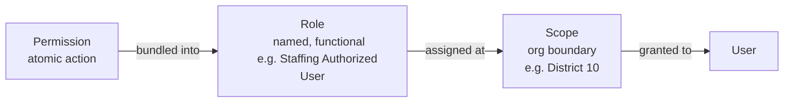
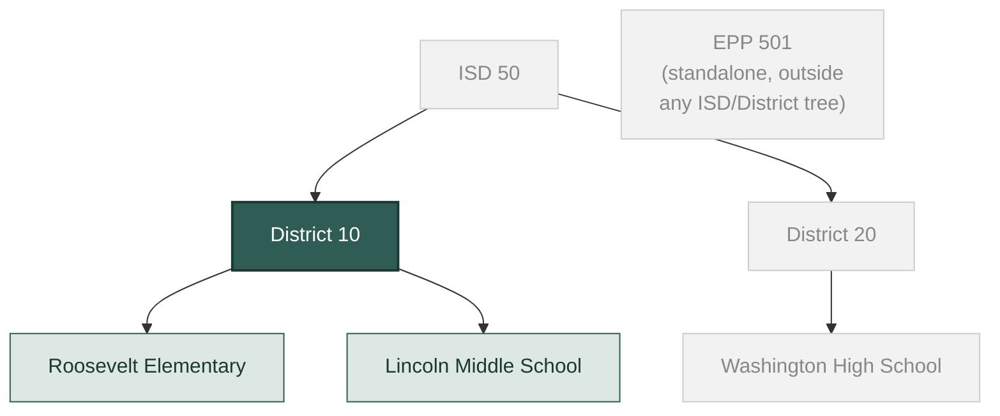
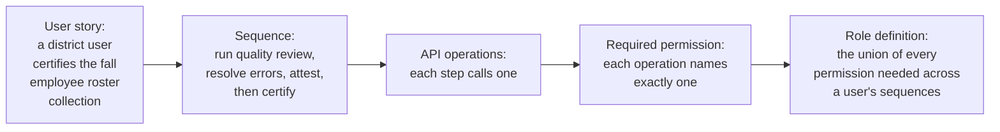
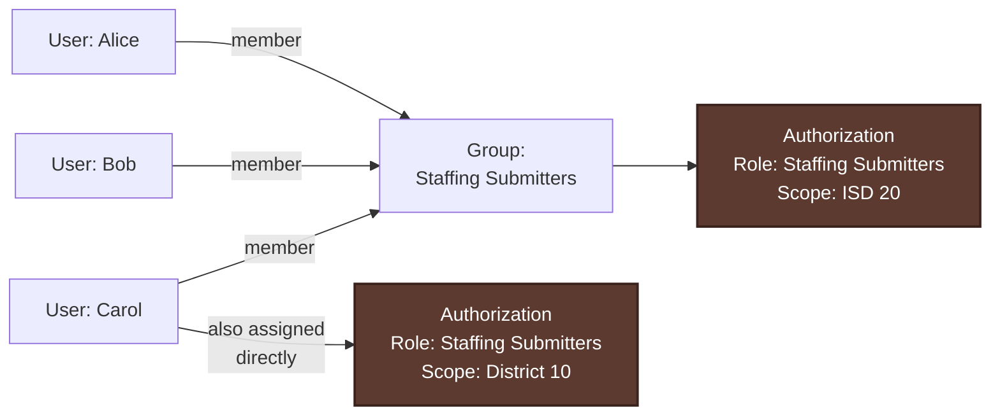
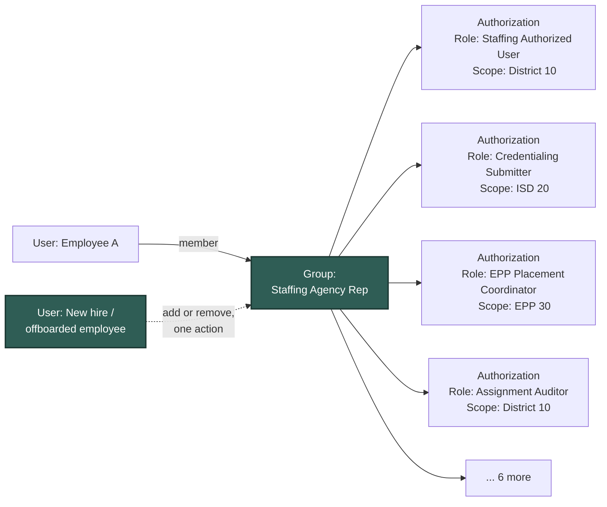

# IAM & Permissions: Architecture Walkthrough

*Reference material for discussion: roles, permissions, and scope in MiEdWorkforce*

## Overview

This walkthrough covers how access control is structured (permissions, roles, and scope). Following our first discussion, three of the four open questions below are now decided; **Groups is the one still open**:

- **Dynamic roles - decided:** fixed, predefined roles only. No in-app configuration of granular permissions within a role. (Section 5)
- **Groups vs. Role + Scope - still open:** is a separate "Group" concept needed, or does Role + Scope already cover it? (Section 6)
- **Impersonation - decided:** no "View As" / impersonation feature. Admins get record-level visibility (e.g. an applicant's in-progress application) plus screen-share for IT support. (Section 7)
- **Scope inheritance - decided:** roles are transitive down the EEM organization hierarchy - a role granted at an ISD is in effect for that ISD's districts and buildings, with no separate approval step at each level. (Section 8)

A related decision that cuts across all of this: role definitions should be framed around the user stories and sequences a role's holder actually performs (see Section 4's tracing method), not around a coarser "functional area" bucket. That keeps role design centered on what a person does, not an abstract department label.

---

## 1. The architecture at a glance

Access control works through four building blocks: **Permissions** are atomic actions, **Roles** bundle permissions together, **Scopes** define the organizational boundary a role applies within, and a **User** holds a role at a specific scope.

Roles are defined once, centrally, and mean the same thing everywhere they're used. A "Staffing Authorized User" role is the same bundle of permissions whether it's assigned at a single school or at an entire district. What changes per assignment is the **scope**: the same role can be given to one person at a single building and to another person at a whole district.

### A permission's name tells you exactly what it does

Every permission follows a fixed shape: `domain.resource.action`.

| Segment | Meaning | In `staffing.employee-roster.certify` |
|---|---|---|
| domain | which part of the system owns it | `staffing` |
| resource | the thing being acted on | `employee-roster` |
| action | one verb, from a fixed list | `certify` |

### Roles are also restricted by login type, not just scope

Every user authenticates through one of three MiLogin identity types: Citizen, Business, or Worker. A role declares which of those identity types it can be assigned under, so a district-staff role can't accidentally be handed to someone authenticated as a Citizen, and a citizen-facing role can't end up assigned to a Worker login. Some individual permissions carry the same kind of restriction where it matters, such as the identity-request permissions that are Citizen-only regardless of which role they end up in. This is a second, independent guardrail alongside scope: scope controls *where* a role reaches, login type controls *who* can be handed it in the first place.

---

## 2. Worked example: the Staffing Authorized User role

A district's staffing data entry and certification work is done by what the domain design calls a "Staffing Authorized User" (also referred to as the District User in the certification workflow): the person responsible for keeping employee, position, and assignment data current at their district, and certifying it as accurate at the end of a collection period. It's a useful example because it shows both halves of the model at once: what goes into a role, and where that role gets assigned.

**What's in the role (the permission bundle):**

| Resource | Permissions included | Left out, and why |
|---|---|---|
| Employee roster | view, add employee, update employment, bulk upload, certify | |
| Position roster | view, create, update, certify | |
| Assignment | view, create, update, submit credential-error justification, certify | |
| Collection | view, run quality-review validation, request a deadline exception | |
| Audit | none | reviewing a district's certified submission is a separate reviewer function (the ISD Auditor role), not part of submitting one |
| System administration | none | defining collection windows and data-element rules is a separate state-level admin function (the Staffing Data Administrator role) |

The same distinction from permission naming applies here directly: `staffing.employee-roster.certify` and `staffing.audit.review-submission` both touch the same underlying collection, but they're different actions taken by different people at different points in the process, so they're different permissions and only one of them belongs in this role.

**Where it gets assigned (the scope):** the permission catalog defines every one of those permissions at the Entity level (a single school or district office). Today, a Staffing Authorized User is assigned per district. The design already uses this same scope mechanism to let one grant cover multiple districts at once elsewhere, for example Credentialing's "manually submit an application on behalf of an educator" permission is explicitly assignable at System-wide, Entity, District, or ISD level, for cases like an ISD or staffing agency handling submissions for several districts. The same pattern would apply here if that need ever comes up for Staffing. See the transitivity example below.

---

## 3. How scope inheritance actually works

An authorization is granted at one specific organization. If that organization has other organizations beneath it, the grant automatically covers all of them too, with no separate approval needed at each level.

If a Staffing Authorized User role is granted at **District 10**, that person can act on Roosevelt Elementary and Lincoln Middle School without a second grant at either school. It does not reach District 20 or Washington High School, and it does not reach upward to ISD 50 either. Granting the role at ISD 50 instead would extend it to both districts and all three schools at once, the same pattern already used for Credentialing's on-behalf-of submission permission. EPP 501 sits outside the tree entirely: nothing granted anywhere in the ISD/District structure implies anything about EPP access, and vice versa.

---

## 4. Roles are built from what a user actually needs to do

Rather than guessing what permissions a role probably needs, we can trace it directly from the work itself.

Walking that chain for "certify the fall employee roster collection" surfaces `staffing.collection.validate` (run the quality review) and `staffing.employee-roster.certify` (the certification step itself, gated behind attestation and e-signature). Do the same for every task a Staffing Authorized User needs to complete, adding in the roster, position, and assignment permissions from the sequences that create and maintain that data in the first place, and the union of all of it is the role definition from Section 2, not a guess about what "that kind of user" probably needs. It also gives a direct answer to "why does this role have this permission": because a specific, named process requires it.

---

## 5. Decided: roles are fixed, not dynamically configurable

**Decision:** we will use fixed roles only. No UI for an admin to assemble or edit granular permissions into a custom role - roles are predefined, functional building blocks, changed through a normal release when needed.

Roles clearly exist. The question was whether the set of permissions inside a role should be something an admin can change in the app, or something defined centrally and updated through a normal release.

**Making roles dynamically configurable would offer:**
- Flexibility for people who delegate access themselves, such as an EPP's own lead administrator shaping access within their organization
- Permission changes that take effect without waiting on a release

**The trade-off:**
- Every admin, and every piece of training material or help documentation, now has to deal with roles that aren't fixed or consistently named. There's no single, stable "Staffing Authorized User" to point to
- An admin could grant part of what a task requires without granting all of it. Someone could be given the ability to certify a roster without the ability to update it first, for example, with nothing catching that gap

**Direction confirmed:** roles stay predefined with clear, functional names, and what's inside each role is managed as a single, centrally reviewed configuration. Changing a role means adding or removing one permission from that configuration, released like any other change. In exchange, we get a stable, teachable set of role names, and the guarantee from Section 4 that a role is never missing part of what a task requires - permission changes go through a review and release cycle rather than a self-service admin screen.

---

## 6. Open: is a separate "Groups" concept needed alongside Role + Scope?

The one question left unresolved from our first discussion: is there a real need for a "Group" of users as its own assignable thing, separate from Role? Current lean is **no** - good lookup tools by user/role/scope likely cover it - but that's a lean, not a decision.

**Two things worth knowing going in:** "User Group" is already a term in FDD 01, meaning something different - a functional category a role lives under in the UI (System Administrator, Credential, Staffing, EPP, Professional Learning, Data Quality, Citizen), constrained only by MiLogin type, not an access-bundling construct. And `iam-domain.md` already has a recorded decision (2026-08-14) against a Group layer, concluding Role + Scope covers everything Group would. Thursday may be re-affirming that rather than opening it fresh - or Scenario B below may be the new information that changes it.

**On mixed-scope groups specifically:** the domain model backs the diagrams below directly - an Authorization is always one Role @ one Scope, never multi-valued. Someone (or a group) authorized across District 10, ISD 20, and EPP 30 holds three separate Authorization records, not one record spanning all three. So a "group of MiLogin Business users with mixed scopes" is exactly Scenario B's shape: one group, several single-scope authorization boxes hanging off it.

Both scenarios use one building block: an **authorization**, a single "Role @ Scope" box. That box can be held by either a Group or a User directly - same shape, different holder.

### Scenario A: against Groups - the same authorization reaching a person two ways

Alice, Bob, and Carol are members of a group **"Application Reviewers,"** which holds the authorization **Application Reviewers @ System-wide**. Carol also happens to hold **Application Reviewers @ District 10** directly, unrelated to the group.

Now "does Carol have Application Reviewers?" means finding both boxes and reconciling them - is the direct grant redundant or intentional? Remove Carol from the group thinking that revokes her access, and the direct assignment quietly remains. **Core argument against Groups:** a person's total access becomes the union of authorizations reached through however many paths (direct, plus however many groups), not one place to look.

### Scenario B: for Groups - mirroring or mass-revoking a person's access

A staffing agency employee holds **ten authorizations, a genuine mix of different roles at different scopes - and different org types**: Staffing Authorized User at District 10, Credentialing Submitter at ISD 20, EPP Placement Coordinator at EPP 30, and so on. (If it were the *same* role repeated across many districts, that's a modeling mistake, not a Groups case - Section 3's scope inheritance already collapses that to one grant at the parent ISD. The real case is specifically this mixed one, and it holds even when the scopes are different kinds of organization entirely, not just different districts.)

A new hire needing the same composite access, or an offboarded employee needing all of it pulled, is one group membership change instead of ten separate grants across several scopes, each at risk of being missed. **Core argument for Groups:** scope inheritance already handles "same role, many places," so the residual need is narrower than "someone has ten roles" - it's "someone's access is a genuine mix of different roles at different org levels that no single parent grant covers."

### Notification targets: a third possible use, probably not needed

Could Groups also be a notification target? The FDDs already answer this without Groups: FDD 09 routes alerts to "the PPR Reviewer worklist"/"role," and FDD 06's domain model resolves recipients via `Role @ Scope` at send time - the same Authorization shape used above, not a Group entity. Adding Groups as a second way to configure a target would just reintroduce Scenario A's ambiguity in a new place.

One refinement worth keeping in mind though: hardcoding a role *name* into alert-routing logic has its own drift risk - if a "PPR Reviewer Support" role appears later, code checking for "PPR Reviewer" specifically will miss it. So: **system-triggered alerts** (a workflow step firing automatically) should resolve recipients by the **permission** the step requires, not a role name - the same permission→sequence mapping from Section 4, run in reverse. **Admin-configured, discretionary notifications** (mass emails, ad hoc alerts) are fine targeting a role or user directly, since an admin is choosing intentionally each time. Neither case needs Groups.

### Other candidate uses, not yet raised elsewhere

Not confirmed needs - nothing in the FDDs asks for them - but worth naming:
- **Caseload / work distribution:** splitting an already-authorized pool of reviewers into working teams for load-balancing is an assignment/queueing question, not an access-control one - everyone already holds the same permission. This is likely the same idea as "Worklists," which FDD 13 (and its companions, FDD 5.5 and FDD 25) already describe, though thinly: today, a worklist reads as a **role-scoped filtered view** (status changes move an item between worklists automatically, e.g. an EPP denial routes an application back to the District's worklist) rather than manual person-to-person assignment, and *access to a whole worklist* is granted at the individual-user or role level (FDD 5.5), not a group level. Whether worklists should ever distribute individual items to a specific person or team is genuinely open and worth a dedicated deep-dive of its own - not something to resolve inside this Groups discussion, just worth having on the radar since it's the closest existing feature to "caseload."
- **External-org self-service rosters:** an EPP's or agency's own admin wanting a saved "my team" contact list, independent of what roles those people hold.

If either turns out real, it likely argues for its own distinctly named concept (a work queue, a roster) rather than stretching "Group" to mean three different things at once - that's Scenario A's ambiguity recreated one level up.

One more wrinkle for the self-service roster case: EPPs are themselves an authorization scope, same as District/ISD, and each EPP has its own Lead Admin - but that Lead Admin designation comes from EEM (the external system of record), not from anything decided inside this system. So "who can manage an EPP's roster/group" isn't fully ours to define; it inherits whoever EEM says is Lead Admin for that EPP.

**Additional questions for Thursday, regardless of which way Groups goes:**
- **Visibility:** who can see what groups exist and who's in them?
- **Eligibility:** are groups open to every login type, or restricted like some roles already are (Section 1)?
- **Membership management:** a group spanning multiple scopes (Scenario B) - who's authorized to manage its membership: the highest scope involved, all scopes involved, or a separate permission of its own? And for an EPP-scoped group specifically, does that authority default to whoever EEM designates as that EPP's Lead Admin?

**Question for discussion:** does giving admins strong-enough tools to see what a role grants, and to look up authorizations by user, by role, or by organizational scope, cover the residual Scenario B case well enough without a Group construct - or does the composite-access need outweigh the naming-collision risk in Scenario A? (Kyle has some Group-related wireframes already in progress worth bringing into this conversation.)

---

## 7. Decided: no "impersonation" / "View As" feature

**Decision:** a read-only "View As" feature, letting an admin see the application exactly as a specific user would see it with all actions disabled, stays out of scope. (And we're retiring the word "impersonation" from this project's vocabulary entirely.)

That kind of feature carries real cost to build safely: a separate session model, write-blocking enforced at multiple layers, a dedicated audit trail, and session lifecycle management, all in service of a fairly narrow diagnostic need.

**The alternative, confirmed:** admin-facing views of a user's own records and current state, such as an applicant's in-progress application, plus their request and approval history and event audit logs, all through normal permissions with no special session; combined with screen-sharing when someone genuinely needs to see the exact page an IT support case is about.

---

## 8. Decided: scope inheritance is transitive down the EEM hierarchy

**Decision confirmed:** the transitive-scope behavior in Section 3 matches expectations. A role granted at the ISD level is automatically in effect for that ISD's own districts and buildings, per the EEM organization hierarchy, with no separate approval step at each level.

---

## Summary of decisions

| Topic | Status | Outcome |
|---|---|---|
| Role configurability | Decided | Fixed, predefined, functionally named roles only - no in-app role builder |
| Role definition approach | Decided | Frame role definitions around user stories/sequences, not a coarser "functional area" bucket |
| Scope inheritance | Decided | Transitive down the EEM org hierarchy (ISD → districts → buildings), no per-level approval |
| Impersonation | Decided | No "View As" - admin record visibility + audit history + screen-share instead |
| Groups | **Open** | Still weighing Group-as-namespace risk (Scenario A) against copy/revoke-a-role-set convenience (Scenario B) - bringing concrete scenarios to Thursday's meeting |
