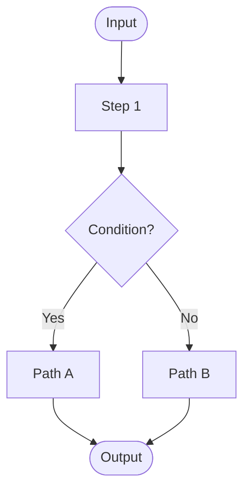
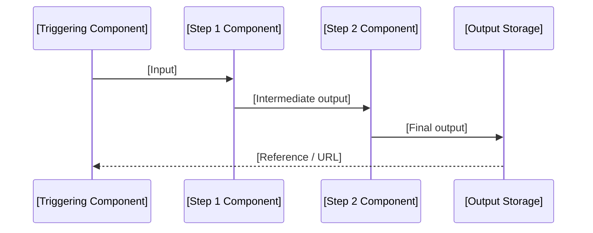

# [Domain Name] - Technical Design

**Domain:** [Full Name]  
**Version:** [X.Y]  
**Last Updated:** [YYYY-MM-DD]

## Purpose

This document provides technical design details for the [Domain Name] domain that are implementation-specific and do not belong in the domain model documentation. It describes algorithms, evaluation strategies, processing pipelines, and technical constraints needed for implementation.

<!--
TECHNICAL ARCH AUTHORING RULES (remove this comment block before publishing):

WHAT BELONGS HERE:
  - Algorithms and evaluation logic (e.g., how a rules engine processes conditions)
  - Caching strategies and consistency thresholds
  - Processing pipelines (e.g., document generation, bulk import parsing)
  - Third-party library or service choices with rationale
  - Non-obvious implementation patterns required by the domain
  - Performance targets and the design decisions that serve them
  - Security mechanisms beyond "authenticate the user"
  - Technical open questions that block implementation (not business questions)

WHAT DOES NOT BELONG HERE:
  - Business rules (those live in the domain doc)
  - Sequence flows for user journeys (those live in the sequences doc)
  - Permission definitions (those live in the permissions catalog)
  - API contracts (those live in the API spec)

STRUCTURE GUIDANCE:
  This document is intentionally flexible. Add only the sections relevant to this domain.
  Not every domain needs a technical arch doc at all - create one when:
    - A domain has non-trivial algorithmic behavior (evaluation engines, calculators, etc.)
    - A domain has complex caching or consistency requirements
    - A domain integrates with external systems in non-standard ways
    - A domain has a document generation, bulk processing, or import pipeline
    - A domain has security or compliance mechanisms requiring design documentation

SECTION HEADERS:
  Use descriptive H2 headers that name the concern, not generic labels.
  Prefer: "Authorization Evaluation Algorithm" over "Algorithm"
  Prefer: "Assessment Result Import Pipeline" over "Data Import"

DIAGRAMS:
  Use Mermaid where it adds clarity:
    - flowchart TD for algorithms and decision trees
    - sequenceDiagram for technical interactions (not user journeys)
    - graph TB for component relationships
    - mindmap for factor analysis

OPEN QUESTIONS:
  Technical questions only. Business questions belong in the domain doc open questions table.
-->

---

## [Technical Concern #1 - e.g., "Rule Evaluation Engine"]

### Overview

[2-3 sentences describing what this concern is and why it requires technical documentation beyond the domain model.]

### [Sub-topic - e.g., "Evaluation Algorithm"]

[Describe the algorithm, data structure, or processing approach. Use diagrams freely.]

[Elaborate on any non-obvious aspects of the diagram.]

### [Sub-topic - e.g., "Why This Approach"]

**Business Requirements:**
- [Requirement that drove this design]
- [Another requirement]

**Technical Benefits:**
- [Benefit]
- [Benefit]

**Alternatives Considered:**
- **[Alternative A]:** [Why it was rejected]
- **[Alternative B]:** [Why it was rejected]

### [Sub-topic - e.g., "Edge Cases"]

[Document known edge cases and how the implementation handles them.]

| Scenario | Behavior |
|----------|----------|
| [Edge case] | [How the system handles it] |
| [Another case] | [Behavior] |

---

## [Technical Concern #2 - e.g., "Caching and Consistency"]

<!--
CACHING SECTION GUIDANCE:
If the domain has meaningful caching (beyond HTTP response caching), document:
  - What is cached (key structure, value type)
  - TTL per cache tier
  - Invalidation triggers (events, explicit calls)
  - Acceptable staleness per data type
  - Cache miss behavior and performance impact
  - Monitoring and alerting targets
-->

### Overview

[What is cached and why - performance targets that require it.]

### Cache Tiers

| Cache | Key Pattern | Value | TTL | Invalidation Trigger |
|-------|-------------|-------|-----|----------------------|
| [Name] | `prefix:{id}` | [What is stored] | [Duration] | [Event or condition] |
| [Name] | `prefix:{id}:{type}` | [What is stored] | [Duration] | [Event or condition] |

### Consistency Thresholds

| Event | Acceptable Staleness | Rationale |
|-------|----------------------|-----------|
| [Data change event] | [Duration] | [Why this delay is acceptable] |
| [Another event] | [Duration] | [Rationale] |

### Cache Miss Behavior

[What happens when a cache miss occurs - fallback query, performance impact, etc.]

### Performance Targets

| Metric | Target | Condition |
|--------|--------|-----------|
| [Operation] (cache hit) | < [Xms] | [Percentile] |
| [Operation] (cache miss) | < [Xms] | [Percentile] |
| Cache hit rate | > [X]% | Under normal load |

---

## [Technical Concern #3 - e.g., "Document Generation Pipeline"]

<!--
PROCESSING PIPELINE SECTION GUIDANCE:
For domains that generate documents, process files, or run batch jobs, document:
  - Trigger (what initiates the pipeline)
  - Steps in order, with the component responsible for each
  - Error handling and retry behavior at each step
  - Output format and storage location
  - Third-party dependencies and any constraints they impose
-->

### Overview

[What the pipeline does and what triggers it.]

### Pipeline Steps

### Step Details

**Step 1 - [Name]:**
[What this step does, any library or service involved, error handling.]

**Step 2 - [Name]:**
[What this step does.]

### Error Handling

| Failure Point | Behavior | Recovery |
|---------------|----------|----------|
| [Step fails] | [Immediate behavior] | [Retry / dead-letter / alert] |

### Dependencies

| Dependency | Purpose | Constraint |
|------------|---------|------------|
| [Library or service] | [What it's used for] | [Version pin, rate limit, license, etc.] |

---

## [Technical Concern #4 - e.g., "External System Integration Details"]

<!--
EXTERNAL INTEGRATION SECTION GUIDANCE:
Use this section when an integration has non-standard behavior worth documenting separately
from the sequence diagrams. Cover:
  - Connection and authentication details (without secrets)
  - Request/response transformation requirements
  - File format specifications for batch integrations
  - Known provider quirks or undocumented behaviors
  - Rate limits and throttling strategy
  - Current vs. future state (e.g., "manual upload today, API in the future")
-->

### Overview

[What this integration does and the current integration state (manual, API, event).]

### Current State vs. Future State

**Current:** [How this works today - e.g., manual file upload by admin]

**Future:** [Intended integration pattern - e.g., real-time API with Pearson MTTC]

**Transition Plan:** [What triggers the move from current to future state]

### Connection Details

**Authentication:** [OAuth2 client credentials / API key / mTLS / etc.]  
**Base URL:** [Endpoint - or "TBD pending vendor contract"]  
**Rate Limits:** [Requests per minute/hour if known]

### Data Transformation

[Describe any non-obvious mapping between provider format and internal domain model. Include field mapping tables if useful.]

| Provider Field | Internal Field | Transformation |
|----------------|---------------|----------------|
| [Field] | [Internal field] | [Direct / lookup / computed] |

### Error Handling

**Timeout:** [Configured timeout and behavior on timeout]  
**Retry:** [Strategy - exponential backoff, max attempts, dead-letter]  
**Circuit Breaker:** [Threshold and fallback behavior if applicable]

---

## [Technical Concern #5 - e.g., "Security Mechanisms"]

<!--
SECURITY SECTION GUIDANCE:
Only document security mechanisms that are non-standard or require design explanation.
Do not repeat generic guidance ("validate inputs", "use HTTPS").
Examples of things that belong here:
  - Cryptographic hash chains on event tables (tamper detection)
  - How impersonation sessions are managed and invalidated
  - How audit log integrity is maintained
  - Field-level encryption for sensitive data
  - Specific compliance mechanism implementations (FERPA data isolation, etc.)
-->

### [Security Mechanism Name]

**Purpose:** [What threat or compliance requirement this addresses]

**Implementation:** [How it works technically]

**Limitations:** [Known gaps or accepted trade-offs]

---

## Open Technical Questions

<!--
Only technical questions that block or significantly impact implementation.
Business questions belong in the domain doc open questions table.
-->

| # | Question | Impact | Owner | Target Date |
|---|----------|--------|-------|-------------|
| 1 | [Specific technical question] | [H/M/L] | [Name/Team] | [Date] |
| 2 | [Another question] | [H/M/L] | [Name/Team] | [Date] |

---

## Related Documents

- [Domain Model](./[domain]-domain.md)
- [Workflows & Sequences](./[domain]-sequences.md)
- [API Contracts](./[domain]-api.yml)
- [Permissions Catalog](./[domain]-permissions.md)

---

**Version History:**
- v1.0 ([YYYY-MM-DD]): Initial version - [brief description of what was documented]