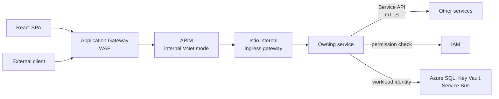

# Authentication & Authorization Patterns

## Overview

This document defines how callers are identified, authenticated and authorized across MiEdWorkforce. Every call to a service comes from one of three kinds of principal, and each kind uses a different credential. All three are authorized by the same model: **Scope-based RBAC with Permission Authorization**.

**Scope-based RBAC with Permission Authorization** means:
- A **permission** is the atomic unit (`{domain}.{resource}.{action}`).
- A **role** bundles permissions. Roles are defined in code, not created by users.
- A role is granted to a principal at a **scope** (Individual, Building, District, ISD, EPP, System-wide and so on). Scope inherits down the organization hierarchy.
- Endpoints authorize on **permissions**, never on roles or on caller type. The same required-permission declaration on a controller applies whoever the caller is.

| Principal | Calls which API | Credential | Authenticated by | Grants live in |
| --- | --- | --- | --- | --- |
| **User** | Application API (`application-user`) | MiLogin OIDC token | APIM and the owning service | IAM (approval workflow) |
| **Service** | Service API (`application-service`) | Istio mTLS identity (Kubernetes service account) | Istio sidecar, then the shared library maps it to a logical service name | Code (service roles, reviewed in pull requests) |
| **External client** | External API (`external-client`) | OAuth 2.0 client credentials token | APIM, then the owning service | IAM (client record and grants) |

Authentication proves who is calling. It never grants access on its own. MiLogin supplies identity only (a unique identifier and basic profile), with no roles or permissions. User and client grants are owned by IAM; service grants are owned by the codebase.

**Related documents:**
- [Solution Architecture](../solution-level/solution-architecture.md) - the three API kinds and the request path
- [Solution Tech Standards](../solution-level/solution-tech-standards.md) - platform decisions, Istio, APIM
- [IAM Technical Design](../solution-areas/iam/iam-technical-design.md) - evaluation algorithm, caching
- [IAM Domain](../solution-areas/iam/iam-domain.md) - authorization business rules
- [API Design](./api-design.md) - `x-access`, `x-permissions-required`, `x-scope-sensitive`

**Status markers used below:** *Decided* means it is already stated in the architecture or tech standards. *Proposed* means it is the working recommendation and needs confirmation. *Open* means no recommendation yet. Open items that need an answer from someone outside the team are tracked in the hub [open questions](../../../hub/tracking/open-questions.md), not here.

---

## Request Path

Cloudflare sits in front of Application Gateway in every environment (the state's direction as of 2026-10-06). In Dev and QA it limits access to state users; until the origin controls are in place they stay on the private frontend. Application APIs are served on the UI hostname under `/api`; external APIs are on a separate API hostname. Both go through the same APIM instance. Service APIs never go through APIM.

---

## User Authentication (Application API)

### MiLogin identity providers *(Decided)*

MiLogin is the state's SSO provider and the only way users authenticate. It exposes three user types, each a separate identity provider:

| MiLogin type | Who | Notes |
| --- | --- | --- |
| Citizen | Educators and other members of the public | Gets automatic Individual scope after identity resolution |
| Business | District, ISD, EPP and other organization staff | Authorization requested and approved through IAM |
| Worker | State staff and system administrators | Authorization through IAM |

What MiLogin gives us: a unique identifier (`sub`) and basic profile claims (name, email). What it does not give us: roles, permissions, organization membership, or the Unique ID. The Unique ID comes from Mi-Key identity resolution, owned by IAM.

MiLogin is integrated as OIDC with the authorization code flow and PKCE. Applications are registered through the MiLogin Automated Application Onboarding (AAO) portal.

### Identity key *(Proposed)*

A `sub` value is only meaningful within the issuer that produced it. The internal user key is therefore the pair `(issuer, sub)`, and the MiLogin type is derived from the issuer, never from a header or a client-supplied claim. IAM caches (`user-auth:{userId}:{miLoginType}`) use the internal user ID that this pair resolves to.

One person may hold identities in more than one MiLogin type (for example Citizen and Worker). These are separate users for authorization purposes. Linking them is not designed yet and is tracked as an open question.

### Token validation *(Decided, details Proposed)*

The token is validated twice: at APIM and again by the owning service.

- **APIM** uses a `validate-jwt` policy that accepts the three MiLogin issuers, checks signature (via each issuer's OpenID configuration and keys), issuer, audience, and expiry, and rejects everything else before it reaches the cluster. It also applies per-user rate limiting.
- **The service** repeats validation with the standard ASP.NET Core JWT bearer handler against the same three issuers. This keeps the service safe if traffic ever reaches it by another path, and the service needs the validated claims anyway.
- Clock skew tolerance is small (default 5 minutes or less). The audience must be the MiEdWorkforce application API audience. Tokens issued for any other audience are rejected.

### SPA authentication *(Decided)*

React SPAs use MSAL.js against MiLogin. The page and its API share one origin (API under `/api` on the UI hostname), so there is no CORS configuration for application APIs.

- Tokens are held by MSAL in session storage (cleared when the tab closes). Never in local storage.
- The SPA sends `Authorization: Bearer {token}` on every API call and handles 401 by refreshing silently, then falling back to interactive login.
- The SPA hides or disables UI the user cannot use, based on `GET /permissions/effective`. This is a convenience only. The backend always enforces.
- Route guards redirect unauthenticated users to login and return them to their intended destination afterwards.
- The signed-in user's identity type decides which MiLogin realm and login experience is used.

### Organization context *(Decided)*

A user with multiple authorizations sends the organization they are acting for in `X-Organization-Context`. The backend validates it against the user's actual authorizations on every request. Which organization is currently selected is UI state only; the backend is stateless about it. Scope-agnostic and self-only endpoints do not need the header.

---

## Access Classification

Every operation in an API spec declares how it is reached and who may call it. `x-access` names the surface and the kind of caller. The values describe the caller's relationship to the platform, not network location. (Users reach the platform from outside our network, so "internal" would mislead.)

| `x-access` | Surface | Caller | Authenticated by |
| --- | --- | --- | --- |
| `application-user` | Application API (UI hostname, `/api`) | A signed-in person using the MiEdWorkforce UI | MiLogin token |
| `application-service` | Service API (inside the mesh only) | Another MiEdWorkforce service | Istio mTLS identity |
| `external-client` | External API (API hostname) | An external system or Azure-hosted job | OAuth 2.0 client credentials |
| `external-public` | External API (API hostname) | Anyone, unauthenticated | None (use sparingly) |

An operation may list more than one value (for example `application-user, application-service`). Every operation, whatever its `x-access`, declares `x-permissions-required` and `x-scope-sensitive`. Only `external-public` operations may leave `x-permissions-required` empty.

Replaces the previous values `internal-user`, `internal-service`, `external-client` and `external-public`. Migrating existing specs is tracked as a task.

---

## Authorization Enforcement

### One check at the controller *(Proposed)*

Every controller action declares the permission it requires, and a shared filter enforces it before any business logic runs. The declaration is identical for all callers, and it must match `x-permissions-required` in the API spec (checked in CI).

Each authentication handler (MiLogin JWT, Istio peer identity, OAuth client, webhook signature) yields a principal with a **type** (user, service, client) and an **identity**. The filter then asks a principal-appropriate provider for the principal's grants:

| Principal type | Provider | Where grants live | Notes |
| --- | --- | --- | --- |
| User | IAM permission check | IAM | Dynamic, org-scoped, cached (5 minutes) |
| Client | IAM permission check | IAM | Dynamic, org-scoped, cached |
| Service | Local lookup in the shared library | Code | Static, system-wide, no network call |

Because service grants are resolved locally, service-to-service calls do not depend on IAM being available, and IAM's own check endpoint can be called by services without circularity (the caller needs `iam.permission.check`, a service permission resolved locally).

### The IAM check *(Decided)*

For users and clients, the service calls IAM's permission check with the principal, the required permission, and (for scope-sensitive permissions) the organization code. IAM evaluates the principal's authorizations (roles at scopes, with transitive inheritance down the organization hierarchy) and returns allow or deny. See the IAM Technical Design for the algorithm and caches.

- Checks can be batched (up to 20 per call).
- Denials return 403 with a generic message and are logged for security review.
- Endpoints where scope is resolved from the owning record (not from the header) look up the owning organization first, then check against that organization.

### Shared enforcement library *(Proposed)*

Every service uses one shared .NET library for authentication setup, the permission filter, the IAM check client, the service grant lookup, the `X-Organization-Context` handling, and owning-record scope resolution. The goal is that no service hand-rolls this, because every hand-rolled copy is a place where a check can be forgotten. The library also supplies the test authentication handler (see Testing).

### When IAM is unavailable *(Proposed)*

IAM sits on the hot path of every protected call, so its failure behavior needs to be explicit:

- The service keeps a short local cache of recent decisions (within the existing 5 minute TTL) and serves from it if IAM is unreachable.
- On a cache miss while IAM is unreachable, the service fails closed (503, not 200). It never defaults to allow.
- Critical permissions (`iam.authorization.grant`, `iam.authorization.revoke`) are never served from cache.
- Circuit breaking and timeouts at the mesh level (see Tech Standards, Service Mesh).

### Listing and search *(Open)*

The permission check answers "may this user act on organization X". List and search endpoints need the other question: which organizations may this user see. That needs the set of descendant organizations of each of the user's authorization scopes, but the Organizations hierarchy API returns ancestors only. Design needed before scope-sensitive list endpoints are built.

---

## Service Authentication (Service API)

### Mesh identity *(Decided)*

All service-to-service traffic is inside the mesh, encrypted and authenticated by Istio STRICT mTLS. A caller's mesh identity is its Kubernetes service account (a SPIFFE identity such as `cluster.local/ns/credentialing/sa/credentialing-api`), issued as a short-lived certificate by Istiod. Every namespace has a default-deny AuthorizationPolicy, and each permitted caller is allowed explicitly.

This is not the same as the managed identity used for workload identity. A callee sees the caller's service account, never its managed identity.

### Logical service names and service roles *(Proposed)*

Services are authorized by the same permission model as everyone else, using **logical service names** defined in the codebase (for example `staffing`, `credentialing`, `documents`, `synapse-iam-jobs`).

- A **service role** bundles the permissions one logical service needs from others, defined in code beside the other role definitions and reviewed in pull requests. "What service may call what" is therefore a code review question, not an infrastructure surprise.
- A service role is granted to a logical service name at system scope. Services hold no organization-scoped grants. Any organization scope in a call comes from the user it is acting for.
- Service roles use the same permission identifiers as the catalog. Reuse an existing permission where the meaning is the same (for example `credentialing.credential.view`). Add a new permission only for system-only operations such as job triggers and callbacks.
- If a service calls an endpoint it holds no permission for, the call is denied (403) by the callee's controller filter. Misconfiguration surfaces in tests, not in production behavior.

### Mapping logical names to real identities *(Proposed)*

The codebase knows only logical names. Each environment supplies the mapping from real identities to logical names as configuration, so the same code runs locally and in every environment.

| Caller | Real identity | Where the mapping comes from |
| --- | --- | --- |
| Pod in the mesh | Kubernetes service account (SPIFFE ID) | Naming convention (namespace and service account name), or environment configuration |
| Azure-hosted caller outside the mesh (for example Synapse) | Entra managed identity (object or client ID) | Terraform outputs pushed into environment configuration |
| Local development | Test principal chosen by the developer | Local configuration, accepted only by a test handler that cannot be enabled outside Local |

Rules for the mapping:
- The service reads it at startup and fails closed if an expected entry is missing.
- Write access to the mapping is limited to the deployment pipeline, entries are labeled per environment, and changes are audited. Whoever can write the mapping can impersonate a service, so it is treated as security configuration.
- The Istio allow-lists are generated from, or validated in CI against, the same service role definitions, so the mesh and the application never disagree. Istio is the coarse network gate; the controller filter is the precise check.
- Terraform is owned by DTMB. How its outputs reach our configuration needs an agreed process (tracked in the open questions).

### Reading the caller identity *(Proposed)*

The callee obtains the caller's mesh identity from the sidecar (the client certificate identity forwarded by Envoy). The header carrying it is trusted only if the ingress gateway strips it from external traffic and only the sidecar can set it. The shared library is the only code that reads it.

### Delegated calls *(Proposed)*

When service A calls service B on behalf of a signed-in user, **both** must be authorized: A's service role must include the permission B requires, and the user must hold that permission (at the right scope) as well. Neither alone is enough. This keeps a service from gaining a user's reach, keeps a user from reaching through a service that was never meant to call B, and forces every service-to-service dependency to be stated explicitly.

| Call | Principal(s) evaluated | Example |
| --- | --- | --- |
| **Delegated** | Calling service (local lookup) and the user (IAM check) | Staffing checks credentials while a coordinator is logged in |
| **System** | Calling service only | Nightly validation job, event handler |

An endpoint that supports both says what each mode returns and how each is audited. Sequence diagrams show which calls are delegated (see Sequence Notation).

### Delegation: carrying the user across hops *(Open, leaning Proposed)*

Two options for how a user's identity travels when service A calls service B for a user:

1. **Forward the user's MiLogin token.** B validates it exactly as A did. Simple, no new infrastructure, full audit of the real user. Cost: B receives a token that is valid against any application API for its lifetime. The mitigation is the mesh allow-list and service roles, which limit who may receive it, plus short token lifetimes.
2. **Token exchange.** A trades the user's token for a short-lived internal token with a narrow audience and an actor claim ("A acting for user U"). Better containment, better audit of the delegation chain. Cost: needs a token-issuing component and signing key management. MiLogin is not Entra, so Azure's on-behalf-of flow is not available.

Working recommendation: forward the token for the initial implementation, and revisit token exchange if a threat review requires it. Whichever is chosen, a service must never act for a user based on a bare user ID header from another service.

### Calls to Azure resources *(Decided)*

Pods reach SQL, Key Vault, Service Bus and other Azure services with workload identity (a federated credential to a managed identity), with no connection strings or secrets. Identities, federated credentials and role assignments are defined only in the environment Terraform. Workload identity is for pod to Azure resource calls. It is not used for service to service calls inside the cluster.

### Callers outside the mesh *(Proposed)*

Some legitimate callers are not pods in the mesh: Synapse pipelines (scheduled jobs such as IAM's `/admin/jobs/*`, EPP bulk-upload callbacks), the SendGrid delivery webhook, the Defender-for-Storage Event Grid webhook, and inbound callbacks from other state systems. These must not get a side door into the mesh.

- They enter through APIM on the external API surface, like any other external caller.
- Synapse and other Azure-hosted callers authenticate with their managed identity, obtaining a token for the external API audience (client credentials equivalent). They are `external-client` callers whose managed identity maps to a logical service name (for example `synapse-iam-jobs`) holding a narrow service role, so their grants are code-defined like any other service.
- Webhooks that cannot present an OAuth token (SendGrid HMAC, Event Grid signature) are validated by an APIM policy or a dedicated, minimal receiving service before anything is forwarded inward.
- The service specs currently describe some of these as "Managed Identity / mTLS" and "not exposed via APIM". That wording should be revised once this is confirmed with the infrastructure team.

---

## External Client Authentication (External API)

### Model *(Decided direction, details Proposed)*

External systems (district HR and SIS systems, vendors, other state systems, Synapse and webhooks per the section above) authenticate with OAuth 2.0 client credentials. Each client presents a token to APIM on the separate API hostname.

Each kind of API has its own token audience. APIM serves every API on every hostname, so audience separation is what stops a token minted for one kind of API from being replayed against another.

### Client as a principal *(Proposed)*

An external client is a principal in IAM, held to the same model as users:

- A **client record** in IAM identifies the client (its OAuth client ID), its owner or sponsoring organization, status, and contact.
- A client holds **role grants at a scope**, using the same permissions, role definitions and organization hierarchy as users. A vendor submitting rosters for District 42 holds a submission role scoped to District 42. A state integration holds a role at system-wide scope.
- The token proves which client is calling. It does not carry organization scopes. The client's organization grants live in IAM, so Lead Admins can manage them the same way they manage user access, and revoking a grant takes effect through the normal cache invalidation.
- On every external call, IAM evaluates the permission for the client and the organization in `X-Organization-Context`. A client acting for an organization it has no grant for is denied, exactly like a user.
- Where the specs say an endpoint is `external-client`, the endpoint's permission and `x-scope-sensitive` flag apply to the client principal.
- Channel-specific rules (for example the rule that the API channel may not create new Unique IDs) are enforced as business rules in the owning domain, using the principal type. IAM does not model them.

### Token issuer and onboarding *(Open, leaning Entra)*

Working assumption: Microsoft Entra ID issues client-credentials tokens for external clients (app registrations), APIM validates them with `validate-jwt`, and the APIM developer portal supports client onboarding and subscription management. APIM provides authentication, products, quotas and rate limiting. It does not provide organization-scoped authorization, which stays in IAM.

Still to confirm:
- Whether the state's Entra tenant allows app registrations for external parties, or whether a separate tenant or another issuer is required.
- Who runs onboarding (state operations, or a district Lead Admin approving a vendor for their organization), and whether the developer portal is exposed to vendors.
- Credential type: prefer certificates or federated credentials over shared secrets, with an overlap window during rotation, and secrets only if the tenant requires them.
- How client records in IAM are created and kept in sync with the issuer.

### Controls at APIM *(Proposed)*

- `validate-jwt` with the external audience and the expected issuer; reject on mismatch.
- Per-client rate limits and quotas, defined per product (the standard states 10000 req/min per system as a default).
- IP restrictions where a client has fixed egress addresses.
- Request size limits and schema validation from the OpenAPI contract.
- Correlation IDs on every request and the client ID on every log line.

External APIs that accept bulk or repeated submissions require idempotency keys, because retries at the network layer are not aware of side effects.

### Public endpoints *(Decided, details Open)*

`external-public` endpoints (public credential search, removal-request submission) are unauthenticated. They are served on the API hostname through APIM, with no permission required. Use sparingly. Each needs rate limiting and abuse protection at APIM, WAF at Application Gateway, and a documented answer for what data it may expose. Removal requests are anonymous by design, so they go to manual review before any effect.

---

## Principal Summary

| | User | Service | External client |
| --- | --- | --- | --- |
| `x-access` | `application-user` | `application-service` | `external-client` |
| Identified by | `(issuer, sub)` resolved to an internal user ID | Logical service name, resolved from the mesh identity (or managed identity) | OAuth client ID |
| Credential lifetime | MiLogin token lifetime | Certificate rotated every 24 hours | Token lifetime set by issuer |
| Permissions checked | Required permission at scope, by IAM | Required permission, by local lookup of service role | Required permission at scope, by IAM |
| Also enforced by | APIM validation | Istio AuthorizationPolicy (coarse gate) | APIM validation, quotas |
| Audit identity | User ID, type, organization context | Logical service name, plus the user when delegated | Client ID, organization context |
| Where grants are managed | IAM approval workflow | Code (service roles), mapping per environment | IAM client record (approval workflow to be defined) |

Every audit record carries the principal type and identity, the organization context, and a correlation ID. For delegated calls it carries both the acting service and the user.

---

## Sequence Notation

Sequence diagrams tag each request with its API kind. For service calls, the tag also says whether the call is delegated:

- `SVC` is a system call: only the calling service is authorized.
- `SVC+USER` is a delegated call: the calling service and the signed-in user are both authorized.

The permission a call requires is named in the sequence when it is not obvious from the endpoint. The legend in the sequence template carries this notation.

---

## Token Lifetime, Revocation and Step-up

*(Open.)* Items needing decisions:

- **Revocation lag.** A deactivated or revoked user's MiLogin token stays cryptographically valid until it expires. IAM's check closes this for authorization, because the user's authorizations are revoked and caches invalidated (up to 5 minutes), but a deactivated account needs a fast path (deny list or an active-status check inside the permission check).
- **Step-up.** Whether privileged operations (`iam.authorization.grant`, `iam.authorization.revoke`, System Admin actions) require fresh authentication or MFA beyond what MiLogin enforces for its user types.
- **Logout.** Whether to use MiLogin logout and what, if anything, is revoked at the application.

---

## Error Handling

| Condition | Response |
| --- | --- |
| Missing or invalid token | 401, generic message, `WWW-Authenticate` header |
| Valid token, wrong audience | 401 |
| Permission denied or organization not in the caller's grants | 403, "You do not have permission to perform this action" |
| Missing `X-Organization-Context` on a scope-sensitive endpoint | 400 |
| IAM unreachable and no cached decision | 503, never allow |
| Rate limit or quota exceeded | 429 with `Retry-After` |

Errors follow the RFC 7807 format in the API Design standard. Messages never reveal whether a resource exists to a caller who may not see it. Authentication and authorization failures are logged with principal, endpoint, organization context and correlation ID.

---

## Environments

- Local, Dev, QA and Staging use the MiLogin QA realm. Production uses the MiLogin production realm. There is no MiLogin staging.
- Separate MiLogin AAO applications are registered per environment. The mapping between our five tiers and the AAO applications, and the internal versus external setting per user type, is being confirmed with the MiLogin team (tracked in the open questions).
- A localhost redirect URI is accepted as a secondary redirect alongside the real environment hostname, for Local and Dev with fictional test users.
- Cloudflare and Application Gateway front every environment. Dev and QA are limited to state users; Staging and Prod are public.
- External client registrations, Entra app registrations and APIM products are per environment. Production credentials are never used in lower environments.
- Secrets and certificates are in Key Vault, accessed by workload identity.

---

## Testing

- **Unit:** the shared library's test authentication handler supplies a principal with a chosen type (user, service or client), roles and organization grants. The handler is compiled out of, and refuses to start in, any deployed environment. Services mock the IAM permission client.
- **Integration:** test tokens signed with a local test key and a local test issuer registered only in test configuration. Cover allow, deny, wrong organization, wrong audience, wrong identity type, expired token.
- **Contract:** a CI check that every operation declares `x-access`, `x-permissions-required` and `x-scope-sensitive`, and that each controller's declared permission matches the spec.
- **Service roles:** a CI check that the Istio allow-lists agree with the service role definitions, and a test that a service without the permission is denied (403) by the callee.
- **Mesh:** a policy test that a service not on the allow-list is rejected, run in Dev.
- **End to end:** MiLogin QA test accounts for each user type. Real citizen flows cannot be mocked and need Mi-Key QA.
- Never bypass authentication in any deployed environment, including Dev.

---

## Decisions Needed

| # | Decision | Section |
| --- | --- | --- |
| 1 | Internal user key and linking of identities across the three MiLogin types | User Authentication |
| 2 | Delegation: forward the user token or token exchange | Service Authentication |
| 3 | How callers outside the mesh (Synapse, webhooks) reach services | Service Authentication |
| 4 | Entra and APIM for external clients: tenant, onboarding owner, credential type | External Client Authentication |
| 5 | Client record and grant model in IAM, including approval workflow | External Client Authentication |
| 6 | IAM-unavailable behavior | Authorization Enforcement |
| 7 | Descendant-organization expansion for list and search | Authorization Enforcement |
| 8 | Fast revocation for deactivated users, and step-up for privileged actions | Token Lifetime |
| 9 | How Terraform outputs reach environment configuration for the service identity mapping (DTMB owns Terraform), and where that configuration lives | Service Authentication |
| 10 | Migration of existing `x-access` values and `internal-service` permissions to the new vocabulary and service roles | Access Classification |

Items needing an answer from the MiLogin team, DTMB or the client are logged in the hub [open questions](../../../hub/tracking/open-questions.md).
