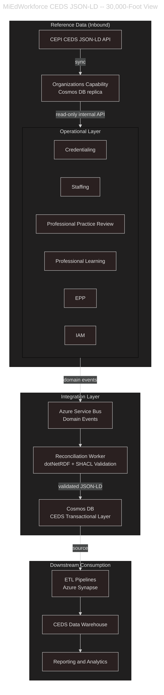
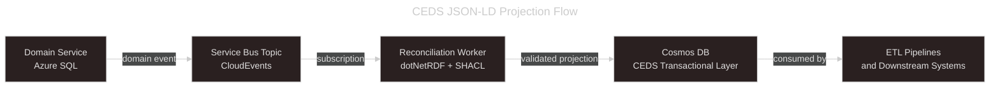

# CEDS JSON-LD Data Integration

## Purpose

This document defines MiEdWorkforce's approach to CEDS JSON-LD integration. It establishes where CEDS JSON-LD adds value, where it does not, and how we fulfill contractual commitments to CEDS JSON-LD while protecting the operational integrity of a production-grade, public-facing web application.

---

## Background and Context

The MiEdWorkforce contract commits to CEDS as an education data standard and references CEDS JSON-LD as a schema format for data interoperability, particularly in relation to Cosmos DB. The contract also explicitly acknowledges that CEDS JSON-LD is currently unreleased, untested, and unproven as a web application backend technology, and that most states including Michigan will likely focus on using CEDS JSON-LD in data lake solutions rather than operational web applications.

MiEdWorkforce is a critical, public-facing application managing educator credentialing, employment, background checks, and compliance. This places strong operational requirements on data integrity, transactional consistency, and query performance that must be weighed carefully against the adoption of an emerging and evolving standard.

Michigan maintains a CEDS Cosmos DB store as the authoritative integration target for CEDS JSON-LD data. MiEdWorkforce projects CEDS JSON-LD representations of its domain data into this shared store, from which Michigan's own ETL pipelines and downstream reporting infrastructure consume. MiEdWorkforce is not responsible for what happens downstream of that store.

---

## Guiding Principle: Integration Concern, Not Operational Concern

CEDS JSON-LD is an integration and interoperability concern for MiEdWorkforce, not an operational data storage concern.

MiEdWorkforce domain services own their data in Azure SQL databases with strongly-typed schemas, referential integrity, and ACID transactional guarantees. CEDS JSON-LD representations of that data are produced and consumed at system boundaries -- as published views for downstream platforms, as inbound reference data from upstream systems, and as a shared vocabulary for cross-system interchange.

This distinction is not a workaround or a deferral. It is the architecturally sound application of CEDS JSON-LD for the problem at hand, consistent with how the broader CEDS community anticipates the format will be used in practice.

The following diagram illustrates this at a high level. Operational domain services remain authoritative. The CEDS Transactional Layer in Cosmos DB is a downstream projection of that state, fed asynchronously and consumed by ETL pipelines and reporting infrastructure.

---

## Integration Patterns

### Pattern 1: Consuming CEDS JSON-LD from Upstream Systems

MiEdWorkforce consumes CEDS JSON-LD data from external systems that publish in this format, most notably the CEPI CEDS JSON-LD API for educational organization reference data.

This is handled by the Organizations capability, which maintains a locally replicated, CEDS-aligned replica of organization records. The capability absorbs the sync complexity and exposes a low-latency, read-optimized internal API. No domain service integrates directly with upstream CEDS sources at runtime.

Inbound CEDS JSON-LD data from upstream systems is a natural fit for Cosmos DB storage within the Organizations capability. The flexible document model accommodates the JSON-LD structure without requiring a fixed relational schema, and the data is read-heavy with no transactional write requirements from MiEdWorkforce's perspective.

### Pattern 2: Publishing Domain Events as CEDS JSON-LD

Domain services publish events to Azure Service Bus topics using CloudEvents schema. A dedicated reconciliation worker subscribes to relevant domain events and projects state changes into CEDS JSON-LD representations, writing them to the Cosmos DB CEDS Transactional Layer.

This worker is a projection, not a source of truth. The authoritative state for all MiEdWorkforce-owned data lives in the domain SQL databases. If the projection layer is unavailable or behind, MiEdWorkforce continues operating normally. In any conflict, the SQL domain model is authoritative.

SHACL validation via dotNetRDF's ShaclValidator is applied within the reconciliation worker before writing to Cosmos DB, ensuring that projected records conform to CEDS JSON-LD shape constraints. This is the appropriate boundary for SHACL enforcement -- validating outbound data as it crosses into the shared data ecosystem, rather than as a runtime constraint on operational transactions.

### Pattern 3: Selective Native JSON-LD Storage

In limited cases, it may be appropriate to store data natively in CEDS JSON-LD format within Cosmos DB rather than projecting from a relational source. These cases share common characteristics: the data is read-heavy, rarely mutated, does not participate in multi-step workflows, and does not require relational integrity constraints.

Good candidates include catalog and reference data such as program definitions, endorsement types, and credential type metadata; inbound staging areas for externally-sourced CEDS data awaiting processing; and audit logs or immutable event records where a flexible schema is an advantage.

Poor candidates include any data with state machine transitions such as credential status, application workflow, or clearance determinations; any data with referential integrity requirements across domains; any data that is queried relationally under operational load; and any data that participates in payment, compliance, or legal record-keeping workflows.

The decision to store natively in Cosmos DB as JSON-LD requires deliberate review against these criteria and is not a default.

---

## Technology Commitments

| Technology | Role in MiEdWorkforce | Scope |
|---|---|---|
| Azure SQL Database | Primary operational data store for all domain services | All transactional, relational, and workflow data |
| Azure Cosmos DB | CEDS Transactional Layer projection store and upstream reference data replica | Integration boundary, reference data, selective catalog data |
| Newtonsoft.Json | JSON serialization throughout; JSON-LD document handling | Application-wide |
| dotNetRDF | RDF and JSON-LD parsing and serialization in reconciliation worker | Reconciliation worker and integration layer |
| dotNetRDF ShaclValidator | SHACL validation of outbound CEDS JSON-LD projections | Reconciliation worker at system boundary |
| Azure Service Bus | Domain event transport feeding the reconciliation worker | Application-wide event infrastructure |

---

## Cosmos DB Design Considerations

Where Cosmos DB is used, the following design concerns apply and must be addressed per use case.

**Container and partition key design** must be driven by query access patterns, not by the JSON-LD document structure alone. Partition keys should reflect how data will be retrieved at volume, typically by organization identifier, educator identifier, or a domain-specific aggregate root identifier.

**Denormalization** is expected and appropriate in Cosmos DB containers. Data that would be normalized across tables in SQL may be embedded within documents. This is a conscious tradeoff: it improves read performance but requires careful handling of updates when shared data changes.

**Consistency level** should be set conservatively. For CEDS JSON-LD projection containers consumed by downstream pipelines, Session consistency is the appropriate default. Strong consistency is unnecessary given the projection pattern and imposes throughput costs.

**Schema evolution** must be treated as a first-class concern given that CEDS JSON-LD is an actively evolving standard. Document versioning and backward-compatible schema changes should be designed in from the start, not retrofitted.

---

## SHACL and Validation Strategy

SHACL shapes serve as validation rules at the integration boundary, not as the internal API contract for operational services.

MiEdWorkforce's internal and external REST APIs use conventional JSON with OpenAPI schemas as their contract. SHACL is not the API contract. The reconciliation worker validates projected CEDS JSON-LD documents against applicable SHACL shapes before writing to Cosmos DB. Validation failures are logged, routed to a dead letter mechanism, and do not affect operational service behavior.

As CEDS JSON-LD SHACL shapes evolve -- and they will, given the standard is actively under development -- shape updates are isolated to the reconciliation worker and do not require changes to domain services. This isolation is a deliberate design choice given the immaturity and expected rate of change of the standard.

---

## What This Approach Does Not Include

To be explicit about scope boundaries:

- Operational domain APIs will not be redesigned around SHACL shapes or JSON-LD response formats.
- Cosmos DB will not serve as the primary transactional store for any workflow-bearing domain.
- Domain services will not read from the CEDS JSON-LD projection at runtime. The projection is a downstream output, not a shared operational store.
- CEDS JSON-LD integration is not deferred. It is a real and funded part of the architecture at the integration layer, implemented through the patterns described above.
