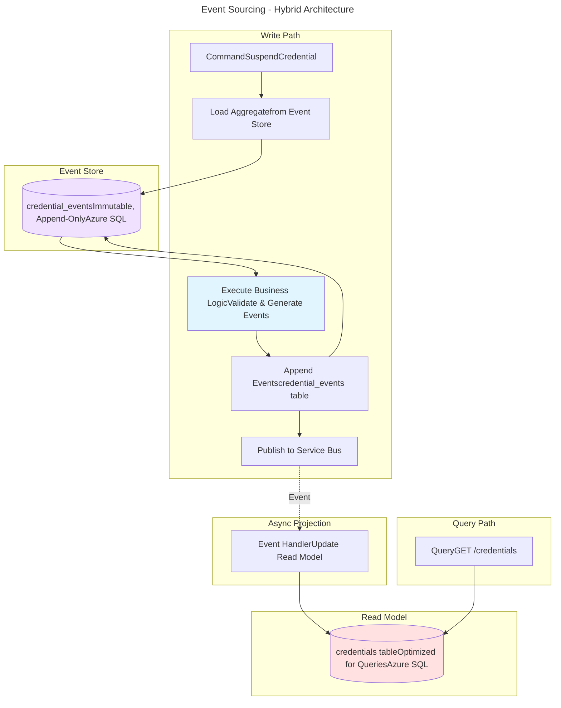

## Event Sourcing for Critical Aggregates

### Overview

Event sourcing provides complete, immutable audit trails for business-critical aggregates where legal compliance, regulatory requirements, or operational accountability demand:
- Complete historical state reconstruction (time-travel queries)
- Tamper-proof evidence of all state changes
- Auditability of who changed what, when, and why
- 7+ year retention with cryptographic verification

**Event sourcing is NOT a general-purpose persistence strategy.** It adds complexity and should be used selectively for high-value aggregates with strict audit requirements.

---

### When to Use Event Sourcing

**Use event sourcing for aggregates where:**
- Legal disputes may require proving historical state years later
- Regulatory compliance demands tamper-proof audit trails (7+ year retention)
- Time-travel queries are needed ("what was the credential status on date X?")
- Complete history of state changes has business value beyond current state
- Aggregates have clear boundaries and well-defined state transitions

**Do NOT use event sourcing for:**
- Reference data (organization hierarchy, certificate types, fee schedules)
- Transient data (cache entries, user sessions, temporary uploads)
- High-churn data without audit requirements (UI preferences, draft forms)
- Simple CRUD operations where current state is sufficient

---

### Event-Sourced Domains

Event sourcing is required for the following critical aggregates:

#### **Credentialing Domain**
- **Credential** - Issuance, suspensions, reinstatements, revocations, expirations
- **CredentialApplication** - Submission, approvals, denials, withdrawals

**Rationale:** Legal disputes over credential decisions, 7-year regulatory retention, time-travel compliance audits

#### **Professional Practice Review Domain**
- **Disclosure** - Submission, status changes, worklist routing, resolution
- **EducatorPPRStatus** - Account marker changes (Mandatory Hold, Enhanced Monitoring, Re-Review)

**Rationale:** Employment eligibility disputes, clearance assessment defensibility, prove historical context

**Critical Requirement:** When PPR clearance assessment is performed, capture snapshot of all inputs (disclosures, markers), version of clearance logic used, and assessment outputs.

#### **Payments Domain**
- **PaymentTransaction** - Initiation, confirmation, reconciliation, disputes
- **RefundRequest** - Submission, dual approvals, execution

**Rationale:** Financial compliance, dispute resolution, reconciliation audit trail

**Note:** Payments domain currently uses SQL Server temporal tables. Consider enhancing with event sourcing for richer audit metadata (causal chains, user justifications).

#### **IAM Domain**
- **Authorization** - Grants, expirations, revocations
- **ImpersonationSession** - Start, actions performed, end

**Rationale:** Security incident investigation, access control auditing, impersonation accountability

---

### Architecture Pattern

Event sourcing uses a **hybrid architecture**: event store for writes, read models for queries.


**Key Components:**

1. **Event Store** (Azure SQL, append-only table)
   - Stores all state changes as immutable events
   - Cryptographic hash chain for tamper detection
   - Optimized for sequential writes and time-range queries

2. **Aggregate** (In-memory domain model)
   - Loaded by replaying events from event store
   - Validates business rules before generating new events
   - Never persisted directly - only events are stored

3. **Read Model** (Azure SQL, traditional table)
   - Optimized for queries (indexes, denormalization, JOINs)
   - Updated asynchronously by event projections
   - Eventually consistent (milliseconds behind event store)

4. **Projections** (Event handlers)
   - Listen to Service Bus events
   - Update read models when events published
   - Idempotent (can safely replay events)

---

### Event Store Schema

**Storage:** Azure SQL Database (append-only tables per aggregate type)

**Rationale:** ACID transactions, strong consistency, temporal queries, familiar tooling

**Pattern:**
```sql
CREATE TABLE {aggregate}_events (
    event_id UNIQUEIDENTIFIER PRIMARY KEY DEFAULT NEWID(),
    aggregate_id UNIQUEIDENTIFIER NOT NULL,
    event_type VARCHAR(200) NOT NULL,
    event_timestamp DATETIME2(7) NOT NULL DEFAULT SYSUTCDATETIME(),
    event_version INT NOT NULL,  -- Optimistic concurrency
    event_payload NVARCHAR(MAX) NOT NULL,  -- JSON
    
    -- Audit metadata
    caused_by_user_id UNIQUEIDENTIFIER NULL,
    caused_by_event_id UNIQUEIDENTIFIER NULL,  -- Causal chain
    correlation_id UNIQUEIDENTIFIER NULL,  -- Distributed tracing
    
    -- Tamper detection (hash chain)
    event_hash AS HASHBYTES('SHA2_256', 
        CONCAT(event_id, event_type, event_timestamp, event_payload)
    ) PERSISTED,
    previous_event_hash VARBINARY(32) NULL,
    
    INDEX IX_aggregate_id_version NONCLUSTERED (aggregate_id, event_version)
);

-- Prevent updates/deletes (immutable)
CREATE TRIGGER TR_{aggregate}_events_immutable
ON {aggregate}_events
INSTEAD OF UPDATE, DELETE
AS BEGIN
    RAISERROR('Event store is append-only. Updates and deletes are not allowed.', 16, 1);
    ROLLBACK TRANSACTION;
END;
```

**Cryptographic Verification:**
- Each event's hash: `SHA256(event_id + event_type + timestamp + payload)`
- Chain events via `previous_event_hash` (detects tampering or gaps)
- Verify hash chain integrity during compliance audits

---

### Time-Travel Queries

Reconstruct aggregate state at any point in time by replaying events:
```csharp
public async Task GetCredentialAtPointInTime(
    Guid credentialId, 
    DateTime asOfDate)
{
    // Load events up to specified date
    var events = await _eventStore.LoadEventsAsync(
        aggregateId: credentialId,
        upTo: asOfDate
    );
    
    // Replay events to reconstruct historical state
    var aggregate = new CredentialAggregate();
    foreach (var evt in events)
    {
        aggregate.Apply(evt);
    }
    
    return aggregate;  // State as of asOfDate
}
```

**Use Cases:**
- Legal discovery: "What was the credential status on June 15, 2025?"
- Compliance audits: "Show all credentials suspended during Q2 2026"
- Root cause analysis: "Why was this credential revoked? Show the event sequence."

---

### Data Retention

| Storage Tier | Retention           | Purpose                                                | Technology                  |
| ------------ | ------------------- | ------------------------------------------------------ | --------------------------- |
| **Hot**      | 2 years             | Operational queries, time-travel within recent history | Azure SQL                   |
| **Cold**     | 2-7 years           | Compliance retention, rarely accessed                  | Blob Storage (Archive tier) |
| **Archive**  | 7+ years (optional) | Legal discovery, indefinite retention                  | Azure Data Lake             |

**Archival Process:**
- Monthly batch job exports events >2 years old to Blob Storage
- Hash chain preserved in archive for tamper detection
- Events remain queryable but with slower retrieval (4-hour rehydration)

---

### Performance Characteristics

**Write Path:**
- Event append: ~10-20ms (clustered index on sequential GUID)
- Projection update: Async, doesn't block command response
- **Total command latency: ~50ms** (comparable to traditional CRUD)

**Read Path:**
- Query read model: ~5-20ms (same as traditional queries)
- Time-travel query: ~500ms-2s (event replay, acceptable for audits)

**Optimizations:**
- **Snapshots** (future): Periodically store aggregate state to reduce replay cost for large event streams
- **Caching:** Cache frequently accessed aggregates in Redis
- **Batching:** Batch projection updates for bulk operations

---

### Relationship to Other Audit Layers

Event sourcing is the deepest audit layer, reserved for the most critical aggregates. It complements but does not replace:

1. **Application Logs** (OTel -> Azure Monitor): API requests, performance, errors (90 days)
2. **API Audit Trail** (SQL): Who called what API, when (7 years)
3. **Domain Event Log** (Service Bus -> SQL): All business events across domains (7 years)
4. **Event Sourcing** (SQL Event Store): Complete state history for critical aggregates (indefinite)

Each layer serves a distinct purpose. Use the appropriate layer for each audit requirement.

---

### Implementation Guidance

Event sourcing implementation details (repository patterns, aggregate base classes, projection handlers, hash verification) are maintained in domain-specific documentation.

Shared infrastructure (event store repository, base aggregate class, projection framework) is maintained in the platform layer and reused across domains.
