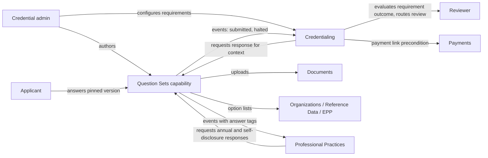

# Classification and Boundaries

## Platform capability or domain

Recommendation: **platform capability.**

| Test | Result |
|---|---|
| Does it contain business logic about what a process requires or why? | No. It collects and stores answers. What an answer means is the consumer's call. |
| Is it consumed by more than one core domain? | Yes, already: Credentialing (eligibility and permit questions), Professional Practices (annual PPR form, self-disclosure), Professional Learning (program evaluations). EPP has an unmodeled FDD 13 need. |
| Is it the system of record for a business outcome (an application, a disclosure, a credential)? | No. It is the system of record for the form definition and the response, never for the outcome. |
| Would a domain owner be surprised to see it change under them? | Only in how forms are authored and stored. The business meaning stays with them. |
| Is there existing documentation that assumes it? | Yes. Professional Learning lists "Question Set framework (cross-cutting capability)" as out of scope and calls `GET /question-sets?domain=proflearning`. PPR's `PPRQuestionConfiguration` says configuration "may be owned by a forms/configuration capability that serves multiple domains" and the decision is pending. `design/CONVENTIONS.md` reserves `qset:` as a stub context. |

Why not a domain: a domain would invite the requirement-evaluation and review-routing behavior from the POC to accrete inside it, and it would then compete with Credentialing for ownership of "what does this application need". Keeping it a capability keeps that logic where the business rules and the permission model for it already live.

The classification rationale to carry into the capability doc mirrors Documents: it provides the how and where for asking questions, not the what and why.

## Ownership boundary

| Concern | Question Sets | Consuming domain | Other capability |
|---|---|---|---|
| Question set definition, versions, effective dates | Owns | Chooses which set to use | |
| Branching, validation, halt-with-message, option lists, prefill bindings | Owns | | |
| Answer capture, response storage, response version pin | Owns | | |
| File storage, scanning, retention for upload answers | Requests uploads | | Documents owns storage |
| Option data (universities, districts, programs) | Defines the list and provider contract | Supplies filter context | Organizations, Reference Data, EPP supply data |
| Which requirement triggers which question set | | Owns | |
| Whether an unmet requirement blocks, follows up, or goes to review | | Owns | |
| Meaning of a halted response for the application | | Owns | |
| Reviewer routing and specialist queues | | Owns (existing worklist pattern) | |
| Payment timing relative to review | | Owns (precondition on payment link) | Payments owns the transaction |
| Universal rules such as PPR holds and blocks | | Owns (PPR clearance check) | Never routed only through a question set |
| Notifications about outcomes | Publishes events | Publishes its own domain events | Communications sends |
| Report catalog entry for response analytics | | | Reporting |

## Decisions needed

### Decision 1: Platform capability (recommended) vs domain

Recommended as above. If you prefer a domain, the doc set is nearly the same; the change is the Type header, the classification rationale, and that the capability-first permission naming (`questionsets.<domain>-...`) would become domain-first.

### Decision 2: Where requirement evaluation lives

The POC's "rules engine in miniature" (typed requirements, each mapped to a data source, each with an unmet outcome) is not a question set concern. There are three options:

| Option | Description | Trade-off |
|---|---|---|
| A. Keep inside Credentialing (recommended for now) | Credentialing owns a registry of requirement types, each with a code-side evaluator and a configurable parameter set. The unmet outcome and question set link are fields on the requirement. | Smallest change. Matches existing `RequirementRule` (`rule_type` plus `rule_configuration`). Other domains with similar needs (Staffing validations, EPP recommendation rules) stay separate for now. |
| B. Separate Eligibility / Requirements capability | A second platform capability that Credentialing, EPP and Staffing call. | Right if Staffing's validation engine and FDD 4.2 BRM are genuinely the same thing. Premature before the BRM spike (DESIGN-SPIKES item 1) is resolved. |
| C. One combined Question Set plus Rules capability | Fold evaluation into the same capability. | Rejected. It recreates the domain-creep risk and conflicts with the configuration principle against encoding business logic as settings. |

The capability draft is written so that A or B works without changing it: Question Sets never evaluates requirements, it only returns a response and, if configured, a halt.

### Decision 3: Who authors question sets

FDD 4.1.2 says admins maintain existing question sets and new structures are developer work, while the POC lets admins build new sets and branches freely. The capability draft supports admin authoring (it is the stated direction and the POs liked it) with bounded complexity (depth cap, no free-form logic) so that the labor split question becomes a permission question rather than an architecture one: the create and publish permissions can be granted narrowly or widely. This also resolves the FDD 09 discrepancy about who manages PPR questions by making it a role assignment on a scoped permission.

## How the pieces fit

## Vocabulary decisions

| Term | Decision | Reason |
|---|---|---|
| Question Set | Keep | Client and FDD term |
| Option List | Use instead of "dataset" | Reporting uses "dataset" for Power BI |
| Halt (outcome) | Use instead of "block" for an answer that ends the form | "Blocked" is already a credential application state tied to PPR |
| Follow-up (question) | Keep | POC and FDD term for a branch question |
| Follow-up (requirement outcome) | Call it "unmet outcome: follow-up" in Credentialing docs | Avoid mixing with branch questions |
| Worklist | Do not use for question set queues | `solution-architecture.md` reserves the word for a UI pattern with no capability of its own. Use "outstanding question sets" for the applicant list |
| Response | Use for a captured set of answers | PPR already has `ProfessionalPracticeResponse`; keep names distinct by always saying "Question Set Response" in cross-domain text |
