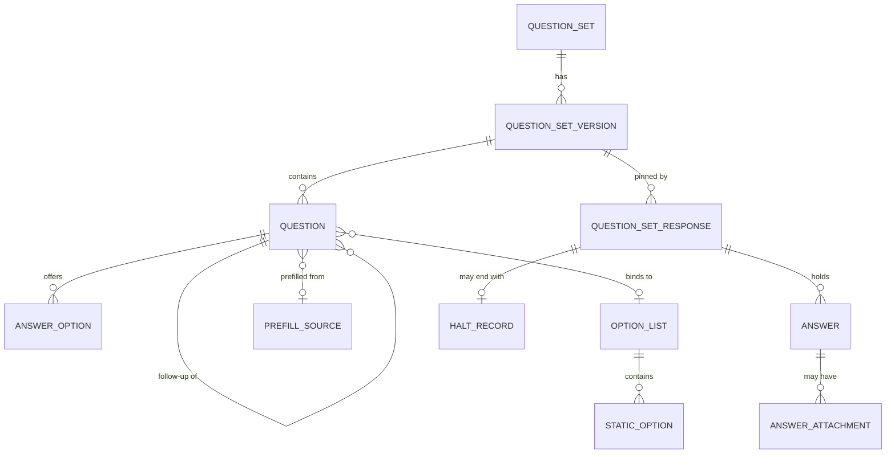

# Question Sets

- **Type:** Platform Capability
- **Identifier:** questionsets
- **Display Name:** Question Sets
- **Primary Sources:** FDD/BRD 4.1 (Question Sets), 5 (credentialing admin Question Set management), 9 (Professional Practices disclosure questions), 13 (EPP Question Sets), 14 and 26 to 28 (Professional Learning evaluations), 29 (credential application questions); Question Set POC (2026-09 PO walkthroughs); `solution-level/features/feature-question-sets.md`

**Status:** Draft staged 2026-10-05. Not yet merged.

---

## Purpose

The Question Sets platform capability provides configurable, versioned, branching forms and the storage of the answers people give to them. Business domains use it whenever a process needs to ask a person structured questions, for example the follow-up questions on a credential application, the annual Professional Practices form, or a program evaluation. Administrators author and version question sets without developer involvement; applicants and other respondents answer a pinned version; consuming domains read the response and decide what it means.

---

## Classification Rationale

**Platform Capability.** Question Sets is the how and where of asking questions. It does not contain the business logic about which questions a credential requires, what an unmet requirement means, who reviews a response, or whether a disclosure becomes a PPR case. Several core domains depend on it (Credentialing, Professional Practices, Professional Learning, and potentially EPP). It is the system of record for form definitions and responses but never for the business outcome those responses feed. This mirrors the classification of Documents.

---

## Scope

**This capability owns:**
- Question set definitions: questions, answer options, follow-up branches, validation, descriptive text
- Question set versioning: drafts, publish with effective date, scheduled versions, version history, version comparison, optimistic conflict detection
- Branching evaluation (which questions are visible given the answers so far) and display numbering
- Halt outcomes: an answer that ends the form with an admin-authored title, message and next steps
- Option lists: definition, source (static or provider), optional "other" entry, filter parameters
- Prefill bindings: which question can be prefilled from which registered prefill source, and the applicant's ability to override
- Answer validation: required, max length, text patterns, date constraints, accepted file types
- Responses: starting, saving partial answers, submitting, halting, superseding, with the question set version pinned at start
- Answer tags: consumer-defined metadata on answer options that is returned with the response
- Simulation: running a question set version read-only against a sample or target subject without persisting a response
- Orchestrating file upload answers through Documents
- Domain events for version publication and response submission and halt

**This capability does NOT own:**
- Which question set a business requirement uses, or when to ask it -> owned by the consuming domain (e.g. `credentialing`)
- What an unmet requirement, a halted response, or a particular answer means for the business process -> consuming domain
- Requirement evaluation (exam passed, experience met, and so on) -> `credentialing` (see decision on requirement evaluation)
- Reviewer routing, specialist queues, and any "worklist" -> consuming domain, per the worklist pattern in `solution-architecture.md`
- Payment sequencing relative to review -> `credentialing`, with `payments` owning the transaction
- Account-level PPR markers and clearance assessment -> `profpractice`
- File storage, malware scanning, retention, legal hold -> `documents`
- Source data for option lists (organizations, programs, reference codes) -> `organizations`, `refdata`, `epp`
- Identity, roles and authorization decisions -> `iam`
- Sending email or alerts about outcomes -> `communications`
- Power BI report hosting -> `reporting`
- Free-form business rule authoring or a general rules engine -> not in scope (Business Rule Management, FDD 4.2, is a separate decision)

---

## Ubiquitous Language

| Term | Definition |
|---|---|
| **Question Set** | A named, reusable form owned by one functional area (owning domain) that can be linked from business requirements or processes in that domain. Has a stable identifier across versions. |
| **Question Set Version** | An immutable snapshot of a question set once published. Starts as a draft. A published version has an effective date. |
| **Draft** | An editable, unpublished version forked from a base version. Several drafts may exist for one question set at once. |
| **Scheduled Version** | A published version whose effective date is in the future. Several may be queued. |
| **Current Version** | The published version with the latest effective date that is on or before the as-of date. Derived at read time, not stored. |
| **Question** | One prompt in a version. Has a stable `question_key` that persists across versions, a type, text, and settings. |
| **Question Type** | Yes/No, Single Choice, Text, Date, Number, File Upload. Text supports subtypes (email, phone, url) through patterns. |
| **Follow-up Question** | A question that is visible only when a parent question has a specific answer. May nest to a bounded depth. |
| **Answer Trigger** | The answer value on a parent question that makes its follow-up questions visible. |
| **Halt Outcome** | An answer configuration that ends the form when chosen, with a title, message and optional next steps. A halt does not itself block anything outside the form; the consuming domain decides what it means. |
| **Option List** | A reusable list of selectable values for choice questions, either static or supplied by a provider, optionally filtered by context and optionally allowing a custom "other" value. |
| **Option List Provider** | A registered source of option values (Organizations, Reference Data, EPP, and so on). |
| **Prefill Source** | A registered, named value about the respondent (for example years of experience, institution, email) that can pre-populate an answer as a suggestion the respondent can override. |
| **Response** | The captured answers of one respondent to one question set version in one consumer context. |
| **Consumer Context** | The business entity a response is gathered for, identified by consuming domain, context type and context identifier (for example credentialing, application, application-id). Analogous to the Document Attachment in Documents. |
| **Subject** | The person whose answers are being gathered. Usually the signed-in user; may differ when staff answer on someone's behalf. |
| **Answer Tag** | An opaque consumer-defined key/value attached to an answer option (for example `creates-disclosure`) that is returned with the response so the consumer can act without hardcoding question identifiers. |
| **Simulation** | A read-only run of a version against a sample subject or a target subject. Nothing is persisted and no event is published. |
| **Outstanding Question Set** | A question set a consumer has asked for in a context that has no submitted response yet. Not called a worklist. |

---

## Domain Model

### Core Aggregates

#### QuestionSet

**Root Entity:** QuestionSet

**Purpose:** Holds the stable identity of a form and the history of its versions, and enforces the draft, publish and effective-date rules.

**Entities & Value Objects:**
- **QuestionSet** (root) - identifier, name, description, owning domain (functional area), status
- **QuestionSetVersion** - version number, lifecycle state, effective date, base version, author, note, change summary
- **Question** - `question_key`, type, text, description (restricted markdown), required flag, display order, parent question key and answer trigger when a follow-up
- **QuestionValidation** - max length, pattern preset or custom pattern, date constraint (any, before today, after today), number range, accepted file types, max file size reference
- **AnswerOption** - value, label, halt outcome (optional), answer tags (optional), ordering
- **HaltOutcome** - title, message, next steps
- **OptionListBinding** - reference to an Option List, filter parameters, allow-other flag
- **PrefillBinding** - reference to a Prefill Source, and the rule that the respondent may override
- **UploadBinding** - Documents category slug used for the upload

**Key Invariants:**
- A published version is immutable
- Only drafts can be edited or discarded
- A question's `question_key` is unique within a version and stable across versions of the same question set
- A follow-up question must reference a parent question in the same version, and the trigger must be a valid answer of the parent
- Follow-up depth may not exceed the configured maximum (default 5)
- A halt outcome may be attached only to Yes/No and Single Choice answer options
- A File Upload question must have an upload binding with a valid Documents category
- A custom text pattern must compile and pass a safety check at publish time
- Effective date of a published version may not be in the past (except system seed data)
- A version cannot be deleted once any response references it; a scheduled version may be cancelled
- Publishing a draft whose base version is no longer the current version raises a conflict that must be acknowledged

**Key States (version):** `Draft`, `Scheduled`, `Published`, `Superseded`. Only `Draft` is stored as such. `Scheduled`, `Published` and `Superseded` are derived from effective dates and the as-of date.

---

#### OptionList

**Root Entity:** OptionList

**Purpose:** Defines a reusable set of selectable values and where they come from.

**Entities & Value Objects:**
- **OptionList** (root) - identifier, label, source type (`Static` or `Provider`), provider key and parameters, allow-other default
- **StaticOption** - value, label, order (for static lists)
- **ProviderBinding** - provider key, required context parameters (for example credential type, subject enrollment)

**Key Invariants:**
- Option value is stable; label may change
- A provider-backed list is never copied into a response definition; the response stores the selected value and label at answer time
- A list used by a published version cannot be deleted

---

#### PrefillSource

**Root Entity:** PrefillSource

**Purpose:** Registry entry naming a value that can prefill an answer.

**Entities & Value Objects:**
- **PrefillSource** (root) - key, label, value type, origin (owning domain or system), resolution mode (`ConsumerSupplied` or `Provider`)

**Key Invariants:**
- Keys are stable and registered through change control, since a binding names a key
- A prefill value is only ever a suggestion; the stored answer is what the respondent submitted
- Prefill values are recorded with provenance on the response (source key and time resolved)

---

#### QuestionSetResponse

**Root Entity:** QuestionSetResponse

**Purpose:** Captures one respondent's answers to one pinned version in one consumer context.

**Entities & Value Objects:**
- **QuestionSetResponse** (root) - subject, consumer context, question set and version, status, started and submitted timestamps
- **Answer** - `question_key`, value, selected label for choice answers, prefilled-from provenance, tags copied from the chosen option
- **AnswerAttachment** - `question_key`, Documents `document_id`
- **HaltRecord** - question key, answer, title and message shown, timestamp
- **VisiblePath** - computed list of question keys visible for the stored answers

**Key Invariants:**
- The version is pinned when the response is created and never changes
- Only one non-superseded response exists per (consumer context, question set); a request for an existing one returns it
- Answers may be stored only for questions visible on the current path
- A submitted response is immutable; a change requires a new response that supersedes the old one
- A halted response cannot be submitted
- A required visible question without an answer prevents submit
- File answers must reference a Documents record in status `Available`

**Key States:** `InProgress`, `Halted`, `Submitted`, `Superseded`, `Cancelled`

---

### Entity Relationship Diagram

---

## Domain Events

| Event | Aggregate | Trigger | Payload Highlights | Consumers |
|---|---|---|---|---|
| `QuestionSetVersionPublished` | QuestionSet | A draft is published (immediate or scheduled) | questionSetId, versionId, effectiveFrom, owningDomain, changeSummary | Audit, consuming domain (cache invalidation) |
| `QuestionSetVersionCancelled` | QuestionSet | A scheduled version is cancelled | questionSetId, versionId | Audit, consuming domain |
| `QuestionSetResponseSubmitted` | QuestionSetResponse | Respondent submits | responseId, questionSetId, versionId, consumerContext, subjectId, answerTags present (keys only, no answer text) | Consuming domain, Audit |
| `QuestionSetResponseHalted` | QuestionSetResponse | An answer with a halt outcome is given | responseId, questionSetId, versionId, consumerContext, subjectId, haltQuestionKey | Consuming domain, Audit |
| `QuestionSetResponseSuperseded` | QuestionSetResponse | A new response replaces a submitted one | oldResponseId, newResponseId, consumerContext | Consuming domain, Audit |

**Event Naming Convention:** PastTense+Noun+Action, per template. Events never carry free-text answers, since answers can contain sensitive disclosures. Consumers fetch the response through the API.

**Published To:** Azure Service Bus. The topic naming convention is inconsistent across existing docs (a shared `miedworkforce-domain-events` topic in Documents, Payments and Communications; a per-domain `<domain>-events` topic in Organizations and in `solution-architecture.md`). This draft follows the per-domain convention (`questionsets-events`) pending a solution-level decision; see tracking proposals.

---

## Dependencies

### Upstream (We Consume From)

| Source | What | How We Get It | Notes |
|---|---|---|---|
| `iam` | Authenticated identity, roles, scopes | Token claims; permission checks | Subject identity is the signed-in user |
| `documents` | Upload orchestration for File Upload answers | REST, canonical Domain API pattern | Category per owning domain; attachment type `question-set-response` |
| `organizations` | Option values for organization-type lists (districts, institutions) | REST `GET /organizations/search`, 60 minute cache | Per Organizations' cache guidance |
| `refdata` | Static reference lists (states, degree majors, exam test names) | REST or seeded static lists | `refdata` is currently a stub |
| `epp` | Program lists filtered by enrollment, EPP approved endorsements | REST, with subject context | Provider contract, see technical design |
| Consuming domains | Prefill values and filter context | Supplied by the consumer when requesting the response, or via a registered provider | Prefer consumer supplied to avoid coupling |

### Downstream (Others Consume From Us)

| Consumer | What | How They Get It | Notes |
|---|---|---|---|
| `credentialing` | Eligibility, permit, renewal and endorsement question sets; responses on applications | API and events | Primary consumer |
| `profpractice` | Annual PPR and self-disclosure forms; answer tags to create disclosures | API and events | Replaces `PPRQuestionConfiguration` |
| `proflearning` | Program evaluation question sets referenced by `EvaluationTemplate` | API | Replaces the "out of scope" assumption |
| `epp` | Possible FDD 13 question sets; reads of applicant acknowledgements | API | Not yet modeled |
| `communications` | Triggers via consumer events, not directly | Events | See Communications recommendations |
| `audit` | Version publication and response submission trail | Events | |
| `reporting` | Response analytics via Power BI catalog entry | Synapse / data warehouse | Reporting hosts the report only |

---

## Business Rules

### Rule: Single Current Version
**Rule:** For a given question set and as-of date, exactly one published version is current, the latest whose effective date has arrived. Earlier versions are superseded. Later ones are scheduled.
**Rationale:** FDD 4.1 asks for single-active-version enforcement with archived history. Deriving the state avoids a job that flips statuses and allows multiple future changes (for example one effective 6/30 and another 7/1).
**Enforced By:** QuestionSet aggregate, version resolution at read time.
**Example:** A version effective 2026-07-01 and a version effective 2026-06-30: on 2026-06-30 the first is still scheduled and the second is current; on 2026-07-01 the first becomes current.

### Rule: Responses Pin a Version
**Rule:** A response is bound to the version that was current when the response was created. A later publication never changes how a past response reads or is displayed.
**Rationale:** Auditability; matches the credentialing rule that applications use the definition version active at submission.
**Enforced By:** QuestionSetResponse aggregate.

### Rule: Published Versions Are Immutable
**Rule:** Edits happen only in drafts. Publishing creates a new immutable version.
**Rationale:** Comparison, audit and response rendering all depend on stable versions.
**Enforced By:** QuestionSet aggregate.

### Rule: Stable Question Keys
**Rule:** A question keeps its `question_key` across versions. Wording changes keep the key; a materially different question gets a new key.
**Rationale:** Diff, response analytics and consumer integrations all key on it. Matches `question_key` in the credentialing and PPR models.
**Enforced By:** Authoring service on draft creation and publish validation.

### Rule: Halt Is Form-Level Only
**Rule:** A halt outcome ends the form and records a halt. It does not change any business entity. The consuming domain subscribes to `QuestionSetResponseHalted` or reads the response and decides what to do.
**Rationale:** Keeps business meaning in the consumer and avoids confusion with the Blocked application state used for PPR.
**Enforced By:** QuestionSetResponse aggregate; consumer.

### Rule: One Response Per Context and Question Set
**Rule:** When a consumer asks for a response for a context and a question set that already has a non-superseded response, the existing response is returned.
**Rationale:** Applicants applying for a certificate and two endorsements that share a follow-up question set answer it once.
**Enforced By:** Response creation API (idempotent).

### Rule: Bounded Branching
**Rule:** Branching is declarative: an answer value makes listed follow-up questions visible. No expressions, no cross-question conditions, no computed values. Depth cap applies.
**Rationale:** `patterns-and-principles/configuration.md` warns against business logic encoded as settings. Bounded declarative branching can be fully covered by automated tests.
**Enforced By:** Publish validation.

### Rule: Option Lists Snapshot at Answer Time
**Rule:** A choice answer stores the selected value and its label as shown. Later changes to the option list do not alter stored answers.
**Rationale:** Provider data changes (for example a renamed university) must not rewrite history.
**Enforced By:** Answer entity.

### Rule: Prefill Is Advisory
**Rule:** A prefilled value is shown as a suggestion and may be overridden. The stored answer is the submitted value, with provenance noting what was suggested.
**Rationale:** Keeps respondents accountable for what they submit and keeps the audit trail honest.
**Enforced By:** Answer entity, response UI.

### Rule: Simulation Never Persists
**Rule:** Simulation reads definitions and (for a target subject) resolves prefill and option context, but creates no response, uploads nothing, and publishes no event. Using a real target subject requires an additional permission and is audited.
**Rationale:** PO request for a test mode; privacy of real subjects.
**Enforced By:** Simulation endpoint.

### Rule: Sensitive Answers
**Rule:** Answer values are not written to logs, events or analytics streams. Access to a response is checked against the owning domain's reading permission and is audited.
**Rationale:** Responses include criminal history and disciplinary disclosures.
**Enforced By:** API layer, logging policy, Audit.

### Rule: Universal Rules Do Not Depend on Question Sets
**Rule:** Checks that must always apply (PPR clearance, account-level markers) are enforced by their owning domain independently of any question set outcome.
**Rationale:** Feature notes call for universal, non-configurable requirements.
**Enforced By:** Consuming domain.

---

## Workflows

Detailed flows are in [questionsets-sequences.md](./questionsets-sequences.md):

1. Author and Publish a Question Set Version
2. Compare Versions and Resolve a Publish Conflict
3. Simulate a Question Set
4. Gather Responses for a Consumer Context
5. Answer with a Halt Outcome
6. Review a Response (consumer reads)
7. Consumer Reacts to Answer Tags (PPR disclosure creation)
8. Supersede a Submitted Response

---

## Open Questions

Open questions live in the tracking files, not in this document. Proposed entries are staged in [../tracking-proposals.md](../tracking-proposals.md). The ones that affect this capability most:

- OQ-QS-01: Platform capability versus domain, and the BRM boundary (Decision 1 and 2)
- OQ-QS-02: Who authors new question set structures
- OQ-QS-03: Should halting responses be persisted or discarded
- OQ-QS-04: Prefill resolution, consumer supplied versus provider pull
- OQ-QS-05: Runtime API called directly by applicants or proxied through consumer APIs
- OQ-QS-06: Event topic convention (shared versus per-domain)
- OQ-QS-07: Documents category granularity and retention for upload answers
- OQ-QS-08: Response retention period and legal hold for disclosure responses
- OQ-QS-09: Migration of existing PPR question configuration

---

## References

- [Technical Design](./questionsets-technical-design.md)
- [Sequences](./questionsets-sequences.md)
- [Permissions](./questionsets-permissions.md)
- [API](./questionsets-api.yml)
- [Classification and boundaries](../01-classification-and-boundaries.md)
- [POC review](../00-poc-review.md)
- Existing: `solution-level/features/feature-question-sets.md`, `solution-areas/profpractice/profpractice-domain.md` (PPRQuestionConfiguration), `solution-areas/proflearning/proflearning-domain.md` (EvaluationTemplate)
