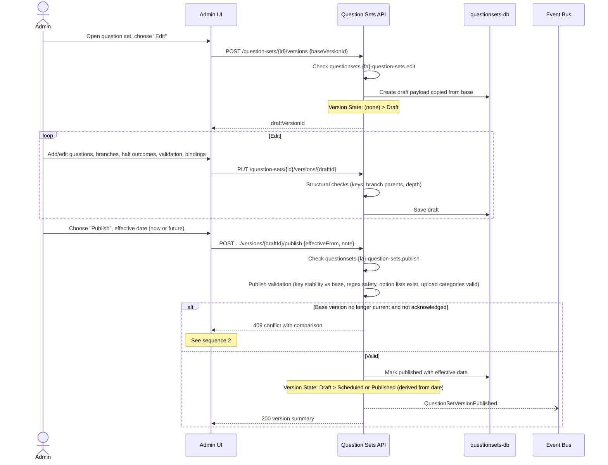
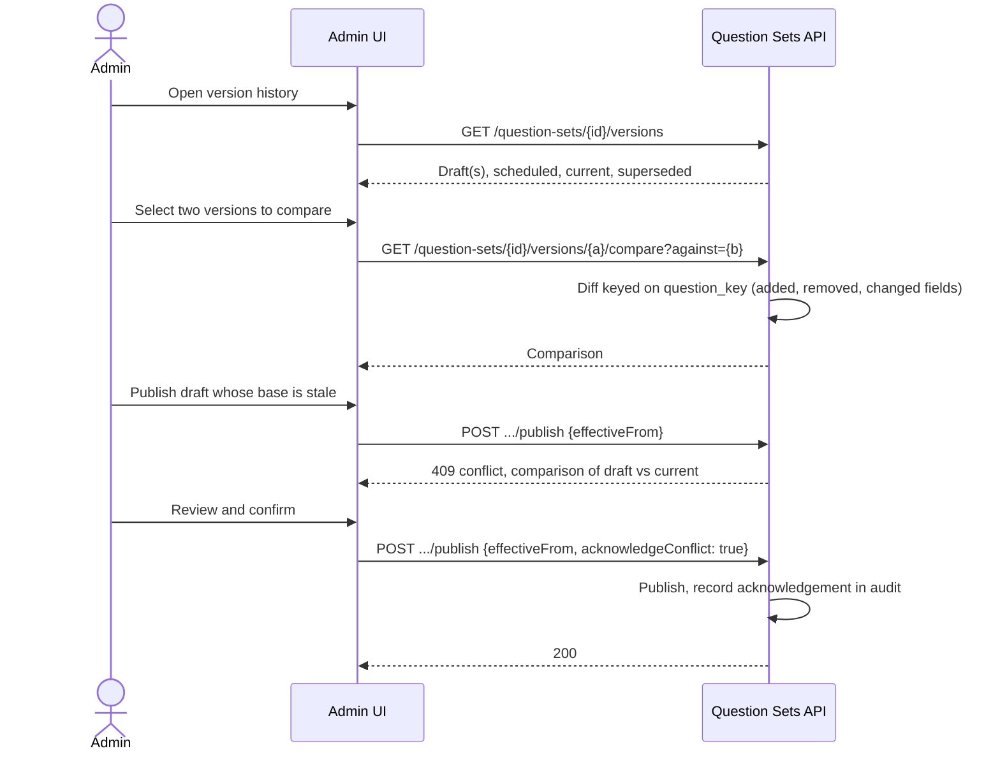
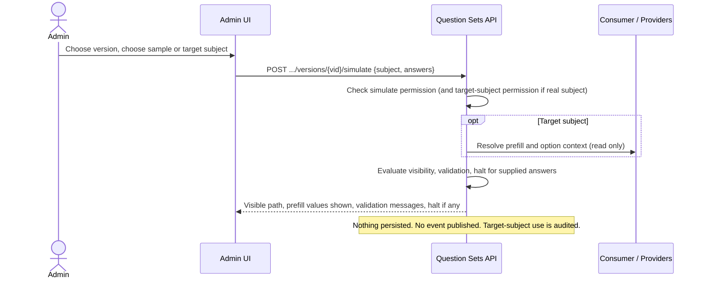

# Question Sets - Workflows & Sequences

**Domain:** Question Sets (Platform Capability)  
**Version:** 0.1 (draft)  
**Last Updated:** 2026-10-05

Conventions per `template-sequences.md`: solid arrows are synchronous calls, dashed are responses, `--)` is asynchronous. State changes are annotated with notes. Credentialing is used as the example consumer; Professional Practices is shown in sequence 7.

---

## 1. Question Sets - Author and Publish a Question Set Version

**Actors:** Credential admin (or any functional-area admin)  
**Initiated by:** user



**Key Decisions:**
- Multiple drafts may exist for one question set at once; multiple scheduled versions may queue.
- Version state is derived from effective date, so nothing flips at midnight.
- Publish validation fails on invalid custom regex, branch depth over the cap, missing option lists, duplicate option values, or an upload question without a valid Documents category.
- A question's key must not change between versions unless the question is intentionally replaced.

**State Changes:** Draft to Scheduled or Published (derived). Previous current version becomes Superseded once the new effective date arrives.

**Events Published:** `QuestionSetVersionPublished`

**Error Scenarios:**

| Failure | Behavior |
|---|---|
| Validation errors | 422 with list of problems keyed by `question_key` |
| Effective date in the past | 422 |
| Draft discarded while another user edits it | 404 on next save; UI shows message |
| Permission missing | 403 |

---

## 2. Question Sets - Compare Versions and Resolve a Publish Conflict

**Actors:** Admin  
**Initiated by:** user



**Key Decisions:**
- Compare is allowed between any two versions, not only against the live one.
- The conflict acknowledgement is recorded so it is clear who published over a newer change.

**Error Scenarios:** Comparing versions of different question sets returns 400.

---

## 3. Question Sets - Simulate a Question Set

**Actors:** Admin  
**Initiated by:** user



**Key Decisions:** Simulation reuses the real evaluator, so what authors see is what respondents get. File uploads are not simulated.

**Error Scenarios:** Target subject not visible to the caller returns 403 with no data.

---

## 4. Question Sets - Gather Responses for a Consumer Context

Example: a credential application where unmet requirements link to question sets.

**Actors:** Applicant, Credentialing  
**Initiated by:** user

```mermaid
sequenceDiagram
    actor Applicant
    participant UI as Applicant UI
    participant CRED as Credentialing API
    participant QS as Question Sets API
    participant DOC as Documents API
    participant Bus as Event Bus

    Applicant->>UI: Select credentials to apply for
    UI->>CRED: Evaluate requirements for selected credentials
    CRED->>CRED: Evaluate each applicable requirement (met / follow-up / blocked / review)
    CRED-->>UI: Result per requirement, list of distinct question set ids needed
    Applicant->>UI: Continue
    loop Each distinct question set
        CRED->>QS: POST /responses {context: credentialing/application/{id}, questionSetId, subject, prefill map, filter context}
        QS->>QS: Return existing response or create pinned to current version
        Note over QS: Response State: (none) > InProgress
        QS-->>CRED: responseId, pinned version
    end
    CRED-->>UI: Outstanding question sets with response ids

    loop Questions
        UI->>QS: GET /responses/{id}/form
        QS-->>UI: Pinned version, visible path, prefill suggestions, option values
        Applicant->>UI: Answer
        UI->>QS: PUT /responses/{id}/answers {answers}
        QS->>QS: Evaluate visibility, validate, check halt
        QS-->>UI: Updated visible path, validation messages
    end

    opt File upload question
        UI->>QS: POST /responses/{id}/uploads/request {questionKey, filename, size, mime}
        QS->>DOC: POST /documents/upload/request {category, attachment_type: question-set-response, attachment_id}
        DOC-->>QS: documentId, SAS upload URL
        QS-->>UI: Upload URL
        UI->>DOC: Upload file directly (scan runs)
    end

    Applicant->>UI: Submit question set
    UI->>QS: POST /responses/{id}/submit
    QS->>QS: Required visible questions answered, uploads Available
    Note over QS: Response State: InProgress > Submitted
    QS--)Bus: QuestionSetResponseSubmitted
    QS-->>UI: 200
    Bus--)CRED: QuestionSetResponseSubmitted
    CRED->>CRED: Record response reference on the application; re-evaluate requirement outcomes
```

**Key Decisions:**
- Credentialing decides which question sets are needed and creates the response; the applicant answers through the capability.
- One response per context and question set, so shared question sets are answered once.
- The response is pinned at creation to the current version.
- Prefill values come from Credentialing in the create call (ConsumerSupplied mode).
- Authorization for the applicant calls is Self-only on the subject.

**State Changes:** Response none to InProgress to Submitted.

**Events Published:** `QuestionSetResponseSubmitted`

**Error Scenarios:**

| Failure | Behavior |
|---|---|
| Required answer missing at submit | 422 listing question keys |
| Answer for a question not on the visible path | 422 |
| Upload not yet `Available` | 409, the client retries after scan completes |
| Pinned version no longer current | Allowed; response carries `pinnedVersionIsCurrent=false` and the consumer decides whether to restart |
| Subject mismatch | 403 |

---

## 5. Question Sets - Answer with a Halt Outcome

**Actors:** Applicant, Credentialing  
**Initiated by:** user

```mermaid
sequenceDiagram
    actor Applicant
    participant UI as Applicant UI
    participant QS as Question Sets API
    participant Bus as Event Bus
    participant CRED as Credentialing API

    Applicant->>UI: Chooses an answer configured to halt
    UI->>QS: PUT /responses/{id}/answers
    QS->>QS: Evaluate: answer has halt outcome
    Note over QS: Response State: InProgress > Halted
    QS--)Bus: QuestionSetResponseHalted
    QS-->>UI: Halt payload (title, message, next steps)
    UI-->>Applicant: Show admin-authored halt screen
    Bus--)CRED: QuestionSetResponseHalted
    CRED->>CRED: Apply consumer policy (application stays Draft, not submitted; note halt on the requirement)
```

**Key Decisions:**
- Halt is a form-level outcome. Whether the application is blocked, left in draft, or sent to review is Credentialing's decision.
- Default recommendation: the application stays in Draft; the response is retained as Halted so the applicant can return after resolving the issue (OQ-QS-03 decides whether to persist or discard).
- The halt message is stored as displayed, so a later wording change does not alter the record.

**State Changes:** Response InProgress to Halted.

**Events Published:** `QuestionSetResponseHalted`

**Error Scenarios:** Submit on a halted response returns 409.

---

## 6. Question Sets - Review a Response (consumer reads)

**Actors:** Credentials analyst or PPR specialist  
**Initiated by:** user

```mermaid
sequenceDiagram
    actor Reviewer
    participant UI as Review UI
    participant CRED as Credentialing API
    participant QS as Question Sets API
    participant DOC as Documents API

    Reviewer->>UI: Open application in review
    UI->>CRED: GET /applications/{id}
    CRED->>CRED: Check credentialing.application.view (scope)
    CRED-->>UI: Application, requirement outcomes, response references
    UI->>QS: GET /responses/{rid}
    QS->>QS: Check questionsets.credentialing-responses.view scope; write audit entry
    QS-->>UI: Questions as worded in the pinned version, answers, prefill provenance, attachments, halt record
    opt Attachment
        UI->>DOC: Download request (consumer permission)
    end
    UI-->>Reviewer: Answers shown beside underlying record (NASDTEC, CHRISS RapBack) from Credentialing
```

**Key Decisions:**
- The reviewer sees the question wording from the pinned version, not the current one. The POC reviewer view shows "as of" the pinned credential version; this extends that to the question set.
- The underlying record comes from the consuming domain, not this capability.

**Error Scenarios:** A response outside the reviewer's scope returns 403.

---

## 7. Question Sets - Consumer Reacts to Answer Tags (PPR disclosure creation)

**Actors:** Educator, Professional Practices  
**Initiated by:** user

```mermaid
sequenceDiagram
    actor Educator
    participant UI as Educator UI
    participant PPR as Professional Practices API
    participant QS as Question Sets API
    participant Bus as Event Bus

    Note over PPR: Annual cycle or self-disclosure triggers a requirement for a PPR response
    PPR->>QS: POST /responses {context: profpractice/ppr-cycle/{id}, questionSetId, subject}
    QS-->>PPR: responseId
    Educator->>UI: Answer; "Yes" answers show detail follow-ups and uploads
    UI->>QS: PUT /responses/{id}/answers
    Educator->>UI: Submit
    UI->>QS: POST /responses/{id}/submit
    QS--)Bus: QuestionSetResponseSubmitted (tags present: creates-disclosure)
    Bus--)PPR: QuestionSetResponseSubmitted
    PPR->>QS: GET /responses/{id}
    QS-->>PPR: Answers with tags
    loop Each answer tagged creates-disclosure
        PPR->>PPR: Create Disclosure aggregate from the answer and its follow-up details
    end
    PPR->>PPR: Update LastPPRResponseDate; reassess clearance
```

**Key Decisions:**
- PPR no longer owns question configuration or branching; it owns what a "Yes" means (a Disclosure aggregate) via answer tags.
- Account-level markers and the clearance assessment are unaffected and still apply independently.

---

## 8. Question Sets - Supersede a Submitted Response

**Actors:** Applicant or staff, consumer  
**Initiated by:** user or internal-system

```mermaid
sequenceDiagram
    participant CRED as Credentialing API
    participant QS as Question Sets API
    participant Bus as Event Bus

    CRED->>QS: POST /responses/{id}/supersede
    QS->>QS: Mark existing Submitted response Superseded; create new InProgress response pinned to current version
    Note over QS: Old: Submitted > Superseded. New: (none) > InProgress
    QS--)Bus: QuestionSetResponseSuperseded
    QS-->>CRED: new responseId
```

**Key Decisions:** Used when an application is returned for changes, or at renewal when an answer must be refreshed. The old response is kept for audit.

---

## Coverage

| Workflow | Sequence |
|---|---|
| Author and publish | 1 |
| Compare and conflict | 2 |
| Simulate | 3 |
| Gather responses | 4 |
| Halt | 5 |
| Review | 6 |
| Consumer reaction to tags | 7 |
| Supersede | 8 |

| Event | Sequence |
|---|---|
| `QuestionSetVersionPublished` | 1 |
| `QuestionSetVersionCancelled` | Cancel scheduled version (variant of 1, to add) |
| `QuestionSetResponseSubmitted` | 4, 7 |
| `QuestionSetResponseHalted` | 5 |
| `QuestionSetResponseSuperseded` | 8 |

Gap to close before merge: add a short sequence or variant for cancelling a scheduled version, and one for option list management.
