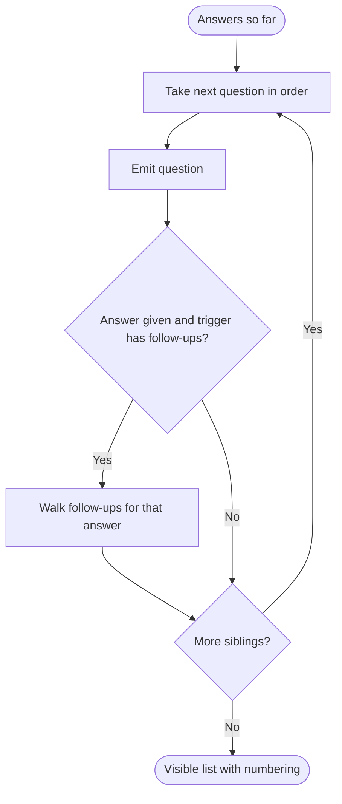

# Question Sets - Technical Design

**Domain:** Question Sets (Platform Capability)  
**Version:** 0.1 (draft)  
**Last Updated:** 2026-10-05

## Purpose

This document provides technical design details for the Question Sets capability that are implementation-specific and do not belong in the capability model: branching evaluation, version resolution, response pinning and reuse, prefill resolution, option list providers, file upload integration, storage, and the handling of sensitive answers.

Technical open questions are tracked in [../tracking-proposals.md](../tracking-proposals.md) (OQ-QS-04 to OQ-QS-08), not in this file.

---

## Branching and Visibility Evaluation

### Overview

A question set is a tree. Top-level questions form the main sequence. A question with Yes/No or Single Choice type can have follow-up questions under specific answer values. Visible questions are produced by a depth-first walk: each question is emitted, then the follow-ups for the answer given (if any), recursively, then the next sibling. Branches converge naturally when no further follow-ups apply.

This is the same traversal the POC implements (`flattenVisibleQuestions`), extended from one level to multiple levels.

### Numbering

Top-level questions are numbered 1, 2, 3. A follow-up is numbered `<parent>.<n>` in order, and a nested follow-up extends the same way (`2.1.1`). A conditional follow-up never changes the numbering of the questions around it.

### Authoritative Evaluation

The server evaluates visibility on every save and on submit. Answers submitted for questions not on the visible path are rejected (not silently dropped), so a client bug cannot store orphaned answers. The same evaluator is shipped to the UI as a shared library so the form updates immediately while typing; the server result wins.

### Edge Cases

| Scenario | Behavior |
|---|---|
| Respondent changes a parent answer after answering follow-ups | Follow-up answers on the no-longer-visible path are cleared from the draft response and the UI tells the respondent |
| Halt answer given on a question with answered follow-ups | Response moves to `Halted`; later answers are not accepted |
| Respondent changes a halting answer to a non-halting one | If halting responses are persisted (OQ-QS-03), the response returns to `InProgress`; otherwise a new response is created |
| Follow-up depth beyond the cap | Rejected at publish validation |
| Same option value appears twice in a choice list | Rejected at publish validation |
| Required follow-up under an answer the respondent did not choose | Not required, since it is not visible |
| Admin preview of a branch with no live answers | Authoring preview shows all branches labeled by trigger (POC `flattenAllQuestions`) |

---

## Version Resolution and Lifecycle

### Overview

Versions are immutable once published. A version's state is derived, not stored, so several future-dated versions can queue without a job that wakes up and flips statuses.

### State Derivation

| Condition | State |
|---|---|
| Stored as draft (no effective date) | Draft |
| Published, effective date after as-of date | Scheduled |
| Published, the latest effective date on or before as-of date | Published (current) |
| Published, an older one passed by a newer effective version | Superseded |

`current(questionSetId, asOf)` is the single resolution function. It is used when a response is created (asOf is the creation date unless the consumer passes an explicit asOf, for example to evaluate an application against the definition version it pinned).

### Drafts and Concurrency

- Several drafts may exist for one question set; each records the base version it forked from.
- Publishing is optimistic. If the base version is no longer the current version, the publish call returns a conflict with a comparison payload. The author must pass `acknowledgeConflict: true` to proceed. The POC warns but does not require acknowledgement; this makes the acknowledgement explicit and auditable.
- Compare works between any two versions (POC supports only draft versus live).
- Compare is keyed on `question_key`, so a wording change reads as a change and not as a remove plus an add.

### Why No Activation Job

Credentialing's definition versioning currently uses a nightly activation batch (`credentialing-technical-design.md`, Definition Version Activation). Question Sets does not need one: resolution is computed at read time. A consumer that caches resolved versions listens for `QuestionSetVersionPublished` and invalidates, and uses the effective date to expire its own cache entry at the boundary. If a scheduled event at the boundary is wanted, it can be emitted by a small scheduled job, but correctness does not depend on it.

---

## Response Pinning and Reuse

### Create or Return

`POST /responses` is idempotent per (consumer context, question set). The request carries the consumer domain, context type, context id, question set id, subject, and optionally `asOf`. If a non-superseded response exists it is returned with its pinned version. Otherwise a new response is created and pinned to `current(questionSetId, asOf)`.

### Why Reuse Is Keyed by Context

An applicant applying for a certificate plus two endorsements may be asked for the same follow-up question set by more than one requirement. The consumer asks once per distinct question set (the POC deduplicates in the same way), and the capability guarantees the answer is not collected twice even if the consumer asks twice.

### Pin Stays After a New Version Is Published

A response in progress continues on its pinned version even if a newer version becomes current mid-session. Consumer policy decides whether a stale in-progress response should be restarted; the capability exposes `pinnedVersionIsCurrent` on the response so the consumer can choose.

---

## Prefill Resolution

### Overview

A question can be bound to a Prefill Source. The POC resolves these from a hardcoded profile object. The design separates the binding (owned here) from the value (owned by the source of truth).

### Resolution Modes

| Mode | How it works | Use when |
|---|---|---|
| ConsumerSupplied | The consumer passes a map of prefill key to value when it creates or fetches the response | Values are already known to the consumer (profile data on the application, years of experience from placement records) |
| Provider | The capability calls a registered provider endpoint with the subject id | Value is cheap to fetch and no single consumer owns it (for example identity email from IAM) |

Recommendation: ConsumerSupplied first. It keeps this capability from calling every domain and avoids a dependency web. Provider mode is reserved for a small number of cross-cutting identity values. See OQ-QS-04.

### Provenance

Each answer records `prefilledFromKey`, `prefilledValue` and `prefilledAt` when a suggestion was shown. If the respondent overrides it, the stored answer is their value and the provenance still shows what was suggested. This lets a reviewer see "applicant said 4 years; records said 2".

### Registry

Prefill source keys are registered (not free text) so that authors pick from a list and a renamed key is a controlled change. Initial entries taken from the POC profile list: full name, email, unique id, years of teaching experience, SCECH hours on record, degree-granting institution, highest degree earned, prior state of licensure, exams passed. Each lists its origin system.

---

## Option List Providers

### Overview

Choice questions take options from a manual list or from an Option List. Provider-backed lists are resolved at render time and snapshot at answer time.

### Provider Contract

| Element | Description |
|---|---|
| `providerKey` | Registered provider, for example `organizations.institutions`, `organizations.districts`, `refdata.us-states`, `epp.approved-programs-for-subject` |
| `parameters` | Static parameters set on the list (for example organization type) |
| `context` | Runtime parameters supplied by the consumer or derived from the subject (for example credential type, subject enrollment) |
| Result | Array of `{ value, label }`, with optional grouping |

The feature notes list three variants: a plain list of universities, universities filtered by credential type, and programs filtered by the subject's enrollment. The first is static or Organizations-backed. The second needs a `credentialType` context parameter, which means the response context must carry it. The third needs the subject. Both are supported by the context map on the response.

### Caching

Provider results are cached per (providerKey, parameters, context hash) with a 60 minute TTL, matching Organizations' guidance. A snapshot of the chosen value and label is stored on the answer, so cache expiry or provider change never affects stored responses.

### Typeahead

Large lists (all school districts, all organizations) use the provider's search endpoint with a typeahead, not a full list download. A list declares `searchable: true` for this behavior. The POC caps dropdown display at 20 options, which is a symptom of this need.

### Allow Other

An Option List binding can allow a custom "other" value. The answer is stored with `isCustom: true` so a reviewer can tell.

---

## Validation

### Text

| Check | Notes |
|---|---|
| Required | Evaluated for visible questions only |
| Max length | Counted in characters |
| Pattern preset | Numbers only, letters only, email, phone, plus others added over time |
| Custom pattern | Regular expression, validated at publish time |

Safety for custom patterns: reject patterns that fail to compile, reject patterns that fail a catastrophic-backtracking check, and evaluate with a timeout on the server. The POC treats a bad custom pattern as no restriction; this design fails at publish so an author finds out immediately.

### Date

Any date (default), before today, or after today. Evaluated against the server date in the state's time zone, not the browser.

### Number and Subtypes

Number with optional min and max. Email, phone and URL are text with a preset pattern.

### File Upload

Accepted types and size come from the Documents category bound to the question, not from the question set, so there is one place for file rules. The question may narrow the accepted types but not widen them.

### Descriptive Text

Question descriptions use a restricted markdown subset (bold, italic, bullet lists, links). Links always open in a new tab with `rel="noopener noreferrer"`. HTML is escaped, not allowed. The POC renderer is a reasonable start; it needs link support and a sanitizer test.

---

## File Upload Integration with Documents

Question Sets is the Domain API in the canonical Documents integration pattern (`documents-sequences.md`, Integration Pattern: Domain API Calling Documents).

1. Respondent selects a file for an upload question.
2. `POST /responses/{id}/uploads/request` checks the response is `InProgress`, the question is visible, and the caller is the subject.
3. The capability calls `POST /api/documents/upload/request` with `category` (the bound category), `attachment_type=question-set-response`, `attachment_id={responseId}`, plus filename, size and mime type.
4. Documents returns `document_id` and a SAS `upload_url`. The browser uploads directly.
5. After the scan is clean, `DocumentUploaded` fires. The capability records the `AnswerAttachment` when the respondent confirms the upload on save, verifying status `Available`.
6. Submit requires every required upload question to have an `Available` document.

Authorization is checked once, here. Documents performs technical validation only. The authorizing permission for the context is the consuming domain's (for example `credentialing.application.submit`), recorded as a new row in the Documents Upload Permission Model. See [documents recommendations](../recommended-changes/documents.md).

Draft uploads that never get submitted are tied to the draft response id. A cleanup job on abandoned `InProgress` responses is not designed here; retention and orphan handling are open (OQ-QS-07, OQ-QS-08).

---

## Simulation

### Overview

Simulation runs a version against a subject without persisting anything. Two modes:

| Mode | Subject | Permission |
|---|---|---|
| Sample | A named sample profile (a fixed set of prefill values and context) maintained by the owning domain or admins | `questionsets.{fa}-question-sets.simulate` |
| Target | A real subject, read only | `simulate` plus an additional permission to view that subject's data, audited |

### Behavior

- Resolves prefill and option context for the subject
- Evaluates branching and validation exactly as a real response would
- Does not create a response, upload a document, or publish an event
- Returns the visible path, validation messages and any halt that would occur for the supplied answers

Requirement-level simulation (what credentials would this person be eligible for, which question sets would be triggered) belongs to Credentialing and calls this capability only to show the question set preview. See [credentialing recommendations](../recommended-changes/credentialing.md).

---

## Storage

### Overview

Question set definitions and responses are stored in an Azure SQL database (`questionsets-db`) per the "when in doubt, use Azure SQL" standard and the database-per-domain rule. Version payloads and answer maps are JSON columns, matching how Professional Learning already stores evaluation responses (JSON keyed by question id).

### Key Tables

| Table | Purpose |
|---|---|
| `question_sets` | Identity, name, owning domain |
| `question_set_versions` | Version number, state (draft or published), effective date, base version, payload JSON (immutable once published), change summary, audit fields |
| `option_lists` | Definition, source type, provider key and parameters |
| `option_list_options` | Static options |
| `prefill_sources` | Registry |
| `question_set_responses` | Subject, consumer domain, context type, context id, question set id, version id, status, timestamps |
| `response_answers` | Response id, `question_key`, value JSON, label snapshot, provenance, tags |
| `response_attachments` | Response id, `question_key`, document id |
| `response_halts` | Response id, question key, title and message as displayed |

### Indexes

Unique on (consumer domain, context type, context id, question set id) where status is not Superseded or Cancelled. Index on subject id for subject lookups. Index on (question set id, effective date) for resolution.

### Why Versions Are JSON

A published version is read as a whole and never partially updated. A single payload per version keeps reads cheap and makes immutability simple to enforce. A relational projection of `question_key` is maintained for diff and analytics.

---

## Security Mechanisms

### Sensitive Answers

**Purpose:** Responses can include criminal history narratives and disciplinary disclosures.

**Implementation:** Answer values are never logged, never placed in events, and never sent to analytics streams. Events carry keys and ids only. Reading a response goes through the consuming domain's permission and is written to the audit trail. Consider field-level encryption for responses whose question set is flagged `sensitive` (flag set by the owning domain on the question set). Decision pending (OQ-QS-08).

**Limitations:** Reviewers need to see answers; the control is permission plus audit, not hiding.

### Subject Binding

**Purpose:** Prevent one user from answering or reading another's response.

**Implementation:** The runtime API compares the token subject with the response subject. Staff answering on someone's behalf (for example admin-issued permits) use a different permission and record the actor and the subject separately on the response.

**Limitations:** Impersonation sessions in IAM must propagate actor identity; the response stores both.

### Authoring Safety

**Purpose:** Prevent authors from breaking in-flight business processes.

**Implementation:** Published versions are immutable; a halt or required-question change on a new version affects only new responses; publish validation checks key stability and branch integrity.

---

## Performance Targets

| Metric | Target | Condition |
|---|---|---|
| Fetch pinned version for rendering (cache hit) | < 50 ms | p95 |
| Save partial answers with validation | < 300 ms | p95 |
| Provider option fetch (cache hit) | < 100 ms | p95 |
| Publish a version with validation | < 2 s | p95 |

Targets are starting points; confirm against the solution-level performance guidance.

---

## Alternatives Considered

- **Embed question sets inside Credentialing.** Rejected: Professional Practices and Professional Learning already assume a shared capability, and embedding would duplicate the engine PPR has already modeled.
- **General business rules engine for branching and outcomes.** Rejected for this capability: conflicts with the configuration principle (no business logic encoded as settings, must be testable) and overlaps the undecided FDD 4.2 scope.
- **Event sourcing responses.** Not needed. Immutable versions plus immutable submitted responses satisfy the audit need; consult `event-sourcing.md` if the audit layer requirements expand.
- **Store option lists as copies in the question set.** Rejected: provider data changes, and copies would drift.

---

## Observability

Custom metrics to add to the solution observability list: responses started, submitted, halted per question set; halt rate per question; time to complete; publish conflicts; provider option fetch latency and failure rate; simulation runs. No answer values in any metric label.

---

## Testing

- Unit: the branching evaluator (shared with UI), validation, version resolution, key stability checks.
- Contract: provider contract tests per option list provider; consumer contract tests for the response shape and events.
- Integration: Documents upload round trip with a test category.
- Simulation doubles as a test harness for authors; automated scenarios can reuse the sample profiles.

---

## Related Documents

- [Capability](./questionsets-capability.md)
- [Sequences](./questionsets-sequences.md)
- [API Contracts](./questionsets-api.yml)
- [Permissions Catalog](./questionsets-permissions.md)

---

**Version History:**
- v0.1 (2026-10-05): Initial draft derived from the Question Set POC and existing design docs
