# Communications - Workflows & Sequences

This document contains sequence diagrams for all workflows in the Communications platform capability.

**Conventions:**
- Solid arrows (`->>`) = Synchronous calls
- Dashed arrows (`-->>`) = Responses
- Dotted arrows (`--)`) = Async/fire-and-forget (events)
- **actor** = Human only
- **participant** = Every non-human, including internal services, the Event Bus and external systems
- Participants are grouped in boxes: `Browser` (UI), `MiEdWorkforce (AKS)` (services, Event Bus), `External` (external systems)
- Every request arrow carries an API-kind tag, then the verb and path from the API spec: `APP` = Application API (UI to owning API), `SVC` = Service API (API to API), `EXT` = External API (external system to an external-facing endpoint), `OUT` = outbound call to an external system. Responses carry no tag.
- Every application API call is authorized by the owning service through the cached IAM permission check (Service API). It is not drawn unless noted.

---

## Event-Triggered Email Send - Render Email from Event

**What:** Domain event triggers automatic email send using pre-configured template; this diagram covers finding the template, resolving variables and rendering  
**When:** Business event occurs (e.g., credential application approved, payment due)  
**Who:** System (automated)

See also: Event-Triggered Email Send - Send and Record Email (continues from the rendered email).

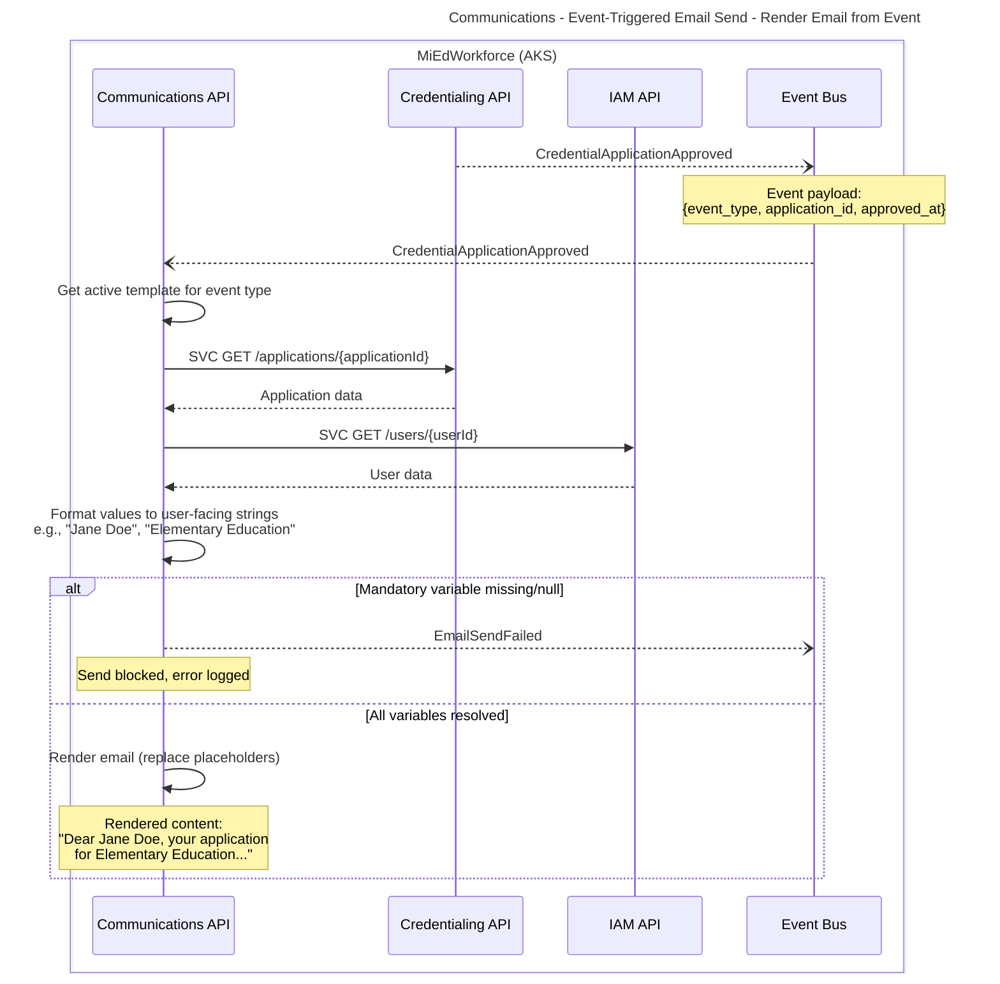

**Key Decisions:**
- **Event payload:** Lightweight (IDs only), resolver fetches display data
- **Variable resolution:** Event-type-specific resolver handles formatting
- **Silent failure:** No template = no email (prevents spam on misconfigured events)

**State Changes:**
- None (rendering only)

**Events Published:**
- `EmailSendFailed` - Variable resolution failed

**Error Scenarios:**
- No active template > Silent failure, log warning
- Mandatory variable null > Block send, publish failure event

---

## Event-Triggered Email Send - Send and Record Email

**What:** Resolved and rendered email is sent to the recipient(s) and recorded  
**When:** Rendering of an event-triggered email has completed  
**Who:** System (automated)

See also: Event-Triggered Email Send - Render Email from Event (produces the rendered email).

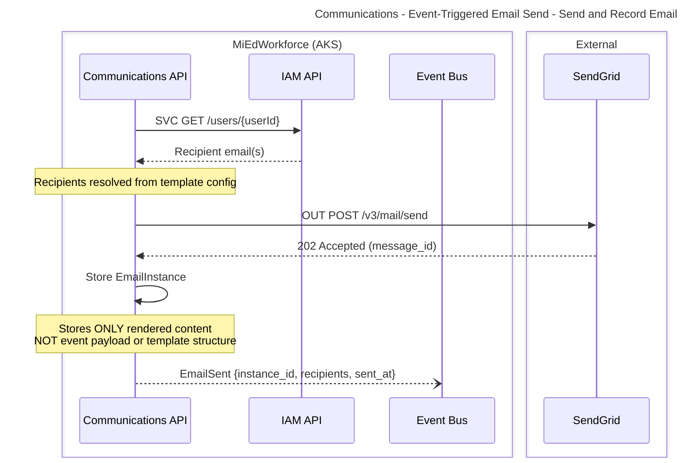

**Key Decisions:**
- **Rendered content only:** EmailInstance stores final output, not intermediate data

**State Changes:**
- EmailInstance status: `None` > `Queued`

**Events Published:**
- `EmailSent` - Email successfully queued to SendGrid

**Error Scenarios:**
- SendGrid API error > Retry with exponential backoff (max 3 attempts)

---

## Manual Email Send with Template Customization

**What:** User composes and sends one-time email using template as starting point  
**When:** User needs to send custom communication (e.g., follow-up, clarification)  
**Who:** Credentialing Administrator, Help Desk Staff; Permission: communications.email.send-manual (plus communications.email.customize for custom subject/body; templates listed per functional area)

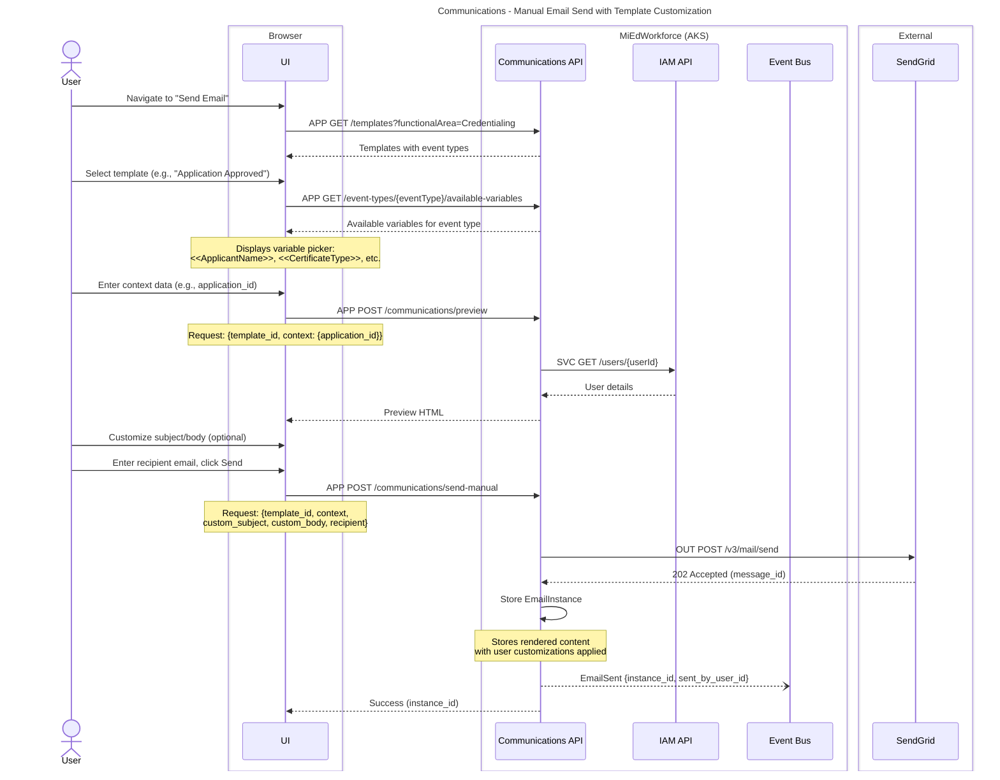

**Key Decisions:**
- **Preview before send:** User sees resolved content before sending
- **Customization scope:** User can modify subject/body but NOT template variables
- **Permissions:** Requires `communications.email.send-manual` permission
- **Audit trail:** EmailInstance captures who sent it (`sent_by_user_id`)

**State Changes:**
- EmailInstance status: `None` > `Queued`

**Events Published:**
- `EmailSent` - Includes `sent_by_user_id` for manual sends

**Error Scenarios:**
- Insufficient permissions > 403 Forbidden
- Invalid context data (e.g., application_id not found) > 400 Bad Request
- SendGrid error > Display error, allow retry

---

## Template Version Update and Activation - Create Draft Version

**What:** Admin creates new template version as a draft  
**When:** Template content needs updating (e.g., policy change, branding update)  
**Who:** Credentialing Administrator, System Administrator; Permission: communications.credentials-templates.edit (per functional area of the template)

See also: Template Version Update and Activation - Activate Version (activates the draft).

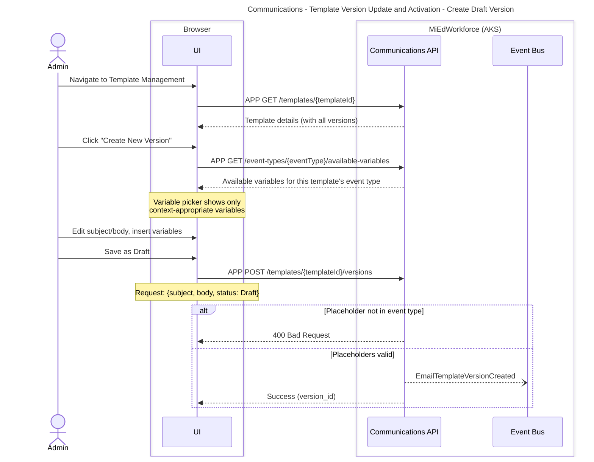

**Key Decisions:**
- **Draft-then-activate workflow:** Prevents accidental activation of untested content
- **Variable validation:** System validates placeholders match event type's available variables
- **Audit trail:** All versions preserved (never deleted)

**State Changes:**
- TemplateVersion: `None` > `Draft`

**Events Published:**
- `EmailTemplateVersionCreated` - New draft created

**Error Scenarios:**
- Invalid variable placeholder (not in event type) > 400 Bad Request
- Insufficient permissions > 403 Forbidden

---

## Template Version Update and Activation - Activate Version

**What:** Admin activates a draft template version  
**When:** Admin has reviewed the draft and tested it with preview  
**Who:** Credentialing Administrator, System Administrator; Permission: communications.credentials-templates.activate (per functional area of the template)

See also: Template Version Update and Activation - Create Draft Version (creates the draft).

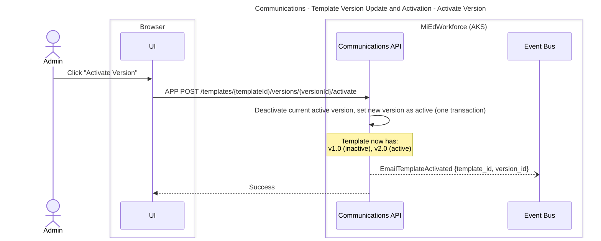

**Key Decisions:**
- **Single active version:** Activating v2.0 automatically deactivates v1.0
- **Draft-then-activate workflow:** Prevents accidental activation of untested content

**State Changes:**
- TemplateVersion: `Draft` > `Active`
- Previous active version: `Active` > `Inactive`

**Events Published:**
- `EmailTemplateActivated` - Version set as active

**Error Scenarios:**
- Insufficient permissions > 403 Forbidden
- Concurrent activation conflict > 409 Conflict, retry

---

## Email History Search and Details View

**What:** User searches sent emails and views full details  
**When:** Help desk troubleshooting, user inquiry, audit review  
**Who:** Credentialing Administrator, Help Desk Staff, System Administrator; Permission: communications.credentials-emails.view-history (functional area scoped) for search, communications.email.view-details for details

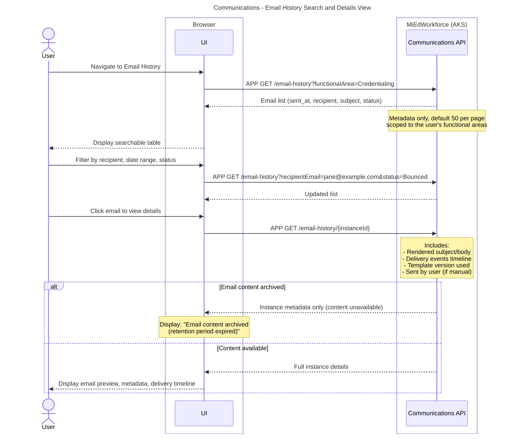

**Key Decisions:**
- **Functional area scoping:** User only sees emails for their permitted functional areas
- **Pagination:** Default 50 results per page
- **Metadata vs content:** List view shows metadata, detail view fetches full content
- **Content availability:** UI indicates if content has been archived

**State Changes:**
- None (read-only operation)

**Events Published:**
- None

**Error Scenarios:**
- Insufficient permissions > 403 Forbidden
- Instance not found > 404 Not Found
- Content archived but audit metadata available > Display limited info

---

## Email Resend with Recipient Override - Load Resend Context

**What:** User opens a previously sent email and the resend form is prepared with the original or current recipient  
**When:** Email bounced, user provided updated email, help desk escalation  
**Who:** Credentialing Administrator, Help Desk Staff; Permission: communications.credentials-emails.view-history and communications.credentials-emails.resend (functional area scoped)

See also: Email Resend with Recipient Override - Resend Email (sends the email).

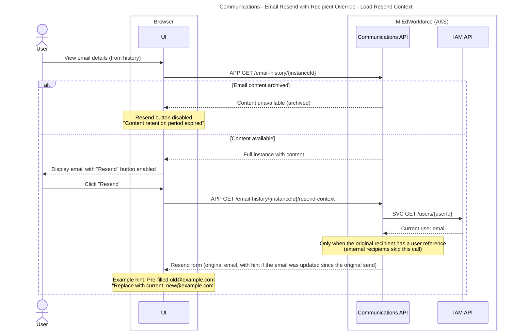

**Key Decisions:**
- **Content availability:** Resend only available during retention period
- **Email update detection:** System detects if user's email changed in identity system

**State Changes:**
- None (read-only operation)

**Events Published:**
- None

**Error Scenarios:**
- Content archived > 400 Bad Request "Content no longer available"
- Insufficient permissions > 403 Forbidden

---

## Email Resend with Recipient Override - Resend Email

**What:** User resends previously sent email to new/corrected recipient  
**When:** User has reviewed the resend form and clicks Send  
**Who:** Credentialing Administrator, Help Desk Staff; Permission: communications.credentials-emails.resend (functional area scoped)

See also: Email Resend with Recipient Override - Load Resend Context (prepares the resend form).

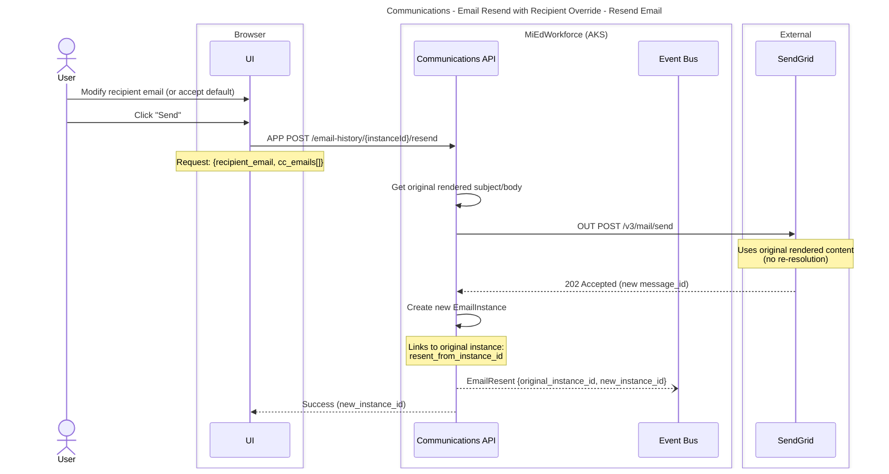

**Key Decisions:**
- **No re-resolution:** Resend uses original rendered content (not re-rendered)
- **New instance created:** Resend creates new EmailInstance linked to original

**State Changes:**
- New EmailInstance status: `None` > `Queued`

**Events Published:**
- `EmailResent` - Links original and new instances

**Error Scenarios:**
- Content archived > 400 Bad Request "Content no longer available"
- Insufficient permissions > 403 Forbidden
- SendGrid error > Display error, allow retry

---

## SendGrid Webhook - Delivery Status Update

**What:** Process incoming delivery events from SendGrid  
**When:** Email delivered, bounced, deferred, or dropped  
**Who:** SendGrid (external system)

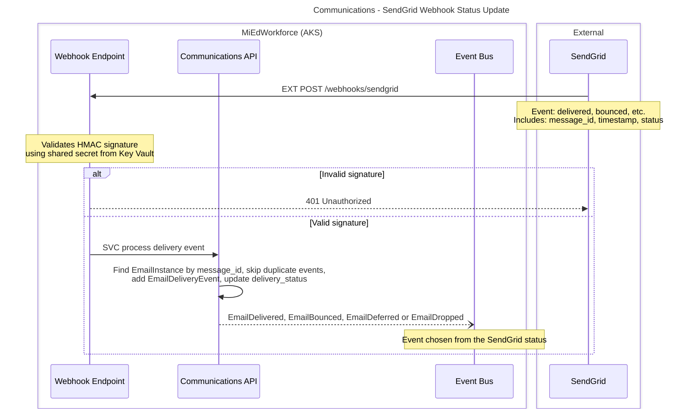

**Key Decisions:**
- **Signature validation:** HMAC SHA256 prevents spoofed webhooks
- **Idempotency:** Duplicate events ignored (SendGrid may retry)
- **Race condition handling:** Orphaned webhooks logged but accepted
- **Status mapping:** SendGrid statuses mapped to domain events

**State Changes:**
- EmailInstance `delivery_status`: `Queued` > `Delivered/Bounced/Deferred/Dropped`

**Events Published:**
- `EmailDelivered` - Successful delivery
- `EmailBounced` - Permanent failure (includes substatus)
- `EmailDeferred` - Temporary failure (will retry)
- `EmailDropped` - SendGrid rejected before sending

**Error Scenarios:**
- Invalid signature > 401 Unauthorized (prevents processing)
- Instance not found > Log warning, return 200 (idempotent); possible race condition, webhook arrived before instance saved
- Duplicate event > Return 200 (already processed)

---

## Email Content Purge Job

**What:** Scheduled job permanently deletes old email content while retaining audit metadata  
**When:** Daily at 2:00 AM EST  
**Who:** System (automated)
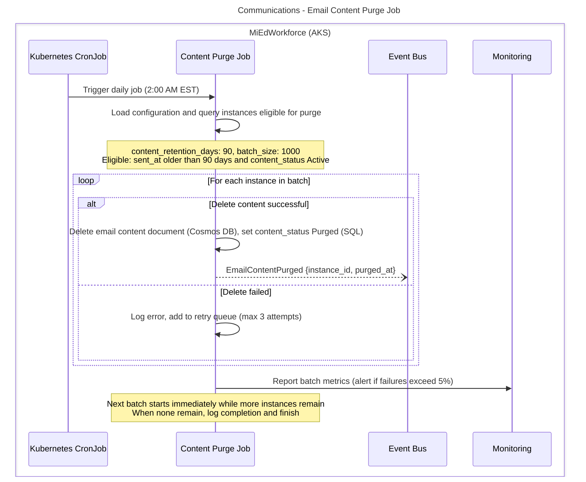

**Key Decisions:**
- **Batch processing:** 1000 instances per batch prevents memory issues
- **Retry logic:** Failed deletes retried up to 3 times
- **Alert threshold:** >5% failure rate triggers admin alert
- **Two-phase delete:** Cosmos DB content deleted first, then SQL metadata updated
- **Metadata preservation:** SQL audit metadata retained indefinitely for compliance

**State Changes:**
- EmailInstance `content_status`: `Active` > `Purged`

**Events Published:**
- `EmailContentPurged` - Per instance successfully purged

**Error Scenarios:**
- Cosmos DB unavailable > Retry batch, alert if persistent
- SQL connection lost > Job fails, retries on next schedule
- Individual delete fails > Retry up to 3 times, then alert
- Cosmos delete succeeds but SQL update fails > Manual reconciliation required (logged)

**Post-Purge State:**
- SQL metadata remains: sent_at, recipient, subject (text only), delivery_status, template_version_id
- Cosmos DB content deleted: Full HTML body, text body, rendered subject with variables
- Resend capability disabled (content no longer available)
- Email history view still shows metadata and delivery timeline

---

## Template Variable Resolution (Internal)

**What:** Event-type-specific resolver fetches and formats data for template variables  
**When:** Email send triggered (event-driven or manual)  
**Who:** Variable Resolver (internal component)

```mermaid
---
title: Communications - Template Variable Resolution (Internal)
---
sequenceDiagram
    box MiEdWorkforce (AKS)
    participant CommApi as Communications API
    participant CredApi as Credentialing API
    participant IamApi as IAM API
    end

    CommApi->>CommApi: Resolver parses template variables
    Note over CommApi: Event: CredentialApplicationApproved<br/>Context: {application_id}<br/>Found: <<ApplicantName>>, <<CertificateType>>, <<ApprovalDate>>

    CommApi->>CredApi: SVC GET /applications/{applicationId}
    CredApi-->>CommApi: Application data<br/>{applicant_id, certificate_type_code, approved_at, approved_by_id}

    CommApi->>IamApi: SVC GET /users/{userId}
    IamApi-->>CommApi: User data<br/>{first_name, last_name, email}
    Note over CommApi: Cache checked first (miss here);<br/>user data stored with TTL 1 hour

    CommApi->>CommApi: Format values to user-facing strings
    Note over CommApi: ApplicantName: "Jane Doe"<br/>(NOT "janeDoe" or "JANE DOE")<br/><br/>CertificateType: "Elementary Education"<br/>(NOT "elem_ed" or "ELEM_ED")<br/><br/>ApprovalDate: "January 15, 2026"<br/>(NOT "2026-01-15T10:30:00Z")

    CommApi->>CommApi: Replace placeholders in template with resolved variables
```

**Key Decisions:**
- **Event-type-specific resolvers:** Each event type has dedicated resolver class
- **Lightweight events:** Event carries only IDs, resolver fetches display data
- **User-facing formatting:** All values formatted for human readability
- **Caching:** Frequently accessed data (user profiles) cached for 1 hour
- **Batch API calls:** Resolver batches requests when resolving multiple variables from same source

**State Changes:**
- None (internal process)

**Events Published:**
- None (internal process)

**Error Scenarios:**
- API unavailable > Retry with exponential backoff
- Mandatory variable null > Throw exception, block send
- Invalid data format > Log error, use fallback value if available

---

## Dashboard Alert Creation and Display - Create Alert from Event

**What:** System creates dashboard alert for user  
**When:** Important action required (e.g., pending authorization, data quality issue)  
**Who:** System (automated)

See also: Dashboard Alert Creation and Display - Display Alerts (user views the alerts).

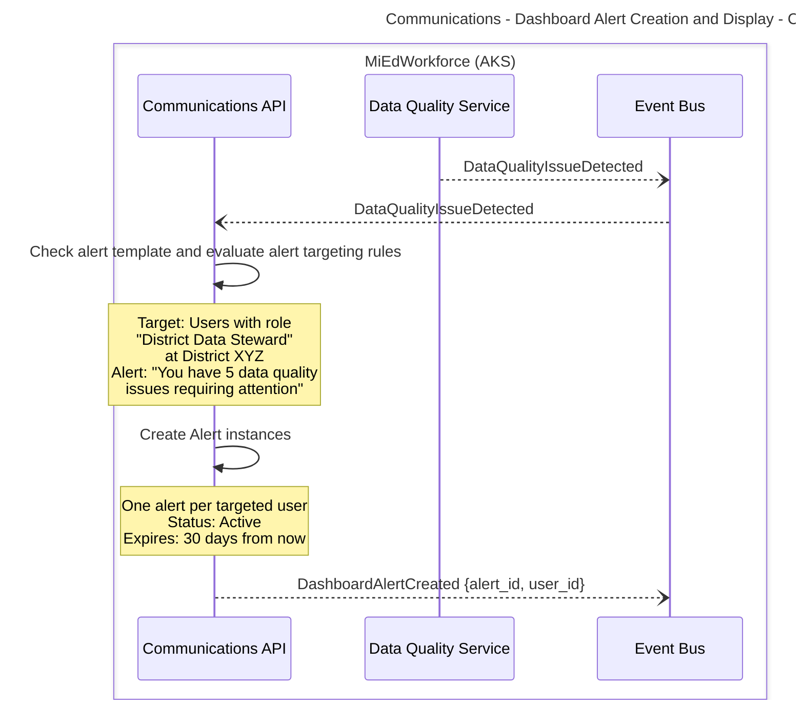

**Key Decisions:**
- **Role-based targeting:** Alerts sent to users with specific roles at specific scopes
- **Automatic expiration:** Alerts expire after configured period (default 30 days)
- **One alert per user:** System creates individual alert instances (not shared)

**State Changes:**
- Alert status: `None` > `Active`

**Events Published:**
- `DashboardAlertCreated` - Per user who received alert

**Error Scenarios:**
- No users match targeting rules > Alert template misconfigured, log warning

---

## Dashboard Alert Creation and Display - Display Alerts

**What:** User sees active dashboard alerts when accessing the dashboard  
**When:** User logs in  
**Who:** District Data Steward, Authorization Approver, etc.; Permission: communications.alerts.view (own alerts only)

See also: Dashboard Alert Creation and Display - Create Alert from Event (creates the alerts).

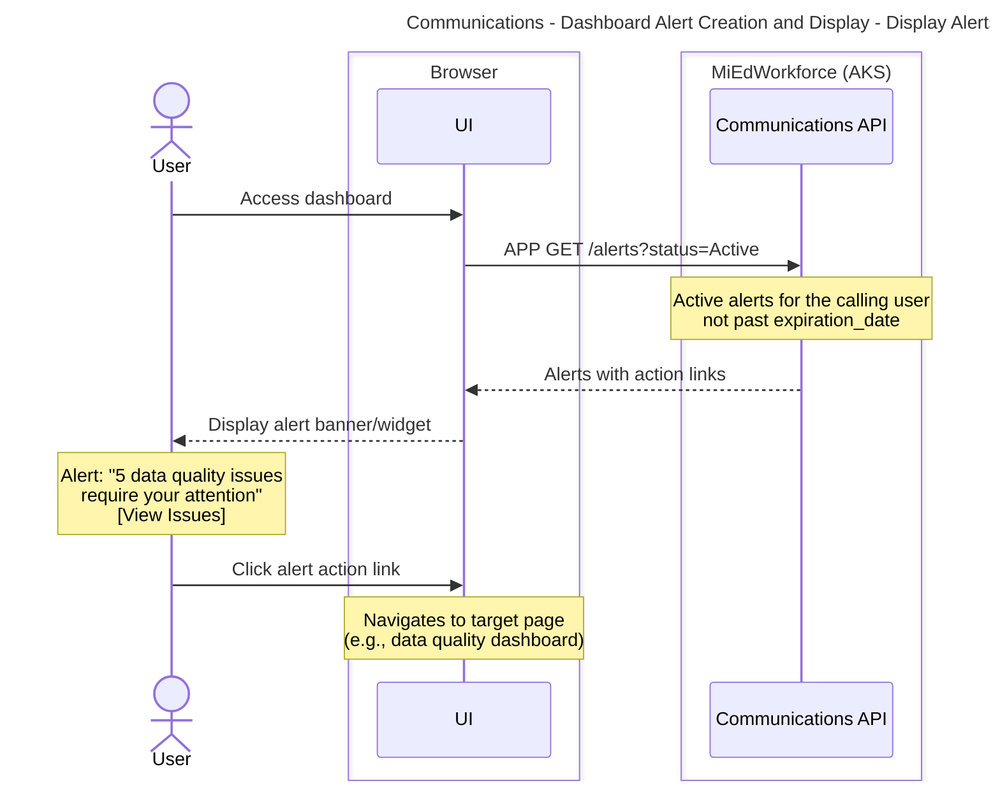

**Key Decisions:**
- **Action links:** Each alert includes deep link to relevant page

**State Changes:**
- None (read-only operation)

**Events Published:**
- None

**Error Scenarios:**
- User lacks access to action link > Display alert but disable link

---

## User Resolves Dashboard Alert

**What:** User completes action and dismisses alert  
**When:** User clicks alert action link and completes required task  
**Who:** District Data Steward, Authorization Approver, etc.; Permission: communications.alerts.view (own alerts; ownership evaluated server side)

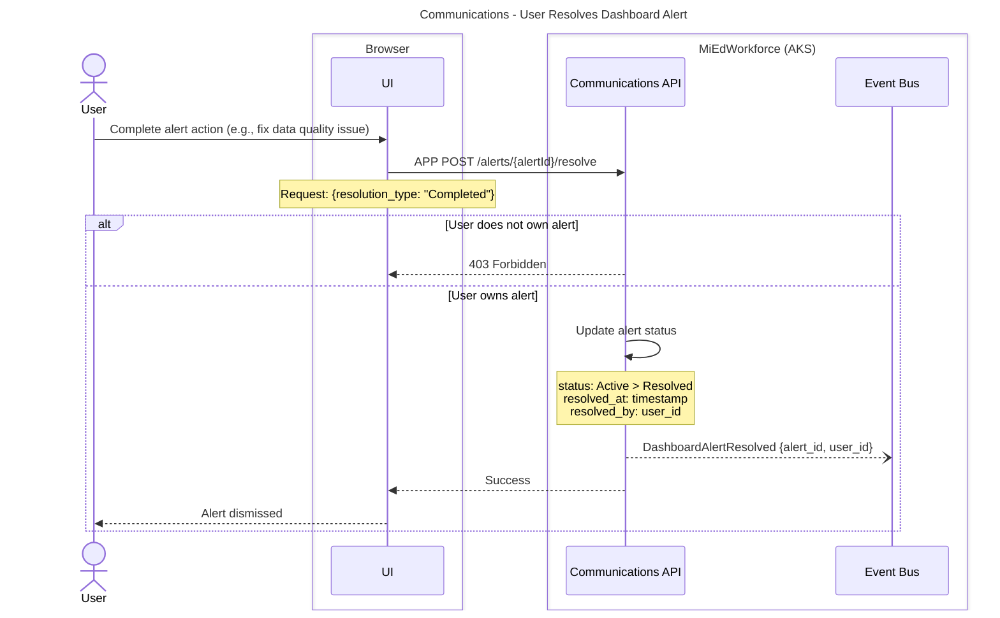

**Key Decisions:**
- **User ownership validation:** Only alert owner can resolve
- **Resolution types:** "Completed", "Dismissed", "No Action Needed"
- **Automatic resolution:** Some alerts auto-resolve when underlying condition cleared
- **Audit trail:** Resolution timestamp and user ID captured

**State Changes:**
- Alert status: `Active` > `Resolved`

**Events Published:**
- `DashboardAlertResolved` - Alert completed by user

**Error Scenarios:**
- User does not own alert > 403 Forbidden
- Alert already resolved > 409 Conflict (idempotent response)
- Alert expired > 400 Bad Request "Alert expired"

---

## Mass Email with Consolidation

**What:** System consolidates multiple related events into single email  
**When:** Multiple data quality issues detected for same user within consolidation window  
**Who:** System (automated)

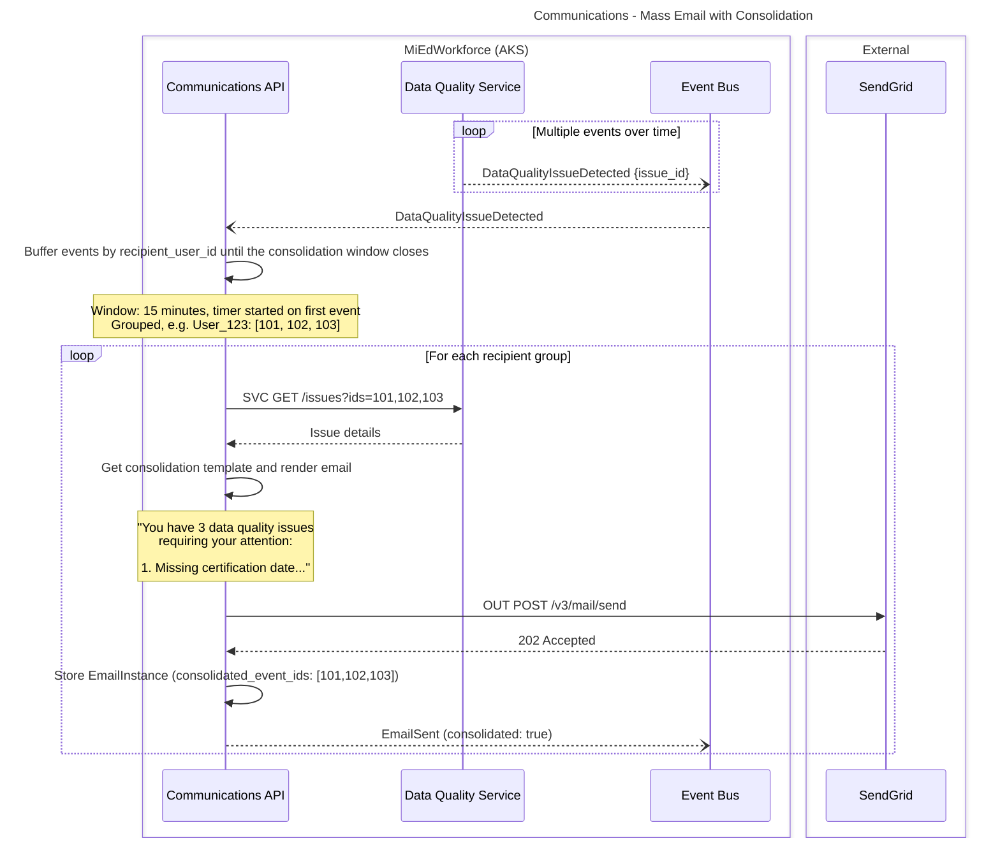

**Key Decisions:**
- **Consolidation window:** 15 minutes default (configurable per event type)
- **Grouping key:** Typically recipient user, but can be customized
- **Consolidation rules:** Events are buffered per recipient; the timer starts on the first event; when the window closes, events are grouped by recipient and one email is rendered per group using the "Data Quality Issues Summary" template with `<<IssueCount>>` and `<<IssueList>>` list variables
- **Special templates:** Consolidation templates support list variables
- **Event tracking:** EmailInstance links to all consolidated event IDs

**State Changes:**
- EmailInstance status: `None` > `Queued`

**Events Published:**
- `EmailSent` with `consolidated: true` flag

**Error Scenarios:**
- Consolidation window timeout > Process buffered events even if incomplete
- Template not found > Fall back to individual emails per event

---

# Notes

## Template Variable Formatting Standards

Proposed home: Communications capability doc.

All variable resolvers must produce user-facing formatted strings. Raw technical values (database codes, ISO timestamps, boolean flags) should never appear in rendered email content.

- **Dates:** Long format — "January 15, 2026"
- **Names:** "First Last" — never all-caps or last-name-first
- **Currency:** "$1,234.56"
- **Credential/Certificate Types:** Human-readable display name — "Elementary Education", never "elem_ed" or "ELEMENTARY_EDUCATION"
- **Boolean values:** Context-appropriate phrasing — "Yes / No" or "Approved / Denied"
- **Lists:** Numbered for ordered items, bulleted for unordered; use HTML lists in HTML emails

---

## Event Payload Design Standards

Proposed home: event standards in patterns-and-principles, or the Communications capability doc.

Domain events that trigger communications should carry only IDs and intrinsic core data. Display data (names, labels, formatted values) is the resolver's responsibility, not the event publisher's.

This keeps events lightweight, prevents payload bloat, and ensures emails always use current data at send time rather than data captured when the event was published.

---

## Resend vs. New Send Decision Matrix

Proposed home: Key Decisions of Email Resend, or the Communications capability doc.

| Scenario                           | Action                      | Rationale                                            |
| ---------------------------------- | --------------------------- | ---------------------------------------------------- |
| Email bounced (invalid address)    | Resend to corrected address | Content is correct, just wrong recipient             |
| User claims "never received"       | Resend to same address      | May have been filtered to spam                       |
| Email content has errors           | Send new email              | Resend uses original rendered content                |
| New information to communicate     | Send new email              | Resend is retransmission only, not an update         |
| Forwarding to manager or help desk | Resend with CC              | Shares the exact content originally sent             |
| Content archived (90+ days)        | Send new email              | Resend unavailable after retention period            |
| Template has been updated          | Send new email              | Resend uses the version active at original send time |
| Underlying data has changed        | Send new email              | Resend does not re-resolve variables                 |

---

## Reference Material - Integration Flows (not sequences)

Proposed home: communications-api.yml (endpoint) and the SendGrid section of solution-integrations.md (SendGrid REST and webhook examples). Kept here until moved.

### Event Type Variable Registry API

**Purpose:** Backend provides UI with available variables for each event type

**API Endpoint:**
```
GET /event-types/{eventType}/available-variables
```

**Example Response:**
```json
{
  "event_type": "CredentialApplicationApproved",
  "functional_area": "Credentialing",
  "available_variables": [
    {
      "name": "ApplicantName",
      "display_name": "Applicant Name",
      "description": "Full name of the credential applicant",
      "example_value": "Jane Doe",
      "is_mandatory": true,
      "data_type": "string"
    },
    {
      "name": "CertificateType",
      "display_name": "Certificate Type",
      "description": "Type of certificate being applied for",
      "example_value": "Elementary Education",
      "is_mandatory": true,
      "data_type": "string"
    },
    {
      "name": "ApprovalDate",
      "display_name": "Approval Date",
      "description": "Date the application was approved",
      "example_value": "January 15, 2026",
      "is_mandatory": false,
      "data_type": "string"
    },
    {
      "name": "ApplicationId",
      "display_name": "Application ID",
      "description": "Unique identifier for the application",
      "example_value": "APP-2026-12345",
      "is_mandatory": false,
      "data_type": "string"
    }
  ]
}
```

**Usage in UI:**
1. User creates/edits template
2. User selects event type from dropdown
3. UI calls this endpoint to fetch available variables
4. Variable picker populated with context-appropriate options
5. User inserts variables into template content using `<<VariableName>>` syntax

---

### SendGrid Integration - Email Delivery

**Purpose:** Send email via SendGrid and track delivery status

**Send Email:**
```
POST https://api.sendgrid.com/v3/mail/send
Authorization: Bearer {API_KEY}

{
  "personalizations": [{
    "to": [{"email": "jane.doe@example.com", "name": "Jane Doe"}],
    "subject": "Your credential application has been approved"
  }],
  "from": {"email": "noreply@michigan.gov", "name": "MiEdWorkforce"},
  "content": [{
    "type": "text/html",
    "value": "<p>Dear Jane Doe, your application for Elementary Education...</p>"
  }],
  "custom_args": {
    "instance_id": "uuid-12345",
    "functional_area": "Credentialing"
  }
}
```

**Response:**
```
202 Accepted
X-Message-Id: abc123def456
```

**Webhook Configuration:**
- **Endpoint:** `https://miedworkforce.michigan.gov/api/webhooks/sendgrid`
- **Events:** `delivered`, `bounce`, `deferred`, `dropped`, `processed`
- **Signature Verification:** HMAC SHA256 using shared secret

**Webhook Payload Example:**
```json
{
  "email": "jane.doe@example.com",
  "timestamp": 1737044400,
  "event": "delivered",
  "sg_message_id": "abc123def456",
  "instance_id": "uuid-12345"
}
```

---

### Variable Resolver Registry

**Purpose:** Map event types to their corresponding resolver implementations

**Resolver Interface:**
```typescript
interface IVariableResolver {
  eventType: string;
  availableVariables: VariableDefinition[];
  resolve(context: EventContext): Promise<Map<string, string>>;
}
```

**Resolver Registration:**
```typescript
// Registry pattern
const resolverFactory = new VariableResolverFactory();

resolverFactory.register(
  'CredentialApplicationApproved',
  new CredentialApplicationApprovedResolver()
);

resolverFactory.register(
  'StaffingRecordSubmitted',
  new StaffingRecordSubmittedResolver()
);

// Usage
const resolver = resolverFactory.get('CredentialApplicationApproved');
const variables = await resolver.resolve({ application_id: '12345' });
```

**Resolver Implementation Example:**
```typescript
class CredentialApplicationApprovedResolver implements IVariableResolver {
  eventType = 'CredentialApplicationApproved';
  
  availableVariables = [
    { name: 'ApplicantName', mandatory: true },
    { name: 'CertificateType', mandatory: true },
    { name: 'ApprovalDate', mandatory: false }
  ];
  
  async resolve(context: EventContext): Promise<Map<string, string>> {
    const application = await this.credentialsApi.getApplication(context.application_id);
    const user = await this.identityApi.getUser(application.applicant_id);
    
    return new Map([
      ['ApplicantName', this.formatName(user)],
      ['CertificateType', this.formatCertificateType(application.certificate_type_code)],
      ['ApprovalDate', this.formatDate(application.approved_at)]
    ]);
  }
  
  private formatName(user: User): string {
    return `${user.first_name} ${user.last_name}`;
  }
  
  private formatCertificateType(code: string): string {
    // Lookup display name from reference data
    return this.certificateTypeMap.get(code) || code;
  }
  
  private formatDate(date: Date): string {
    return date.toLocaleDateString('en-US', { 
      year: 'numeric', 
      month: 'long', 
      day: 'numeric' 
    });
  }
}
```
