# Credentialing - Workflows & Sequences

This document contains sequence diagrams for all workflows in the Credentialing domain.

**Conventions:**
- Solid arrows (`->>`) = Synchronous calls
- Dashed arrows (`-->>`) = Responses
- Dotted arrows (`--)`) = Async/fire-and-forget (events)
- **actor** = Human only
- **participant** = Everything that is not a human (UI, services, Event Bus, external systems)
- Every request arrow between participants starts with an API kind tag: `APP` (application API, called by the UI with the user's token), `SVC` (service API, API to API inside the cluster), `EXT` (external API, called by an external system), `OUT` (outbound call to an external system). Responses carry no tag.
- Participants are grouped with `box`: Browser (UI), MiEdWorkforce (AKS) for services and the Event Bus, External for external systems.
- Every application API call is authorized by the owning service through the cached IAM permission check (Service API). It is not drawn unless noted.

---

## Submit New Certificate Application - Check Eligibility

**What:** Educator submits an application for a new teaching, administrative, or specialist certificate  
**When:** Educator meets eligibility requirements and wants to obtain initial certification  
**Who:** Authenticated educator or admin submitting on educator's behalf. Permission: `credentialing.application.submit` (self-only; an admin submitting on the educator's behalf uses `credentialing.application.manual-submit`)

**See also:** "Submit New Certificate Application - Submit Application" (documents and submission), "Evaluate PPR Clearance for Credential Application" (PPR clearance rules, owned by Professional Practice).

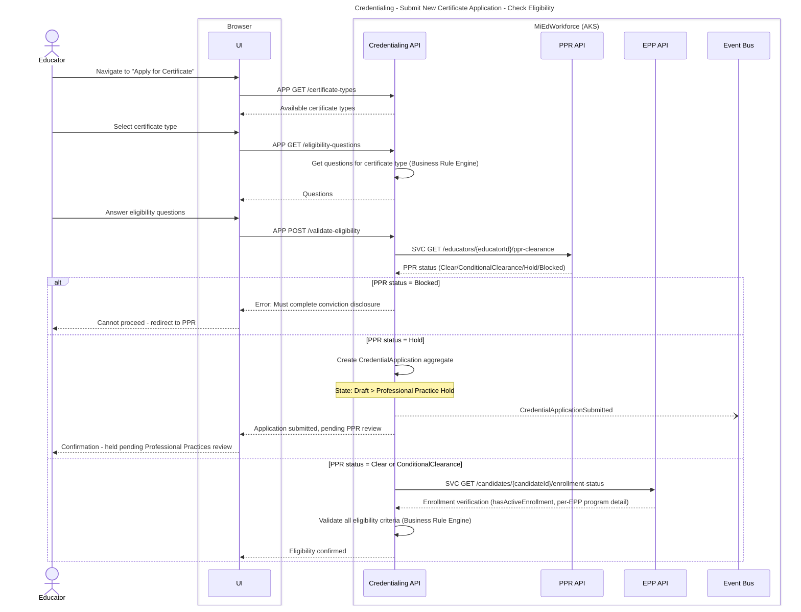
```mermaid
---
title: Credentialing - Submit New Certificate Application - Check Eligibility
---
sequenceDiagram
    actor Educator
    box Browser
        participant UI
    end
    box MiEdWorkforce (AKS)
        participant CredApi as Credentialing API
        participant PprApi as PPR API
        participant EppApi as EPP API
        participant EventBus as Event Bus
    end

    Educator->>UI: Navigate to "Apply for Certificate"
    UI->>CredApi: APP GET /certificate-types
    CredApi-->>UI: Available certificate types

    Educator->>UI: Select certificate type
    UI->>CredApi: APP GET /eligibility-questions
    CredApi->>CredApi: Get questions for certificate type (Business Rule Engine)
    CredApi-->>UI: Questions

    Educator->>UI: Answer eligibility questions
    UI->>CredApi: APP POST /validate-eligibility
    CredApi->>PprApi: SVC GET /educators/{educatorId}/ppr-clearance
    PprApi-->>CredApi: PPR status (Clear/ConditionalClearance/Hold/Blocked)

    alt PPR status = Blocked
        CredApi-->>UI: Error: Must complete conviction disclosure
        UI-->>Educator: Cannot proceed - redirect to PPR
    else PPR status = Hold
        CredApi->>CredApi: Create CredentialApplication aggregate
        Note over CredApi: State: Draft > Professional Practice Hold
        CredApi--)EventBus: CredentialApplicationSubmitted
        CredApi-->>UI: Application submitted, pending PPR review
        UI-->>Educator: Confirmation - held pending Professional Practices review
    else PPR status = Clear or ConditionalClearance
        CredApi->>EppApi: SVC GET /candidates/{candidateId}/enrollment-status
        EppApi-->>CredApi: Enrollment verification (hasActiveEnrollment, per-EPP program detail)
        CredApi->>CredApi: Validate all eligibility criteria (Business Rule Engine)
        CredApi-->>UI: Eligibility confirmed
    end
```

**Key Decisions:**
- **PPR Status:** If status = `Blocked`, application is blocked entirely; if `Hold`, application is created but held pending Professional Practices review; `Clear` and `ConditionalClearance` both proceed to normal eligibility processing (`ConditionalClearance` is instead evaluated during auto-approval — see "Manual Review Triggering")
- **Eligibility:** BRM evaluates all criteria (degree, GPA, program enrollment, etc.)

**State Changes:**
- CredentialApplication: `Draft` > `Professional Practice Hold` (if PPR status = `Hold`)

**Events Published:**
- `CredentialApplicationSubmitted` - Triggers payment link generation, external workflow routing evaluation (published here only on the `Hold` path; otherwise published by "Submit New Certificate Application - Submit Application")

**Error Scenarios:**
- PPR status = `Blocked` > Block application, redirect to complete disclosure
- Eligibility not met > Display specific unmet requirements, do not create application

---

## Submit New Certificate Application - Submit Application

**What:** Educator uploads the required documents and submits the application for a new certificate once eligibility is confirmed  
**When:** Eligibility has been confirmed by "Submit New Certificate Application - Check Eligibility"  
**Who:** Authenticated educator or admin submitting on educator's behalf. Permission: `credentialing.application.submit` (self-only; an admin submitting on the educator's behalf uses `credentialing.application.manual-submit`)

**See also:** "Submit New Certificate Application - Check Eligibility" (questions, PPR and eligibility).

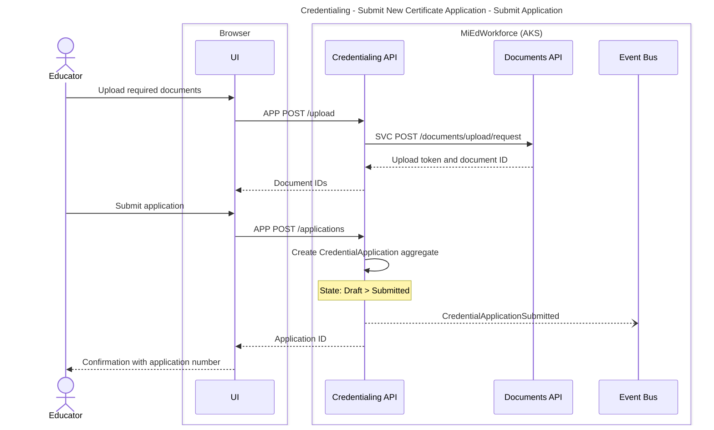
```mermaid
---
title: Credentialing - Submit New Certificate Application - Submit Application
---
sequenceDiagram
    actor Educator
    box Browser
        participant UI
    end
    box MiEdWorkforce (AKS)
        participant CredApi as Credentialing API
        participant DocsApi as Documents API
        participant EventBus as Event Bus
    end

    Educator->>UI: Upload required documents
    UI->>CredApi: APP POST /upload
    CredApi->>DocsApi: SVC POST /documents/upload/request
    DocsApi-->>CredApi: Upload token and document ID
    CredApi-->>UI: Document IDs

    Educator->>UI: Submit application
    UI->>CredApi: APP POST /applications
    CredApi->>CredApi: Create CredentialApplication aggregate
    Note over CredApi: State: Draft > Submitted

    CredApi--)EventBus: CredentialApplicationSubmitted
    CredApi-->>UI: Application ID
    UI-->>Educator: Confirmation with application number
```

**Key Decisions:**
- **Document Requirements:** Varies by certificate type and in-state vs out-of-state status

**State Changes:**
- CredentialApplication: `Draft` > `Submitted`

**Events Published:**
- `CredentialApplicationSubmitted` - Triggers payment link generation, external workflow routing evaluation

**Error Scenarios:**
- Document upload fails > Allow retry, do not proceed to submission

---

## Submit Permit Application - Check Eligibility

**What:** A district/ISD/staffing-agency user submits an application for a temporary
teaching permit on behalf of an educator. This is the **standard, everyday intake path**
for all temporary permit types — per FDD 17's eight permit-family source documents,
educators never self-submit a permit application; they are only downstream recipients of
the payment link and status notifications. (Contrast with "Submit New Certificate
Application," where the educator is the primary self-service actor.)  
**When:** A school needs to place an individual who doesn't hold the applicable
certificate/endorsement into a teaching assignment.  
**Who:** User with `credentialing.permit.issue` permission at District/ISD scope (or the
appropriate Staffing Agency scope, pending resolution of
[client-questions.md #1](../../fdd-sdd-review/client-questions.md)). Permission: `credentialing.permit.issue` (District/ISD scope, organizational hierarchy)

**See also:** "Submit Permit Application - Submit Application" (answers, validation and submission), "Evaluate PPR Clearance for Credential Application" (PPR clearance rules).

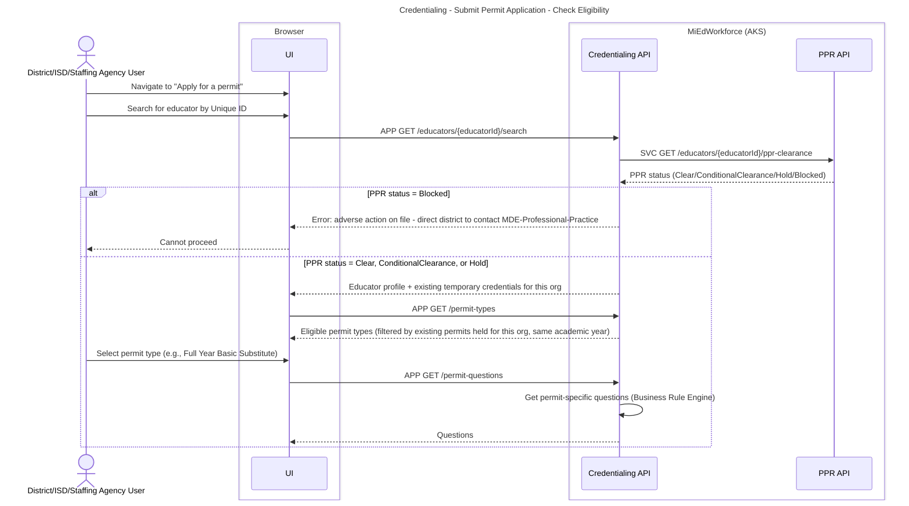
```mermaid
---
title: Credentialing - Submit Permit Application - Check Eligibility
---
sequenceDiagram
    actor Admin as District/ISD/Staffing Agency User
    box Browser
        participant UI
    end
    box MiEdWorkforce (AKS)
        participant CredApi as Credentialing API
        participant PprApi as PPR API
    end

    Admin->>UI: Navigate to "Apply for a permit"

    Admin->>UI: Search for educator by Unique ID
    UI->>CredApi: APP GET /educators/{educatorId}/search
    CredApi->>PprApi: SVC GET /educators/{educatorId}/ppr-clearance
    PprApi-->>CredApi: PPR status (Clear/ConditionalClearance/Hold/Blocked)

    alt PPR status = Blocked
        CredApi-->>UI: Error: adverse action on file - direct district to contact MDE-Professional-Practice
        UI-->>Admin: Cannot proceed
    else PPR status = Clear, ConditionalClearance, or Hold
        CredApi-->>UI: Educator profile + existing temporary credentials for this org
        UI->>CredApi: APP GET /permit-types
        CredApi-->>UI: Eligible permit types (filtered by existing permits held for this org, same academic year)

        Admin->>UI: Select permit type (e.g., Full Year Basic Substitute)
        UI->>CredApi: APP GET /permit-questions
        CredApi->>CredApi: Get permit-specific questions (Business Rule Engine)
        CredApi-->>UI: Questions
    end
```

**Key Decisions:**
- **Permit Type:** Determines eligibility criteria and required documents; the eligible-permit list is filtered by what the submitting org already holds for this individual in the current academic year (e.g. Extended Daily only offered if a Daily Substitute permit already exists for the same org/individual/year — see `credentialing-domain.md`'s "Permit Duration and Renewal Limits")
- **PPR Status:** `Blocked` prevents application creation entirely (consistent with "Automatic Stop-Check on Application Creation"); `Hold` routes to "Professional Practice Hold" instead of immediate processing; `Clear` and `ConditionalClearance` both proceed to eligibility validation (`ConditionalClearance` is evaluated separately during auto-approval — see "Manual Review Triggering")

**State Changes:**
- None (lookup only)

**Events Published:**
- None

**Error Scenarios:**
- PPR status = `Blocked` > Block application, redirect to complete disclosure

---

## Submit Permit Application - Submit Application

**What:** The district/ISD/staffing-agency user answers the permit questions and submits the temporary permit application on behalf of the educator  
**When:** Educator and permit type have been selected in "Submit Permit Application - Check Eligibility"  
**Who:** User with `credentialing.permit.issue` permission at District/ISD scope (or the appropriate Staffing Agency scope). Permission: `credentialing.permit.issue` (District/ISD scope, organizational hierarchy)

**See also:** "Submit Permit Application - Check Eligibility" (educator search, PPR stop-check, permit types and questions).

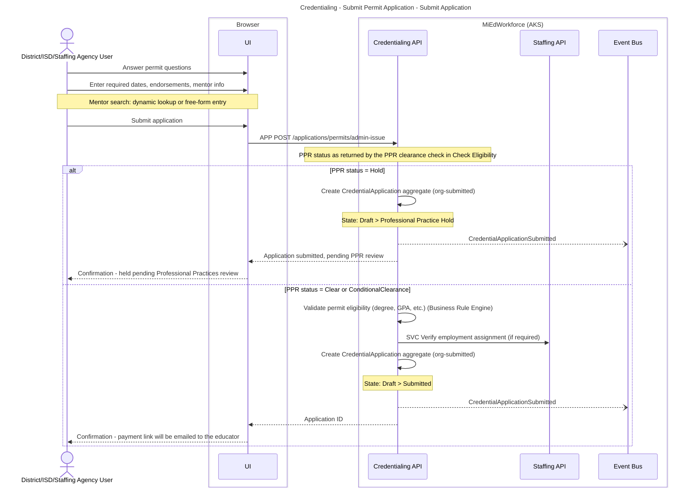
```mermaid
---
title: Credentialing - Submit Permit Application - Submit Application
---
sequenceDiagram
    actor Admin as District/ISD/Staffing Agency User
    box Browser
        participant UI
    end
    box MiEdWorkforce (AKS)
        participant CredApi as Credentialing API
        participant StaffingApi as Staffing API
        participant EventBus as Event Bus
    end

    Admin->>UI: Answer permit questions
    Admin->>UI: Enter required dates, endorsements, mentor info

    Note over Admin,UI: Mentor search: dynamic lookup or free-form entry

    Admin->>UI: Submit application
    UI->>CredApi: APP POST /applications/permits/admin-issue
    Note over CredApi: PPR status as returned by the PPR clearance check in Check Eligibility

    alt PPR status = Hold
        CredApi->>CredApi: Create CredentialApplication aggregate (org-submitted)
        Note over CredApi: State: Draft > Professional Practice Hold
        CredApi--)EventBus: CredentialApplicationSubmitted
        CredApi-->>UI: Application submitted, pending PPR review
        UI-->>Admin: Confirmation - held pending Professional Practices review
    else PPR status = Clear or ConditionalClearance
        CredApi->>CredApi: Validate permit eligibility (degree, GPA, etc.) (Business Rule Engine)
        CredApi->>StaffingApi: SVC Verify employment assignment (if required)

        CredApi->>CredApi: Create CredentialApplication aggregate (org-submitted)
        Note over CredApi: State: Draft > Submitted

        CredApi--)EventBus: CredentialApplicationSubmitted
        CredApi-->>UI: Application ID
        UI-->>Admin: Confirmation - payment link will be emailed to the educator
    end
```

**Key Decisions:**
- **Hard Stops:** Certain violations (degree requirements, GPA) block submission immediately
- **No expedited/bypass path:** submission through this sequence always follows the standard payment/PPR/manual-review pipeline — nothing about admin submission itself skips a step. (This replaces the prior modeling, where admin submission was treated as an emergency/expedited exception; see "Issue Temporary Permit — Exceptional Cases (Admin)" below for why that framing was removed.)
- **Not yet modeled:** bulk submission (multiple educators/permits in one action) — FDD 11's bulk-renewal wireframes show this UI pattern for *renewals*; whether initial permit applications get the same bulk treatment isn't confirmed in the FDDs reviewed so far.

**State Changes:**
- CredentialApplication: `Draft` > `Submitted` (if PPR status = `Clear` or `ConditionalClearance`) or `Draft` > `Professional Practice Hold` (if PPR status = `Hold`); no application is created if PPR status = `Blocked`

**Events Published:**
- `CredentialApplicationSubmitted` - Triggers payment processing and external routing evaluation

**Error Scenarios:**
- Hard stop eligibility failure > Display error, do not create application
- PPR status = `Hold` > Application created but held pending Professional Practices review

---

## Issue Temporary Permit (Exceptional) - Check Eligibility

> **Status: unconfirmed capability.** This sequence models an *expedited, bypass-payment,
> auto-approved* admin issuance path, distinct from the standard "Submit Permit
> Application" flow above. No FDD evidence found for this behavior: FDD 17's eight
> permit-family documents describe every permit type going through the standard
> payment-link/PPR/manual-review pipeline regardless of who submits, and FDD 11's bulk
> permit-renewal wireframes ("MiEdWorkforce-Bulk payments and Daily sub renewal.pdf")
> explicitly show even *bulk* admin-initiated renewals following the same pipeline — "an
> email has been sent to the educator with a link to pay," or "the application must be
> reviewed by OEE before it can be approved." Nothing bypasses. Prior to the "Submit
> Permit Application" rework above, this sequence's expedited/bypass behavior was the
> *only* admin permit-issuance path modeled — but that appears to have been an invented
> assumption, not something drawn from a source document. **Do not build this expedited
> behavior as specified below without confirming a genuine business need for it first**
> (internal call, not necessarily a client question — the team can decide whether to keep
> exploring this or drop it, since removing it doesn't lose the FDDs' actual described
> capability, which is now fully covered by "Submit Permit Application").

**What:** Authorized administrator issues a temporary permit outside the standard
application pipeline, bypassing payment and/or manual review  
**When:** Unconfirmed — no FDD source document reviewed so far describes a scenario
requiring this  
**Who:** User with `credentialing.permit.issue` permission at appropriate scope. Permission: `credentialing.permit.issue` (System-wide, Entity, District, ISD)

**See also:** "Issue Temporary Permit (Exceptional) - Submit Application" (PPR check, validation and issuance).

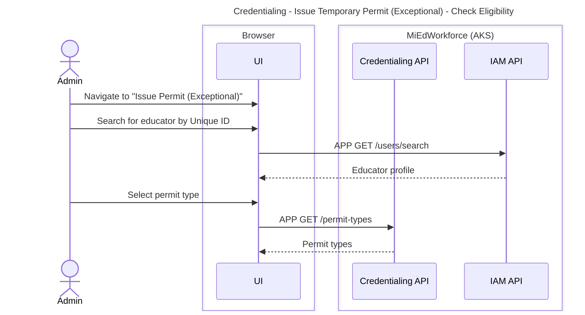
```mermaid
---
title: Credentialing - Issue Temporary Permit (Exceptional) - Check Eligibility
---
sequenceDiagram
    actor Admin
    box Browser
        participant UI
    end
    box MiEdWorkforce (AKS)
        participant CredApi as Credentialing API
        participant IamApi as IAM API
    end

    Admin->>UI: Navigate to "Issue Permit (Exceptional)"

    Admin->>UI: Search for educator by Unique ID
    UI->>IamApi: APP GET /users/search
    IamApi-->>UI: Educator profile

    Admin->>UI: Select permit type
    UI->>CredApi: APP GET /permit-types
    CredApi-->>UI: Permit types
```

**Key Decisions:**
- **Admin Authority:** Permission scope determines which educators the admin can issue permits for

**State Changes:**
- None (lookup only)

**Events Published:**
- None

**Error Scenarios:**
- None drawn here (the PPR clearance check and requirement validation happen at submission, see "Issue Temporary Permit (Exceptional) - Submit Application")

---

## Issue Temporary Permit (Exceptional) - Submit Application

**What:** Authorized administrator submits the exceptional permit issuance, which is checked against PPR clearance and permit requirements and then issued outside the standard pipeline  
**When:** Unconfirmed — see the status note in "Issue Temporary Permit (Exceptional) - Check Eligibility"  
**Who:** User with `credentialing.permit.issue` permission at appropriate scope. Permission: `credentialing.permit.issue` (System-wide, Entity, District, ISD)

**See also:** "Issue Temporary Permit (Exceptional) - Check Eligibility" (educator search and permit type).

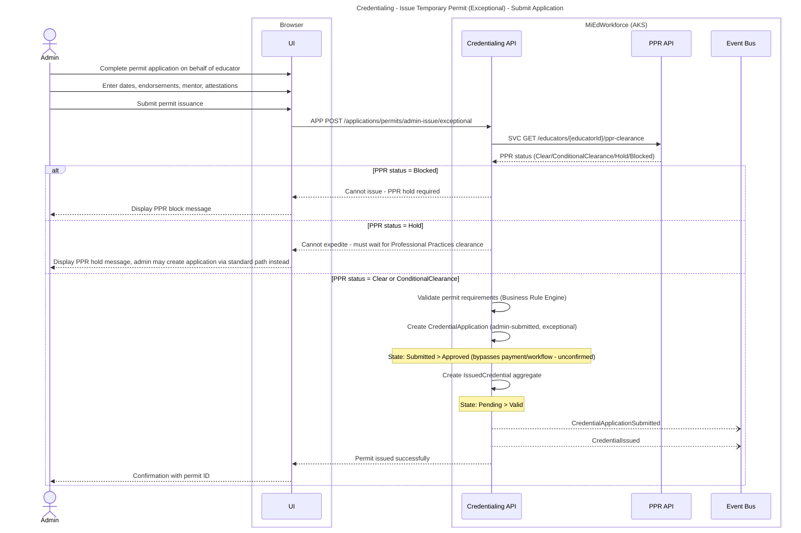
```mermaid
---
title: Credentialing - Issue Temporary Permit (Exceptional) - Submit Application
---
sequenceDiagram
    actor Admin
    box Browser
        participant UI
    end
    box MiEdWorkforce (AKS)
        participant CredApi as Credentialing API
        participant PprApi as PPR API
        participant EventBus as Event Bus
    end

    Admin->>UI: Complete permit application on behalf of educator
    Admin->>UI: Enter dates, endorsements, mentor, attestations

    Admin->>UI: Submit permit issuance
    UI->>CredApi: APP POST /applications/permits/admin-issue/exceptional

    CredApi->>PprApi: SVC GET /educators/{educatorId}/ppr-clearance
    PprApi-->>CredApi: PPR status (Clear/ConditionalClearance/Hold/Blocked)

    alt PPR status = Blocked
        CredApi-->>UI: Cannot issue - PPR hold required
        UI-->>Admin: Display PPR block message
    else PPR status = Hold
        CredApi-->>UI: Cannot expedite - must wait for Professional Practices clearance
        UI-->>Admin: Display PPR hold message, admin may create application via standard path instead
    else PPR status = Clear or ConditionalClearance
        CredApi->>CredApi: Validate permit requirements (Business Rule Engine)

        CredApi->>CredApi: Create CredentialApplication (admin-submitted, exceptional)
        Note over CredApi: State: Submitted > Approved (bypasses payment/workflow - unconfirmed)

        CredApi->>CredApi: Create IssuedCredential aggregate
        Note over CredApi: State: Pending > Valid

        CredApi--)EventBus: CredentialApplicationSubmitted
        CredApi--)EventBus: CredentialIssued

        CredApi-->>UI: Permit issued successfully
        UI-->>Admin: Confirmation with permit ID
    end
```

**Key Decisions:**
- **PPR Override:** Admins cannot override `Blocked` or `Hold` PPR status via this path even in the exceptional flow; `Blocked` requires specialist routing, `Hold` may still be created via the standard permit-application path
- **Bypass behavior:** unconfirmed — see status note above. If retained, this should require a distinct, more restrictive permission or explicit justification capture (not just `credentialing.permit.issue`, which now also gates the standard, non-bypassing "Submit Permit Application" path) so that bypassing payment/review is itself an audited, deliberate act rather than an incidental side effect of which UI screen an admin happens to use.

**State Changes:**
- CredentialApplication: `Draft` > `Submitted` > `Approved` (bypasses payment/workflow - unconfirmed)
- IssuedCredential: `Pending` > `Valid`

**Events Published:**
- `CredentialApplicationSubmitted` - Audit trail
- `CredentialIssued` - Notifies downstream systems of new credential

**Error Scenarios:**
- PPR status = `Blocked` > Block issuance, require specialist review
- Eligibility validation fails > Display errors, allow admin to correct

---

## Add Endorsement to Certificate

**What:** Educator applies to add a subject area endorsement to their existing teaching certificate  
**When:** Educator has completed required coursework and subject area assessment for a new subject  
**Who:** Authenticated educator with valid teaching certificate. Permission: `credentialing.endorsement.add` (self-only, via application)

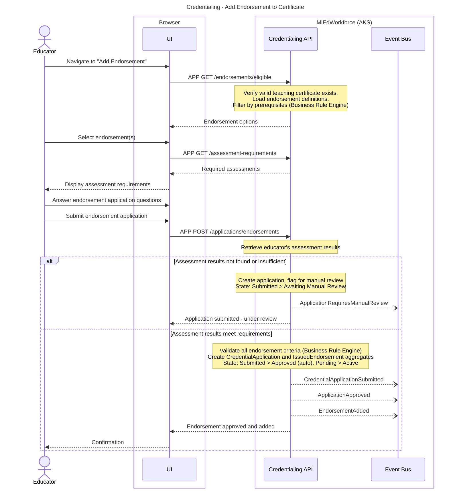
```mermaid
---
title: Credentialing - Add Endorsement to Certificate
---
sequenceDiagram
    actor Educator
    box Browser
        participant UI
    end
    box MiEdWorkforce (AKS)
        participant CredApi as Credentialing API
        participant EventBus as Event Bus
    end

    Educator->>UI: Navigate to "Add Endorsement"
    UI->>CredApi: APP GET /endorsements/eligible
    Note over CredApi: Verify valid teaching certificate exists.<br/>Load endorsement definitions.<br/>Filter by prerequisites (Business Rule Engine)
    CredApi-->>UI: Endorsement options

    Educator->>UI: Select endorsement(s)
    UI->>CredApi: APP GET /assessment-requirements
    CredApi-->>UI: Required assessments
    UI-->>Educator: Display assessment requirements

    Educator->>UI: Answer endorsement application questions
    Educator->>UI: Submit endorsement application
    UI->>CredApi: APP POST /applications/endorsements
    Note over CredApi: Retrieve educator's assessment results

    alt Assessment results not found or insufficient
        Note over CredApi: Create application, flag for manual review<br/>State: Submitted > Awaiting Manual Review
        CredApi--)EventBus: ApplicationRequiresManualReview
        CredApi-->>UI: Application submitted - under review
    else Assessment results meet requirements
        Note over CredApi: Validate all endorsement criteria (Business Rule Engine)<br/>Create CredentialApplication and IssuedEndorsement aggregates<br/>State: Submitted > Approved (auto), Pending > Active
        CredApi--)EventBus: CredentialApplicationSubmitted
        CredApi--)EventBus: ApplicationApproved
        CredApi--)EventBus: EndorsementAdded
        CredApi-->>UI: Endorsement approved and added
        UI-->>Educator: Confirmation
    end
```

**Key Decisions:**
- **Assessment Validation:** If results don't meet requirements, flag for external manual review
- **Auto-Approval:** If all criteria met (assessment scores, prerequisites, payment), approve immediately
- **Multiple Endorsements:** User may apply for multiple endorsements in single application
- **No PPR Check:** Unlike new-certificate, permit, and renewal applications, endorsement-addition applications do not check `ProfessionalPracticeStatus`/PPR clearance at all — confirmed by FDD 29 ("29 - Educator Credentialing - Certificates"), whose Feature 29.3 (Additional Endorsements) narrative and acceptance criteria consistently omit "route based on PPR flag"/"Needs Responses" language that appears in every other application-type's feature description in the same document. This is a deliberate business-rule difference, not an oversight in this sequence — see `credentialing-domain.md`'s "Auto-Approval Criteria" business rule, which otherwise reads as if `ProfessionalPracticeStatus = Clear` is a universal condition for all `CredentialApplication` types.

**State Changes:**
- CredentialApplication: `Submitted` > `Approved` (auto) or `Awaiting Manual Review` (manual)
- IssuedEndorsement: `Pending` > `Active`

**Events Published:**
- `CredentialApplicationSubmitted` - Application created
- `ApplicationApproved` - Auto-approval occurred
- `EndorsementAdded` - New endorsement now active on certificate
- `ApplicationRequiresManualReview` - Manual review required by external workflow service

**Error Scenarios:**
- No valid teaching certificate > Block application, display error
- Assessment results insufficient > Flag for manual review, notify educator of review timeline

---

## Renew Credential - Check Eligibility

**What:** Educator renews an expiring certificate or permit  
**When:** Credential is approaching expiration or has expired (within grace period)  
**Who:** Authenticated educator with renewable credential. Permission: `credentialing.application.submit` (self-only)

**See also:** "Renew Credential - Submit Application" (renewal submission and PPR check).

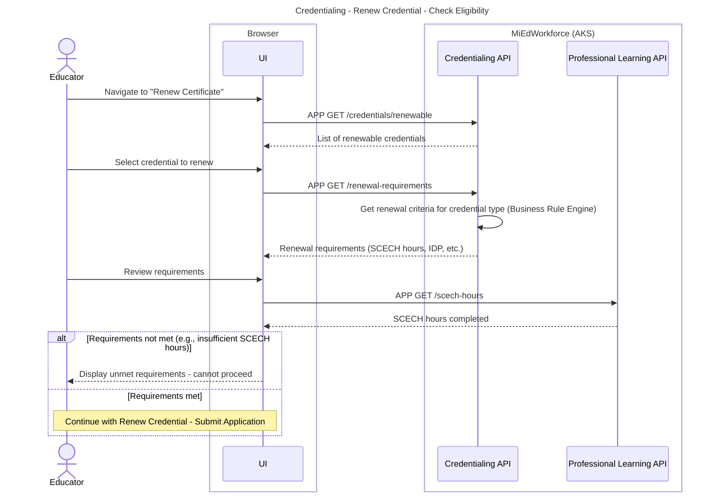
```mermaid
---
title: Credentialing - Renew Credential - Check Eligibility
---
sequenceDiagram
    actor Educator
    box Browser
        participant UI
    end
    box MiEdWorkforce (AKS)
        participant CredApi as Credentialing API
        participant ProfLearnApi as Professional Learning API
    end

    Educator->>UI: Navigate to "Renew Certificate"
    UI->>CredApi: APP GET /credentials/renewable
    CredApi-->>UI: List of renewable credentials

    Educator->>UI: Select credential to renew
    UI->>CredApi: APP GET /renewal-requirements
    CredApi->>CredApi: Get renewal criteria for credential type (Business Rule Engine)
    CredApi-->>UI: Renewal requirements (SCECH hours, IDP, etc.)

    Educator->>UI: Review requirements
    UI->>ProfLearnApi: APP GET /scech-hours
    ProfLearnApi-->>UI: SCECH hours completed

    alt Requirements not met (e.g., insufficient SCECH hours)
        UI-->>Educator: Display unmet requirements - cannot proceed
    else Requirements met
        Note over Educator,UI: Continue with Renew Credential - Submit Application
    end
```

**Key Decisions:**
- **Renewal Eligibility:** System checks if credential is renewable (not suspended/revoked, within renewal window)
- **SCECH Requirements:** Professional Learning domain provides hours completed; renewal blocked if insufficient. **Open item (2026-08-27):** the `GET /scech-hours?educatorId={id}&credentialType={type}` call shown above has no matching endpoint in `proflearning-api.yml` — `proflearning-domain.md`'s own Downstream dependency table instead expects Credentialing to maintain a running SCECH balance via event subscription (`AttendanceCertified`, `SCECHAwardAdjusted`, `CollegeCourseApplied`) rather than a live query. See [14-professional-learning-admin](../../fdd-sdd-review/reviews/14-professional-learning-admin.md) Discrepancy #1.

**State Changes:**
- None (lookup only)

**Events Published:**
- None

**Error Scenarios:**
- Credential not renewable (suspended/revoked) > Display error, suggest new application
- SCECH hours insufficient > Block submission, display shortfall
- Renewal window expired > Display error, may require new application instead

---

## Renew Credential - Submit Application

**What:** Educator submits the renewal application for an expiring certificate or permit  
**When:** Requirements are met in "Renew Credential - Check Eligibility"  
**Who:** Authenticated educator with renewable credential. Permission: `credentialing.application.submit` (self-only)

**See also:** "Renew Credential - Check Eligibility" (renewable list, requirements and SCECH hours), "Evaluate PPR Clearance for Credential Application" (PPR clearance rules).

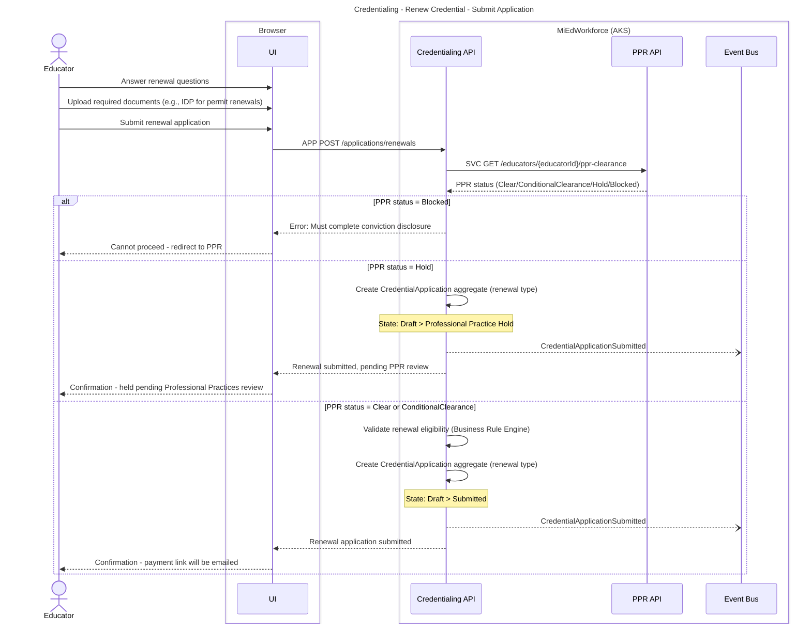
```mermaid
---
title: Credentialing - Renew Credential - Submit Application
---
sequenceDiagram
    actor Educator
    box Browser
        participant UI
    end
    box MiEdWorkforce (AKS)
        participant CredApi as Credentialing API
        participant PprApi as PPR API
        participant EventBus as Event Bus
    end

    Educator->>UI: Answer renewal questions
    Educator->>UI: Upload required documents (e.g., IDP for permit renewals)
    Educator->>UI: Submit renewal application

    UI->>CredApi: APP POST /applications/renewals
    CredApi->>PprApi: SVC GET /educators/{educatorId}/ppr-clearance
    PprApi-->>CredApi: PPR status (Clear/ConditionalClearance/Hold/Blocked)

    alt PPR status = Blocked
        CredApi-->>UI: Error: Must complete conviction disclosure
        UI-->>Educator: Cannot proceed - redirect to PPR
    else PPR status = Hold
        CredApi->>CredApi: Create CredentialApplication aggregate (renewal type)
        Note over CredApi: State: Draft > Professional Practice Hold
        CredApi--)EventBus: CredentialApplicationSubmitted
        CredApi-->>UI: Renewal submitted, pending PPR review
        UI-->>Educator: Confirmation - held pending Professional Practices review
    else PPR status = Clear or ConditionalClearance
        CredApi->>CredApi: Validate renewal eligibility (Business Rule Engine)
        CredApi->>CredApi: Create CredentialApplication aggregate (renewal type)
        Note over CredApi: State: Draft > Submitted

        CredApi--)EventBus: CredentialApplicationSubmitted
        CredApi-->>UI: Renewal application submitted
        UI-->>Educator: Confirmation - payment link will be emailed
    end
```

**Key Decisions:**
- **PPR Status:** Same gating as new-certificate/permit submission — `Blocked` prevents the renewal from being created at all; `Hold` creates the renewal but holds it pending Professional Practices review; `Clear`/`ConditionalClearance` proceed to BRM eligibility validation. Added 2026-08-27 per FDD 29's "Apply/Renew" landing-page action, which treats new applications and renewals as the same flow and lists "Route or assign the application to worklist(s) based on the PPR flag" and "Determine the status of the application based on the Needs Responses flag" identically for both — this sequence previously had no PPR check at all, unlike "Submit New Certificate Application" and "Submit Permit Application."
- **Document Requirements:** Some permit renewals require IDP or other proof of progress. **Open item (2026-08-27):** this document-upload treatment conflicts with `credentialing-domain.md`'s "Individual Development Plan (IDP) for Permit Renewals" rule, which describes a structured `GET /educators/{uniqueId}/idp/status` validation call — an endpoint that doesn't exist, on a domain (`proflearning`) with no IDP aggregate at all. See same review, Discrepancy #1.

**State Changes:**
- CredentialApplication: `Draft` > `Submitted`, or `Draft` > `Professional Practice Hold` (if PPR status = `Hold`)

**Events Published:**
- `CredentialApplicationSubmitted` - Triggers payment processing and external routing

**Error Scenarios:**
- PPR status = `Blocked` > Block renewal, redirect to complete disclosure
- Validation fails > Display renewal criteria not met and the specific issues, do not create application

---

## Auto-Approve Application

**What:** System automatically approves application when all business rules are satisfied  
**When:** Application submitted and all validation checks pass (PPR clear, payment received, documents complete, assessment results verified)  
**Who:** System process. Permission: none (event-driven system process, no user token)

**See also:** "Auto-Approval Held for Manual Review" (PPR hold or conditional clearance, business rule failure).

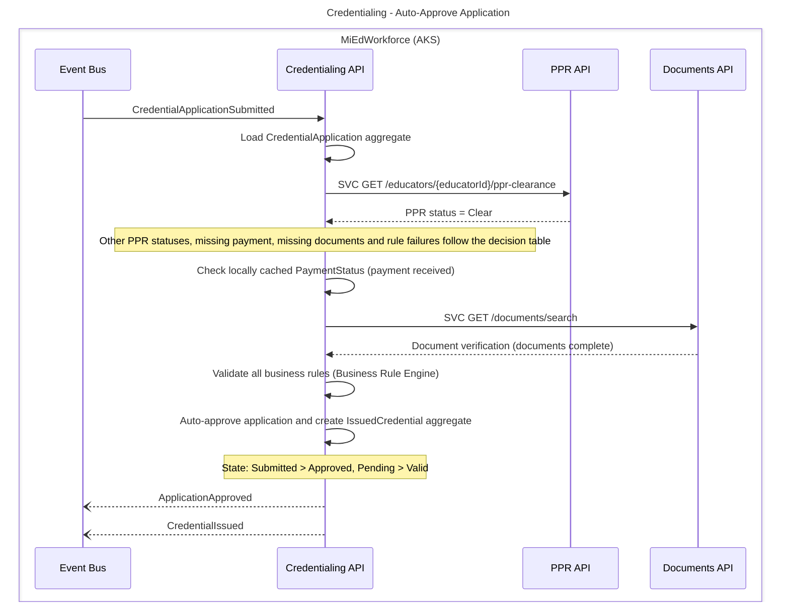
```mermaid
---
title: Credentialing - Auto-Approve Application
---
sequenceDiagram
    box MiEdWorkforce (AKS)
        participant EventBus as Event Bus
        participant CredApi as Credentialing API
        participant PprApi as PPR API
        participant DocsApi as Documents API
    end

    EventBus->>CredApi: CredentialApplicationSubmitted
    CredApi->>CredApi: Load CredentialApplication aggregate

    CredApi->>PprApi: SVC GET /educators/{educatorId}/ppr-clearance
    PprApi-->>CredApi: PPR status = Clear

    Note over CredApi: Other PPR statuses, missing payment, missing documents and rule failures follow the decision table
    CredApi->>CredApi: Check locally cached PaymentStatus (payment received)

    CredApi->>DocsApi: SVC GET /documents/search
    DocsApi-->>CredApi: Document verification (documents complete)

    CredApi->>CredApi: Validate all business rules (Business Rule Engine)
    CredApi->>CredApi: Auto-approve application and create IssuedCredential aggregate
    Note over CredApi: State: Submitted > Approved, Pending > Valid

    CredApi--)EventBus: ApplicationApproved
    CredApi--)EventBus: CredentialIssued
```

**Key Decisions:**
- **PPR Check:** First gate - `Hold` or `Blocked` status triggers Professional Practice Hold; `ConditionalClearance` cannot auto-approve and always routes to manual review (with felony acknowledgment requirement if applicable), even though the application isn't held; only `Clear` proceeds to payment/document/business-rule validation for possible auto-approval
- **Payment Check:** Second gate - no payment means "Pending Payment" status. **Unresolved:** the endpoint/mechanism for checking current payment status isn't confirmed — `payments-api.yml` has no internal-service "get payment status for an application" endpoint; the closest is `GET /payments/search?applicationId={id}`, but that's a scoped, permission-gated, org-context-requiring search endpoint built for admin/UI use, not obviously suited to service-to-service polling. This gate may need to rely purely on the `PaymentCompleted` event subscription (no synchronous check at all) rather than inventing a call to an endpoint not built for this purpose — see `credentialing-technical-design.md` Open Technical Question #7.
- **Document Check:** Third gate - missing docs means "Pending Documents" status
- **Business Rules:** Final gate - assessment results, eligibility, etc. If any fail, flag for manual review

**Decision Table:**

| Order | Gate | Outcome | Resulting status | Event | Diagram |
|---|---|---|---|---|---|
| 1 | PPR status = Hold or Blocked | Stop | Professional Practice Hold | `ApplicationRequiresManualReview` | Auto-Approval Held for Manual Review |
| 1 | PPR status = ConditionalClearance | Stop, cannot auto-approve (felony acknowledgment requirement set if indicated) | Awaiting Manual Review | `ApplicationRequiresManualReview` | Auto-Approval Held for Manual Review |
| 2 | PPR status = Clear, payment not received | Wait for the `PaymentCompleted` event (payments-capability.md), not the previously-referenced `PaymentReceived`, which does not exist | Pending Payment | none | Not drawn |
| 3 | Payment received, required documents missing | Stop | Pending Documents | none | Not drawn |
| 4 | Documents complete, assessment results or other validation fails | Flag for manual review | Awaiting Manual Review | `ApplicationRequiresManualReview` | Auto-Approval Held for Manual Review |
| 4 | Documents complete, all validations pass | Auto-approve and create credential | Approved | `ApplicationApproved`, `CredentialIssued` | This diagram |

**State Changes:**
- CredentialApplication: `Submitted` > `Approved` (happy path) or `Pending Payment` / `Pending Documents` (see decision table; manual review and hold states are in "Auto-Approval Held for Manual Review")
- IssuedCredential: `Pending` > `Valid` (when approved)

**Events Published:**
- `ApplicationApproved` - Application auto-approved
- `CredentialIssued` - Credential created and now valid

**Error Scenarios:**
- Any validation failure > Set appropriate status or flag for external manual review

---

## Auto-Approval Held for Manual Review

**What:** System holds an application or routes it to manual review instead of auto-approving it  
**When:** Application submitted and PPR status is Hold, Blocked or ConditionalClearance, or the business rules fail after payment and documents are in order  
**Who:** System process. Permission: none (event-driven system process, no user token)

**See also:** "Auto-Approve Application" (happy path and the decision table).

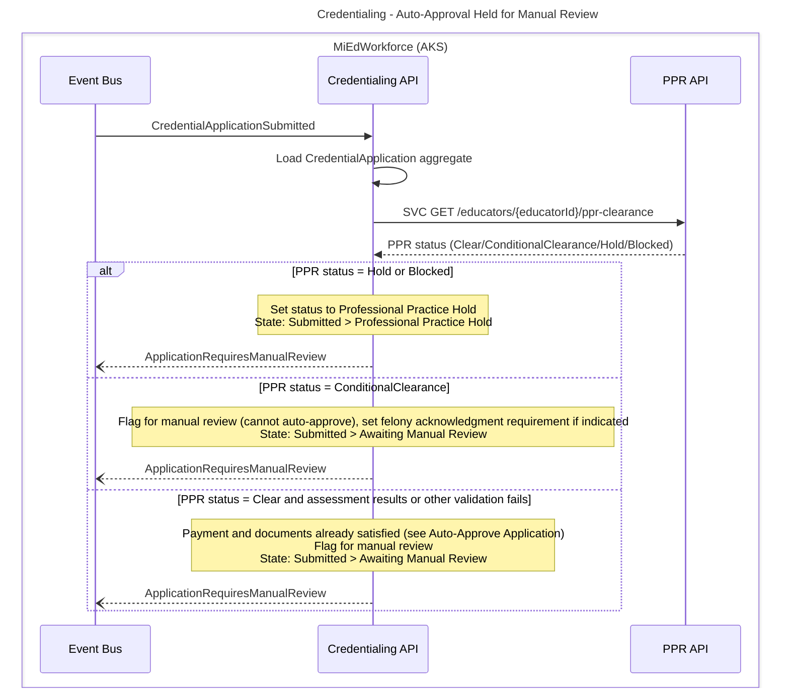
```mermaid
---
title: Credentialing - Auto-Approval Held for Manual Review
---
sequenceDiagram
    box MiEdWorkforce (AKS)
        participant EventBus as Event Bus
        participant CredApi as Credentialing API
        participant PprApi as PPR API
    end

    EventBus->>CredApi: CredentialApplicationSubmitted
    CredApi->>CredApi: Load CredentialApplication aggregate

    CredApi->>PprApi: SVC GET /educators/{educatorId}/ppr-clearance
    PprApi-->>CredApi: PPR status (Clear/ConditionalClearance/Hold/Blocked)

    alt PPR status = Hold or Blocked
        Note over CredApi: Set status to Professional Practice Hold<br/>State: Submitted > Professional Practice Hold
        CredApi--)EventBus: ApplicationRequiresManualReview
    else PPR status = ConditionalClearance
        Note over CredApi: Flag for manual review (cannot auto-approve), set felony acknowledgment requirement if indicated<br/>State: Submitted > Awaiting Manual Review
        CredApi--)EventBus: ApplicationRequiresManualReview
    else PPR status = Clear and assessment results or other validation fails
        Note over CredApi: Payment and documents already satisfied (see Auto-Approve Application)<br/>Flag for manual review<br/>State: Submitted > Awaiting Manual Review
        CredApi--)EventBus: ApplicationRequiresManualReview
    end
```

**Key Decisions:**
- **PPR Check:** First gate - `Hold` or `Blocked` status triggers Professional Practice Hold; `ConditionalClearance` cannot auto-approve and always routes to manual review (with felony acknowledgment requirement if applicable), even though the application isn't held
- **Business Rules:** Final gate - assessment results, eligibility, etc. If any fail, flag for manual review

**State Changes:**
- CredentialApplication: `Submitted` > `Professional Practice Hold` or `Awaiting Manual Review`

**Events Published:**
- `ApplicationRequiresManualReview` - Manual review required (application becomes visible via Credentialing's own filtered application list)

**Error Scenarios:**
- Any validation failure > Set appropriate status or flag for external manual review

---

## Application Manual Review and Approval

**What:** Credential processor reviews application and takes action (approve/deny/hold)  
**When:** Application flagged for manual review due to PPR status, assessment failure, or other manual review trigger  
**Who:** Credential processor, working the flagged-application list through Credentialing's own list/detail/approve/deny endpoints. Permission: `credentialing.application.view` to load details, then `credentialing.application.approve`, `credentialing.application.deny` or `credentialing.application.place-hold` (system-wide or assigned-only)

**Note:** This sequence represents a processor's reviewer UI querying Credentialing's own filtered application list and detail endpoints, then acting via the existing approve/deny/hold endpoints — not a separate workflow or worklist system. (See `credentialing-domain.md` Open Question #34 for the unresolved question of whether reviewer-to-application assignment needs its own design beyond this filtered-list pattern.)

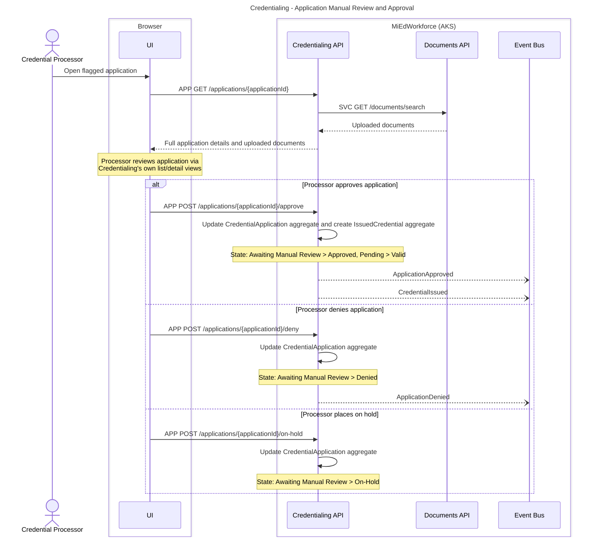
```mermaid
---
title: Credentialing - Application Manual Review and Approval
---
sequenceDiagram
    actor Processor as Credential Processor
    box Browser
        participant UI
    end
    box MiEdWorkforce (AKS)
        participant CredApi as Credentialing API
        participant DocsApi as Documents API
        participant EventBus as Event Bus
    end

    Processor->>UI: Open flagged application
    UI->>CredApi: APP GET /applications/{applicationId}
    CredApi->>DocsApi: SVC GET /documents/search
    DocsApi-->>CredApi: Uploaded documents
    CredApi-->>UI: Full application details and uploaded documents

    Note over UI: Processor reviews application via<br/>Credentialing's own list/detail views

    alt Processor approves application
        UI->>CredApi: APP POST /applications/{applicationId}/approve
        CredApi->>CredApi: Update CredentialApplication aggregate and create IssuedCredential aggregate
        Note over CredApi: State: Awaiting Manual Review > Approved, Pending > Valid

        CredApi--)EventBus: ApplicationApproved
        CredApi--)EventBus: CredentialIssued

    else Processor denies application
        UI->>CredApi: APP POST /applications/{applicationId}/deny
        CredApi->>CredApi: Update CredentialApplication aggregate
        Note over CredApi: State: Awaiting Manual Review > Denied

        CredApi--)EventBus: ApplicationDenied

    else Processor places on hold
        UI->>CredApi: APP POST /applications/{applicationId}/on-hold
        CredApi->>CredApi: Update CredentialApplication aggregate
        Note over CredApi: State: Awaiting Manual Review > On-Hold
    end
```

**Key Decisions:**
- **Approve:** Credential issued immediately, educator notified
- **Deny:** Application rejected, educator notified with reason
- **On-Hold:** Application remains flagged in the application list for follow-up

**State Changes:**
- CredentialApplication: `Awaiting Manual Review` > `Approved` / `Denied` / `On-Hold`
- IssuedCredential: `Pending` > `Valid` (if approved)

**Events Published:**
- `ApplicationApproved` - Manual approval
- `ApplicationDenied` - Manual denial
- `CredentialIssued` - Credential created and valid

**Error Scenarios:**
- Application already processed > Display conflict error

---

## Suspend or Revoke Credential

**What:** Administrator suspends or permanently revokes an educator's credential  
**When:** Professional misconduct, legal issues, or compliance violations identified  
**Who:** User with `credentialing.credential.suspend` or `credentialing.credential.revoke` permission (System Admin). Permission: `credentialing.credential.suspend` or `credentialing.credential.revoke` (System-wide)

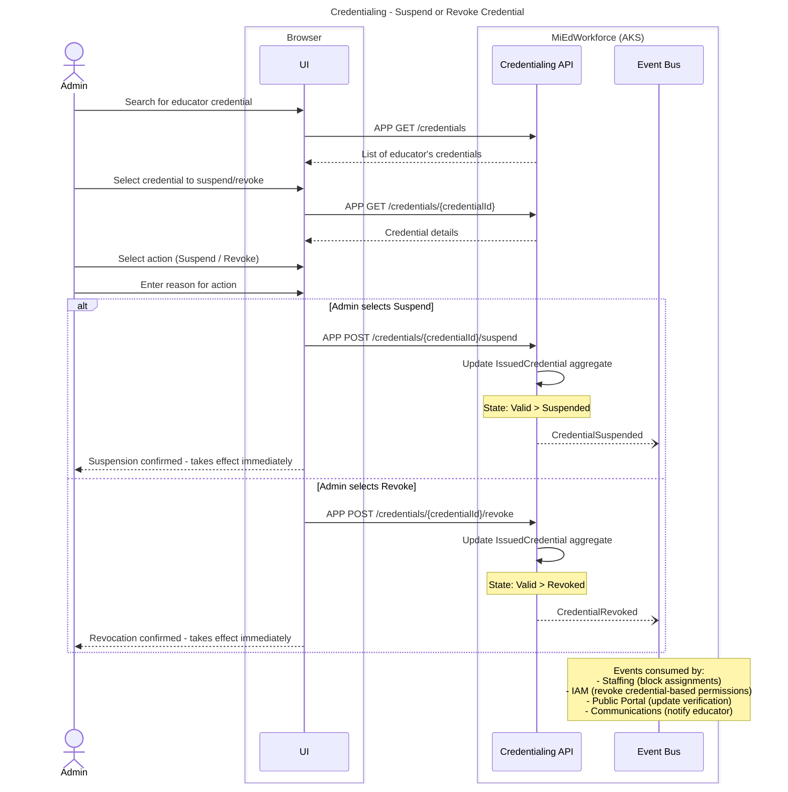
```mermaid
---
title: Credentialing - Suspend or Revoke Credential
---
sequenceDiagram
    actor Admin
    box Browser
        participant UI
    end
    box MiEdWorkforce (AKS)
        participant CredApi as Credentialing API
        participant EventBus as Event Bus
    end

    Admin->>UI: Search for educator credential
    UI->>CredApi: APP GET /credentials
    CredApi-->>UI: List of educator's credentials

    Admin->>UI: Select credential to suspend/revoke
    UI->>CredApi: APP GET /credentials/{credentialId}
    CredApi-->>UI: Credential details

    Admin->>UI: Select action (Suspend / Revoke)
    Admin->>UI: Enter reason for action

    alt Admin selects Suspend
        UI->>CredApi: APP POST /credentials/{credentialId}/suspend
        CredApi->>CredApi: Update IssuedCredential aggregate
        Note over CredApi: State: Valid > Suspended

        CredApi--)EventBus: CredentialSuspended

        UI-->>Admin: Suspension confirmed - takes effect immediately

    else Admin selects Revoke
        UI->>CredApi: APP POST /credentials/{credentialId}/revoke
        CredApi->>CredApi: Update IssuedCredential aggregate
        Note over CredApi: State: Valid > Revoked

        CredApi--)EventBus: CredentialRevoked

        UI-->>Admin: Revocation confirmed - takes effect immediately
    end

    Note over EventBus: Events consumed by:<br/>- Staffing (block assignments)<br/>- IAM (revoke credential-based permissions)<br/>- Public Portal (update verification)<br/>- Communications (notify educator)
```

**Key Decisions:**
- **Suspend vs. Revoke:** Suspension is temporary (can be reinstated), revocation is permanent
- **Immediate Effect:** State change must propagate to all systems as quickly as possible

**State Changes:**
- IssuedCredential: `Valid` > `Suspended` or `Revoked`

**Events Published:**
- `CredentialSuspended` - Credential temporarily invalidated
- `CredentialRevoked` - Credential permanently invalidated

**Error Scenarios:**
- Admin lacks permission > Access denied
- Credential already suspended/revoked > Display current state, prevent duplicate action

---

## Nullify Endorsement

**What:** Administrator removes an endorsement from an educator's certificate  
**When:** Administrative error correction or compliance action  
**Who:** User with `credentialing.endorsement.nullify` permission (System Admin). Permission: `credentialing.endorsement.nullify` (System-wide)

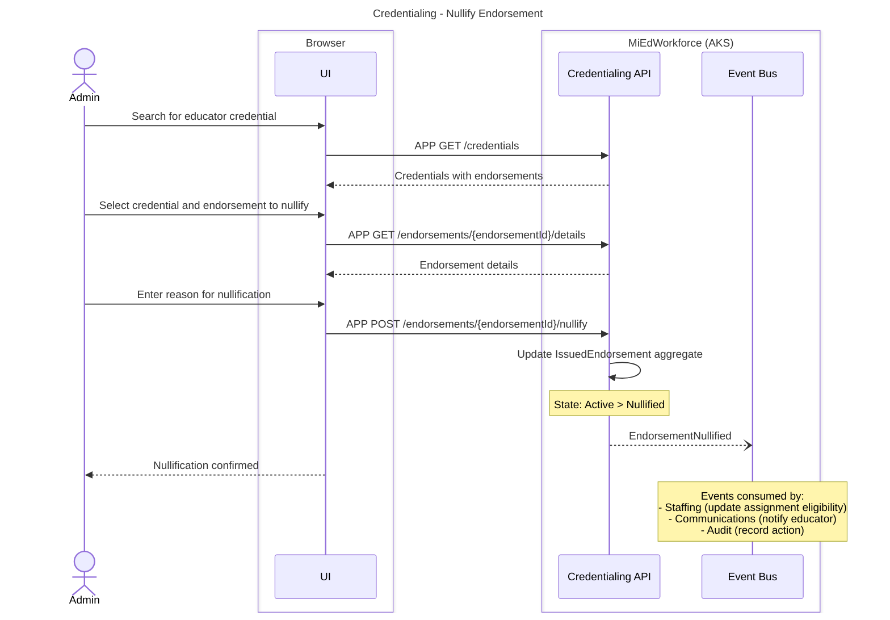
```mermaid
---
title: Credentialing - Nullify Endorsement
---
sequenceDiagram
    actor Admin
    box Browser
        participant UI
    end
    box MiEdWorkforce (AKS)
        participant CredApi as Credentialing API
        participant EventBus as Event Bus
    end

    Admin->>UI: Search for educator credential
    UI->>CredApi: APP GET /credentials
    CredApi-->>UI: Credentials with endorsements

    Admin->>UI: Select credential and endorsement to nullify
    UI->>CredApi: APP GET /endorsements/{endorsementId}/details
    CredApi-->>UI: Endorsement details

    Admin->>UI: Enter reason for nullification
    UI->>CredApi: APP POST /endorsements/{endorsementId}/nullify
    CredApi->>CredApi: Update IssuedEndorsement aggregate
    Note over CredApi: State: Active > Nullified

    CredApi--)EventBus: EndorsementNullified

    UI-->>Admin: Nullification confirmed

    Note over EventBus: Events consumed by:<br/>- Staffing (update assignment eligibility)<br/>- Communications (notify educator)<br/>- Audit (record action)
```

**Key Decisions:**
- **Nullification Reason:** Required for audit trail and educator notification

**State Changes:**
- IssuedEndorsement: `Active` > `Nullified`

**Events Published:**
- `EndorsementNullified` - Endorsement removed from certificate

**Error Scenarios:**
- Admin lacks permission > Access denied
- Endorsement already nullified > Display current state

---

## Bulk Renewal Initiation

**What:** Administrator initiates renewal process for multiple educators at once  
**When:** Annual renewal cycle or targeted renewal for specific credential types  
**Who:** User with `credentialing.application.manual-submit` permission. Permission: `credentialing.application.manual-submit` (System-wide, Entity, District, ISD)

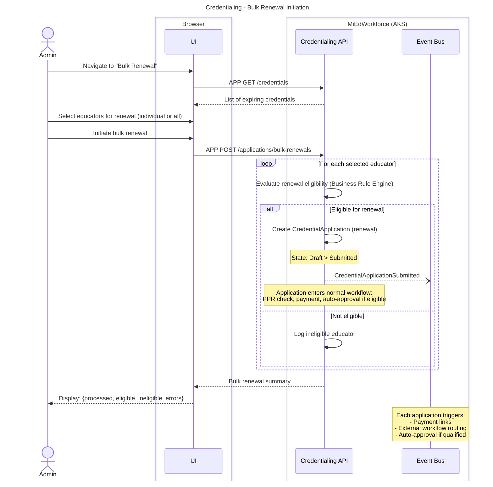
```mermaid
---
title: Credentialing - Bulk Renewal Initiation
---
sequenceDiagram
    actor Admin
    box Browser
        participant UI
    end
    box MiEdWorkforce (AKS)
        participant CredApi as Credentialing API
        participant EventBus as Event Bus
    end

    Admin->>UI: Navigate to "Bulk Renewal"
    UI->>CredApi: APP GET /credentials
    CredApi-->>UI: List of expiring credentials

    Admin->>UI: Select educators for renewal (individual or all)
    Admin->>UI: Initiate bulk renewal

    UI->>CredApi: APP POST /applications/bulk-renewals

    loop For each selected educator
        CredApi->>CredApi: Evaluate renewal eligibility (Business Rule Engine)

        alt Eligible for renewal
            CredApi->>CredApi: Create CredentialApplication (renewal)
            Note over CredApi: State: Draft > Submitted
            CredApi--)EventBus: CredentialApplicationSubmitted
            Note over CredApi: Application enters normal workflow:<br/>PPR check, payment, auto-approval if eligible
        else Not eligible
            CredApi->>CredApi: Log ineligible educator
        end
    end

    CredApi-->>UI: Bulk renewal summary
    UI-->>Admin: Display: {processed, eligible, ineligible, errors}

    Note over EventBus: Each application triggers:<br/>- Payment links<br/>- External workflow routing<br/>- Auto-approval if qualified
```

**Key Decisions:**
- **Eligibility Filtering:** BRM evaluates PPR status, payment status, etc.
- **Workflow Routing:** Each renewal enters normal application workflow (may auto-approve or flag for external review)

**State Changes:**
- CredentialApplication: `Draft` > `Submitted` (for each eligible educator)

**Events Published:**
- `CredentialApplicationSubmitted` - One event per renewal initiated

**Error Scenarios:**
- Educator ineligible (PPR status, etc.) > Skip, log in summary
- System error during processing > Rollback batch, display error

---

## Print Certificate

**What:** Educator or administrator prints an official credential certificate  
**When:** Credential issued or renewed, educator needs physical copy  
**Who:** Authenticated educator (self) or admin with `credentialing.credential.print` permission. Permission: `credentialing.credential.print` (self-only for educators, system-wide for admins)

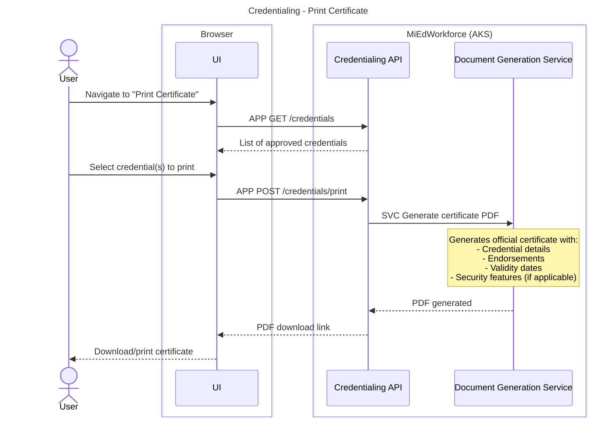
```mermaid
---
title: Credentialing - Print Certificate
---
sequenceDiagram
    actor User
    box Browser
        participant UI
    end
    box MiEdWorkforce (AKS)
        participant CredApi as Credentialing API
        participant PdfGen as Document Generation Service
    end

    User->>UI: Navigate to "Print Certificate"
    UI->>CredApi: APP GET /credentials
    CredApi-->>UI: List of approved credentials

    User->>UI: Select credential(s) to print
    UI->>CredApi: APP POST /credentials/print
    CredApi->>PdfGen: SVC Generate certificate PDF

    Note over PdfGen: Generates official certificate with:<br/>- Credential details<br/>- Endorsements<br/>- Validity dates<br/>- Security features (if applicable)

    PdfGen-->>CredApi: PDF generated
    CredApi-->>UI: PDF download link
    UI-->>User: Download/print certificate
```

**Key Decisions:**
- **Security Features:** Certificates may include watermarks, security codes, or other anti-fraud measures
- **Multiple Selection:** User can print multiple certificates in batch

**State Changes:**
- None (read-only operation)

**Events Published:**
- None (audit log may record print action)

**Error Scenarios:**
- No approved credentials > Display message
- PDF generation fails > Retry, display error

---

## Delete Pending Application

**What:** Educator deletes their own application before processing begins  
**When:** Educator submitted application but wants to withdraw before review  
**Who:** Authenticated educator (self-only). Permission: `credentialing.application.delete` (self-only, Submitted status only)

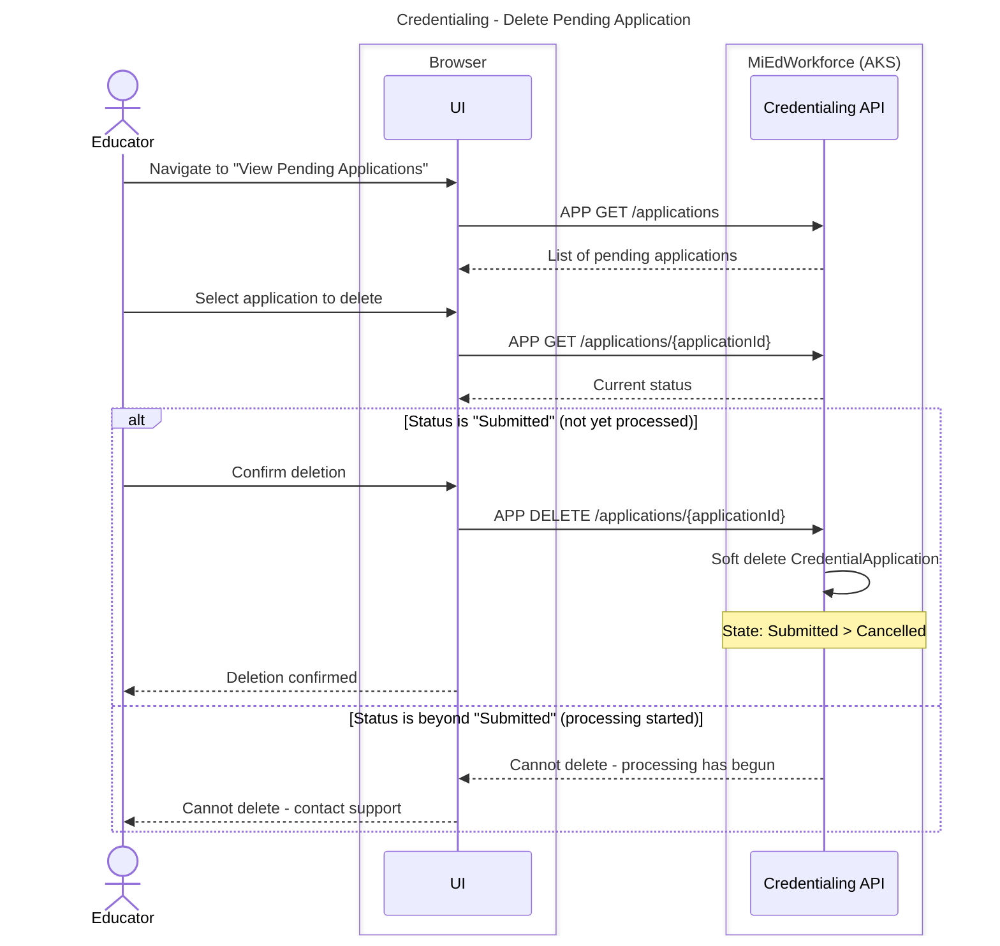
```mermaid
---
title: Credentialing - Delete Pending Application
---
sequenceDiagram
    actor Educator
    box Browser
        participant UI
    end
    box MiEdWorkforce (AKS)
        participant CredApi as Credentialing API
    end

    Educator->>UI: Navigate to "View Pending Applications"
    UI->>CredApi: APP GET /applications
    CredApi-->>UI: List of pending applications

    Educator->>UI: Select application to delete
    UI->>CredApi: APP GET /applications/{applicationId}
    CredApi-->>UI: Current status

    alt Status is "Submitted" (not yet processed)
        Educator->>UI: Confirm deletion
        UI->>CredApi: APP DELETE /applications/{applicationId}
        CredApi->>CredApi: Soft delete CredentialApplication
        Note over CredApi: State: Submitted > Cancelled

        UI-->>Educator: Deletion confirmed

    else Status is beyond "Submitted" (processing started)
        CredApi-->>UI: Cannot delete - processing has begun
        UI-->>Educator: Cannot delete - contact support
    end
```

**Key Decisions:**
- **Deletion Window:** Only applications in "Submitted" status can be deleted by educator
- **Soft Delete:** Application marked as cancelled, not physically deleted (audit trail)

**State Changes:**
- CredentialApplication: `Submitted` > `Cancelled`

**Events Published:**
- None (or optional `ApplicationCancelled` for audit)

**Error Scenarios:**
- Application already processing > Display error, suggest contacting support
- Application not found > Display error

---

## Configure Credential Definition

**What:** Administrator creates a new credential definition or updates an existing one with versioning  
**When:** State policy changes, new credential types introduced, or corrections needed  
**Who:** User with `credentialing.credential-definition.manage` permission (System Admin). Permission: `credentialing.credential-definition.manage` (System-wide)

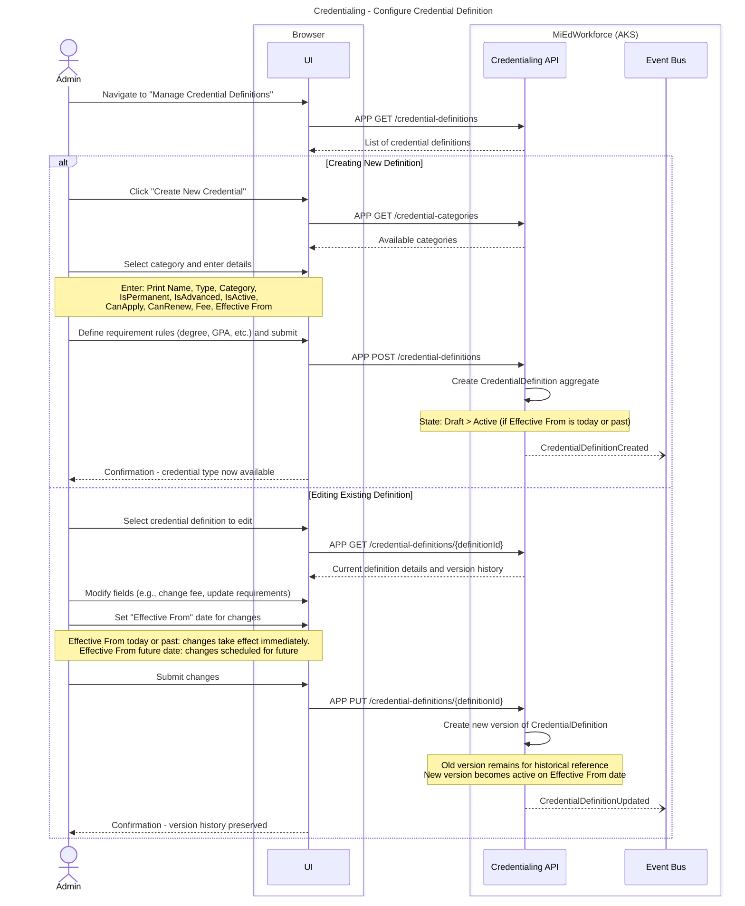
```mermaid
---
title: Credentialing - Configure Credential Definition
---
sequenceDiagram
    actor Admin
    box Browser
        participant UI
    end
    box MiEdWorkforce (AKS)
        participant CredApi as Credentialing API
        participant EventBus as Event Bus
    end

    Admin->>UI: Navigate to "Manage Credential Definitions"
    UI->>CredApi: APP GET /credential-definitions
    CredApi-->>UI: List of credential definitions

    alt Creating New Definition
        Admin->>UI: Click "Create New Credential"
        UI->>CredApi: APP GET /credential-categories
        CredApi-->>UI: Available categories

        Admin->>UI: Select category and enter details
        Note over Admin,UI: Enter: Print Name, Type, Category,<br/>IsPermanent, IsAdvanced, IsActive,<br/>CanApply, CanRenew, Fee, Effective From

        Admin->>UI: Define requirement rules (degree, GPA, etc.) and submit
        UI->>CredApi: APP POST /credential-definitions
        CredApi->>CredApi: Create CredentialDefinition aggregate
        Note over CredApi: State: Draft > Active (if Effective From is today or past)

        CredApi--)EventBus: CredentialDefinitionCreated
        UI-->>Admin: Confirmation - credential type now available

    else Editing Existing Definition
        Admin->>UI: Select credential definition to edit
        UI->>CredApi: APP GET /credential-definitions/{definitionId}
        CredApi-->>UI: Current definition details and version history

        Admin->>UI: Modify fields (e.g., change fee, update requirements)
        Admin->>UI: Set "Effective From" date for changes
        Note over Admin,UI: Effective From today or past: changes take effect immediately.<br/>Effective From future date: changes scheduled for future

        Admin->>UI: Submit changes
        UI->>CredApi: APP PUT /credential-definitions/{definitionId}

        CredApi->>CredApi: Create new version of CredentialDefinition
        Note over CredApi: Old version remains for historical reference<br/>New version becomes active on Effective From date

        CredApi--)EventBus: CredentialDefinitionUpdated
        UI-->>Admin: Confirmation - version history preserved
    end
```

**Key Decisions:**
- **Versioning:** All changes create new versions rather than overwriting existing definitions
- **Effective Dating:** Determines when changes become active; future dates allow scheduled updates
- **Historical Preservation:** Old versions remain accessible for audit and in-progress applications

**State Changes:**
- CredentialDefinition: `Draft` > `Active` (new definitions)
- CredentialDefinition: Creates new version while preserving old (edits)

**Events Published:**
- `CredentialDefinitionCreated` - New credential type available
- `CredentialDefinitionUpdated` - Existing definition modified

**Error Scenarios:**
- Admin lacks permission > Access denied
- Overlapping effective date ranges > Validation error
- Invalid configuration (e.g., IsPermanent=true but CanRenew=true) > Display validation errors

---

## Configure Endorsement Definition

**What:** Administrator creates a new endorsement definition or updates an existing one with versioning  
**When:** New subject areas added, assessment requirements change, or corrections needed  
**Who:** User with `credentialing.endorsement-definition.manage` permission (System Admin). Permission: `credentialing.endorsement-definition.manage` (System-wide)

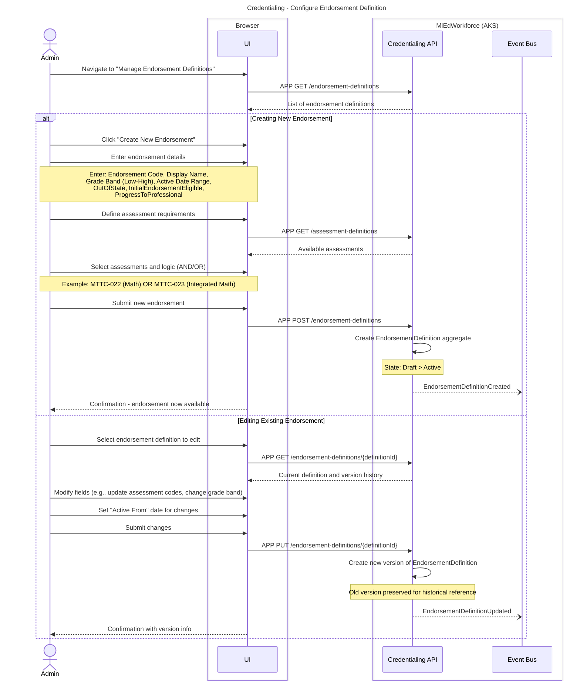
```mermaid
---
title: Credentialing - Configure Endorsement Definition
---
sequenceDiagram
    actor Admin
    box Browser
        participant UI
    end
    box MiEdWorkforce (AKS)
        participant CredApi as Credentialing API
        participant EventBus as Event Bus
    end

    Admin->>UI: Navigate to "Manage Endorsement Definitions"
    UI->>CredApi: APP GET /endorsement-definitions
    CredApi-->>UI: List of endorsement definitions

    alt Creating New Endorsement
        Admin->>UI: Click "Create New Endorsement"

        Admin->>UI: Enter endorsement details
        Note over Admin,UI: Enter: Endorsement Code, Display Name,<br/>Grade Band (Low-High), Active Date Range,<br/>OutOfState, InitialEndorsementEligible,<br/>ProgressToProfessional

        Admin->>UI: Define assessment requirements
        UI->>CredApi: APP GET /assessment-definitions
        CredApi-->>UI: Available assessments

        Admin->>UI: Select assessments and logic (AND/OR)
        Note over Admin,UI: Example: MTTC-022 (Math) OR MTTC-023 (Integrated Math)

        Admin->>UI: Submit new endorsement
        UI->>CredApi: APP POST /endorsement-definitions

        CredApi->>CredApi: Create EndorsementDefinition aggregate
        Note over CredApi: State: Draft > Active

        CredApi--)EventBus: EndorsementDefinitionCreated
        UI-->>Admin: Confirmation - endorsement now available

    else Editing Existing Endorsement
        Admin->>UI: Select endorsement definition to edit
        UI->>CredApi: APP GET /endorsement-definitions/{definitionId}
        CredApi-->>UI: Current definition and version history

        Admin->>UI: Modify fields (e.g., update assessment codes, change grade band)
        Admin->>UI: Set "Active From" date for changes

        Admin->>UI: Submit changes
        UI->>CredApi: APP PUT /endorsement-definitions/{definitionId}

        CredApi->>CredApi: Create new version of EndorsementDefinition
        Note over CredApi: Old version preserved for historical reference

        CredApi--)EventBus: EndorsementDefinitionUpdated
        UI-->>Admin: Confirmation with version info
    end
```

**Key Decisions:**
- **Assessment Logic:** AND requires all assessments to pass; OR requires any one to pass
- **Grade Band:** Must be contiguous range; system validates Low <= High
- **Versioning:** Changes create new versions while preserving historical definitions

**State Changes:**
- EndorsementDefinition: `Draft` > `Active` (new endorsements)
- EndorsementDefinition: Creates new version (edits)

**Events Published:**
- `EndorsementDefinitionCreated` - New endorsement type available
- `EndorsementDefinitionUpdated` - Existing definition modified

**Error Scenarios:**
- Endorsement code already exists > Validation error
- Invalid grade band range (High < Low) > Display error
- Assessment logic misconfigured (e.g., AND with zero codes) > Validation error

---

## Configure Assessment Definition

**What:** Administrator creates or updates an assessment type definition with versioning  
**When:** State adopts new assessment provider, changes passing criteria, or retires old assessments  
**Who:** User with `credentialing.assessment-definition.manage` permission (System Admin). Permission: `credentialing.assessment-definition.manage` (System-wide)

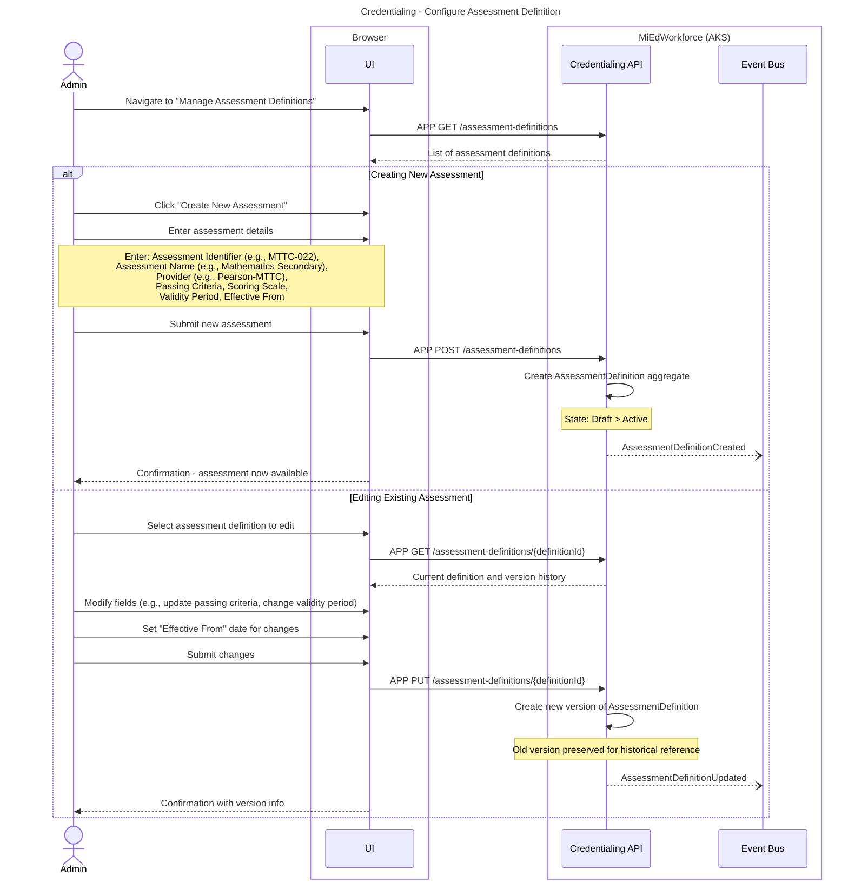
```mermaid
---
title: Credentialing - Configure Assessment Definition
---
sequenceDiagram
    actor Admin
    box Browser
        participant UI
    end
    box MiEdWorkforce (AKS)
        participant CredApi as Credentialing API
        participant EventBus as Event Bus
    end

    Admin->>UI: Navigate to "Manage Assessment Definitions"
    UI->>CredApi: APP GET /assessment-definitions
    CredApi-->>UI: List of assessment definitions

    alt Creating New Assessment
        Admin->>UI: Click "Create New Assessment"

        Admin->>UI: Enter assessment details
        Note over Admin,UI: Enter: Assessment Identifier (e.g., MTTC-022),<br/>Assessment Name (e.g., Mathematics Secondary),<br/>Provider (e.g., Pearson-MTTC),<br/>Passing Criteria, Scoring Scale,<br/>Validity Period, Effective From

        Admin->>UI: Submit new assessment
        UI->>CredApi: APP POST /assessment-definitions

        CredApi->>CredApi: Create AssessmentDefinition aggregate
        Note over CredApi: State: Draft > Active

        CredApi--)EventBus: AssessmentDefinitionCreated
        UI-->>Admin: Confirmation - assessment now available

    else Editing Existing Assessment
        Admin->>UI: Select assessment definition to edit
        UI->>CredApi: APP GET /assessment-definitions/{definitionId}
        CredApi-->>UI: Current definition and version history

        Admin->>UI: Modify fields (e.g., update passing criteria, change validity period)
        Admin->>UI: Set "Effective From" date for changes

        Admin->>UI: Submit changes
        UI->>CredApi: APP PUT /assessment-definitions/{definitionId}

        CredApi->>CredApi: Create new version of AssessmentDefinition
        Note over CredApi: Old version preserved for historical reference

        CredApi--)EventBus: AssessmentDefinitionUpdated
        UI-->>Admin: Confirmation with version info
    end
```

**Key Decisions:**
- **Versioning:** Changes create new versions to preserve historical passing criteria
- **Validity Period:** Configurable per assessment (e.g., 5 years for MTTC, 10 years for Praxis)

**State Changes:**
- AssessmentDefinition: `Draft` > `Active` (new) or creates new version (edits)

**Events Published:**
- `AssessmentDefinitionCreated` - New assessment type available
- `AssessmentDefinitionUpdated` - Existing definition modified

**Error Scenarios:**
- Assessment identifier already exists > Validation error
- Passing criteria outside scoring scale bounds > Display error

---

## Import Assessment Results

**What:** Administrator uploads assessment result file from provider and system imports scores  
**When:** Assessment provider sends updated score report; admin downloads and uploads to system  
**Who:** User with `credentialing.assessment-result.import` permission. Permission: `credentialing.assessment-result.import` (System-wide)

```mermaid
---
title: Credentialing - Import Assessment Results
---
sequenceDiagram
    actor Admin
    box Browser
        participant UI
    end
    box MiEdWorkforce (AKS)
        participant CredApi as Credentialing API
        participant DocsApi as Documents API
        participant EventBus as Event Bus
    end

    Admin->>UI: Navigate to "Import Assessment Results"
    Admin->>UI: Select provider (Pearson-MTTC, ETS-Praxis, etc.)
    Admin->>UI: Upload CSV/XLSX file
    UI->>CredApi: APP POST /upload
    CredApi->>DocsApi: SVC POST /documents/staging/upload/request
    DocsApi-->>CredApi: Upload token and file ID
    CredApi-->>UI: File uploaded, file ID

    Admin->>UI: Click "Process Import"
    UI->>CredApi: APP POST /assessment-results/import

    CredApi->>DocsApi: SVC GET /documents/{documentId}/download
    DocsApi-->>CredApi: File content

    CredApi->>CredApi: Parse file (provider-specific schema)

    loop For each row in file
        CredApi->>CredApi: Validate educator ID, assessment identifier and score within scoring scale

        alt Validation passes
            CredApi->>CredApi: Create or update AssessmentResult aggregate
            Note over CredApi: If educator has existing score for same assessment,<br/>keep highest score
            CredApi--)EventBus: AssessmentResultImported
        else Validation fails
            CredApi->>CredApi: Log error for row
        end
    end

    CredApi-->>UI: Import summary
    UI-->>Admin: Display: {total rows, successful, failed, errors}
```

**Key Decisions:**
- **Provider-Specific Parsing:** Different CSV schemas for Pearson vs ETS
- **Highest Score Logic:** If educator retakes, system keeps highest score automatically
- **Verification Status:** Imported results are marked `Verified` (from official provider)

**State Changes:**
- AssessmentResult: `None` > `Verified` (new imports)
- AssessmentResult: Updates `ScoreValue` if new score is higher (retakes)

**Events Published:**
- `AssessmentResultImported` - One per successful row

**Error Scenarios:**
- Invalid educator ID > Skip row, log error
- Unknown assessment identifier > Skip row, log error
- Malformed file > Abort import, display parsing error

---

## Validate Assessment Results

**What:** System validates educator's assessment scores against endorsement requirements  
**When:** During endorsement application processing or auto-approval workflow  
**Who:** System (automated). Permission: none (system process, no user token)

```mermaid
---
title: Credentialing - Validate Assessment Results
---
sequenceDiagram
    box MiEdWorkforce (AKS)
        participant CredApi as Credentialing API
        participant EventBus as Event Bus
    end

    Note over CredApi: Triggered during endorsement application processing

    CredApi->>CredApi: Load CredentialApplication
    CredApi->>CredApi: Get required assessments from EndorsementDefinition (AND/OR logic)
    CredApi->>CredApi: Load all verified, non-expired results for educator
    CredApi->>CredApi: Match each required assessment to a result and evaluate combination logic (Business Rule Engine)

    alt All requirements met
        CredApi--)EventBus: AssessmentResultsValidated (passed=true)
        Note over CredApi: Proceed to auto-approval
    else Requirements not met
        CredApi--)EventBus: AssessmentResultsValidated (passed=false)
        Note over CredApi: Flag for manual review
    end
```

**Key Decisions:**
- **AND Logic:** ALL specified assessments must pass
- **OR Logic:** ANY ONE specified assessment must pass
- **Expiration Check:** Expired results (ValidityPeriod exceeded) are treated as missing

**Decision Table (per required assessment):**

| Result on file | Score >= PassingCriteria | Result not expired | Requirement |
|---|---|---|---|
| Found | Yes | Yes | Met |
| Found | Yes | No | Not met |
| Found | No | Yes or No | Not met |
| Not found | n/a | n/a | Not met |

The per-assessment outcomes are then combined with the endorsement's AND/OR logic to give the overall result.

**State Changes:**
- None (validation only)

**Events Published:**
- `AssessmentResultsValidated` - Records validation outcome

**Error Scenarios:**
- No results on file > Validation fails, flag for manual review
- Mixed results (some pass, some fail with AND logic) > Validation fails

---

## View Definition History

**What:** Administrator reviews the complete version history and change audit trail for credential, endorsement, or assessment definitions  
**When:** Investigating policy changes, compliance audits, or troubleshooting application issues  
**Who:** User with `credentialing.credential-definition.view`, `credentialing.endorsement-definition.view`, or `credentialing.assessment-definition.view` permission. Permission: the matching `.view` key above, plus `credentialing.definition.compare-versions` for the history calls (System-wide)

```mermaid
---
title: Credentialing - View Definition History
---
sequenceDiagram
    actor Admin
    box Browser
        participant UI
    end
    box MiEdWorkforce (AKS)
        participant CredApi as Credentialing API
    end

    Admin->>UI: Navigate to definitions (credential/endorsement/assessment)

    UI->>CredApi: APP GET /credential-definitions
    CredApi-->>UI: List of definitions

    Admin->>UI: Select definition to view history
    UI->>CredApi: APP GET /credential-definitions/{definitionId}/history
    CredApi-->>UI: All versions with change details

    Note over UI: Display table:<br/>- Version #<br/>- Effective From / To dates<br/>- Changed By<br/>- Changed At<br/>- What Changed (diff view)

    Admin->>UI: Select specific version to view
    UI->>CredApi: APP GET /credential-definitions/{definitionId}/versions/{versionId}
    CredApi-->>UI: Complete definition as it existed in that version

    UI-->>Admin: Display historical definition snapshot

    Note over Admin,UI: Same calls apply to endorsement-definitions and assessment-definitions.<br/>Admin can see:<br/>- Requirement rules at that time<br/>- Fee schedules / Passing criteria<br/>- Configuration flags<br/>- Associated applications using this version
```

**Key Decisions:**
- **Read-Only:** History view is read-only; cannot edit historical versions
- **Version Comparison:** UI may offer diff view showing what changed between versions
- **Application Association:** Can see which applications were evaluated against which version

**State Changes:**
- None (read-only operation)

**Events Published:**
- None (or optional audit log entry for view access)

**Error Scenarios:**
- Definition not found > Display error
- Version not found > Display error
