# Documents - Workflows & Sequences

This document contains sequence diagrams for business workflows in the Documents platform capability.

**Note:** For technical implementation details on malware scanning, blob storage access patterns, and Azure service integrations, see `documents-technical-arch.md`.

**Conventions:**
- Solid arrows (`->>`) = Synchronous calls
- Dashed arrows (`-->>`) = Responses
- Dotted arrows (`--)`) = Async/fire-and-forget
- **actor** = Human only
- **participant** = Every non-human, including internal services, components and external systems
- Request arrows start with an API-kind tag: `APP` (Application API, UI to owning API), `SVC` (Service API, API to API inside the cluster), `EXT` (External API, inbound from an external system), `OUT` (outbound call to an external or Azure platform service)
- Participants are grouped in boxes: Browser, MiEdWorkforce (AKS), External
- Every application API call is authorized by the owning service through the cached IAM permission check (Service API). It is not drawn unless noted.

---

## Integration Pattern: Domain API Calling Documents

**What:** A domain API authorizes an upload or download action, then delegates file mechanics to the Documents API  
**When:** Any time a domain feature requires a user to attach, retrieve, or manage a file  
**Who:** Any domain API acting on behalf of an authenticated user (Credentialing, Staffing, Professional Learning, EPP, Audit)  
**Permission:** The calling domain's own permission (for example `credentialing.application.submit`); see the Upload Permission Model in `documents-permissions.md`

> **This is the canonical integration pattern for all upload and download flows.** The sequences that follow (single upload, bulk upload, staging upload, replacement) are Documents-internal views of what happens after this handoff. When building a domain feature that involves documents, this is the pattern to implement.
```mermaid
---
title: Documents - Integration Pattern: Domain API Calling Documents
---
sequenceDiagram
    actor User
    box Browser
    participant UI
    end
    box MiEdWorkforce (AKS)
    participant DomainApi as Domain API (e.g. Credentialing API)
    participant DocsApi as Documents API
    end
    box External
    participant BlobStorage as Azure Blob Storage
    end

    User->>UI: Initiate upload (e.g. attach transcript to application)
    UI->>DomainApi: APP POST /{domain}/{upload-route}
    Note over UI,DomainApi: Domain-specific request context

    DomainApi->>DocsApi: SVC POST /documents/upload/request
    Note over DomainApi,DocsApi: {filename, size, mime_type, category, attachment_type, attachment_id}

    DocsApi->>DocsApi: Validate file type and size against category limits
    DocsApi-->>DomainApi: {document_id, upload_url}

    DomainApi-->>UI: {document_id, upload_url}
    UI->>BlobStorage: OUT PUT {upload_url} (SAS token)
```

**Key Decisions:**
- **Single authorization check:** The domain API is the only place business authorization is enforced. Documents trusts authenticated internal callers.
- **Service-to-service auth:** Domain APIs call Documents as Service APIs over in-cluster mTLS using service account identity. Documents does not accept direct unauthenticated calls from browsers.
- **Technical validation only:** Documents enforces file size, format, and category rules — not business rules about who may upload what.
- **Bulk vs. single is a UX concern only:** There is no separate permission for bulk uploads. If a user is authorized to upload a file for a given purpose, they are authorized to upload multiple files for that same purpose.

**Error Scenarios:**
- Domain API authorization fails -> Domain API returns 403 to UI; Documents is never called
- File type not in category allowlist -> Documents returns 400 to domain API; domain API surfaces error to UI
- File size exceeds category limit -> Documents returns 400 to domain API; domain API surfaces error to UI
- Service identity (mTLS) authentication failure -> Documents returns 401; domain API should alert on this as it indicates a misconfiguration, not a user error

---

## Request Upload and Upload File

**What:** User uploads file, system issues a time-limited upload URL and the browser sends the file straight to blob storage  
**When:** User needs to attach supporting document to credential application, PPR disclosure, or other context  
**Who:** Educator, District Staff, Administrator  
**Permission:** The calling domain's upload permission (see Upload Permission Model in `documents-permissions.md`); Documents applies technical constraints only  
**See also:** Process Malware Scan Result (what happens after the file lands), Bulk Document Upload (multiple files)

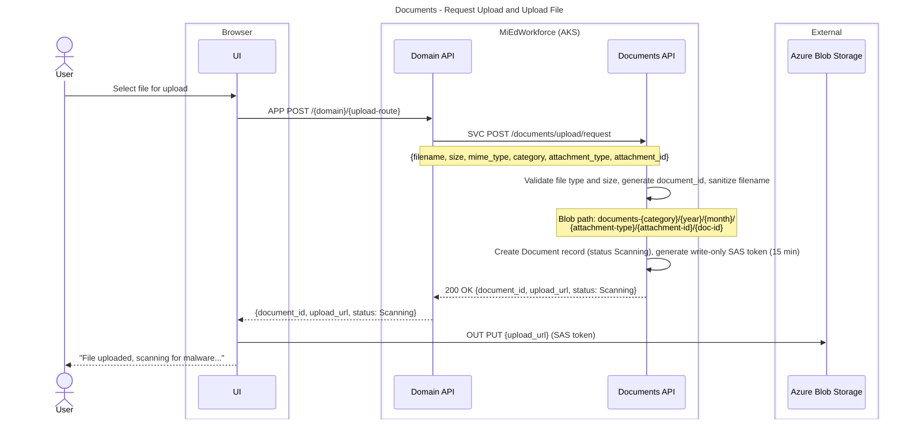

**Key Decisions:**
- **Browser-based upload:** File uploaded directly from browser to blob storage via SAS token (no proxy through API)
- **Domain API fronts the call:** The UI calls the domain API, which calls Documents as a Service API (see the integration pattern above)

**State Changes:**
- Document status: `None` -> `Scanning`

**Error Scenarios:**
- Invalid file type -> 400 Bad Request, upload rejected before SAS generation
- File size exceeds limit -> 400 Bad Request
- Blob storage quota exceeded -> 503 Service Unavailable, alert admins

---

## Process Malware Scan Result

**What:** Azure Defender reports the scan result for an uploaded blob, system makes the document available or rejects it  
**When:** After any file lands in blob storage (single upload, replacement, bulk upload)  
**Who:** Azure Defender for Storage (system callback, no user involved)  
**See also:** Request Upload and Upload File (what happens before), Document Replacement and Versioning, Bulk Document Upload

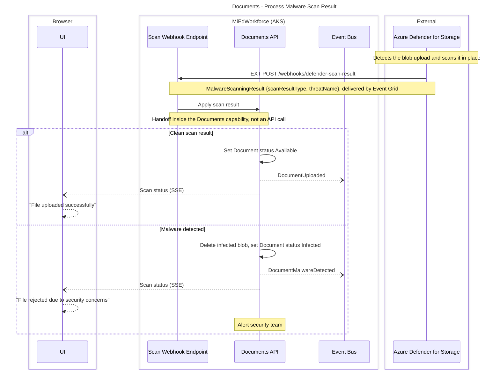

**Key Decisions:**
- **Scan in-place:** Azure Defender scans blob in target container (no quarantine/copy required)
- **Async notification:** UI uses SSE or polling for scan result (don't block user during scan)
- **Timeout handling:** Background job marks as `Scan Failed` if no webhook received within 60 seconds
- **Shared by other flows:** Replacement, bulk upload and staged upload reuse this result handling

**State Changes:**
- Document status: `Scanning` -> `Available` OR `Infected` OR `Scan Failed`

**Events Published:**
- `DocumentUploaded` - Scan clean, document available
- `DocumentMalwareDetected` - Malware found, security alert

**Error Scenarios:**
- Scan timeout (>60 seconds, no webhook received) -> Background job marks as `Scan Failed`, deletes blob, notifies UI "Upload failed, please try again"

---

## Document Download with SAS Token

**What:** User requests document, system generates time-limited access URL  
**When:** User views document from credential application, a filtered pending-items list view, or document library  
**Who:** Educator, District Staff, Administrator  
**Permission:** The calling domain's permission to view the attachment context; `documents.admin.view-all` for cross-context admin viewing

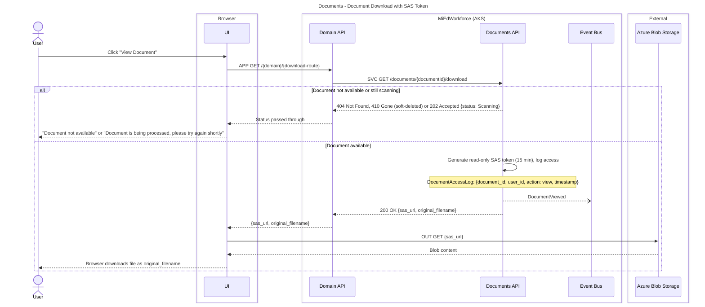

**Key Decisions:**
- **Direct blob access:** UI downloads directly from blob storage using SAS token (no proxy through API)
- **Time-limited tokens:** 15-minute expiry prevents URL sharing
- **Access logging:** All views logged for compliance audit
- **Status check:** Prevent download while still scanning

**Events Published:**
- `DocumentViewed` - Track document access for analytics

**Error Scenarios:**
- Document soft-deleted -> 410 Gone
- Document still scanning -> 202 Accepted (try again)
- SAS token expired -> UI requests new token

---

## Document Replacement and Versioning

**What:** User replaces existing document, old version archived  
**When:** User uploads wrong file or needs to update supporting document  
**Who:** Educator (own documents), Administrator (any document in scope)  
**Permission:** The calling domain's permission for the attachment context (Documents enforces technical constraints only)  
**See also:** Process Malware Scan Result (scan of the new version)

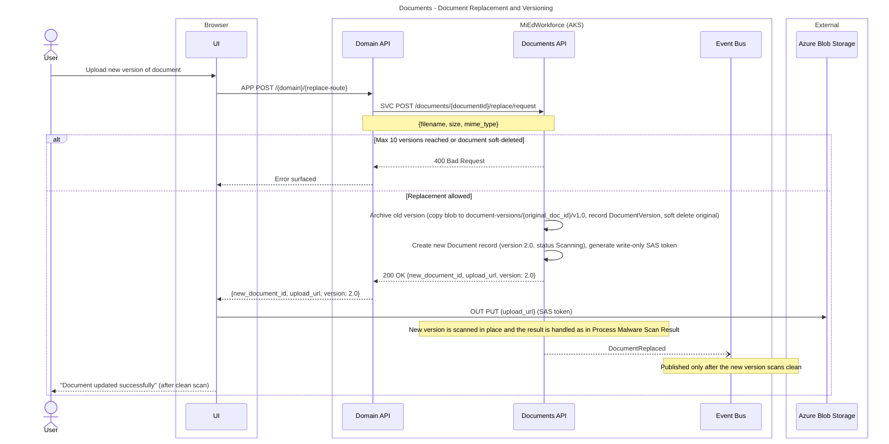

**Key Decisions:**
- **New document ID for new version:** Each version is a separate Document record
- **Archive old version:** Old blob moved to archive container, not deleted
- **Version numbering:** Incremental (1.0, 2.0, 3.0) for simplicity
- **Malware scan new version:** Replacement goes through full scan-in-place workflow
- **Rollback on failure:** If new version fails scan, old version remains current

**State Changes:**
- Original Document: `Available` -> `Soft Deleted` (current_version = false)
- New Document: `None` -> `Scanning` -> `Available` OR `Infected`

**Events Published:**
- `DocumentReplaced` - Includes old and new document IDs (only if new version scan clean)

**Error Scenarios:**
- Max 10 versions exceeded -> 400 Bad Request "Maximum versions reached"
- Document soft-deleted -> 400 Bad Request "Restore document before replacing"
- New file infected -> Upload fails, old version remains current ("Replacement file rejected - original version remains")

---

## Soft Delete Document

**What:** User deletes document, system soft-deletes immediately  
**When:** User removes incorrect upload or document no longer needed  
**Who:** Educator (own documents), Administrator (any document in scope)  
**Permission:** The calling domain's permission for the attachment context (soft delete is an implicit baseline capability in Documents)  
**See also:** Hard Delete Expired Documents (Nightly Job)

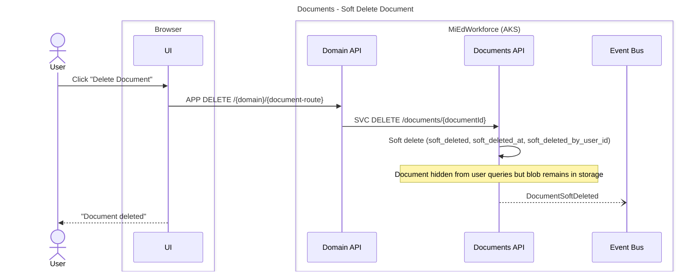

**Key Decisions:**
- **Soft delete is immediate:** User action hides document instantly

**State Changes:**
- Document status: `Available` -> `Soft Deleted` (user action)

**Events Published:**
- `DocumentSoftDeleted` - User deletes document

**Error Scenarios:**
- User tries to delete document with legal hold -> 403 Forbidden "Document has active legal hold"

---

## Hard Delete Expired Documents (Nightly Job)

**What:** System hard-deletes soft-deleted documents after the retention period  
**When:** Nightly at 2:00 AM EST  
**Who:** Hard Delete Job (system-automated, no user involved)  
**See also:** Soft Delete Document

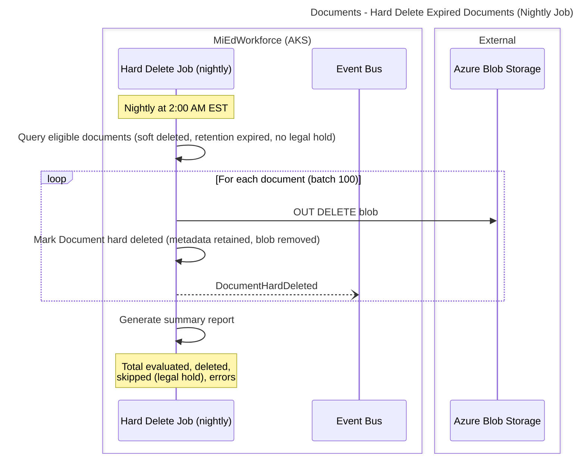

**Key Decisions:**
- **Hard delete is automated:** No user permission to force hard delete
- **Metadata preserved:** Even after hard delete, metadata remains for audit

**State Changes:**
- Document status: `Soft Deleted` -> `Hard Deleted` (job)

**Events Published:**
- `DocumentHardDeleted` - Blob permanently removed (nightly job)

**Error Scenarios:**
- Hard delete blob fails -> Retry next night (max 3 attempts), alert admin after 3 failures

---

## Legal Hold Application and Release

**What:** Administrator applies legal hold preventing deletion, later releases after legal matter concludes  
**When:** Litigation, investigation, or audit requires document preservation  
**Who:** Legal Counsel, Compliance Officer  
**Permission:** `documents.legal-hold.apply` (apply), `documents.legal-hold.release` (release); system-wide

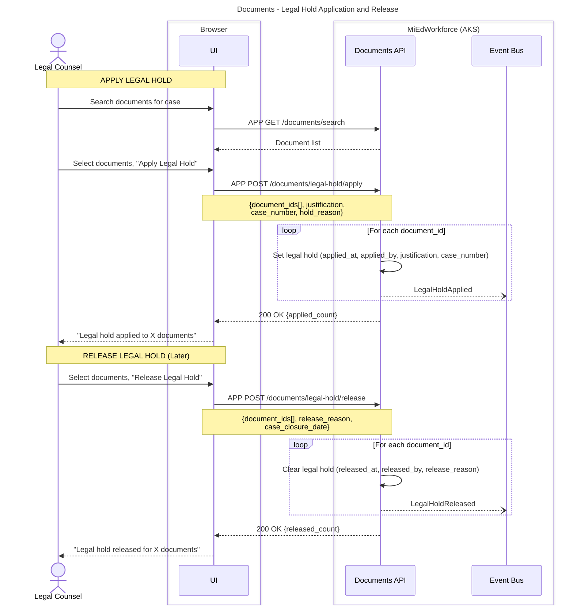

**Key Decisions:**
- **Legal hold overrides retention:** Documents with hold cannot be hard-deleted regardless of age
- **Justification required:** Must include case number and reason for audit trail
- **Release doesn't delete:** Releasing hold allows retention policy to resume, but doesn't immediately delete

**Events Published:**
- `LegalHoldApplied` - Per document, includes case number
- `LegalHoldReleased` - Per document, includes release reason

**Error Scenarios:**
- Non-legal user attempts hold -> 403 Forbidden
- Release without justification -> 400 Bad Request "Release reason required"

---

## Bulk Document Upload

**What:** Administrator uploads multiple files simultaneously, system processes batch with malware scanning  
**When:** District uploads employee roster CSV, EPP uploads candidate tracking file, Sponsor uploads attendee list  
**Who:** District Admin, EPP Admin, Professional Learning Sponsor  
**Permission:** The calling domain's upload permission (the same permission that controls single uploads for this context)  
**See also:** Request Upload and Upload File (single file), Process Malware Scan Result (per-file scan)

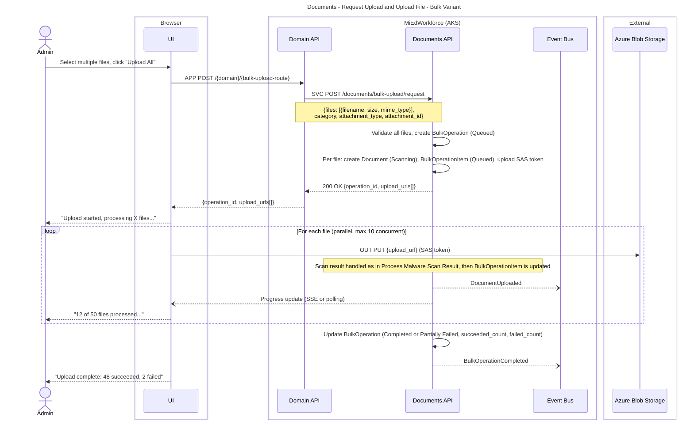

**Key Decisions:**
- **Browser-based bulk upload:** Each file gets its own SAS token, uploaded directly from browser
- **Scan in-place:** Files scanned in target containers (no quarantine)
- **Parallel uploads:** Max 10 concurrent to avoid overwhelming scan service (2,000 files/min limit)
- **Individual item tracking:** Each file has success/failure status
- **Partial success allowed:** Some files can fail without failing entire operation

**State Changes:**
- BulkOperation status: `Queued` -> `In Progress` -> `Completed` OR `Partially Failed`
- BulkOperationItem status: `Queued` -> `Succeeded` OR `Failed`

**Events Published:**
- `DocumentUploaded` - Per successfully uploaded file
- `BulkOperationCompleted` - Summary of entire operation

**Error Scenarios:**
- Malware detected in 1 file -> That file fails (item status `Failed`, error_message: scan result, blob deleted), others continue
- All files fail scan -> Operation status `Failed`
- User cancels mid-upload -> Operation status `Cancelled`, uploaded files remain

---

## Bulk Document Soft Delete with Validation

**What:** Administrator marks multiple documents for soft delete, system validates retention policies  
**When:** Cleanup of obsolete documents, removing test data, or bulk document management  
**Who:** Document Administrator, District Admin (scoped to their documents)  
**Permission:** `documents.admin.bulk-delete` (system-wide)

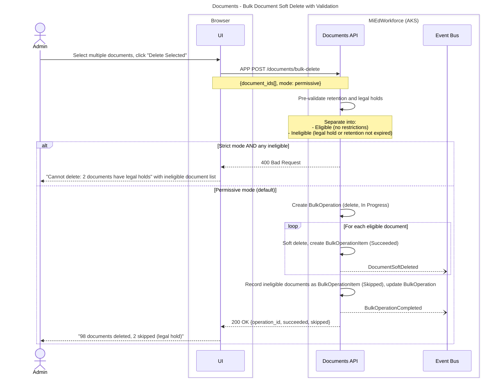

**Key Decisions:**
- **Pre-validation required:** Check all retention/legal hold before starting
- **Permissive mode default:** Skip ineligible documents, delete eligible ones
- **Strict mode optional:** Admin can require all-or-nothing deletion

**Events Published:**
- `DocumentSoftDeleted` - Per successfully deleted document
- `BulkOperationCompleted` - Summary with skipped count

**Error Scenarios:**
- All documents have legal holds -> Operation status `Failed` (0 succeeded)
- User lacks scope permission -> 403 Forbidden
- Strict mode with ineligible docs -> 400 Bad Request, operation blocked

---

## Request Retention Override

**What:** Admin requests exception to retention policy, business owner is notified  
**When:** Need to delete documents before retention expiry (e.g., GDPR request, legal mandate, storage emergency)  
**Who:** Document Administrator (requestor)  
**Permission:** `documents.retention-override.request` (system-wide)  
**See also:** Approve Retention Override, Execute Approved Override

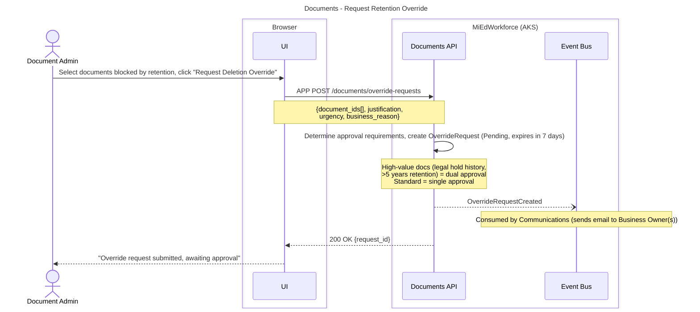

**Key Decisions:**
- **Dual approval for high-value:** Documents with legal hold history or >5 year retention require 2 approvals
- **Justification mandatory:** All overrides require business reason for audit trail

**State Changes:**
- OverrideRequest: `Pending`

**Events Published:**
- `OverrideRequestCreated` - Admin submits request

**Error Scenarios:**
- Override request is not approved within 7 days -> Request expires (`expires_at`)

---

## Approve Retention Override

**What:** Business owner reviews and approves an override request (two approvers for high-value documents)  
**When:** An override request is pending review  
**Who:** Business Owner (approver)  
**Permission:** `documents.retention-override.approve` (system-wide)  
**See also:** Request Retention Override, Execute Approved Override

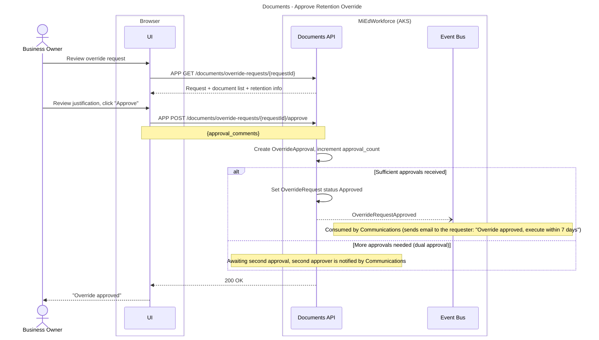

**Key Decisions:**
- **Dual approval for high-value:** Documents with legal hold history or >5 year retention require 2 approvals
- **Justification mandatory:** All overrides require business reason for audit trail

**State Changes:**
- OverrideRequest: `Pending` -> `Approved`

**Events Published:**
- `OverrideRequestApproved` - Business owner approves

**Error Scenarios:**
- Insufficient approvals -> 403 Forbidden "Awaiting second approval"
- Approver is same as requester -> 403 Forbidden "Cannot approve own request"

---

## Execute Approved Override

**What:** Admin executes an approved override, bypassing retention to soft delete the documents  
**When:** Within 7 days of approval  
**Who:** Document Administrator (requestor)  
**Permission:** `documents.retention-override.request` (system-wide)  
**See also:** Request Retention Override, Approve Retention Override

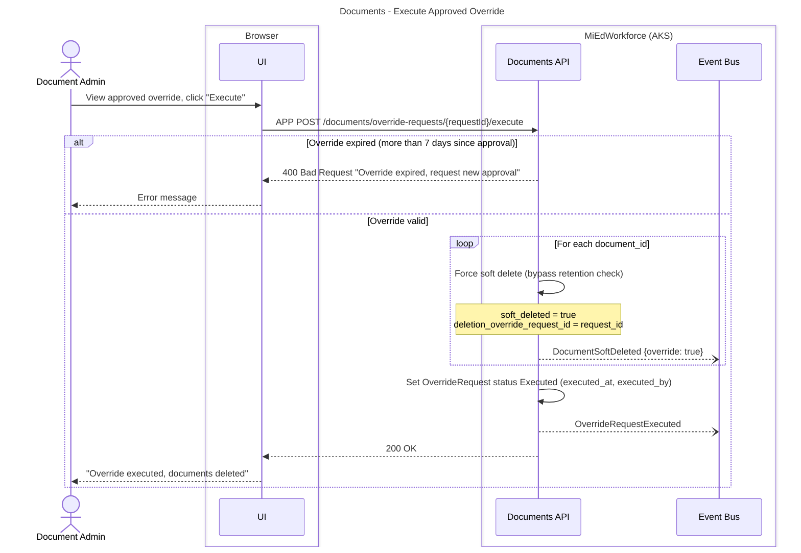

**Key Decisions:**
- **7-day execution window:** Approved overrides expire if not executed within 7 days
- **Cannot be reversed:** Once executed, deletion is permanent (standard retention applies to hard delete)

**State Changes:**
- OverrideRequest: `Approved` -> `Executed`
- Documents: Bypass retention, immediate soft delete eligibility

**Events Published:**
- `OverrideRequestExecuted` - Admin executes deletion
- `DocumentSoftDeleted` - Per document, flagged as override deletion

**Error Scenarios:**
- Override expired (>7 days) -> 400 Bad Request "Override expired, request new approval"
- Request already executed -> 409 Conflict "Override already executed"

---

## Stage and Scan Import File

**What:** User uploads bulk import file to staging area, system scans it and announces it is ready for Synapse  
**When:** District uploads employee roster CSV, EPP uploads candidate enrollment file  
**Who:** District Admin, EPP Admin  
**Permission:** The calling domain's upload permission (for example `staffing.roster.upload`, `epp.candidates.upload`)  
**See also:** Process Staged File in Synapse, Staging File Cleanup Job, Process Malware Scan Result

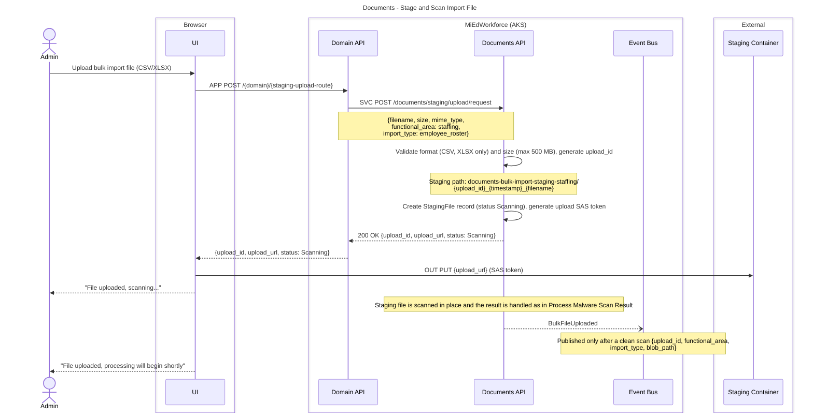

**Key Decisions:**
- **All staging files scanned:** No exceptions for "trusted internal sources"
- **Browser-based upload:** File uploaded via SAS token directly to staging container
- **Scan in-place:** Defender scans staging files where they sit
- **Event-driven decoupling:** Documents domain doesn't know about Synapse pipelines

**State Changes:**
- StagingFile status: `Scanning` -> `Uploaded`

**Events Published:**
- `BulkFileUploaded` - File scanned clean, ready for processing

**Error Scenarios:**
- Invalid file format -> 400 Bad Request before upload
- Malware detected -> File deleted, status `Infected`; UI shows "Upload failed due to security concerns"

---

## Process Staged File in Synapse

**What:** Synapse pipeline picks up a scanned staging file, loads the data and reports the outcome back to Documents  
**When:** A `BulkFileUploaded` event is published  
**Who:** Azure Synapse (system pipeline, no user involved)  
**See also:** Stage and Scan Import File, Staging File Cleanup Job

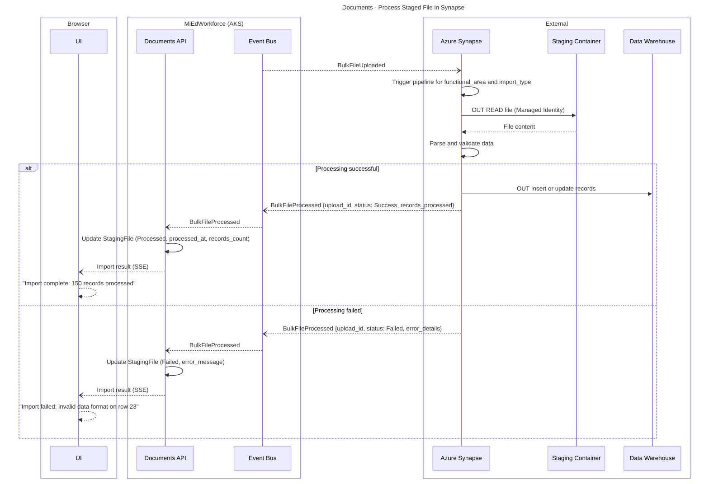

**Key Decisions:**
- **Event-driven decoupling:** Documents domain doesn't know about Synapse pipelines
- **Synapse reads directly:** Synapse uses Managed Identity to access staging containers

**State Changes:**
- StagingFile status: `Uploaded` -> `Processed` OR `Failed`

**Events Published:**
- `BulkFileProcessed` - Synapse publishes after processing (consumed by Documents)

**Error Scenarios:**
- Synapse pipeline failure -> Status `Failed`, file remains for retry
- Synapse timeout (>30 min) -> Alert admins, file remains for manual investigation

---

## Staging File Cleanup Job

**What:** Daily job deletes staging files older than 7 days regardless of processing status  
**When:** Daily  
**Who:** Documents cleanup job (system-automated, no user involved)  
**See also:** Stage and Scan Import File

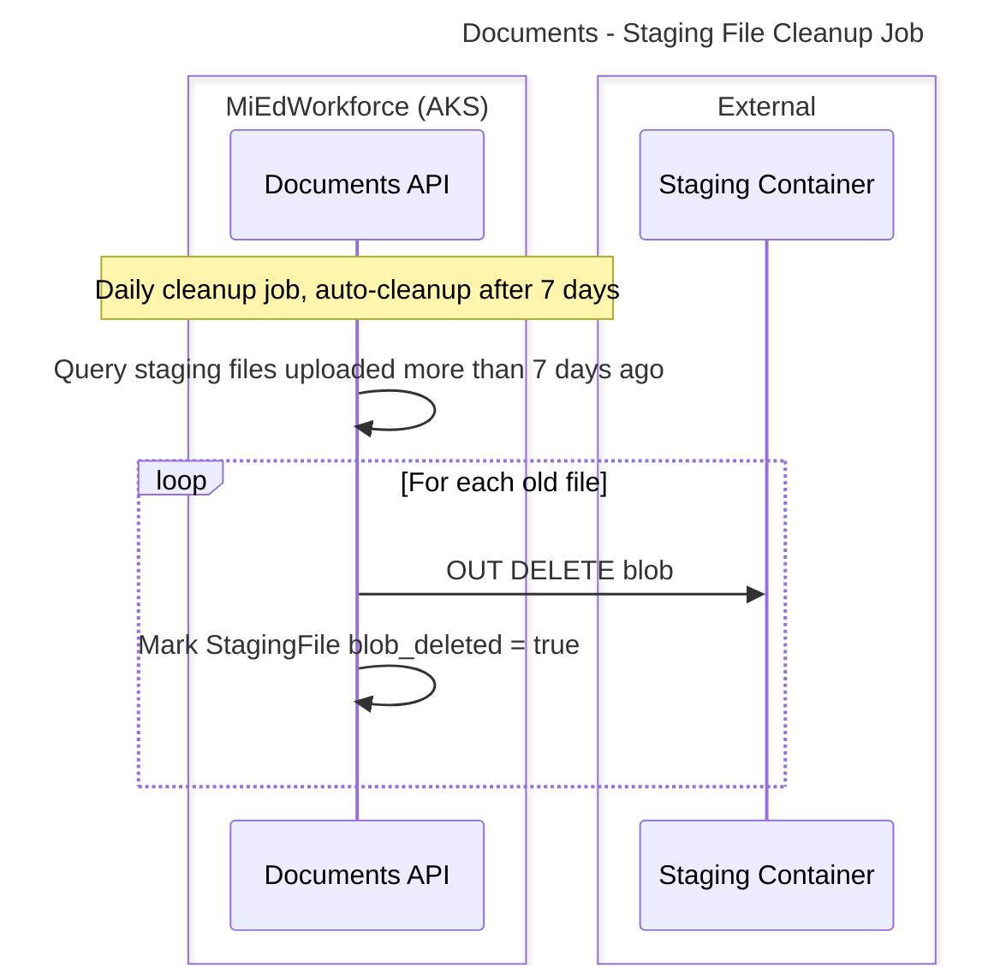

**Key Decisions:**
- **Auto-cleanup:** Files deleted after 7 days regardless of processing status

**State Changes:**
- StagingFile: `blob_deleted` = true
