# Education Preparation Provider (EPP) - Workflows & Sequences

This document contains sequence diagrams for all workflows in the EPP domain.

---

**Conventions:**
- Solid arrows (`->>`) = Synchronous calls
- Dashed arrows (`-->>`) = Responses (drawn only when they carry data or an error status)
- Dotted arrows (`--)`) = Async/fire-and-forget (events)
- **actor** = Human users only
- **participant** = Every non-human: UI, services, Event Bus, external systems
- Every request arrow starts with its API-kind tag, then the verb and path from the API catalog: `APP` = application API (user delegated token, UI to owning API), `SVC` = service API (in-cluster mTLS, API to API), `EXT` = external API (inbound client credentials), `OUT` = outbound call to an external system
- Participants are grouped with `box`: Browser (UI), MiEdWorkforce (AKS) (services and Event Bus), External (external systems)
- Every application API call is authorized by the owning service through the cached IAM permission check (Service API). It is not drawn unless noted.

---

## Designate EEM Organization as EPP

**What:** EPP System Admin designates an existing EEM organization as an Educator Preparation Provider by adding EPP-specific configuration  
**When:** An EEM organization receives state approval to become an educator preparation provider  
**Who:** EPP System Admin. Permission: epp.provider.create (system-wide)

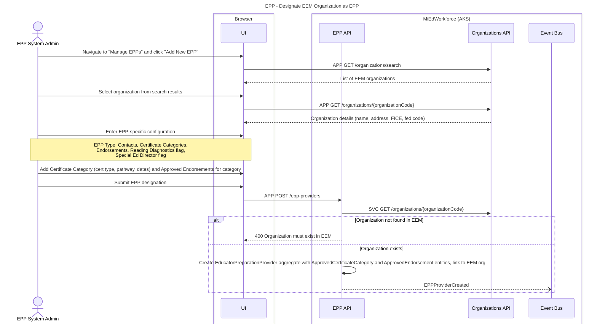
```mermaid
---
title: EPP - Designate EEM Organization as EPP
---
sequenceDiagram
    actor Admin as EPP System Admin
    box Browser
    participant UI as UI
    end
    box MiEdWorkforce (AKS)
    participant EppApi as EPP API
    participant OrgApi as Organizations API
    participant EventBus as Event Bus
    end

    Admin->>UI: Navigate to "Manage EPPs" and click "Add New EPP"
    UI->>OrgApi: APP GET /organizations/search
    OrgApi-->>UI: List of EEM organizations

    Admin->>UI: Select organization from search results
    UI->>OrgApi: APP GET /organizations/{organizationCode}
    OrgApi-->>UI: Organization details (name, address, FICE, fed code)

    Admin->>UI: Enter EPP-specific configuration
    Note over Admin,UI: EPP Type, Contacts, Certificate Categories,<br/>Endorsements, Reading Diagnostics flag,<br/>Special Ed Director flag

    Admin->>UI: Add Certificate Category (cert type, pathway, dates) and Approved Endorsements for category
    Admin->>UI: Submit EPP designation

    UI->>EppApi: APP POST /epp-providers
    EppApi->>OrgApi: SVC GET /organizations/{organizationCode}

    alt Organization not found in EEM
        EppApi-->>UI: 400 Organization must exist in EEM
    else Organization exists
        EppApi->>EppApi: Create EducatorPreparationProvider aggregate with ApprovedCertificateCategory and ApprovedEndorsement entities, link to EEM org
        EppApi--)EventBus: EPPProviderCreated
    end
```

**Key Decisions:**
- **EEM Dependency:** EPP cannot be created unless organization exists in org-reference-data (synced from EEM)
- **Core Data Immutability:** Organization name, address, federal codes are read-only from EEM
- **Program Approval Scope:** At least one certificate category required for EPP to be active

**State Changes:**
- EducatorPreparationProvider: `none` > `Active`

**Events Published:**
- `EPPProviderCreated` - Notifies downstream systems of new EPP availability

**Error Scenarios:**
- Organization code not found in EEM > Display error, prevent creation
- Missing required certificate category > Validation error, require at least one

---

## Update EPP Configuration

**What:** EPP System Admin updates EPP-specific settings (type, contacts, flags, certificate categories, endorsements)  
**When:** EPP metadata needs to be updated (does NOT include core organization data like name/address)  
**Who:** EPP System Admin. Permission: epp.provider.edit (system-wide or scoped to the EPP)

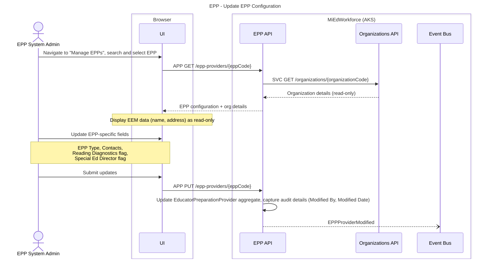
```mermaid
---
title: EPP - Update EPP Configuration
---
sequenceDiagram
    actor Admin as EPP System Admin
    box Browser
    participant UI as UI
    end
    box MiEdWorkforce (AKS)
    participant EppApi as EPP API
    participant OrgApi as Organizations API
    participant EventBus as Event Bus
    end

    Admin->>UI: Navigate to "Manage EPPs", search and select EPP
    UI->>EppApi: APP GET /epp-providers/{eppCode}
    EppApi->>OrgApi: SVC GET /organizations/{organizationCode}
    OrgApi-->>EppApi: Organization details (read-only)
    EppApi-->>UI: EPP configuration + org details

    Note over UI: Display EEM data (name, address) as read-only

    Admin->>UI: Update EPP-specific fields
    Note over Admin,UI: EPP Type, Contacts,<br/>Reading Diagnostics flag,<br/>Special Ed Director flag

    Admin->>UI: Submit updates
    UI->>EppApi: APP PUT /epp-providers/{eppCode}

    EppApi->>EppApi: Update EducatorPreparationProvider aggregate, capture audit details (Modified By, Modified Date)

    EppApi--)EventBus: EPPProviderModified
```

**Key Decisions:**
- **Read-Only EEM Data:** Name, address, federal codes cannot be edited in MiEdWorkforce
- **EPP-Specific Updates Only:** Only metadata unique to EPP role can be modified

**State Changes:**
- EducatorPreparationProvider: `Active` remains `Active` (metadata update only)

**Events Published:**
- `EPPProviderModified` - Notifies downstream systems of configuration changes

**Error Scenarios:**
- Attempt to modify read-only org data > Validation error at UI level
- Invalid EPP type > Validation error

---

## Add EPP Certificate Category Approval

**What:** EPP System Admin adds certificate type/pathway approvals with effective dates (editing an existing approval is described under Key Decisions)  
**When:** State approves new programs for EPP or modifies existing program approvals  
**Who:** EPP System Admin. Permission: epp.certificatecategory.create (system-wide or scoped to the EPP)  
**See also:** Remove EPP Certificate Category Approval

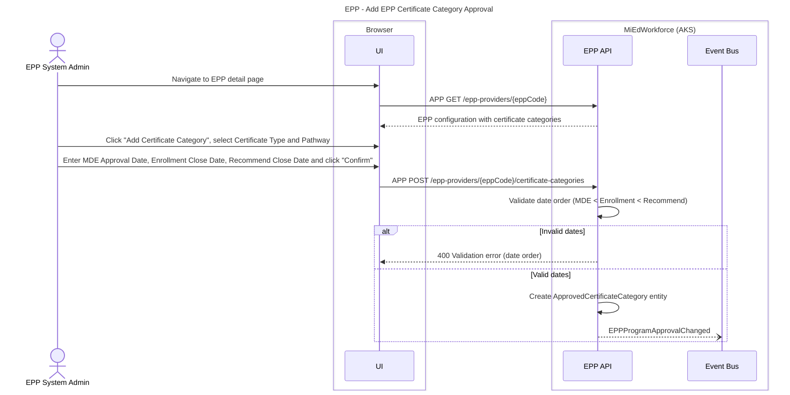
```mermaid
---
title: EPP - Add EPP Certificate Category Approval
---
sequenceDiagram
    actor Admin as EPP System Admin
    box Browser
    participant UI as UI
    end
    box MiEdWorkforce (AKS)
    participant EppApi as EPP API
    participant EventBus as Event Bus
    end

    Admin->>UI: Navigate to EPP detail page
    UI->>EppApi: APP GET /epp-providers/{eppCode}
    EppApi-->>UI: EPP configuration with certificate categories

    Admin->>UI: Click "Add Certificate Category", select Certificate Type and Pathway
    Admin->>UI: Enter MDE Approval Date, Enrollment Close Date, Recommend Close Date and click "Confirm"

    UI->>EppApi: APP POST /epp-providers/{eppCode}/certificate-categories
    EppApi->>EppApi: Validate date order (MDE < Enrollment < Recommend)

    alt Invalid dates
        EppApi-->>UI: 400 Validation error (date order)
    else Valid dates
        EppApi->>EppApi: Create ApprovedCertificateCategory entity
        EppApi--)EventBus: EPPProgramApprovalChanged
    end
```

**Key Decisions:**
- **Date Validation:** MDE Approval Date must precede Enrollment Close Date and Recommend Close Date
- **Pro Prep Impact:** Date changes affect public catalog visibility
- **Edit (not drawn):** An existing category is edited with `APP PUT /epp-providers/{eppCode}/certificate-categories` (permission epp.certificatecategory.edit). The EPP API validates the date order, updates the ApprovedCertificateCategory, captures the audit trail and publishes `EPPProgramApprovalChanged`

**State Changes:**
- ApprovedCertificateCategory: `none` > `Active` (on add)

**Events Published:**
- `EPPProgramApprovalChanged` - May trigger Pro Prep catalog updates

**Error Scenarios:**
- Invalid date order > Validation error, prevent save
- Attempt to add duplicate category/pathway > Validation error

---

## Remove EPP Certificate Category Approval

**What:** EPP System Admin removes a certificate type/pathway approval  
**When:** State approves new programs for EPP or modifies existing program approvals  
**Who:** EPP System Admin. Permission: epp.certificatecategory.delete (system-wide or scoped to the EPP)  
**See also:** Add EPP Certificate Category Approval

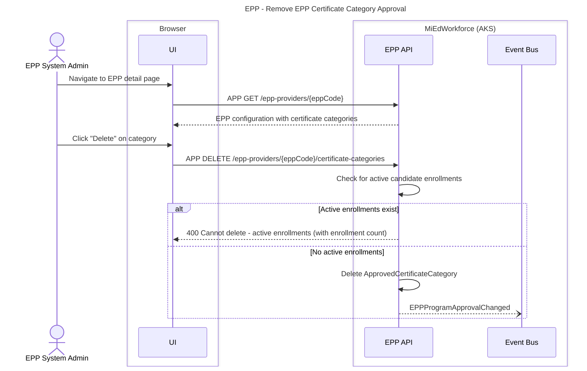
```mermaid
---
title: EPP - Remove EPP Certificate Category Approval
---
sequenceDiagram
    actor Admin as EPP System Admin
    box Browser
    participant UI as UI
    end
    box MiEdWorkforce (AKS)
    participant EppApi as EPP API
    participant EventBus as Event Bus
    end

    Admin->>UI: Navigate to EPP detail page
    UI->>EppApi: APP GET /epp-providers/{eppCode}
    EppApi-->>UI: EPP configuration with certificate categories

    Admin->>UI: Click "Delete" on category
    UI->>EppApi: APP DELETE /epp-providers/{eppCode}/certificate-categories
    EppApi->>EppApi: Check for active candidate enrollments

    alt Active enrollments exist
        EppApi-->>UI: 400 Cannot delete - active enrollments (with enrollment count)
    else No active enrollments
        EppApi->>EppApi: Delete ApprovedCertificateCategory
        EppApi--)EventBus: EPPProgramApprovalChanged
    end
```

**Key Decisions:**
- **Deletion Protection:** Cannot delete certificate category if active candidate enrollments exist
- **Pro Prep Impact:** Date changes affect public catalog visibility

**State Changes:**
- ApprovedCertificateCategory: `Active` > `deleted` (on remove, if no active enrollments)

**Events Published:**
- `EPPProgramApprovalChanged` - May trigger Pro Prep catalog updates

**Error Scenarios:**
- Delete with active enrollments > Block deletion, display error

---

## Add EPP Approved Endorsement

**What:** EPP System Admin adds specific endorsements within certificate types (editing an existing endorsement is described under Key Decisions)  
**When:** EPP receives approval for new endorsements or existing endorsements are sunset  
**Who:** EPP System Admin. Permission: epp.endorsement.create (system-wide or scoped to the EPP)  
**See also:** Remove EPP Approved Endorsement

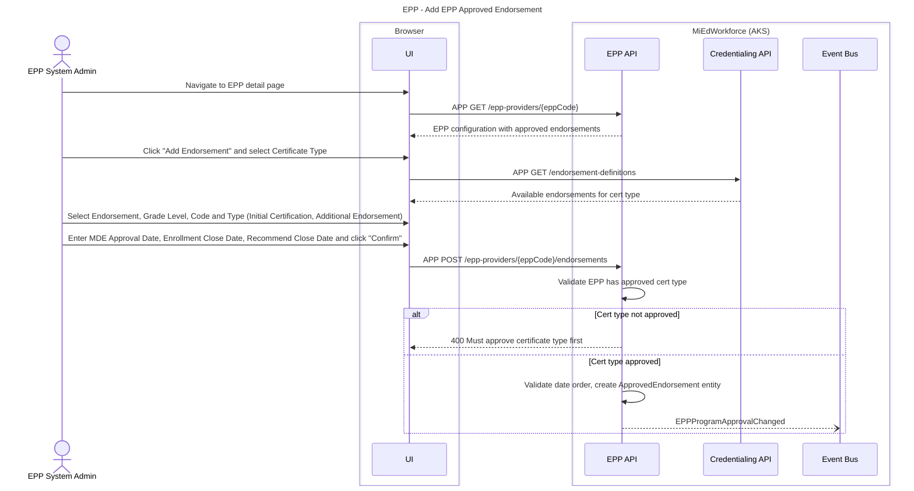
```mermaid
---
title: EPP - Add EPP Approved Endorsement
---
sequenceDiagram
    actor Admin as EPP System Admin
    box Browser
    participant UI as UI
    end
    box MiEdWorkforce (AKS)
    participant EppApi as EPP API
    participant CredApi as Credentialing API
    participant EventBus as Event Bus
    end

    Admin->>UI: Navigate to EPP detail page
    UI->>EppApi: APP GET /epp-providers/{eppCode}
    EppApi-->>UI: EPP configuration with approved endorsements

    Admin->>UI: Click "Add Endorsement" and select Certificate Type
    UI->>CredApi: APP GET /endorsement-definitions
    CredApi-->>UI: Available endorsements for cert type

    Admin->>UI: Select Endorsement, Grade Level, Code and Type (Initial Certification, Additional Endorsement)
    Admin->>UI: Enter MDE Approval Date, Enrollment Close Date, Recommend Close Date and click "Confirm"

    UI->>EppApi: APP POST /epp-providers/{eppCode}/endorsements
    EppApi->>EppApi: Validate EPP has approved cert type

    alt Cert type not approved
        EppApi-->>UI: 400 Must approve certificate type first
    else Cert type approved
        EppApi->>EppApi: Validate date order, create ApprovedEndorsement entity
        EppApi--)EventBus: EPPProgramApprovalChanged
    end
```

**Key Decisions:**
- **Certificate Type Dependency:** Cannot add endorsement unless EPP has approved certificate type
- **Date Validation:** Similar to certificate categories (MDE < Enrollment < Recommend)
- **Edit (not drawn):** An existing endorsement is edited with `APP PUT /epp-providers/{eppCode}/endorsements` (permission epp.endorsement.edit). The EPP API updates the ApprovedEndorsement, captures the audit trail and publishes `EPPProgramApprovalChanged`

**State Changes:**
- ApprovedEndorsement: `none` > `Active` (on add)

**Events Published:**
- `EPPProgramApprovalChanged` - May trigger Pro Prep catalog updates

**Error Scenarios:**
- Certificate type not approved > Block endorsement addition
- Invalid date order > Validation error

---

## Remove EPP Approved Endorsement

**What:** EPP System Admin removes a specific endorsement within a certificate type  
**When:** EPP receives approval for new endorsements or existing endorsements are sunset  
**Who:** EPP System Admin. Permission: epp.endorsement.delete (system-wide or scoped to the EPP)  
**See also:** Add EPP Approved Endorsement

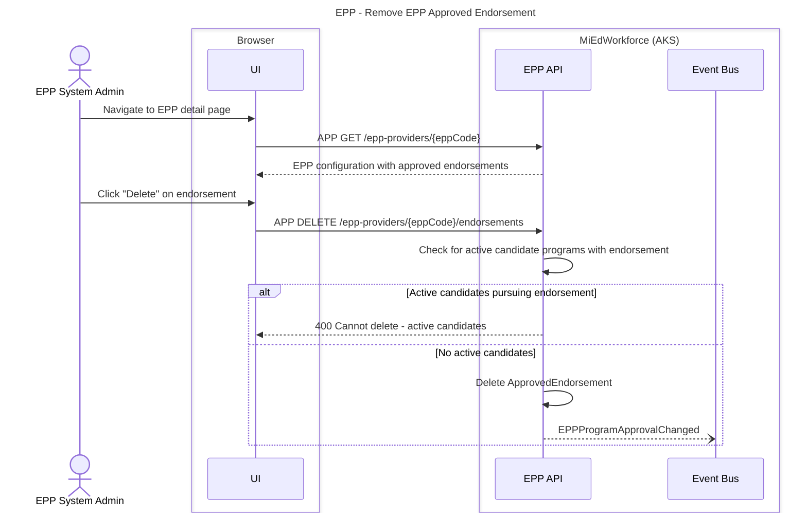
```mermaid
---
title: EPP - Remove EPP Approved Endorsement
---
sequenceDiagram
    actor Admin as EPP System Admin
    box Browser
    participant UI as UI
    end
    box MiEdWorkforce (AKS)
    participant EppApi as EPP API
    participant EventBus as Event Bus
    end

    Admin->>UI: Navigate to EPP detail page
    UI->>EppApi: APP GET /epp-providers/{eppCode}
    EppApi-->>UI: EPP configuration with approved endorsements

    Admin->>UI: Click "Delete" on endorsement
    UI->>EppApi: APP DELETE /epp-providers/{eppCode}/endorsements
    EppApi->>EppApi: Check for active candidate programs with endorsement

    alt Active candidates pursuing endorsement
        EppApi-->>UI: 400 Cannot delete - active candidates
    else No active candidates
        EppApi->>EppApi: Delete ApprovedEndorsement
        EppApi--)EventBus: EPPProgramApprovalChanged
    end
```

**Key Decisions:**
- **Deletion Protection:** Cannot delete if active candidates are pursuing the endorsement

**State Changes:**
- ApprovedEndorsement: `Active` > `deleted` (on remove, if no active candidates)

**Events Published:**
- `EPPProgramApprovalChanged` - May trigger Pro Prep catalog updates

**Error Scenarios:**
- Delete with active candidates > Block deletion

---

## Configure Pro Prep Catalog Visibility

**What:** EPP System Admin toggles program visibility and manages Pro Prep display settings  
**When:** Managing public-facing program availability for prospective educators  
**Who:** EPP System Admin. Permission: epp.proprepconfig.manage (system-wide or scoped to the EPP)

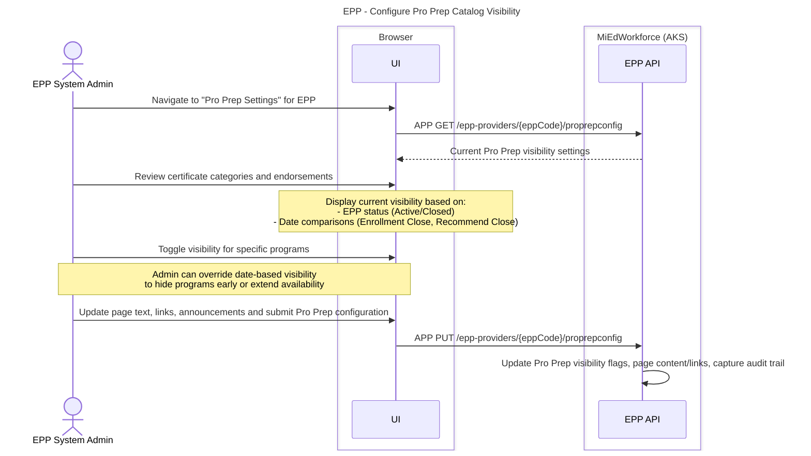
```mermaid
---
title: EPP - Configure Pro Prep Catalog Visibility
---
sequenceDiagram
    actor Admin as EPP System Admin
    box Browser
    participant UI as UI
    end
    box MiEdWorkforce (AKS)
    participant EppApi as EPP API
    end

    Admin->>UI: Navigate to "Pro Prep Settings" for EPP
    UI->>EppApi: APP GET /epp-providers/{eppCode}/proprepconfig
    EppApi-->>UI: Current Pro Prep visibility settings

    Admin->>UI: Review certificate categories and endorsements
    Note over UI: Display current visibility based on:<br/>- EPP status (Active/Closed)<br/>- Date comparisons (Enrollment Close, Recommend Close)

    Admin->>UI: Toggle visibility for specific programs
    Note over Admin,UI: Admin can override date-based visibility<br/>to hide programs early or extend availability

    Admin->>UI: Update page text, links, announcements and submit Pro Prep configuration

    UI->>EppApi: APP PUT /epp-providers/{eppCode}/proprepconfig
    EppApi->>EppApi: Update Pro Prep visibility flags, page content/links, capture audit trail
```

**Key Decisions:**
- **Date-Based Visibility:** Default visibility based on Enrollment/Recommend Close Dates
- **Manual Override:** Admin can manually hide programs even if dates allow visibility
- **Immediate Effect:** Changes to Pro Prep settings take effect immediately

**State Changes:**
- EducatorPreparationProvider Pro Prep config updated (metadata change only)

**Events Published:**
- None (configuration change only, no domain events)

**Error Scenarios:**
- Invalid page content/links > Validation error
- Attempt to make closed EPP visible > Block override

---

## Search and View Candidate Enrollments

**What:** EPP Coordinator filters and searches candidates awaiting enrollment verification and candidates with verified enrollment status, and views a candidate's enrollment records at all EPPs  
**When:** EPP needs to review new enrollment submissions, review/manage current enrolled candidates, or get full context when a candidate has transferred or dual-enrolled  
**Who:** EPP Coordinator. Permission: epp.enrollment.view (scoped to the caller's EPP, self-only where the catalog allows). The Pending Verification queue is entered with epp.enrollment.verify.  
**See also:** Accept Candidate Enrollment, Reject Candidate Enrollment, View Candidate Enrollment Detail

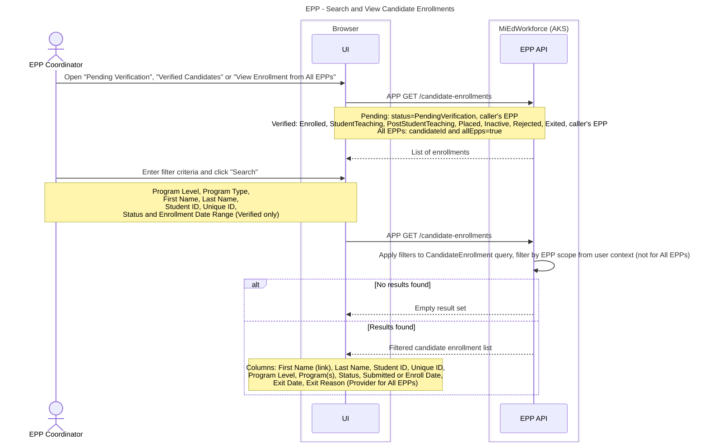
```mermaid
---
title: EPP - Search and View Candidate Enrollments
---
sequenceDiagram
    actor Coordinator as EPP Coordinator
    box Browser
    participant UI as UI
    end
    box MiEdWorkforce (AKS)
    participant EppApi as EPP API
    end

    Coordinator->>UI: Open "Pending Verification", "Verified Candidates" or "View Enrollment from All EPPs"
    UI->>EppApi: APP GET /candidate-enrollments
    Note over UI,EppApi: Pending: status=PendingVerification, caller's EPP<br/>Verified: Enrolled, StudentTeaching, PostStudentTeaching, Placed, Inactive, Rejected, Exited, caller's EPP<br/>All EPPs: candidateId and allEpps=true
    EppApi-->>UI: List of enrollments

    Coordinator->>UI: Enter filter criteria and click "Search"
    Note over Coordinator,UI: Program Level, Program Type,<br/>First Name, Last Name,<br/>Student ID, Unique ID,<br/>Status and Enrollment Date Range (Verified only)

    UI->>EppApi: APP GET /candidate-enrollments
    EppApi->>EppApi: Apply filters to CandidateEnrollment query, filter by EPP scope from user context (not for All EPPs)

    alt No results found
        EppApi-->>UI: Empty result set
    else Results found
        EppApi-->>UI: Filtered candidate enrollment list
        Note over UI: Columns: First Name (link), Last Name, Student ID, Unique ID,<br/>Program Level, Program(s), Status, Submitted or Enroll Date,<br/>Exit Date, Exit Reason (Provider for All EPPs)
    end
```

**Key Decisions:**
- **EPP Scope:** Results automatically filtered to coordinator's EPP only (the All EPPs view is the exception)
- **Status Filter:** Pending Verification is hard-coded to `PendingVerification` status
- **Multiple Statuses:** Verified Candidates default includes all verified statuses except PendingVerification
- **Clickable Name:** First Name is hyperlink to candidate detail view
- **Read-Only:** Coordinator can view but not edit enrollments from other EPPs
- **Full History:** All EPPs view shows all enrollments regardless of status or EPP
- **Highlighting:** Current EPP's records visually distinguished

**State Changes:**
- None (read-only query)

**Events Published:**
- None (query operation)

**Error Scenarios:**
- User lacks permission > Access denied
- Invalid filter values > Validation error
- No enrollments found > Display empty state message

---

## Accept Candidate Enrollment

**What:** EPP Coordinator verifies and accepts candidate enrollment with enrollment date and program details  
**When:** Candidate's enrollment information has been validated as correct  
**Who:** EPP Coordinator. Permission: epp.enrollment.verify (scoped to the caller's EPP)

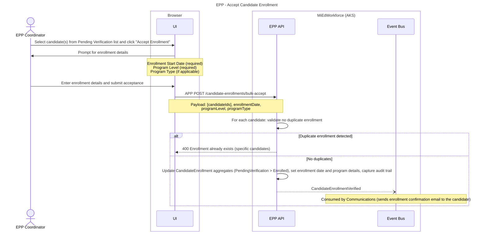
```mermaid
---
title: EPP - Accept Candidate Enrollment
---
sequenceDiagram
    actor Coordinator as EPP Coordinator
    box Browser
    participant UI as UI
    end
    box MiEdWorkforce (AKS)
    participant EppApi as EPP API
    participant EventBus as Event Bus
    end

    Coordinator->>UI: Select candidate(s) from Pending Verification list and click "Accept Enrollment"

    UI->>Coordinator: Prompt for enrollment details
    Note over UI: Enrollment Start Date (required)<br/>Program Level (required)<br/>Program Type (if applicable)

    Coordinator->>UI: Enter enrollment details and submit acceptance

    UI->>EppApi: APP POST /candidate-enrollments/bulk-accept
    Note over UI,EppApi: Payload: [candidateIds], enrollmentDate,<br/>programLevel, programType

    EppApi->>EppApi: For each candidate: validate no duplicate enrollment

    alt Duplicate enrollment detected
        EppApi-->>UI: 400 Enrollment already exists (specific candidates)
    else No duplicates
        EppApi->>EppApi: Update CandidateEnrollment aggregates (PendingVerification > Enrolled), set enrollment date and program details, capture audit trail
        EppApi--)EventBus: CandidateEnrollmentVerified
        Note over EventBus: Consumed by Communications (sends enrollment confirmation email to the candidate)
    end
```

**Key Decisions:**
- **Bulk Operation:** Supports single or multiple candidate acceptance
- **Duplicate Check:** Prevents duplicate enrollment records for same candidate/EPP/program
- **Program Type:** Required only for Teacher and School Administrator program levels

**State Changes:**
- CandidateEnrollment: `PendingVerification` > `Enrolled`

**Events Published:**
- `CandidateEnrollmentVerified` - Triggers candidate notification email, may affect credentialing eligibility

**Error Scenarios:**
- Duplicate enrollment > Block acceptance, display error for affected candidates
- Missing required program type > Validation error
- Invalid enrollment date > Validation error

---

## Reject Candidate Enrollment

**What:** EPP Coordinator denies enrollment verification with notification to candidate  
**When:** Candidate's enrollment information is incorrect or candidate not actually enrolled  
**Who:** EPP Coordinator. Permission: epp.enrollment.verify (scoped to the caller's EPP)

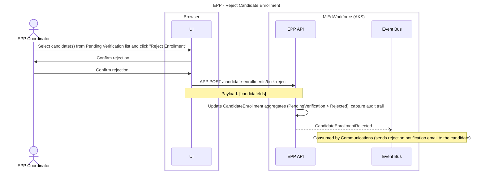
```mermaid
---
title: EPP - Reject Candidate Enrollment
---
sequenceDiagram
    actor Coordinator as EPP Coordinator
    box Browser
    participant UI as UI
    end
    box MiEdWorkforce (AKS)
    participant EppApi as EPP API
    participant EventBus as Event Bus
    end

    Coordinator->>UI: Select candidate(s) from Pending Verification list and click "Reject Enrollment"
    UI->>Coordinator: Confirm rejection
    Coordinator->>UI: Confirm rejection

    UI->>EppApi: APP POST /candidate-enrollments/bulk-reject
    Note over UI,EppApi: Payload: [candidateIds]

    EppApi->>EppApi: Update CandidateEnrollment aggregates (PendingVerification > Rejected), capture audit trail

    EppApi--)EventBus: CandidateEnrollmentRejected
    Note over EventBus: Consumed by Communications (sends rejection notification email to the candidate)
```

**Key Decisions:**
- **Bulk Operation:** Supports single or multiple candidate rejection
- **No Remarks Required:** Rejection does not require explanation (unlike application denial)

**State Changes:**
- CandidateEnrollment: `PendingVerification` > `Rejected`

**Events Published:**
- `CandidateEnrollmentRejected` - Triggers candidate notification email

**Error Scenarios:**
- User lacks permission > Access denied
- Enrollment not in PendingVerification status > Invalid state transition error

---

## View Candidate Enrollment Detail

**What:** EPP Coordinator views individual candidate's full enrollment history and programs  
**When:** Reviewing specific candidate's progress through EPP program  
**Who:** EPP Coordinator. Permission: epp.enrollment.view (scoped to the caller's EPP)

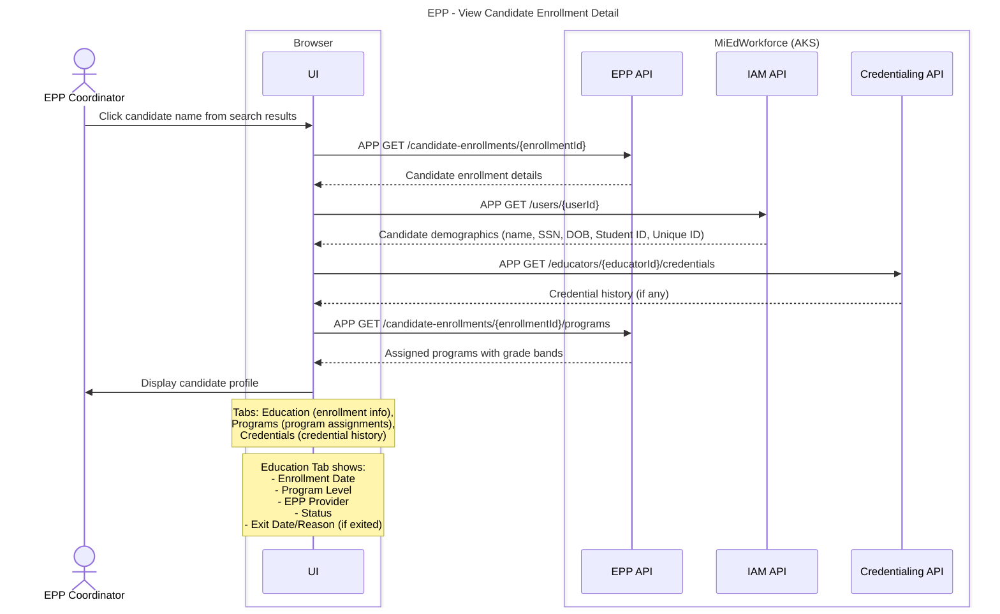
```mermaid
---
title: EPP - View Candidate Enrollment Detail
---
sequenceDiagram
    actor Coordinator as EPP Coordinator
    box Browser
    participant UI as UI
    end
    box MiEdWorkforce (AKS)
    participant EppApi as EPP API
    participant IamApi as IAM API
    participant CredApi as Credentialing API
    end

    Coordinator->>UI: Click candidate name from search results

    UI->>EppApi: APP GET /candidate-enrollments/{enrollmentId}
    EppApi-->>UI: Candidate enrollment details

    UI->>IamApi: APP GET /users/{userId}
    IamApi-->>UI: Candidate demographics (name, SSN, DOB, Student ID, Unique ID)

    UI->>CredApi: APP GET /educators/{educatorId}/credentials
    CredApi-->>UI: Credential history (if any)

    UI->>EppApi: APP GET /candidate-enrollments/{enrollmentId}/programs
    EppApi-->>UI: Assigned programs with grade bands

    UI->>Coordinator: Display candidate profile
    Note over UI: Tabs: Education (enrollment info),<br/>Programs (program assignments),<br/>Credentials (credential history)

    Note over UI: Education Tab shows:<br/>- Enrollment Date<br/>- Program Level<br/>- EPP Provider<br/>- Status<br/>- Exit Date/Reason (if exited)
```

**Key Decisions:**
- **Multi-Domain Data:** Pulls data from EPP (enrollment), IAM (demographics), Credentialing (credentials)
- **Tabbed Interface:** Organizes information by category
- **Read-Only View:** This sequence is display-only, updates handled by separate workflows

**State Changes:**
- None (read-only query)

**Events Published:**
- None (query operation)

**Error Scenarios:**
- User lacks permission > Access denied
- Enrollment not found > 404 error
- Candidate not found in IAM > Display partial data with error message

---

## Add Candidate Program

**What:** EPP Coordinator adds a program assigned to an enrolled candidate (editing a program's grade band is described under Key Decisions)  
**When:** Candidate adds/changes program concentrations or endorsements  
**Who:** EPP Coordinator. Permission: epp.enrollment.edit (scoped to the caller's EPP)  
**See also:** Remove Candidate Program

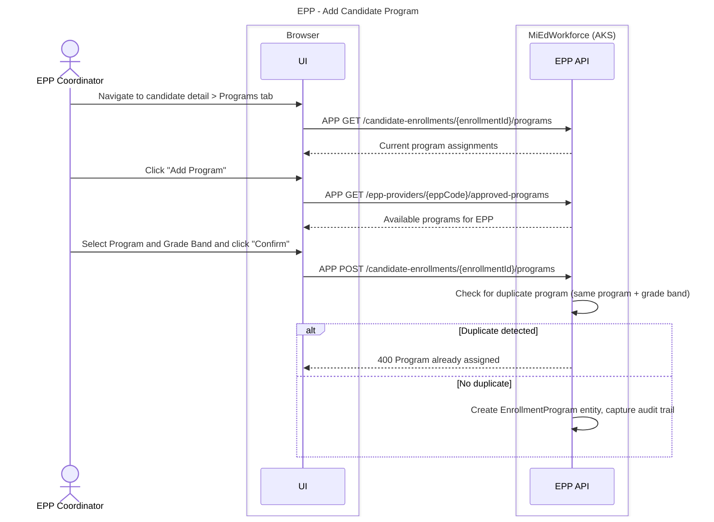
```mermaid
---
title: EPP - Add Candidate Program
---
sequenceDiagram
    actor Coordinator as EPP Coordinator
    box Browser
    participant UI as UI
    end
    box MiEdWorkforce (AKS)
    participant EppApi as EPP API
    end

    Coordinator->>UI: Navigate to candidate detail > Programs tab
    UI->>EppApi: APP GET /candidate-enrollments/{enrollmentId}/programs
    EppApi-->>UI: Current program assignments

    Coordinator->>UI: Click "Add Program"
    UI->>EppApi: APP GET /epp-providers/{eppCode}/approved-programs
    EppApi-->>UI: Available programs for EPP

    Coordinator->>UI: Select Program and Grade Band and click "Confirm"

    UI->>EppApi: APP POST /candidate-enrollments/{enrollmentId}/programs
    EppApi->>EppApi: Check for duplicate program (same program + grade band)

    alt Duplicate detected
        EppApi-->>UI: 400 Program already assigned
    else No duplicate
        EppApi->>EppApi: Create EnrollmentProgram entity, capture audit trail
    end
```

**Key Decisions:**
- **Duplicate Prevention:** Cannot add same program + grade band combination twice
- **EPP Scope:** Can only assign programs the EPP is approved to offer
- **Edit (not drawn):** A program's grade band is edited with `APP PUT /candidate-enrollments/{enrollmentId}/programs`. The EPP API updates the EnrollmentProgram and captures the audit trail

**State Changes:**
- EnrollmentProgram: `none` > `Active` (on add)

**Events Published:**
- None (internal enrollment update only)

**Error Scenarios:**
- Duplicate program > Block addition
- Invalid program for EPP > Validation error

---

## Remove Candidate Program

**What:** EPP Coordinator deletes a program assigned to an enrolled candidate  
**When:** Candidate adds/changes program concentrations or endorsements  
**Who:** EPP Coordinator. Permission: epp.enrollment.edit (scoped to the caller's EPP)  
**See also:** Add Candidate Program

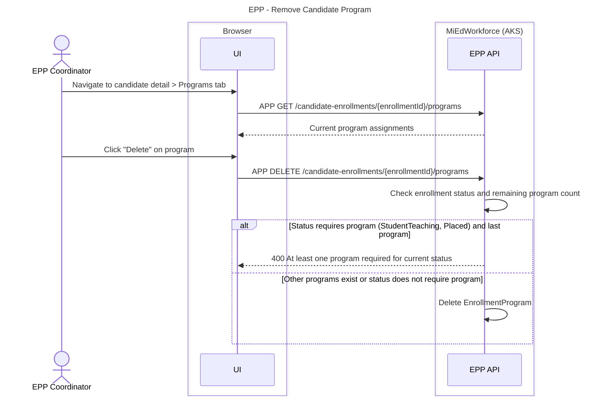
```mermaid
---
title: EPP - Remove Candidate Program
---
sequenceDiagram
    actor Coordinator as EPP Coordinator
    box Browser
    participant UI as UI
    end
    box MiEdWorkforce (AKS)
    participant EppApi as EPP API
    end

    Coordinator->>UI: Navigate to candidate detail > Programs tab
    UI->>EppApi: APP GET /candidate-enrollments/{enrollmentId}/programs
    EppApi-->>UI: Current program assignments

    Coordinator->>UI: Click "Delete" on program
    UI->>EppApi: APP DELETE /candidate-enrollments/{enrollmentId}/programs
    EppApi->>EppApi: Check enrollment status and remaining program count

    alt Status requires program (StudentTeaching, Placed) and last program
        EppApi-->>UI: 400 At least one program required for current status
    else Other programs exist or status does not require program
        EppApi->>EppApi: Delete EnrollmentProgram
    end
```

**Key Decisions:**
- **Status Validation:** Cannot delete last program if status is StudentTeaching or Placed

**State Changes:**
- EnrollmentProgram: `Active` > `deleted` (on delete, if allowed)

**Events Published:**
- None (internal enrollment update only)

**Error Scenarios:**
- Delete last program with status requiring program > Block deletion

---

## Update Candidate Enrollment Status

**What:** EPP Coordinator changes candidate status along valid state machine path  
**When:** Candidate progresses through program milestones  
**Who:** EPP Coordinator. Permission: epp.enrollment.edit (scoped to the caller's EPP)

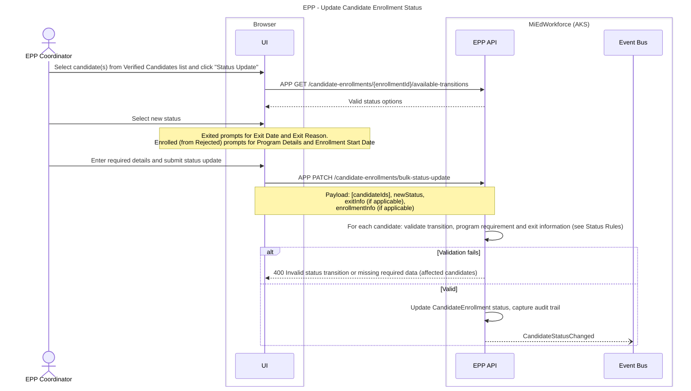
```mermaid
---
title: EPP - Update Candidate Enrollment Status
---
sequenceDiagram
    actor Coordinator as EPP Coordinator
    box Browser
    participant UI as UI
    end
    box MiEdWorkforce (AKS)
    participant EppApi as EPP API
    participant EventBus as Event Bus
    end

    Coordinator->>UI: Select candidate(s) from Verified Candidates list and click "Status Update"

    UI->>EppApi: APP GET /candidate-enrollments/{enrollmentId}/available-transitions
    EppApi-->>UI: Valid status options

    Coordinator->>UI: Select new status
    Note over UI: Exited prompts for Exit Date and Exit Reason.<br/>Enrolled (from Rejected) prompts for Program Details and Enrollment Start Date

    Coordinator->>UI: Enter required details and submit status update

    UI->>EppApi: APP PATCH /candidate-enrollments/bulk-status-update
    Note over UI,EppApi: Payload: [candidateIds], newStatus,<br/>exitInfo (if applicable),<br/>enrollmentInfo (if applicable)

    EppApi->>EppApi: For each candidate: validate transition, program requirement and exit information (see Status Rules)

    alt Validation fails
        EppApi-->>UI: 400 Invalid status transition or missing required data (affected candidates)
    else Valid
        EppApi->>EppApi: Update CandidateEnrollment status, capture audit trail
        EppApi--)EventBus: CandidateStatusChanged
    end
```

**Key Decisions:**
- **State Machine Validation:** Valid transitions differ by EPP type (Traditional vs Alternative)
- **Program Requirement:** StudentTeaching and Placed statuses require at least one assigned program
- **Bulk Operation:** Supports single or multiple candidate status updates
- **Exit Information:** Exit Date and Reason required when transitioning to Exited status

**Status Rules:**

| Rule | Applies when | Outcome if not met |
|---|---|---|
| Transition is valid for the current status and EPP type (Traditional vs Alternative) | Every status update | Block update, invalid status transition error |
| Candidate has at least one assigned program | New status is StudentTeaching or Placed | Block update, at least one program required |
| Exit Date and Exit Reason provided | New status is Exited | Validation error |
| Program Details and Enrollment Start Date provided | New status is Enrolled, from Rejected | Validation error |

**State Changes:**
- CandidateEnrollment: `CurrentStatus` > `NewStatus` (per state machine rules)

**Events Published:**
- `CandidateStatusChanged` - Internal tracking, may inform other domains of candidate progress

**Error Scenarios:**
- Invalid state transition per state machine > Block update
- Missing programs for StudentTeaching/Placed > Block update
- Missing exit information when status = Exited > Validation error

---

## Exit Candidate from Program

**What:** EPP Coordinator marks candidate as Exited with exit date and reason  
**When:** Candidate completes EPP program or withdraws  
**Who:** EPP Coordinator. Permission: epp.enrollment.edit (scoped to the caller's EPP)

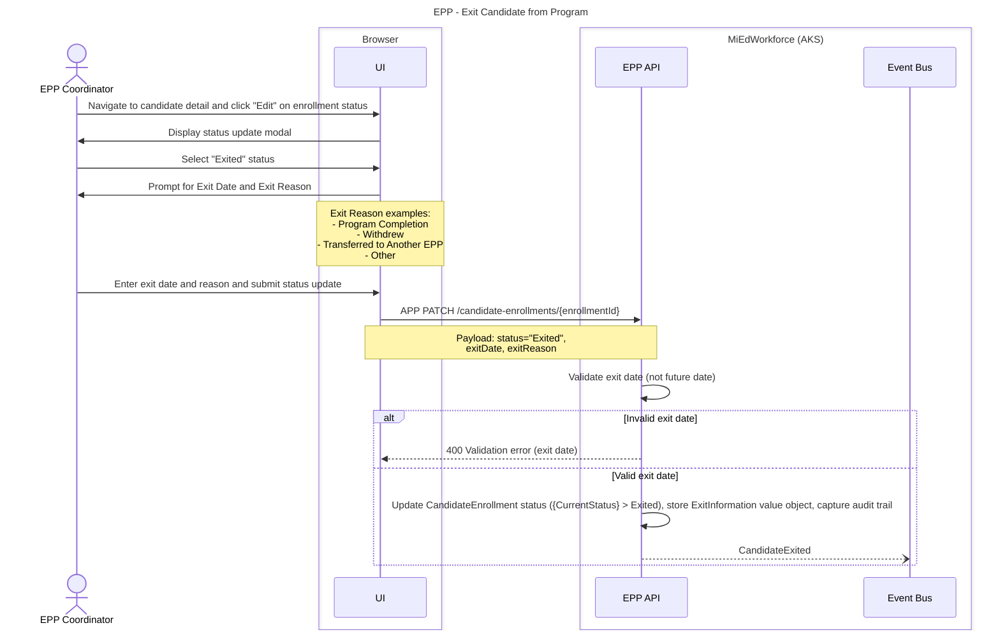
```mermaid
---
title: EPP - Exit Candidate from Program
---
sequenceDiagram
    actor Coordinator as EPP Coordinator
    box Browser
    participant UI as UI
    end
    box MiEdWorkforce (AKS)
    participant EppApi as EPP API
    participant EventBus as Event Bus
    end

    Coordinator->>UI: Navigate to candidate detail and click "Edit" on enrollment status
    UI->>Coordinator: Display status update modal

    Coordinator->>UI: Select "Exited" status
    UI->>Coordinator: Prompt for Exit Date and Exit Reason
    Note over UI: Exit Reason examples:<br/>- Program Completion<br/>- Withdrew<br/>- Transferred to Another EPP<br/>- Other

    Coordinator->>UI: Enter exit date and reason and submit status update

    UI->>EppApi: APP PATCH /candidate-enrollments/{enrollmentId}
    Note over UI,EppApi: Payload: status="Exited",<br/>exitDate, exitReason

    EppApi->>EppApi: Validate exit date (not future date)

    alt Invalid exit date
        EppApi-->>UI: 400 Validation error (exit date)
    else Valid exit date
        EppApi->>EppApi: Update CandidateEnrollment status ({CurrentStatus} > Exited), store ExitInformation value object, capture audit trail
        EppApi--)EventBus: CandidateExited
    end
```

**Key Decisions:**
- **Exit Information Required:** Both date and reason mandatory for Exited status
- **Date Validation:** Exit date cannot be in the future
- **Program Completion Tracking:** Exit reason distinguishes completion from withdrawal

**State Changes:**
- CandidateEnrollment: `{CurrentStatus}` > `Exited`

**Events Published:**
- `CandidateExited` - May affect credentialing application eligibility

**Error Scenarios:**
- Future exit date > Validation error
- Missing exit reason > Validation error

---

## Upload Tracking File

**What:** EPP Coordinator or EPP System Admin uploads file with candidate enrollment updates  
**When:** EPP has batch data from internal student information system  
**Who:** EPP Coordinator or EPP System Admin. Permission: epp.enrollment.bulk-upload (scoped to the caller's EPP)  
**See also:** Process Tracking File

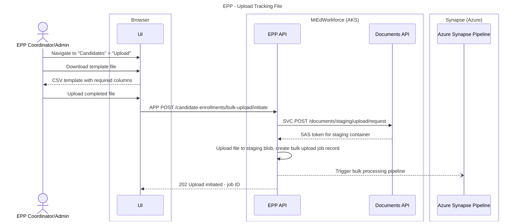
```mermaid
---
title: EPP - Upload Tracking File
---
sequenceDiagram
    actor User as EPP Coordinator/Admin
    box Browser
    participant UI as UI
    end
    box MiEdWorkforce (AKS)
    participant EppApi as EPP API
    participant DocsApi as Documents API
    end
    box Synapse (Azure)
    participant Synapse as Azure Synapse Pipeline
    end

    User->>UI: Navigate to "Candidates" > "Upload"
    User->>UI: Download template file
    UI-->>User: CSV template with required columns

    User->>UI: Upload completed file
    UI->>EppApi: APP POST /candidate-enrollments/bulk-upload/initiate

    EppApi->>DocsApi: SVC POST /documents/staging/upload/request
    DocsApi-->>EppApi: SAS token for staging container

    EppApi->>EppApi: Upload file to staging blob, create bulk upload job record
    EppApi--)Synapse: Trigger bulk processing pipeline
    EppApi-->>UI: 202 Upload initiated - job ID
```

**Key Decisions:**
- **Staging Upload:** Files uploaded to staging container for Synapse processing

**State Changes:**
- BulkUploadJob: `none` > `Pending`

**Events Published:**
- None (the pipeline run and its completion event are described in Process Tracking File)

**Error Scenarios:**
- Invalid file format > Reject entire file

---

## Process Tracking File

**What:** The Synapse pipeline validates the uploaded candidate tracking file, applies valid records and reports the result  
**When:** An EPP Coordinator or EPP System Admin has uploaded a candidate tracking file  
**Who:** EPP Coordinator or EPP System Admin (initiator). Permission: epp.enrollment.bulk-upload (scoped to the caller's EPP). The pipeline calls the EPP API as a service.  
**See also:** Upload Tracking File

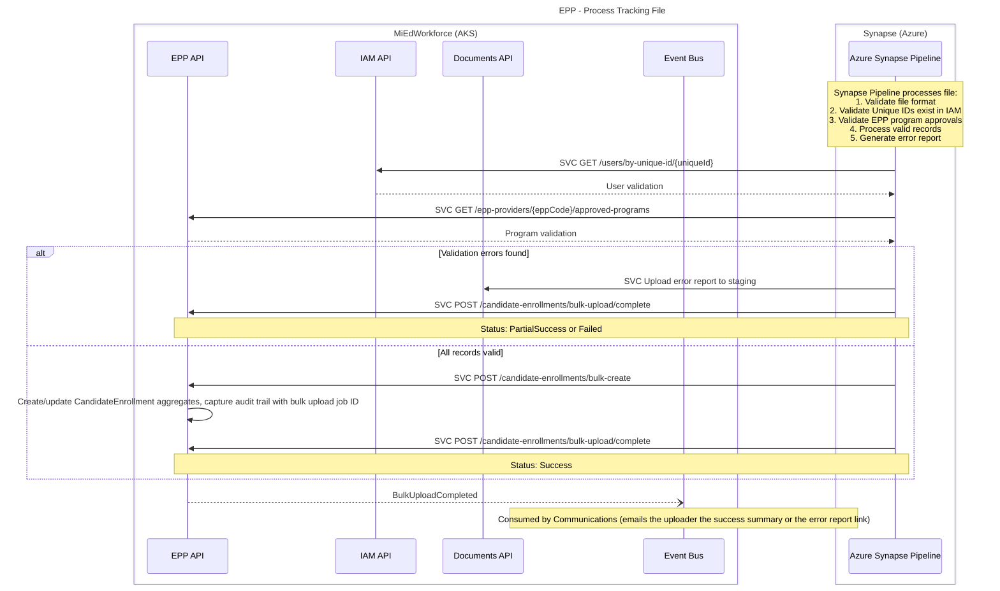
```mermaid
---
title: EPP - Process Tracking File
---
sequenceDiagram
    box MiEdWorkforce (AKS)
    participant EppApi as EPP API
    participant IamApi as IAM API
    participant DocsApi as Documents API
    participant EventBus as Event Bus
    end
    box Synapse (Azure)
    participant Synapse as Azure Synapse Pipeline
    end

    Note over Synapse: Synapse Pipeline processes file:<br/>1. Validate file format<br/>2. Validate Unique IDs exist in IAM<br/>3. Validate EPP program approvals<br/>4. Process valid records<br/>5. Generate error report

    Synapse->>IamApi: SVC GET /users/by-unique-id/{uniqueId}
    IamApi-->>Synapse: User validation

    Synapse->>EppApi: SVC GET /epp-providers/{eppCode}/approved-programs
    EppApi-->>Synapse: Program validation

    alt Validation errors found
        Synapse->>DocsApi: SVC Upload error report to staging
        Synapse->>EppApi: SVC POST /candidate-enrollments/bulk-upload/complete
        Note over Synapse,EppApi: Status: PartialSuccess or Failed
    else All records valid
        Synapse->>EppApi: SVC POST /candidate-enrollments/bulk-create
        EppApi->>EppApi: Create/update CandidateEnrollment aggregates, capture audit trail with bulk upload job ID
        Synapse->>EppApi: SVC POST /candidate-enrollments/bulk-upload/complete
        Note over Synapse,EppApi: Status: Success
    end

    EppApi--)EventBus: BulkUploadCompleted
    Note over EventBus: Consumed by Communications (emails the uploader the success summary or the error report link)
```

**Key Decisions:**
- **Validation Sequence:** Validate Unique IDs first, then program approvals
- **Partial Success:** System processes valid records even if some rows fail validation
- **Error Reporting:** Downloadable report identifies failing rows with reasons

**State Changes:**
- CandidateEnrollment: `none` > `PendingVerification` or `Enrolled` (per file data)
- BulkUploadJob: `Pending` > `Processing` > `Success`/`PartialSuccess`/`Failed`

**Events Published:**
- `BulkUploadCompleted` - Triggers notification email with results

**Error Scenarios:**
- Unique ID not found in IAM > Skip row, include in error report
- Program not approved for EPP > Skip row, include in error report
- Duplicate enrollment > Skip row, include in error report

---

## Search Credential Applications for Review

**What:** EPP Coordinator filters credential applications by certificate type, status, candidate info  
**When:** EPP needs to locate applications requiring review  
**Who:** EPP Coordinator. Permission: epp.applications.view (scoped to the caller's EPP)

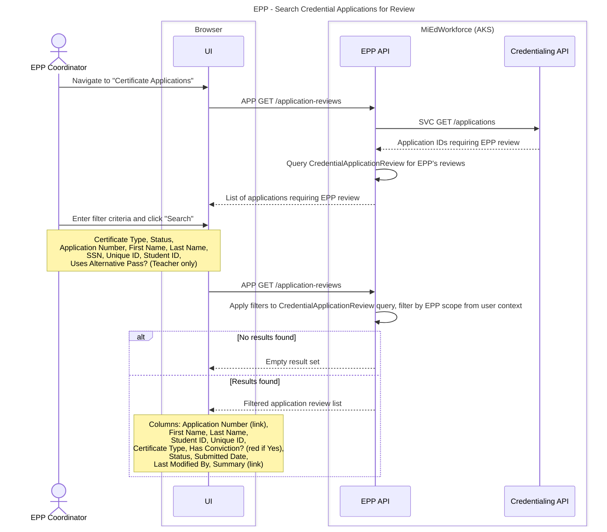
```mermaid
---
title: EPP - Search Credential Applications for Review
---
sequenceDiagram
    actor Coordinator as EPP Coordinator
    box Browser
    participant UI as UI
    end
    box MiEdWorkforce (AKS)
    participant EppApi as EPP API
    participant CredApi as Credentialing API
    end

    Coordinator->>UI: Navigate to "Certificate Applications"

    UI->>EppApi: APP GET /application-reviews
    EppApi->>CredApi: SVC GET /applications
    CredApi-->>EppApi: Application IDs requiring EPP review

    EppApi->>EppApi: Query CredentialApplicationReview for EPP's reviews
    EppApi-->>UI: List of applications requiring EPP review

    Coordinator->>UI: Enter filter criteria and click "Search"
    Note over Coordinator,UI: Certificate Type, Status,<br/>Application Number, First Name, Last Name,<br/>SSN, Unique ID, Student ID,<br/>Uses Alternative Pass? (Teacher only)

    UI->>EppApi: APP GET /application-reviews
    EppApi->>EppApi: Apply filters to CredentialApplicationReview query, filter by EPP scope from user context

    alt No results found
        EppApi-->>UI: Empty result set
    else Results found
        EppApi-->>UI: Filtered application review list
        Note over UI: Columns: Application Number (link),<br/>First Name, Last Name,<br/>Student ID, Unique ID,<br/>Certificate Type, Has Conviction? (red if Yes),<br/>Status, Submitted Date,<br/>Last Modified By, Summary (link)
    end
```

**Key Decisions:**
- **EPP Scope:** Results automatically filtered to coordinator's EPP only
- **Status Filter:** Typically shows `Submitted` and `Hold` statuses
- **Conviction Highlighting:** Applications with conviction flag displayed in red
- **Certificate Type Filtering:** Alternative Pass filter only available for Teacher applications

**State Changes:**
- None (read-only query)

**Events Published:**
- None (query operation)

**Error Scenarios:**
- User lacks permission > Access denied
- Invalid filter values > Validation error

---

## View Credential Application Detail for EPP Review

**What:** EPP Coordinator views application summary, MTTC results, candidate demographics, review history  
**When:** EPP needs to assess application before taking action  
**Who:** EPP Coordinator. Permission: epp.applications.view (scoped to the caller's EPP)

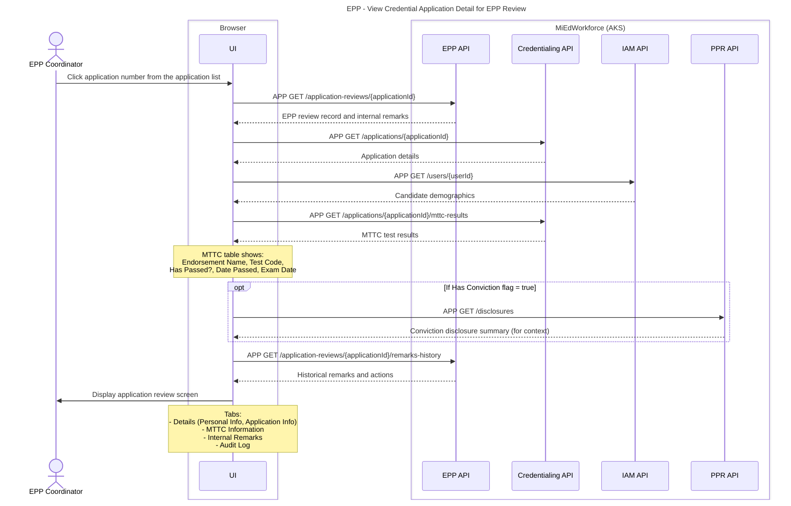
```mermaid
---
title: EPP - View Credential Application Detail for EPP Review
---
sequenceDiagram
    actor Coordinator as EPP Coordinator
    box Browser
    participant UI as UI
    end
    box MiEdWorkforce (AKS)
    participant EppApi as EPP API
    participant CredApi as Credentialing API
    participant IamApi as IAM API
    participant PprApi as PPR API
    end

    Coordinator->>UI: Click application number from the application list

    UI->>EppApi: APP GET /application-reviews/{applicationId}
    EppApi-->>UI: EPP review record and internal remarks

    UI->>CredApi: APP GET /applications/{applicationId}
    CredApi-->>UI: Application details

    UI->>IamApi: APP GET /users/{userId}
    IamApi-->>UI: Candidate demographics

    UI->>CredApi: APP GET /applications/{applicationId}/mttc-results
    CredApi-->>UI: MTTC test results
    Note over UI: MTTC table shows:<br/>Endorsement Name, Test Code,<br/>Has Passed?, Date Passed, Exam Date

    opt If Has Conviction flag = true
        UI->>PprApi: APP GET /disclosures
        PprApi-->>UI: Conviction disclosure summary (for context)
    end

    UI->>EppApi: APP GET /application-reviews/{applicationId}/remarks-history
    EppApi-->>UI: Historical remarks and actions

    UI->>Coordinator: Display application review screen
    Note over UI: Tabs:<br/>- Details (Personal Info, Application Info)<br/>- MTTC Information<br/>- Internal Remarks<br/>- Audit Log
```

**Key Decisions:**
- **Multi-Domain Data:** Pulls data from Credentialing (application), IAM (demographics), EPP (remarks/review status)
- **Conviction Context:** If conviction flag present, optionally show disclosure summary for context
- **Read-Only Application:** Actual application form is read-only from Credentialing domain

**State Changes:**
- None (read-only query)

**Events Published:**
- None (query operation)

**Error Scenarios:**
- User lacks permission > Access denied
- Application not found > 404 error
- MTTC results unavailable > Display warning, allow coordinator to proceed

---

## Place Credential Application on Hold

**What:** EPP Coordinator holds application with remarks explaining reason  
**When:** Application needs additional information or clarification  
**Who:** EPP Coordinator. Permission: epp.applications.review (scoped to the caller's EPP)

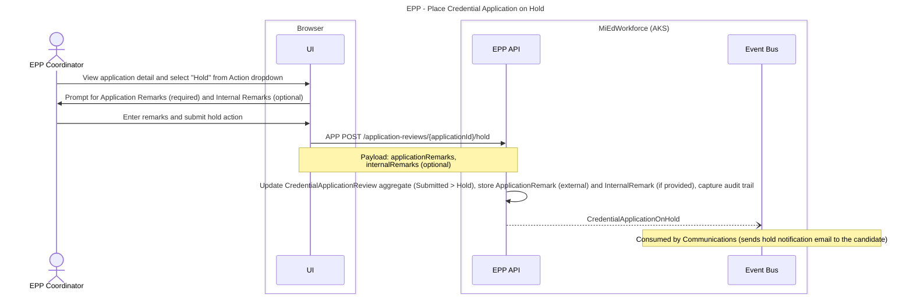
```mermaid
---
title: EPP - Place Credential Application on Hold
---
sequenceDiagram
    actor Coordinator as EPP Coordinator
    box Browser
    participant UI as UI
    end
    box MiEdWorkforce (AKS)
    participant EppApi as EPP API
    participant EventBus as Event Bus
    end

    Coordinator->>UI: View application detail and select "Hold" from Action dropdown

    UI->>Coordinator: Prompt for Application Remarks (required) and Internal Remarks (optional)

    Coordinator->>UI: Enter remarks and submit hold action

    UI->>EppApi: APP POST /application-reviews/{applicationId}/hold
    Note over UI,EppApi: Payload: applicationRemarks,<br/>internalRemarks (optional)

    EppApi->>EppApi: Update CredentialApplicationReview aggregate (Submitted > Hold), store ApplicationRemark (external) and InternalRemark (if provided), capture audit trail

    EppApi--)EventBus: CredentialApplicationOnHold
    Note over EventBus: Consumed by Communications (sends hold notification email to the candidate)
```

**Key Decisions:**
- **Application Remarks Required:** External remarks sent to candidate explaining hold reason
- **Internal Remarks Optional:** Internal notes not visible to candidate
- **No Re-Routing:** Application remains in EPP's filtered application list (status stays Hold) until EPP takes next action

**State Changes:**
- CredentialApplicationReview: `Submitted` > `Hold`

**Events Published:**
- `CredentialApplicationOnHold` - Triggers candidate notification email

**Error Scenarios:**
- Missing application remarks > Validation error
- User lacks permission > Access denied

---

## Deny Credential Application

**What:** EPP Coordinator denies application with required remarks  
**When:** Candidate doesn't meet EPP program requirements  
**Who:** EPP Coordinator. Permission: epp.applications.review (scoped to the caller's EPP)

```mermaid
---
title: EPP - Deny Credential Application
---
sequenceDiagram
    actor Coordinator as EPP Coordinator
    box Browser
    participant UI as UI
    end
    box MiEdWorkforce (AKS)
    participant EppApi as EPP API
    participant EventBus as Event Bus
    end

    Coordinator->>UI: View application detail and select "Deny" from Action dropdown

    UI->>Coordinator: Prompt for Application Remarks (required) and Internal Remarks (optional)

    Coordinator->>UI: Enter denial remarks and submit denial

    UI->>EppApi: APP POST /application-reviews/{applicationId}/deny
    Note over UI,EppApi: Payload: applicationRemarks,<br/>internalRemarks (optional)

    EppApi->>EppApi: Update CredentialApplicationReview aggregate (Submitted > Denied), store ApplicationRemark (external) and InternalRemark (if provided), capture audit trail

    EppApi--)EventBus: CredentialApplicationDenied
    Note over EventBus: Consumed by Credentialing (updates application status) and Communications (sends denial notification email to the candidate)
```

**Key Decisions:**
- **Application Remarks Required:** External remarks sent to candidate explaining denial reason
- **Status Update:** Application status updated in Credentialing domain to reflect EPP denial
- **Candidate Notification:** Candidate receives email with denial remarks

**State Changes:**
- CredentialApplicationReview: `Submitted` > `Denied`

**Events Published:**
- `CredentialApplicationDenied` - Triggers status update in Credentialing domain and candidate notification

**Error Scenarios:**
- Missing application remarks > Validation error
- User lacks permission > Access denied

---

## Cancel Credential Application Review

**What:** EPP Coordinator cancels application (e.g., candidate withdrew)  
**When:** Application is no longer being pursued  
**Who:** EPP Coordinator. Permission: epp.applications.review (scoped to the caller's EPP)

```mermaid
---
title: EPP - Cancel Credential Application Review
---
sequenceDiagram
    actor Coordinator as EPP Coordinator
    box Browser
    participant UI as UI
    end
    box MiEdWorkforce (AKS)
    participant EppApi as EPP API
    end

    Coordinator->>UI: View application detail and select "Cancel" from Action dropdown

    UI->>Coordinator: Prompt for Application Remarks (required) and Internal Remarks (optional)

    Coordinator->>UI: Enter cancellation reason and submit cancellation

    UI->>EppApi: APP POST /application-reviews/{applicationId}/cancel
    Note over UI,EppApi: Payload: applicationRemarks,<br/>internalRemarks (optional)

    EppApi->>EppApi: Update CredentialApplicationReview aggregate (Submitted > Cancelled), store ApplicationRemark (external) and InternalRemark (if provided), capture audit trail
```

**Key Decisions:**
- **Application Remarks Required:** External remarks document cancellation reason
- **No Notification:** Cancel action typically does not trigger candidate email (candidate already aware)
- **Final State:** Cancelled is a terminal state

**State Changes:**
- CredentialApplicationReview: `Submitted` > `Cancelled`

**Events Published:**
- None (internal status change only)

**Error Scenarios:**
- Missing application remarks > Validation error
- User lacks permission > Access denied

---

## Load Recommendation Context

**What:** EPP Coordinator opens the recommend action and the EPP API loads the endorsements requested by the candidate, the MTTC results and the endorsements the EPP can recommend  
**When:** Candidate meets EPP program and assessment requirements  
**Who:** EPP Coordinator. Permission: epp.applications.recommend (scoped to the caller's EPP)  
**See also:** Recommend Candidate for Credential

```mermaid
---
title: EPP - Load Recommendation Context
---
sequenceDiagram
    actor Coordinator as EPP Coordinator
    box Browser
    participant UI as UI
    end
    box MiEdWorkforce (AKS)
    participant EppApi as EPP API
    participant CredApi as Credentialing API
    end

    Coordinator->>UI: View application detail and select "Recommend" from Action dropdown

    UI->>EppApi: APP GET /application-reviews/{applicationId}
    EppApi->>CredApi: SVC GET /applications/{applicationId}/requested-endorsements
    CredApi-->>EppApi: Endorsements requested by candidate
    EppApi->>CredApi: SVC GET /applications/{applicationId}/mttc-results
    CredApi-->>EppApi: MTTC test results
    EppApi-->>UI: Review record with requested endorsements and MTTC results

    UI->>EppApi: APP GET /epp-providers/{eppCode}/approved-endorsements
    EppApi-->>UI: Endorsements EPP can recommend

    UI->>Coordinator: Display endorsement selection grid
    Note over UI: Grid shows:<br/>- Recommend (checkbox)<br/>- Endorsement Name<br/>- Code, Grade Band<br/>- Action by Applicant<br/>- Action (Edit/Add)

    opt Add additional endorsement
        Coordinator->>UI: Click "Add Endorsement", select endorsement and grade band (EPP approved only)
    end
```

**Key Decisions:**
- **Endorsement Scope:** Only endorsements within EPP's approved scope are offered for selection
- **Credentialing Reads:** The EPP API reads requested endorsements and MTTC results from the Credentialing API on the caller's behalf

**State Changes:**
- None (read-only query)

**Events Published:**
- None (query operation)

**Error Scenarios:**
- User lacks permission > Access denied

---

## Recommend Candidate for Credential

**What:** EPP Coordinator recommends application with selected endorsements  
**When:** Candidate meets EPP program and assessment requirements  
**Who:** EPP Coordinator. Permission: epp.applications.recommend (scoped to the caller's EPP)  
**See also:** Load Recommendation Context

```mermaid
---
title: EPP - Recommend Candidate for Credential
---
sequenceDiagram
    actor Coordinator as EPP Coordinator
    box Browser
    participant UI as UI
    end
    box MiEdWorkforce (AKS)
    participant EppApi as EPP API
    participant CredApi as Credentialing API
    participant EventBus as Event Bus
    end

    Coordinator->>UI: Select/adjust endorsements to recommend, enter Internal Remarks (optional) and submit recommendation

    UI->>EppApi: APP POST /application-reviews/{applicationId}/recommend
    Note over UI,EppApi: Payload: recommendedEndorsements[],<br/>internalRemarks (optional)

    EppApi->>EppApi: Validate at least one endorsement selected and all endorsements in EPP approved list (see Recommendation Rules)

    EppApi->>CredApi: SVC GET /applications/{applicationId}/mttc-results
    CredApi-->>EppApi: MTTC results

    EppApi->>EppApi: Validate MTTC pass for each endorsement

    alt MTTC not passed for endorsement
        EppApi-->>UI: Warning - MTTC not passed (override allowed if Alternative Pass)
    else MTTC passed or Alternative Pass
        EppApi->>EppApi: Update CredentialApplicationReview aggregate (Submitted > Recommended), create RecommendedEndorsement entities, store InternalRemark (if provided), capture audit trail

        EppApi--)EventBus: CredentialApplicationRecommended
        Note over EventBus: Consumed by Credentialing (routes to payment in-state or OEE out-of-state) and Communications (sends recommendation confirmation email)
    end
```

**Key Decisions:**
- **Endorsement Validation:** Must recommend at least one endorsement within EPP's approved scope
- **MTTC Validation:** System validates MTTC pass status for each endorsement
- **Alternative Pass Override:** Coordinator can proceed if candidate used alternative assessment pathway
- **Routing Logic:** In-state applications route to payment; out-of-state to OEE/State Credential Admin for review

**Recommendation Rules:**

| Rule | Applies when | Outcome if not met |
|---|---|---|
| At least one endorsement selected | Every recommendation | Validation error |
| Every endorsement is in the EPP approved list | Every recommendation | Validation error, endorsement not in EPP scope |
| MTTC passed for each endorsement | Every recommendation | Warning, override allowed if Alternative Pass |

**State Changes:**
- CredentialApplicationReview: `Submitted` > `Recommended`

**Events Published:**
- `CredentialApplicationRecommended` - Triggers payment workflow (in-state) or OEE routing (out-of-state), sends candidate notification

**Error Scenarios:**
- No endorsements selected > Validation error
- Endorsement not in EPP approved list > Validation error
- MTTC not passed (without Alternative Pass) > Warning, require override
- User lacks permission > Access denied

---

## Add Internal Remarks to Application Review

**What:** EPP Coordinator adds notes visible only to EPP staff  
**When:** Documenting internal review discussions or tracking information  
**Who:** EPP Coordinator. Permission: epp.applications.review (scoped to the caller's EPP)

```mermaid
---
title: EPP - Add Internal Remarks to Application Review
---
sequenceDiagram
    actor Coordinator as EPP Coordinator
    box Browser
    participant UI as UI
    end
    box MiEdWorkforce (AKS)
    participant EppApi as EPP API
    end

    Coordinator->>UI: View application detail and navigate to "Internal Remarks" tab

    UI->>EppApi: APP GET /application-reviews/{applicationId}/internal-remarks
    EppApi-->>UI: Existing internal remarks history

    Coordinator->>UI: Enter new internal remark and submit
    UI->>EppApi: APP POST /application-reviews/{applicationId}/internal-remarks
    Note over UI,EppApi: Payload: remarkText

    EppApi->>EppApi: Create InternalRemark value object, associate with CredentialApplicationReview, capture author and timestamp

    UI->>EppApi: APP GET /application-reviews/{applicationId}/internal-remarks
    EppApi-->>UI: Updated remarks list
```

**Key Decisions:**
- **Internal Only:** Remarks never visible to candidate, only to EPP staff
- **Audit Trail:** Author and timestamp captured for accountability
- **No Status Change:** Adding remarks does not change application review status

**State Changes:**
- None (metadata addition only)

**Events Published:**
- None (internal notes only)

**Error Scenarios:**
- Empty remark text > Validation error
- User lacks permission > Access denied

---

## Search Approval Applications for Review

**What:** EPP Coordinator filters approval applications by category, type, status  
**When:** EPP needs to review alternative route approval applications  
**Who:** EPP Coordinator. Permission: epp.approvals.view (scoped to the caller's EPP)

```mermaid
---
title: EPP - Search Approval Applications for Review
---
sequenceDiagram
    actor Coordinator as EPP Coordinator
    box Browser
    participant UI as UI
    end
    box MiEdWorkforce (AKS)
    participant EppApi as EPP API
    participant CredApi as Credentialing API
    end

    Coordinator->>UI: Navigate to "Certificate Applications" > "Approval" tab

    UI->>EppApi: APP GET /approval-application-reviews
    EppApi->>CredApi: SVC GET /applications/approvals
    CredApi-->>EppApi: Approval application IDs requiring EPP review

    EppApi->>EppApi: Query ApprovalApplicationReview for EPP's reviews
    EppApi-->>UI: List of approval applications requiring EPP review

    Coordinator->>UI: Enter filter criteria and click "Search"
    Note over Coordinator,UI: Status, Application Number,<br/>First Name, Last Name,<br/>SSN, Unique ID, Student ID,<br/>Approval Category, Approval Type

    UI->>EppApi: APP GET /approval-application-reviews
    EppApi->>EppApi: Apply filters to ApprovalApplicationReview query, filter by EPP scope from user context

    alt No results found
        EppApi-->>UI: Empty result set
    else Results found
        EppApi-->>UI: Filtered approval application review list
        Note over UI: Columns: Application Number (link),<br/>First Name, Last Name,<br/>Student ID, Unique ID,<br/>Approval Type, School District,<br/>Has Conviction? (red if Yes),<br/>Status, Submitted on,<br/>Last Modified By, Summary (link)
    end
```

**Key Decisions:**
- **EPP Scope:** Results automatically filtered to coordinator's EPP only
- **Approval-Specific Filters:** Approval Category and Approval Type replace Certificate Type
- **ISD Context:** School District displayed to show originating ISD

**State Changes:**
- None (read-only query)

**Events Published:**
- None (query operation)

**Error Scenarios:**
- User lacks permission > Access denied
- Invalid filter values > Validation error

---

## View Approval Application Detail for EPP Review

**What:** EPP Coordinator views approval application including acknowledgements, professional practice responses  
**When:** EPP needs to assess approval application before recommendation/denial  
**Who:** EPP Coordinator. Permission: epp.approvals.view (scoped to the caller's EPP)

```mermaid
---
title: EPP - View Approval Application Detail for EPP Review
---
sequenceDiagram
    actor Coordinator as EPP Coordinator
    box Browser
    participant UI as UI
    end
    box MiEdWorkforce (AKS)
    participant EppApi as EPP API
    participant CredApi as Credentialing API
    participant IamApi as IAM API
    participant OrgApi as Organizations API
    participant PprApi as PPR API
    end

    Coordinator->>UI: Click application number from the approval application list

    UI->>EppApi: APP GET /approval-application-reviews/{applicationId}
    EppApi-->>UI: EPP review record

    UI->>CredApi: APP GET /applications/approvals/{applicationId}
    CredApi-->>UI: Approval application details

    UI->>IamApi: APP GET /users/{userId}
    IamApi-->>UI: Candidate demographics

    UI->>OrgApi: APP GET /organizations/{organizationCode}
    OrgApi-->>UI: School district information

    opt If Has Conviction flag = true
        UI->>PprApi: APP GET /disclosures
        PprApi-->>UI: Professional practice responses
    end

    UI->>EppApi: APP GET /approval-application-reviews/{applicationId}/history
    EppApi-->>UI: Application action history

    UI->>Coordinator: Display approval application review screen
    Note over UI: Sections:<br/>- Applicant Information<br/>- Application Information<br/>- Other Information (School District,<br/>  Program Category, College/University,<br/>  Effective Date)<br/>- Application Acknowledgements<br/>- Professional Practices<br/>- Approval Application History
```

**Key Decisions:**
- **ISD Context:** School district and program category central to approval application review
- **Acknowledgements:** Applicant attestations specific to approval category displayed
- **Professional Practice Integration:** If conviction flag present, show PPR responses for review

**State Changes:**
- None (read-only query)

**Events Published:**
- None (query operation)

**Error Scenarios:**
- User lacks permission > Access denied
- Application not found > 404 error
- School district not found in EEM > Display warning

---

## Recommend Approval Application

**What:** EPP Coordinator recommends approval application (returns to the ISD/School District)  
**When:** Candidate meets alternative route requirements  
**Who:** EPP Coordinator. Permission: epp.approvals.review (scoped to the caller's EPP)

```mermaid
---
title: EPP - Recommend Approval Application
---
sequenceDiagram
    actor Coordinator as EPP Coordinator
    box Browser
    participant UI as UI
    end
    box MiEdWorkforce (AKS)
    participant EppApi as EPP API
    participant EventBus as Event Bus
    end

    Coordinator->>UI: View approval application detail and select "Recommend" from Action dropdown

    UI->>Coordinator: Prompt for Remarks (optional)

    Coordinator->>UI: Enter optional remarks and submit recommendation

    UI->>EppApi: APP POST /approval-application-reviews/{applicationId}/recommend
    Note over UI,EppApi: Payload: remarks (optional)

    EppApi->>EppApi: Update ApprovalApplicationReview aggregate (Submitted > Recommended by EPP), store ReviewRemark (if provided), capture audit trail

    EppApi--)EventBus: ApprovalApplicationRecommended
    Note over EventBus: Consumed by Credentialing (returns application to ISD/School District) and Communications (sends notification to ISD)
```

**Key Decisions:**
- **Remarks Optional:** Unlike denial, recommendation remarks are optional
- **ISD Return:** Application routes back to the ISD/School District, not to state OEE
- **No Direct Approval:** EPP recommendation is not final approval; ISD/district retains control

**State Changes:**
- ApprovalApplicationReview: `Submitted` > `Recommended by EPP`

**Events Published:**
- `ApprovalApplicationRecommended` - Triggers return of the application to the ISD/School District and ISD notification

**Error Scenarios:**
- User lacks permission > Access denied

---

## Deny Approval Application

**What:** EPP Coordinator denies approval application with required remarks (returns to the ISD/School District)  
**When:** Candidate doesn't meet EPP requirements for alternative route  
**Who:** EPP Coordinator. Permission: epp.approvals.review (scoped to the caller's EPP)

```mermaid
---
title: EPP - Deny Approval Application
---
sequenceDiagram
    actor Coordinator as EPP Coordinator
    box Browser
    participant UI as UI
    end
    box MiEdWorkforce (AKS)
    participant EppApi as EPP API
    participant EventBus as Event Bus
    end

    Coordinator->>UI: View approval application detail and select "Deny" from Action dropdown

    UI->>Coordinator: Prompt for Remarks (required)

    Coordinator->>UI: Enter denial remarks and submit denial

    UI->>EppApi: APP POST /approval-application-reviews/{applicationId}/deny
    Note over UI,EppApi: Payload: remarks (required)

    EppApi->>EppApi: Validate remarks provided

    alt Missing remarks
        EppApi-->>UI: 400 Validation error (remarks required)
    else Remarks provided
        EppApi->>EppApi: Update ApprovalApplicationReview aggregate (Submitted > Denied), store ReviewRemark, capture audit trail

        EppApi--)EventBus: ApprovalApplicationDenied
        Note over EventBus: Consumed by Credentialing (returns application to ISD/School District) and Communications (sends notification with denial remarks to ISD)
    end
```

**Key Decisions:**
- **Remarks Required:** Denial must include explanation for ISD
- **ISD Return:** Application routes back to the ISD/School District for resolution
- **ISD Notification:** Email sent to ISD with denial remarks

**State Changes:**
- ApprovalApplicationReview: `Submitted` > `Denied`

**Events Published:**
- `ApprovalApplicationDenied` - Triggers return of the application to the ISD/School District and ISD notification with remarks

**Error Scenarios:**
- Missing required remarks > Validation error
- User lacks permission > Access denied

---
