# Identity & Access Management (IAM) - Workflows & Sequences

This document contains sequence diagrams for all workflows in the IAM domain.

**Conventions:**
- Solid arrows (`->>`) = Synchronous calls
- Dashed arrows (`-->>`) = Responses
- Dotted arrows (`--)`) = Async/fire-and-forget (events)
- **actor** = Human users only
- **participant** = Every non-human: UI, internal services, event bus, and external systems
- Participants are grouped with `box`: Browser (UI), MiEdWorkforce (AKS) (services and Event Bus), External (external systems)
- Every request arrow carries an API-kind tag followed by the verb and path from the API catalog: `APP` (Application API, UI to owning service), `SVC` (Service API, system call, calling service authorized only), `SVC+USER` (Service API, delegated call, calling service and signed-in user both authorized), `EXT` (External API, inbound from an external caller), `OUT` (outbound call to an external system). Responses carry no tag.
- Every application API call is authorized by the owning service through the cached IAM permission check (Service API). It is not drawn unless noted.

---

## Citizen User - Sign-In and Authorization Check

**What:** Citizen user authenticates via MiLogin and is checked for an existing Unique ID and authorization (identity matching and auto-approved Individual scope access continue in Citizen User - Account Creation (Mi-Key Match))  
**When:** First-time citizen logs in via MiLogin  
**Who:** Citizen User (teacher, educator); Permission: iam.authorization.view-own (own authorizations only)

See also: Citizen User - Account Creation (Mi-Key Match)

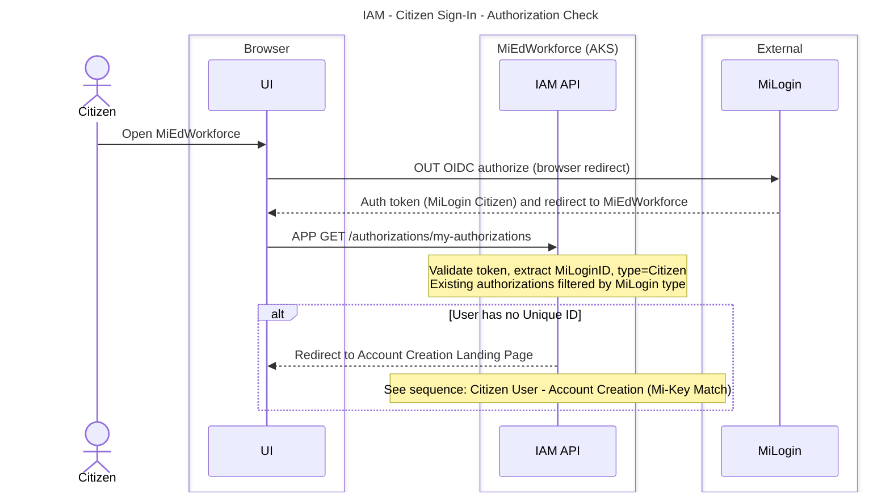
```mermaid
---
title: IAM - Citizen Sign-In - Authorization Check
---
sequenceDiagram
    actor Citizen
    box Browser
    participant UI
    end
    box MiEdWorkforce (AKS)
    participant IamApi as IAM API
    end
    box External
    participant MiLogin
    end

    Citizen->>UI: Open MiEdWorkforce
    UI->>MiLogin: OUT OIDC authorize (browser redirect)
    MiLogin-->>UI: Auth token (MiLogin Citizen) and redirect to MiEdWorkforce

    UI->>IamApi: APP GET /authorizations/my-authorizations
    Note over IamApi: Validate token, extract MiLoginID, type=Citizen<br/>Existing authorizations filtered by MiLogin type

    alt User has no Unique ID
        IamApi-->>UI: Redirect to Account Creation Landing Page
        Note over IamApi: See sequence: Citizen User - Account Creation (Mi-Key Match)
    end
```

**Key Decisions:**
- **MiLogin context:** Authorization is tied to Citizen identity type

**State Changes:**
- None (read-only check)

**Events Published:**
- None

**Error Scenarios:**
- Authentication fails at MiLogin > Display user-friendly error; allow retry

---

## Citizen User - Account Creation (Mi-Key Match)

**What:** Citizen user completes identity matching and receives auto-approved Individual scope access  
**When:** First-time citizen logs in via MiLogin and has no Unique ID  
**Who:** Citizen User (teacher, educator); Permission: iam.citizen-identity.submit-request (citizen users only)

See also: Citizen User - Sign-In and Authorization Check; Identity Administrator - Resolve Identity Request

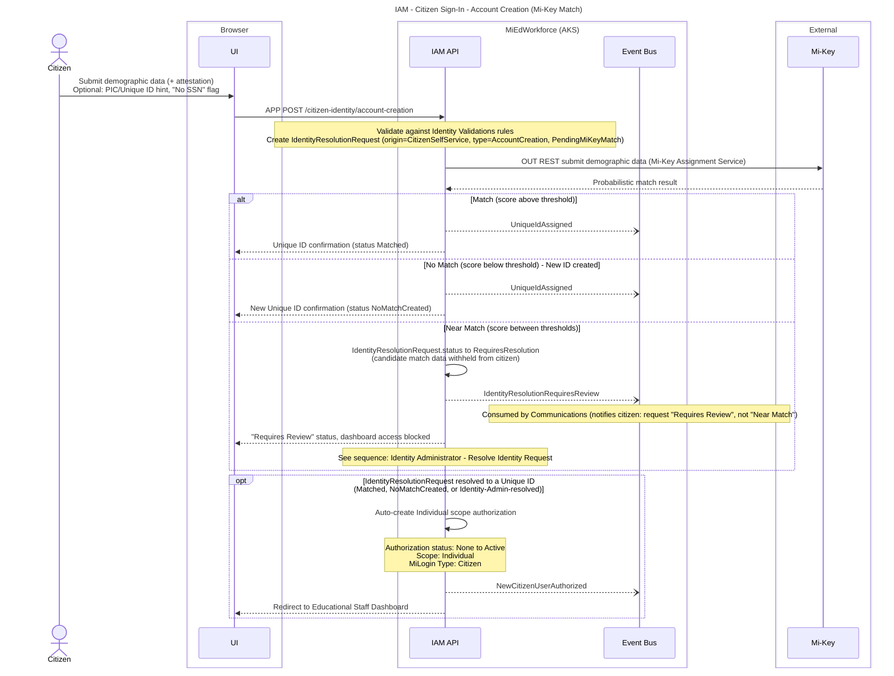
```mermaid
---
title: IAM - Citizen Sign-In - Account Creation (Mi-Key Match)
---
sequenceDiagram
    actor Citizen
    box Browser
    participant UI
    end
    box MiEdWorkforce (AKS)
    participant IamApi as IAM API
    participant EventBus as Event Bus
    end
    box External
    participant MiKey as Mi-Key
    end

    Citizen->>UI: Submit demographic data (+ attestation)<br/>Optional: PIC/Unique ID hint, "No SSN" flag
    UI->>IamApi: APP POST /citizen-identity/account-creation
    Note over IamApi: Validate against Identity Validations rules<br/>Create IdentityResolutionRequest (origin=CitizenSelfService, type=AccountCreation, PendingMiKeyMatch)
    IamApi->>MiKey: OUT REST submit demographic data (Mi-Key Assignment Service)
    MiKey-->>IamApi: Probabilistic match result

    alt Match (score above threshold)
        IamApi--)EventBus: UniqueIdAssigned
        IamApi-->>UI: Unique ID confirmation (status Matched)
    else No Match (score below threshold) - New ID created
        IamApi--)EventBus: UniqueIdAssigned
        IamApi-->>UI: New Unique ID confirmation (status NoMatchCreated)
    else Near Match (score between thresholds)
        IamApi->>IamApi: IdentityResolutionRequest.status to RequiresResolution<br/>(candidate match data withheld from citizen)
        IamApi--)EventBus: IdentityResolutionRequiresReview
        Note over EventBus: Consumed by Communications (notifies citizen: request "Requires Review", not "Near Match")
        IamApi-->>UI: "Requires Review" status, dashboard access blocked
        Note over IamApi: See sequence: Identity Administrator - Resolve Identity Request
    end

    opt IdentityResolutionRequest resolved to a Unique ID (Matched, NoMatchCreated, or Identity-Admin-resolved)
        IamApi->>IamApi: Auto-create Individual scope authorization
        Note over IamApi: Authorization status: None to Active<br/>Scope: Individual<br/>MiLogin Type: Citizen
        IamApi--)EventBus: NewCitizenUserAuthorized
        IamApi-->>UI: Redirect to Educational Staff Dashboard
    end
```

**Key Decisions:**
- **Citizen auto-approval:** No Lead Admin approval required; citizen is accessing their own data
- **Near Match withholds candidate data:** Per FDD 15.8 §15.8.5, the citizen is never shown potential-match details or the term "Near Match" — only a generic "Requires Review"/"On Hold" status, to avoid exposing another individual's demographic data

**State Changes:**
- IdentityResolutionRequest status: `None` > `PendingMiKeyMatch` > `Matched` | `NoMatchCreated` | `RequiresResolution`
- Authorization status: `None` > `Active` (Individual scope, Citizen type) — only once the IdentityResolutionRequest resolves to a Unique ID

**Events Published:**
- `IdentityResolutionRequiresReview` - Fires when Mi-Key returns Near Match
- `NewCitizenUserAuthorized` - Fires when Unique ID assigned/resolved and Individual authorization created

**Error Scenarios:**
- Validation failure > User corrects and resubmits or cancels; nothing sent to Mi-Key (errors displayed, data not persisted)
- Identity matching fails (Mi-Key unavailable) > User remains on Account Creation page with error
- Near Match > User cannot proceed to dashboard until Identity Administrator resolves (see below)

---

## Business User - Initial Authorization Request

**What:** Business user submits authorization request for roles at a specific scope  
**When:** Business user first attempts to access MiEdWorkforce after MiLogin authentication  
**Who:** Business User (district admin, EPP coordinator, etc.); Permission: iam.authorization.request (any authenticated Business or Worker user)

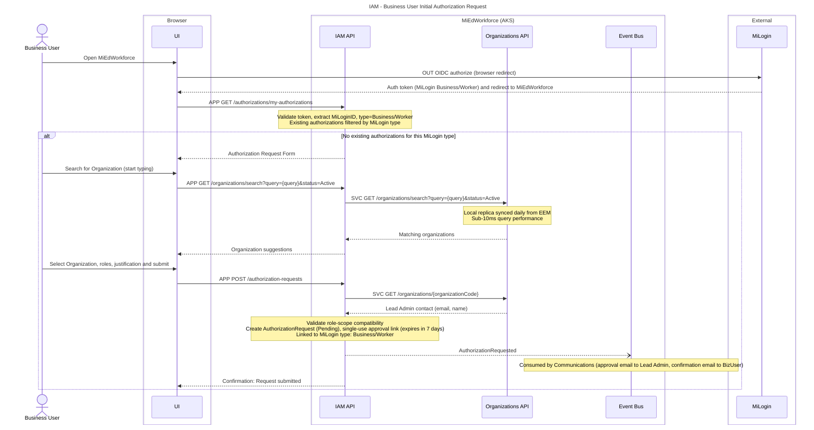
```mermaid
---
title: IAM - Business User Initial Authorization Request
---
sequenceDiagram
    actor BizUser as Business User
    box Browser
    participant UI
    end
    box MiEdWorkforce (AKS)
    participant IamApi as IAM API
    participant OrgsApi as Organizations API
    participant EventBus as Event Bus
    end
    box External
    participant MiLogin
    end

    BizUser->>UI: Open MiEdWorkforce
    UI->>MiLogin: OUT OIDC authorize (browser redirect)
    MiLogin-->>UI: Auth token (MiLogin Business/Worker) and redirect to MiEdWorkforce

    UI->>IamApi: APP GET /authorizations/my-authorizations
    Note over IamApi: Validate token, extract MiLoginID, type=Business/Worker<br/>Existing authorizations filtered by MiLogin type

    alt No existing authorizations for this MiLogin type
        IamApi-->>UI: Authorization Request Form

        BizUser->>UI: Search for Organization (start typing)
        UI->>IamApi: APP GET /organizations/search?query={query}&status=Active
        IamApi->>OrgsApi: SVC GET /organizations/search?query={query}&status=Active
        Note over OrgsApi: Local replica synced daily from EEM<br/>Sub-10ms query performance
        OrgsApi-->>IamApi: Matching organizations
        IamApi-->>UI: Organization suggestions

        BizUser->>UI: Select Organization, roles, justification and submit
        UI->>IamApi: APP POST /authorization-requests
        IamApi->>OrgsApi: SVC GET /organizations/{organizationCode}
        OrgsApi-->>IamApi: Lead Admin contact (email, name)

        Note over IamApi: Validate role-scope compatibility<br/>Create AuthorizationRequest (Pending), single-use approval link (expires in 7 days)<br/>Linked to MiLogin type: Business/Worker

        IamApi--)EventBus: AuthorizationRequested
        Note over EventBus: Consumed by Communications (approval email to Lead Admin, confirmation email to BizUser)

        IamApi-->>UI: Confirmation: Request submitted
    end
```

**Key Decisions:**
- **Organization search:** Predictive search with debouncing; calls Organizations API typeahead endpoint
- **Approval routing:** Lead Admin email retrieved from Organizations API and cached by IAM keyed by org code; see IAM Technical Considerations for unmasked email caching strategy
- **Link expiration:** 7-day default (configurable by System Admin via InactivityPolicy-like config)
- **MiLogin context:** Authorization request tied to Business or Worker identity type

**State Changes:**
- AuthorizationRequest status: `None` > `Pending`

**Events Published:**
- `AuthorizationRequested` - Fires when user submits request

**Error Scenarios:**
- Invalid Organization code > Form validation error
- Role not applicable to scope > Form validation error
- Organizations API unavailable > Display error, allow retry; IAM serves from org-data cache if available

---

## Lead Administrator Bootstrap (First Login)

**What:** When a user designated as Lead Administrator in EEM authenticates for the first time, they are automatically granted approval permissions  
**When:** First login after being designated as Lead Admin in EEM  
**Who:** Lead Administrator per EEM data

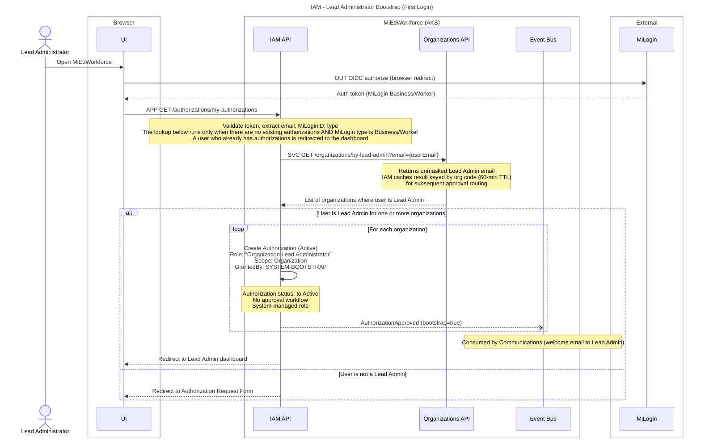
```mermaid
---
title: IAM - Lead Administrator Bootstrap (First Login)
---
sequenceDiagram
    actor LeadAdmin as Lead Administrator
    box Browser
    participant UI
    end
    box MiEdWorkforce (AKS)
    participant IamApi as IAM API
    participant OrgsApi as Organizations API
    participant EventBus as Event Bus
    end
    box External
    participant MiLogin
    end

    LeadAdmin->>UI: Open MiEdWorkforce
    UI->>MiLogin: OUT OIDC authorize (browser redirect)
    MiLogin-->>UI: Auth token (MiLogin Business/Worker)

    UI->>IamApi: APP GET /authorizations/my-authorizations
    Note over IamApi: Validate token, extract email, MiLoginID, type<br/>The lookup below runs only when there are no existing authorizations AND MiLogin type is Business/Worker<br/>A user who already has authorizations is redirected to the dashboard

    IamApi->>OrgsApi: SVC GET /organizations/by-lead-admin?email={userEmail}
    Note over OrgsApi: Returns unmasked Lead Admin email<br/>IAM caches result keyed by org code (60-min TTL)<br/>for subsequent approval routing
    OrgsApi-->>IamApi: List of organizations where user is Lead Admin

    alt User is Lead Admin for one or more organizations
        loop For each organization
            IamApi->>IamApi: Create Authorization (Active)<br/>Role: "Organization Lead Administrator"<br/>Scope: Organization<br/>GrantedBy: SYSTEM-BOOTSTRAP
            Note over IamApi: Authorization status: to Active<br/>No approval workflow<br/>System-managed role
            IamApi--)EventBus: AuthorizationApproved (bootstrap=true)
        end
        Note over EventBus: Consumed by Communications (welcome email to Lead Admin)
        IamApi-->>UI: Redirect to Lead Admin dashboard
    else User is not a Lead Admin
        IamApi-->>UI: Redirect to Authorization Request Form
    end
```

**Key Decisions:**
- **Auto-grant:** System automatically grants "Organization Lead Administrator" role
- **Organizations API as source of truth:** Email match against Lead Admin data synced from EEM via CEPI; IAM calls `GET /organizations/by-lead-admin` and caches the unmasked email per org code for approval routing use
- **Multiple Organizations:** One person can be Lead Admin for multiple Organizations (receives role for each)
- **No revocation on change:** If EEM LeadAdmin changes, existing authorization is NOT automatically revoked

**State Changes:**
- Authorization status: `None` > `Active` (bypasses Pending)

**Events Published:**
- `AuthorizationApproved` with `grantedBy: "SYSTEM-BOOTSTRAP"`

**Configuration:**
- "Organization Lead Administrator" role is system-defined
- Contains: `iam.authorization.approve`, `iam.authorization.deny`, `iam.authorization.view`, `iam.authorization.revoke`
- Applicable scopes: [Building, District, ISD, EPP, Nonpublic, PLS]

---

## Scope Approver - Approves Authorization Request

**What:** Lead Administrator reviews authorization request and approves it (optionally modifying roles)  
**When:** Lead Admin clicks approval link in email notification  
**Who:** Scope Authorization Approver (Lead Administrator per EEM); Permission: iam.authorization.approve (scope of the request's organization)

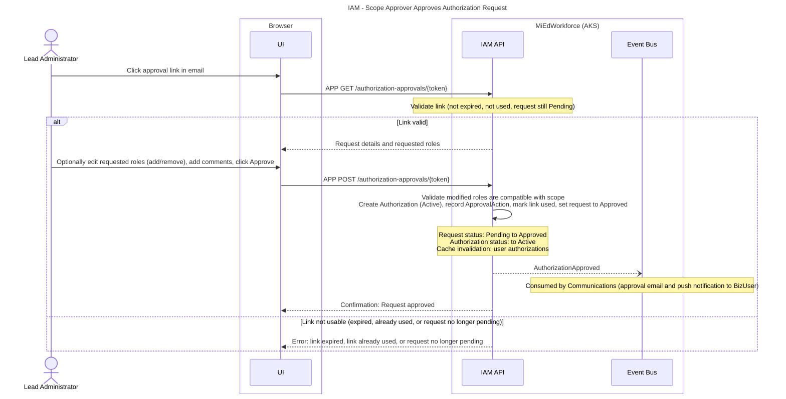
```mermaid
---
title: IAM - Scope Approver Approves Authorization Request
---
sequenceDiagram
    actor LeadAdmin as Lead Administrator
    box Browser
    participant UI
    end
    box MiEdWorkforce (AKS)
    participant IamApi as IAM API
    participant EventBus as Event Bus
    end

    LeadAdmin->>UI: Click approval link in email
    UI->>IamApi: APP GET /authorization-approvals/{token}
    Note over IamApi: Validate link (not expired, not used, request still Pending)

    alt Link valid
        IamApi-->>UI: Request details and requested roles

        LeadAdmin->>UI: Optionally edit requested roles (add/remove), add comments, click Approve
        UI->>IamApi: APP POST /authorization-approvals/{token}

        IamApi->>IamApi: Validate modified roles are compatible with scope<br/>Create Authorization (Active), record ApprovalAction, mark link used, set request to Approved

        Note over IamApi: Request status: Pending to Approved<br/>Authorization status: to Active<br/>Cache invalidation: user authorizations

        IamApi--)EventBus: AuthorizationApproved
        Note over EventBus: Consumed by Communications (approval email and push notification to BizUser)

        IamApi-->>UI: Confirmation: Request approved
    else Link not usable (expired, already used, or request no longer pending)
        IamApi-->>UI: Error: link expired, link already used, or request no longer pending
    end
```

**Key Decisions:**
- **Role modification:** Lead Admin can adjust roles before approval (grant fewer or different roles than requested)
- **Single-use link:** Once actioned (approve/deny), link cannot be reused
- **Cache invalidation:** User authorization cache is cleared on approval

**State Changes:**
- AuthorizationRequest status: `Pending` > `Approved`
- Authorization status: `None` > `Active`

**Events Published:**
- `AuthorizationApproved` - Fires when Lead Admin approves request

**Error Scenarios:**
- Expired link > User must resubmit request
- Link already used > Display error
- Request withdrawn > Cannot approve

---

## Scope Approver - Rejects Authorization Request

**What:** Lead Administrator denies authorization request with optional comments  
**When:** Lead Admin clicks approval link and chooses to deny  
**Who:** Scope Authorization Approver (Lead Administrator per EEM); Permission: iam.authorization.deny (scope of the request's organization)

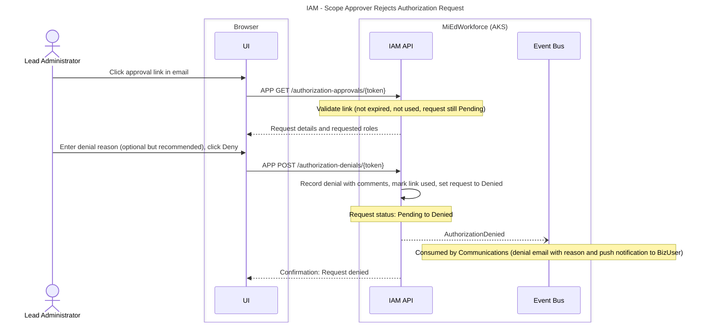
```mermaid
---
title: IAM - Scope Approver Rejects Authorization Request
---
sequenceDiagram
    actor LeadAdmin as Lead Administrator
    box Browser
    participant UI
    end
    box MiEdWorkforce (AKS)
    participant IamApi as IAM API
    participant EventBus as Event Bus
    end

    LeadAdmin->>UI: Click approval link in email
    UI->>IamApi: APP GET /authorization-approvals/{token}
    Note over IamApi: Validate link (not expired, not used, request still Pending)
    IamApi-->>UI: Request details and requested roles

    LeadAdmin->>UI: Enter denial reason (optional but recommended), click Deny
    UI->>IamApi: APP POST /authorization-denials/{token}

    IamApi->>IamApi: Record denial with comments, mark link used, set request to Denied

    Note over IamApi: Request status: Pending to Denied

    IamApi--)EventBus: AuthorizationDenied
    Note over EventBus: Consumed by Communications (denial email with reason and push notification to BizUser)

    IamApi-->>UI: Confirmation: Request denied
```

**Key Decisions:**
- **Denial reason:** Optional but recommended for user clarity
- **No authorization created:** User must submit new request if denied

**State Changes:**
- AuthorizationRequest status: `Pending` > `Denied`

**Events Published:**
- `AuthorizationDenied` - Fires when Lead Admin denies request

**Error Scenarios:**
- User must resubmit entirely new request if denied

---

## Business User - Withdraws Pending Authorization Request

**What:** Business user cancels their own pending authorization request  
**When:** User changes mind before Lead Admin takes action  
**Who:** Business User; Permission: iam.authorization.withdraw (own requests only)

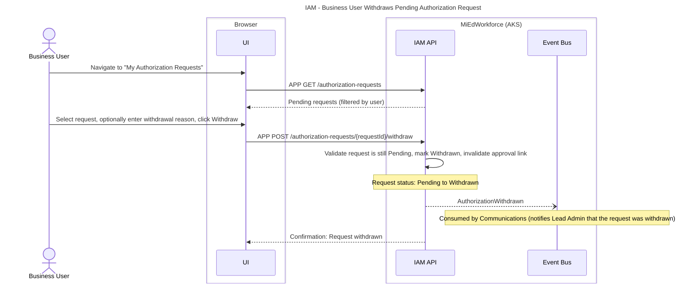
```mermaid
---
title: IAM - Business User Withdraws Pending Authorization Request
---
sequenceDiagram
    actor BizUser as Business User
    box Browser
    participant UI
    end
    box MiEdWorkforce (AKS)
    participant IamApi as IAM API
    participant EventBus as Event Bus
    end

    BizUser->>UI: Navigate to "My Authorization Requests"
    UI->>IamApi: APP GET /authorization-requests
    IamApi-->>UI: Pending requests (filtered by user)

    BizUser->>UI: Select request, optionally enter withdrawal reason, click Withdraw
    UI->>IamApi: APP POST /authorization-requests/{requestId}/withdraw

    IamApi->>IamApi: Validate request is still Pending, mark Withdrawn, invalidate approval link

    Note over IamApi: Request status: Pending to Withdrawn

    IamApi--)EventBus: AuthorizationWithdrawn
    Note over EventBus: Consumed by Communications (notifies Lead Admin that the request was withdrawn)

    IamApi-->>UI: Confirmation: Request withdrawn
```

**Key Decisions:**
- **Link invalidation:** Lead Admin's approval link becomes invalid when user withdraws
- **No re-activation:** Withdrawn requests cannot be re-activated; user must submit new request

**State Changes:**
- AuthorizationRequest status: `Pending` > `Withdrawn`

**Events Published:**
- `AuthorizationWithdrawn` - Fires when user withdraws request

**Error Scenarios:**
- Attempt to withdraw non-Pending request > Error message

---

## Authorization Request - Link Expiration

**What:** Automated expiration of approval links after configured timeout  
**When:** Scheduled job runs (e.g., nightly) and identifies expired requests  
**Who:** System (automated); Permission: iam.inactivity.run (job trigger, per iam-api.yml)

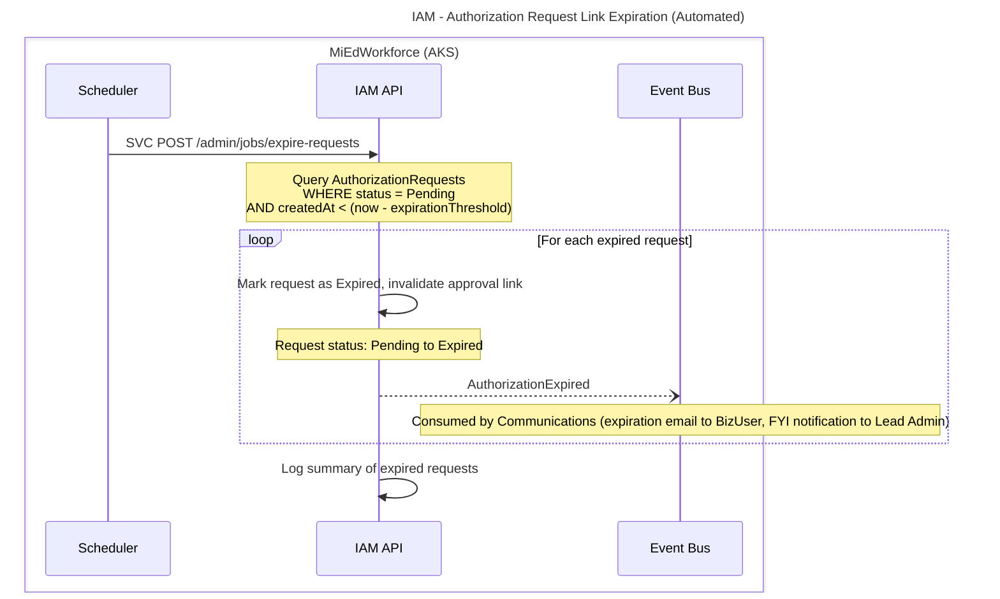
```mermaid
---
title: IAM - Authorization Request Link Expiration (Automated)
---
sequenceDiagram
    box MiEdWorkforce (AKS)
    participant Scheduler
    participant IamApi as IAM API
    participant EventBus as Event Bus
    end

    Scheduler->>IamApi: SVC POST /admin/jobs/expire-requests
    Note over IamApi: Query AuthorizationRequests<br/>WHERE status = Pending<br/>AND createdAt < (now - expirationThreshold)

    loop For each expired request
        IamApi->>IamApi: Mark request as Expired, invalidate approval link

        Note over IamApi: Request status: Pending to Expired

        IamApi--)EventBus: AuthorizationExpired
        Note over EventBus: Consumed by Communications (expiration email to BizUser, FYI notification to Lead Admin)
    end

    IamApi->>IamApi: Log summary of expired requests
```

**Key Decisions:**
- **Expiration threshold:** 7 days by default (configurable via system settings)
- **Notification:** Both user and Lead Admin notified when request expires
- **No auto-extend:** User must resubmit new request if expired

**State Changes:**
- AuthorizationRequest status: `Pending` > `Expired`

**Events Published:**
- `AuthorizationExpired` - Fires when request expires

**Configuration:**
- Expiration threshold stored in system configuration (similar to InactivityPolicy)

---

## Business User - Request Authorization Update

**What:** User adds new roles or Organization to existing authorization  
**When:** User needs expanded access  
**Who:** Business User with existing active authorization; Permission: iam.authorization.request (any authenticated Business or Worker user)

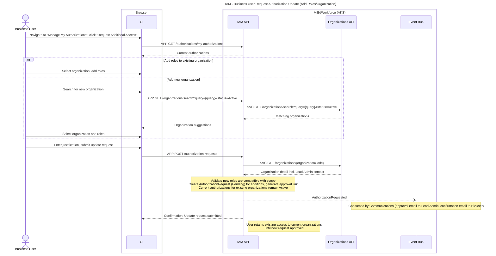
```mermaid
---
title: IAM - Business User Request Authorization Update (Add Roles/Organization)
---
sequenceDiagram
    actor BizUser as Business User
    box Browser
    participant UI
    end
    box MiEdWorkforce (AKS)
    participant IamApi as IAM API
    participant OrgsApi as Organizations API
    participant EventBus as Event Bus
    end

    BizUser->>UI: Navigate to "Manage My Authorizations", click "Request Additional Access"
    UI->>IamApi: APP GET /authorizations/my-authorizations
    IamApi-->>UI: Current authorizations

    alt Add roles to existing organization
        BizUser->>UI: Select organization, add roles
    else Add new organization
        BizUser->>UI: Search for new organization
        UI->>IamApi: APP GET /organizations/search?query={query}&status=Active
        IamApi->>OrgsApi: SVC GET /organizations/search?query={query}&status=Active
        OrgsApi-->>IamApi: Matching organizations
        IamApi-->>UI: Organization suggestions
        BizUser->>UI: Select organization and roles
    end

    BizUser->>UI: Enter justification, submit update request
    UI->>IamApi: APP POST /authorization-requests

    IamApi->>OrgsApi: SVC GET /organizations/{organizationCode}
    OrgsApi-->>IamApi: Organization detail incl. Lead Admin contact

    Note over IamApi: Validate new roles are compatible with scope<br/>Create AuthorizationRequest (Pending) for additions, generate approval link<br/>Current authorizations for existing organizations remain Active

    IamApi--)EventBus: AuthorizationRequested
    Note over EventBus: Consumed by Communications (approval email to Lead Admin, confirmation email to BizUser)

    IamApi-->>UI: Confirmation: Update request submitted
    Note right of IamApi: User retains existing access to current organizations<br/>until new request approved
```

**Key Decisions:**
- **Approval required:** Even for existing users, new roles/Organization require Lead Admin approval
- **Current access preserved:** User retains existing authorizations during approval process
- **Multiple simultaneous requests:** User can have multiple pending requests for different Organization

**State Changes:**
- AuthorizationRequest status: `None` > `Pending` (for additions)
- Existing Authorization status: remains `Active`

**Events Published:**
- `AuthorizationRequested` - Fires when user submits update request
- `AuthorizationApproved` or `AuthorizationDenied` - Fires when Lead Admin acts on update

**Post-Approval:**
- If approved, `AuthorizationUpdated` event is published with `addedRoles[]` and/or `addedOrganizations[]`

---

## Business User - Self-Remove Authorization

**What:** User removes their own authorization for an Organization or role  
**When:** User no longer needs access or leaves position  
**Who:** Business User; Permission: iam.authorization.remove-own (own authorizations only)

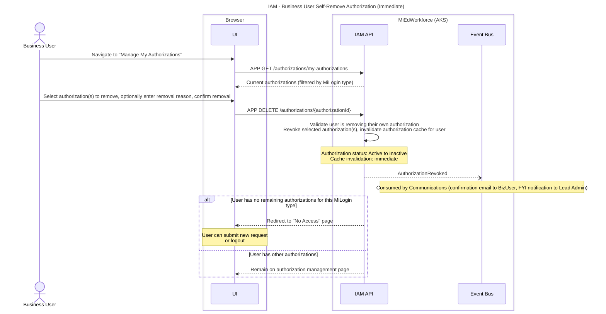
```mermaid
---
title: IAM - Business User Self-Remove Authorization (Immediate)
---
sequenceDiagram
    actor BizUser as Business User
    box Browser
    participant UI
    end
    box MiEdWorkforce (AKS)
    participant IamApi as IAM API
    participant EventBus as Event Bus
    end

    BizUser->>UI: Navigate to "Manage My Authorizations"
    UI->>IamApi: APP GET /authorizations/my-authorizations
    IamApi-->>UI: Current authorizations (filtered by MiLogin type)

    BizUser->>UI: Select authorization(s) to remove, optionally enter removal reason, confirm removal
    UI->>IamApi: APP DELETE /authorizations/{authorizationId}

    IamApi->>IamApi: Validate user is removing their own authorization<br/>Revoke selected authorization(s), invalidate authorization cache for user

    Note over IamApi: Authorization status: Active to Inactive<br/>Cache invalidation: immediate

    IamApi--)EventBus: AuthorizationRevoked
    Note over EventBus: Consumed by Communications (confirmation email to BizUser, FYI notification to Lead Admin)

    alt User has no remaining authorizations for this MiLogin type
        IamApi-->>UI: Redirect to "No Access" page
        Note over UI: User can submit new request<br/>or logout
    else User has other authorizations
        IamApi-->>UI: Remain on authorization management page
    end
```

**Key Decisions:**
- **Immediate removal:** Self-removal is instant; no approval needed
- **Lead Admin notified:** Admin is informed but doesn't need to approve
- **MiLogin context:** Only removes authorizations for current MiLogin type

**State Changes:**
- Authorization status: `Active` > `Inactive`

**Events Published:**
- `AuthorizationRevoked` with `revokedBy: userId`, `reason: "self-removal"`

**Error Scenarios:**
- User attempts to remove last authorization > Warning displayed (still allowed)

---

## External Party - Request User Authorization Removal

**What:** Unauthenticated party submits public form to request removal of a user's authorization  
**When:** Ex-supervisor, HR, or other party needs to revoke access for a user  
**Who:** External Requesting Individual (no login required); Permission: none (public endpoint, external-public)

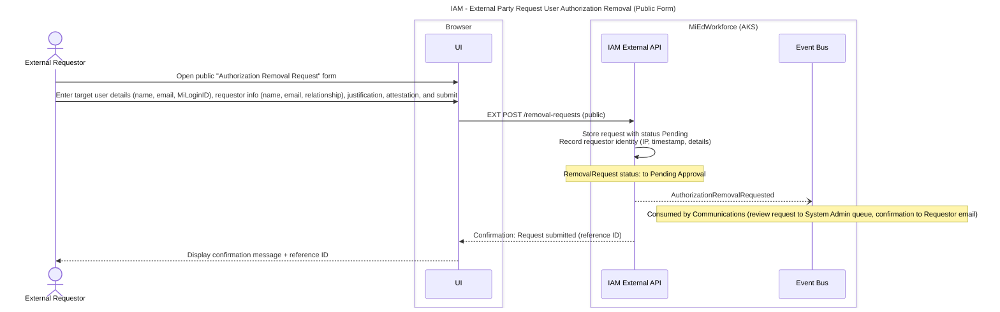
```mermaid
---
title: IAM - External Party Request User Authorization Removal (Public Form)
---
sequenceDiagram
    actor Requestor as External Requestor
    box Browser
    participant UI
    end
    box MiEdWorkforce (AKS)
    participant IamExtApi as IAM External API
    participant EventBus as Event Bus
    end

    Requestor->>UI: Open public "Authorization Removal Request" form
    Requestor->>UI: Enter target user details (name, email, MiLoginID), requestor info (name, email, relationship), justification, attestation, and submit

    UI->>IamExtApi: EXT POST /removal-requests (public)
    IamExtApi->>IamExtApi: Store request with status Pending<br/>Record requestor identity (IP, timestamp, details)

    Note over IamExtApi: RemovalRequest status: to Pending Approval

    IamExtApi--)EventBus: AuthorizationRemovalRequested
    Note over EventBus: Consumed by Communications (review request to System Admin queue, confirmation to Requestor email)

    IamExtApi-->>UI: Confirmation: Request submitted (reference ID)
    UI-->>Requestor: Display confirmation message + reference ID
```

**Key Decisions:**
- **Admin approval required:** External removal requests require System Admin review to prevent abuse
- **No authentication:** Form accessible without login for accessibility (ex-employees may not have access)
- **Requestor identity captured:** IP, timestamp, and contact info stored for accountability

**State Changes:**
- RemovalRequest status: `None` > `Pending Approval`

**Events Published:**
- `AuthorizationRemovalRequested` - Fires when external party submits request

---

## System Admin - Reviews External Authorization Removal Request

**What:** System Admin reviews and approves/denies external authorization removal request  
**When:** After external party submits removal request  
**Who:** System Administrator; Permission: iam.removal-request.review (system-wide, System Admin only)

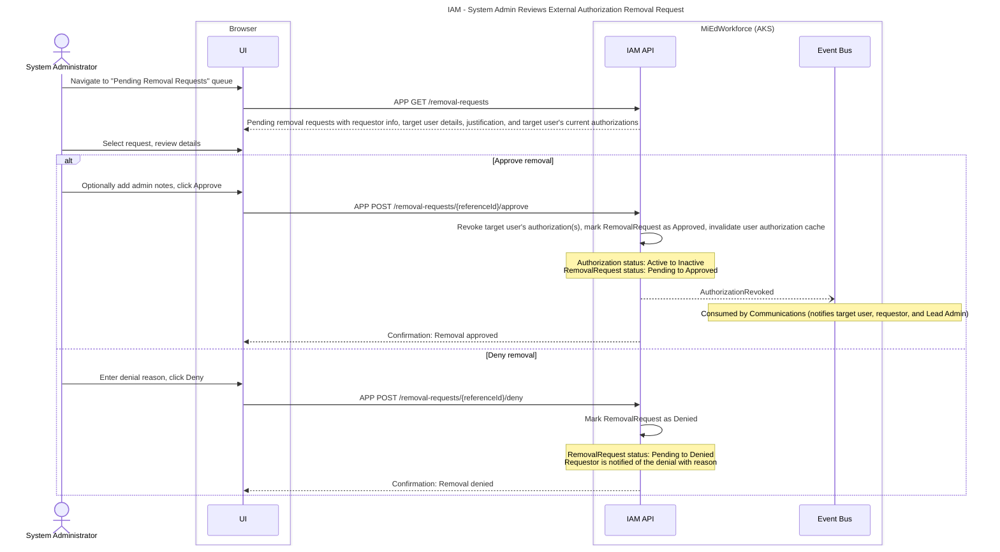
```mermaid
---
title: IAM - System Admin Reviews External Authorization Removal Request
---
sequenceDiagram
    actor SysAdmin as System Administrator
    box Browser
    participant UI
    end
    box MiEdWorkforce (AKS)
    participant IamApi as IAM API
    participant EventBus as Event Bus
    end

    SysAdmin->>UI: Navigate to "Pending Removal Requests" queue
    UI->>IamApi: APP GET /removal-requests
    IamApi-->>UI: Pending removal requests with requestor info, target user details, justification, and target user's current authorizations

    SysAdmin->>UI: Select request, review details

    alt Approve removal
        SysAdmin->>UI: Optionally add admin notes, click Approve
        UI->>IamApi: APP POST /removal-requests/{referenceId}/approve

        IamApi->>IamApi: Revoke target user's authorization(s), mark RemovalRequest as Approved, invalidate user authorization cache

        Note over IamApi: Authorization status: Active to Inactive<br/>RemovalRequest status: Pending to Approved

        IamApi--)EventBus: AuthorizationRevoked
        Note over EventBus: Consumed by Communications (notifies target user, requestor, and Lead Admin)

        IamApi-->>UI: Confirmation: Removal approved
    else Deny removal
        SysAdmin->>UI: Enter denial reason, click Deny
        UI->>IamApi: APP POST /removal-requests/{referenceId}/deny

        IamApi->>IamApi: Mark RemovalRequest as Denied

        Note over IamApi: RemovalRequest status: Pending to Denied<br/>Requestor is notified of the denial with reason

        IamApi-->>UI: Confirmation: Removal denied
    end
```

**Key Decisions:**
- **Manual review:** System Admin validates legitimacy before revoking access
- **Denial option:** Admin can deny fraudulent or erroneous requests
- **Multi-party notification:** Target user, requestor, and Lead Admin all notified

**State Changes:**
- Authorization status: `Active` > `Inactive` (if approved)
- RemovalRequest status: `Pending Approval` > `Approved` or `Denied`

**Events Published:**
- `AuthorizationRevoked` - Fires when admin approves removal (includes `removedBy: "external-request"`)

**Error Scenarios:**
- Target user not found > Admin can reject request with clarification

---

## Automated Inactivity-Based Account Deactivation

**What:** Scheduled job automatically deactivates user accounts inactive beyond configured threshold  
**When:** Scheduled job runs (e.g., first Friday of month)  
**Who:** System (automated); Permission: iam.inactivity.run (job trigger)

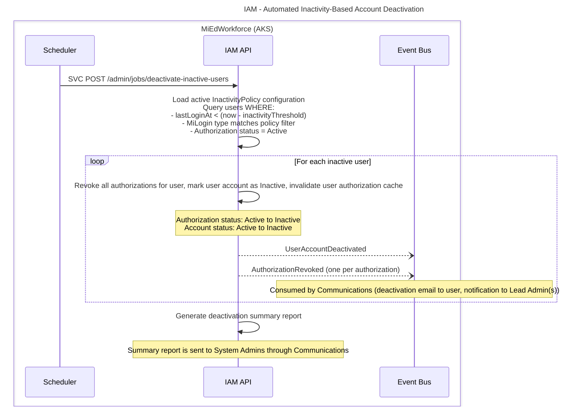
```mermaid
---
title: IAM - Automated Inactivity-Based Account Deactivation
---
sequenceDiagram
    box MiEdWorkforce (AKS)
    participant Scheduler
    participant IamApi as IAM API
    participant EventBus as Event Bus
    end

    Scheduler->>IamApi: SVC POST /admin/jobs/deactivate-inactive-users
    IamApi->>IamApi: Load active InactivityPolicy configuration<br/>Query users WHERE:<br/>- lastLoginAt < (now - inactivityThreshold)<br/>- MiLogin type matches policy filter<br/>- Authorization status = Active

    loop For each inactive user
        IamApi->>IamApi: Revoke all authorizations for user, mark user account as Inactive, invalidate user authorization cache

        Note over IamApi: Authorization status: Active to Inactive<br/>Account status: Active to Inactive

        IamApi--)EventBus: UserAccountDeactivated
        IamApi--)EventBus: AuthorizationRevoked (one per authorization)
        Note over EventBus: Consumed by Communications (deactivation email to user, notification to Lead Admin(s))
    end

    IamApi->>IamApi: Generate deactivation summary report
    Note over IamApi: Summary report is sent to System Admins through Communications
```

**Key Decisions:**
- **Inactivity threshold:** 84 months (7 years) default (configurable via InactivityPolicy)
- **Schedule:** First Friday of month default (configurable via cron expression)
- **Notification:** User and Lead Admins notified after deactivation
- **MiLogin type filter:** Policy can target specific MiLogin types (e.g., only Business accounts)

**State Changes:**
- Authorization status: `Active` > `Inactive` (all authorizations)
- Account status: `Active` > `Inactive`

**Events Published:**
- `UserAccountDeactivated` - Fires for each deactivated account
- `AuthorizationRevoked` - Fires for each revoked authorization

**Configuration:**
- InactivityPolicy aggregate controls threshold, schedule, and MiLogin type filters

---

## System Admin - Manual Authorization Grant

**What:** System Admin directly grants authorization without approval workflow  
**When:** Emergency access needed or special circumstances (e.g., manual grant for testing)  
**Who:** System Administrator; Permission: iam.authorization.grant (system-wide, System Admin only)

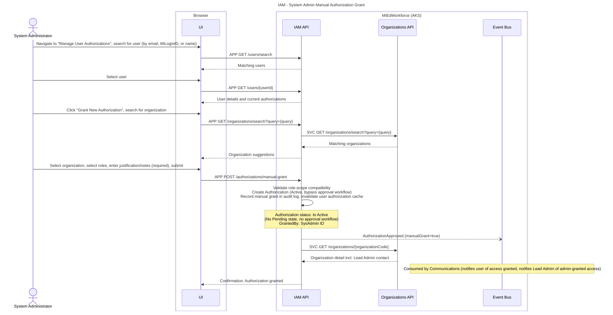
```mermaid
---
title: IAM - System Admin Manual Authorization Grant
---
sequenceDiagram
    actor SysAdmin as System Administrator
    box Browser
    participant UI
    end
    box MiEdWorkforce (AKS)
    participant IamApi as IAM API
    participant OrgsApi as Organizations API
    participant EventBus as Event Bus
    end

    SysAdmin->>UI: Navigate to "Manage User Authorizations", search for user (by email, MiLoginID, or name)
    UI->>IamApi: APP GET /users/search
    IamApi-->>UI: Matching users

    SysAdmin->>UI: Select user
    UI->>IamApi: APP GET /users/{userId}
    IamApi-->>UI: User details and current authorizations

    SysAdmin->>UI: Click "Grant New Authorization", search for organization
    UI->>IamApi: APP GET /organizations/search?query={query}
    IamApi->>OrgsApi: SVC GET /organizations/search?query={query}
    OrgsApi-->>IamApi: Matching organizations
    IamApi-->>UI: Organization suggestions

    SysAdmin->>UI: Select organization, select roles, enter justification/notes (required), submit
    UI->>IamApi: APP POST /authorizations/manual-grant

    IamApi->>IamApi: Validate role-scope compatibility<br/>Create Authorization (Active, bypass approval workflow)<br/>Record manual grant in audit log, invalidate user authorization cache

    Note over IamApi: Authorization status: to Active<br/>(No Pending state, no approval workflow)<br/>GrantedBy: SysAdmin ID

    IamApi--)EventBus: AuthorizationApproved (manualGrant=true)

    IamApi->>OrgsApi: SVC GET /organizations/{organizationCode}
    OrgsApi-->>IamApi: Organization detail incl. Lead Admin contact
    Note over EventBus: Consumed by Communications (notifies user of access granted, notifies Lead Admin of admin-granted access)

    IamApi-->>UI: Confirmation: Authorization granted
```

**Key Decisions:**
- **Bypass approval:** Admin can directly grant without Lead Admin approval
- **Audit justification:** Admin must provide reason for manual grant (required field)
- **Notification:** User and Lead Admin both notified of admin-granted access
- **Cache invalidation:** User authorization cache cleared immediately

**State Changes:**
- Authorization status: `None` > `Active` (no Pending state)

**Events Published:**
- `AuthorizationApproved` with `grantedBy: adminId`, `manualGrant: true`

**Error Scenarios:**
- Invalid role-scope combination > Validation error
- User not found > Display error

---

## Citizen User - Update Account Demographics

**What:** Citizen User updates their own demographic data, subject to active-employment field locking, and Mi-Key re-matching  
**When:** Citizen navigates to Account Details > Personal Information > Update personal information  
**Who:** Citizen User with an established Unique ID; Permission: iam.citizen-identity.submit-request (citizen users only)

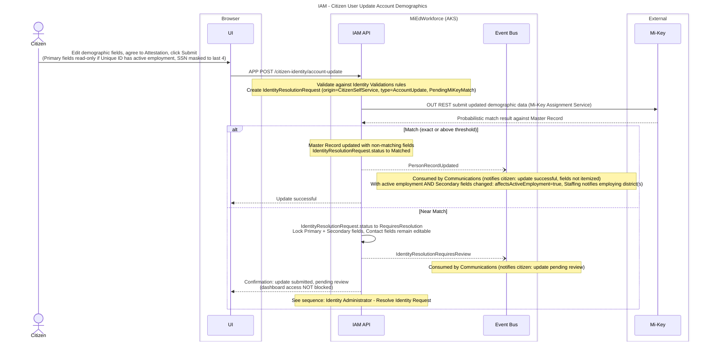
```mermaid
---
title: IAM - Citizen User Update Account Demographics
---
sequenceDiagram
    actor Citizen
    box Browser
    participant UI
    end
    box MiEdWorkforce (AKS)
    participant IamApi as IAM API
    participant EventBus as Event Bus
    end
    box External
    participant MiKey as Mi-Key
    end

    Citizen->>UI: Edit demographic fields, agree to Attestation, click Submit<br/>(Primary fields read-only if Unique ID has active employment, SSN masked to last 4)
    UI->>IamApi: APP POST /citizen-identity/account-update
    Note over IamApi: Validate against Identity Validations rules<br/>Create IdentityResolutionRequest (origin=CitizenSelfService, type=AccountUpdate, PendingMiKeyMatch)
    IamApi->>MiKey: OUT REST submit updated demographic data (Mi-Key Assignment Service)
    MiKey-->>IamApi: Probabilistic match result against Master Record

    alt Match (exact or above threshold)
        Note over IamApi: Master Record updated with non-matching fields<br/>IdentityResolutionRequest.status to Matched
        IamApi--)EventBus: PersonRecordUpdated
        Note over EventBus: Consumed by Communications (notifies citizen: update successful, fields not itemized)<br/>With active employment AND Secondary fields changed: affectsActiveEmployment=true, Staffing notifies employing district(s)
        IamApi-->>UI: Update successful
    else Near Match
        IamApi->>IamApi: IdentityResolutionRequest.status to RequiresResolution<br/>Lock Primary + Secondary fields, Contact fields remain editable
        IamApi--)EventBus: IdentityResolutionRequiresReview
        Note over EventBus: Consumed by Communications (notifies citizen: update pending review)
        IamApi-->>UI: Confirmation: update submitted, pending review<br/>(dashboard access NOT blocked)
        Note over IamApi: See sequence: Identity Administrator - Resolve Identity Request
    end
```

**Key Decisions:**
- **Active employment gates Primary fields:** If the Unique ID is tied to active employment, Primary Demographic fields (Legal Name, SSN, DOB) are locked; only the employing district can change them (see `staffing-domain.md`)
- **Near Match does not block dashboard access on Update** (unlike Account Creation) — only the pending update itself is held, and Primary/Secondary fields lock until resolved; Contact fields stay editable
- **Self-cancellable:** Per FDD 15.10.4, the citizen retains the ability to cancel a pending Near Match update request (unlike Account Creation, which can only be resolved by an Identity Administrator)

**State Changes:**
- IdentityResolutionRequest status: `None` > `PendingMiKeyMatch` > `Matched` | `RequiresResolution`

**Events Published:**
- `PersonRecordUpdated` - Fires on successful Match
- `IdentityResolutionRequiresReview` - Fires on Near Match

**Error Scenarios:**
- Validation failure > user corrects or cancels (errors displayed, not sent to Mi-Key, not persisted)
- Mi-Key unavailable > error displayed, retry allowed

---

## Citizen User - Cancel Pending Update Request

**What:** Citizen cancels their own pending Account Update request while it is `RequiresResolution`  
**When:** Citizen views request status in their history and chooses to cancel  
**Who:** Citizen User; Permission: iam.citizen-identity.cancel-own-request (own requests only)

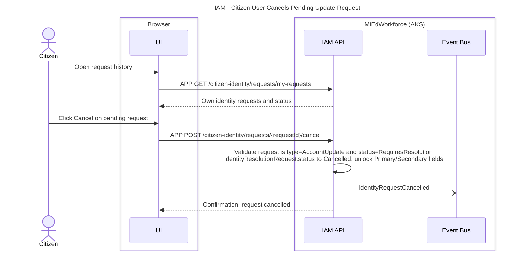
```mermaid
---
title: IAM - Citizen User Cancels Pending Update Request
---
sequenceDiagram
    actor Citizen
    box Browser
    participant UI
    end
    box MiEdWorkforce (AKS)
    participant IamApi as IAM API
    participant EventBus as Event Bus
    end

    Citizen->>UI: Open request history
    UI->>IamApi: APP GET /citizen-identity/requests/my-requests
    IamApi-->>UI: Own identity requests and status

    Citizen->>UI: Click Cancel on pending request
    UI->>IamApi: APP POST /citizen-identity/requests/{requestId}/cancel
    IamApi->>IamApi: Validate request is type=AccountUpdate and status=RequiresResolution<br/>IdentityResolutionRequest.status to Cancelled, unlock Primary/Secondary fields
    IamApi--)EventBus: IdentityRequestCancelled
    IamApi-->>UI: Confirmation: request cancelled
```

**Error Scenarios:**
- Attempt to cancel an AccountCreation-type request > Rejected; only Identity Administrator can resolve those
- Attempt to cancel a request no longer `RequiresResolution` > Error message

---

## Identity Administrator - Resolve Identity Request

**What:** Identity Administrator reviews a "Requires Resolution" item — a Near Match
(Account Creation, Account Update, or business-user New ID escalation) or a Link ID
request — and resolves it. This is the single resolution workflow for identity requests
of any origin; there is one review queue (the domain's own filtered list of
`RequiresResolution` items), not a separate one per requesting domain. This section covers
the Near Match requests (Match, Create New, Deny/Cancel).
**When:** Item appears in the list of identity resolution requests requiring review
(`GET /identity-resolution/requests?status=RequiresResolution`)
**Who:** Identity Administrator; Permission: iam.identity-admin.view-pending-requests (list), iam.identity-admin.resolve-request (resolve), both system-wide

See also: Identity Administrator - Resolve Link ID Request

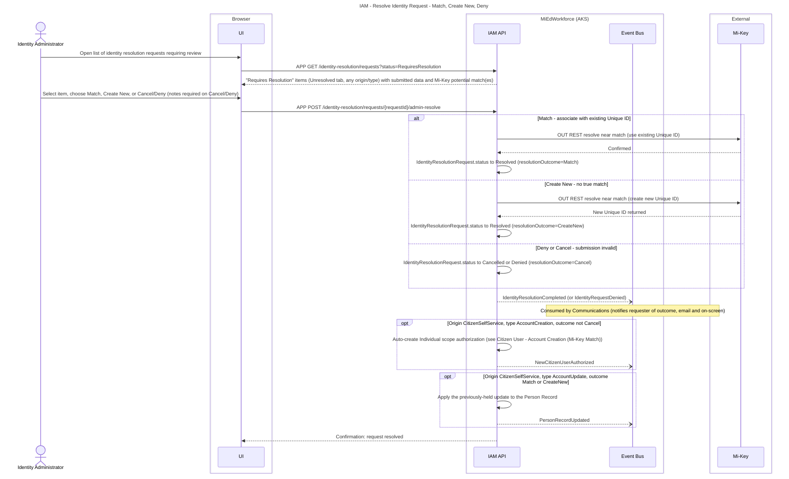
```mermaid
---
title: IAM - Resolve Identity Request - Match, Create New, Deny
---
sequenceDiagram
    actor IdAdmin as Identity Administrator
    box Browser
    participant UI
    end
    box MiEdWorkforce (AKS)
    participant IamApi as IAM API
    participant EventBus as Event Bus
    end
    box External
    participant MiKey as Mi-Key
    end

    IdAdmin->>UI: Open list of identity resolution requests requiring review
    UI->>IamApi: APP GET /identity-resolution/requests?status=RequiresResolution
    IamApi-->>UI: "Requires Resolution" items (Unresolved tab, any origin/type) with submitted data and Mi-Key potential match(es)

    IdAdmin->>UI: Select item, choose Match, Create New, or Cancel/Deny (notes required on Cancel/Deny)
    UI->>IamApi: APP POST /identity-resolution/requests/{requestId}/admin-resolve

    alt Match - associate with existing Unique ID
        IamApi->>MiKey: OUT REST resolve near match (use existing Unique ID)
        MiKey-->>IamApi: Confirmed
        IamApi->>IamApi: IdentityResolutionRequest.status to Resolved (resolutionOutcome=Match)
    else Create New - no true match
        IamApi->>MiKey: OUT REST resolve near match (create new Unique ID)
        MiKey-->>IamApi: New Unique ID returned
        IamApi->>IamApi: IdentityResolutionRequest.status to Resolved (resolutionOutcome=CreateNew)
    else Deny or Cancel - submission invalid
        IamApi->>IamApi: IdentityResolutionRequest.status to Cancelled or Denied (resolutionOutcome=Cancel)
    end

    IamApi--)EventBus: IdentityResolutionCompleted (or IdentityRequestDenied)
    Note over EventBus: Consumed by Communications (notifies requester of outcome, email and on-screen)

    opt Origin CitizenSelfService, type AccountCreation, outcome not Cancel
        IamApi->>IamApi: Auto-create Individual scope authorization (see Citizen User - Account Creation (Mi-Key Match))
        IamApi--)EventBus: NewCitizenUserAuthorized
    end

    opt Origin CitizenSelfService, type AccountUpdate, outcome Match or CreateNew
        IamApi->>IamApi: Apply the previously-held update to the Person Record
        IamApi--)EventBus: PersonRecordUpdated
    end

    IamApi-->>UI: Confirmation: request resolved
```

**Key Decisions:**
- **No candidate data shown to a citizen at any point** for their own request (see Near Match Resolution rule in `iam-domain.md`); business-user requesters do see candidate data for their own submissions (see Business User Near Match Self-Resolution rule)
- **Explanatory notes required on Cancel/Deny:** the admin must provide notes the requester receives, distinguishing a deliberate denial from a silent one
- **List shape:** displays Unresolved / Resolved tabs (backed by the `status` filter on the domain's own request list endpoint), spanning every request type and origin; Resolved tab is filterable by outcome for historical review

**Follow-ups by origin (after the outcome is published):**

| Request origin | Type | Outcome | Follow-up |
|---|---|---|---|
| CitizenSelfService | AccountCreation | Match, CreateNew | IAM auto-creates the Individual scope authorization and publishes `NewCitizenUserAuthorized` |
| CitizenSelfService | AccountUpdate | Match, CreateNew | IAM applies the previously-held update to the Person Record and publishes `PersonRecordUpdated`; with active employment, Staffing notifies the employing district(s) |
| BusinessUserStaffing | NewId | CreateNew | Staffing attaches `assignedUniqueId` to the EmployeeRoster record on `IdentityResolutionCompleted` |

**State Changes:**
- IdentityResolutionRequest status: `RequiresResolution` > `Resolved` | `Denied` | `Cancelled`
- Authorization status: `None` > `Active` (CitizenSelfService AccountCreation, non-Cancel outcomes only)

**Events Published:**
- `IdentityResolutionCompleted` or `IdentityRequestDenied`
- `NewCitizenUserAuthorized` (CitizenSelfService AccountCreation) or `PersonRecordUpdated` (AccountUpdate)

**Error Scenarios:**
- Mi-Key unavailable during resolution call > error displayed, retry allowed; item remains `RequiresResolution` in the list

---

## Identity Administrator - Resolve Link ID Request

**What:** Identity Administrator reviews a Link ID request and either approves it (Mi-Key retires the secondary Unique ID and merges it into the primary) or denies it. Link ID requests share the single review queue described in Identity Administrator - Resolve Identity Request.  
**When:** Item appears in the list of identity resolution requests requiring review
(`GET /identity-resolution/requests?status=RequiresResolution`)  
**Who:** Identity Administrator; Permission: iam.identity-admin.view-pending-requests (list), iam.identity-admin.resolve-request (resolve), both system-wide

See also: Identity Administrator - Resolve Identity Request; Business User - Request Link ID

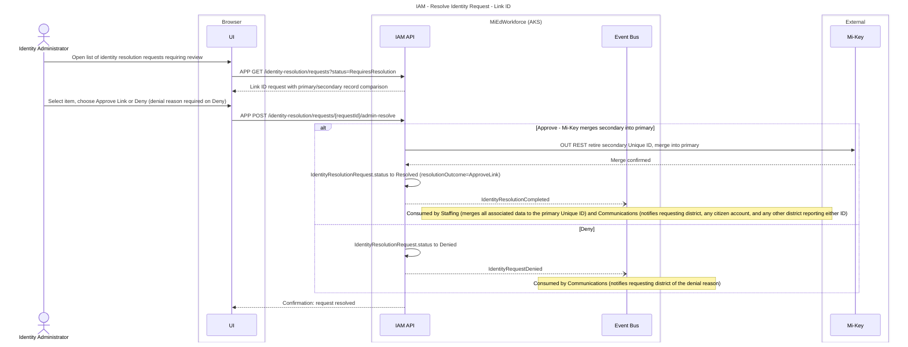
```mermaid
---
title: IAM - Resolve Identity Request - Link ID
---
sequenceDiagram
    actor IdAdmin as Identity Administrator
    box Browser
    participant UI
    end
    box MiEdWorkforce (AKS)
    participant IamApi as IAM API
    participant EventBus as Event Bus
    end
    box External
    participant MiKey as Mi-Key
    end

    IdAdmin->>UI: Open list of identity resolution requests requiring review
    UI->>IamApi: APP GET /identity-resolution/requests?status=RequiresResolution
    IamApi-->>UI: Link ID request with primary/secondary record comparison

    IdAdmin->>UI: Select item, choose Approve Link or Deny (denial reason required on Deny)
    UI->>IamApi: APP POST /identity-resolution/requests/{requestId}/admin-resolve

    alt Approve - Mi-Key merges secondary into primary
        IamApi->>MiKey: OUT REST retire secondary Unique ID, merge into primary
        MiKey-->>IamApi: Merge confirmed
        IamApi->>IamApi: IdentityResolutionRequest.status to Resolved (resolutionOutcome=ApproveLink)
        IamApi--)EventBus: IdentityResolutionCompleted
        Note over EventBus: Consumed by Staffing (merges all associated data to the primary Unique ID) and Communications (notifies requesting district, any citizen account, and any other district reporting either ID)
    else Deny
        IamApi->>IamApi: IdentityResolutionRequest.status to Denied
        IamApi--)EventBus: IdentityRequestDenied
        Note over EventBus: Consumed by Communications (notifies requesting district of the denial reason)
    end

    IamApi-->>UI: Confirmation: request resolved
```

**Key Decisions:**
- **Explanatory notes required on Deny:** the admin must provide notes the requester receives, distinguishing a deliberate denial from a silent one
- **List shape:** Link ID requests appear in the same Unresolved / Resolved tabs as every other request type and origin

**State Changes:**
- IdentityResolutionRequest status: `RequiresResolution` > `Resolved` | `Denied`

**Events Published:**
- `IdentityResolutionCompleted` or `IdentityRequestDenied`

**Error Scenarios:**
- Mi-Key unavailable during resolution call > error displayed, retry allowed; item remains `RequiresResolution` in the list

---

## Business User - Request New ID (Near Match Escalation)

**What:** A district user adding a new employee (or, via Staffing's own flow, updating an
employee's demographics) triggers Mi-Key identity resolution through IAM; on a Near Match
they review the candidate(s) and either self-resolve or escalate for Identity
Administrator review. This section covers the submission and Mi-Key match outcome.
**When:** During Staffing's "Add New Employee" workflow, after Staffing submits the
employee's demographic data to IAM for identity resolution.
**Who:** Staffing Authorized User (School District role); Permission: staffing.employee-roster.add-employee (or staffing.employee-roster.update-demographics for demographic updates), enforced on the Staffing call

See also: Business User - Request New ID - Near Match Self-Resolve or Escalate

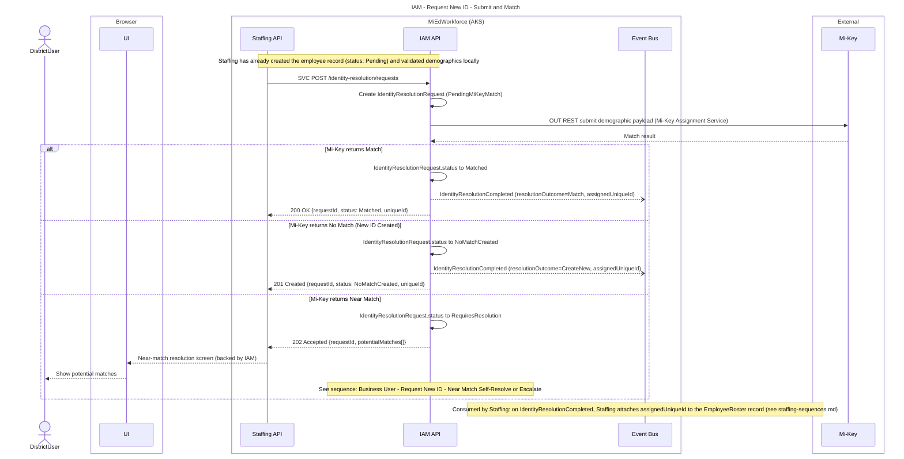
```mermaid
---
title: IAM - Request New ID - Submit and Match
---
sequenceDiagram
    actor DistrictUser
    box Browser
    participant UI
    end
    box MiEdWorkforce (AKS)
    participant StaffingApi as Staffing API
    participant IamApi as IAM API
    participant EventBus as Event Bus
    end
    box External
    participant MiKey as Mi-Key
    end

    Note over StaffingApi,IamApi: Staffing has already created the employee record (status: Pending) and validated demographics locally

    StaffingApi->>IamApi: SVC POST /identity-resolution/requests
    IamApi->>IamApi: Create IdentityResolutionRequest (PendingMiKeyMatch)
    IamApi->>MiKey: OUT REST submit demographic payload (Mi-Key Assignment Service)
    MiKey-->>IamApi: Match result

    alt Mi-Key returns Match
        IamApi->>IamApi: IdentityResolutionRequest.status to Matched
        IamApi--)EventBus: IdentityResolutionCompleted (resolutionOutcome=Match, assignedUniqueId)
        IamApi-->>StaffingApi: 200 OK {requestId, status: Matched, uniqueId}
    else Mi-Key returns No Match (New ID Created)
        IamApi->>IamApi: IdentityResolutionRequest.status to NoMatchCreated
        IamApi--)EventBus: IdentityResolutionCompleted (resolutionOutcome=CreateNew, assignedUniqueId)
        IamApi-->>StaffingApi: 201 Created {requestId, status: NoMatchCreated, uniqueId}
    else Mi-Key returns Near Match
        IamApi->>IamApi: IdentityResolutionRequest.status to RequiresResolution
        IamApi-->>StaffingApi: 202 Accepted {requestId, potentialMatches[]}
        StaffingApi-->>UI: Near-match resolution screen (backed by IAM)
        UI-->>DistrictUser: Show potential matches
        Note over IamApi: See sequence: Business User - Request New ID - Near Match Self-Resolve or Escalate
    end

    Note over EventBus: Consumed by Staffing: on IdentityResolutionCompleted, Staffing attaches assignedUniqueId to the EmployeeRoster record (see staffing-sequences.md)
```

**Key Decisions:**
- Staffing never calls Mi-Key directly; every identity resolution request — regardless of which domain triggers it — flows through IAM's `IdentityResolutionRequest`
- District user has final decision on match selection and can self-resolve without Identity Administrator involvement, unlike a citizen; Identity Administrator involvement is required only when the user cannot find a correct match among Mi-Key's potentials
- Staffing consumes `IdentityResolutionCompleted` (or `IdentityRequestDenied`) asynchronously to update its own `EmployeeRoster` record; it does not poll or hold local matching state

**State Changes:**
- IdentityResolutionRequest: `None` > `PendingMiKeyMatch` > `Matched` | `NoMatchCreated` | `RequiresResolution`
- EmployeeRoster.unique_id (staffing, on completion): `NULL` > assigned Unique ID

**Events Published:**
- `IdentityResolutionCompleted` - Notifies Staffing that a Unique ID has been assigned

**Error Scenarios:**
- District user closes resolution screen without action > Employee record remains Pending; user must return to complete

---

## Business User - Request New ID - Near Match Self-Resolve or Escalate

**What:** On a Near Match, the district user reviews the candidate(s) and either self-resolves by selecting a potential match or rejects all potentials and escalates for Identity Administrator review.  
**When:** After IAM returns a Near Match with potential matches (see Business User - Request New ID (Near Match Escalation)).  
**Who:** Staffing Authorized User (School District role); Permission: staffing.employee-roster.add-employee (or staffing.employee-roster.update-demographics for demographic updates)

See also: Business User - Request New ID (Near Match Escalation); Identity Administrator - Resolve Identity Request

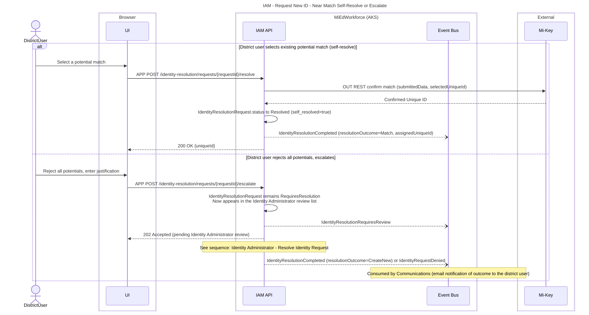
```mermaid
---
title: IAM - Request New ID - Near Match Self-Resolve or Escalate
---
sequenceDiagram
    actor DistrictUser
    box Browser
    participant UI
    end
    box MiEdWorkforce (AKS)
    participant IamApi as IAM API
    participant EventBus as Event Bus
    end
    box External
    participant MiKey as Mi-Key
    end

    alt District user selects existing potential match (self-resolve)
        DistrictUser->>UI: Select a potential match
        UI->>IamApi: APP POST /identity-resolution/requests/{requestId}/resolve
        IamApi->>MiKey: OUT REST confirm match (submittedData, selectedUniqueId)
        MiKey-->>IamApi: Confirmed Unique ID
        IamApi->>IamApi: IdentityResolutionRequest.status to Resolved (self_resolved=true)
        IamApi--)EventBus: IdentityResolutionCompleted (resolutionOutcome=Match, assignedUniqueId)
        IamApi-->>UI: 200 OK {uniqueId}
    else District user rejects all potentials, escalates
        DistrictUser->>UI: Reject all potentials, enter justification
        UI->>IamApi: APP POST /identity-resolution/requests/{requestId}/escalate
        IamApi->>IamApi: IdentityResolutionRequest remains RequiresResolution<br/>Now appears in the Identity Administrator review list
        IamApi--)EventBus: IdentityResolutionRequiresReview
        IamApi-->>UI: 202 Accepted (pending Identity Administrator review)
        Note over IamApi: See sequence: Identity Administrator - Resolve Identity Request
        IamApi--)EventBus: IdentityResolutionCompleted (resolutionOutcome=CreateNew) or IdentityRequestDenied
        Note over EventBus: Consumed by Communications (email notification of outcome to the district user)
    end
```

**Key Decisions:**
- District user has final decision on match selection and can self-resolve without Identity Administrator involvement, unlike a citizen; Identity Administrator involvement is required only when the user cannot find a correct match among Mi-Key's potentials
- Staffing consumes `IdentityResolutionCompleted` (or `IdentityRequestDenied`) asynchronously to update its own `EmployeeRoster` record; it does not poll or hold local matching state

**State Changes:**
- IdentityResolutionRequest: `RequiresResolution` > `Resolved` | `Denied`

**Events Published:**
- `IdentityResolutionRequiresReview` - Notifies Identity Administrators that a new item requires review
- `IdentityResolutionCompleted` - Notifies Staffing that a Unique ID has been assigned
- `IdentityRequestDenied` - Notifies Staffing/district user that the Identity Administrator denied the new-ID request

**Error Scenarios:**
- District user selects potential match but Mi-Key confirm fails > 500 Internal Server Error, user retries
- Identity Administrator denies new ID > `IdentityRequestDenied`; district user reviews potential matches again or contacts support

---

## Business User - Request Link ID

**What:** A district user requests that two Unique IDs believed to represent the same
person be merged, with a required justification. The request is always resolved by an
Identity Administrator.
**When:** District user, viewing an employee record, identifies what appears to be a
duplicate Unique ID for the same individual.
**Who:** Staffing Authorized User (School District role); Identity Administrator; Permission: staffing.employee-roster.add-employee or staffing.employee-roster.update-demographics (the only keys on the IAM submission operation, no Link ID specific key)

```mermaid
---
title: IAM - Business User Request Link ID
---
sequenceDiagram
    actor DistrictUser
    box Browser
    participant UI
    end
    box MiEdWorkforce (AKS)
    participant StaffingApi as Staffing API
    participant IamApi as IAM API
    participant EventBus as Event Bus
    end

    DistrictUser->>UI: Select employee record, "Request Link ID" (primaryUniqueId, secondaryUniqueId, justification)
    UI->>StaffingApi: APP POST /employee-roster/{employeeId}/link-id-requests
    StaffingApi->>IamApi: SVC POST /identity-resolution/requests
    IamApi->>IamApi: Create IdentityResolutionRequest (status: RequiresResolution) — no Mi-Key match phase
    IamApi--)EventBus: IdentityResolutionRequiresReview
    IamApi-->>StaffingApi: 202 Accepted {requestId, status: RequiresResolution}
    StaffingApi-->>UI: Pending notification with expected timeline
    UI-->>DistrictUser: Display pending notification with expected timeline

    Note over IamApi: See sequence: Identity Administrator - Resolve Link ID Request<br/>(Approve: Mi-Key retires secondary, merges to primary. Deny: denial reason returned.)

    alt Approved
        IamApi--)EventBus: IdentityResolutionCompleted (resolutionOutcome=ApproveLink)
        Note over EventBus: Consumed by Staffing (merges employment history, credentials, and all associated records to primary Unique ID) and Communications (email notification: link approved, notifies any citizen account and any other district reporting either ID)
    else Denied
        IamApi--)EventBus: IdentityRequestDenied
        Note over EventBus: Consumed by Communications (email notification with denial reason to the district user)
    end
```

**Key Decisions:**
- Link ID requests skip the Mi-Key match phase entirely — the requester already names the two candidate IDs — and always require Identity Administrator judgment (see Link ID Resolution rule, `iam-domain.md`)
- Only one ID pair is merged per approved request
- Staffing owns the post-merge data-migration mechanics (employment history, credentials); IAM owns only the request/approval lifecycle and the Mi-Key merge call itself

**State Changes:**
- IdentityResolutionRequest: `None` > `RequiresResolution` > `Resolved` | `Denied`

**Events Published:**
- `IdentityResolutionRequiresReview` - Notifies Identity Administrators that a new item requires review
- `IdentityResolutionCompleted` - Notifies Staffing to begin data merge
- `IdentityRequestDenied` - Notifies requesting district user

**Error Scenarios:**
- Mi-Key merge fails after admin approval > System retries or escalates to support; request remains `Resolved` pending merge completion
- Requester submits without justification > 400 Bad Request

---

## Identity Resolution - Split/Retire ID (Mi-Key-Direct)

**What:** An Identity Administrator splits or retires a Unique ID directly in Mi-Key
(outside MiEdWorkforce); MiEdWorkforce receives the resulting callback/event and updates
affected records accordingly. Per FDD 15.6/15.11's Addendum, neither action has a
business-user-facing submission path in MiEdWorkforce.
**When:** Identity Administrator determines, via Mi-Key or a Help Desk ticket, that a
Unique ID represents multiple individuals (Split) or should no longer be used (Retire).
**Who:** Identity Administrator (acting directly in Mi-Key); Permission: none (inbound external callback)

```mermaid
---
title: IAM - Split/Retire ID (Mi-Key-Direct)
---
sequenceDiagram
    actor IdAdmin as Identity Administrator
    box MiEdWorkforce (AKS)
    participant IamExtApi as IAM External API
    participant EventBus as Event Bus
    end
    box External
    participant MiKey as Mi-Key
    end

    IdAdmin->>MiKey: Split or Retire Unique ID directly in Mi-Key
    MiKey->>IamExtApi: EXT POST /identity-resolution/callbacks (IdentityRecordSplit or IdentityRecordRetired)

    alt Split
        IamExtApi--)EventBus: IdentityRecordSplit (originalUniqueId, newUniqueIds[])
    else Retire
        IamExtApi--)EventBus: IdentityRecordRetired (retiredUniqueId, replacementUniqueId?)
    end

    Note over EventBus: Consumed by Staffing (updates EMPLOYEE_ROSTER.unique_id references, flags retired IDs so search/submission reject them)
```

**Key Decisions:**
- No `IdentityResolutionRequest` is created for Split or Retire — there is no MiEdWorkforce-side request/approval workflow to model, only the resulting event
- A Retired Unique ID must be rejected if submitted anywhere in MiEdWorkforce afterward, and search results must surface the retired status and the new Primary ID (staffing's responsibility on consuming these events)

**Events Published:**
- `IdentityRecordSplit`, `IdentityRecordRetired`

**Error Scenarios:**
- Callback not received (Mi-Key/MiEdWorkforce integration failure) > Records remain unsynchronized until reconciliation; tracked as an operational concern, not a functional gap

---

## Integration Flows

*Reference material, not sequences. Suggested home: solution-integrations.md (MiLogin and Mi-Key) and the Organizations capability documentation (Organizations tables and cache strategy). The MiLogin diagram below overlaps the sign-in sections above.*

### Organizations Platform Capability

**Purpose:** IAM relies on the Organizations platform capability API for all organization-related queries. IAM has no direct dependency on EEM or CEPI.

**Base URL:** `http://organizations-api.platform.svc.cluster.local/api/v1`

**Usage Patterns:**

| IAM Operation | Organizations API Call | Notes | Target Latency |
|---|---|---|---|
| **Organization Search (Typeahead)** | `GET /organizations/search?query={q}&status=Active&limit=10` | Used in authorization request forms | < 5ms |
| **Organization Detail / Lead Admin Lookup** | `GET /organizations/{organizationCode}` | Returns masked email for display; IAM uses cached unmasked email for routing — see below | < 5ms |
| **Hierarchy Resolution** | `GET /organizations/{organizationCode}/hierarchy` | Returns materialized ancestor chain; used in transitive permission evaluation | < 10ms |
| **Organizations by Lead Admin (Bootstrap)** | `GET /organizations/by-lead-admin?email={email}` | Returns unmasked email; IAM caches result keyed by org code for approval routing | < 10ms |

**Lead Admin Email — Unmasked Caching Strategy:**
The standard `GET /organizations/{code}` endpoint returns a masked email (e.g., `j***@district5.edu`) suitable for display but not for sending approval emails. IAM obtains the unmasked email via `GET /organizations/by-lead-admin` during Lead Admin bootstrap and caches it internally keyed by org code (`lead-admin-email:{orgCode}`, 60-min TTL). This cached value is used for all subsequent approval routing. On a cache miss, IAM falls back to a direct `by-lead-admin` call.

**IAM Cache TTLs for Org Data (per Organizations Capability canonical strategy):**
- Org detail and hierarchy: 60-min TTL
- Lead Admin email by org code: 60-min TTL
- Search results: 15-min TTL (TTL expiry only, no event-driven invalidation)

**Cache Invalidation:** IAM subscribes to the `organizations-events` Service Bus topic:
- `OrganizationSyncCompleted` → invalidate all org detail and hierarchy cache entries
- `OrganizationDeactivated` → invalidate cache entry for affected org code
- `LeadAdministratorChanged` → invalidate `lead-admin-email:{orgCode}` cache entry

**Staleness:** Bounded by nightly sync cadence plus 60-min consumer cache TTL. Practical worst case ~25 hours. See Open Question #10 in the IAM Domain doc.

**Degraded Operation:** If the Organizations API is unavailable, IAM serves from its local org-data cache. If cache is also cold, scope-sensitive operations that require org lookup will fail with a user-facing error. IAM never fails open on access control. See Organizations Capability documentation for full resilience details.

**See:** Organizations Capability documentation for sync process, staleness characteristics, and full API contract.

---

### MiLogin Integration - Authentication

**Purpose:** Authenticate user and obtain identity claims  
**Trigger:** User clicks "Login" on MiEdWorkforce

```mermaid
---
title: IAM - MiLogin Integration - Authentication (OIDC)
---
sequenceDiagram
    actor User
    box Browser
    participant UI
    end
    box MiEdWorkforce (AKS)
    participant IamApi as IAM API
    participant OrgsApi as Organizations API
    end
    box External
    participant MiLogin
    end

    User->>UI: Click "Login"
    UI->>MiLogin: OUT OIDC authorize (authorization code flow, browser redirect)
    User->>MiLogin: Enter credentials, select identity type (Citizen/Business/Worker)
    MiLogin-->>UI: Redirect to callback with auth code
    UI->>MiLogin: OUT OIDC token (exchange code for tokens)
    MiLogin-->>UI: ID token + access token

    UI->>IamApi: APP GET /authorizations/my-authorizations
    Note over IamApi: Validate tokens, extract claims: MiLoginID (sub), MiLogin type (Citizen/Business/Worker), Email, Name<br/>Existing authorizations filtered by MiLogin type

    alt Has authorizations for this MiLogin type
        IamApi-->>UI: Redirect to dashboard
    else No authorizations AND MiLogin type = Business/Worker
        IamApi->>OrgsApi: SVC GET /organizations/by-lead-admin?email={userEmail}
        OrgsApi-->>IamApi: Organizations where user is Lead Admin
        IamApi->>IamApi: Auto-grant Organization Lead Admin role(s) if user is Lead Admin
        IamApi-->>UI: Redirect to dashboard, or to authorization request form if user is not Lead Admin
    else No authorizations AND MiLogin type = Citizen
        IamApi->>IamApi: Auto-grant Individual scope if user has Unique ID
        IamApi-->>UI: Redirect to dashboard, or to identity resolution if user has no Unique ID
    end
```

**Auth:** OIDC (OpenID Connect) with authorization code flow  
**Timeout:** 30 seconds for token exchange  
**Error Handling:** Display user-friendly error if auth fails; allow retry

---

### Identity Resolution Integration

**Purpose:** Citizen users require Unique ID assignment before accessing the system

**Event:** `UniqueIdAssigned`

**Payload:**
```json
{
  "userId": "uuid",
  "uniqueId": "12345678",
  "miLoginId": "citizen-abc-123",
  "assignedAt": "2025-01-15T10:30:00Z"
}
```

**IAM Action:** Upon receiving `UniqueIdAssigned` event, auto-create Individual scope authorization for Citizen user

**See:** Identity Resolution domain documentation for matching process

## Notes

*Not a sequence: this is a standard about the X-Organization-Context header. Suggested home: iam-domain.md or patterns-and-principles/authentication.md.*

### UI Context Management (Active Authorization)

**Note:** The "active authorization" concept is a **UI state management concern**, not a backend domain flow.

**How it works:**
- Users with multiple authorizations see a scope selector in the UI (e.g., dropdown showing "District 5 - HR Administrator", "ISD 10 - Staffing Administrator")
- When the user selects a scope, the UI stores this preference (browser local storage or session state)
- All subsequent API requests include the selected scope context via:
  - Header: `X-Organization-Context: district-5` or
  - Query param: `?organization=district-5`
- Backend evaluates permissions based on the scope provided in each request
- Backend does NOT track which scope is "currently active" - it's stateless

**User preference (default scope):**
- Can be stored in user preferences table for convenience (e.g., "last used scope")
- Not a domain invariant; purely UX optimization
- On login, UI can pre-select the last-used scope
