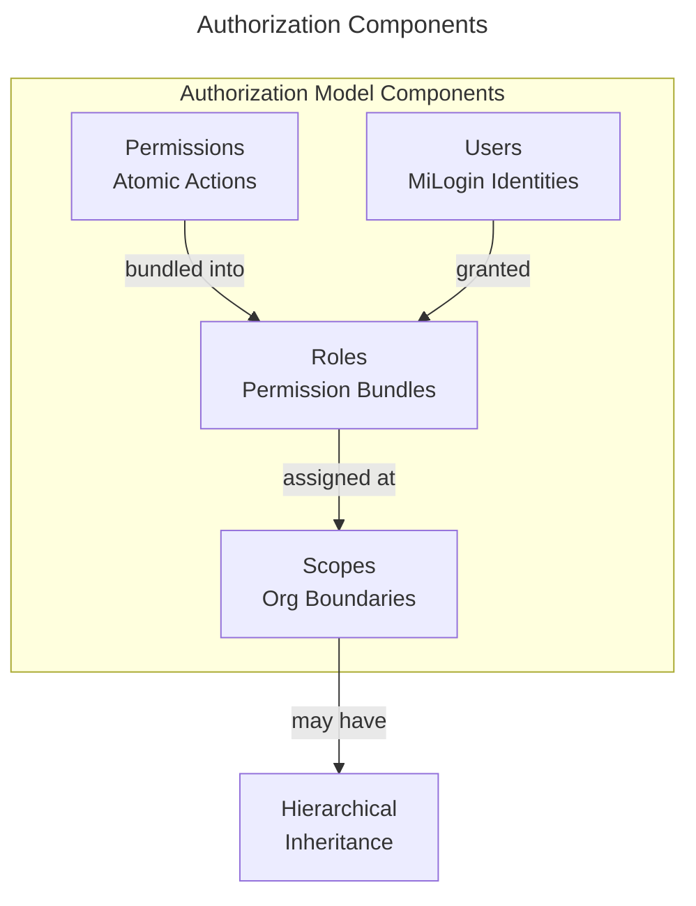
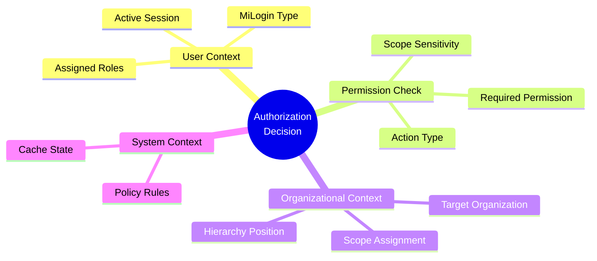
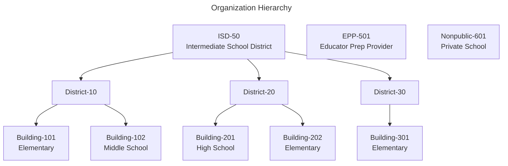
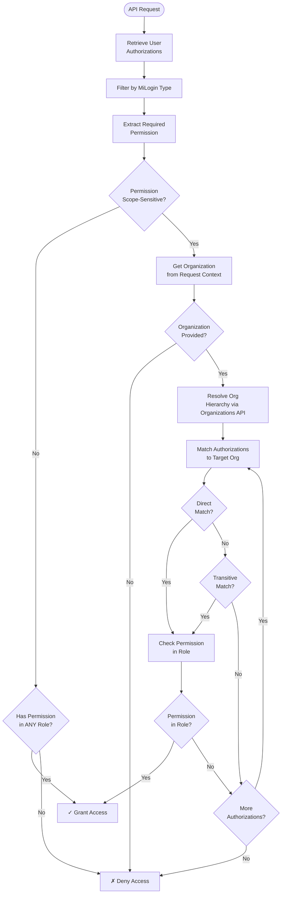
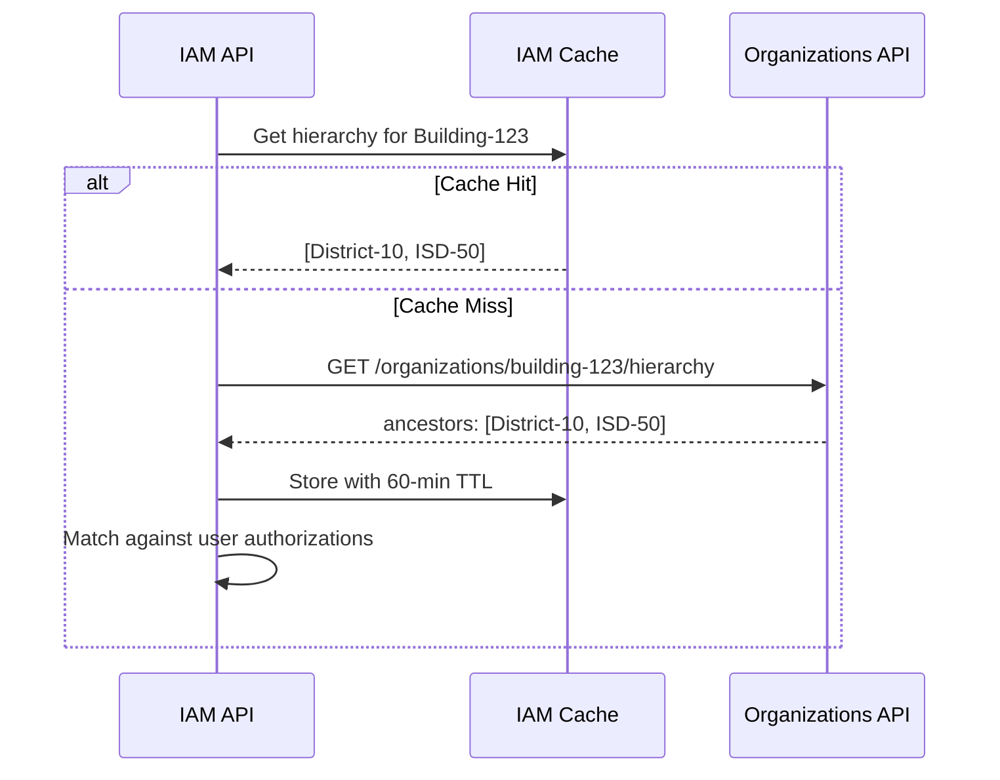

# Identity & Access Management (IAM) - Technical Design

## Purpose

This document provides technical design details for IAM domain concepts that are implementation-specific and don't belong in the domain model documentation. It describes algorithms, evaluation strategies, and technical constraints needed for implementation.

---

## Authorization Model

**Model Type:** Scope-based RBAC with Permission Authorization

The IAM domain implements authorization through a role-based model where principals are granted roles at specific organizational scopes, with permissions automatically inherited down the organizational hierarchy. Endpoints authorize on permissions, never on roles or caller type.

This is the single name used for the model throughout the design. "Role + Scope" is accepted shorthand. Authentication and the three kinds of principal (user, service, external client) are described in [Authentication & Authorization Patterns](../../patterns-and-principles/authentication.md).

### Principals

| Principal | Grants live in | Evaluated by |
| --------- | -------------- | ------------ |
| User (MiLogin Citizen, Business, Worker) | IAM, through the approval workflow | IAM permission check |
| External client (OAuth 2.0 client) | IAM, on the client record | IAM permission check |
| Service (logical service name) | Code, as service roles at system scope | Local lookup in the shared enforcement library; no IAM call |

Roles declare which principal types they may be granted to (`ApplicablePrincipalTypes`, see the IAM domain). Service roles are defined in code alongside other role definitions and mapped to real identities per environment. For delegated service calls both the calling service and the user must be authorized.

### Core Characteristics

**Role-Based:**
- Users are assigned roles (e.g., "District HR Administrator", "Credential Processor")
- Roles are collections of permissions
- Roles are system-defined through configuration files, not user-created

**Scope-Based:**
- Roles are assigned at organizational scopes (Building, District, ISD, EPP, system-wide, etc.)
- Same role can be assigned to different users at different scopes
- Example: "HR Administrator" at District-5 vs "HR Administrator" at ISD-10

**Hierarchical:**
- Organizations may have parent-child relationships (ISD > District > Building)
- Permissions granted at parent scope automatically apply to child scopes
- Example: Authorization at ISD-50 grants access to all districts and buildings within ISD-50

### Authorization Decision Factors

When evaluating whether a user can perform an action, the system considers:

1. **User's Assigned Roles** - Which roles has the user been granted?
2. **Role Permissions** - What permissions do those roles contain?
3. **Scope Assignment** - At which organizational scope was the role assigned?
4. **Organization Hierarchy** - Is the target Organization within the scope's hierarchy?
5. **Request Context** - Which Organization is the user operating on?
6. **Identity Provider Type** - Is the user authenticated as Citizen, Business, or Worker?

### Why Scope-based RBAC?

**Business Requirements:**
- Educational organizations have clear hierarchical structures
- ISD-level administrators need visibility into constituent districts and buildings
- Approving separate access for each building would be administratively burdensome

**Technical Benefits:**
- Clear separation between role definition and scope assignment
- Reusable roles across different organizational levels
- Transitive permissions reduce authorization complexity
- Auditable: "User has Role X at Scope Y" is clear and traceable

**Alternatives Considered:**
- **Flat RBAC:** Would require separate role assignments for every Organization (too many authorizations)
- **Full ABAC:** Too complex for the business model; hierarchical structure is well-defined
- **Manual per-Organization grants:** Administrative burden too high

---

## Permission Identifier Convention

All domains and supporting platform capabilities define the permission identifiers that can be used for authorization. These must follow the pattern `{domain}.{resource}.{action}`:

- **domain:** kebab-case domain identifier matching the domain's canonical identifier
  (e.g., `credentialing`, `iam`, `staffing`)
- **resource:** kebab-case resource name; use hyphens to compound where needed
  (e.g., `credential-definition`, `retention-override`, `bulk-payment`)
- **action:** lowercase verb from the approved list; never qualify with scope or
  cardinality (those belong in Applicable Scopes / Notes)

**Approved action verbs:** `view`, `search`, `create`, `edit`, `delete`, `approve`,
`deny`, `export`, `configure`, `manage`, `import`, `submit`, `suspend`, `revoke`,
`reinstate`, `nullify`, `on-hold`, `bypass-validation`, `compare-versions`,
`manual-submit`, `print`, `issue`, `request`, `resolve`, `retry`, `reset`, `initiate`

**Rules:**
- Exactly 3 segments. Hyphens within a segment are fine; a 4th segment is not.
- Do not use `admin`, `config`, or `reports` as a resource segment — these are
  organizational namespaces, not resources. Fold them into a hyphenated resource name.
- Do not encode scope or cardinality into the action (`view.all`, `initiate.bulk`).
  Scope lives in Applicable Scopes; bulk variants are either a distinct resource
  (`bulk-payment`) or the same permission with broader scope.

---

## Scope Transitivity and Evaluation Approach

### Overview

Transitive scope inheritance allows administrators at higher organizational levels (ISD, District) to automatically have permissions for all child Organizations without requiring separate authorization grants. This section describes how the system evaluates whether a user has permission for a target Organization.

### Organization Hierarchy Structure

The educational Organization hierarchy follows this pattern:

Additional Organization types (EPP, Nonpublic, PLS) exist as standalone Organizations without hierarchical relationships.

### Authorization Evaluation Algorithm

When a user attempts an action on a specific Organization, the system evaluates authorization through the following process:

**Step 1: Retrieve User Authorizations**
- Query all active authorizations for the user
- Filter by current MiLogin identity type (Citizen/Business/Worker)
- Result: List of authorizations, each containing a role and scope

**Step 2: Determine Permission Requirement**
- Extract the required permission from the request (e.g., `staffing.employee.view`)
- Determine if permission is scope-sensitive or scope-agnostic
- If scope-agnostic: Any authorization containing the permission is sufficient
- If scope-sensitive: Proceed to Organization matching

**Step 3: Organization Context Resolution**
- Extract Organization context from request (e.g. header `X-Organization-Context` or query param `organization`)
- If no Organization context provided and permission is scope-sensitive: Reject request
- Resolve target Organization's parent hierarchy via `GET /organizations/{code}/hierarchy` on the Organizations API

**Step 4: Match Authorization to Target Organization**
For each user authorization:
- **Direct Match:** Authorization scope Organization equals target Organization > Permission granted
- **Transitive Match:** Target Organization is a descendant of authorization scope Organization > Permission granted
  - Authorization at ISD-50 covers all districts within ISD-50 and all buildings within those districts
  - Authorization at District-42 covers all buildings within District-42

**Step 5: Role Permission Check**
- For matching authorizations, resolve role to permissions
- Check if required permission exists in role's permission set
- If found: Grant access
- If not found: Continue to next authorization

**Step 6: Final Decision**
- If any authorization grants access: Authorize request
- If no authorizations grant access: Deny request

### Hierarchy Resolution Strategy

**Organizations API as Source of Truth:**
IAM calls `GET /organizations/{code}/hierarchy` on the Organizations platform capability API. The Organizations API returns the materialized ancestor chain for the organization (e.g., `[District-10, ISD-50]` for Building-123), pre-computed during the nightly EEM sync. IAM has no direct dependency on EEM or CEPI for hierarchy data.

**Caching Organization Hierarchy:**
IAM caches the Organizations API response per the canonical caching strategy defined in the Organizations Capability documentation:
- Cache key: `org-hierarchy:{organizationCode}`
- Cache value: Ordered array of ancestor organization codes (root to direct parent)
- TTL: 60 minutes
- Invalidation: On `OrganizationSyncCompleted` or `OrganizationDeactivated` events from the `organizations-events` Service Bus topic

IAM does not maintain an independent hierarchy store. The Organizations API owns hierarchy data; IAM's cache is purely a response cache on top of that API.

### Transitive Permission Scope

**What Inherits:**
- Permissions granted at ISD level apply to all districts and buildings within that ISD
- Permissions granted at District level apply to all buildings within that district

**What Does NOT Inherit:**
- Permissions do not inherit upward (District authorization does NOT grant ISD access)
- Permissions do not inherit across Organization types (EPP authorization does not grant District access)
- Individual scope does not participate in hierarchy (no parent/child relationships)

### Edge Cases

**Multiple Authorizations:**
A user may have authorizations at multiple levels (e.g., District-10 and ISD-50). The system evaluates all authorizations and grants access if any match.

**Non-Hierarchical Organizations:**
EPP, Nonpublic, PLS Organizations have no parent Organizations. Authorizations at these scopes are direct-match only.

**Organization Moved in Hierarchy:**
If an Organization moves from one parent to another (e.g., Building-123 moves from District-10 to District-20):
- Cached hierarchy data becomes stale
- Cache invalidation (24-hour TTL or event-driven) ensures eventual consistency
- During staleness window, incorrect authorization may occur (user with District-10 access can still access Building-123)
- Trade-off accepted: Hierarchy moves are rare; 24-hour staleness is acceptable

---

## Authorization Caching and Consistency Thresholds

### Overview

Authorization checks occur on every protected API request. To achieve sub-10ms performance targets, the system employs multi-layer caching with defined consistency thresholds.

### Caching Strategy

**Two-Layer Cache:**

1. **Authorization Evaluation Results**
   - What: Final boolean result of permission check
   - Key: `auth:{userId}:{permission}:{organizationCode}`
   - Value: `true` or `false`
   - TTL: 5 minutes
   - Purpose: Fastest lookup for repeated permission checks

2. **User Authorizations**
   - What: List of all active authorizations for a user
   - Key: `user-auth:{userId}:{miLoginType}`
   - Value: Array of Authorization objects (role, scope, status)
   - TTL: 5 minutes
   - Purpose: Avoid database query for authorization list

**Organization data** (hierarchy, org detail, Lead Admin email) is cached separately as a response cache on top of the Organizations API — not as a distinct authorization layer. See [Organization Data Cache](#organization-data-cache) below.

### Cache Invalidation Strategy

**Event-Driven Invalidation:**

When authorizations change, the system invalidates affected cache entries:

- **AuthorizationApproved:** 
  - Invalidate: `user-auth:{userId}:*`
  - Invalidate: All `auth:{userId}:*:*` entries
  - Effect: User's next request fetches fresh authorizations

- **AuthorizationRevoked:**
  - Invalidate: `user-auth:{userId}:*`
  - Invalidate: All `auth:{userId}:*:*` entries
  - Effect: User loses access immediately (within cache propagation time)

- **RoleDefinitionChanged:**
  - Invalidate: ALL authorization evaluation cache (`auth:*`)
  - Effect: All users re-evaluate permissions on next request
  - Frequency: Rare (roles are code-configured)

- **OrganizationSyncCompleted** *(from `organizations-events` topic)*:
  - Invalidate: All `org-hierarchy:*` cache entries
  - Invalidate: All `org-detail:*` cache entries
  - Effect: Next org lookup fetches fresh data from Organizations API

- **OrganizationDeactivated** *(from `organizations-events` topic)*:
  - Invalidate: `org-hierarchy:{organizationCode}`
  - Invalidate: `org-detail:{organizationCode}`
  - Invalidate: All `auth:*:*:{organizationCode}` entries
  - Effect: Permission checks for affected org re-evaluate immediately

- **LeadAdministratorChanged** *(from `organizations-events` topic)*:
  - Invalidate: `lead-admin-email:{organizationCode}`
  - Effect: Next approval routing call fetches fresh Lead Admin email from Organizations API

### Organization Data Cache

IAM maintains a response cache for Organizations API calls, separate from the authorization evaluation cache. This is not an authorization cache layer — it is a performance optimization to avoid redundant HTTP calls to the Organizations API on hot paths.

| Cache Key                             | Contents                                              | TTL    | Invalidation Trigger                                   |
| ------------------------------------- | ----------------------------------------------------- | ------ | ------------------------------------------------------ |
| `org-detail:{organizationCode}`       | Org name, type, status, grade band                    | 60 min | `OrganizationSyncCompleted`, `OrganizationDeactivated` |
| `org-hierarchy:{organizationCode}`    | Ordered ancestor chain array                          | 60 min | `OrganizationSyncCompleted`, `OrganizationDeactivated` |
| `lead-admin-email:{organizationCode}` | Unmasked Lead Admin email (from `by-lead-admin` call) | 60 min | `LeadAdministratorChanged`                             |
| `org-search:{queryHash}`              | Search results for a given query + filters            | 15 min | TTL expiry only                                        |

**Note on unmasked Lead Admin email:** The standard `GET /organizations/{code}` endpoint returns a masked email for display. IAM populates `lead-admin-email:{orgCode}` via `GET /organizations/by-lead-admin` during Lead Admin bootstrap. On a cache miss at approval routing time, IAM falls back to a direct `by-lead-admin` call using the requesting user's email as the lookup key — this works because the Lead Admin email on the request record was captured at submission time.

### Consistency Thresholds

**Acceptable Staleness:**

The system accepts eventual consistency with defined thresholds:

| Event                          | Cache TTL  | Acceptable Staleness                                                                    | Rationale                                                                                               |
| ------------------------------ | ---------- | --------------------------------------------------------------------------------------- | ------------------------------------------------------------------------------------------------------- |
| Authorization granted          | 5 minutes  | User may wait up to 5 minutes for access                                                | Approval is infrequent; user can refresh                                                                |
| Authorization revoked          | 5 minutes  | Revoked user may retain access for up to 5 minutes                                      | Security trade-off for performance; critical permissions bypass cache                                   |
| Role permissions changed       | 5 minutes  | Users may have old permissions for up to 5 minutes                                      | Roles change via deployment; coordinated rollout                                                        |
| Organization hierarchy changed | 60 minutes | Hierarchy changes may not reflect for up to ~25 hours (nightly sync + 60-min cache TTL) | Hierarchy changes are very rare; staleness window acceptable per Organizations Capability documentation |

**Critical Permissions (Immediate Evaluation):**

Certain high-risk permissions may bypass cache and evaluate in real-time. For example:
- `iam.authorization.grant`
- `iam.authorization.revoke`

These permissions always query fresh authorization data to prevent security gaps.

### Cache Propagation

**Distributed Cache Considerations:**

If using distributed cache (e.g., Redis cluster):
- Cache invalidation messages are published to all nodes
- Propagation delay: < 1 second
- During propagation window, different nodes may have different cache states
- Accepted trade-off: Brief inconsistency (< 1 second) for scalability

**Cache Miss Behavior:**

When cache entry doesn't exist:
1. Query database for user authorizations
2. Resolve Organization hierarchy via Organizations API (or org-data cache)
3. Evaluate permission
4. Store result in cache with TTL
5. Return result

Total time for cache miss: ~30-50ms (database + Organizations API call + evaluation)

### Performance Targets

| Metric                           | Target     | Condition         |
| -------------------------------- | ---------- | ----------------- |
| Authorization check (cache hit)  | < 5ms      | 95th percentile   |
| Authorization check (cache miss) | < 50ms     | 95th percentile   |
| Cache hit rate                   | > 95%      | Under normal load |
| Cache invalidation propagation   | < 1 second | Distributed cache |

### Monitoring and Alerting

**Key Metrics:**
- Cache hit rate (alert if < 90%)
- Authorization check latency (alert if p95 > 50ms)
- Cache invalidation lag (alert if > 2 seconds)
- Stale authorization incidents (manual tracking for security review)

---

## Omission of User Impersonation

**User impersonation** (a read-only admin view of the system as another user) was designed and evaluated for this domain but was deliberately excluded from the initial implementation.

**The tradeoff considered:** Impersonation would allow support staff to see exactly what a user sees — helpful for diagnosing failing application submissions or permission-related confusion. The cost is meaningful: a separate session model, enforced write-blocking at multiple layers (UI, gateway, application), a dedicated audit trail, session lifecycle management, and non-trivial security risk surface around a privileged capability that bypasses normal authorization boundaries.

**Why it was deferred:** The diagnostic value impersonation provides can largely be achieved through other means. Application submission failures and permission issues can be surfaced to support staff through admin views of individual records, request/approval history, and event audit logs — all accessible through normal authorization channels without elevated session mechanics. Where visual UI state is the actual question, screenshare tooling is a more practical and lower-risk solution than impersonation.

**Reintroduction criteria:** If it becomes clear that admin visibility through normal channels is insufficient — for example, if classes of user-facing issues cannot be diagnosed without seeing the exact rendered UI state or data filtering a user experiences — impersonation should be revisited. The original design (documented in version history / prior design artifacts) can serve as a starting point. The security and audit requirements documented there remain valid.

## Open Technical Questions

| #   | Question                                                                                                                             | Impact | Owner              | Target Date |
| --- | ------------------------------------------------------------------------------------------------------------------------------------ | ------ | ------------------ | ----------- |
| 2   | What is the acceptable cache staleness tolerance for authorization revocations? Can we tolerate 5 minutes or do we need shorter TTL? | M      | Product + Security | 2025-01-15  |
| 3   | Should we implement distributed cache (Redis cluster) or is in-memory cache with replication sufficient?                             | M      | Infrastructure     | 2025-01-15  |
