# Payments - Workflows & Sequences

This document contains sequence diagrams for all workflows in the Payments platform capability.

**Conventions:**
- Solid arrows (`->>`) = Synchronous calls
- Dashed arrows (`-->>`) = Responses
- Dotted arrows (`--)`) = Async/fire-and-forget (events published to the Event Bus)
- **actor** = Human only
- **participant** = Every non-human (services, Event Bus, external systems)
- Every request arrow starts with an API kind tag: `APP` = Application API (UI to owning API, user token), `SVC` = Service API (API to API, in-cluster mTLS), `EXT` = External API (inbound call from outside, including public endpoints), `OUT` = outbound call to an external system. Responses carry no tag.
- Participants are grouped with `box`: Browser (UI), MiEdWorkforce (AKS) (services and Event Bus), External (external systems).
- Every application API call is authorized by the owning service through the cached IAM permission check (Service API). It is not drawn unless noted.

---

## Individual Payment Flow (Happy Path)

**What:** User initiates payment for credential application fee, completes payment on CEPAS, and returns to MiEdWorkforce with confirmation  
**When:** User clicks "Pay Fee" link on pending credential application  
**Who:** Citizen User, Business User, or State Admin/Staff. Permission: `payments.transaction.initiate` (implicit baseline; the user's own application). The confirmation step is a public endpoint (no permission; hash validated).

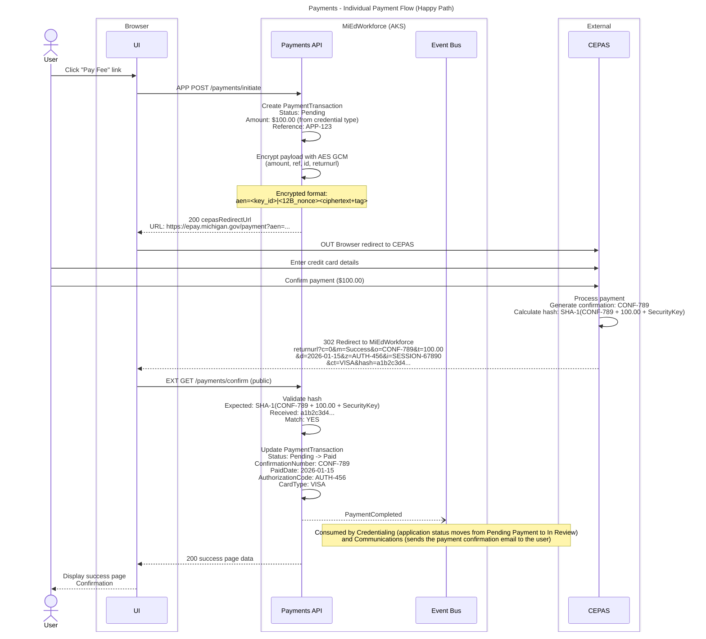

**Key Decisions:**
- **PCI Compliance:** MiEdWorkforce never handles card data; all sensitive processing on CEPAS
- **Hash validation:** Required security check prevents spoofed confirmations
- **Event-driven:** Credential workflow advancement triggered by PaymentCompleted event

**State Changes:**
- PaymentTransaction status: `Pending` -> `Paid`
- Credential application status: `Pending Payment` -> `In Review`

**Events Published:**
- `PaymentCompleted` - Fires after hash validation success

**Error Scenarios:**
- Hash validation fails -> Transaction marked `Failed`, security alert raised
- CEPAS returns error code -> See "Individual Payment Flow (Payment Failed)"

---

## Individual Payment Flow (Browser Closed - Missing Payment)

**What:** User completes payment on CEPAS but closes browser before redirect; posting file reconciliation catches missing payment next morning  
**When:** Nightly batch job processes CEPAS posting file  
**Who:** System (automated reconciliation)

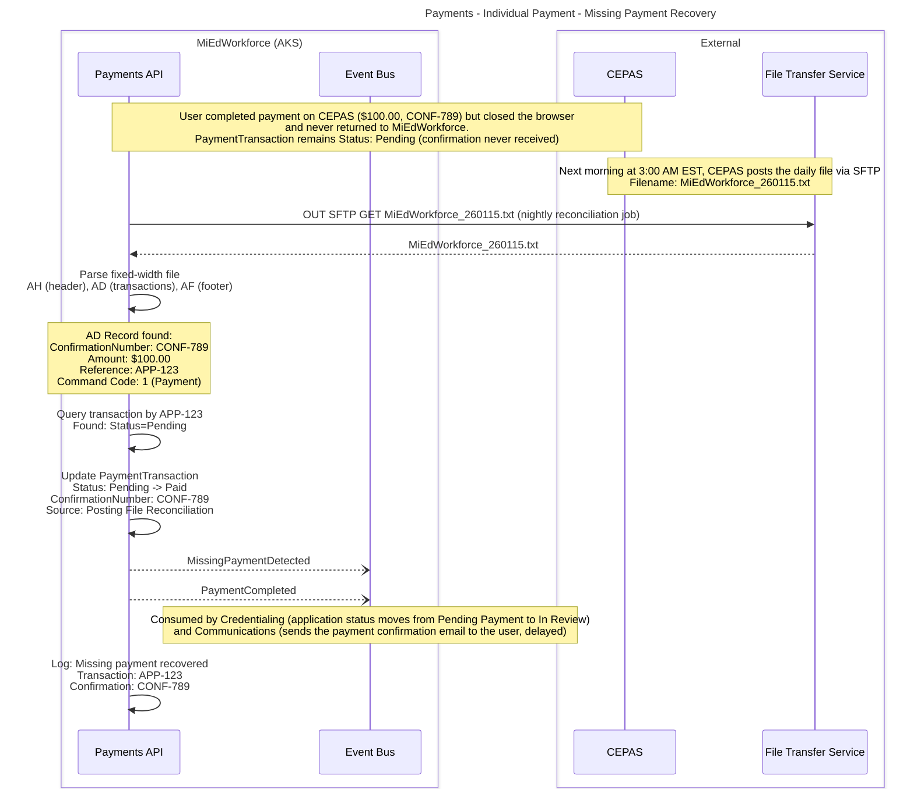

**Key Decisions:**
- **Posting file is source of truth:** Catches all payments that CEPAS confirmed, even if redirect missed
- **Auto-update only Pending:** Failed or Refunded transactions not overwritten
- **Monitoring:** MissingPaymentDetected event tracks reliability of redirect flow

**State Changes:**
- PaymentTransaction status: `Pending` -> `Paid` (via batch job)
- Credential application status: `Pending Payment` -> `In Review` (may be delayed 1 day)

**Events Published:**
- `MissingPaymentDetected` - Fires when posting file payment not found in real-time flow
- `PaymentCompleted` - Standard payment completion event (triggers credential workflow)

**Business Impact:**
- User experience: Payment confirmation email delayed up to 24 hours
- Credential processing: Delayed by up to 1 business day
- Revenue protection: No payments lost due to browser issues

---

## Individual Payment Flow (Payment Failed)

**What:** Payment fails on CEPAS (e.g., declined card, insufficient funds); user can retry  
**When:** CEPAS returns error code via redirect  
**Who:** User (after payment decline). The confirmation step is a public endpoint (no permission; hash validated).

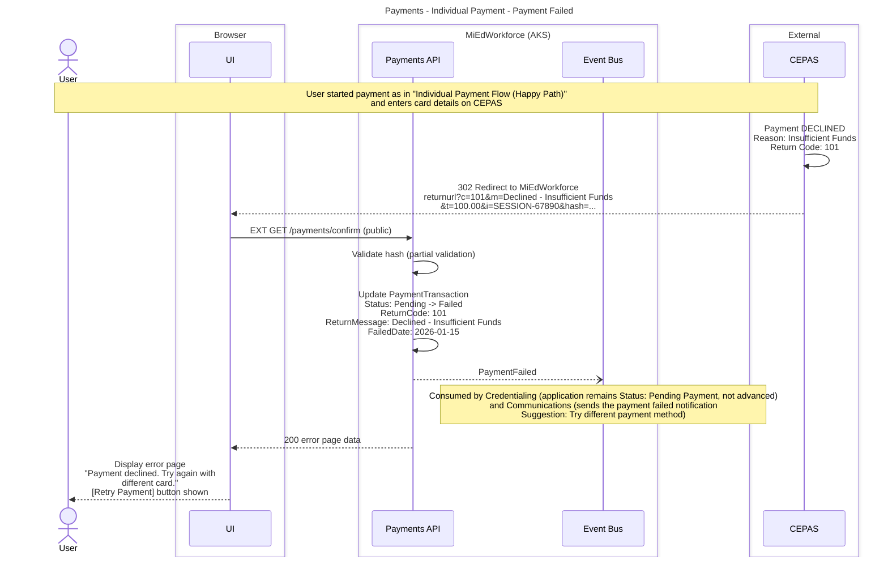

**Key Decisions:**
- **Preserve failed transaction:** Audit trail maintained; retry creates new transaction
- **User-friendly error:** Generic message to user; detailed error logged for admin review
- **Unlimited retries:** User can attempt payment multiple times

**State Changes:**
- PaymentTransaction status: `Pending` -> `Failed`
- Credential application status: Remains `Pending Payment`

**Events Published:**
- `PaymentFailed` - Fires when CEPAS returns non-zero return code

**Error Scenarios:**
- Common return codes: 101 (Declined), 102 (Insufficient Funds), 103 (Invalid Card), 104 (Expired Card)

---

## Bulk Payment Processing

**What:** District staff selects multiple credential applications and processes single payment for total fees  
**When:** Business user (district staff) needs to pay fees for multiple applications  
**Who:** Business User with `payments.transaction.initiate.bulk` permission. Permission: `payments.transaction.initiate-bulk` (scoped to the caller's organization: District, ISD, or System-wide). The confirmation step is a public endpoint (no permission; hash validated).

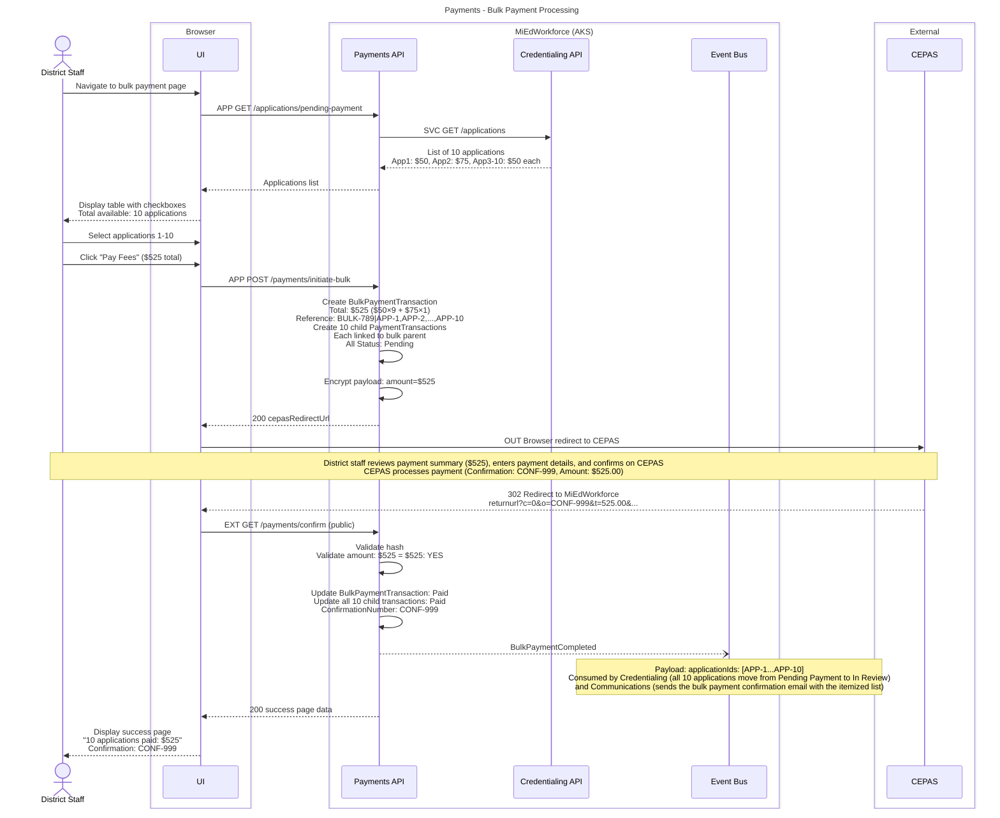

**Key Decisions:**
- **Atomic success/failure:** All applications paid or none; no partial payments
- **Amount validation:** Total must equal sum of individual fees
- **Scope enforcement:** User can only select applications within authorized district/ISD; the calling domain validates application eligibility before Payments is invoked

**Permissions:**
- Requires: `payments.transaction.initiate-bulk` at the appropriate organizational scope (District, ISD, or System-wide)

**State Changes:**
- BulkPaymentTransaction status: `Pending` -> `Paid`
- All 10 child PaymentTransactions: `Pending` -> `Paid`
- All 10 credential applications: `Pending Payment` -> `In Review`

**Events Published:**
- `BulkPaymentCompleted` - Includes array of all application IDs

**Error Scenarios:**
- Amount mismatch -> All transactions remain Pending, discrepancy flagged
- Any application out of scope -> Reject entire bulk payment request

---

## Refund Request and Approval

**What:** Credential Admin requests refund for paid transaction; auto-approved if ≤$500 and processed via CEPAS API; refunds >$500 require Financial Admin approval before processing  
**When:** Applicant withdraws application or refund needed for other reason; high-value refund needed  
**Who:** Credential Administrator, Financial Administrator. Permission: `payments.transaction.view` (search, scoped to the caller's organization), `payments.refund.request` (submit, system-wide), `payments.refund.approve` (list pending and approve or reject, system-wide)

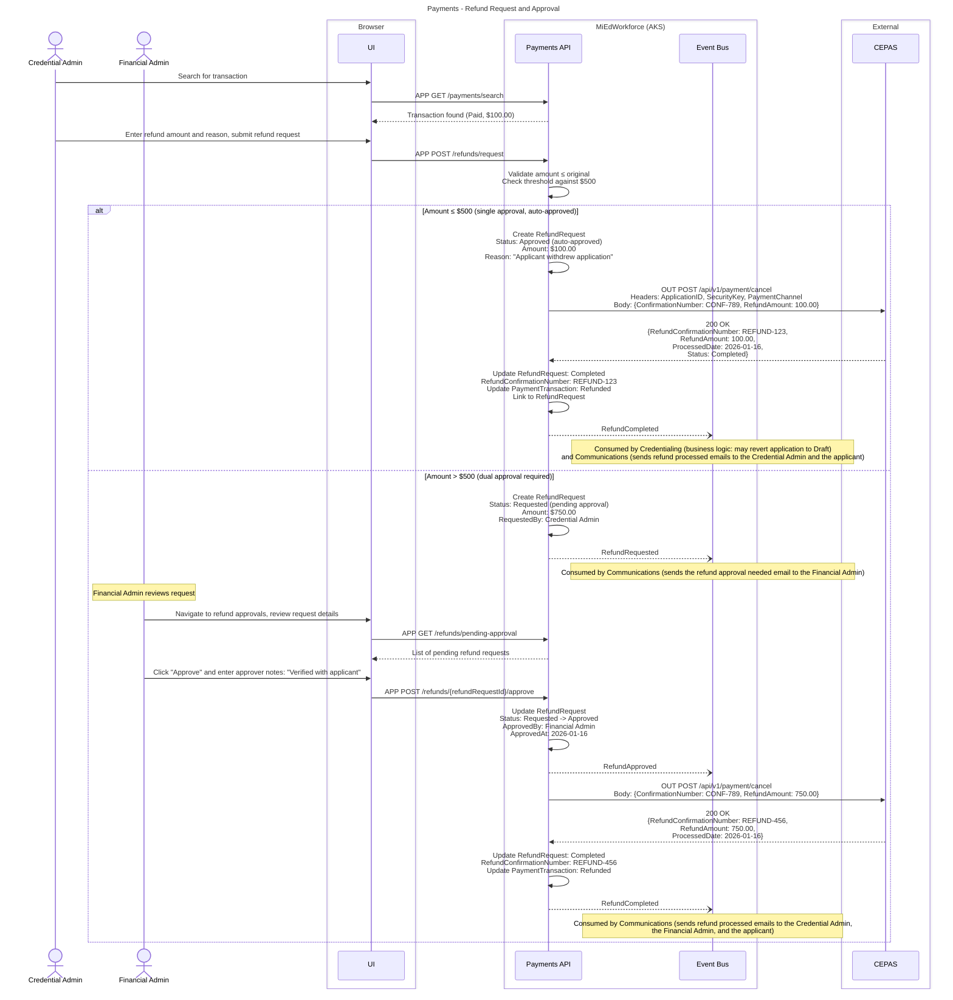

**Key Decisions:**
- **Auto-approval threshold:** Configurable; default $500
- **Dual approval threshold:** Configurable; default >$500
- **CEPAS API idempotency:** Safe to retry on failure (same confirmation number)
- **Atomic update:** Transaction status only changes after CEPAS confirms
- **Approval workflow:** Sequential (request -> approve -> process), not parallel
- **Rejection path:** Financial Admin can reject with reason using the same `payments.refund.approve` permission (not shown in diagram)

**Permissions:**
- Requires: `payments.refund.request` to submit the refund request (Credential Admin)
- Requires: `payments.refund.approve` to approve or reject (Financial Admin); covers both actions

**State Changes:**
- RefundRequest status: `Requested` -> `Approved` (auto, at or below the threshold) -> `Completed`
- RefundRequest status: `Requested` -> `Approved` -> `Completed` (dual approval)
- PaymentTransaction status: `Paid` -> `Refunded`

**Events Published:**
- `RefundRequested` - Fires when Credential Admin submits request (dual approval path)
- `RefundApproved` - Fires when Financial Admin approves (dual approval path)
- `RefundCompleted` - Fires after CEPAS confirms refund processed

**Error Scenarios:**
- CEPAS API failure -> RefundRequest marked Failed, admin alerted for retry
- Amount exceeds original -> Validation error before CEPAS call

---

## Daily Posting File Reconciliation

**What:** Nightly batch job retrieves CEPAS posting file, matches transactions, updates missing payments, flags discrepancies  
**When:** Daily at 3:00 AM EST (automated)  
**Who:** System (ReconciliationJob). Permission: `payments.reconciliation.run` (system-wide; manual trigger only, the automated nightly job requires none)  
**See also:** "Reconcile One Posting Record" (handling of each posting file record)

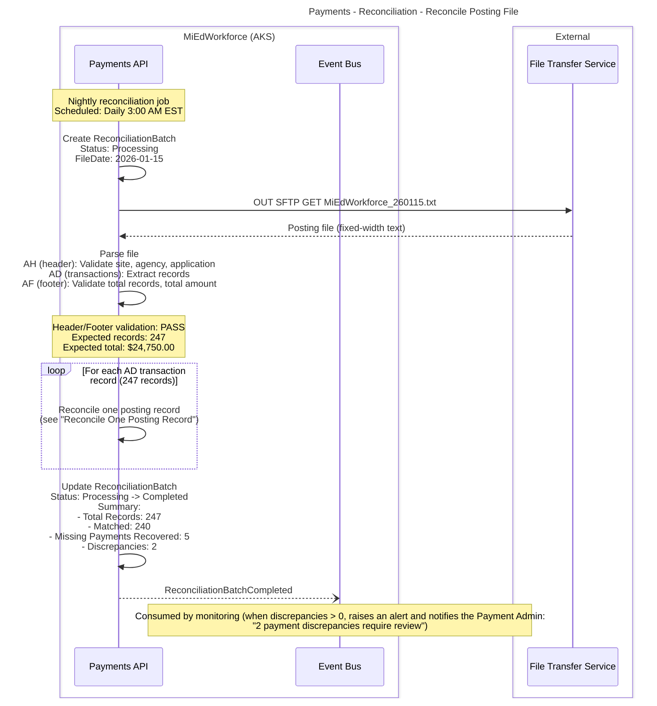

**Key Decisions:**
- **Source of truth:** Posting file is authoritative for payment status

**Permissions:**
- Requires: `payments.reconciliation.run` to manually trigger (automated nightly job requires no user permission)
- Requires: `payments.reconciliation.view` to view batch results
- Requires: `payments.reconciliation.discrepancy-view` to see flagged discrepancies

**State Changes:**
- ReconciliationBatch status: `Processing` -> `Completed`

**Events Published:**
- `ReconciliationBatchCompleted` - At batch completion with summary

**Monitoring:**
- Success rate: Target >95% auto-matched
- Alert if discrepancies >5% of total records
- Alert if batch fails to run

---

## Reconcile One Posting Record

**What:** For each AD record in the posting file, the reconciliation job matches the record to a PaymentTransaction by command code, recovers missing payments, and flags discrepancies  
**When:** Once per AD record while the nightly batch runs  
**Who:** System (ReconciliationJob)  
**See also:** "Daily Posting File Reconciliation" (batch retrieval, parsing and summary)

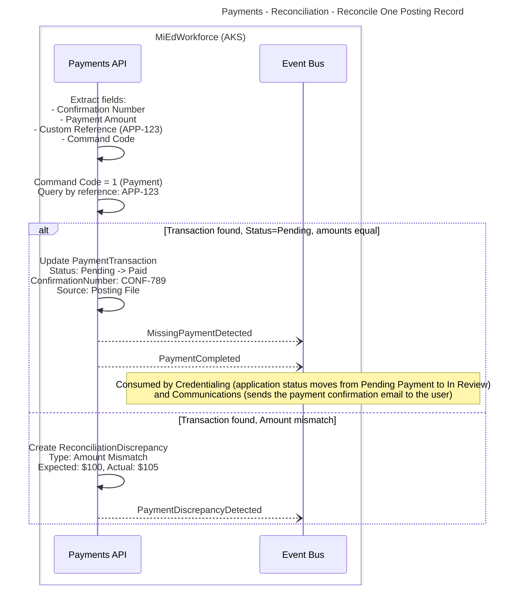

**Key Decisions:**
- **Auto-update restrictions:** Only `Pending` transactions updated; `Failed`/`Refunded` left unchanged
- **Discrepancy handling:** Flagged for manual review, not auto-resolved

**Command Code Handling:**

| Command Code | Condition | Handling |
|---|---|---|
| 1 (Payment) | Transaction found, Status=Pending | Update to Paid (Source: Posting File), publish `MissingPaymentDetected` and `PaymentCompleted`, log "Missing payment recovered" (shown in diagram) |
| 1 (Payment) | Transaction found, Status=Paid | Match confirmed, no action needed |
| 1 (Payment) | Transaction found, Amount mismatch | Create ReconciliationDiscrepancy (Type: Amount Mismatch), publish `PaymentDiscrepancyDetected` (shown in diagram) |
| 1 (Payment) | Transaction not found | Create ReconciliationDiscrepancy (Type: Orphan Payment; payment in CEPAS but no application), publish `PaymentDiscrepancyDetected` |
| 5 (Refund) | Any | Match refund confirmation number, verify refund recorded |
| 6, 9, 10, 15, 16 (Void, Chargeback, Chargeback Reversal, ACH Credit, Processor Void) | Any | Record as ReconciliationRecord with match_result = Discrepancy; not auto-resolved, no defined handling for these codes yet; flagged for manual classification |

Command codes: 1=Payment, 5=Refund, 6=Void, 9=Chargeback, 10=ChargebackReversal, 14=Partial, 15=ACHCredit, 16=ProcessorVoid.

**State Changes:**
- PaymentTransaction status: `Pending` -> `Paid` (for missing payments only)

**Events Published:**
- `MissingPaymentDetected` - Per recovered payment
- `PaymentCompleted` - Per recovered payment (triggers credential workflow)
- `PaymentDiscrepancyDetected` - Per unmatched or mismatched record

---

## CEPAS Service Unavailable

**What:** User attempts payment when CEPAS is down; system displays error and allows retry later  
**When:** CEPAS health check fails  
**Who:** Any user attempting payment. Permission: `payments.transaction.initiate` (implicit baseline; the user's own application)

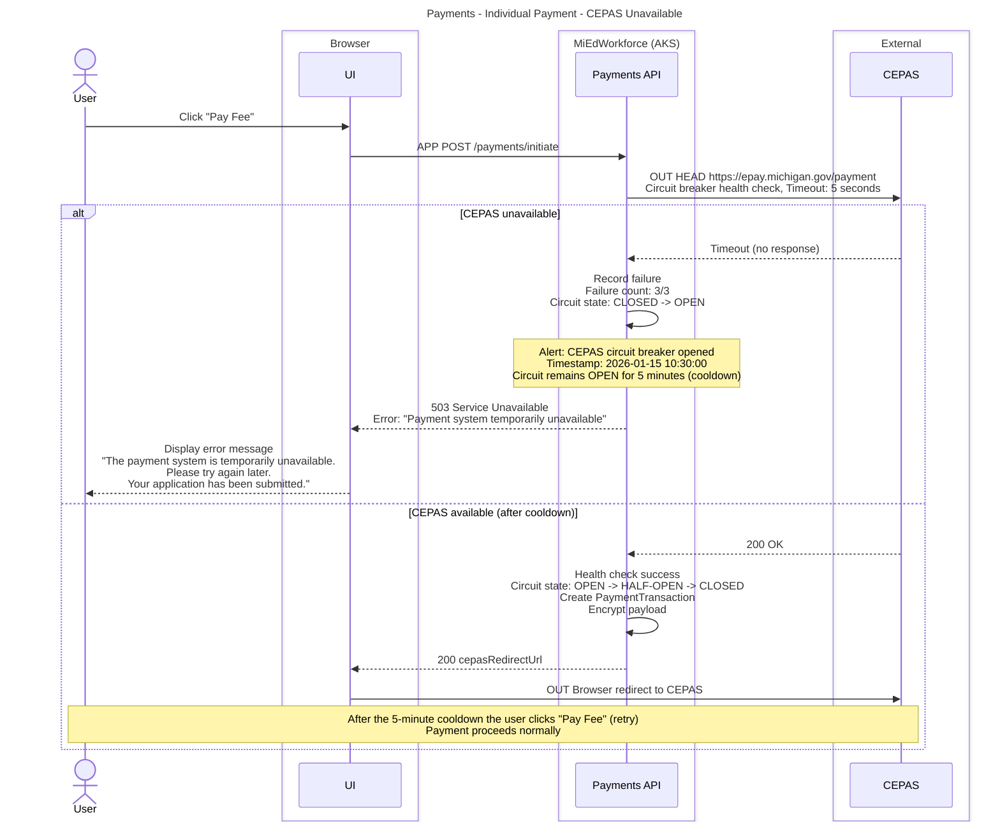

**Key Decisions:**
- **Circuit breaker pattern:** Prevents cascading failures and reduces load on struggling CEPAS
- **Health check before redirect:** Fail fast with clear error rather than broken redirect
- **Cooldown period:** 5 minutes (configurable) before retry attempts

**Circuit Breaker States:**
- `CLOSED` - Normal operation, all requests pass through
- `OPEN` - Failures exceeded threshold, all requests blocked
- `HALF-OPEN` - Testing if service recovered, limited requests allowed

**Monitoring:**
- Alert when circuit opens
- Track CEPAS availability percentage
- Monitor user impact (failed payment attempts)

---

## Payment Retry After Failure

**What:** User retries payment after previous attempt failed (declined card, timeout, etc.)  
**When:** User clicks retry button on failed payment error page  
**Who:** Any user with failed payment transaction. Permission: `payments.transaction.initiate` (implicit baseline; the user's own application)

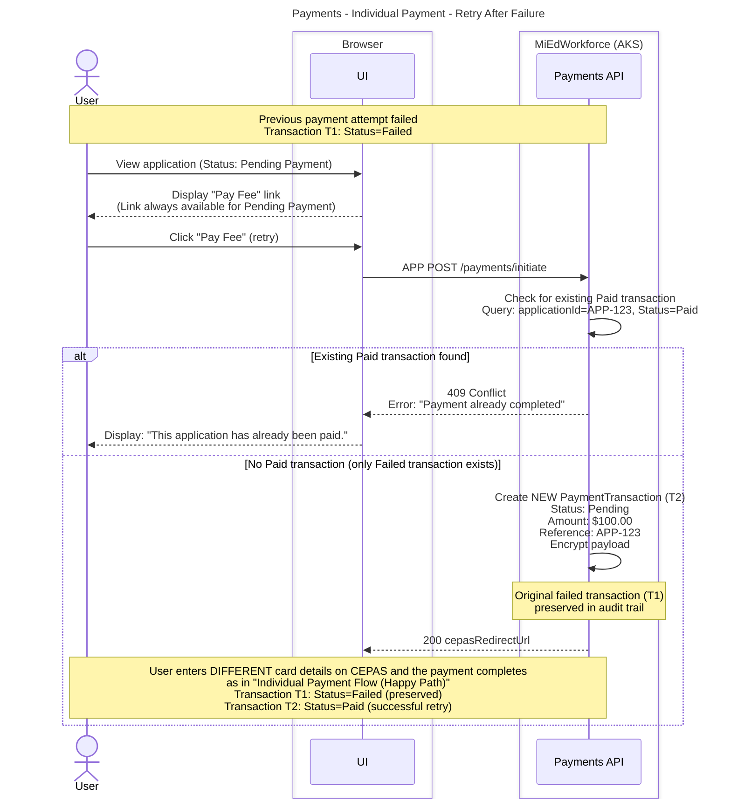

**Key Decisions:**
- **Each retry creates new transaction:** Failed transactions preserved for audit trail
- **Prevent double payment:** Check for existing Paid transaction before creating new one
- **Unlimited retries:** User can attempt payment as many times as needed

**State Changes:**
- New PaymentTransaction (T2) created: `Pending` -> `Paid`
- Original failed transaction (T1): Remains `Failed`

**Audit Trail:**
- All payment attempts linked to same application ID
- Timestamp and reason for failure preserved
- Full history available for support/troubleshooting

---

## Bulk Refund Processing

**What:** Credential Admin selects multiple paid transactions for bulk refund  
**When:** Multiple applications need refunds (e.g., district error, program cancellation)  
**Who:** Credential Administrator (with Financial Admin approval for high values). Permission: `payments.transaction.view` (search, scoped to the caller's organization), `payments.refund.request-bulk` (submit, system-wide), `payments.refund.approve` (only if the threshold is exceeded, system-wide)

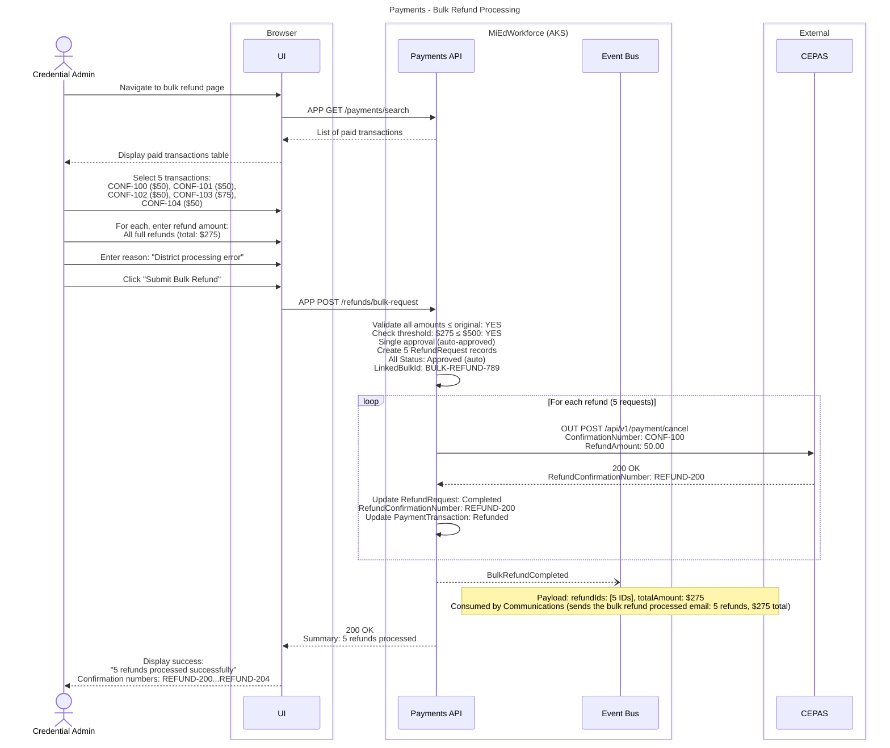

**Key Decisions:**
- **Sequential processing:** Refunds processed one-by-one via CEPAS API (not atomic batch)
- **Partial success handling:** If one fails, others continue; failure logged separately
- **Threshold calculation:** Total refund amount determines approval requirements

**Permissions:**
- Requires: `payments.refund.request-bulk` to submit the bulk refund request (Credential Admin)
- Requires: `payments.refund.approve` to approve or reject if threshold exceeded (Financial Admin)

**State Changes:**
- 5 RefundRequest records: `Requested` -> `Approved` -> `Completed`
- 5 PaymentTransaction records: `Paid` -> `Refunded`

**Events Published:**
- `BulkRefundCompleted` - Single event with summary of all refunds

**Error Scenarios:**
- If any CEPAS API call fails, that refund marked Failed, others continue
- Summary shows: 4 successful, 1 failed

---

## Reconciliation Discrepancy Investigation

**What:** Payment Admin investigates and manually resolves posting file discrepancy  
**When:** Reconciliation batch detects unmatched or mismatched transaction  
**Who:** Payment Administrator. Permission: `payments.reconciliation.discrepancy-view` (view), `payments.reconciliation.discrepancy-resolve` (resolve); both system-wide

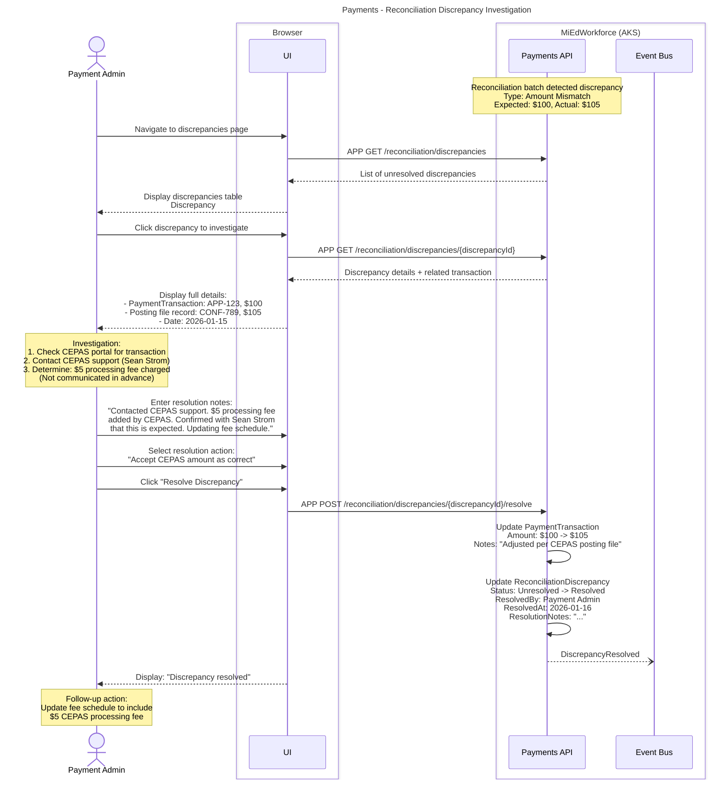

**Key Decisions:**
- **Manual resolution required:** No auto-resolution of discrepancies
- **Audit trail:** All resolution actions logged with notes
- **Resolution options:** Accept CEPAS, Reject (mark transaction Failed), Create adjustment

**Permissions:**
- Requires: `payments.reconciliation.discrepancy-view` to view discrepancies
- Requires: `payments.reconciliation.discrepancy-resolve` to mark as resolved; resolution notes are mandatory and audit logged

**Resolution Types:**
- **Accept CEPAS Amount:** Update MiEdWorkforce transaction to match posting file
- **Reject CEPAS Record:** Mark transaction as Failed, investigate further
- **Contact Applicant:** Discrepancy requires external verification
- **Adjustment Required:** Create manual adjustment transaction

**State Changes:**
- ReconciliationDiscrepancy status: `Unresolved` -> `Resolved`
- PaymentTransaction: May be updated based on resolution type

**Events Published:**
- `DiscrepancyResolved` - Fires when admin marks discrepancy resolved
