# Staffing - Workflows & Sequences

This document contains sequence diagrams for all workflows in the Staffing domain.

**Conventions:**
- Solid arrows (`->>`) = Synchronous calls
- Dashed arrows (`-->>`) = Responses
- Dotted arrows (`--)`) = Async/fire-and-forget (events published to the Event Bus)
- **actor** = Human users only
- **participant** = Everything that is not a human: the UI, services, the Event Bus and external systems
- Every request arrow between participants starts with an API-kind tag followed by the verb and path from the API catalog: `APP` (Application API, user delegated token, UI to owning API), `SVC` (Service API, in-cluster mTLS, API to API), `EXT` (External API, inbound OAuth client credentials from an external system), `OUT` (outbound call to an external system). Responses and events carry no tag.
- Participants are grouped with `box`: Browser (the UI), MiEdWorkforce (AKS) (services and the Event Bus), External (external systems).
- Every application API call is authorized by the owning service through the cached IAM permission check (Service API). It is not drawn unless noted.

---

## Add New Employee

**What:** District user adds a new employee to the roster by searching for existing identity or creating new record, triggering Unique ID assignment via Mi-Key service.
**When:** District hires new staff member and needs to report employment within 30 days (MCL 388.1619)
**Who:** Staffing Authorized User (School District role). Permission: staffing.employee-roster.add-employee (entity scope), the search step also needs staffing.employee-roster.view

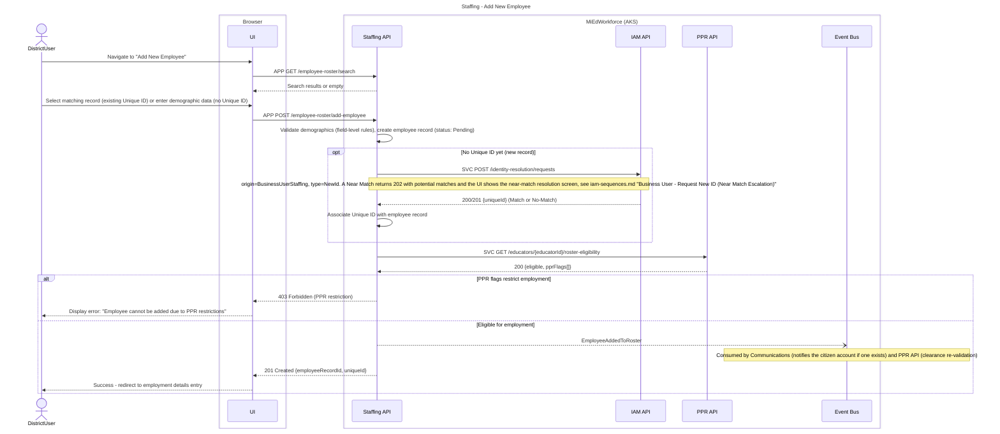

**Key Decisions:**
- System requires user to search before adding to prevent duplicate Unique ID associations within same district
- Staffing never calls Mi-Key directly — identity resolution (matching, Near Match handling) is entirely IAM's, triggered here via API call; see `iam-domain.md`/`iam-sequences.md`
- PPR clearance check is blocking; employee cannot be added if restricted by professional practice flags

**State Changes:**
- EmployeeRoster: N/A > Pending (awaiting employment details, and possibly awaiting Unique ID from IAM)

**Events Published:**
- `EmployeeAddedToRoster` - Triggers notification to citizen account if exists, PPR clearance re-validation

**Error Scenarios:**
- Demographic validation fails > 400 Bad Request with field-level errors
- PPR flags restrict employment > 403 Forbidden, block employee addition
- IAM/Mi-Key service timeout > 503 Service Unavailable, user retries later
- Unique ID already in entity roster > 409 Conflict, user selects existing record instead

---

## Update Employee Demographics

**What:** District user or citizen updates demographic information for employee, triggering Mi-Key synchronization and history tracking.
**When:** Name change (marriage, legal name change), address update, or correction of demographic data
**Who:** Staffing Authorized User (School District role) or Citizen User (self-only). Permission: staffing.employee-roster.update-demographics (entity scope), the form load also needs staffing.employee-roster.view
**See also:** Update Employee Demographics - Resolve Near Match (the Near Match branch of this flow)

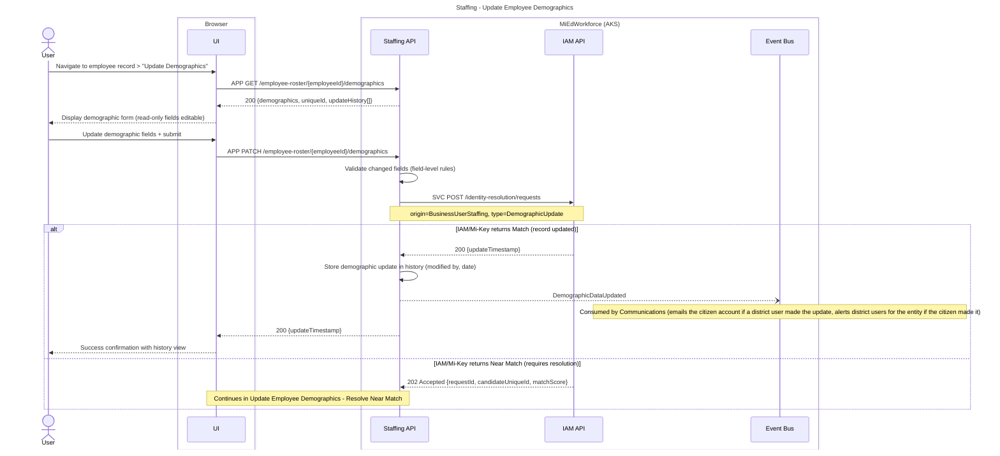

**Key Decisions:**
- All demographic updates flow through IAM's identity resolution API (which in turn talks to Mi-Key) to maintain a single source of truth for identity matching — Staffing holds no Near Match state of its own beyond a "Requires Resolution" flag on its own record
- Update history stored locally for audit trail (modified by, modified date)
- Cross-notification pattern: citizen notified of district updates, district notified of citizen updates

**State Changes:**
- EmployeeRoster.demographics: Updated values (or unchanged, if user selects "No" to replace or cancels)
- EmployeeRoster.updateHistory: New entry appended
- EmployeeRoster record status: Active > Requires Resolution > Active (on confirm or cancel)

**Events Published:**
- `DemographicDataUpdated` - Triggers cross-notifications based on update source

**Error Scenarios:**
- IAM/Mi-Key update fails due to conflict (concurrent update) > 409 Conflict, user refreshes and retries
- Citizen updates demographics but district does not have notification configured > No error, event published but no email sent
- Invalid SSN format > 400 Bad Request before IAM call

---

## Update Employee Demographics - Resolve Near Match

**What:** User resolves a Near Match raised by a demographic update, either confirming the correct individual (optionally replacing the master record) or cancelling the update.
**When:** IAM/Mi-Key returns a Near Match (requires resolution) for a demographic update
**Who:** Staffing Authorized User (School District role) or Citizen User (self-only). Permission: staffing.employee-roster.update-demographics (entity scope)
**See also:** Update Employee Demographics (the main update flow that leads here)

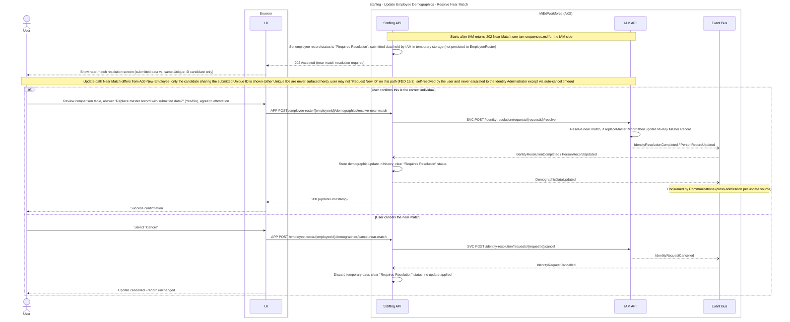

**Key Decisions:**
- Near Match on the Update path is intentionally narrower than on Add New Employee: only the candidate sharing the submitted Unique ID is ever displayed, and the user cannot escalate to "Request New ID" — they may only confirm (optionally replacing the master record) or cancel (FDD 15.3, "If the request is generated from an Update Record the user will be able to review and confirm the update or cancel the request... not able to Create a New ID when updating")
- An unresolved Near Match auto-cancels after an admin-configurable timeframe (FDD 15.3 Gap Analysis names this "X days," not yet numerically defined — see `iam-domain.md` Open Question #11)

**State Changes:**
- EmployeeRoster.demographics: Updated values (or unchanged, if user selects "No" to replace or cancels)
- EmployeeRoster.updateHistory: New entry appended on confirm
- EmployeeRoster record status: Active > Requires Resolution > Active (on confirm or cancel)

**Events Published:**
- `DemographicDataUpdated` - Triggers cross-notifications based on update source (on confirm)

**Error Scenarios:**
- Near Match left unresolved past the configured timeout > IAM auto-cancels, sends cancellation to Mi-Key, discards temporary data, publishes `IdentityRequestCancelled` (FDD 15.3)

---

## Assign Employee to Position - Validate Placement

**What:** District user assigns an employee to a position, triggering credential validation and spot allocation. If credentials are missing, user submits justification or applies for temporary credential.
**When:** Employee is hired or reassigned to different position/course
**Who:** Staffing Authorized User (School District role). Permission: staffing.assignment.view (placement validation), staffing.position-roster.view (position details), staffing.employee-roster.view (employee search), all entity scope
**See also:** Assign Employee to Position - Create Assignment, Assign Employee to Position - Create Assignment with Credential Error Justification

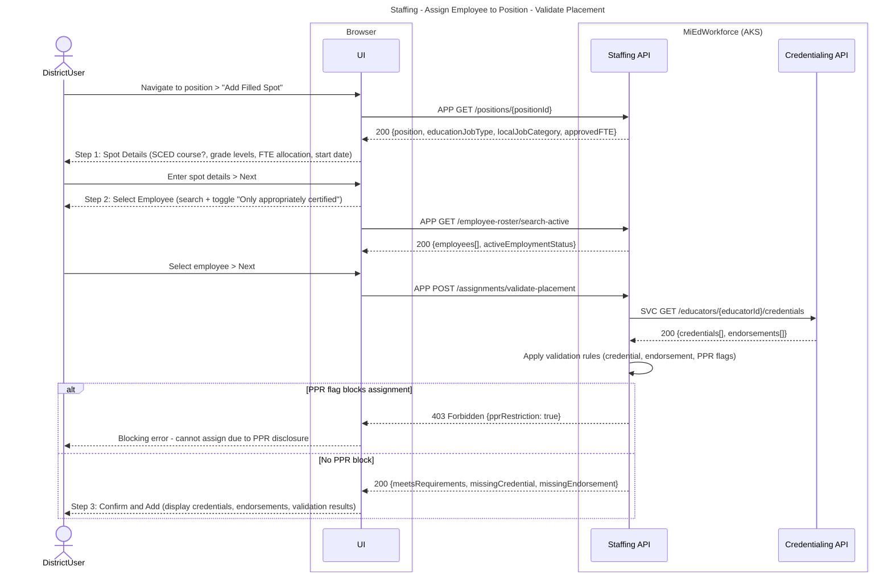

**Validation Rules:**

| Check | Applies when | Result |
|---|---|---|
| Credential exists for educationJobType | Administrator or Instructional position requires credential | meetsRequirements true, or false with missingCredential true |
| Endorsement covers SCED code and grade span | Teacher position with course details requires endorsement | meetsRequirements true, or false with missingEndorsement true |
| PPR flags | PPR clearance required and a disclosure prevents assignment | 403 Forbidden with pprRestriction true |

**Key Decisions:**
- Three-step assignment workflow (spot details > select employee > confirm) ensures complete data entry before validation
- Credential validation is non-blocking but forces justification or temporary credential path if missing
- PPR flags can block assignment entirely (blocking error) if disclosure indicates risk

**State Changes:**
- None (validation only)

**Events Published:**
- None

**Error Scenarios:**
- PPR flag blocks assignment > 403 Forbidden, user cannot proceed
- Invalid SCED code or grade span > 400 Bad Request, user corrects and resubmits

---

## Assign Employee to Position - Create Assignment

**What:** District user confirms the assignment after placement validation meets all requirements, creating the assignment and recalculating the position FTE health indicator.
**When:** Placement validation shows the employee meets all requirements
**Who:** Staffing Authorized User (School District role). Permission: staffing.assignment.create (entity scope)
**See also:** Assign Employee to Position - Validate Placement, Assign Employee to Position - Create Assignment with Credential Error Justification

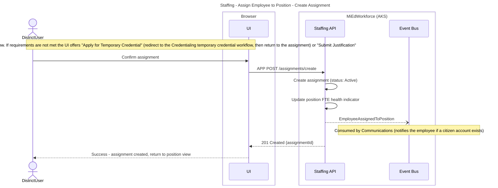

**Key Decisions:**
- FTE health indicator recalculates after spot creation but does not block assignment

**State Changes:**
- Assignment: N/A > Active
- Position.filledFTE: Updated with spot FTE allocation
- Position.spotCount: Incremented

**Events Published:**
- `EmployeeAssignedToPosition` - Triggers notification to employee if citizen account exists

**Error Scenarios:**
- Employee already assigned to same position/course > 409 Conflict, user reviews existing assignment
- FTE allocation exceeds available FTE for position > Warning only, assignment allowed

---

## Assign Employee to Position - Create Assignment with Credential Error Justification

**What:** District user submits a free-form justification when the employee does not meet credential or endorsement requirements, creating the assignment with status Justified and alerting the SOM Auditor.
**When:** Placement validation shows missing or invalid credential or endorsement and the user chooses "Submit Justification"
**Who:** Staffing Authorized User (School District role). Permission: staffing.assignment.create and staffing.assignment.submit-justification (entity scope)
**See also:** Assign Employee to Position - Validate Placement, Assign Employee to Position - Create Assignment

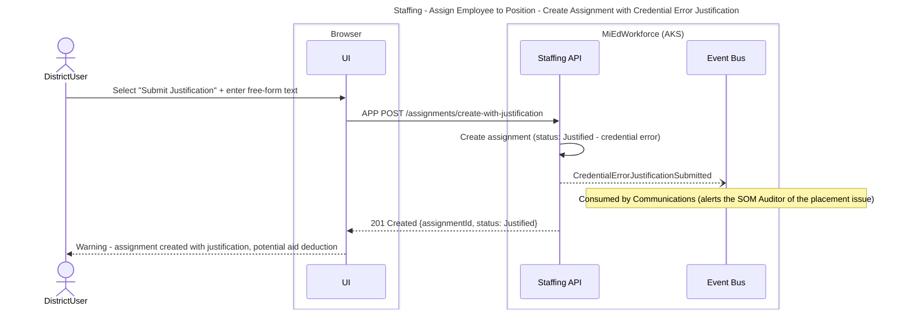

**Key Decisions:**
- Credential validation is non-blocking but forces justification or temporary credential path if missing

**State Changes:**
- Assignment: N/A > Justified (if credential error)

**Events Published:**
- `CredentialErrorJustificationSubmitted` - Alerts SOM Auditor via inclusion in the audit item list

**Error Scenarios:**
- Employee already assigned to same position/course > 409 Conflict, user reviews existing assignment

---

## Certify Collection - Run Quality Review

**What:** District user runs quality review, resolves errors and provides justifications, preparing the collection for certification.
**When:** End of collection period (e.g., Fall 2024 Employee Roster due by legislative deadline)
**Who:** Staffing Authorized User (School District role) with certification permission. Permission: staffing.collection.view and staffing.collection.validate (entity scope)
**See also:** Certify Collection - Certify

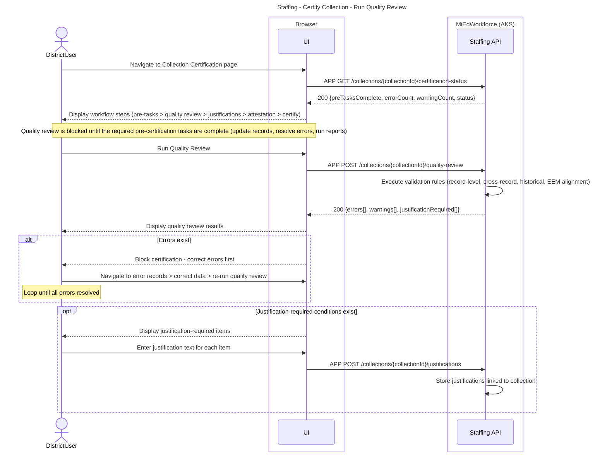

**Key Decisions:**
- Quality review must be run before certification but can be run multiple times as errors are corrected
- Errors are blocking, warnings are informational only
- Justifications are required only for specific validation conditions (e.g., all employees have same separation reason)

**State Changes:**
- Collection: In Progress > Quality Review

**Events Published:**
- None

**Error Scenarios:**
- Pre-certification tasks incomplete > Quality review blocked until required tasks are complete
- Error records exist after quality review > Certification blocked, user corrects errors and re-runs

---

## Certify Collection - Certify

**What:** District user certifies the collection after attestation, triggering creation of an audit work item for the district's ISD/RESA entity.
**When:** Quality review has no errors and all required justifications are stored
**Who:** Staffing Authorized User (School District role) with certification permission. Permission: staffing.employee-roster.certify, staffing.position-roster.certify and staffing.assignment.certify (entity scope)
**See also:** Certify Collection - Run Quality Review, ISD Auditor Review District Submission - Request Documentation and Record Findings

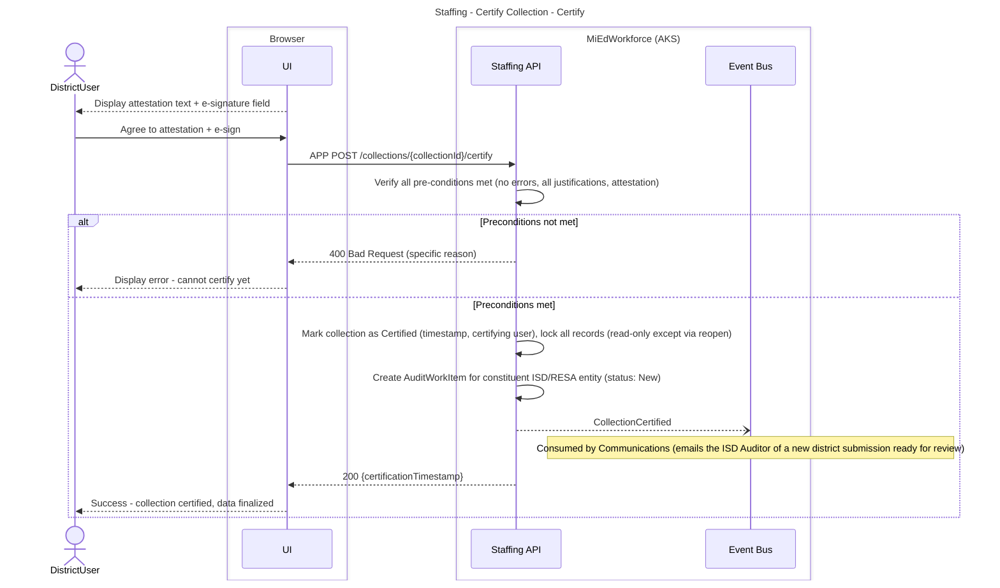

**Key Decisions:**
- Errors are blocking, warnings are informational only
- Attestation and e-signature legally bind the certifying user to data accuracy

**State Changes:**
- Collection: Quality Review > Certified
- All EmployeeRecord and Position records: Active > Certified (read-only)
- AuditWorkItem: N/A > New (visible in the ISD Auditor's audit item list)

**Events Published:**
- `CollectionCertified` - Triggers audit work item creation for the constituent ISD/RESA entity, email notifications

**Error Scenarios:**
- Error records still exist when certification attempted > 400 Bad Request, user corrects errors
- Justifications missing for required items > 400 Bad Request, user provides justifications
- Legislative deadline passed without certification > User must request Collection Exception
- Network failure during certification > 500 Internal Server Error, user retries (idempotent)

---

## ISD Auditor Review District Submission - Request Documentation and Record Findings

**What:** ISD Auditor reviews district-certified collection, validates appropriate placement, and requests additional documentation or records audit findings if needed.
**When:** After district certifies Employee Roster and Assignment Details collection
**Who:** ISD Auditor (for constituent districts within ISD/RESA). Permission: staffing.audit.view, staffing.audit.review-submission, staffing.audit.request-documentation and staffing.audit.submit-finding (ISD/RESA entity scope)
**See also:** ISD Auditor Review District Submission - Finalize ISD Audit

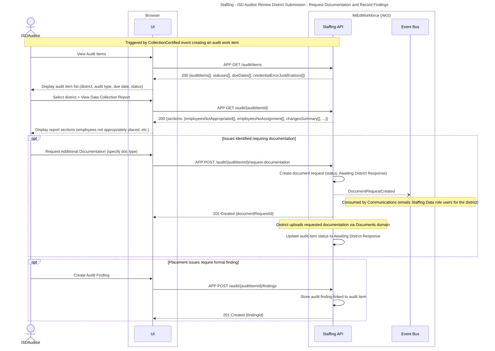

**Key Decisions:**
- ISD Auditor's audit item list auto-populated by district certification event
- Document requests are tracked as separate entities linked to audit item, with status updates
- Audit findings stored for SOM Auditor review (downstream workflow)

**State Changes:**
- AuditWorkItem: New > In Progress > Awaiting District Response (if doc requested)
- AuditFinding: N/A > Created

**Events Published:**
- `DocumentRequestCreated` - Triggers email to district Staffing Data role users

**Error Scenarios:**
- District does not respond to document request within deadline > Audit status remains Awaiting District Response, escalation to SOM

---

## ISD Auditor Review District Submission - Finalize ISD Audit

**What:** ISD Auditor finalizes the audit report after all required tasks are complete, with attestation and e-signature.
**When:** After the ISD Auditor has completed review, documentation requests and findings for the district submission
**Who:** ISD Auditor (for constituent districts within ISD/RESA). Permission: staffing.audit.finalize (ISD/RESA entity scope), the status check also needs staffing.audit.view
**See also:** ISD Auditor Review District Submission - Request Documentation and Record Findings

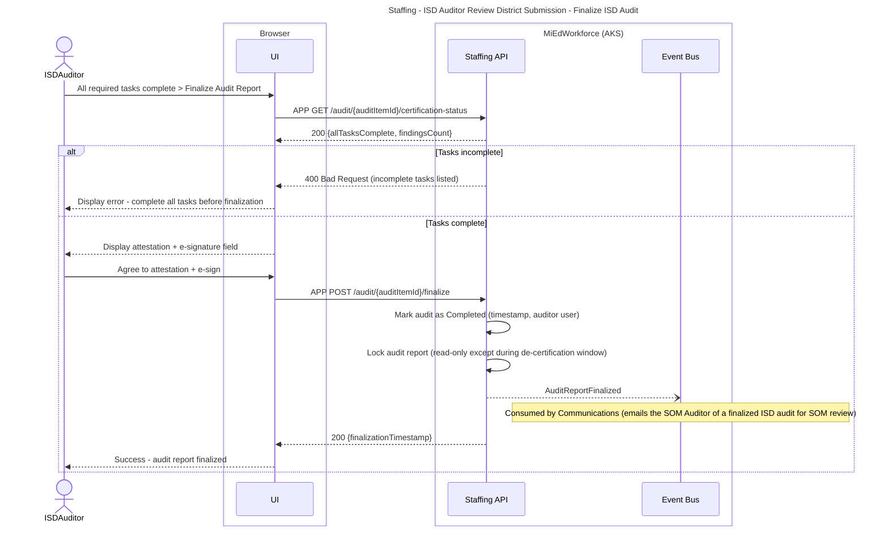

**Key Decisions:**
- Finalized audit reports are read-only but can be de-certified during allowable window for corrections

**State Changes:**
- AuditWorkItem: Awaiting District Response (if doc requested) > Pending SOM Review > Completed

**Events Published:**
- `AuditReportFinalized` - Triggers SOM Auditor notification, adds item to SOM Auditor's audit item list

**Error Scenarios:**
- ISD Auditor attempts to finalize without completing all tasks > 400 Bad Request
- Network failure during finalization > 500 Internal Server Error, user retries (idempotent)

---

## Request Collection Exception

**What:** District user requests permission to submit/certify collection data past legislative deadline, providing justification for delay.
**When:** Collection deadline has passed and district needs additional time to complete submission
**Who:** Staffing Authorized User (School District role). Permission: staffing.collection.request-exception (entity scope), the admin review steps use staffing.admin.process-exceptions (system-wide)

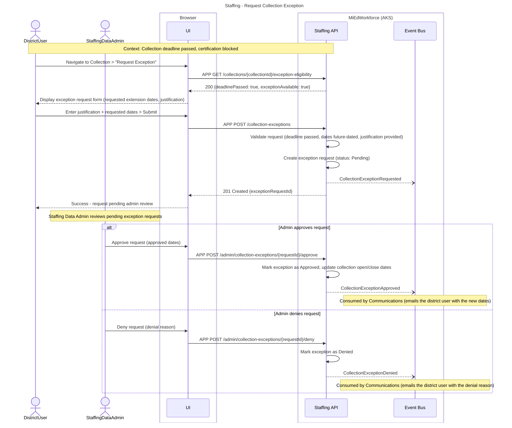

**Key Decisions:**
- Exception requests only available after deadline has passed (prevents preemptive extensions)
- Staffing Data Admin has discretion to approve/deny based on justification
- Approved exceptions update collection dates, allowing continued submission
- Denial reason required to help district understand expectations

**State Changes:**
- CollectionException: N/A > Pending > Approved/Denied
- Collection.openDate/closeDate: Updated if exception approved

**Events Published:**
- `CollectionExceptionRequested` - Pending Staffing Data Admin review
- `CollectionExceptionApproved` - Notifies district, reopens collection
- `CollectionExceptionDenied` - Notifies district with denial reason

**Error Scenarios:**
- Request submitted before deadline > 400 Bad Request, not eligible for exceptionyet
- Requested dates in past > 400 Bad Request, dates must be future-dated
- Empty justification > 400 Bad Request, justification required
- Admin approval fails to update collection dates > 500 Internal Server Error, admin retries

---

## Open New Collection

**What:** System automatically initializes a new school-year collection at the start of the academic year, carrying forward active Position Roster and Employee Roster records from the prior collection and excluding ended/cancelled ones. District users can view the prior year's roster read-only and see data-quality indicators flagged immediately after rollover.
**When:** Start of a new school year, per the Staffing Data Admin's defined collection schedule
**Who:** System-triggered (no user action); Staffing Authorized Users view the result. Permission: staffing.collection.view (entity scope) for the post-rollover view

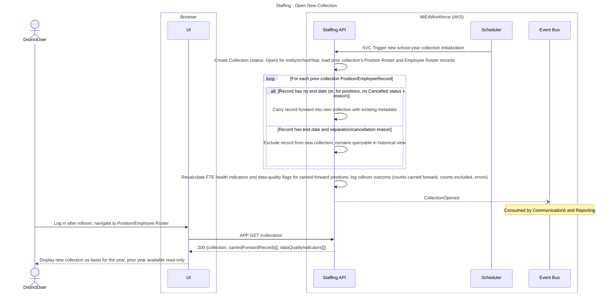

**Key Decisions:**
- Rollover requires no user action; it runs automatically when the new school year becomes active
- A record is carried forward only when it lacks both an end date and (for positions) a cancellation reason — matching the existing "Employment End Date and Separation Reason Co-requirement" and "Position Status Cancelled Requires Reason" invariants
- Excluded (ended/cancelled) records remain visible in historical, read-only views scoped to their original collection year
- FTE health indicators and data-quality flags are recalculated immediately after rollover so districts see outstanding issues before they begin new-year data entry

**State Changes:**
- Collection: N/A > Open (new school year)
- PositionRoster/EmployeeRoster records: Carried forward unchanged, or excluded and archived to historical view

**Events Published:**
- `CollectionOpened` - Signals downstream systems (dashboards, reporting) that a new collection year is available

**Error Scenarios:**
- Unexpected error during rollover for a specific record > Logged and flagged for Staffing Data Admin review; does not block rollover for other records
- District logs in before rollover completes > Prior year's roster displayed as read-only until rollover finishes

---

## Create New Position

**What:** District user creates a new position in the organizational chart, defining job type, approved FTE, and position status.
**When:** District approves new staffing allocation for upcoming school year or mid-year need arises
**Who:** Staffing Authorized User (School District role). Permission: staffing.position-roster.create (entity scope), only allowed during a working window or open collection

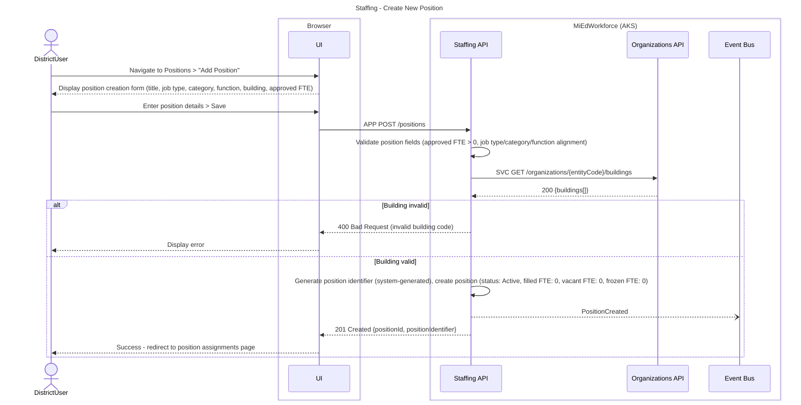

**Key Decisions:**
- Position identifier is system-generated to ensure uniqueness
- Default status is Active (no employee assignment yet)
- Building validation against EEM ensures positions linked to valid entity hierarchy
- FTE health indicator shows mismatch immediately (approved FTE > 0, filled FTE = 0)

**State Changes:**
- Position: N/A > Active

**Events Published:**
- `PositionCreated` - Triggers dashboard updates, notifications if configured

**Error Scenarios:**
- Approved FTE <= 0 > 400 Bad Request, must be positive
- Invalid job type/category/function combination > 400 Bad Request, user corrects
- Building code not in entity's EEM data > 400 Bad Request, user selects valid building
- Duplicate position title within entity > Warning only, creation allowed

---

## Update Position Status

**What:** District user changes position status (e.g., Active to Filled, Active to Frozen, Active to Cancelled), enforcing business rules for employee associations and required fields.
**When:** Position is filled by employee, temporarily frozen due to budget, or permanently cancelled
**Who:** Staffing Authorized User (School District role). Permission: staffing.position-roster.update (entity scope)

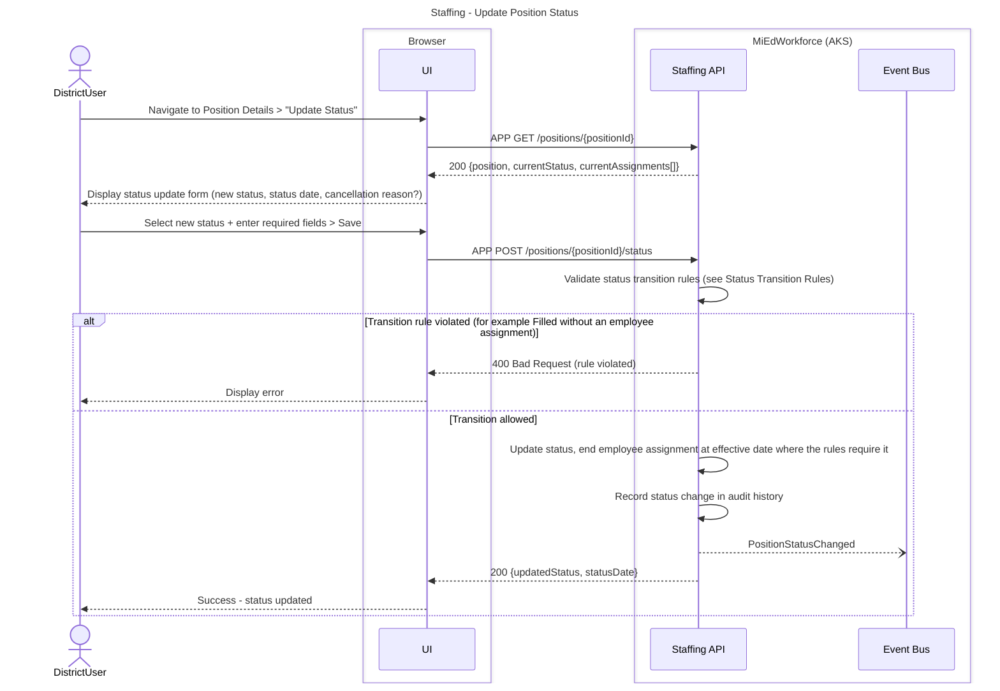

**Status Transition Rules:**

| New status | Required to accept | Rejection | Effect on assigned employee |
|---|---|---|---|
| Filled | An employee is assigned | 400 Bad Request, assign employee first | None |
| Approved | Expected start date is in the future and no employee is currently assigned | 400 Bad Request, start date not in future, or active employee must be removed first | None |
| Active | None | None | If an employee is assigned after the effective date, end the assignment at the effective date |
| Frozen | None | None | If an employee is assigned, end the assignment at the effective date |
| Cancelled | Cancellation reason provided | 400 Bad Request, reason required | If an employee is assigned after the effective date, end the assignment at the effective date |

**Key Decisions:**
- Status transition rules enforce data integrity (e.g., Filled requires employee, Frozen prohibits employee)
- Employee assignments automatically end when position becomes Frozen or Cancelled
- Cancellation reason required to document why position eliminated
- Status changes tracked in audit history for compliance reporting

**State Changes:**
- Position.status: OldStatus > NewStatus
- Assignment.endDate: Set to status effective date if employee assigned and status is Frozen/Cancelled

**Events Published:**
- `PositionStatusChanged` - Triggers notifications if employee assignment ended

**Error Scenarios:**
- Filled status without employee > 400 Bad Request, user assigns employee first
- Cancelled status without reason > 400 Bad Request, user provides reason
- Approved status with current employee > 400 Bad Request, user removes assignment first
- Status date in future > Warning only, status change allowed
