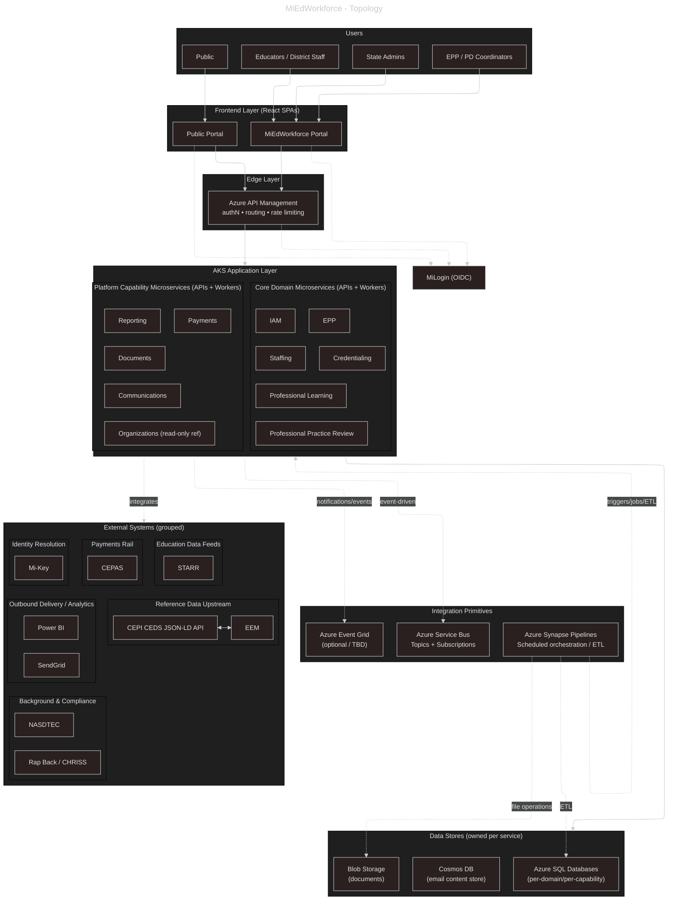

# MiEdWorkforce - Solution Architecture

## Purpose

This document provides a 30,000-foot architectural view of the MiEdWorkforce system. It captures:
- System-wide technical standards and technology choices
- All containers (services, applications, data stores) across all domains and capabilities
- High-level container interactions and integration patterns
- API surfaces (internal and external)

**Scope:** This is a living document that grows as domains and capabilities are added. Detailed specifications (API schemas, database structures, business logic) are maintained in separate domain-specific documentation.

---

## System Overview

MiEdWorkforce is a comprehensive educator workforce management platform for the State of Michigan, managing credentialing, professional development, employment tracking, and compliance across the educator lifecycle.

**Key Capabilities:**
- Identity & Access Management with organization-scoped authorization
- Educator credential lifecycle (applications, issuance, renewals, suspensions)
- Professional Practice Review (background checks, disclosures, clearance assessments)
- Professional Learning (SCECH tracking, program approvals, college course credit)
- Employment & Staffing (roster management, position assignments, data collections)
- Educator Preparation Provider (EPP) program management and candidate tracking

### System Context

```mermaid
---
title: MiEdWorkforce System Context
config:
  theme: neo-dark
---
graph TB
    subgraph "MiEdWorkforce System"
        MEWF[MiEdWorkforce Platform<br/>Identity, Credentialing, PPR,<br/>Staffing, Professional Learning, EPP]
    end
    
    subgraph "Users"
        EDUCATORS[Educators<br/>Credential applications, PD enrollment]
        DISTRICTS[District Staff<br/>Employment, data collections]
        EPP_COORD[EPP Coordinators<br/>Candidate tracking]
        PD_COORD[PD Coordinators<br/>Program management, SCECH awards]
        ADMINS[State Administrators<br/>Policy, oversight, audits]
        PUBLIC[Public<br/>Catalog search, removal requests]
    end
    
    subgraph "External Systems"
        direction TB
        AUTH[MiLogin<br/>Authentication]
        
        subgraph "Identity & Organization"
            MIKEY[Mi-Key<br/>Unique ID]
            EEM[EEM<br/>Org Data]
        end
        
        subgraph "Background & Compliance"
            RAPBACK[Rap Back/CHRISS<br/>Criminal History]
            NASDTEC[NASDTEC<br/>Discipline Records]
        end
        
        subgraph "Education Data"
            STARR[STARR<br/>Transcripts]
            PEARSON[Pearson EdReports<br/>MTTC Results]
            MIDH[MiDataHub<br/>District Data]
        end
        
        subgraph "Reporting & Analytics"
            CTEIS[CTEIS<br/>CTE Tracking]
            NEXSYS[NexSys<br/>Title I]
            CEPI[CEPI Data Infra<br/>Analytics]
            POWERBI[PowerBI<br/>Dashboards]
        end
        
        subgraph "Infrastructure"
            CEPAS[CEPAS<br/>Payments]
            SENDGRID[SendGrid<br/>Email]
        end
    end
    
    EDUCATORS --> MEWF
    DISTRICTS --> MEWF
    EPP_COORD --> MEWF
    PD_COORD --> MEWF
    ADMINS --> MEWF
    PUBLIC --> MEWF
    
    MEWF <-.->|OIDC Auth| AUTH
    MEWF <-.->|ID Resolution| MIKEY
    MEWF <-.->|Org Sync| EEM
    MEWF <-.->|Payments| CEPAS
    MEWF <-.->|Background Checks| RAPBACK
    MEWF <-.->|Discipline Records| NASDTEC
    MEWF <-.->|Transcript Data| STARR
    MEWF <-.->|Test Results| PEARSON
    MEWF <-.->|District Data| MIDH
    MEWF -.->|Staff Data| CTEIS
    MEWF -.->|Title I Data| NEXSYS
    MEWF -.->|Analytics Events| CEPI
    MEWF -.->|Reporting| POWERBI
    MEWF -.->|Email| SENDGRID
```

---

### Container Diagram

---

## System-Wide Technical Standards

### Technology Stack

**Backend Services:**
- **Runtime:** .NET (current LTS version - currently .NET 10)
- **Hosting:** Azure Kubernetes Service (AKS), one private cluster and one private container registry per environment. Istio through the AKS service mesh add-on (revision asm-1-29). Deployed by Flux from a GitHub config repo (images pinned `tag@digest`, built in Azure DevOps, promoted by registry copy, never rebuilt)
- **Async Messaging:** Azure Service Bus (at-least-once delivery guarantees)
- **Event Pattern:** Domain events published to Service Bus topics; consumers subscribe to relevant events

**Frontend Applications:**
- **Framework:** React 18 Single-Page Applications (SPAs)
- **Hosting:** Azure Static Web Apps (shared hosting for all SPAs). Standard plan with a private endpoint and no public access, behind Application Gateway in every environment; not hosted on AKS. Regional, not multi-region. Cloudflare is the edge and cache in every environment (the state's direction as of 2026-10-06; Dev and QA stay on the private frontend until the Cloudflare origin controls are in place)
- **Authentication:** Microsoft Authentication Library (MSAL.js) for MiLogin OIDC integration

**Data Storage:**
- **Relational Data:** Azure SQL Database (transactional, highly relational data)
- **Document/Distributed Data:** Azure Cosmos DB (flexible schema, global distribution needs)
- **Data Standards:** CEDS standardization via JSON-LD preferred where applicable
- **Caching:** Distributed caching strategy TBD (options: Azure Cache for Redis, in-memory distributed cache in AKS)

**Orchestration & Scheduling:**
- **Synapse Pipelines:** Scheduled and batch-oriented work (nightly data sync, monthly reports, batch deactivations)
- **.NET Worker Services:** Real-time event-driven processing (e.g., sending notifications immediately after an authorization approval)

### API Architecture

There are three kinds of API. The request path is: Cloudflare (every environment) to Application Gateway (WAF), which sends the UI hostname to the Static Web App, and `/api` on that hostname plus the whole API hostname to API Management (internal VNet mode), then to the Istio internal ingress gateway and the services in AKS. Cloudflare fronts every environment. Dev and QA are limited to state users at Cloudflare (used from a VDI session, administered through a Linux jump box); Staging and Prod are open to the public. Until the Cloudflare origin controls are in place, Dev and QA stay on the Application Gateway's private frontend.

**Application APIs:**
- The surface the frontend calls with the signed-in user's delegated token
- Served on the UI hostname under `/api`, so the page and its API share one origin (no CORS)
- Authentication: MiLogin OIDC delegated user token, validated at APIM and by the service
- Routed through APIM, then the Istio internal ingress gateway to the owning service

**External APIs:**
- The surface for OAuth integrations with external systems and providers (for example removal request forms, third-party integrations, webhooks)
- Served on a separate API hostname, through the same APIM instance and AKS cluster but handled by different services than the application APIs
- Authentication: OAuth 2.0 client credentials. Each kind requires its own token audience, because APIM serves every API on every hostname
- Rate limiting and policy at APIM; WAF and DDoS protection at Application Gateway and Cloudflare
- Hostnames are proposed, not decided (see the infra notes in the hub); do not hard-code them in this document

**Service APIs:**
- Service-to-service communication within the AKS cluster; never exposed through APIM or the Application Gateway
- Direct HTTP calls using Kubernetes DNS service discovery
- Authentication: Istio STRICT mTLS. The caller's identity is its Kubernetes service account; a default-deny AuthorizationPolicy applies and each caller is allowed explicitly
- URL pattern: `http://{service-name}.{namespace}.svc.cluster.local/api/v1`
- Calls from a pod to Azure services (SQL, Key Vault, Service Bus) use workload identity, with no connection strings or secrets. Identities, federated credentials and role assignments are defined only in the environment Terraform

**API Design Principles:**
- RESTful conventions (resource-based URLs, HTTP verbs)
- Versioning: URL-based (`/api/v1/...`)
- Application and external APIs are handled by different services in the same cluster, both behind APIM. Service APIs stay inside the mesh
- Keep endpoint listings succinct in this document (resource names, not full schemas)

**Worklist / Pending-Items Pattern (working assumption):** Stakeholder language like "add to
worklist" or "view worklist" describes a UI/API pattern, not a first-class domain entity.
Treat it as a filtered, sorted, searchable view over items a domain already tracks (e.g.
`GET /applications?status=RequiresManualReview&sort=oldest&search=...`), with a call-to-action
back into that domain's own existing process/approve/deny actions. There is no separate
cross-domain "Worklist" platform capability, aggregate, or permission namespace — each domain
exposes its own filterable list endpoint, gated by its own existing permissions.

This assumption should be revisited if a requirement introduces:
- **Routing finer than a domain's own filters** — e.g. "only these specific users may review
  this subgroup of requests," where the subgroup can't be expressed by the domain's existing
  status/type/scope fields
- **Dynamic, admin-defined groupings** — e.g. an admin manually creating a new ad hoc
  "worklist" and moving specific items into it, rather than the grouping being fully derived
  from existing domain data

If either surfaces in a domain, flag it rather than building around it silently — it likely
means that domain needs real routing/assignment behavior, not just a filtered list.

---

## Domain and Capability Catalog

The following catalog is generated from domain documentation sources. To update an entry, edit the source doc, not this table.

<!-- Autogenerated by eng/notebook.dib. DO NOT EDIT BELOW THIS LINE. -->

### Domains

| Identifier      | Name                                                       | Type        | Description                                                                                                                                                                                                                                                                                                                                                                                                                                                                                                                                                                                                                                                                                                                                                                     | Primary Sources                                                                             | Doc                                                                                          |
| --------------- | ---------------------------------------------------------- | ----------- | ------------------------------------------------------------------------------------------------------------------------------------------------------------------------------------------------------------------------------------------------------------------------------------------------------------------------------------------------------------------------------------------------------------------------------------------------------------------------------------------------------------------------------------------------------------------------------------------------------------------------------------------------------------------------------------------------------------------------------------------------------------------------------- | ------------------------------------------------------------------------------------------- | -------------------------------------------------------------------------------------------- |
| `credentialing` | Credentialing - Domain Documentation                       | Core Domain | The Credentialing domain manages the complete lifecycle of educator credentials (certificates and permits) including application submission, review, approval, issuance, renewal, and revocation. It enables Michigan educators to obtain and maintain the credentials necessary to teach or serve in administrative roles, while ensuring state compliance and professional standards are met. ---                                                                                                                                                                                                                                                                                                                                                                             | BRD 5.1, 5.2, 11.1, 11.2, 11.4, 11.5, 11.8, 16.1-16.4, 17.1-17.2, 29.1-29.4                 | [credentialing-domain.md](../solution-areas/credentialing/credentialing-domain.md) |
| `epp`           | Educator Preparation Provider (EPP) - Domain Documentation | Core Domain | The EPP domain manages the relationship between Educator Preparation Providers (universities, colleges, and alternative route programs) and the candidates they prepare for educator certification. It owns: - EPP provider registration and program approval - Candidate enrollment verification and tracking through preparation programs - EPP recommendation/approval of candidates for state credentialing - Oversight of EPP program offerings (certificate types, pathways, endorsements) This domain bridges the gap between educator preparation (happening at institutions) and state credentialing (owned by the `credentialing` domain), ensuring only qualified candidates from approved programs receive EPP recommendations that enable credential issuance. --- | BRD 13 (Admin), BRD 25.1/25.3 (Worklist/Recommendation), BRD 25.2/25.4 (Candidate Tracking) | [epp-domain.md](../solution-areas/epp/epp-domain.md)                               |
| `iam`           | Identity & Access Management (IAM)                         | Core Domain | The IAM domain controls who can access MiEdWorkforce and what they can do within it. It manages the complete lifecycle of user authorizations--from initial account creation through role assignment, scope management, and eventual deactivation--ensuring that users have appropriate, auditable access to education data and system functions based on their organizational role and scope. ---                                                                                                                                                                                                                                                                                                                                                                              | BRD 1.0-1.8 User Management                                                                 | [iam-domain.md](../solution-areas/iam/iam-domain.md)                               |
| `proflearning`  | Professional Learning - Domain Documentation               | Core Domain | The Professional Learning domain manages the State Continuing Education Clock Hours (SCECH) system for Michigan educators. It owns the lifecycle of professional learning programs from sponsor application through program delivery and credit awarding. This domain enables educators to discover learning opportunities, sponsors to offer approved programs, and administrators to maintain quality standards for professional development that counts toward credential renewal requirements. ---                                                                                                                                                                                                                                                                          | BRD 14.0, 26.0, 27.0, 28.0, 31.5                                                            | [proflearning-domain.md](../solution-areas/proflearning/proflearning-domain.md)    |
| `profpractice`  | Professional Practice Review Domain Documentation          | Core Domain | The Professional Practice Review (PPR) domain manages the disclosure, review, and processing of criminal history and professional disciplinary events for Michigan educators. It enables educators to self-disclose incidents, integrates with external background check systems (Rap Back/CHRISS, NASDTEC), and provides administrative workflows for reviewing disclosures and determining eligibility for credential issuance and employment. This domain ensures state compliance with background check requirements and protects the safety of Michigan students. ---                                                                                                                                                                                                      | BRD 9.1, 9.2, 9.3, 9.4                                                                      | [profpractice-domain.md](../solution-areas/profpractice/profpractice-domain.md)    |
| `staffing`      | Staffing - Domain Documentation                            | Core Domain | The Staffing domain manages the employment and position lifecycle for educators and staff within Michigan educational organizations. It ensures accurate reporting of who is employed, in what positions, with what credentials, and validates appropriate placement to maintain compliance with state and federal requirements. This domain owns the complete employment and assignment data collection cycle, from position definition through employee assignment, credential verification, and audit certification. It serves as the authoritative source for employment status, position assignments, and placement appropriateness within the state education system. ---                                                                                                 | BRD 10, 18, 21, 22, 21.7, 22.6, 24                                                          | [staffing-domain.md](../solution-areas/staffing/staffing-domain.md)                |

### Platform Capabilities

| Identifier       | Name           | Type                | Description                                                                                                                                                                                                                                                                                                                                                                                                                                                                                                                                                                                                                                                                 | Primary Sources                                                                            | Doc                                                                                                     |
| ---------------- | -------------- | ------------------- | --------------------------------------------------------------------------------------------------------------------------------------------------------------------------------------------------------------------------------------------------------------------------------------------------------------------------------------------------------------------------------------------------------------------------------------------------------------------------------------------------------------------------------------------------------------------------------------------------------------------------------------------------------------------------- | ------------------------------------------------------------------------------------------ | ------------------------------------------------------------------------------------------------------- |
| `communications` | Communications | Platform Capability | The Communications platform capability provides centralized notification and alerting infrastructure across MiEdWorkforce, enabling functional areas to deliver personalized, event-driven communications to internal staff, educators, and external stakeholders through email, dashboard alerts, and on-screen warnings. It manages the complete email lifecycle from template creation through delivery, retention, and resend capabilities. ---                                                                                                                                                                                                                         | BRDs 6.1, 6.2, 6.3, 6.4, 10.4, 10.5, 13.4, 14.4, 15.13, 16.3, 18.6, 19.4, 21.6, 22.5, 27.3 | [communications-capability.md](../solution-areas/communications/communications-capability.md) |
| `documents`      | Documents      | Platform Capability | The Documents platform capability provides centralized file storage and lifecycle management infrastructure across MiEdWorkforce, enabling functional areas to support secure document uploads, version control, malware scanning, retention policies, and bulk file operations. It manages the complete document lifecycle from upload through storage, retrieval, archival, and deletion while maintaining compliance with security, audit, and retention requirements. ---                                                                                                                                                                                               | BRDs 32.16, 9.1, 21.8, 21.9, 26.2, 29.4, 29.13, 29.16, 25.17-18, 22.18, 5.38               | [documents-capability.md](../solution-areas/documents/documents-capability.md)                |
| `organizations`  | Organizations  | Platform Capability | The Organizations Capability is the authoritative source of truth for educational organization data within MiEdWorkforce. It maintains a locally replicated, CEDS-aligned replica of organization records sourced from CEPI's CEDS JSON-LD API (which itself reflects EEM as the upstream source of record), and exposes that data through a focused read-only API consumed by all domains that need organizational context. This capability exists so that no domain needs to integrate directly with EEM or CEPI for organization lookups. It absorbs the sync complexity, materializes the hierarchy, and provides consistent, low-latency query access system-wide. --- | EEM / CEPI CEDS JSON-LD API                                                                | [organizations-capability.md](../solution-areas/organizations/organizations-capability.md)    |
| `payments`       | Payments       | Platform Capability | The Payments platform capability provides centralized payment processing infrastructure across MiEdWorkforce, enabling credential application fee collection, refund processing, and payment reconciliation through integration with the State of Michigan's CEPAS (Centralized Electronic Payment Authorization System). It manages the complete payment lifecycle from fee calculation through payment confirmation, reconciliation, and refund processing while ensuring PCI compliance by never handling sensitive payment card data. ---                                                                                                                               | BRDs 7.1, 7.2, 7.3; Interface Design Doc (CEPAS)                                           | [payments-capability.md](../solution-areas/payments/payments-capability.md)                   |
| `reporting`      | Reporting      | Platform Capability | The Reporting capability provides embedded Power BI report access within the MiEdWorkforce portal, enabling domain-specific analytics and data exploration for authorized users. It manages report catalog metadata, authorization-gated embed token generation, and a standardized parameter contract that scopes report data to the viewer's organizational context. ---                                                                                                                                                                                                                                                                                                  | Architecture Decision Records (TBD), System Architecture Document                          | [reporting-capability.md](../solution-areas/reporting/reporting-capability.md)                |

## Domain Events

Domain events are documented in each domain's respective documentation. See: [Domains and Capabilities](../solution-areas/) for more.

**Event Infrastructure:**
- **Service Bus Topics:** Each domain publishes to its own topic (e.g., `iam-events`, `credentialing-events`, `profpractice-events`)
- **Message Format:** JSON with CloudEvents schema
- **Delivery Guarantee:** At-least-once delivery
- **Consumer Pattern:** Subscribers create durable subscriptions to relevant topics
